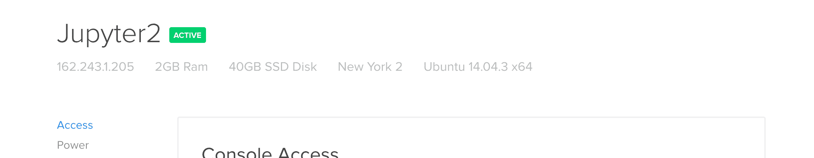
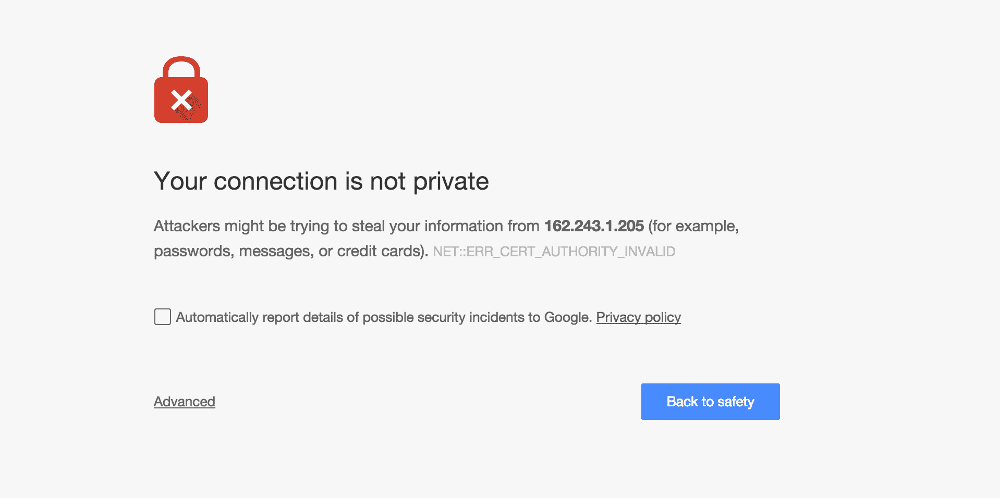
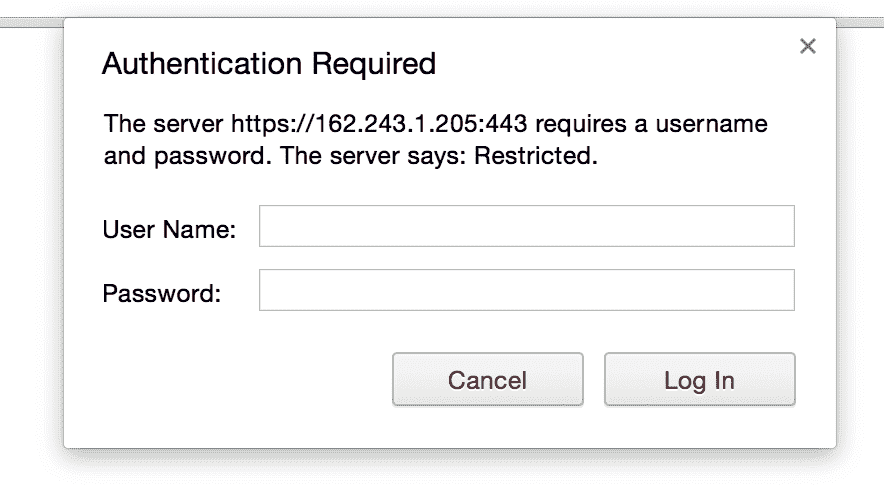
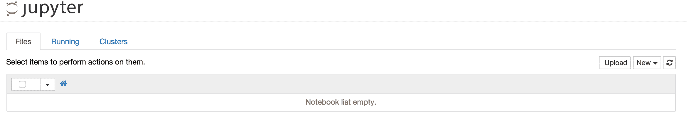

# 数字海洋和数据科学 Docker

> 原文：<https://www.dataquest.io/blog/digitalocean-docker-data-science/>

November 25, 2015

## 创建基于云的数据科学环境以加快分析速度

有时候，在本地机器上处理数据科学问题不再有用。也许你的电脑太旧了，不能处理更大的数据集。或者，您可能希望能够从任何地方访问您的工作，并与其他人协作。或者你有一个需要很长时间运行的分析，你不想占用你自己的电脑。

在这些情况下，在服务器上运行 Jupyter 很有用，这样就可以通过浏览器访问它。我们可以通过使用 [Docker](https://www.docker.com/) 轻松做到这一点。参见[我们之前的帖子](https://www.dataquest.io/blog/docker-data-science/)，了解如何使用 Docker 设置数据科学环境。这篇文章建立在那篇文章的基础上，并在服务器上设置了 Docker 和 Jupyter。

## 云托管

第一步是初始化服务器。你可以使用像亚马逊网络服务(T1)或 T2 数字海洋(T3)这样的网站来征用云中的服务器。这两家公司都是云托管提供商——他们有一个服务器池，并按小时出租给想要运行程序的人。

当您租用服务器时，您可以完全访问它，并且可以安装和运行程序，就像在本地计算机上一样。一个很好的理解服务器的方式是把它看作一台物理上位于其他地方的计算机。服务器没有什么特别的，它只是另一台运行操作系统的计算机，你可以通过互联网访问它。为了初始化我们的服务器，我们将使用 DigitalOcean，因为它比 Amazon Web Services 更便宜、更简单。

## 启动服务器

有了 DigitalOcean，启动服务器又快又简单。第一步，在这里注册一个账号[。第二步是创建一个 droplet，这是一个服务器的数字海洋术语。这里有一个关于如何做的很好的教程](https://www.digitalocean.com)。

当你浏览教程时，确保你选择了一个至少 2GB 内存的 droplet，选择 Ubuntu 14.04 64 位作为操作系统，并确保你按照本教程添加了一个 ssh 密钥。创建服务器后，请务必记下 IP 地址。创建服务器后，它应该在页面的左上方，看起来像`162.243.1.205`。此地址是您的服务器在互联网上的位置，您以后将使用它来访问它。

IP 地址应该在左上角

## 登录服务器

一旦服务器设置好了，你就可以通过 SSH 或者[安全 Shell](https://en.wikipedia.org/wiki/Secure_Shell) 登录了。SSH 允许您使用一个特殊的密钥远程登录到一台机器进行身份验证(您在前面的教程中生成了这个密钥)。登录后，您将可以访问服务器上的命令行。您可以像在本地计算机上一样执行命令。

见[本教程](https://www.digitalocean.com/community/tutorials/how-to-connect-to-your-droplet-with-ssh)关于如何 SSH 进入你的服务器。如果您得到一个认证错误，您可能需要首先添加正确的 SSH 密钥。您可以在 Linux 和 OSX 上使用`ssh-add`命令来完成这项工作。键入`ssh-add /home/vik/.ssh/id_rsa`(用您的密钥的路径替换`/home/vik/.ssh/id_rsa`)来添加正确的 ssh 密钥，并重试教程步骤以 ssh 到服务器。

## 创建新的用户帐户

我们目前作为`root`用户登录到服务器。该用户对系统上的所有内容都有完全访问权限。这对于初次登录来说没问题，但是当我们使用`root`用户安装软件时，可能会有安全问题。

我们将创建一个新用户，名为`ds`(数据科学的简称)。按照本教程创建一个新用户。记得使用用户名`ds`而不是`demo`，因为它在教程中。当您创建完一个新用户后，通过键入`exit`退出 SSH 会话。通过键入`ssh [[email protected]](/cdn-cgi/l/email-protection)_IP`，以新用户`ds`的身份再次登录服务器(用您的服务器的 IP 地址替换`SERVER_IP`)。

## 安装对接器

一旦您以用户`ds`的身份通过 ssh 连接到服务器，您应该会看到一个命令提示符。这个提示符将允许您执行任何 bash shell 命令，比如用`cd`来改变目录，用`mv`来移动文件。

服务器运行的是基于 Linux 的 Ubuntu 14.04。我们要做的第一件事是安装 Docker。按照这里的说明[在服务器上安装 Docker。确保在安装 Docker 后运行`sudo usermod -aG docker ds`，然后使用`exit`退出 ssh 会话，并使用`ssh`](https://docs.docker.com/linux/step_one/) `[[email protected]](/cdn-cgi/l/email-protection)_IP`返回 ssh。

## 创建笔记本目录

第二步是在机器上创建一个目录来保存您的笔记本文件。您应该以`ds`用户的身份登录，所以只需键入`mkdir -p /home/ds/notebooks`来创建笔记本目录。

## 下载适当的 Docker 映像

下一步是下载你想要的 Docker 镜像。以下是我们目前可用的数据科学图片:

*   `dataquestio/python3-starter` —这包含一个 python 3 安装、jupyter 笔记本和许多流行的数据科学库，如`numpy`、`pandas`、`scipy`、`scikit-learn`和`nltk`。
*   `dataquestio/python2-starter` —包含 python 2 安装、jupyter 笔记本和许多流行的数据科学库，如`numpy`、`pandas`、`scrapy`、`scipy`、`scikit-learn`和`nltk`。

您可以通过键入以下内容来下载图像

`docker pull IMAGE_NAME`。

## 启动容器

一旦下载了映像，您就可以用`docker run -d -p 8888:8888 -v /home/ds/notebooks:/home/ds/notebooks dataquestio/python3-starter`启动 Docker 容器。用您想要使用的图像名称替换`dataquestio/python3-starter`。一旦执行完毕，我们将在本地机器上的`8888`端口运行一个 Jupyter 服务器。

## 安装 nginx

[Nginx](https://www.nginx.com/) 是一个 HTTP 和反向代理服务器。这意味着它可以接收来自互联网的请求，并将它们传递给我们的 Jupyter 服务器。Nginx 可以使面向公众的 web 应用程序的安全性和其他方面变得更加容易。

我们需要做的第一件事是安装 nginx，这可以用`sudo apt-get install nginx`来完成。现在，您应该能够在浏览器的地址栏中键入您的服务器 IP 地址，并看到一条通用消息，上面写着“欢迎使用 nginx”。

## 设置证书

我们需要加密浏览器和 Jupyter 笔记本之间的流量。这将防止任何人截取我们来回发送的敏感数据或密码。为此，我们需要生成一个 [SSL 证书](https://www.globalsign.com/en/ssl-information-center/what-is-an-ssl-certificate/)。此证书使我们的浏览器能够建立到远程服务器的安全链接。

我们必须在我们的服务器上生成并安装证书。您可以按照本指南中的[步骤一进行操作。请确保指定您的服务器 IP 地址，而不是域名。确保在第一步之后停止——我们需要做一个不同的 nginx 配置。](https://www.digitalocean.com/community/tutorials/how-to-create-an-ssl-certificate-on-nginx-for-ubuntu-14-04)

## 创建密码

我们还会为 nginx 生成一个密码，这样只有你才能访问你的 Jupyter 笔记本。为此，我们将运行:

*   `sudo apt-get install apache2-utils`
*   `sudo htpasswd -c /etc/nginx/.htpasswd ds`
    *   在提示符下输入密码—您的用户名将是`ds`，您的密码将被设置为您在此处输入的值。

## 设置 nginx 配置

最后一步是设置 nginx 配置。首先，我们将通过键入`sudo rm /etc/nginx/sites-enabled/default`删除默认的 nginx 欢迎消息。然后，我们将创建自己的配置文件。类型`sudo nano /etc/nginx/sites-enabled/ds`。这将打开一个文本编辑器。将以下内容粘贴到文本编辑器中:

```
 server {
       listen
         80;
       return
         301 https://$host$request_uri;}
server {
    set $custom_host $host;
    listen 443 ssl;
    ssl_certificate /etc/nginx/ssl/nginx.crt;
    ssl_certificate_key /etc/nginx/ssl/nginx.key;
    client_max_body_size 10M;
    location / {
        proxy_set_header Host $custom_host;
        proxy_set_header X-Forwarded-For $proxy_add_x_forwarded_for;
        proxy_set_header X-Forwarded-Protocol $scheme;
        auth_basic "Restricted";
        auth_basic_user_file /etc/nginx/.htpasswd;
        proxy_http_version 1.1;
        proxy_set_header Upgrade $http_upgrade;
        proxy_set_header Connection "upgrade";
        proxy_set_header Origin "";
                proxy_pass https://127.0.0.1:8888;
    }} 
```

最后，点击关闭并保存文件

`Control + X`然后`Y`。然后，输入`sudo service nginx`重启 nginx。

## 尝试一下

现在，您可以在浏览器中访问您的服务器 IP 地址。你会被自动重定向到该网站的安全版本。你可能会看到这样一个屏幕(这是来自 Chrome):



这是因为我们使用了自签名 SSL 证书。大多数网站使用由证书颁发机构签署的证书，但这要花钱，我们不想把钱花在很少有人使用的网站上。

绕过这个屏幕保持与网站的连接——使用 Chrome，你可以通过点击`Advanced`，然后点击底部的`Proceed`来做到这一点。点按“继续”后，您将看到输入密码的提示。键入`ds`作为用户名，并输入您在前面步骤中为 nginx 设置的密码。

## 连接到服务器

您现在已经完成了所有需要的设置！您应该可以连接到 Jupyter 服务器，看起来像这样:

可以通过 Jupyter 接口上传下载数据文件和笔记本，应该可以开始在云端做数据科学了。

## 接下来的步骤

请阅读我们之前的帖子，了解如何安装新的软件包或修改 Docker 容器。如果你想建立我们在这篇文章中讨论的图片，你可以贡献给我们的 Github 库[这里](https://github.com/dataquestio/ds-containers)，其中包含 docker 文件。

我们欢迎对我们当前图像的改进，或者添加新的侧重于 Python 之外的工具的图像。如果你对学习数据科学感兴趣，请在 Dataquest 查看我们的[交互式数据科学课程](https://www.dataquest.io)。