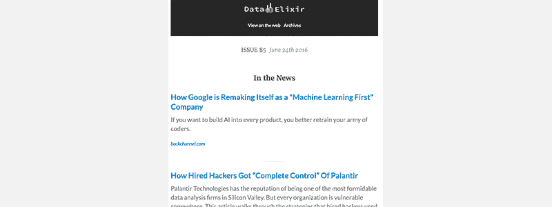
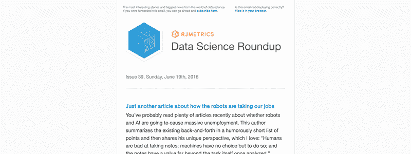
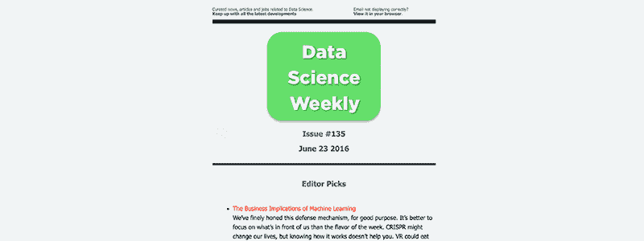
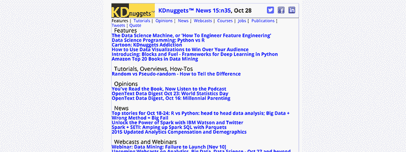
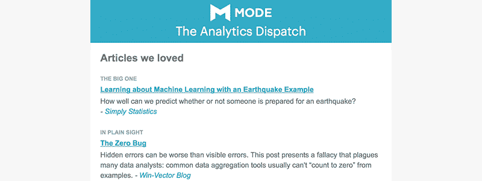
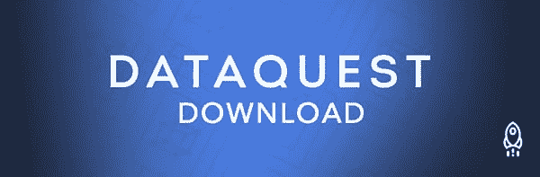

# 7 大数据科学简讯，让您随时了解最新信息

> 原文：<https://www.dataquest.io/blog/best-data-science-newsletters/>

June 24, 2016In a fast-paced and rapidly growing industry like data science, keeping up is essential. Knowing what is trending is essential in helping you know what new tools to learn, to help you get a job, and much more. At the same time, there is so much content out there that it can be hard to know what to read and easy to be overwhelmed. The solution is to turn to email newsletters, which can help you keep a handle on the latest news, tools and tutorials. These great newsletters give you everything you need to know to keep up with the world of data science. Their creators put in the hard work so that you don’t have to. Here are my picks for the seven best data science newsletters.

## 1.数据药剂

 Data Elixir 每周由 [Lon Reisberg](https://twitter.com/lonriesberg) 策划，这位自认是技术极客的人有着非常有声望的工作经历，包括为美国宇航局工作。自 2014 年以来，Data Elixir 每周五都会收到您的收件箱，一直在向数据爱好者发送最好的数据科学新闻和资源。Data Elixir 是一个很好的多面手，结合了新闻、观点和教程。Lon 还维护着一个数据科学工作委员会，并在每周的电子邮件中包含最新的工作列表。

*   [订阅数据药剂](https://dataelixir.com/)
*   [数据仙丹档案](https://dataelixir.com/issues)

## 2.数据科学综述

 数据科学综述最早由 RJMetrics 推出。最近，随着 RJMetrics 被拆分成两家不同的公司并出售,“综述”已经独立出来，由 Fishtown Analytics 和 Stitch 赞助。每个星期天，数据科学综述都会在周末休息时间阅读的最佳时间到达你的收件箱。DS Roundup 通常只包括四到五篇好文章，而不是提供一个广泛的文章列表。《数据科学综述》由特里斯坦·哈迪编辑，我最喜欢的是他对每篇文章的摘要。它说得很直白，很容易读懂，也意味着即使我没有时间读完每一篇文章，我仍然可以获得关键的要点。

*   [订阅数据科学综述](https://roundup.fishtownanalytics.com/)
*   [数据科学综述档案](https://roundup.fishtownanalytics.com/)(仅从第 47 期开始)

## 3.数据科学周刊

 自 2013 年以来，[汉娜·布鲁克斯](https://twitter.com/hrb_nyc)(商业战略专家)和[塞巴斯蒂安·古提耶雷兹](https://twitter.com/seb_g)(数据即& D3.js 忍者)一直在编写《数据科学周刊》，亲手挑选最优秀的文章，并在每周四上午发出。DSW 还进行一些精彩的[数据科学采访](https://www.datascienceweekly.org/data-scientist-interviews)，并在 twitter 上维护一份真正完整的[数据科学资源列表](https://www.datascienceweekly.org/data-science-resources)，包括书籍、聚会、数据集、博客和数据科学家。每期《数据科学周刊》都从编辑挑选的前一周的最佳文章开始，随后是更长的数据科学文章和教程列表，提供完美的平衡，帮助您掌握数据科学的脉搏。

*   [订阅数据科学周刊](https://www.datascienceweekly.org/)
*   [数据科学周刊档案](https://www.datascienceweekly.org/newsletters)

## 4.KDnuggets 新闻

KD nuggets 的淡黄色配色有一种美丽的安慰。KDnuggets 可能是所有数据科学网站中最全面的，由 [Gregory Piatetsky-Shapiro](https://twitter.com/kdnuggets) 精心维护了 20 多年。超过 649 期可以追溯到 1993 年 8 月 20 日的第一期，这无疑是我们列表中最古老的时事通讯。最初一个月出版两次，但现在每周三出版，KDnuggets News 是每周发布到 KDnuggets 的 30 多篇文章的汇编。KDnuggets news 纯粹是一个没有任何摘要的链接列表，但即使如此，它仍然是前一周发生的事情的最全面的综述之一，这使得它非常值得订阅。

*   [订阅 KDnuggets 新闻](https://www.kdnuggets.com/news/subscribe.html?1)
*   [KDnuggets 新闻档案](https://www.kdnuggets.com/news/archive.html)

## 5.奥莱利数据通讯

我记得我在 1996 年购买的第一本 O'Reilly 的书《Perl 编程》。许多数据科学家和软件工程师从 O'Reilly 出版物中学到了编程，它们独特的动物封面和质量被认为是首屈一指的。早在 20 世纪 80 年代，O'Reilly 就已经出版了关于数据的书籍，然而在过去的 6 年中，随着 Strata + Hadoop 世界大会的推出，O'Reilly 已经成为数据世界中的一个发电站。他们的每周数据简讯包含了来自 O'Reilly 自己和其他人的新闻、社论、操作方法和案例研究。我特别喜欢他们如何将一个特定新闻故事或专题的文章分组在一起，以提供一个平衡的视角。

*   [订阅奥莱利数据简讯](https://www.oreilly.com/data/newsletter.html)
*   *没有可用的档案*

## 6.分析调度

 自 2015 年 12 月起，分析派遣由[模式分析](https://modeanalytics.com/)策划。Mode 创建一个分析平台，允许您使用 SQL 和 Python 笔记本从几乎任何数据源创建报告和可视化。这是一款很棒的产品——我们在 Dataquest 中使用它进行我们自己的分析，并且非常喜欢它！(他们除了做出一个伟大的产品之外，没有做任何事情来获得这个褒奖)。每周一早上，分析调度会向你的收件箱发送大量关于数据的文章。由于他们所做的事情，这些文章往往涵盖更多的分析主题(包括大量的 SQL ),因此我发现它们非常实用——我总是从他们发布的文章中学到一些东西，可以改善我的日常工作。

*   [订阅分析分派](https://about.modeanalytics.com/newsletter/)
*   [分析调度](https://mode.com/analytics-dispatch/)

## 7.数据请求下载

当然，我不能漏掉我们自己的时事通讯，即 Dataquest 下载。每周一我们都会重点报道一些头条新闻，传递一些很棒的职业建议，并尝试用一些很酷的项目和有用的学习资源来激励你。你可以通过[注册一个免费的 Dataquest 账户](https://www.dataquest.io/)来订阅。当然，我们也有博客，这有点像一个巨大的通迅链接目录。以下是一些我们最喜欢和阅读量最大的帖子:

*   [如何实际学习数据科学](https://www.dataquest.io/blog/learn-data-science/)
*   [如何使用 Python 进入 Kaggle 比赛的前 15 名](https://www.dataquest.io/blog/kaggle-tutorial/)
*   [构建数据科学组合:用数据讲故事](https://www.dataquest.io/blog/data-science-portfolio-project/)
*   [Python & JSON:使用熊猫处理大型数据集](https://www.dataquest.io/blog/python-json-tutorial/)

要订阅，只需在页面底部的框中填写您的电子邮件。

## 我错过了什么吗？

你最喜欢的数据科学时事通讯是否不在列表中？

[联系](https://twitter.com/dataquestio)让我知道！