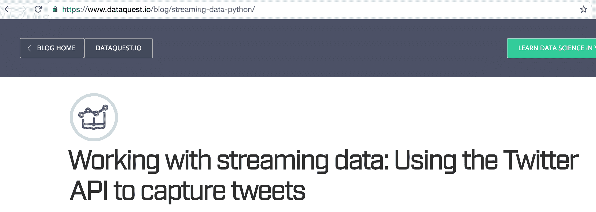
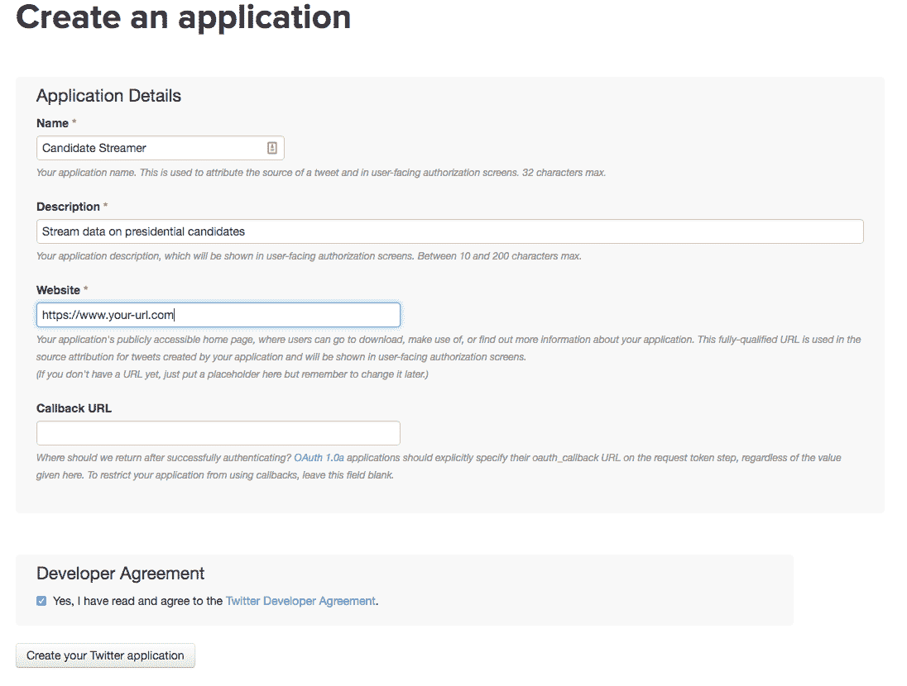

# 教程:在 Python 中使用流数据和 Twitter API

> 原文：<https://www.dataquest.io/blog/streaming-data-python/>

September 8, 2016

如果您做过任何数据科学或数据分析工作，您可能会读入 CSV 文件或连接到数据库并查询行。典型的数据分析工作流包括检索存储的数据，将其加载到分析工具中，然后对其进行研究。当您处理历史数据时，例如分析在线商店的客户最有可能购买什么产品，或者人们的饮食是否因广告而改变，这种方法非常有效。但是如果你想实时预测股票价格呢？或者弄清楚人们现在在看什么电视？

随着越来越多的数据生成，能够处理实时数据变得越来越重要。实时或流数据是连续生成的，在股票市场的情况下，每小时可以生成数百万行数据。由于大小和时间的限制，通常没有一个整洁的数据集可供您分析，您需要存储数据以供以后分析，或者在获得数据时进行实时分析。

对于任何有抱负的数据科学家来说，能够处理流数据是一项关键技能。在这个 Python API 教程中，我们将讨论处理流数据的策略，并通过一个例子来演示我们如何从 [Twitter](https://en.wikipedia.org/wiki/Twitter) 中传输和存储数据。

## 推特

对于那些不熟悉 Twitter 的人来说，它是一个社交网络，人们在这里发布简短的 140 个字符的状态消息，称为 tweets。因为推文是不断发出的，Twitter 是一个很好的方式来了解人们对时事的感受。在本帖中，我们将创建一个工具，让我们能够了解人们对美国总统候选人唐纳德·川普和[希拉里·克林顿](https://en.wikipedia.org/wiki/Hillary_Clinton)的看法。为此，我们需要:

*   从 Twitter API 流推文。
*   过滤掉不相关的推文。
*   处理推文，找出他们对每个候选人表达了什么情绪。
*   存储推文以供进一步分析。

我们会在文章中构建代码，但是如果你想看最终版本，你可以看这里的。

## 事件驱动编程

如前所述，在典型的数据分析工作流程中，您将:

*   打开一个 csv 文件。
*   迭代这些行。
*   发现见解并创建可视化。

该流程可能涉及如下脚本:

```
 import pandas
data = pandas.read_csv("products_sold.csv")
# Print out the mean selling price.
print(data["price"].mean())# Plot out the sale prices.data["price"].plot()
```

在上面的例子中，Python 解释器从我们程序的第一行开始，然后遍历它，直到完成。这被称为过程化编程，因为程序像过程一样以固定的顺序执行。

我们可以修改上面的程序来处理我们事先下载的一组推文:

```
import pandas
tweets = pandas.read_csv("tweets.csv")
# Get the emotion (sentiment) in each tweet.
# This is an example function that we'll assume is defined further up.
sentiment = tweets["text"].apply(get_sentiment)
# Plot out the sentiment in each tweet.sentiment.plot()
```

虽然处理一个 csv 格式的 tweets 文件很简单，但是我们如何修改这个程序来处理流媒体 tweets 还不清楚。对于流媒体推文，我们不会有一个好的 csv 文件——我们必须实时检索推文。要处理流媒体推文，我们需要:

*   打开到 Twitter API 的持久连接。
*   处理我们收到的每条微博。
*   存储处理后的推文。

为了实现这一点，我们需要使用一种叫做事件驱动编程的编程范式。在事件驱动编程中，程序根据外部输入执行动作。一个很好的例子是网络浏览器。网络浏览器可能由几个功能组成:

```
 def go_to_site(url):
# Given a url, visit the site. ...
def go_back():
# Go back to the last site. ...
def go_forward():
# Go forward to the next site (if applicable) ...
def reload():
# Reload the current page. ... 
```

当 web 浏览器加载时，它不做任何事情，而是等待用户采取行动。用户在地址栏中键入一个 URL 并按 enter 键将触发函数`go_to_site`，该函数将呈现该 URL 的内容。

在 web 浏览器中，一个函数可以被调用一次、多次，或者根本不被调用。这完全取决于用户做什么。该程序没有遵循一个过程，而是在等待外部操作。每个动作都可以被称为一个事件，这就是为什么这种编程风格是事件驱动的。功能可以绑定到事件(在这种情况下是用户按下按钮)。每个绑定到事件的函数都被称为该事件的*回调函数*。例如，在浏览器栏中输入一个 URL 被绑定到`go_to_site` *回调函数*，然后该函数访问该站点。点击后退按钮与`go_back` *回调函数*绑定，该函数访问上一个站点。



Chrome 浏览器的截图——你可以看到与每个回调函数相关的按钮。

在 web 浏览器的例子中，我们依靠用户来生成事件，但是我们也可以依靠其他程序来生成事件。比方说，我们有一个程序，它对 tweets 进行流式处理，然后调用我们的程序来处理它们。我们的程序中只需要几个函数:

```
 def filter_tweet(tweet):
# Remove any tweets that don't match our criteria.
    if not tweet_matches_criteria(tweet):
        return
# Process the remaining tweets.
process_tweet(tweet)
def process_tweet(tweet):
# Annotate the tweet dictionary with any other information we need.
    tweet["sentiment"] = get_sentiment(tweet)
# Store the tweet.
store_tweet(tweet)
def store_tweet(tweet):
# Saves a tweet for later processing. ...
```

我们设置了一个独立的程序来实时获取推文——我们称之为`streamer`。我们将`filter_tweet`注册为对`streamer`的回调，因此每次收到新的 tweet 时都会调用`filter_tweet`。我们可以决定是否要处理这条推文，然后调用`process_tweet`和`store_tweet`来处理这条推文。

## Twitter 流媒体应用编程接口

为了使实时推文的工作变得容易，Twitter 提供了 [Twitter 流 API](https://dev.twitter.com/streaming/overview) 。关于如何从 Twitter 上传推文，有很多规则，但主要的有:

*   创建到 Twitter API 的持久连接，并增量读取每个连接。
*   快速处理推文，不要让你的程序出现备份。
*   正确处理错误和其他问题。

在所有主流编程语言中，Twitter 流 API 都有各种各样的客户端。对于 Python，有不少，你可以在这里找到[。最受欢迎的是](https://dev.twitter.com/resources/twitter-libraries) [tweepy](https://github.com/tweepy/tweepy) ，它允许你连接到流式 API 并正确处理错误。

虽然 tweepy 为我们处理了处理流的大部分后勤工作，但我们还是要看一看幕后发生了什么。

### 打开连接

第一步是打开到 Twitter 流 API 的连接。这涉及到打开一个持久的 HTTP 连接。Tweepy 使用下面的代码段来实现这一点，您可以在这里找到:

```
resp = self.session.request('POST',
    url,
    data=self.body,
    timeout=self.timeout,
    stream=True,
    auth=auth,
    verify=self.verify)
```

上面的代码段使用 python [requests](https://2.python-requests.org/en/latest/) 库发出请求，并传递了`stream=True`关键字参数以保持连接永远打开。每当 Twitter 上创建新的推文时，它都会通过连接将推文发送到我们的程序。

您可能会注意到上面的`url`参数。我们可以通过点击 [firehose.json](https://dev.twitter.com/streaming/overview) API 端点来收集 Twitter 上生成的所有推文。然而，一次收集所有的推文会让我们的电脑不堪重负，因为每分钟有几十万条推文。这种访问也受到限制，不是每个人都可以访问消防软管数据。我们将不得不访问 [filter.json](https://dev.twitter.com/streaming/reference/post/statuses/filter) API 端点。这个 API 端点接受一个字符串列表，然后在 tweets 中搜索这些字符串。你得到的不是所有的 tweets，而是经过过滤的子集，这使得你的本地机器更容易处理它们。

您可能还注意到了上面的`auth`关键字参数。Twitter 流 API 需要认证。您需要创建一个开发者帐户，然后将您的凭据传递给 tweepy，这样 tweepy 就可以将它们传递给 Twitter。我们将在后面的小节中介绍如何做到这一点。

### 收听推文

一旦我们打开一个连接，我们将需要监听通过该连接传来的推文。Twitter 通过连接以纯文本形式发送数据，如下所示:

```
HTTP/1.1 200 OK
Content-Type: application/json
Transfer-Encoding: chunked
1953
{"retweet_count":0,"text":"Man I like me some @twitterapi","entities":{"urls":[],"hashtags":[],"user_mentions":[{"indices":[19,30],"name":"Twitter API","id":6253282,"screen_name":"twitterapi","id_str":"6253282"}]},"retweeted":false,"in_reply_to_status_id_str":null,"place":null,"in_reply_to_user_id_str":null,"coordinates":null,"source":"web","in_reply_to_screen_name":null,"in_reply_to_user_id":null,"in_reply_to_status_id":null,"favorited":false,"contributors":null,"geo":null,"truncated":false,"created_at":"Wed Feb 29 19:42:02 +0000 2012","user":{"is_translator":false,"follow_request_sent":null,"statuses_count":142,"profile_background_color":"C0DEED","default_profile":false,"lang":"en","notifications":null,"profile_background_tile":true,"location":"","profile_sidebar_fill_color":"ffffff","followers_count":8,"profile_image_url":"http:\/\/a1.twimg.com\/profile_images\/1540298033\/phatkicks_normal.jpg","contributors_enabled":false,"profile_background_image_url_https":"https:\/\/si0.twimg.com\/profile_background_images\/365782739\/doof.jpg","description":"I am just a testing account, following me probably won't gain you very much","following":null,"profile_sidebar_border_color":"C0DEED","profile_image_url_https":"https:\/\/si0.twimg.com\/profile_images\/1540298033\/phatkicks_normal.jpg","default_profile_image":false,"show_all_inline_media":false,"verified":false,"profile_use_background_image":true,"favourites_count":1,"friends_count":5,"profile_text_color":"333333","protected":false,"profile_background_image_url":"http:\/\/a3.twimg.com\/profile_background_images\/365782739\/doof.jpg","time_zone":"Pacific Time (US & Canada)","created_at":"Fri Sep 09 16:13:20 +0000 2011","name":"fakekurrik","geo_enabled":true,"profile_link_color":"0084B4","url":"http:\/\/blog.roomanna.com","id":370773112,"id_str":"370773112","listed_count":0,"utc_offset":-28800,"screen_name":"fakekurrik"},"id":174942523154894848,"id_str":"174942523154894848"}
```

前几行是 HTTP 连接头，我们可以忽略，因为它们只在建立连接时使用。一旦我们建立了连接，我们将得到一系列数字和 [JSON](https://en.wikipedia.org/wiki/JSON) 编码的推文。这些数字表明 tweet 数据正在通过连接发送，并告诉程序要从连接中读取多少字节才能获得 tweet 数据。在这种情况下，`1953`是在 tweet 结束之前从流中读取的字节数。读取下一个`1953`字节将为我们获取 tweet 的数据。

如您所见，数据不仅包含推文文本，还包含发送者、关注者数量和其他元数据的信息。这些数据是 JSON 格式的，可以使用 Python `json`库读取和处理。随着越来越多的 tweet 从 Twitter API 发送给我们，它们将遵循类似的格式，一行的长度以字节为单位，下一行是 tweet 的数据。所有的推文将通过相同的持久连接发送。

例如，随着我们处理更多的推文，我们可能会在我们的流中看到更多的推文，如下所示:

```
HTTP/1.1 200 OK
Content-Type: application/json
Transfer-Encoding: chunked
1953
{"retweet_count":0,"text":"Man I like me some @twitterapi","entities":{"urls":[],"hashtags":[],"user_mentions":[{"indices":[19,30],"name":"Twitter API","id":6253282,"screen_name":"twitterapi","id_str":"6253282"}]},"retweeted":false,"in_reply_to_status_id_str":null,"place":null,"in_reply_to_user_id_str":null,"coordinates":null,"source":"web","in_reply_to_screen_name":null,"in_reply_to_user_id":null,"in_reply_to_status_id":null,"favorited":false,"contributors":null,"geo":null,"truncated":false,"created_at":"Wed Feb 29 19:42:02 +0000 2012","user":{"is_translator":false,"follow_request_sent":null,"statuses_count":142,"profile_background_color":"C0DEED","default_profile":false,"lang":"en","notifications":null,"profile_background_tile":true,"location":"","profile_sidebar_fill_color":"ffffff","followers_count":8,"profile_image_url":"http:\/\/a1.twimg.com\/profile_images\/1540298033\/phatkicks_normal.jpg","contributors_enabled":false,"profile_background_image_url_https":"https:\/\/si0.twimg.com\/profile_background_images\/365782739\/doof.jpg","description":"I am just a testing account, following me probably won't gain you very much","following":null,"profile_sidebar_border_color":"C0DEED","profile_image_url_https":"https:\/\/si0.twimg.com\/profile_images\/1540298033\/phatkicks_normal.jpg","default_profile_image":false,"show_all_inline_media":false,"verified":false,"profile_use_background_image":true,"favourites_count":1,"friends_count":5,"profile_text_color":"333333","protected":false,"profile_background_image_url":"http:\/\/a3.twimg.com\/profile_background_images\/365782739\/doof.jpg","time_zone":"Pacific Time (US & Canada)","created_at":"Fri Sep 09 16:13:20 +0000 2011","name":"fakekurrik","geo_enabled":true,"profile_link_color":"0084B4","url":"http:\/\/blog.roomanna.com","id":370773112,"id_str":"370773112","listed_count":0,"utc_offset":-28800,"screen_name":"fakekurrik"},"id":174942523154894848,"id_str":"174942523154894848"}
2154
{"retweet_count":1,"text":"What's a tweet?","entities":{"urls":[],"hashtags":[],"user_mentions":[{"indices":[19,30],"name":"Twitter API","id":6253282,"screen_name":"twitterapi","id_str":"6253282"}]},"retweeted":false,"in_reply_to_status_id_str":null,"place":null,"in_reply_to_user_id_str":null,"coordinates":null,"source":"web","in_reply_to_screen_name":null,"in_reply_to_user_id":null,"in_reply_to_status_id":null,"favorited":false,"contributors":null,"geo":null,"truncated":false,"created_at":"Wed Feb 29 19:42:02 +0000 2012","user":{"is_translator":false,"follow_request_sent":null,"statuses_count":142,"profile_background_color":"C0DEED","default_profile":false,"lang":"en","notifications":null,"profile_background_tile":true,"location":"","profile_sidebar_fill_color":"ffffff","followers_count":8,"profile_image_url":"http:\/\/a1.twimg.com\/profile_images\/1540298033\/phatkicks_normal.jpg","contributors_enabled":false,"profile_background_image_url_https":"https:\/\/si0.twimg.com\/profile_background_images\/365782739\/doof.jpg","description":"I am just a testing account, following me probably won't gain you very much","following":null,"profile_sidebar_border_color":"C0DEED","profile_image_url_https":"https:\/\/si0.twimg.com\/profile_images\/1540298033\/phatkicks_normal.jpg","default_profile_image":false,"show_all_inline_media":false,"verified":false,"profile_use_background_image":true,"favourites_count":1,"friends_count":5,"profile_text_color":"333333","protected":false,"profile_background_image_url":"http:\/\/a3.twimg.com\/profile_background_images\/365782739\/doof.jpg","time_zone":"Pacific Time (US & Canada)","created_at":"Fri Sep 09 16:13:20 +0000 2011","name":"fakekurrik","geo_enabled":true,"profile_link_color":"0084B4","url":"http:\/\/blog.roomanna.com","id":370773112,"id_str":"370773112","listed_count":0,"utc_offset":-28800,"screen_name":"fakekurrik"},"id":174942523154894848,"id_str":"174942523154894848"}
```

### 呼叫回拨

一旦 tweepy 解码了 tweepy 数据，它就将数据传递给一个预先注册的回调函数。你可以在这里看到它的代码[，我们将复制下面的一部分:](https://github.com/tweepy/tweepy/blob/master/tweepy/streaming.py#L296)

```
def _data(self, data):
    if self.listener.on_data(data) is False:
        self.running = False 
```

`self.listener`实际上是一个用户定义类的实例，它有一个名为`on_data`的方法。`on_data`处理推文，然后返回`True`或`False`。如果`on_data`返回`True`，它处理了 tweet，一切正常。如果`on_data`返回`False`，连接将被关闭。

我们将在`listener`中放置我们的自定义代码来处理 tweet，然后返回适当的状态(`True`或`False`)。

### 速率限制和其他问题

Twitter 流媒体 API 有[速率限制](https://dev.twitter.com/streaming/overview/connecting)，禁止太多太快的连接尝试。它还防止使用相同的授权密钥建立太多的连接。谢天谢地，tweepy 为我们处理了这些细节，我们可以专注于我们的程序。

我们需要注意的主要事情是我们正在处理的推文队列。如果我们花太长时间处理推文，它们将开始排队，Twitter 可能会断开我们的连接。这意味着处理每条推文的速度必须非常快。

## 设置 Tweepy

既然我们已经了解了 Twitter 上的推文流是如何工作的，我们可以继续设置 tweepy 来开始流数据。我们需要做的第一件事是访问 [Twitter 开发者中心](https://dev.twitter.com/)并创建一个开发者账户。这个帐户将使我们能够创建凭据，让我们通过 Twitter 流 API 进行身份验证。

创建帐户后，我们可以转到[应用程序控制台](https://apps.twitter.com)，创建一个新的 Twitter 应用程序。这将让我们获得特定于应用程序的凭证，这将让我们连接到 API。



填写所有的值来创建一个 Twitter 应用程序。

正如你在上面的截图中所看到的，你需要将“回拨 URL”字段留空。在“网站”字段中填写一个网站(如果有)，否则您可以输入一个占位符值，如`https://www.site.com`。

创建应用程序后，您可以单击“密钥和访问令牌”选项卡来获取凭据。您需要从“应用程序设置”下获取以下信息:

*   `Consumer Key (API Key)` —我们称之为`TWITTER_APP_KEY`。
*   `Consumer Secret (API Secret)` —我们称之为`TWITTER_APP_SECRET`。

您还需要在“您的访问令牌”下执行以下操作:

*   单击“创建我的访问令牌”
*   得到名为`Access Token`的值—我们称之为`TWITTER_KEY`。
*   得到名为`Access Token Secret`的值—我们称之为`TWITTER_SECRET`。

我们可以用下面的代码设置 tweepy 向 Twitter 认证:

```
 auth = tweepy.OAuthHandler(TWITTER_APP_KEY, TWITTER_APP_SECRET)
auth.set_access_token(TWITTER_KEY, TWITTER_SECRET)
```

然后，我们可以创建一个 [API](https://github.com/tweepy/tweepy/blob/master/tweepy/api.py#L18) 对象来从 Twitter 获取数据——我们将传递身份验证:

```
api = tweepy.API(auth)
```

## 设置监听器

正如我们上面提到的，使用 tweepy 打开 Twitter 流需要一个用户定义的`listener`类。我们需要子类化 [StreamListener](https://github.com/tweepy/tweepy/blob/master/tweepy/streaming.py#L30) 类，并实现一些自定义逻辑。`StreamListener`类有一个叫做`on_data`的方法。这个方法会自动算出 Twitter 发送的是什么类型的数据，并调用合适的方法来处理具体的数据类型。它可以处理像用户发送直接消息、推文被删除等事件。目前，我们只关心用户何时发布推文。因此，我们需要覆盖 [on_status](https://github.com/tweepy/tweepy/blob/master/tweepy/streaming.py#L87) 方法:

```
 class StreamListener(tweepy.StreamListener):
def on_status(self, status):
    print(status.text)
```

上面的代码将创建一个监听器，它打印来自 Twitter API 的任何 tweet 的文本。

我们还需要覆盖`StreamListener`的 [on_error](https://github.com/tweepy/tweepy/blob/master/tweepy/streaming.py#L118) 方法，这样我们就可以正确处理来自 Twitter API 的错误。如果我们受到速率限制，Twitter API 将发送一个 [420 状态码](https://dev.twitter.com/streaming/overview/connecting)。如果发生这种情况，我们会想要断开连接。如果是其他错误，我们会继续:

```
 class StreamListener(tweepy.StreamListener):
    def on_status(self, status):
        print(status.text)
    def on_error(self, status_code):
        if status_code == 420:
            return False
```

## 启动监听器

一旦我们设置好监听器，我们就准备好连接所有东西，并传输提到`Donald Trump`或`Hillary Clinton`的 tweets。

在下面的代码段中，我们将:

*   创建我们的`StreamListener`类的一个实例。
*   创建 tweepy [Stream](https://github.com/tweepy/tweepy/blob/master/tweepy/streaming.py#L187) 类的一个实例，它将对 tweepy 进行流式传输。
    *   我们传递我们的认证凭证(`api.auth`)，以便 Twitter 允许我们连接。
    *   我们传入我们的`stream_listener`,以便我们的回调函数被调用。
*   通过调用[过滤器](https://github.com/tweepy/tweepy/blob/master/tweepy/streaming.py#L423)方法开始传输推文。这将开始从`filter.json` API 端点传输推文，并将它们传递给我们的监听器回调。
    *   按照 API 的要求，我们传入一个要过滤的术语列表。

```
stream_listener = StreamListener()
stream = tweepy.Stream(auth=api.auth, listener=stream_listener)
stream.filter(track=["trump", "clinton", "hillary clinton", "donald trump"])
```

一旦我们设置好了，我们就有了一个简单的 Twitter 流！它不会做太多(只是打印出所有提到希拉里·克林顿或唐纳德·特朗普的推文的文本)，但我们用很少的代码完成了很多工作。

## 过滤事件

我们想看看人们对每位总统候选人的看法。这意味着我们想忽略转发。转发出现在来自 Twitter API 的数据流中，但相同的文本可能会出现数百次或数千次。这将扭曲我们的结果，因为一个人的推文将在我们的分析中被有效地计数成千上万次。传递给`on_status`方法的 tweet 是[状态](https://docs.tweepy.org/en/v3.5.0/api.html#status-methods)类的一个实例。这个类有描述 tweet 的属性，包括属性`retweeted_status`，它告诉我们 tweet 是否是 retweet。我们可以通过检查`retweeted_status`属性来过滤掉转发。在下面的代码中，我们:

*   修改`on_status`函数来过滤掉转发。
    *   如果`retweeted_status`属性存在，那么不处理 tweet。
    *   打印所有没有转发的推文。

```
 def on_status(self, status):
    if status.retweeted_status:
        return
print(status.text)
```

到目前为止，我们已经使用了 tweet 的`text`属性和`retweeted_status`属性。你可以在这里找到可用属性的完整列表[。这些值来自 Twitter API，然后 tweepy 将它们设置为`Status`类实例的属性。我们可以通过使用以下字段来执行额外的过滤:](https://dev.twitter.com/overview/api/tweets)

*   一条推文被转发的次数。
*   这条推文在某些国家被禁止发布。
*   `favorite_count` —该推文被其他用户收藏的次数。

例如，下面的代码将过滤掉收藏少于`10`的任何推文:

```
 def on_status(self, status):
    if status.favorite_count is None or status.favorite_count < 10:
        return
print(status.text)
```

## 提取信息

因为我们必须快速处理推文，所以在保存之前，我们不想做任何太密集的事情。我们主要想提取和存储我们想要的属性。因为我们对分析支持`Hillary Clinton`或`Donald Trump`的人的情绪感兴趣，所以有几个领域会让我们感兴趣:

*   用户的描述(`status.user.description`)。这是创建该推文的用户在他们的传记中写的描述。
*   用户的位置(`status.user.location`)。这是创建推文的用户在他们的传记中写的位置。
*   用户的屏幕名称(`status.user.screen_name`)。
*   创建用户帐户的时间(`status.user.created_at`)。
*   用户有多少关注者(`status.user.followers_count`)。
*   用户为其个人资料选择的背景颜色(`status.user.profile_background_color`)。
*   推文的文本(`status.text`)。
*   Twitter 分配给 tweet 的唯一 id(`status.id_str`)。
*   推文发送的时间(`status.created_at`)。
*   该推文被转发了多少次(`status.retweet_count`)。
*   推文的坐标(`status.coordinates`)。推文发送的地理坐标。

这些属性将使我们能够分析有趣的事情，比如拥有更多追随者的用户是否支持`Trump`或`Clinton`。

我们可以用`on_status`方法提取这些信息:

```
 description = status.user.description
loc = status.user.location
text = status.text
coords = status.coordinates
name = status.user.screen_name
user_created = status.user.created_at
followers = status.user.followers_count
id_str = status.id_str
created = status.created_at
retweets = status.retweet_count
bg_color = status.user.profile_background_color
```

## 处理推文

因为我们对支持两位总统候选人的人的情绪感兴趣，所以我们想分析每条推文的文本，以找出它表达的情绪。例如，这将告诉我们人们是否经常在推特上发布关于`Hillary Clinton`的正面消息。我们可以使用一种叫做情感分析的方法，给每条推文加上一个情感分数，从`-1`到`1`。一条`-1`意味着这条推文非常负面一条`0`是中性的，一条`1`意味着这条推文非常正面。情感分析工具通常通过查看字符串中是否出现已知表示消极和积极情感的单词来生成该分数。例如，如果单词`hate`出现在字符串中，它更有可能是负数。因为情感分析本质上是字符串匹配，所以它的工作速度非常快，这对我们来说很重要，因为我们处理的时间越长，我们就越有可能在处理推文时落后和断开连接。

为了执行情感分析，我们可以使用一个名为 [TextBlob](https://textblob.readthedocs.io/en/dev/index.html) 的库，它允许我们在 Python 中进行情感分析，以及其他自然语言处理任务。

以下代码将:

*   在 tweet 的文本上初始化 [TextBlob](https://textblob.readthedocs.io/en/dev/api_reference.html#textblob.blob.TextBlob) 类。
*   从班级中获取情绪得分。

```
 blob = TextBlob(text)
sent = blob.sentiment
```

一旦我们有了`sent`对象，我们需要从中提取`polarity`和`subjectivity`。`polarity`是推文的负面或正面，用`-1`到`1`来衡量。`subjectivity`是指推文的客观或主观程度。`0`表示推文非常客观，`1`表示非常主观。为此，我们只需访问属性:

```
 polarity = sent.polarity
subjectivity = sent.subjectivity
```

## 存储推文

一旦我们在每条 tweet 上获得了我们想要的所有数据，我们就准备存储这些数据以供以后处理。可以将我们的数据存储在 csv 文件中，但是 csv 文件使得查询数据变得困难。如果我们想从一个 csv 文件中读取，我们要么必须加载整个文件，要么通过一个复杂的过程来查询并只加载我们想要的部分。

存储数据的好地方是数据库。因为它们是常用的并且易于查询，所以我们将使用关系数据库。SQLite 是最容易使用的主要关系数据库，因为它不需要运行任何进程，所有东西都存储在一个文件中。

为了访问数据库，我们将使用[数据集](https://dataset.readthedocs.io/en/latest/)包，这使得访问数据库和存储数据变得极其简单。我们不是创建数据库和表，而是简单地存储数据，`dataset`包会自动创建数据库和我们需要的所有表。

我们必须首先使用连接字符串连接到我们的数据库:

```
 import dataset
db = dataset.connect("sqlite:///tweets.db")
```

当使用 SQLite 时，如果数据库文件(在本例中为`tweets.db`)不存在，它将自动在当前文件夹中创建。

然后，我们必须将我们的坐标 json 字典转储到一个字符串中，这样我们就可以存储它:

```
 if coords is not None:
    coords = json.dumps(coords)
```

最后，我们可以在`on_status`方法中添加代码，将 tweet 写入数据库:

```
 table = db["tweets"]
table.insert(dict(
    user_description=description,
    user_location=loc,
    coordinates=coords,
    text=text,
    user_name=name,
    user_created=user_created,
    user_followers=followers,
    id_str=id_str,
    created=created,
    retweet_count=retweets,
    user_bg_color=bg_color,
    polarity=sent.polarity,
    subjectivity=sent.subjectivity,))
```

我们现在能够将我们处理过的每条推文写入数据库。一旦它们进入数据库，就可以很容易地被查询，或者转储到 csv 以供进一步分析。

## 将所有东西连接在一起

我们现在已经拥有了从 Twitter API 传输数据所需的所有部分！我们只需要将所有内容放在一个文件中，就可以从命令行运行了。这将使我们能够想看多久就看多久。你可以在这里看一下执行流[的最终程序。这个程序可以通过输入`python scraper.py`来运行，之后它将永远运行，流式传输推文，处理它们，并保存到磁盘上。您可以使用`Ctrl+C`来停止程序。](https://github.com/dataquestio/twitter-scrape/blob/master/scraper.py)

我们希望将我们使用过的一些常量(比如数据库连接字符串、我们的数据库名称和我们的 Twitter 键)分离到一个单独的文件中，名为`settings.py`，这样它们就很容易更改。下面是`settings.py`的默认内容:

```
 TRACK_TERMS = ["trump", "clinton", "hillary clinton", "donald trump"]
CONNECTION_STRING = "sqlite:///tweets.db"
CSV_NAME = "tweets.csv"
TABLE_NAME = "tweets"
```

这里可以看到设置文件[。](https://github.com/dataquestio/twitter-scrape/blob/master/settings.py)

你可以在这里阅读运行代码的完整说明[。](https://github.com/dataquestio/twitter-scrape/blob/master/README.md)

## 分析推文

如果我们想在存储后分析推文，我们需要编写额外的代码来查询数据库。我们也可以使用`datasets`包来完成这项工作。

例如，下面的代码将从我们的数据库中查询所有的 tweets:

```
 db = dataset.connect("sqlite:///tweets.db")
result = db["tweets"].all() 
```

一旦我们有了一组结果，我们就可以处理它们，或者将它们存储到一个 csv 文件中，如下例所示:

```
 dataset.freeze(result, format='csv', filename=settings.CSV_NAME)
```

你可以在这里看到一个程序的代码，该程序将所有现有的推文转储到一个 csv 文件[。你可以用`python dump.py`从命令行运行这个程序。](https://github.com/dataquestio/twitter-scrape/blob/master/dump.py)

## 后续步骤

我们在这篇文章中已经介绍了很多！我们开发了一个程序，可以从 Twitter 上传推文，对其进行注释，并将其存储到数据库中。既然您已经掌握了事件驱动编程，并且使用了流数据，我们就可以开始分析 tweets 了。[这里有一个使用流媒体推特来描绘美国人对选举中每个候选人的感受的例子。](https://www.dataquest.io/blog/matplotlib-tutorial/)

就你自己而言，这里有几个你可能想尝试使用 Twitter 流媒体工具的项目:

*   流式[股市数据](http://www.nasdaq.com/quotes/real-time.aspx)。
*   收集[实时天气数据](https://alerts.weather.gov/)。
*   将服务器日志数据流式传输到一个集中的收集点。
*   使用[实时美国飞行数据](https://web.archive.org/web/20180912213708/http://services.faa.gov:80/docs/services/airport/)。

如果您有兴趣了解更多关于使用流数据和数据管道的信息，您可以查看我们的 Data quest[Data Engineer Path](https://www.dataquest.io/path/data-engineer)。

## 获取免费的数据科学资源

免费注册获取我们的每周时事通讯，包括数据科学、 **Python** 、 **R** 和 **SQL** 资源链接。此外，您还可以访问我们免费的交互式[在线课程内容](/data-science-courses)！

[SIGN UP](https://app.dataquest.io/signup)