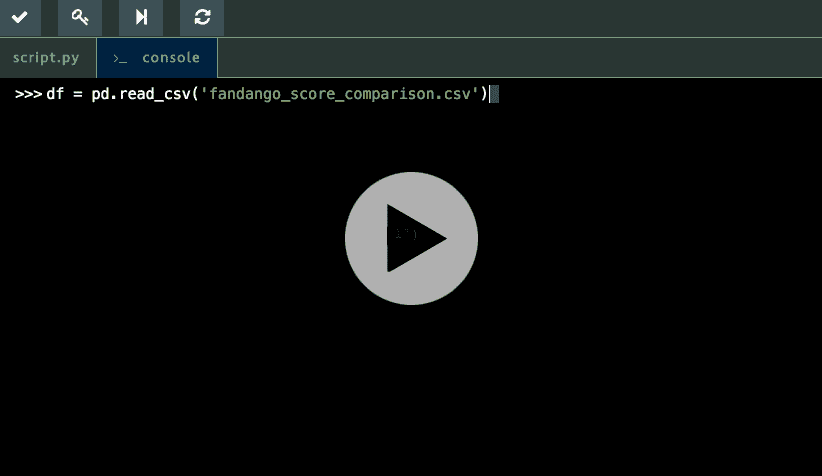
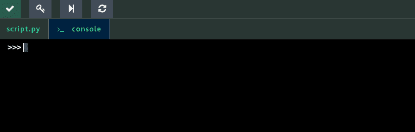
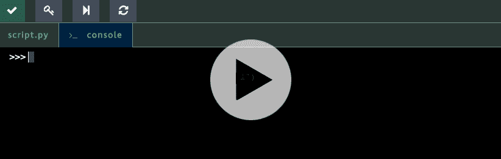
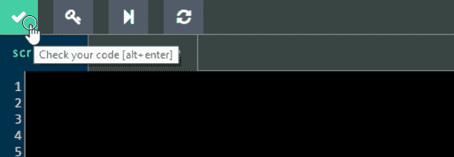
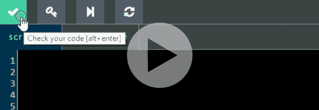

# Dataquest v1.9 的新特性:控制台、热键等等！

> 原文：<https://www.dataquest.io/blog/whats-new-v1-9-console-hotkeys/>

November 4, 2016Whenever you send us feedback or an ideas for a feature, we read and catalogue your suggestions. We then use this to help planning features and improvements for Dataquest. Today we’re excited to launch two of our most-requested features: **Hotkeys** and a **Python Console**.

## Python 控制台简介

你们中的许多人告诉我们，你们希望能够在学习课程的同时探索数据集。为了帮助您做到这一点，我们在课程界面中引入了 Python 控制台。使用控制台，您可以在学习课程的同时轻松浏览和清理数据，帮助您更快地工作并更好地理解数据集的内容:

 

您还可以使用它来访问文档字符串，这样您就可以获得语法方面的帮助，而不必搜索文档:

我们对这一特性感到兴奋，并计划随着时间的推移不断改进 Python 控制台。请让我们知道你的想法！

## 热键让您工作更快

我们提供了四种新的键盘快捷键，您可以使用它们来加快工作速度:

*   校验码:`alt` + `enter`。
*   将您的代码恢复到初始状态:`alt` + `r`
*   向前跳到下一步:`alt` + `p`
*   在代码框和控制台之间切换:`alt` + `t`

对于 mac 上的上述每个快捷键，请替换

`alt`同`option`。如果您忘记了快捷方式，您可以将鼠标悬停在按钮上来显示工具提示:

## 1.9 版本中的新功能

今天版本中的完整功能列表如下:

*   热键
*   Python 控制台
*   地块检查的改进
*   Dataquest 个人资料页面的全新设计— [立即查看](https://app.dataquest.io/login?target-url=%2Fprofile)(您需要登录)。
*   修正了一个导致 NumPy 对象答案检查问题的错误
*   各种性能改进和小的错误修复

立即体验新功能！

## 下一步我们应该建造什么？

来自用户的反馈对我们来说非常重要——我们很想知道您对我们下一步应该做什么的看法。如果你有一个想法，你可以

[给我们发电子邮件](/cdn-cgi/l/email-protection#345c5158585b745055405545415147401a5d5b)或[在 Twitter 上联系](https://twitter.com/dataquestio)！