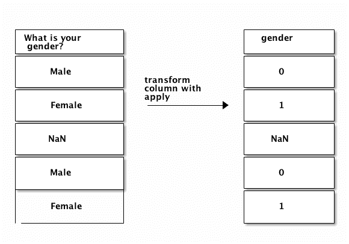
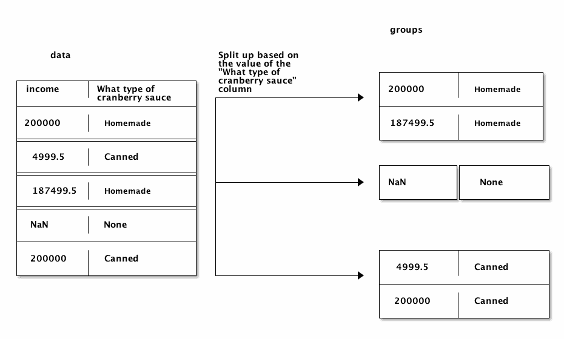
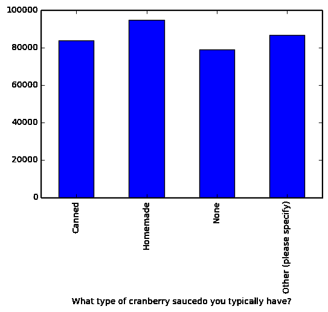

# 熊猫教程:用 Python 进行数据分析:第 2 部分

> 原文：<https://www.dataquest.io/blog/pandas-tutorial-python-2/>

December 2, 2016We covered a lot of ground in [Part 1 of our pandas tutorial](https://www.dataquest.io/blog/pandas-python-tutorial/). We went from the basics of pandas DataFrames to indexing and computations. If you’re still not confident with Pandas, you might want to check out the [Dataquest pandas Course](https://www.dataquest.io/course/python-for-data-science-intermediate/). In this tutorial, we’ll dive into one of the most powerful aspects of pandas — its grouping and aggregation functionality. With this functionality, it’s dead simple to compute group summary statistics, discover patterns, and slice up your data in various ways. Since Thanksgiving was just last week, we’ll use a dataset on what Americans typically eat for Thanksgiving dinner as we explore the pandas library. You can download the dataset [here](https://github.com/fivethirtyeight/data/tree/master/thanksgiving-2015). It contains `1058` online survey responses collected by [FiveThirtyEight](https://fivethirtyeight.com/). Each survey respondent was asked questions about what they typically eat for Thanksgiving, along with some demographic questions, like their gender, income, and location. This dataset will allow us to discover regional and income-based patterns in what Americans eat for Thanksgiving dinner. As we explore the data and try to find patterns, we’ll be heavily using the grouping and aggregation functionality of pandas. 

我们非常喜欢美国的感恩节晚餐。请注意，我们将使用 [Python 3.5](https://www.python.org/downloads/release/python-350/) 和 [Jupyter Notebook](https://jupyter.org/) 来做我们的分析。

## 读入并汇总数据

我们的第一步是读入数据，做一些初步的探索。这将帮助我们弄清楚我们想要如何创建群体和寻找模式。您可能还记得本教程的第一部分，我们可以使用

[pandas.read_csv](https://pandas.pydata.org/pandas-docs/stable/generated/pandas.read_csv.html) 功能。数据是使用`Latin-1`编码存储的，因此我们还需要指定`encoding`关键字参数。如果我们不这样做，pandas 将无法加载数据，我们将得到一个错误:

```
import pandas as pd
data = pd.read_csv("thanksgiving-2015-poll-data.csv", encoding="Latin-1")
data.head()
```

|  | 船货抵押借款 | 你庆祝感恩节吗？ | 感恩节晚餐的典型主菜是什么？ | 感恩节晚餐的典型主菜是什么？–其他(请具体说明) | 主菜通常是怎么做的？ | 主菜通常是怎么做的？–其他(请具体说明) | 你通常有哪种馅料/调料？ | 你通常有哪种馅料/调料？–其他(请具体说明) | 你通常吃哪种酸梅酱？ | 你通常吃哪种酸梅酱？–其他(请具体说明) | … | 你有没有试过在感恩节晚上和家乡的朋友见面？ | 你参加过“朋友聚会”吗？ | 你会在感恩节购物吗？ | 你在零售业工作吗？ | 你的雇主会让你在黑色星期五工作吗？ | 你会如何描述你住的地方？ | 年龄 | 你的性别是？ | 去年你家所有成员的总收入是多少？ | 美国地区 |
| --- | --- | --- | --- | --- | --- | --- | --- | --- | --- | --- | --- | --- | --- | --- | --- | --- | --- | --- | --- | --- | --- |
| Zero | Four billion three hundred and thirty-seven million nine hundred and fifty-four thousand nine hundred and sixty | 是 | 火鸡 | 圆盘烤饼 | 烤的 | 圆盘烤饼 | 基于面包的 | 圆盘烤饼 | 没有人 | 圆盘烤饼 | … | 是 | 不 | 不 | 不 | 圆盘烤饼 | 郊区的 | 18 – 29 | 男性的 | 75000 美元至 99999 美元 | 大西洋中部 |
| one | Four billion three hundred and thirty-seven million nine hundred and fifty-one thousand nine hundred and forty-nine | 是 | 火鸡 | 圆盘烤饼 | 烤的 | 圆盘烤饼 | 基于面包的 | 圆盘烤饼 | 其他(请具体说明) | 自制蔓越莓明胶戒指 | … | 不 | 不 | 是 | 不 | 圆盘烤饼 | 农村的 | 18 – 29 | 女性的 | 50，000 美元至 74，999 美元 | 东南中心 |
| Two | Four billion three hundred and thirty-seven million nine hundred and thirty-five thousand six hundred and twenty-one | 是 | 火鸡 | 圆盘烤饼 | 烤 | 圆盘烤饼 | 以大米为基础 | 圆盘烤饼 | 自制的 | 圆盘烤饼 | … | 是 | 是 | 是 | 不 | 圆盘烤饼 | 郊区的 | 18 – 29 | 男性的 | 从 0 美元到 9999 美元 | 山 |
| three | Four billion three hundred and thirty-seven million nine hundred and thirty-three thousand and forty | 是 | 火鸡 | 圆盘烤饼 | 烤的 | 圆盘烤饼 | 基于面包的 | 圆盘烤饼 | 自制的 | 圆盘烤饼 | … | 是 | 不 | 不 | 不 | 圆盘烤饼 | 城市的 | 30 – 44 | 男性的 | 20 万美元及以上 | 太平洋 |
| four | Four billion three hundred and thirty-seven million nine hundred and thirty-one thousand nine hundred and eighty-three | 是 | 托富基 | 圆盘烤饼 | 烤的 | 圆盘烤饼 | 基于面包的 | 圆盘烤饼 | 罐装的 | 圆盘烤饼 | … | 是 | 不 | 不 | 不 | 圆盘烤饼 | 城市的 | 30 – 44 | 男性的 | 10 万美元至 124，999 美元 | 太平洋 |

5 行× 65 列

正如你在上面看到的，数据已经

大多数分类数据的列。例如，第一列似乎只允许`Yes`和`No`响应。让我们用[熊猫来验证一下。Series.unique](https://pandas.pydata.org/pandas-docs/stable/generated/pandas.Series.unique.html) 方法查看`data`的`Do you celebrate Thanksgiving?`列中有哪些唯一值:

```
data["Do you celebrate Thanksgiving?"].unique()
```

```
array(['Yes', 'No'], dtype=object)
```

我们还可以查看所有的列名，以了解所有的调查问题。我们将截断下面的输出，以免您需要滚动:

```
data.columns[50:]
```

```
 Index(['Which of these desserts do you typically have at Thanksgiving dinner? Please select all that apply. - Other (please specify).1', 'Do you typically pray before or after the Thanksgiving meal?','How far will you travel for Thanksgiving?','Will you watch any of the following programs on Thanksgiving? Please select all that apply. - Macy's Parade','What's the age cutoff at your "kids' table" at Thanksgiving?','Have you ever tried to meet up with hometown friends on Thanksgiving night?','Have you ever attended a "Friendsgiving?"','Will you shop any Black Friday sales on Thanksgiving Day?','Do you work in retail?','Will you employer make you work on Black Friday?', 'How would you describe where you live?', 'Age', 'What is your gender?', 'How much total combined money did all members of your HOUSEHOLD earn last year?', 'US Region'],
dtype='object') 
```

利用感恩节调查数据，我们可以回答一些有趣的问题，比如:

*   住在郊区的人比住在农村的人吃更多的豆腐吗？
*   人们最常去哪里参加黑色星期五大甩卖？
*   感恩节祈祷和收入有关联吗？
*   什么收入群体最有可能自制蔓越莓酱？

为了回答这些问题和其他问题，我们首先需要熟悉熊猫的应用、分组和聚合。

## 将函数应用于 pandas 中的系列

当我们使用 pandas 时，有时我们希望对数据中的每一行或每一列应用一个函数。一个很好的例子是从我们

`What is your gender?`列为数值。我们将`0`分配给`Male`，将`1`分配给`Female`。在我们开始转换值之前，让我们确认列中的值是`Male`或`Female`。我们可以用[熊猫。Series.value_counts](https://pandas.pydata.org/pandas-docs/stable/generated/pandas.Series.value_counts.html) 方法来帮助我们。我们将传递`dropna=False`关键字参数来计算缺失值:

```
 data["What is your gender?"].value_counts(dropna=False) 
```

```
 Female    544
Male      481
NaN        33
Name: What is your gender?, dtype: int64
```

如您所见，并非所有的值都是

`Male`或`Female`。当我们转换列时，我们将在最终输出中保留任何丢失的值。下面是我们需要的输入和输出的图表:我们需要对`What is your gender?`列中的每个值应用一个自定义函数，以获得我们想要的输出。这里有一个函数可以完成我们想要的转换:

```
 import math

def gender_code(gender_string):
    if isinstance(gender_string, float) and math.isnan(gender_string):
        return gender_string
    return int(gender_string == "Female")
```

为了将此函数应用于

`What is your gender?`列，我们可以编写一个 for 循环，循环遍历列中的每个元素，或者我们可以使用 [pandas。](https://pandas.pydata.org/pandas-docs/stable/generated/pandas.Series.apply.html)法连载。该方法将接受一个函数作为输入，然后返回一个新的 pandas 系列，其中包含将该函数应用于该系列中每个项目的结果。我们可以将结果赋回`data`数据帧中的一列，然后使用`value_counts`验证结果:

```
data["gender"] = data["What is your gender?"].apply(gender_code)
data["gender"].value_counts(dropna=False)
```

```
1.0    544 
0.0    481
NaN      33
Name: gender, dtype: int64
```

## 将函数应用于熊猫的数据帧

我们可以使用

`apply`数据帧和序列的方法。当我们使用[熊猫时。DataFrame.apply](https://pandas.pydata.org/pandas-docs/stable/generated/pandas.DataFrame.apply.html) 方法，整个行或列将被传递到我们指定的函数中。默认情况下，`apply`将跨数据帧中的每一列工作。如果我们传递`axis=1`关键字参数，它将跨每一行工作。在下面的例子中，我们使用一个 [lambda 函数](https://docs.python.org/3/tutorial/controlflow.html#lambda-expressions)来检查`data`中每一列的数据类型。我们还对结果调用了`head`方法，以避免输出过多:

```
data.apply(lambda x: x.dtype).head()
```

```
 RespondentID                       object
Do you celebrate Thanksgiving?     object
What is typically the main dish at your Thanksgiving dinner?      object
What is typically the main dish at your Thanksgiving dinner? - Other (please specify)     object
How is the main dish typically cooked?     object
dtype: object
```

## 使用 apply 方法清理收入

我们现在可以利用我们所知道的

`apply`清理`How much total combined money did all members of your HOUSEHOLD earn last year?`列的方法。清理收入列将允许我们从字符串值到数值。首先，让我们看看`How much total combined money did all members of your HOUSEHOLD earn last year?`列中的所有唯一值:

```
data["How much total combined money did all members of your HOUSEHOLD earn last year?"].value_counts(dropna=False)
```

```
 $25,000 to $49,999      180
Prefer not to answer    136
$50,000 to $74,999      135
$75,000 to $99,999      133
$100,000 to $124,999    111
$200,000 and up          80
$10,000 to $24,999       68
$0 to $9,999             66
$125,000 to $149,999     49
$150,000 to $174,999     40
NaN                      33
$175,000 to $199,999     27
Name: How much total combined money did all members of your HOUSEHOLD earn last year?, dtype: int64
```

看这个，有

`4`列中值的不同模式:

*   `X to Y` —一个例子是`$25,000 to $49,999`。
    *   我们可以通过提取数字并对其进行平均来将其转换为数值。
*   `NaN`
    *   我们将保留`NaN`值，并且根本不转换它们。
*   `X and up` —一个例子是`$200,000 and up`。
    *   我们可以通过提取数字将其转换为数值。
*   `Prefer not to answer`
    *   我们将把它转换成一个`NaN`值。

下面是我们希望转换如何工作:

我们可以写一个涵盖所有这些情况的函数。在下面的函数中，我们:

*   取一个名为`value`的字符串作为输入。
*   检查`value`是否为`$200,000 and up`，如果是则返回`200000`。
*   检查`value`是否为`Prefer not to answer`，如果是则返回`NaN`。
*   检查`value`是否为`NaN`，如果是则返回`NaN`。
*   通过删除任何美元符号或逗号来清理`value`。
*   拆分字符串以提取收入，然后进行平均。

```
import numpy as np
def clean_income(value):
    if value == "$200,000 and up":
        return 200000
    elif value == "Prefer not to answer":
        return np.nan
    elif isinstance(value, float) and math.isnan(value):
        return np.nan
    value = value.replace(",", "").replace("

income_high, income_low = value.split(" to ")
    return (int(income_high) + int(income_low)) / 2 
```

创建函数后，我们可以将它应用到

`How much total combined money did all members of your HOUSEHOLD earn last year?`栏:

```
 data["income"] = data["How much total combined money did all members of your HOUSEHOLD earn last year?"].apply(clean_income)
data["income"].head()
```

```
0     87499.5
1     62499.5
2      4999.5
3    200000.0
4    112499.5
Name: income, dtype: float64
```

## 与熊猫的分组数据

现在我们已经介绍了应用函数，我们可以继续使用 pandas 对数据进行分组。当执行数据分析时，只研究数据的子集通常是有用的。例如，如果我们想比较倾向于在感恩节吃自制蔓越莓酱的人和吃罐装蔓越莓酱的人之间的收入呢？首先，让我们看看列中的唯一值是什么:

```
data["What type of cranberry saucedo you typically have?"].value_counts()
```

```
 Canned                    502
Homemade                  301
None                      146
Other (please specify)     25
Name: What type of cranberry sauce do you typically have?, dtype: int64
```

我们现在可以过滤

`data`获得两个数据帧，它们分别只包含`What type of cranberry saucedo you typically have?`为`Canned`或`Homemade`的行:

```
 homemade = data[data["What type of cranberry saucedo you typically have?"] == "Homemade"]
canned = data[data["What type of cranberry saucedo you typically have?"] == "Canned"]
```

最后，我们可以使用

[熊猫。Series.mean](https://pandas.pydata.org/pandas-docs/stable/generated/pandas.Series.mean.html) 法求`homemade`和`canned`的平均收入:

```
 print(homemade["income"].mean())
print(canned["income"].mean())
```

```
94878.1072874
83823.4034091
```

我们得到了我们的答案，但是它花费了比它应该的更多的代码行。如果我们现在想计算没有吃蔓越莓酱的人的平均收入呢？查找 pandas 的 groupwise 汇总统计数据的一个更简单的方法是使用

[熊猫。DataFrame.groupby](https://pandas.pydata.org/pandas-docs/stable/generated/pandas.DataFrame.groupby.html) 方法。该方法将根据一列或一组列将数据帧分成多个组。然后我们将能够对每个组进行计算。下面是基于`What type of cranberry saucedo you typically have?`列拆分`data`的样子:注意每个结果组在`What type of cranberry saucedo you typically have?`列中只有一个唯一值。为我们选择作为分组依据的列中的每个唯一值创建一个组。让我们从`What type of cranberry saucedo you typically have?`列创建组:

```
grouped = data.groupby("What type of cranberry saucedo you typically have?")
grouped
```

```
<pandas.core.groupby.DataFrameGroupBy object at 0x10a22cc50>
```

正如您在上面看到的那样

`groupby`方法返回一个`DataFrameGroupBy`对象。我们可以称之为[熊猫。GroupBy.groups](https://pandas.pydata.org/pandas-docs/stable/generated/pandas.core.groupby.GroupBy.groups.html) 方法查看每个组中`What type of cranberry sauce do you typically have?`列的值:

```
grouped.groups
```

```
{'Canned': Int64Index([   4,    6,    8,   11,   12,   15,   18,   19,   26,   27,
             ...
             1040, 1041, 1042, 1044, 1045, 1046, 1047, 1051, 1054, 1057],
            dtype='int64', length=502),
 'Homemade': Int64Index([   2,    3,    5,    7,   13,   14,   16,   20,   21,   23,
             ...
             1016, 1017, 1025, 1027, 1030, 1034, 1048, 1049, 1053, 1056],
            dtype='int64', length=301),
 'None': Int64Index([   0,   17,   24,   29,   34,   36,   40,   47,   49,   51,
             ...
              980,  981,  997, 1015, 1018, 1031, 1037, 1043, 1050, 1055],
            dtype='int64', length=146),
 'Other (please specify)': Int64Index([   1,    9,  154,  216,  221,  233,  249,  265,  301,  336,  380,
              435,  444,  447,  513,  550,  749,  750,  784,  807,  860,  872,
              905, 1000, 1007],
            dtype='int64')}
```

我们可以给

[熊猫。GroupBy.size](https://pandas.pydata.org/pandas-docs/stable/generated/pandas.core.groupby.GroupBy.size.html) 方法来查看每个组中有多少行。这相当于对一个系列使用`value_counts`方法:

```
grouped.size()
```

```
What type of cranberry sauce do you typically have?
Canned                    502
Homemade                  301
None                      146
Other (please specify)     25
dtype: int64
```

我们还可以使用一个循环来手动遍历这些组:

```
 for name, group in grouped:
    print(name)
    print(group.shape)
    print(type(group))
```

```
 Canned
(502, 67)
<class 'pandas.core.frame.DataFrame'>
Homemade
(301, 67)
<class 'pandas.core.frame.DataFrame'>
None
(146, 67)
<class 'pandas.core.frame.DataFrame'>
Other (please specify)
(25, 67)
<class 'pandas.core.frame.DataFrame'>
```

正如您在上面看到的，每个组都是一个数据帧，您可以对它使用任何普通的数据帧方法。我们也可以从一个组中提取一个单独的列。这将允许我们仅对该特定列执行进一步的计算:

```
grouped["income"]
```

```
<pandas.core.groupby.SeriesGroupBy object at 0x1081ef390>
```

正如你在上面看到的，这给了我们一个

`SeriesGroupBy`对象。然后我们可以调用我们可以在一个`DataFrameGroupBy`对象上调用的普通方法:

```
grouped["income"].size()
```

```
What type of cranberry sauce do you typically have?
Canned                    502
Homemade                  301
None                      146
Other (please specify)     25
dtype: int64
```

## 分组汇总值

如果我们所能做的只是将一个数据帧分成组，那就没什么用了。组的真正力量在于我们在创建组后可以进行的计算。我们通过计算机进行这些计算

[熊猫。GroupBy.aggregate](https://pandas.pydata.org/pandas-docs/stable/generated/pandas.core.groupby.GroupBy.aggregate.html) 方法，我们可以简称为`agg`。这种方法允许我们对每个组执行相同的计算。例如，我们可以找到在感恩节提供每种酸果蔓酱的人的平均收入(`Canned`、`Homemade`、`None`等)。在下面的代码中，我们:

*   从`grouped`中只提取`income`列，这样我们就不会找到每一列的平均值。
*   用`np.mean`作为输入调用`agg`方法。
    *   这将计算每组的平均值，然后合并每组的结果。

```
grouped["income"].agg(np.mean)
```

```
 What type of cranberry sauce do you typically have?
Canned                    83823.403409
Homemade                  94878.107287
None                      78886.084034
Other (please specify)    86629.978261
Name: income, dtype: float64
```

如果我们只选择

`income`列，下面是我们得到的结果:

```
grouped.agg(np.mean)
```

|  | 船货抵押借款 | 性别 | 收入 |
| --- | --- | --- | --- |
| 你通常吃哪种酸果沙司？ |  |  |  |
| --- | --- | --- | --- |
| 罐装的 | Four billion three hundred and thirty-six million six hundred and ninety-nine thousand four hundred and sixteen | 0.552846 | 83823.403409 |
| 自制的 | Four billion three hundred and thirty-six million seven hundred and ninety-two thousand and forty | 0.533101 | 94878.107287 |
| 没有人 | Four billion three hundred and thirty-six million seven hundred and sixty-four thousand nine hundred and eighty-nine | 0.517483 | 78886.084034 |
| 其他(请具体说明) | Four billion three hundred and thirty-six million seven hundred and sixty-three thousand two hundred and fifty-three | 0.640000 | 86629.978261 |

上面的代码将查找中每一列的每一组的平均值

`data`。然而，大多数列是字符串列，而不是整数或浮点列，所以 pandas 没有处理它们，因为对它们调用`np.mean`会产生错误。

## 绘制汇总结果

我们可以利用我们的研究结果画一个图

`agg`法。这将创建一个条形图，显示每个类别的平均收入。在下面的代码中，我们:

```
 sauce = grouped.agg(np.mean)
sauce["income"].plot(kind="bar")
```

```
<matplotlib.axes._subplots.AxesSubplot at 0x109ebacc0>
```



## 多列聚合

我们可以打电话

`groupby`用多个列作为输入来获得更细粒度的分组。如果我们使用`What type of cranberry saucedo you typically have?`和`What is typically the main dish at your Thanksgiving dinner?`列作为输入，我们将能够找到吃`Homemade`蔓越莓酱和`Tofurkey`的人的平均收入，例如:

```
grouped = data.groupby(["What type of cranberry sauce do you typically have?", "What is typically the main dish at your Thanksgiving dinner?"])
grouped.agg(np.mean)
```

|  |  | 船货抵押借款 | 性别 | 收入 |
| --- | --- | --- | --- | --- |
| 你通常吃哪种酸果沙司？ | 感恩节晚餐的典型主菜是什么？ |  |  |  |
| --- | --- | --- | --- | --- |
| 罐装的 | 鸡肉 | Four billion three hundred and thirty-six million three hundred and fifty-four thousand four hundred and eighteen | 0.333333 | 80999.600000 |
| 火腿/猪肉 | Four billion three hundred and thirty-six million seven hundred and fifty-seven thousand four hundred and thirty-four | 0.642857 | 77499.535714 |
| 我不知道 | Four billion three hundred and thirty-five million nine hundred and eighty-seven thousand four hundred and thirty | 0.000000 | 4999.500000 |
| 其他(请具体说明) | Four billion three hundred and thirty-six million six hundred and eighty-two thousand and seventy-two | 1.000000 | 53213.785714 |
| 烤牛肉 | Four billion three hundred and thirty-six million two hundred and fifty-four thousand four hundred and fourteen | 0.571429 | 25499.500000 |
| 托富基 | Four billion three hundred and thirty-seven million one hundred and fifty-six thousand five hundred and forty-six | 0.714286 | 100713.857143 |
| 火鸡 | Four billion three hundred and thirty-six million seven hundred and five thousand two hundred and twenty-five | 0.544444 | 85242.682045 |
| 自制的 | 鸡肉 | Four billion three hundred and thirty-six million five hundred and thirty-nine thousand six hundred and ninety-three | 0.750000 | 19999.500000 |
| 火腿/猪肉 | Four billion three hundred and thirty-seven million two hundred and fifty-two thousand eight hundred and sixty-one | 0.250000 | 96874.625000 |
| 我不知道 | Four billion three hundred and thirty-six million eighty-three thousand five hundred and sixty-one | 1.000000 | 圆盘烤饼 |
| 其他(请具体说明) | Four billion three hundred and thirty-six million eight hundred and sixty-three thousand three hundred and six | 0.600000 | 55356.642857 |
| 烤牛肉 | Four billion three hundred and thirty-six million one hundred and seventy-three thousand seven hundred and ninety | 0.000000 | 33749.500000 |
| 托富基 | Four billion three hundred and thirty-six million seven hundred and eighty-nine thousand six hundred and seventy-six | 0.666667 | 57916.166667 |
| 火鸭肯 | Four billion three hundred and thirty-seven million four hundred and seventy-five thousand three hundred and eight | 0.500000 | 200000.000000 |
| 火鸡 | Four billion three hundred and thirty-six million seven hundred and ninety thousand eight hundred and two | 0.531008 | 97690.147982 |
| 没有人 | 鸡肉 | Four billion three hundred and thirty-six million one hundred and fifty thousand six hundred and fifty-six | 0.500000 | 11249.500000 |
| 火腿/猪肉 | Four billion three hundred and thirty-six million six hundred and seventy-nine thousand eight hundred and ninety-six | 0.444444 | 61249.500000 |
| 我不知道 | Four billion three hundred and thirty-six million four hundred and twelve thousand two hundred and sixty-one | 0.500000 | 33749.500000 |
| 其他(请具体说明) | Four billion three hundred and thirty-six million six hundred and eighty-seven thousand seven hundred and ninety | 0.600000 | 119106.678571 |
| 烤牛肉 | Four billion three hundred and thirty-seven million four hundred and twenty-three thousand seven hundred and forty | 0.000000 | 162499.500000 |
| 托富基 | Four billion three hundred and thirty-six million nine hundred and fifty thousand and sixty-eight | 0.500000 | 112499.500000 |
| 火鸭肯 | Four billion three hundred and thirty-six million seven hundred and thirty-eight thousand five hundred and ninety-one | 0.000000 | 圆盘烤饼 |
| 火鸡 | Four billion three hundred and thirty-six million seven hundred and eighty-four thousand two hundred and eighteen | 0.523364 | 74606.275281 |
| 其他(请具体说明) | 火腿/猪肉 | Four billion three hundred and thirty-six million four hundred and sixty-five thousand one hundred and four | 1.000000 | 87499.500000 |
| 其他(请具体说明) | Four billion three hundred and thirty-seven million three hundred and thirty-five thousand three hundred and ninety-five | 0.000000 | 124999.666667 |
| 托富基 | Four billion three hundred and thirty-six million one hundred and twenty-one thousand six hundred and sixty-three | 1.000000 | 37499.500000 |
| 火鸡 | Four billion three hundred and thirty-six million seven hundred and twenty-four thousand four hundred and eighteen | 0.700000 | 82916.194444 |

正如你在上面看到的，我们得到了一个漂亮的表格，显示了每一组每一列的平均值。这使我们能够发现一些有趣的模式，例如:

*   吃`Turducken`和`Homemade`蔓越莓酱的人似乎家庭收入高。
*   吃蔓越莓酱的人往往收入较低，但吃蔓越莓酱的人收入最低。
*   看起来好像有一个人点了蔓越莓酱，却不知道他点的主菜是什么。

## 使用多种功能聚合

我们还可以使用多个函数执行聚合。例如，这使我们能够计算一个组的平均值和标准偏差。在下面的代码中，我们找到了

`income`栏:

```
grouped["income"].agg([np.mean, np.sum, np.std]).head(10)
```

|  |  | 意思是 | 总和 | 标准 |
| --- | --- | --- | --- | --- |
| 你通常吃哪种酸果沙司？ | 感恩节晚餐的典型主菜是什么？ |  |  |  |
| --- | --- | --- | --- | --- |
| 罐装的 | 鸡肉 | 80999.600000 | Four hundred and four thousand nine hundred and ninety-eight | 75779.481062 |
| 火腿/猪肉 | 77499.535714 | One million eighty-four thousand nine hundred and ninety-three point five | 56645.063944 |
| 我不知道 | 4999.500000 | Four thousand nine hundred and ninety-nine point five | 圆盘烤饼 |
| 其他(请具体说明) | 53213.785714 | Three hundred and seventy-two thousand four hundred and ninety-six point five | 29780.946290 |
| 烤牛肉 | 25499.500000 | One hundred and twenty-seven thousand four hundred and ninety-seven point five | 24584.039538 |
| 托富基 | 100713.857143 | Seven hundred and four thousand nine hundred and ninety-seven | 61351.484439 |
| 火鸡 | 85242.682045 | Thirty-four million one hundred and eighty-two thousand three hundred and fifteen point five | 55687.436102 |
| 自制的 | 鸡肉 | 19999.500000 | Fifty-nine thousand nine hundred and ninety-eight point five | 16393.596311 |
| 火腿/猪肉 | 96874.625000 | Three hundred and eighty-seven thousand four hundred and ninety-eight point five | 77308.452805 |
| 我不知道 | 圆盘烤饼 | 圆盘烤饼 | 圆盘烤饼 |

## 在组上使用应用

聚合的限制之一是每个函数必须返回一个数字。虽然我们可以进行计算，比如求平均值，但是我们不能调用

得到一个类别的精确计数。我们可以用[熊猫来做到这一点。GroupBy.apply](https://pandas.pydata.org/pandas-docs/version/0.18.1/generated/pandas.core.groupby.GroupBy.apply.html) 方法。该方法将对每个组应用一个函数，然后合并结果。在下面的代码中，我们将应用`value_counts`来查找每个地区类型(`Rural`、`Suburban`等)中在感恩节吃不同种类主菜的人数:

```
grouped = data.groupby("How would you describe where you live?")["What is typically the main dish at your Thanksgiving dinner?"]
grouped.apply(lambda x:x.value_counts())
```

```
How would you describe where you live?                        How would you describe where you live?                        
Rural                                   Turkey                    189
                                        Other (please specify)      9
                                        Ham/Pork                    7
                                        I don't know                3
                                        Tofurkey                    3
                                        Turducken                   2
                                        Chicken                     2
                                        Roast beef                  1
Suburban                                Turkey                    449
                                        Ham/Pork                   17
                                        Other (please specify)     13
                                        Tofurkey                    9
                                        Roast beef                  3
                                        Chicken                     3
                                        Turducken                   1
                                        I don't know                1
Urban                                   Turkey                    198
                                        Other (please specify)     13
                                        Tofurkey                    8
                                        Chicken                     7
                                        Roast beef                  6
                                        Ham/Pork                    4
Name: What is typically the main dish at your Thanksgiving dinner?, dtype: int64
```

上表告诉我们，生活在不同类型地区的人吃不同的感恩节主菜的比率大致相同。

## 免费熊猫小抄

如果你有兴趣了解更多关于熊猫的知识，请查看我们的互动课程

NumPy 和熊猫。你可以注册并免费上第一堂课。你可能也想通过我们的[免费熊猫小抄把你的熊猫技能提升到一个新的水平！](https://s3.amazonaws.com/dq-blog-files/pandas-cheat-sheet.pdf)

## 延伸阅读

在本教程中，我们学习了如何使用熊猫来分组数据，并计算结果。我们学习了一些操纵群体和寻找模式的技巧。在下一个教程中，我们将更深入地组合和过滤数据帧。如果你想了解更多关于熊猫和本教程所涵盖的材料，这里有一些资源:

*   [拆分-应用-与熊猫结合](https://pandas.pydata.org/pandas-docs/stable/groupby.html)
*   [距离熊猫还有 10 分钟](https://pandas.pydata.org/pandas-docs/stable/10min.html)
*   [处理熊猫数据帧](http://www.gregreda.com/2013/10/26/working-with-pandas-dataframes/)