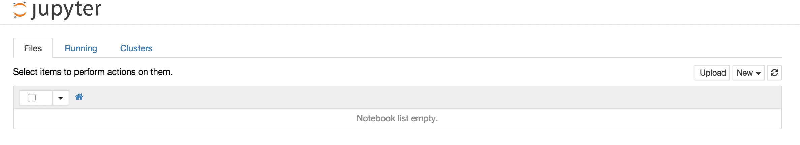

# 如何获得数据科学工作

> 原文：<https://www.dataquest.io/blog/how-to-get-a-data-science-job/>

December 14, 2016You’ve done it. You just spent months learning how to analyze data and make predictions. You’re now able to go from raw data to well structured insights in a matter of hours. After all that effort, you feel like it’s time to take the next step, and get your first data science job. Unfortunately for you, this is where the process starts to get much harder. There’s no clear path to go from having data science skills to getting a data science job. You’ll need to put in a lot of hard work to forge your own. But don’t give up hope! Getting a data science job after learning on your own is very possible. In this post, we’ll discuss the things you should be doing to put yourself in position to start getting data science interviews. In a subsequent post, we’ll cover the interview process itself, and how to prepare. Afterwards, you might get a snazzy new company laptop! If you feel like your data science skills aren’t yet well developed enough to start looking for a job, you might want to check out our post on [how to learn data science](https://www.dataquest.io/blog/learn-data-science/), or go to [Dataquest](https://www.dataquest.io) and start one of our data science learning paths.

## 1.通过构建项目不断学习

这可能看起来违反直觉，因为你每天只有这么多时间，你可能想把所有的时间都花在找工作上。但是，请这样想一想，每个数据科学家的主要职责是学习。新的工具不断涌现，什么技能被定义为“数据科学技能”也在不断变化。通过学习，你掌握了这些技能，并提高了你在雇主眼中的吸引力。我强烈建议你把大部分时间花在学习上。为了给自己找工作做好准备，你会想通过做项目来学习。项目是您在数据科学工作中将要创建的东西，自己构建项目是一种很好的实践方式。项目还能帮助你完善你的投资组合，增加你获得面试机会的几率。创建一个项目可以遵循这个粗略的过程:

*   找到一个有趣的数据集。你可以参考[这份寻找数据集](https://www.dataquest.io/blog/free-datasets-for-projects/)的地点列表。
*   列出几个你想用数据集回答的问题。拉入您想要使用的任何补充数据集。
    *   确保这些问题中至少有一两个拓展了你的知识范围，或者迫使你学习新的工具。
*   使用 [Jupyter Notebook](https://jupyter.org/) 或等效工具探索和分析数据。
*   将您的笔记本存储在 [Github](https://www.github.com) 上。

如果你需要更多的指导，请看[这篇文章](https://www.dataquest.io/blog/data-science-portfolio-project/)和[这篇文章](https://www.dataquest.io/blog/data-science-portfolio-machine-learning/)以获得制定和创建这些项目的帮助。

Jupyter 笔记本让数据分析变得简单。在您学习的过程中，请务必特别注意以下主题，这些主题在大多数数据科学教材中往往没有得到充分强调:

*   数据清理——能够清理数据是一项关键技能，也是你工作的大部分。你可以参加[data quest 数据清理课程](https://www.dataquest.io/course/data-exploration)来帮助你。
*   统计学—作为一名数据科学家，严谨是一个很好的方面，这涉及到统计学。你可以参加[data quest 统计课程](https://www.dataquest.io/course/statistics-fundamentals/)来帮助你。
*   端到端—从原始数据集到严格的分析是一项非常重要的技能。

## 2.展示你的作品

当你学习数据科学时，你有希望建立一个项目组合。理想情况下，这些项目将在 Jupyter 笔记本或等效工具中进行创作。项目是锻炼你技能的好方法，但是只有当你展示它们的时候，它们才会在你找工作的时候变得非常有价值。通过公开发布你的作品集，你提升了你的形象，并让其他人看到你的作品和技能。

### Github

分享你的作品的最快方法是创建一个 [Github](https://www.github.com) 帐户，并开始将你的笔记本上传到他们自己的存储库中。以下是一些示例项目存储库:

*   [贷款预测项目](https://github.com/dataquestio/loan-prediction)
*   [推特刮刀](https://github.com/dataquestio/twitter-scrape)

如您所见，两个项目都有一个`README`文件，清楚地解释了它们做什么，以及如何使用它们。如果你上传一个 Jupyter 笔记本到 Github，就像[这个例子](https://github.com/dataquestio/solutions/blob/master/Lesson103Solutions.ipynb)一样，它会自动渲染在界面中，让上传笔记本成为炫耀自己作品的绝佳方式。当你开始找工作时，你应该在 Github 上有 5-10 个项目。

Github 上的一个项目。

### 创建博客

展示你的工作的一个较慢但更有回报的方法是写一篇关于它的博客。一篇博文通常会描述你是如何创建这个项目的，以及你为什么要采取某些步骤。以下是一些不错的项目演练博客帖子:

*   [如何构建一个 Slack Bot](https://www.dataquest.io/blog/apartment-finding-slackbot/)
*   [策划与选举相关的推文](https://www.dataquest.io/blog/matplotlib-tutorial/)
*   [Python 中的 K-最近邻](https://www.dataquest.io/blog/k-nearest-neighbors-in-python/)

为了创建类似上面的帖子，你需要创建自己的博客。你可以在这里阅读一篇关于创建你自己的数据科学博客[的很好的教程。当你开始找工作时，你的目标应该是拥有 5 篇左右的博客文章。](https://www.dataquest.io/blog/how-to-setup-a-data-science-blog/)

## 3.分享你的作品

随着你在数据科学领域的知名度提高，你会发现获得新机会变得更加容易。提升你形象的一个方法是在相关的背景下与他人分享你的工作。有相当多的数据科学和编程社区欣赏教程或项目演练博客帖子:

*   [/r/machinelearning](https://www.reddit.com/r/machinelearning) —通用机器学习相关文章和教程。
*   [/r/datascience](https://www.reddit.com/r/datascience) —通用数据科学相关文章和教程。
*   [/r/python](https://www.reddit.com/r/python) —广泛介绍 python 的文章/
*   [/r/learnpython](https://www.reddit.com/r/learnpython) —关于学习 python 的文章或教程。
*   [/r/learnprogramming](https://www.reddit.com/r/learnprogramming) —关于学习编程的文章或教程。
*   [数据科学社区](https://community.dataquest.io/)

在你提交你的文章到任何一个社区之前，确保你参与了这个社区，并且了解他们对什么类型的内容反应良好。这通常包括阅读几周社区中的文章，并发表相关评论。通过分享您的作品，您的博客将获得流量，这可以带来:

*   改进工作的建议。
*   来自招聘人员的直接线索。
*   来自公司和社区成员的直接机会。
*   对数据科学市场的了解，以及谁在招聘。

## 4.网络

人际关系网是引起公司兴趣的好方法，也是发现你技能上的漏洞的好方法。你应该主要通过在线社区、聚会和咖啡会议来建立关系网。

### 在线社区

作为分享工作的一部分，你应该加入在线社区。请务必阅读这些社区中的文章，了解什么是数据科学趋势。此外，确保定期发表评论，这样你就可以分享你的观点并结识其他人。创建帖子向他人寻求建议也很常见。以下是一些来自数据科学社区的有用帖子示例:

*   [数据科学实习](https://www.reddit.com/r/datascience/comments/5dysxd/mailing_list_for_data_science_internships/)
*   [数据可视化用 R 还是 Python？](https://www.reddit.com/r/datascience/comments/5fqqvk/better_to_learn_data_visualization_in_r_or_python/)

随着您与社区的接触越来越多，您将会对数据科学世界有更多的了解，并且在找工作时处于更有利的位置。

### 聚会

聚会是一个很好的方式，可以同时见到很多数据科学家，并听到有趣的谈话。你可以在这里浏览你所在城市的聚会。搜索与你感兴趣的内容相关的关键词，比如“数据科学”、“数据可视化”、“Python”或“R”，会很有帮助。一些聚会是由雇佣数据科学家的公司赞助的，因此是寻找机会的好方法。注意不要只是在聚会上听演讲——和你周围的人互动，和他们交谈。你会惊讶于这些活动中偶然的互动所带来的机会。但是，一定不要把这些随意的互动视为纯粹的社交机会。如果你能帮助别人，你就能建立一个更真实的双向关系。

### 咖啡会议

试着每周和你所在地区的 1-2 个人进行咖啡会议。通过搜索你所在城市的数据科学家，你可以在 LinkedIn 或 T2 AngelList 上找到人。你也可以在[推特](https://www.twitter.com)上，或者通过流行的[数据科学博客](https://github.com/rushter/data-science-blogs)找到数据科学家。不要太担心只与经理或负责招聘的人建立关系网。通常，最好的推荐来自你的同事，所以要注重与其他数据科学家建立联系。在联系之前，通过评论他们的博客，在 Twitter 上与他们聊天，或者评论他们的回答来与他们建立关系也是一个好主意。一旦你准备好发电子邮件，联系人们的一个很好的方式就是说一些类似这样的话:

> 嗨！一直在学数据科学，现在正在找工作。如果你有时间去喝咖啡，我想听听你的建议。我一直在网上关注你，我喜欢你的[在此插入他们的一些作品]。

> 我对[在此插入问题]特别感兴趣。我很乐意去你的办公室。[在此插入时间]为我工作，但是如果这些对你不工作，我很高兴适应你的时间表。

一些好的问题包括:

*   任何与你联系的人的背景，以及他们是如何开始的。
*   关于这个人现在正在做的工作，以及他们的日常生活的问题。
*   关于特定行业数据科学应用的问题。示例:“教育中最有趣的数据科学应用有哪些？”
*   关于你要见的人的雇主的空缺职位的问题，以及他们是否正在招聘。
*   “我能帮你什么吗？”—信不信由你，你可能拥有和你会面的人不具备的技能和经验。如果你能帮助他们一些事情，你会建立一个更强大，更真实的关系。

一些不好问的问题是:

*   “我怎么才能找到工作？”—问题越集中越好。这个问题的一个更好的版本应该是“我已经创建了涵盖随机森林、数据清理和可视化的项目。你的雇主在新员工中寻找什么其他技能？接下来我应该在哪些技能上下功夫？”
*   "你能看看我的作品集吗？"—审查投资组合并给出良好的反馈可能会花费很多时间，而你只有在建立了良好的关系后才想问这个问题。
*   “我怎么在 R 里做这个东西？”—关注高水平的职业建议，最大限度地利用您的时间。

你可能会得到这样一种`4`回应:

*   沉默。如果得到这个回应，可以再跟进一次，但是如果还是没有得到回应，最好还是继续前进。不是每个人都有时间参加这些会议，或者接受这些会议。
*   抱歉，我现在没时间。这是常见的反应，没关系。感谢他们的时间，继续前进。
*   “我没有时间亲自见面，但我愿意打电话和/或通过电子邮件回答更多问题”。这是一个很好的回应，你应该尽快跟进。
*   “我很想亲自见见”——太棒了！你刚刚赢得了一次宝贵的面对面交流机会。小心地问一些有针对性的问题，最大限度地利用你的时间。

有太多设备的咖啡会议。

## 5.建立在线形象

为了获得潜在客户，你需要建立一个在线形象。至少，你应该出现在以下网站上:

*   [LinkedIn](https://www.linkedin.com)
*   [AngelList](https://www.angel.co)
*   [Github](https://www.github.com)

确保你的个人资料是最新的，有你项目的链接，并且有你所有的相关经验。您可能还想考虑在以下网站上开展业务:

*   [Twitter](https://www.twitter.com) —通过关注数据科学家并与他们聊天，你可以了解更多关于这个领域的知识。
*   [Quora](https://www.quora.com) —通过关注数据科学话题和回答问题，你可以提升自己的形象。

## 6.选择性消息公司

到目前为止，我们所有的注意力都放在获得潜在客户和机会上。你还需要有选择地寻找出国机会。LinkedIn 和 AngelList 可以很容易地表明对数百家公司的兴趣，但你会想避免这种策略。这导致了大量时间和精力的浪费，这实际上增加了找工作的难度。相反，你应该非常有选择性:

1.  弄清楚你对什么样的公司感兴趣。希望通过你的人际关系网，你应该对不同行业不同类型的公司的数据科学工作有一个很好的了解。如果你真的对医疗保健充满热情，并且喜欢在小公司工作，你应该只考虑较小的健康公司。
2.  找到你感兴趣的行业中感兴趣的公司。你可以在 AngelList 上搜索这个。列出 20-30 家你认为感兴趣的公司。
3.  针对您选择的行业优化您的在线形象和投资组合。例如，如果你关心医疗保健，你应该写医疗保健相关的博客帖子，像[这个](https://www.vikparuchuri.com/blog/exploring-us-healthcare-data/)。
4.  与你感兴趣的公司的数据科学家建立联系。看看你是否能和你感兴趣的公司的数据科学家一起喝咖啡。
5.  申请你感兴趣的公司的工作。确保给招聘经理写一封电子邮件(如果你能找到的话),描述你对这个职位的具体热情，以及为什么你会是一个很好的人选。如果你人际关系网很好，你也能得到推荐。

如果在浏览了`20`–`30`家公司后，你没有得到任何面试机会，你可能想得到一些具体的建议，改变你的方法。咖啡会议是获得这种建议的好方法。如果你有选择地给公司发信息，但没有得到面试机会，一些最常见的原因是:

*   你的简历和求职信不太适合这家公司。
*   你没有从公司的人那里得到任何推荐。
*   这些工作需要比你现在更多的经验和技能。

## 底线

没有保证，但如果你遵循这些步骤，你将处于一个很好的位置去得到一份数据科学的工作。我个人在过渡到数据科学的过程中经历了多年的旅程，你可以在这里阅读。关键是保持耐心。只要你在学习并展示你的技能，你就会被雇佣。

## 接下来的步骤

如果您还没有学习关键的数据科学技能，您可能想在 Dataquest 查看我们的交互式数据场景课程。我们围绕这篇文章中概述的理念建立了我们的课程，我们可以带你从零开始，到你可以开始竞争入门级数据工作的点。如果你感兴趣，你可以[注册并免费学习我们的第一个模块](https://www.dataquest.io)。

您可能还想阅读以下其他资源:

*   我是如何在数据科学领域找到第一份工作的？
*   [数据科学入门](http://treycausey.com/getting_started.html)
*   我如何找到一份数据科学家的工作？