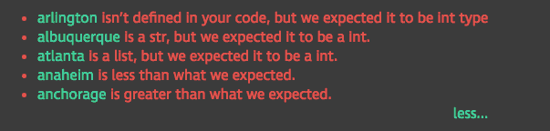

# v1.29 新增功能:新的课程界面、PayPal 等！

> 原文：<https://www.dataquest.io/blog/whats-new-v1-29/>

August 30, 2017Our version 1.29 release is here and includes lots of new features to help enhance your learning experience. Over the past few months we’ve been tirelessly talking to students like you to learn how we can improve the lesson interface. With this release, we are unveiling the results of this hard work. Other big changes in 1.29 include:

*   改进了对错误答案的反馈
*   我们现在接受贝宝，所以国际学生可以更容易地订阅
*   面向数据科学家和数据工程师的四门新课程

你可以在这篇文章的底部找到每一个新特性和错误修复的列表。

[立即体验新功能！](https://app.dataquest.io/login)

## 新课界面

我们新的课程界面更加简化，让您能够专注于学习。

我们已经让你更容易在代码和指令之间滚动，因此导航课程更快。您告诉我们，分屏解决方案很难使用，因此我们移动了解决方案显示，以便更容易地将您的代码与答案进行比较。

更容易将左边的解决方案与您的代码进行比较

我们还移动了我们的问答，使其更容易访问，并将课程进度菜单移到了左侧。如果您对此设计有任何反馈，请告诉我们，因为我们店内还有很多！

## 改进了对错误答案的反馈

学习编码最困难的事情之一是理解你哪里出错了。我们改进了在您的代码不正确时给您的反馈。

对错误答案的更好反馈。

改进包括:

*   显示我们在一个步骤中检查的所有变量的反馈
*   显示每个变量的变量状态的链接
*   不正确变量类型的显式提示
*   当你的代码有语法错误时，更好的消息传递

## 我们现在接受贝宝

我们最受欢迎的功能之一是允许 PayPal 作为一种支付方式，让你有更多的选择和我们一起学习。我们很高兴现在支持 PayPal 作为新用户的支付方式，使 Dataquest 更容易为国际学生所用。如果想利用这一点，你可以

[立即使用 PayPal 进行订购](https://www.dataquest.io/subscribe/)。

## 新课程

我们还在数据科学家和数据工程师道路上推出了四门新课程:

*   [机器学习的微积分](https://www.dataquest.io/course/calculus-for-machine-learning/):学习线性回归等中级机器学习技术所必需的微积分。
*   [用于机器学习的线性代数](https://www.dataquest.io/course/linear-algebra-for-machine-learning/):学习线性回归等中级机器学习技术所必需的线性代数。
*   [线性回归](https://www.dataquest.io/course/linear-regression-for-machine-learning):学习如何使用创建线性回归机器学习模型。
*   [递归和树](https://www.dataquest.io/course/recursion-and-tree-structures/):了解递归、树数据结构，以及如何使用它们来提高数据处理速度。

## 版本 1.29 中的新功能

今天版本中的完整功能列表如下:

*   全新的课程界面设计。
*   我们修复了一个错误，该错误导致通知中出现死链，通知中有人回答或投票支持您的问答问题/答案。
*   我们启动了 [Plus](https://www.dataquest.io/subscribe/) 计划，提供项目评审和指导。
*   改进了当你的代码不正确时我们给你的提示。
*   我们推出了我们的[帮助中心](https://support.dataquest.io/en)。
*   我们现在接受贝宝订购付款。
*   我们更新了仪表板设计，包括新的课程图标。
*   新[机器学习的微积分](https://www.dataquest.io/course/calculus-for-machine-learning/)课程。
*   新[机器学习线性代数](https://www.dataquest.io/course/linear-algebra-for-machine-learning/)课程。
*   新的[线性回归](https://www.dataquest.io/course/linear-regression-for-machine-learning)过程。
*   新的[递归和树](https://www.dataquest.io/course/recursion-and-tree-structures/)课程。
*   跨平台对速度和可靠性的各种改进。
*   杂项课错误修正和错误修复。

[立即体验新功能！](https://app.dataquest.io/login)

## 即将推出

如果您对未来几个月的内容感兴趣:

*   仪表板的更多改进，包括定制的学习日程
*   SQL 新课程
*   能够设定学习目标并制定学习计划
*   课内文档

一如既往，我们希望听到您对我们下一步应该构建什么的反馈。如果你有一个好主意，

给我们发电子邮件！