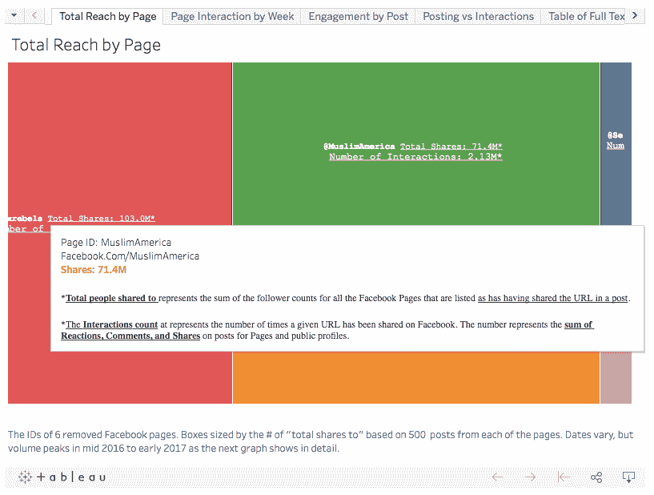
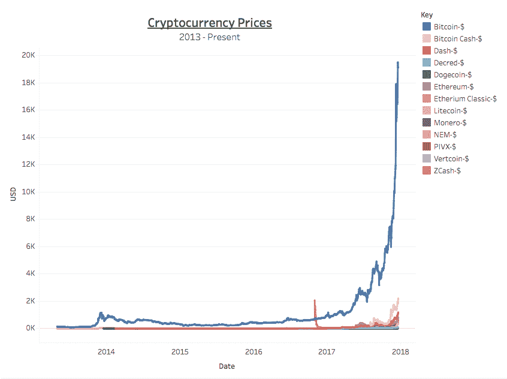
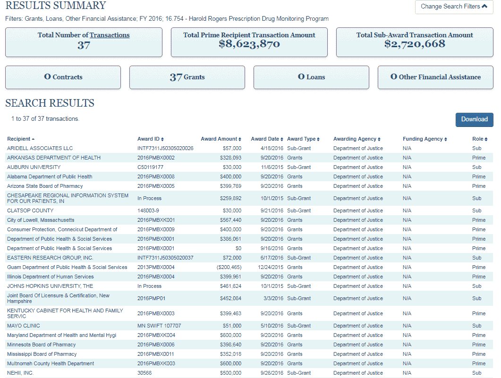
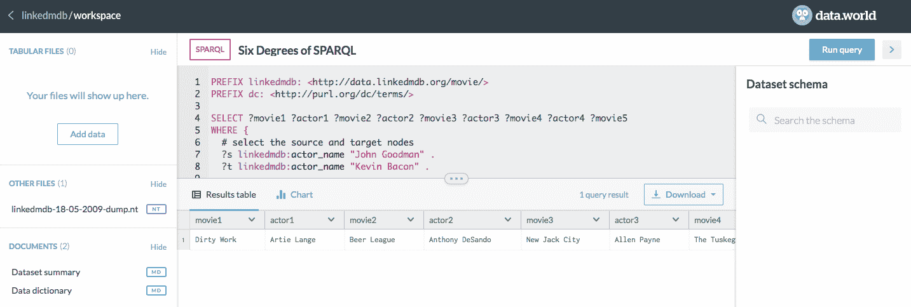
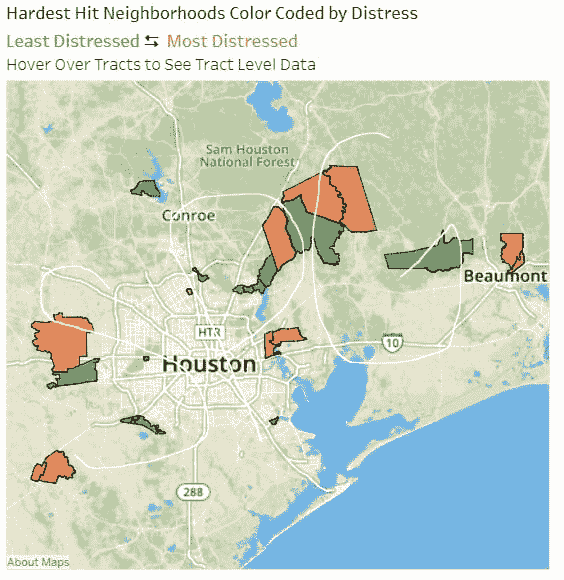
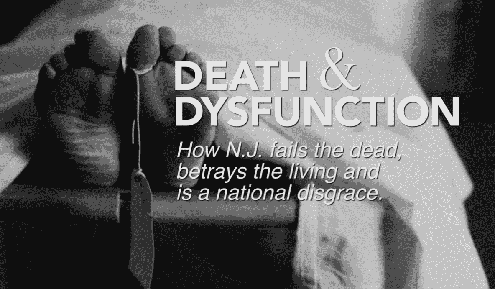
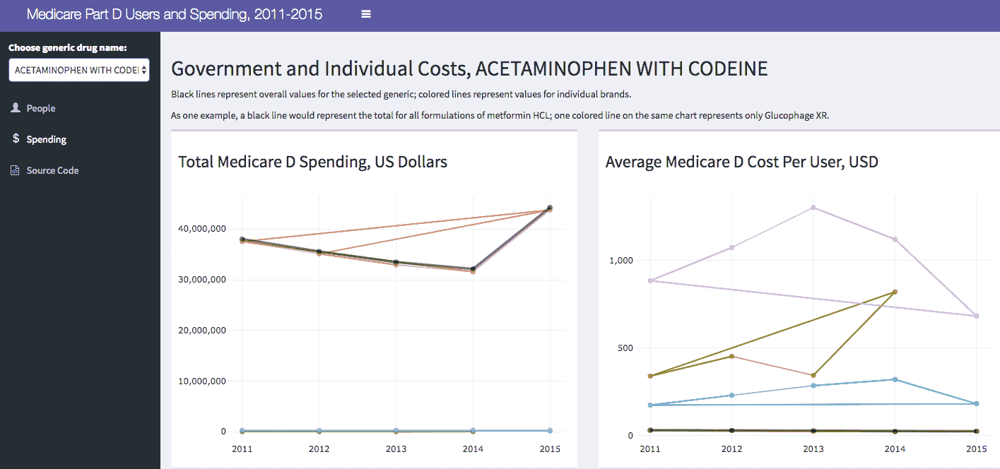
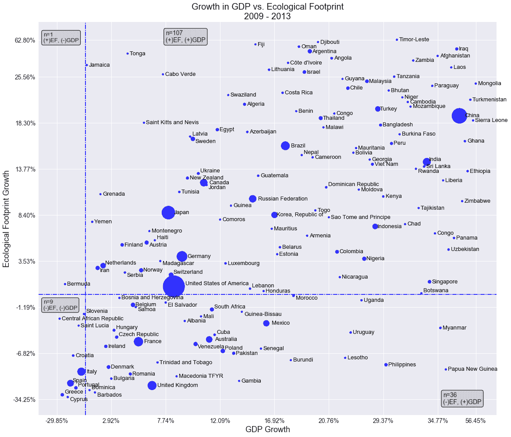
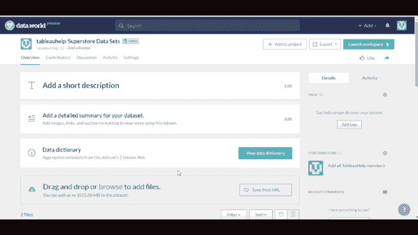
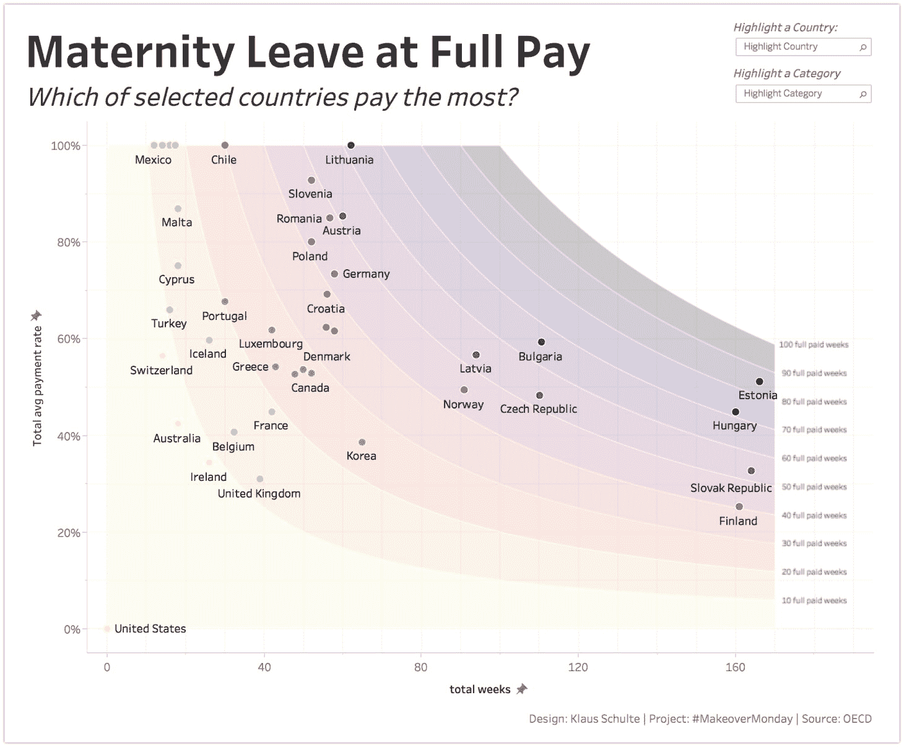

# 您现在可以加入的 10 个数据科学项目

> 原文：<https://www.dataquest.io/blog/10-data-science-projects-join/>

February 6, 2018*Editor’s note: This post was written as part of a collaboration with data.world, a site for sharing and hosting data. Authors [Shannon Peifer](https://www.linkedin.com/in/shannon-peifer-05a733116/) and [Gabriela Swider](https://www.linkedin.com/in/gabriela-swider-60915218/) are on the data.world team.* Finding the right data can be difficult. And even once you have it, how do you collaborate with others to make sense of it? People work harder and learn more when they’re able to discover data they’re passionate about. Sharing those passions with other data scientists makes problem-solving easier. Here are some great projects from people doing just that.

### 1.[移除脸书页面:参与度指标和帖子](https://data.world/d1gi/missing-fb-posts-w-share-stats?utm_campaign=dataquest&utm_source=blog&utm_content=180122)通过 [@d1gi](https://data.world/d1gi?utm_campaign=dataquest&utm_source=blog&utm_content=180122)

作为杰出的数据新闻工作的一个例子，该数据集通过挖掘 2016 年美国总统选举期间通过脸书的外部影响数据，直面了一些社会上最大的社交媒体问题。该调查随后被一些出版物报道，包括

《华盛顿邮报》和《T2 时报》和《纽约时报》。Tow 数字新闻中心的 Jonathan Albright 在这里展示的数据是五个所谓的外国影响 ops 页面中每一个页面上未推广的[有机到达](https://www.nutshell.com/blog/marketing-slang-terms/)帖子的目录。随着每个帖子的完整文本存档，这些数据揭示了使用脸书平台的更大潜在影响，而不仅仅是一次广告购买。具体来说，这里介绍的工作表明，这五个关闭的页面的内容有更广泛的曝光。此外，关于这个数据集的[讨论是我们今年在 data.world 上看到的最引人入胜的讨论。Jonathan 鼓励你将这个数据集用于自己的研究和分析。这个](https://data.world/d1gi/missing-fb-posts-w-share-stats/discuss/missing-fb-posts-w-share-stats/44243?utm_campaign=dataquest&utm_source=blog&utm_content=180122)[集合数据集](https://data.world/gswider/data-journalism-on-data-world?utm_campaign=distinct_values&utm_source=blog&utm_medium=medium&utm_content=171229)也是展示 data.world 上其他数据新闻工作的极好资源

Interactive visualization by [Jonathan Albright](https://medium.com/@d1gi?utm_campaign=dataquest&utm_source=blog&utm_content=180122)

Our team can’t wait to see what the new year has in store for the data.world community. Stay in the loop on the best new data sets and projects of 2018 by

[订阅我们的每周数据摘要电子邮件](https://page.data.world/data-digest?utm_campaign=dataquest&utm_source=blog&utm_content=180122)。

### 2.[币量](https://data.world/scuttlemonkey/coin-metrics?utm_campaign=dataquest&utm_source=blog&utm_content=180122)经由[@天窗猴](https://data.world/scuttlemonkey?utm_campaign=dataquest&utm_source=blog&utm_content=180122)

如果你有先见之明，在去年的这个时候投资比特币，你可能会处于有利地位。如果没有，您可以使用

[比特币后悔计算器](https://data.world/scuttlemonkey/coin-metrics/discuss/visualizations/64263?utm_campaign=dataquest&utm_source=blog&utm_content=180122)在这个数据集中找出你本可以获利多少。该项目将使用 IFTTT 上的 [data.world sync 小程序，从数据聚合和可视化服务](https://ifttt.com/applets/iPuLf4Sv-sync-data-every-day-at-a-specific-time?utm_campaign=dataquest&utm_source=blog&utm_content=180122) [Coin Metrics](https://coinmetrics.io/?utm_campaign=dataquest&utm_source=blog&utm_content=180122) 获取最新的每日硬币数据。在[数据集讨论](https://data.world/scuttlemonkey/coin-metrics/discuss/visualizations/64263?utm_campaign=dataquest&utm_source=blog&utm_content=180122)中查看十几种加密货币的价格趋势和各种支持可视化。

Data visualization by [Patrick McGarry](https://data.world/scuttlemonkey?utm_campaign=dataquest&utm_source=blog&utm_content=180122)

### 3.联邦项目如何应对阿片类药物的流行？via[@ USA spending](https://data.world/usaspending?utm_campaign=dataquest&utm_source=blog&utm_content=180122)

在美国，阿片类药物滥用导致的用药过量率上升是一个影响全国家庭的惊人趋势。财政部通过 USAspending.gov 发布在 data.world 上的最新数据包括详细的项目描述和机构信息，让人们深入了解联邦政府解决这一问题的努力。

[@haotianxu91](https://data.world/haotianxu91?utm_campaign=dataquest&utm_source=blog&utm_content=180122) 深挖这个数据集，看看联邦数据能否与阿片类药物滥用治疗和预防项目联系起来。在这里探索他的发现[。通过 data.world 将数据公之于众，许多地方、州和联邦政府机构在支出方面正在朝着更好的问责制和透明度迈进。在 data.world 上通过搜索机构的](https://data.world/usaspending/how-is-the-federal-government-fighting-the-opioid-epidemic/insights?utm_campaign=dataquest&utm_source=blog&utm_content=180122) [data.world 组织名称](https://data.world/search?q=org%3Atreasury&utm_campaign=dataquest&utm_source=blog&utm_content=180122)来查找更多政府数据。

Insight by [Haotian Xu](https://medium.com/@haotianxu91)

### 4.[通过](https://data.world/linked-data/linkedmdb?utm_campaign=dataquest&utm_source=blog&utm_content=180122)[@链接数据](https://data.world/linked-data?utm_campaign=dataquest&utm_source=blog&utm_content=180122)
链接电影数据库

在 data.world，我们相信

[(不久的)数据的未来是关联的](https://blog.data.world/the-near-future-of-data-is-linked-75f4c011f9cf?utm_campaign=dataquest&gi=ceecf5e5f60e)，我们很高兴看到更多的社区成员释放关联数据的真正潜力，并使用 SPARQL，一种用于数据库的语义查询语言(和我们的 owl 吉祥物同名)。该数据集中的一个查询重现了 SPARQL 中著名的“六度凯文·贝肯”问题——对于数据库中的任意两个演员，该查询将找到(如果存在的话)恰好六个连接的路径，通过他们一起出演的电影中的其他演员。准备好玩“SPARQL 六度？”只需用您选择的演员替换[查询](https://data.world/login?next=%2Flinked-data%2Flinkedmdb%2Fworkspace%2Fquery%3Fqueryid%3Db671cc87-2078-4057-b1eb-366e9c5f48e1%26utm_campaign%3Ddataquest%26utm_content%3D180122%26utm_source%3Dblog)的第 7 行和第 8 行中的演员姓名，然后点击“运行查询”(警告:这可能太有趣了，不能只运行一次)。

[Six degrees of SPARQL query](https://data.world/login?next=%2Flinked-data%2Flinkedmdb%2Fworkspace%2Fquery%3Fqueryid%3Db671cc87-2078-4057-b1eb-366e9c5f48e1%26utm_campaign%3Ddataquest%26utm_content%3D180122%26utm_source%3Dblog)

### 5.[哈维飓风:最需要邻里](https://data.world/alyssaanalyzes/hurricane-harvey-greatest-need-neighborhoods?utm_campaign=dataquest&utm_source=blog&utm_content=180122)经由[@ alyssa analyses](https://data.world/alyssaanalyzes?utm_campaign=dataquest&utm_source=blog&utm_content=180122)

39 个县被列入哈维飓风总统宣布的灾区名单。虽然大多数遭受财产损失的地区需要援助来支付修复和重建费用，但资源有限的地区更多地受益于联邦灾难恢复计划的精心选择。SP 集团确定了那些最容易受到财产损失负面影响的社区，并在 data.world 上公布了数据。他们不是唯一这样做的人；

[在 data.world 上搜索“哈维飓风”](https://data.world/search?q=hurricane+harvey&type=dataset&utm_campaign=dataquest&utm_source=blog&utm_content=180122)会返回由各种社区成员和组织创建的数十个数据集，所有这些数据集都旨在通过让最需要的人更容易获得重要数据来帮助飓风恢复工作。

Data visualization by [Alyssa Spina](https://data.world/alyssaanalyzes?utm_campaign=dataquest&utm_source=blog&utm_content=180122)

### 6.[新泽西州法医数据](https://data.world/stevestirling/n-j-medical-examiner-data?utm_campaign=dataquest&utm_source=blog&utm_content=180122)经由 [@stevestirling](https://data.world/stevestirling?utm_campaign=dataquest&utm_source=blog&utm_content=180122)

2017 年见证了

根据柯林斯字典，“假新闻”一词的使用增加了 365%。尽管对媒体的怀疑和不信任越来越多，但今年我们已经看到新闻领域发生了重大转变，数据成为全球顶级新闻媒体可信度的基石。这个数据集中的数据是在长达数月的记录之争后从新泽西的州法医办公室获得的，在公布后的 24 小时内，即将上任的州长菲尔·墨菲[承诺在即将到来的立法会议上对该系统进行“大规模改革”](https://www.nj.com/data/2017/12/murphy_calls_for_wholesale_reform_of_medical_exami.html?utm_campaign=dataquest&utm_source=blog&utm_content=180122)。我们喜欢这个数据集，因为它是一个令人难以置信的例子，说明数据驱动的新闻如何帮助通知社区，甚至影响公共政策。在[死亡&机能障碍:新泽西州如何辜负死者，背叛生者，是国家耻辱](http://death.nj.com/)中阅读更多关于新泽西州前进媒体 18 个月的调查。

[Story by NJ Advance Media](http://death.nj.com/)

### 7.[药费](https://data.world/data4democracy/drug-spending?utm_campaign=dataquest&utm_source=blog&utm_content=180122)经由 [@data4democracy](https://data.world/data4democracy?utm_campaign=distinct_values&utm_source=blog&utm_medium=medium&utm_content=171229)

[Data for Democracy](https://github.com/Data4Democracy) 始于 2016 年 12 月的一项实验，当时来自世界各地的人们开始通过使用 Slack 进行规划，使用 GitHub 进行代码，使用 data.world 进行数据协作，来协作解决与数据相关的问题。在没有规则或正式组织结构的情况下，重点是以最小的延迟完成真实且有影响力的工作。该数据集是该组织发起的第一批项目之一，该组织已发展到包括全球 2000 多名电子志愿者。使用这个数据集和 [data.world R 包](https://github.com/datadotworld/data.world-r?utm_campaign=dataquest&utm_source=blog&utm_content=180122)，社区成员珍妮·汤普森能够收集一个仪表板所需的数据，创建并发布一个派生数据集，并构建一个[闪亮的仪表板](https://jenniferthompson.shinyapps.io/shinydashboard-medicared/?utm_campaign=dataquest&utm_source=blog&utm_content=180122)，从站点中提取实时数据。阅读 R Views 中詹妮弗的故事，看看她是如何做到的。

[App by Jennifer Thompson](https://jenniferthompson.shinyapps.io/shinydashboard-medicared/?utm_campaign=dataquest&utm_source=blog&utm_content=180122)

### 8.[全国足迹账户— 2017 版](https://data.world/footprint/nfa-2017-edition?utm_campaign=dataquest&utm_source=blog&utm_content=180122)经[@足迹](https://data.world/footprint?utm_campaign=dataquest&utm_source=blog&utm_content=180122)

格林纳达、圭亚那和冈比亚有什么共同点？它们都在全球足迹网络的生态足迹最低的国家名单上。全球足迹网络的国家足迹账户衡量自 1961 年以来各国的生态资源使用和资源能力。该组织在 data.world 上发布了 2017 年版背后的数据，导致了一些分析，这些分析有助于我们更好地理解经济增长(GDP)与自然资源消耗之间的关系。加入全球足迹网络，在 2018 年做出改变，减少我们的集体生态足迹。这是很好的第一步:计算你自己的生态足迹

[此处](https://www.footprintcalculator.org/?utm_campaign=dataquest&utm_source=blog&utm_content=180122)。

Data visualization by [Noah Rippner](https://data.world/nrippner?utm_campaign=distinct_values&utm_source=blog&utm_medium=medium&utm_content=171229)

### 9. [Tableau Desktop 101:通过](https://data.world/tableauhelp/tableau-desktop-101-step-into-the-shoes-of-a-data-analyst?utm_campaign=dataquest&utm_source=blog&utm_content=180122) [@tableauhelp](https://data.world/tableauhelp?utm_campaign=dataquest&utm_source=blog&utm_content=180122)
接替数据分析师的工作

TableauHelp 创建了这个很棒的教程来帮助人们升级他们的 Tableau 游戏。数据项目包括一个指南、教程和练习，用于通过一个沉浸式用例学习业务数据分析和可视化的基础知识。想学习如何创建各种视图来浏览 Tableau 中的数据吗？

[从这里开始](https://data.world/login?next=%2Ftableauhelp%2Ftableau-desktop-101-step-into-the-shoes-of-a-data-analyst%2Fworkspace%2Ffile%3Ffilename%3D01_lets_get_started.md%3Futm_campaign%3Ddataquest%26utm_content%3D180122%26utm_source%3Dblog)。

[Tutorial by TableauHelp](https://data.world/login?next=%2Ftableauhelp%2Ftableau-desktop-101-step-into-the-shoes-of-a-data-analyst%2Fworkspace%2Ffile%3Ffilename%3D01_lets_get_started.md%26utm_campaign%3Ddataquest%26utm_content%3D180122%26utm_source%3Dblog)

### 10.[@改头换面星期一](https://data.world/makeovermonday?utm_campaign=dataquest&utm_source=blog&utm_content=180122)

这些数据正使世界变得更加互联，一次一个星期一。来自社会数据项目的成员

[改头换面星期一](https://www.makeovermonday.co.uk/?utm_campaign=dataquest&utm_source=blog&utm_content=180122)每周发布一个图表及其数据的链接，然后社区重新制作图表。无论是简单的条形图还是复杂的信息图，他们都鼓励每个人参与其中。在 https://www.makeovermonday.co.uk/的[加入挑战。](https://www.makeovermonday.co.uk/)