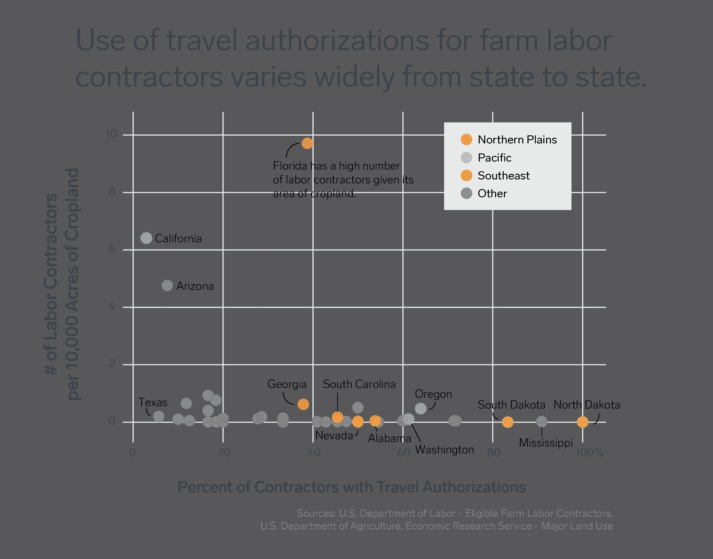
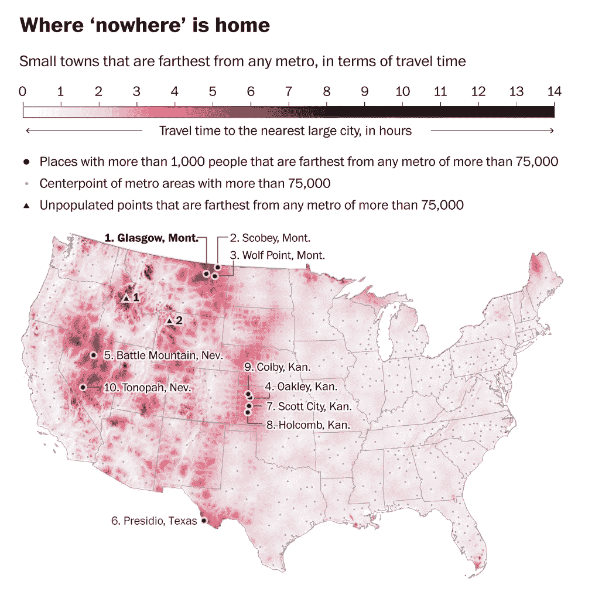
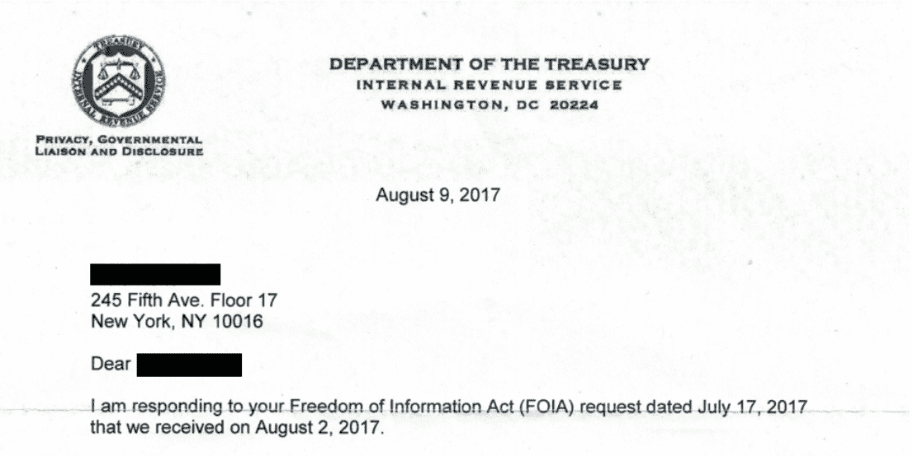

# 寻找有趣数据集的 5 种方法

> 原文：<https://www.dataquest.io/blog/5-ways-to-find-interesting-data-sets/>

March 21, 2018

在数据科学项目中，有一系列广泛使用的开放数据集——你可能遇到过利用 [Iris Flower classic](https://archive.ics.uci.edu/ml/datasets/iris) 或纽约州 [Citibike 数据](https://www.citibikenyc.com/system-data)的东西。

然而，很难对流量大的数据集提出新颖的问题；基于这些经典之一的项目不太可能产生引人注目的投资组合。回答尚未分析的数据集的有趣问题要容易得多。

在我目前的职位上，我花了相当多的时间在政府开放数据门户的角落里，潜伏在可以搜集数据的网站周围，打电话给全国各地的 FOIA 部门。以下是我为寻找最有趣的数据集而开发的一些技巧和诀窍。

#### 关注数据前沿的时事通讯

时事通讯是掌握最新数据的重要来源。最好的邮件是持续不断的创造力的种子——浏览邮件至少会激发出一个新的想法。我依赖于那些专注于数据想法的组合，不寻常的可视化或分析技术的亮点，以及关于开放数据政策的最新报告。我个人最喜欢的包括:

*   Buzzfeed 的[数据是复数](https://tinyletter.com/data-is-plural),这是一个有趣数据集的简单列表
*   [最佳视觉故事讲述奖](https://tinyletter.us16.list-manage1.com/subscribe?u=5c12dabe1e59a9fbde1174b8c&id=e27a48af53)用数据讲述引人入胜的故事
*   开放数据研究所本周发布的[数据](https://theodi.org/knowledge-opinion/the-week-in-data/)为开放数据社区把脉
*   英格玛的简讯，[两排之间](https://enigma.us5.list-manage.com/subscribe?u=04aa10cf99e0998bd8e69a109&id=e53dcad000)

 *上个月的两行数据可视化于[移民和季节性农业工人保护法案](https://public.enigma.com/datasets/department-of-labor-eligible-farm-labor-contractors/a68c6f50-9609-4a1d-9b67-6b0ab7f901ad)数据*

#### 2.跟上利用数据的媒体

从彭博关于美国购物中心[消亡的视频游戏](https://www.adweek.com/tv-video/bloomberg-created-a-video-game-to-document-the-demise-of-the-american-shopping-mall/)到 ProPublica 发布川普的[白宫访客记录](https://projects.propublica.org/graphics/wh-complex)，前沿媒体机构长期以来一直使用开放数据进行有意义的叙事。

事实上,《纽约时报》推出了一个名为[的系列报道，图中到底发生了什么？](https://www.nytimes.com/column/whats-going-on-in-this-graph)更好地教育读者数据可视化。这些文章是一个很好的地方，可以看到可以用数据做什么，并研究它们的开放数据源。

 *《华盛顿邮报》使用疟疾地图集项目、人口普查局和美国国家航空航天局的数据对[这个偏僻的地方进行了可视化。](https://www.washingtonpost.com/news/wonk/wp/2018/02/20/using-the-best-data-possible-we-set-out-to-find-the-middle-of-nowhere/?utm_term=.d7264cc95a80)*

#### 3.倾听开放数据空间中的重要声音

不仅数据科学的实践在发展，每天都有更多的数据被发布。像[阳光基金会](https://sunlightfoundation.com/)、[开放知识基金会](https://okfn.org/)、[开放企业](https://opencorporates.com/)和[开放数据研究所](https://theodi.org/)这样的数据倡导团体在塑造开放数据空间方面非常活跃。

这些组织经常展示示范性的开放数据集，在缺乏透明度的地方，向政府施加压力，要求改善。通过跟踪他们的工作，你将是第一个了解新打开的数据集的人。

#### 4.请求从未曝光的数据

信息自由法案(FOIA)允许公众要求政府机构的文件和其他数据。通过 FOIA 请求数据几乎可以保证您获得从未被分析过的数据(尽管这通常是对耐心的终极考验)。

为了弄清楚你想从联邦或州政府机构那里获得什么样的数据，看看 FOIA 倡导组织。给初来 FOIA 的人一个小提示:尽可能具体。请求您想要的文件的确切名称(如果您知道的话！)，您喜欢的格式和您感兴趣的日期范围。请求越具体，你得到数据回报的可能性就越大。 *英格玛公共公司的 FOIA 与国内税收署的通信。*

#### 5.将元数据用于您的优势

伴随着数据字典的数据集，或者描述数据集内容的一组相关的元数据，表明来源对他们的数据游戏是认真的。我经常调查同一来源发布的其他数据集，确信他们的数据集符合高标准。我一直对纽约开放数据门户网站背后的团队印象深刻，除了数据集所有者的名字、发布数据的机构及其更新频率之外，他们还经常提供数据字典。

虽然这些技巧帮助我发掘了一些真正的数据宝藏，但我一直在寻找其他的灵感来源。如果您有任何其他建议，请[发送给我](/cdn-cgi/l/email-protection#f9898c9b95909ad48a8c8989968b8db99c97909e9498d79a9694)。

编者按:这篇文章是与公共数据公司 [Enigma](https://www.enigma.com/) 合作的一部分。作者 India Kerle 是 Enigma 的数据管理员。