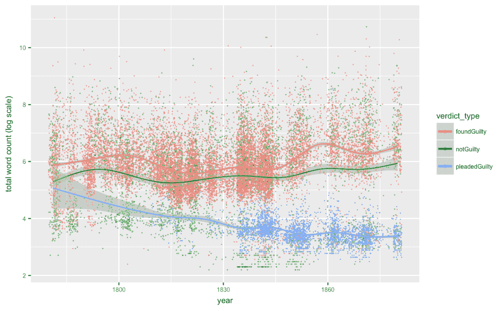
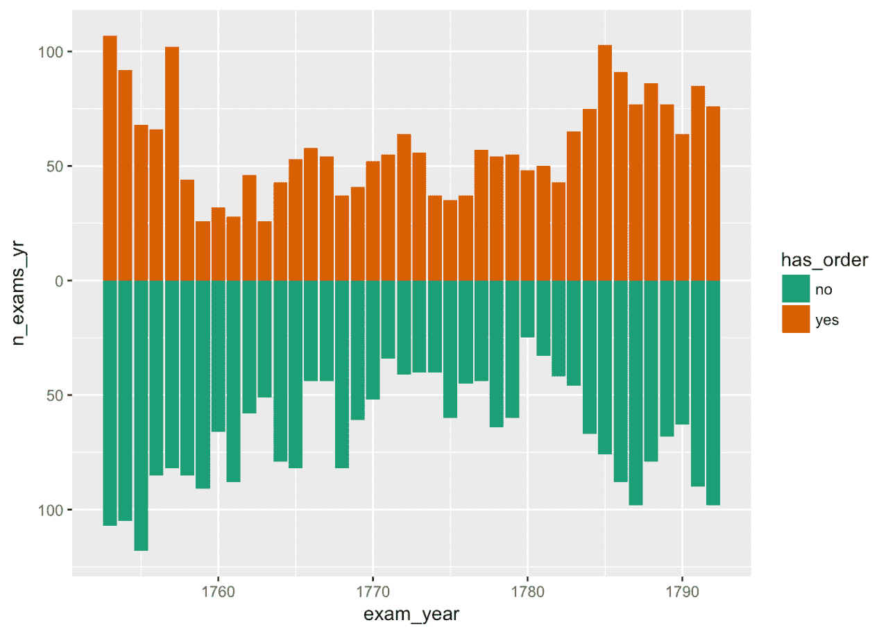
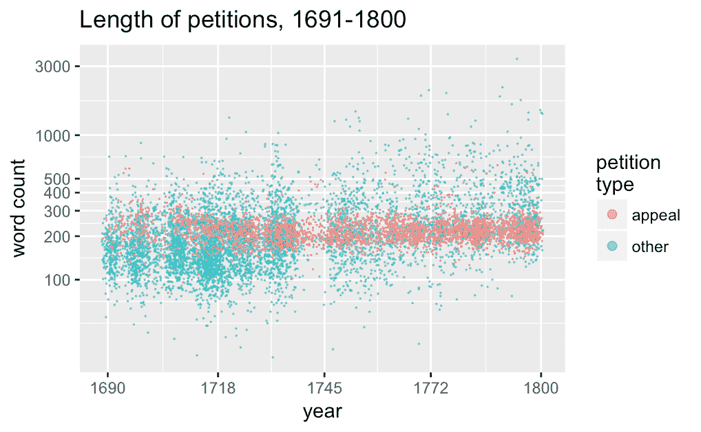

# 历史学家学习 R 的五个理由

> 原文：<https://www.dataquest.io/blog/five-reasons-for-historians-to-learn-r/>

April 17, 2018In which I do some cheerleading for the [R Project for Statistical Computing](https://www.r-project.org/).

## 1.你几乎肯定会发现努力是值得的

通常，在无休止的“学者是否应该学习编码”的争论中，对于新来者来说，一旦你投入了大量的时间去学习它，你并不清楚你实际上可以用这些代码做什么。复制粘贴在线教程不会让事情变得更清楚。你是如何从“你好世界！”你研究的实际应用？但是 R 都是关于分析和展示数据的，没有多少历史学家迟早会不处理某种数据。如果您已经使用

电子表格、SPSS 或某种数据库，如果你曾经在论文中展示过表格或图表，你几乎肯定会从学习中有所收获，即使是少量的 R(并且可能会有 R 包，使其易于与你当前的工具一起使用)。r 是灵活的:它可以用于传统的表格统计数据，也可以用于语言语料库和其他文本数据集。你可以用它来处理重量级的数字、[文本挖掘](https://www.tidytextmining.com/index.html)、项目开始时的探索性[可视化](https://ggplot2.tidyverse.org/index.html)，以及演示和出版中的壮观场景——各种各样的[人文数据都使用](https://humanitiesdata.org/)。(我真的真的真的很想在[这篇博文](https://sappingattention.blogspot.co.uk/2017/05/a-brief-visual-history-of-marc.html)中找到美丽 viz 的应用。)

## 2.你不必在命令行上做这些

我知道有些人喜欢命令行工具。但是一个好的图形用户界面对于新手和我们这些实际上并不期待启动终端的人来说是非常重要的。安装 R 本身后，

[RStudio](https://www.rstudio.com/) 是接下来要下载的东西(免费)。这是一个合适的工作平台，包括代码编辑器、控制台、R 包管理器、可视化工具、预览器等等。如果你已经在使用 Markdown(也许即使你还没有)，你会爱上 RMarkdown 和 R 笔记本。(关于另一个与 GUI 相关的主题，请参见: [GitHub 桌面](https://desktop.github.com/)。不客气)

## 3.潮汐

我的一个定期咆哮是，历史学家在担心编程代码之前，需要理解数据和数据建模(即使他们不认为他们与“数据”打交道)。有了 R，你可以同时了解两者。这

[Tidyverse](https://www.tidyverse.org/) 被描述为“为数据科学设计的 R 包的固执己见的集合”，它们“共享一个底层哲学”；创建和使用[整齐数据](https://www.jstatsoft.org/article/view/v059i10)的工具。

## 4.历史学家的在线学习资源

这

编程历史学家有几个 R 教程，从非常基础的到更高级的技术。目前我认为有四个:

*   r 表格数据基础
*   R 中的数据争论和管理
*   R 中的基本文本处理
*   历史研究与 R 的对应分析

除了这些简短的教程，Lincoln Mullen 还开发了一个免费的在线教材，

[计算历史方法](https://dh-r.lincolnmullen.com/)，“如何识别来源和框架历史问题，然后通过计算方法回答它们”，使用 r。另请参见 Scott Weingart 的资源列表，用于[教自己为 DH 编写代码](https://scottbot.net/teaching-yourself-to-code-in-dh/)。

## 5.共享、开放和可复制的研究

我已经写完了最后两篇

[会议](https://earlymodernnotes.wordpress.com/2017/09/15/defendants-voices-and-silences-in-the-old-bailey-courtroom-1781-1880/) [论文](https://earlymodernnotes.wordpress.com/2017/05/20/settlement-and-removal-poor-relief-and-exclusion-in-18th-century-london/)完全在 r 中。这意味着一切都是纯文本，我可以轻松地在网上发布我使用的所有数据、代码和可视化。我把它们放在 Github 上，但也有其他选择，比如 [RPubs](https://rpubs.com/) (来自 RStudio 的开发者，从 RStudio 直接发送东西到 RPubs 真的很容易)。*编者按:这最初是[发布在早期现代笔记](https://earlymodernnotes.wordpress.com/2017/09/23/five-reasons-for-historians-to-learn-r/?utm_source=dataquest&utm_medium=blog)上，现在已经用 perlesson 重新发布了。作者莎伦·霍华德在谢菲尔德大学担任数字历史项目的项目经理。* *想学 R？我们的[基础](https://www.dataquest.io/course/introduction-to-data-analysis-in-r/)课程将让你在不知不觉中挖掘数据。*