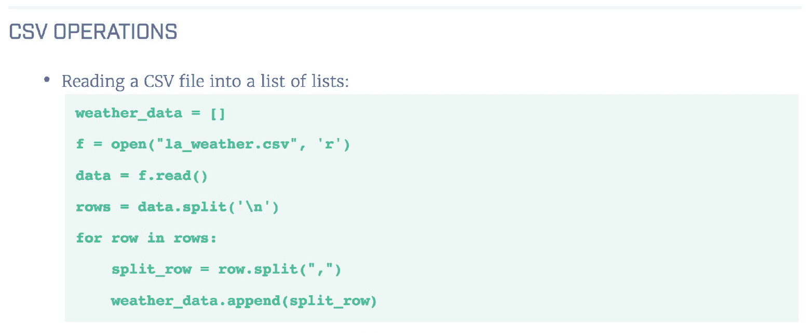
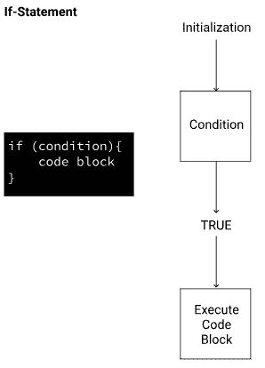

# Dataquest v1.85 的新特性:外卖、中级 R 等

> 原文：<https://www.dataquest.io/blog/whats-new-v-185/>

May 25, 2018We’re always working on ways to help you learn and keep you motivated — from new features, to celebrating student stories. In this post, we give you a quick overview of what we’ve released recently, and what’s coming up.

## 外卖食品

编程由许多小的动作和概念组成，很难记住它们。不可避免地，你会疑惑，*“等等，`==`又是做什么的？”*(如果两个值相等，则返回`True`。)当然，有谷歌和文档，但你必须在一页页的信息中搜寻——这会分散你的注意力并占用时间。输入我们的外卖。当你学完我们的 [Python 编程:初级](https://www.dataquest.io/course/python-for-data-science-fundamentals/)和 [Python 编程:中级](https://www.dataquest.io/course/python-for-data-science-intermediate/)课程后，你会发现一些可下载的文档，其中包含一些有用的信息，例如:

*   如何打开文件
*   如何迭代一个列表
*   如何确定列表中是否存在某个值
*   If 语句语法

<small>An example from our List Operations lesson Takeaways doc</small>

你可以把这些外卖放在身边，遇到卡顿的时候快速回头参考。虽然到目前为止它们只出现在 Python 初级和中级课程中，但是我们正在努力将它们添加到我们目录的其余部分。如果您还没有，也可以查看我们的备忘单:

*   [Python 数据科学基础知识](https://www.dataquest.io/blog/python-cheat-sheet/)
*   [Python 数据科学中级](https://www.dataquest.io/blog/data-science-python-cheat-sheet/)
*   [NumPy](https://www.dataquest.io/blog/numpy-cheat-sheet/)
*   [Python 正则表达式](https://www.dataquest.io/blog/regex-cheatsheet/)
*   熊猫

## r 编程:中级

我们将继续努力建设我们的 R 课程，希望你喜欢最新的课程: [R 编程:中级](https://www.dataquest.io/course/control-flow-iteration-and-functions-in-r/)。本课程涵盖了控制结构、功能、字符串和日期。

<small>If-statements in R</small>

You’ll finish the course with a guided project that explores RStudio, from installing, to writing scripts and notebooks.

## 用户故事

我们在我们的[用户成功页面](https://www.dataquest.io/blog/topics/student-stories/)中添加了一些新故事:

*   [Eric](https://www.dataquest.io/blog/eric-salesdeandrade) 想要建立更强、更深入的数据技能。了解他如何从数据挖掘转向数据科学。
*   [Mike](https://www.dataquest.io/blog/mike-roberts) 没想到会爱上数据。他的故事告诉了每一个发现自己对前景感到厌倦的人。
*   克里斯蒂安的故事表明，找到一个你关心的项目是多么重要。他把今天的工作归功于 Dataquest。

您是否从事自己热爱的工作，并且觉得 Dataquest 对您有所帮助？

[让我们知道](/cdn-cgi/l/email-protection#cfa7aaa3a3a08fabaebbaebebaaabcbbe1a6a0)！

## 新团队成员

在 Dataquest，随着公司的发展，我们努力寻找合适的人才。我们寻找热爱教育的人，他们将在我们完全分散的团队中茁壮成长。我们很高兴向您介绍我们的新员工:

*   前端工程师 Shridhar Gupta:Shridhar 对伟大的设计和工程充满热情。他喜欢去新的地方旅行，喜欢在户外度过时光，喜欢摄影。
*   罗斯·马丁，数据科学家:在 Dataquest 之前，罗斯是一名生态系统生态学家。她热衷于帮助他人发展他们的数据科学技能并做出自己的发现。
*   内容运营兰德尔·霍尔(Randall Hall):兰德尔自称是数学和数据极客。
*   Ash Kestrel，后端工程师:Ash 有动画背景，喜欢用 Python 工作。
*   卡尔·泰勒，营销总监:卡尔喜欢旧书、俗气的俏皮话和美味的三明治。

## 其他更新

*   我们最近从 AWS 迁移到了 Google Cloud。非常感谢我们所有的学生对所涉及的停机时间的耐心。我们做出这一改变是为了提高网站速度和服务的可靠性，并使日常维护更容易。
*   我们几个人在五月中旬参加了 PyCon US。Python 社区非常热情，我们很高兴见到这么多对数据和编程充满热情的人。

## 下一步我们应该建造什么？

来自用户的反馈对我们来说非常重要——我们很想知道您对我们下一步应该做什么的看法。如果你有想法，你可以[发电子邮件给我们](/cdn-cgi/l/email-protection#5c34393030331c383d283d2d29392f28723533)或者在[推特](https://www.twitter.com/dataquestio)上联系我们！