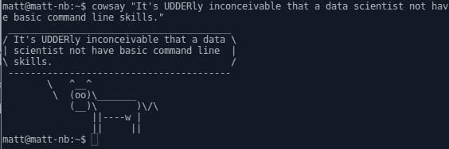

# 数据科学家必备的 12 个命令行工具

> 原文：<https://www.dataquest.io/blog/top-12-essential-command-line-tools-for-data-scientists/>

June 20, 2018This post is a short overview of a dozen Unix-like operating system command line tools which can be useful for data science tasks. The list does not include any general file management commands (`pwd`, `ls`, `mkdir`, `rm`, …) or remote session management tools (`rsh`, `ssh`, …), but is instead made up of utilities which would be useful from a data science perspective, generally those related to varying degrees of data inspection and processing. They are all included within a typical Unix-like operating system as well. It is admittedly elementary, but I encourage you to seek out additional command examples where appropriate. Tool names link to Wikipedia entries as opposed to [man pages](https://linux.die.net/man/), as the former are generally more friendly to newcomers, in my view.

#### 1.`wget`

[`wget`](https://en.wikipedia.org/wiki/Wget) 是一个文件检索实用程序，用于从远程位置下载文件。在其最基本的形式中，`wget`用于下载远程文件，如下所示:

```
 ~$ wget https://raw.githubusercontent.com/uiuc-cse/data-fa14/gh-pages/data/iris.csv

--2018-03-20 18:27:21--  https://raw.githubusercontent.com/uiuc-cse/data-fa14/gh-pages/data/iris.csv
Resolving raw.githubusercontent.com (raw.githubusercontent.com)... 151.101.20.133
Connecting to raw.githubusercontent.com (raw.githubusercontent.com)|151.101.20.133|:443... connected.
HTTP request sent, awaiting response... 200 OK
Length: 3716 (3.6K) [text/plain]
Saving to: ‘iris.csv’

iris.csv
100 [=======================================================================================================>]   3.63K  --.-KB/s    in 0s      

2018-03-20 18:27:21 (19.9 MB/s) - ‘iris.csv’ saved [3716/3716]
```

#### 2.`cat`

[`cat`](https://en.wikipedia.org/wiki/Cat_(Unix)) 是将文件内容输出到标准输出的工具。名字来源于*串联*。更复杂的用例包括将文件组合在一起(实际连接)，将文件附加到另一个文件，给文件行编号，等等。

```
 ~$ cat iris.csv

sepal_length,sepal_width,petal_length,petal_width,species
5.1,3.5,1.4,0.2,setosa
4.9,3,1.4,0.2,setosa
4.7,3.2,1.3,0.2,setosa
4.6,3.1,1.5,0.2,setosa
5,3.6,1.4,0.2,setosa
...
6.7,3,5.2,2.3,virginica
6.3,2.5,5,1.9,virginica
6.5,3,5.2,2,virginica
6.2,3.4,5.4,2.3,virginica
5.9,3,5.1,1.8,virginica
```

#### 3.`wc`

[`wc`](https://en.wikipedia.org/wiki/Wc_(Unix)) 命令用于从文本文件中产生字数、行数、字节数和相关值。在不带选项的情况下运行时，wc 的默认输出是一行，从左到右包括行数、字数(注意每行不带分隔符的单个字符串算作一个单词)、字符数和文件名。

```
 ~$ wc iris.csv

151  151 3716 iris.csv
```

#### 4.`head`

[`head`](https://en.wikipedia.org/wiki/Head_(Unix)) 将文件的前 n 行(默认为 10 行)输出到标准输出。可以使用-n 选项设置显示的行数。

```
~$ 
head -n 5 iris.csv

sepal_length,sepal_width,petal_length,petal_width,species
5.1,3.5,1.4,0.2,setosa
4.9,3,1.4,0.2,setosa
4.7,3.2,1.3,0.2,setosa
4.6,3.1,1.5,0.2,setosa
```

#### 5.`tail`

有人猜测 [`tail`](https://en.wikipedia.org/wiki/Tail_(Unix)) 是做什么的吗？

```
 ~$ tail -n 5 iris.csv

6.7,3,5.2,2.3,virginica
6.3,2.5,5,1.9,virginica
6.5,3,5.2,2,virginica
6.2,3.4,5.4,2.3,virginica
5.9,3,5.1,1.8,virginica
```


<small>Working that command line sorcery.</small>


#### 6.`find`

[`find`](https://en.wikipedia.org/wiki/Find_(Unix)) 是一个在文件系统中搜索特定文件的工具。以下代码从当前目录(" .)开始搜索树结构)对于任何以“iris”开头并以常规文件类型(“-type f”)的任何 dumber 字符(“-name‘iris *’”)结尾的文件:

```
 ~$ find . -name 'iris*' -type f

./iris.csv
./notebooks/kmeans-sharding-init/sharding/tests/results/iris_time_results.csv
./notebooks/ml-workflows-python-scratch/iris_raw.csv
./notebooks/ml-workflows-python-scratch/iris_clean.csv
... 
```

#### 7.`cut`

[`cut`](https://en.wikipedia.org/wiki/Cut_(Unix)) 用于从文件中切出一行文字的片段。虽然可以使用各种标准制作这些切片，但是 cut 对于从 CSV 文件中提取列数据非常有用。这将输出 iris.csv 文件的第五列("-f 5 ")，使用逗号作为字段分隔符("-d '，'"):

```
 ~$ cut -d ',' -f 5 iris.csv
species
setosa
setosa
setosa
... 
```

#### 8.`uniq`

[`uniq`](https://en.wikipedia.org/wiki/Uniq) 通过将相同的连续行折叠成单个副本，将文本文件的输出修改为标准输出。就其本身而言，这可能看起来不太有趣，但是当用于在命令行构建管道(将一个命令的输出管道化到另一个命令的输入中，等等)时，这可能会变得有用。

下面给出了第五列中保存的 iris 数据集类名的唯一计数，以及它们的计数:

```
 ~$ tail -n 150 iris.csv | cut -d "," -f 5 | uniq -c

50 setosa
50 versicolor
50 virginica 
```




<small>What the cow say.</small>


#### 9.`awk`

[`awk`](https://en.wikipedia.org/wiki/AWK) 实际上并不是一种“命令”，而是一种完整的编程语言。它用于处理和提取文本，可以从命令行以单行命令的形式调用。

掌握 awk 需要一些时间，但在此之前，这里有一个它可以完成的示例。考虑到我们的示例文件— iris.csv —相当有限(尤其是当它涉及到文本的多样性时)，这一行将调用 awk，在给定的文件(“iris.csv”)中搜索字符串“setosa”，并将遇到的项目(保存在＄0 变量中)一个接一个地打印到标准输出中:

```
 ~$ awk '/setosa/ { print $0 }' iris.csv

5.1,3.5,1.4,0.2,setosa
4.9,3,1.4,0.2,setosa
4.7,3.2,1.3,0.2,setosa
4.6,3.1,1.5,0.2,setosa
5,3.6,1.4,0.2,setosa 
```

#### 10.`grep`

[`grep`](https://en.wikipedia.org/wiki/Grep) 是另一个文本处理工具，这个用于字符串和正则表达式的匹配。

```
 ~$ grep -i "vir" iris.csv

6.3,3.3,6,2.5,virginica
5.8,2.7,5.1,1.9,virginica
7.1,3,5.9,2.1,virginica
... 
```

如果你花很多时间在命令行上做文本处理，grep 绝对是一个你会很熟悉的工具。更多有用的细节见[这里](https://www.thegeekstuff.com/2009/03/15-practical-unix-grep-command-examples)。

#### 11.`sed`

[`sed`](https://en.wikipedia.org/wiki/Sed) 是一个流编辑器，又一个文本处理和转换工具，类似于 awk。让我们使用下面的代码行将 iris.csv 文件中出现的“setosa”更改为“iris-setosa”。

```
~$ 

sed 's/setosa/iris-setosa/g' iris.csv > output.csv
~$ head output.csv

sepal_length,sepal_width,petal_length,petal_width,species
5.1,3.5,1.4,0.2,iris-setosa
4.9,3,1.4,0.2,iris-setosa
4.7,3.2,1.3,0.2,iris-setosa
... 
```

#### 12.`history`

[`history`](https://en.wikipedia.org/wiki/History_(Unix)) 非常简单，但也非常有用，尤其是如果您依赖于复制您在命令行中完成的一些数据准备工作。

```
~$ history

547  tail iris.csv
548  tail -n 150 iris.csv
549  tail -n 150 iris.csv | cut -d "," -f 5 | uniq -c
550  clear
551  history 
```

这是对 12 个方便的命令行工具的简单介绍。这只是对数据科学(或任何其他目标，就此而言)命令行可能实现的功能的一个尝试。把你从鼠标中解放出来，看着你的生产力提高。

*编者按:这是最初发布在 KDNuggets 上的[，已经被 perlesson 转载。作者](https://www.kdnuggets.com/2018/03/top-12-essential-command-line-tools-data-scientists.html?utm_source=dataquest&utm_medium=blog)[马修·梅奥](https://www.linkedin.com/in/mattmayo13/)是机器学习研究员，也是 KDnuggets 的编辑。*