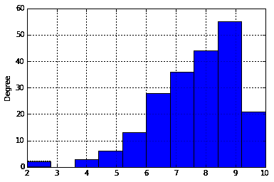
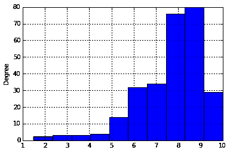

# 熊猫教程:用 Python 和熊猫分析视频游戏数据

> 原文：<https://www.dataquest.io/blog/pandas-python-tutorial/>

August 26, 2019

Python 的 pandas 库是使 Python 成为数据分析的伟大编程语言的原因之一。熊猫使数据的导入、分析和可视化变得更加容易。它建立在像 [NumPy](https://www.numpy.org/) 和 [matplotlib](https://matplotlib.org/) 这样的软件包上，给你一个单一、方便的地方来完成你的大部分数据分析和可视化工作。

在这个 Python 数据科学教程中，我们将使用熊猫来分析来自 [IGN](https://www.ign.com) 的视频游戏评论，这是一个流行的视频游戏评论网站，使用由 [Eric Grinstein](https://www.kaggle.com/egrinstein) 收集的数据。哪一款主机正在赢得“主机大战”(从拥有评论更好的游戏的意义上来说)？这个数据集将帮助我们找到答案。

当我们分析视频游戏评论的时候，我们将学习像索引这样的关键熊猫概念。你可以继续下去，在我们众多的其他 [Python 教程](https://www.dataquest.io/python-tutorials-for-data-science/)中，或者通过注册我们的 [Python 熊猫课程](https://www.dataquest.io/course/pandas-fundamentals/)来学习更多关于 Python 和熊猫的知识。我们的许多其他[数据科学课程](https://www.dataquest.io/path/data-scientist/)也使用熊猫。

注意，本教程是用 [Python 3.5](https://www.python.org/downloads/release/python-350/) 编写的，用 [Jupyter 笔记本](https://jupyter.org/)构建的。您可能会使用更新版本的 Python、pandas 和 Jupyter，但是您的结果应该基本相同。

## 用熊猫导入数据

如果你正在学习本教程，你需要下载数据集，你可以在这里做[。](https://www.dataquest.io/wp-content/uploads/2019/09/ign.csv)

我们要做的第一步是读入数据。数据存储为一个[逗号分隔值](https://en.wikipedia.org/wiki/Comma-separated_values)，或 csv 文件，其中每行由一个新行分隔，每列由一个逗号(`,`)分隔。以下是`ign.csv`文件的前几行:

```
 ,score_phrase,title,url,platform,score,genre,editors_choice,release_year,release_month,release_day
0,Amazing,LittleBigPlanet PS Vita,/games/littlebigplanet-vita/vita-98907,PlayStation Vita,9.0,Platformer,Y,2012,9,12
1,Amazing,LittleBigPlanet PS Vita -- Marvel Super Hero Edition,/games/littlebigplanet-ps-vita-marvel-super-hero-edition/vita-20027059,PlayStation Vita,9.0,Platformer,Y,2012,9,12
2,Great,Splice: Tree of Life,/games/splice/ipad-141070,iPad,8.5,Puzzle,N,2012,9,12
3,Great,NHL 13,/games/nhl-13/xbox-360-128182,Xbox 360,8.5,Sports,N,2012,9,11
```

正如你在上面看到的，文件中的每一行都代表一个被 IGN 审查过的游戏。这些列包含关于该游戏的信息:

*   `score_phrase`—IGN 如何用一个词形容这款游戏。这与其收到的分数相关联。
*   `title` —游戏的名称。
*   `url` —您可以查看完整评论的 URL。
*   `platform` —游戏被审查的平台(PC、PS4 等)。
*   `score` —游戏的分数，从`1.0`到`10.0`。
*   `genre` —游戏的流派。
*   `editors_choice`——`N`如果游戏不是编辑的选择，那么`Y`如果是。这和分数挂钩。
*   `release_year` —游戏发布的年份。
*   `release_month` —游戏发布的月份。
*   `release_day` —游戏发布的那一天。

还有一个包含行索引值的前导列。我们可以放心地忽略这一列，但是我们稍后将深入研究什么是索引值。

为了在 Python 和 pandas 中有效地处理数据，我们需要将 csv 文件读入一个 [Pandas 数据帧](https://pandas.pydata.org/pandas-docs/stable/generated/pandas.DataFrame.html)。数据框是一种表示和处理表格数据的方式，即以表格形式出现的数据，如电子表格。表格数据有行和列，就像我们的 csv 文件一样，但是如果我们能以表格的形式查看它，我们会更容易阅读和排序。

为了读入数据，我们需要使用 [pandas.read_csv](https://pandas.pydata.org/pandas-docs/stable/generated/pandas.read_csv.html) 函数。这个函数将接受一个 csv 文件并返回一个数据帧。以下代码将:

*   导入`pandas`库。我们将其重命名为`pd`，这样打字速度会更快。这是数据分析和数据科学中的标准约定，你会经常在别人的代码中看到熊猫被导入为`pd`。
*   将`ign.csv`读入一个数据帧，并将结果赋给一个名为`reviews`的新变量，这样我们就可以使用`reviews`来引用我们的数据。

```
 import pandas as pd
reviews = pd.read_csv("ign.csv") 
```

一旦我们读入了一个数据框架，以一种更直观的方式看一看我们得到了什么是很有帮助的。Pandas 方便地为我们提供了两种方法，可以快速地打印出表格中的数据。这些功能是:

*   DataFrame.head() —打印数据帧的前 N 行，其中 N 是作为参数传递给函数的数字，即`DataFrame.head(7)`。如果不传递任何参数，默认为 5。
*   data frame . tail()-打印数据帧的最后 N 行。同样，默认为`5`。

我们将使用`head`方法来查看`reviews`中的内容:

```
reviews.head()
```

|  | 未命名:0 | 分数 _ 短语 | 标题 | 全球资源定位器(Uniform Resource Locator) | 平台 | 得分 | 类型 | 编辑选择 | 发布年份 | 发布 _ 月份 | 发布日期 |
| --- | --- | --- | --- | --- | --- | --- | --- | --- | --- | --- | --- |
| Zero | Zero | 令人惊异的 | LittleBigPlanet PS Vita | /games/little big planet-vita/vita-98907 | PlayStation Vita | Nine | 平台游戏 | Y | Two thousand and twelve | nine | Twelve |
| one | one | 令人惊异的 | 小小大星球 PS Vita——漫威超级英雄 E… | /games/little big planet-PS-vita-marvel-super-he… | PlayStation Vita | Nine | 平台游戏 | Y | Two thousand and twelve | nine | Twelve |
| Two | Two | 伟大的 | 拼接:生命之树 | /games/splice/ipad-141070 | 苹果平板电脑 | Eight point five | 难题 | 普通 | Two thousand and twelve | nine | Twelve |
| three | three | 伟大的 | NHL 13 | /games/nhl-13/xbox-360-128182 | xbox360 | Eight point five | 运动 | 普通 | Two thousand and twelve | nine | Eleven |
| four | four | 伟大的 | NHL 13 | /games/nhl-13/ps3-128181 | 游戏机 3 | Eight point five | 运动 | 普通 | Two thousand and twelve | nine | Eleven |

我们还可以参观熊猫。DataFrame.shape 属性查看多行多列在`reviews`:

```
reviews.shape
```

```
(18625, 11)
```

正如我们所看到的，一切都被正确地读入——我们有`18,625`行和`11`列。

与类似的 Python 包(如 NumPy)相比，使用 Pandas 的一大优势是 Pandas 允许我们拥有不同数据类型的列。在我们的数据集`reviews`中，我们有存储浮点值(如`score`)、字符串值(如`score_phrase`)和整数(如`release_year`)的列，所以在这里使用 NumPy 会很困难，但 Pandas 和 Python 处理得很好。

现在我们已经正确地读入了数据，让我们开始索引`reviews`以获得我们想要的行和列。

## 用熊猫

索引数据帧

之前，我们使用了`head`方法来打印`reviews`的前`5`行。我们可以用[熊猫完成同样的事情。DataFrame.iloc](https://pandas.pydata.org/pandas-docs/version/0.17.0/generated/pandas.DataFrame.iloc.html) 方法。`iloc`方法允许我们按位置检索行和列。为了做到这一点，我们需要指定我们想要的行的位置，以及我们想要的列的位置。下面的代码将通过选择数据集中的第 0 到第 5 行以及所有列来复制我们的`reviews.head()`的结果:

```
reviews.iloc[0:5,:]
```

|  | 未命名:0 | 分数 _ 短语 | 标题 | 全球资源定位器(Uniform Resource Locator) | 平台 | 得分 | 类型 | 编辑选择 | 发布年份 | 发布 _ 月份 | 发布日期 |
| --- | --- | --- | --- | --- | --- | --- | --- | --- | --- | --- | --- |
| Zero | Zero | 令人惊异的 | LittleBigPlanet PS Vita | /games/little big planet-vita/vita-98907 | PlayStation Vita | Nine | 平台游戏 | Y | Two thousand and twelve | nine | Twelve |
| one | one | 令人惊异的 | 小小大星球 PS Vita——漫威超级英雄 E… | /games/little big planet-PS-vita-marvel-super-he… | PlayStation Vita | Nine | 平台游戏 | Y | Two thousand and twelve | nine | Twelve |
| Two | Two | 伟大的 | 拼接:生命之树 | /games/splice/ipad-141070 | 苹果平板电脑 | Eight point five | 难题 | 普通 | Two thousand and twelve | nine | Twelve |
| three | three | 伟大的 | NHL 13 | /games/nhl-13/xbox-360-128182 | xbox360 | Eight point five | 运动 | 普通 | Two thousand and twelve | nine | Eleven |
| four | four | 伟大的 | NHL 13 | /games/nhl-13/ps3-128181 | 游戏机 3 | Eight point five | 运动 | 普通 | Two thousand and twelve | nine | Eleven |

让我们更深入地研究一下我们的代码:我们指定我们需要行`0:5`。这意味着我们想要从位置`0`到位置`5`的行，但不包括这些行。

第一行被认为是在位置`0`，所以选择行`0:5`给出了在位置`0`、`1`、`2`、`3`和`4`的行。我们也需要所有的列，我们使用快捷方式来选择它们。它是这样工作的:如果我们忽略第一个位置值，比如`:5`，就假设我们指的是`0`。如果我们忽略最后一个位置值，如`0:`，则假设我们指的是数据帧中的最后一行或最后一列。我们需要所有的列，所以我们只指定了一个冒号(`:`)，没有任何位置。这给了我们从`0`到最后一列的列。以下是一些索引示例和结果:

*   `reviews.iloc[:5,:]` —前`5`行，以及这些行的所有列。
*   `reviews.iloc[:,:]` —整个数据帧。
*   `reviews.iloc[5:,5:]` —从位置`5`开始的行，从位置`5`开始的列。
*   `reviews.iloc[:,0]` —第一列，以及该列的所有行。
*   `reviews.iloc[9,:]` —第 10 行，以及该行的所有列。

按位置步进非常类似于 [NumPy](https://www.numpy.org/) 步进。如果你想了解更多，可以阅读[我们的 NumPy 教程](https://www.dataquest.io/blog/numpy-tutorial-python/)。现在我们知道了如何按位置索引，让我们删除第一列，它没有任何有用的信息:

```
 reviews = reviews.iloc[:,1:]
reviews.head()
```

|  | 分数 _ 短语 | 标题 | 全球资源定位器(Uniform Resource Locator) | 平台 | 得分 | 类型 | 编辑选择 | 发布年份 | 发布 _ 月份 | 发布日期 |
| --- | --- | --- | --- | --- | --- | --- | --- | --- | --- | --- |
| Zero | 令人惊异的 | LittleBigPlanet PS Vita | /games/little big planet-vita/vita-98907 | PlayStation Vita | Nine | 平台游戏 | Y | Two thousand and twelve | nine | Twelve |
| one | 令人惊异的 | 小小大星球 PS Vita——漫威超级英雄 E… | /games/little big planet-PS-vita-marvel-super-he… | PlayStation Vita | Nine | 平台游戏 | Y | Two thousand and twelve | nine | Twelve |
| Two | 伟大的 | 拼接:生命之树 | /games/splice/ipad-141070 | 苹果平板电脑 | Eight point five | 难题 | 普通 | Two thousand and twelve | nine | Twelve |
| three | 伟大的 | NHL 13 | /games/nhl-13/xbox-360-128182 | xbox360 | Eight point five | 运动 | 普通 | Two thousand and twelve | nine | Eleven |
| four | 伟大的 | NHL 13 | /games/nhl-13/ps3-128181 | 游戏机 3 | Eight point five | 运动 | 普通 | Two thousand and twelve | nine | Eleven |

### 在 Python 中使用标签索引熊猫

既然我们已经知道了如何按位置检索行和列，那么有必要研究一下使用数据帧的另一种主要方法，即按标签检索行和列。Pandas 相对于 NumPy 的一个主要优势是每一列和每一行都有一个标签。可以处理列位置，但是很难记住哪个数字对应于哪个列。

我们可以用[熊猫做标签。DataFrame.loc](https://pandas.pydata.org/pandas-docs/stable/generated/pandas.DataFrame.loc.html) 方法，它允许我们使用标签而不是位置进行索引。我们可以像这样使用`loc`方法显示`reviews`的前五行:

```
reviews.loc[0:5,:]
```

|  | 分数 _ 短语 | 标题 | 全球资源定位器(Uniform Resource Locator) | 平台 | 得分 | 类型 | 编辑选择 | 发布年份 | 发布 _ 月份 | 发布日期 |
| --- | --- | --- | --- | --- | --- | --- | --- | --- | --- | --- |
| Zero | 令人惊异的 | LittleBigPlanet PS Vita | /games/little big planet-vita/vita-98907 | PlayStation Vita | Nine | 平台游戏 | Y | Two thousand and twelve | nine | Twelve |
| one | 令人惊异的 | 小小大星球 PS Vita——漫威超级英雄 E… | /games/little big planet-PS-vita-marvel-super-he… | PlayStation Vita | Nine | 平台游戏 | Y | Two thousand and twelve | nine | Twelve |
| Two | 伟大的 | 拼接:生命之树 | /games/splice/ipad-141070 | 苹果平板电脑 | Eight point five | 难题 | 普通 | Two thousand and twelve | nine | Twelve |
| three | 伟大的 | NHL 13 | /games/nhl-13/xbox-360-128182 | xbox360 | Eight point five | 运动 | 普通 | Two thousand and twelve | nine | Eleven |
| four | 伟大的 | NHL 13 | /games/nhl-13/ps3-128181 | 游戏机 3 | Eight point five | 运动 | 普通 | Two thousand and twelve | nine | Eleven |
| five | 好的 | 全面战争战役:幕府将军 | /games/total-war-battles-幕府/mac-142565 | 麦金托什雨衣 | Seven | 战略 | 普通 | Two thousand and twelve | nine | Eleven |

以上其实看起来和`reviews.iloc[0:5,:]`没有太大区别。这是因为虽然行标签可以采用任何值，但是我们的行标签与位置完全匹配。您可以在上表的最左侧看到行标签(它们以粗体显示)。您也可以通过访问数据帧的[索引](https://pandas.pydata.org/pandas-docs/stable/generated/pandas.DataFrame.html)属性来查看它们。我们将显示`reviews`的行索引:

```
reviews.index
```

```
Int64Index([0, 1, 2, 3, 4, 5, 6, 7, 8, 9, 10, 11, 12, 13, 14, 15, 16, 17, 18, 19, 20, 21, 22, 23, 24, 25, 26, 27, 28, 29, 30, 31, 32, 33, 34, 35, 36, 37, 38, 39, 40, 41, 42, 43, 44, 45, 46, 47, 48, 49, 50, 51, 52, 53, 54, 55, 56, 57, 58, 59, 60, 61, 62, 63, 64, 65, 66, 67, 68, 69, 70, 71, 72, 73, 74, 75, 76, 77, 78, 79, 80, 81, 82, 83, 84, 85, 86, 87, 88, 89, 90, 91, 92, 93, 94, 95, 96, 97, 98, 99, ...], dtype='int64')
```

不过，指数并不总是与头寸相匹配。在下面的代码单元格中，我们将:

*   获取`reviews`的第`10`行到第`20`行，并将结果赋给`some_reviews`。
*   显示`some_reviews`的前`5`行。

```
some_reviews = reviews.iloc[10:20,]
some_reviews.head()
```

|  | 分数 _ 短语 | 标题 | 全球资源定位器(Uniform Resource Locator) | 平台 | 得分 | 类型 | 编辑选择 | 发布年份 | 发布 _ 月份 | 发布日期 |
| --- | --- | --- | --- | --- | --- | --- | --- | --- | --- | --- |
| Ten | 好的 | 铁拳标记锦标赛 2 | /games/tekken-tag-锦标赛-2/ps3-124584 | 游戏机 3 | Seven point five | 战斗的 | 普通 | Two thousand and twelve | nine | Eleven |
| Eleven | 好的 | 铁拳标记锦标赛 2 | /games/tekken-tag-锦标赛-2/xbox-360-124581 | xbox360 | Seven point five | 战斗的 | 普通 | Two thousand and twelve | nine | Eleven |
| Twelve | 好的 | 狂野之血 | /games/wild-blood/iphone-139363 | 苹果手机 | Seven | 圆盘烤饼 | 普通 | Two thousand and twelve | nine | Ten |
| Thirteen | 令人惊异的 | 忍者的标记 | /games/mark-of-ninja-135615/Xbox-360-129276 | xbox360 | Nine | 动作，冒险 | Y | Two thousand and twelve | nine | seven |
| Fourteen | 令人惊异的 | 忍者的标记 | /游戏/忍者标记-135615/pc-143761 | 个人电脑 | Nine | 动作，冒险 | Y | Two thousand and twelve | nine | seven |

如上所述，在`some_reviews`中，行索引从`10`开始，到`20`结束。因此，尝试将`loc`与低于`10`或高于`20`的数字一起使用会导致错误:

```
some_reviews.loc[9:21,:]
```

```
 ---------------------------------------------------------------------------
KeyError Traceback (most recent call last)
<ipython -input-76-5378b774c9a7> in <module>()
----> 1 some_reviews.loc[9:21,:]
/Users/vik/python_envs/dsserver/lib/python3.4/site-packages/pandas/core/indexing.py in __getitem__(self, key)
1198 def __getitem__(self, key):
1199 if type(key) is tuple:
-> 1200 return self._getitem_tuple(key)
1201 else:
1202 return self._getitem_axis(key, axis=0)
/Users/vik/python_envs/dsserver/lib/python3.4/site-packages/pandas/core/indexing.py in _getitem_tuple(self, tup)
702
703 # no multi-index, so validate all of the indexers
--> 704 self._has_valid_tuple(tup)
705
706 # ugly hack for GH #836
/Users/vik/python_envs/dsserver/lib/python3.4/site-packages/pandas/core/indexing.py in _has_valid_tuple(self, key)
129 if i >= self.obj.ndim:
130 raise IndexingError('Too many indexers')
--> 131 if not self._has_valid_type(k, i):
132 raise ValueError("Location based indexing can only have [%s] "
133 "types" % self._valid_types)
/Users/vik/python_envs/dsserver/lib/python3.4/site-packages/pandas/core/indexing.py in _has_valid_type(self, key, axis)
1258 raise KeyError(
1259 "start bound [%s] is not the [%s]" %
-> 1260 (key.start, self.obj._get_axis_name(axis))
1261 )
1262 if key.stop is not None:
KeyError: 'start bound [9] is not the [index]'
</module></ipython>
```

正如我们前面提到的，当您处理数据时，列标签可以使生活变得更加容易。我们可以在`loc`方法中指定列标签，通过标签而不是位置来检索列。

```
reviews.loc
[:5,"score"]
```

```
0 9.0
1 9.0
2 8.5
3 8.5
4 8.5
5 7.0
Name: score, dtype: float64
```

我们还可以通过传入一个列表来一次指定多个列:

```
reviews.loc[:5,["score", "release_year"]]
```

|  | 得分 | 发布年份 |
| --- | --- | --- |
| Zero | Nine | Two thousand and twelve |
| one | Nine | Two thousand and twelve |
| Two | Eight point five | Two thousand and twelve |
| three | Eight point five | Two thousand and twelve |
| four | Eight point five | Two thousand and twelve |
| five | Seven | Two thousand and twelve |

## 熊猫系列物件

我们可以用几种不同的方法在 Pandas 中检索一个单独的列。到目前为止，我们已经看到了两种类型的语法:

*   `reviews.iloc[:,1]` —将检索第二列。
*   `reviews.loc[:,"score_phrase"]` —也将检索第二列。

还有第三种更简单的方法来检索整个列。我们可以在方括号中指定列名，就像字典一样:

```
reviews["score"]
```

```
0 9.0
1 9.0
2 8.5
3 8.5
4 8.5
5 7.0
6 3.0
7 9.0
8 3.0
9 7.0
10 7.5
11 7.5
12 7.0
13 9.0
14 9.0
...
18610 6.0
18611 5.8
18612 7.8
18613 8.0
18614 9.2
18615 9.2
18616 7.5
18617 8.4
18618 9.1
18619 7.9
18620 7.6
18621 9.0
18622 5.8
18623 10.0
18624 10.0
Name: score, Length: 18625, dtype: float64
```

我们也可以通过这种方法使用列列表:

```
reviews[["score", "release_year"]]
```

|  | 得分 | 发布年份 |
| --- | --- | --- |
| Zero | Nine | Two thousand and twelve |
| one | Nine | Two thousand and twelve |
| Two | Eight point five | Two thousand and twelve |
| three | Eight point five | Two thousand and twelve |
| four | Eight point five | Two thousand and twelve |
| five | Seven | Two thousand and twelve |
| six | Three | Two thousand and twelve |
| seven | Nine | Two thousand and twelve |
| eight | Three | Two thousand and twelve |
| nine | Seven | Two thousand and twelve |
| Ten | Seven point five | Two thousand and twelve |
| Eleven | Seven point five | Two thousand and twelve |
| Twelve | Seven | Two thousand and twelve |
| Thirteen | Nine | Two thousand and twelve |
| Fourteen | Nine | Two thousand and twelve |
| Fifteen | Six point five | Two thousand and twelve |
| Sixteen | Six point five | Two thousand and twelve |
| Seventeen | Eight | Two thousand and twelve |
| Eighteen | Five point five | Two thousand and twelve |
| Nineteen | Seven | Two thousand and twelve |
| Twenty | Seven | Two thousand and twelve |
| Twenty-one | Seven point five | Two thousand and twelve |
| Twenty-two | Seven point five | Two thousand and twelve |
| Twenty-three | Seven point five | Two thousand and twelve |
| Twenty-four | Nine | Two thousand and twelve |
| Twenty-five | Seven | Two thousand and twelve |
| Twenty-six | Nine | Two thousand and twelve |
| Twenty-seven | Seven point five | Two thousand and twelve |
| Twenty-eight | Eight | Two thousand and twelve |
| Twenty-nine | Six point five | Two thousand and twelve |
| … | … | … |
| Eighteen thousand five hundred and ninety-five | Four point four | Two thousand and sixteen |
| Eighteen thousand five hundred and ninety-six | Six point five | Two thousand and sixteen |
| Eighteen thousand five hundred and ninety-seven | Four point nine | Two thousand and sixteen |
| Eighteen thousand five hundred and ninety-eight | Six point eight | Two thousand and sixteen |
| Eighteen thousand five hundred and ninety-nine | Seven | Two thousand and sixteen |
| Eighteen thousand six hundred | Seven point four | Two thousand and sixteen |
| Eighteen thousand six hundred and one | Seven point four | Two thousand and sixteen |
| Eighteen thousand six hundred and two | Seven point four | Two thousand and sixteen |
| Eighteen thousand six hundred and three | Seven point eight | Two thousand and sixteen |
| Eighteen thousand six hundred and four | Eight point six | Two thousand and sixteen |
| Eighteen thousand six hundred and five | Six | Two thousand and sixteen |
| Eighteen thousand six hundred and six | Six point four | Two thousand and sixteen |
| Eighteen thousand six hundred and seven | Seven | Two thousand and sixteen |
| Eighteen thousand six hundred and eight | Five point four | Two thousand and sixteen |
| Eighteen thousand six hundred and nine | Eight | Two thousand and sixteen |
| Eighteen thousand six hundred and ten | Six | Two thousand and sixteen |
| Eighteen thousand six hundred and eleven | Five point eight | Two thousand and sixteen |
| Eighteen thousand six hundred and twelve | Seven point eight | Two thousand and sixteen |
| Eighteen thousand six hundred and thirteen | Eight | Two thousand and sixteen |
| Eighteen thousand six hundred and fourteen | Nine point two | Two thousand and sixteen |
| Eighteen thousand six hundred and fifteen | Nine point two | Two thousand and sixteen |
| Eighteen thousand six hundred and sixteen | Seven point five | Two thousand and sixteen |
| Eighteen thousand six hundred and seventeen | Eight point four | Two thousand and sixteen |
| Eighteen thousand six hundred and eighteen | Nine point one | Two thousand and sixteen |
| Eighteen thousand six hundred and nineteen | Seven point nine | Two thousand and sixteen |
| Eighteen thousand six hundred and twenty | Seven point six | Two thousand and sixteen |
| Eighteen thousand six hundred and twenty-one | Nine | Two thousand and sixteen |
| Eighteen thousand six hundred and twenty-two | Five point eight | Two thousand and sixteen |
| Eighteen thousand six hundred and twenty-three | Ten | Two thousand and sixteen |
| Eighteen thousand six hundred and twenty-four | Ten | Two thousand and sixteen |

18625 行× 2 列

当我们检索单个列时，我们实际上是在检索一个熊猫[系列](https://pandas.pydata.org/pandas-docs/stable/generated/pandas.Series.html)对象。DataFrame 存储表格数据，而 Series 存储单列或单行数据。

我们可以验证单个列是一个系列:

```
type(reviews["score"])
```

```
pandas.core.series.Series
```

我们可以手动创建一个系列来更好地理解它是如何工作的。为了创建一个系列，我们在实例化 Series 对象时将一个 list 或 NumPy 数组传递给它:

```
s1 = pd.Series([1,2])
s1
```

```
 0 1
1 2
dtype: int64
```

系列可以包含任何类型的数据，包括混合类型的数据。在这里，我们创建一个包含字符串对象的系列:

```
s2 = pd.Series(["Boris Yeltsin", "Mikhail Gorbachev"])
s2
```

```
 0 Boris Yeltsin
1 Mikhail Gorbachev
dtype: object
```

## 在 Pandas

中创建数据帧

我们可以通过将多个系列传递给 DataFrame 类来创建一个 DataFrame。这里，我们传入刚刚创建的两个系列对象，

`s1`为第一行，`s2`为第二行:

```
pd.DataFrame([s1,s2])
```

|  | Zero | one |
| --- | --- | --- |
| Zero | one | Two |
| one | 鲍里斯·叶利钦 | 米哈伊尔·戈尔巴乔夫 |

我们也可以用列表来完成同样的事情。每个内部列表都被视为结果数据帧中的一行:

```
pd.DataFrame(
    [
    [1,2],
    ["Boris Yeltsin", "Mikhail Gorbachev"]
    ]
) 
```

|  | Zero | one |
| --- | --- | --- |
| Zero | one | Two |
| one | 鲍里斯·叶利钦 | 米哈伊尔·戈尔巴乔夫 |

我们可以在创建数据帧时指定列标签:

```
 pd.DataFrame(
    [
    [1,2],
    ["Boris Yeltsin", "Mikhail Gorbachev"]
    ],
    columns=["column1", "column2"]
)
```

|  | 列 1 | 列 2 |
| --- | --- | --- |
| Zero | one | Two |
| one | 鲍里斯·叶利钦 | 米哈伊尔·戈尔巴乔夫 |

以及行标签(索引):

```
frame = pd.DataFrame(
    [
    [1,2],
    ["Boris Yeltsin", "Mikhail Gorbachev"]
    ],
    index=["row1", "row2"],
    columns=["column1", "column2"]
)
frame
```

|  | 列 1 | 列 2 |
| --- | --- | --- |
| 行 1 | one | Two |
| 第 2 行 | 鲍里斯·叶利钦 | 米哈伊尔·戈尔巴乔夫 |

还要注意，缩进和分隔线不是必需的。我们以这种方式编写代码是为了让它更容易解析，但是您经常会遇到把它写成一行的情况。例如，下面的代码将产生与我们在本段上表中看到的完全相同的结果:

```
 frame = pd.DataFrame([[1,2],["Boris Yeltsin", "Mikhail Gorbachev"]],index=["row1", "row2"],columns=["column1", "column2"])

frame
```

无论如何，一旦我们添加了标签，我们就可以使用它们来索引数据帧:

```
frame.loc["row1":"row2", "column1"]
```

```
 row1 1
row2 Boris Yeltsin
Name: column1, dtype: object
```

如果我们将字典传递给`DataFrame`构造函数，我们可以跳过指定`columns`关键字参数。这将自动设置列名:

```
 frame = pd.DataFrame(
    {
    "column1": [1, "Boris Yeltsin"],
    "column2": [2, "Mikhail Gorbachev"]
    }
)
frame
```

|  | 列 1 | 列 2 |
| --- | --- | --- |
| Zero | one | Two |
| one | 鲍里斯·叶利钦 | 米哈伊尔·戈尔巴乔夫 |

## 熊猫数据帧方法

正如我们前面提到的，熊猫数据帧中的每一列都是一个系列对象:

```
type(reviews["title"])
```

```
pandas.core.series.Series
```

我们可以在一个系列对象上调用我们可以在一个数据帧上调用的大多数相同的方法，包括`head`:

```
reviews["title"].head()
```

```
 0 LittleBigPlanet PS Vita
1 LittleBigPlanet PS Vita -- Marvel Super Hero E...
2 Splice: Tree of Life
3 NHL 13
4 NHL 13
Name: title, dtype: object
```

Pandas 系列和 DataFrames 也有其他方法使计算更简单。例如，我们可以用熊猫。Series.mean 求数列平均值的方法:

```
reviews["score"].mean()
```

```
6.950459060402685
```

我们也可以称类似的动物为熊猫。DataFrame.mean 方法，默认情况下，该方法将查找 DataFrame 中每个数值列的平均值:

```
reviews.mean()
```

```
 score 6.950459
release_year 2006.515329
release_month 7.138470
release_day 15.603866
dtype: float64
```

我们可以将关键字参数`axis`修改为`mean`，以便计算每行或每列的平均值。默认情况下，`axis`等于`0`，将计算每列的平均值。我们也可以将它设置为`1`来计算每行的平均值。请注意，这将只计算每行中数值的平均值:

```
reviews.mean(axis=1)
```

```
0 510.500
1 510.500
2 510.375
3 510.125
4 510.125
5 509.750
6 508.750
7 510.250
8 508.750
9 509.750
10 509.875
11 509.875
12 509.500
13 509.250
14 509.250
...
18610 510.250
18611 508.700
18612 509.200
18613 508.000
18614 515.050
18615 515.050
18616 508.375
18617 508.600
18618 515.025
18619 514.725
18620 514.650
18621 515.000
18622 513.950
18623 515.000
18624 515.000
Length: 18625, dtype: float64
```

在序列和数据帧上有很多类似于`mean`的方法。以下是一些方便的例子:

*   熊猫。DataFrame.corr —查找数据帧中各列之间的相关性。
*   熊猫。DataFrame.count —计算每个 DataFrame 列中非空值的数量。
*   熊猫。DataFrame.max —查找每列中的最大值。
*   熊猫。DataFrame.min —查找每列中的最小值。
*   熊猫。DataFrame.median —查找每列的中间值。
*   熊猫。DataFrame.std —查找每列的标准偏差。

例如，我们可以使用`corr`方法来查看是否有任何列与`score`相关。这将告诉我们最近发布的游戏是否获得了更高的评论(`release_year`)，或者接近年底发布的游戏是否得分更高(`release_month`):

```
reviews.corr()
```

|  | 得分 | 发布年份 | 发布 _ 月份 | 发布日期 |
| --- | --- | --- | --- | --- |
| 得分 | 1.000000 | 0.062716 | 0.007632 | 0.020079 |
| 发布年份 | 0.062716 | 1.000000 | -0.115515 | 0.016867 |
| 发布 _ 月份 | 0.007632 | -0.115515 | 1.000000 | -0.067964 |
| 发布日期 | 0.020079 | 0.016867 | -0.067964 | 1.000000 |

正如我们在上面看到的，没有一个数字列与`score`相关，所以我们知道发布时间与评审分数没有线性关系。

### 与熊猫的数据帧数学

我们还可以用 pandas 对 Python 中的 Series 或 DataFrame 对象进行数学运算。例如，我们可以将`score`列中的每个值除以`2`来将刻度从`0`–`10`切换到`0`–`5`:

```
reviews["score"] / 2
```

```
0 4.50
1 4.50
2 4.25
3 4.25
4 4.25
5 3.50
6 1.50
7 4.50
8 1.50
9 3.50
10 3.75
11 3.75
12 3.50
13 4.50
14 4.50
...
18610 3.00
18611 2.90
18612 3.90
18613 4.00
18614 4.60
18615 4.60
18616 3.75
18617 4.20
18618 4.55
18619 3.95
18620 3.80
18621 4.50
18622 2.90
18623 5.00
18624 5.00
Name: score, Length: 18625, dtype: float64
```

在 Python 中工作的所有常见数学运算符，如`+`、`-`、`*`、`/`和`^`将在 pandas 中对系列或数据帧工作，并将应用于数据帧或系列中的每个元素。

## 熊猫
中的布尔索引

现在我们已经对熊猫有了一些基本的了解，让我们开始我们的分析。我们之前看到过，`reviews`的`score`列中所有值的平均值都在`7`附近。如果我们想找到所有得分高于平均水平的游戏呢？

我们可以从做一个比较开始。该比较将序列中的每个值与指定值进行比较，然后生成一个充满布尔值的序列，指示比较的状态。例如，我们可以看到哪些行的`score`值高于`7`:

```
 score_filter = reviews["score"] > 7
score_filter
```

```
 0 True
1 True
2 True
3 True
4 True
5 False
6 False
7 True
8 False
9  False
10 True
11 True
12 False
13 True
14 True...
18610 False
18611 False
18612 True
18613 True
18614 True
18615 True
18616 True
18617 True
18618 True
18619 True
18620 True
18621 True
18622 False
18623 True
18624 True
Name: score, Length: 18625, dtype: bool
```

一旦我们有了一个布尔序列，我们就可以用它来选择数据帧中包含值`True`的行。因此，我们只能在`reviews`中选择`score`大于`7`的行:

```
 filtered_reviews = reviews[score_filter]
filtered_reviews.head()
```

|  | 分数 _ 短语 | 标题 | 全球资源定位器(Uniform Resource Locator) | 平台 | 得分 | 类型 | 编辑选择 | 发布年份 | 发布 _ 月份 | 发布日期 |
| --- | --- | --- | --- | --- | --- | --- | --- | --- | --- | --- |
| Zero | 令人惊异的 | LittleBigPlanet PS Vita | /games/little big planet-vita/vita-98907 | PlayStation Vita | Nine | 平台游戏 | Y | Two thousand and twelve | nine | Twelve |
| one | 令人惊异的 | 小小大星球 PS Vita——漫威超级英雄 E… | /games/little big planet-PS-vita-marvel-super-he… | PlayStation Vita | Nine | 平台游戏 | Y | Two thousand and twelve | nine | Twelve |
| Two | 伟大的 | 拼接:生命之树 | /games/splice/ipad-141070 | 苹果平板电脑 | Eight point five | 难题 | 普通 | Two thousand and twelve | nine | Twelve |
| three | 伟大的 | NHL 13 | /games/nhl-13/xbox-360-128182 | xbox360 | Eight point five | 运动 | 普通 | Two thousand and twelve | nine | Eleven |
| four | 伟大的 | NHL 13 | /games/nhl-13/ps3-128181 | 游戏机 3 | Eight point five | 运动 | 普通 | Two thousand and twelve | nine | Eleven |

可以使用多个条件进行过滤。假设我们想要找到为`Xbox One`发布的分数超过`7`的游戏。在下面的代码中，我们:

*   用两个条件设置过滤器:
    *   检查`score`是否大于`7`。
    *   检查`platform`是否等于`Xbox One`
*   对`reviews`应用过滤器，只获取我们想要的行。
*   使用`head`方法打印`filtered_reviews`的前`5`行。

```
 xbox_one_filter = (reviews["score"] > 7) & (reviews["platform"] == "Xbox One")
filtered_reviews = reviews[xbox_one_filter]
filtered_reviews.head() 
```

|  | 分数 _ 短语 | 标题 | 全球资源定位器(Uniform Resource Locator) | 平台 | 得分 | 类型 | 编辑选择 | 发布年份 | 发布 _ 月份 | 发布日期 |
| --- | --- | --- | --- | --- | --- | --- | --- | --- | --- | --- |
| Seventeen thousand one hundred and thirty-seven | 令人惊异的 | 回家了 | /games/gone-home/Xbox-one-2001 4 3 61 | Xbox One | Nine point five | 模拟 | Y | Two thousand and thirteen | eight | Fifteen |
| Seventeen thousand one hundred and ninety-seven | 令人惊异的 | 雷曼传奇 | /games/rayman-legends/Xbox-one-20008449 | Xbox One | Nine point five | 平台游戏 | Y | Two thousand and thirteen | eight | Twenty-six |
| Seventeen thousand two hundred and ninety-five | 令人惊异的 | 乐高漫威超级英雄 | /游戏/乐高-漫威-超级英雄/xbox-one-20000826 | Xbox One | Nine | 行动 | Y | Two thousand and thirteen | Ten | Twenty-two |
| Seventeen thousand three hundred and thirteen | 伟大的 | 死亡崛起 3 | /games/死亡崛起-3/xbox-one-124306 | Xbox One | Eight point three | 行动 | 普通 | Two thousand and thirteen | Eleven | Eighteen |
| Seventeen thousand three hundred and seventeen | 伟大的 | 杀手本能 | /games/killer-instinct-2013/Xbox-one-2000 05 38 | Xbox One | Eight point four | 战斗的 | 普通 | Two thousand and thirteen | Eleven | Eighteen |

当使用多个条件进行过滤时，将每个条件放在括号中，并用一个&符号(`&`)将它们分开，这一点很重要。

## 熊猫密谋

现在我们知道了如何过滤，我们可以创建图表来观察`Xbox One`的评论分布和`PlayStation 4`的评论分布。这将有助于我们找出哪个主机的游戏更好。

我们可以通过直方图来做到这一点，直方图将绘制不同得分范围的频率。我们可以使用[熊猫为每个控制台制作一个直方图。DataFrame.plot](https://pandas.pydata.org/pandas-docs/stable/generated/pandas.DataFrame.plot.html) 方法。该方法利用流行的 Python 绘图库 matplotlib 来生成好看的绘图。

`plot`方法默认画一个线图。我们需要传入关键字参数`kind="hist"`来绘制直方图。在下面的代码中，我们:

*   调用`%matplotlib inline`在 Jupyter 笔记本中设置绘图。
*   过滤`reviews`以仅包含关于`Xbox One`的数据。
*   绘制`score`列。

```
 reviews[reviews["platform"] == "Xbox One"]["score"].plot(kind="hist")
```

```
<matplotlib.axes._subplots.AxesSubplot at 0x10c9c5438>
```



我们也可以对`PS4`做同样的事情:

```
reviews[reviews["platform"] == "PlayStation 4"]["score"].plot(kind="hist")
```

```
<matplotlib.axes._subplots.AxesSubplot at 0x10c9e0e80>
```



从我们的直方图来看，`PlayStation 4`比`Xbox One`有更多的高评分游戏。

显然，这只是冰山一角，当谈到我们可以分析这个数据集的潜在方向时，但我们已经有了一个良好的开端:我们已经使用 Python 和 pandas 导入了一个数据集，学会了使用各种不同的索引方法选择我们想要的数据点，并做了一些快速的探索性数据分析来回答我们开始时提出的问题。

## 免费熊猫小抄

如果你有兴趣了解更多关于熊猫的知识，请查看我们关于 [NumPy 和熊猫](https://www.dataquest.io/course/python-for-data-science-intermediate/)的互动课程。你可以注册并免费上第一课。你可能也想通过我们的[免费熊猫小抄把你的熊猫技能提升到一个新的水平！](https://s3.amazonaws.com/dq-blog-files/pandas-cheat-sheet.pdf)

## 延伸阅读

希望这篇 Pandas 教程能够帮助您使用 Pandas 和 Python 来阅读、探索、分析和可视化数据。在下一篇文章中，我们将讨论数据分组和更高级的计算。这里可以找到[。如果你想了解更多关于熊猫的信息，请查阅以下资源:](https://www.dataquest.io/blog/pandas-tutorial-python-2/)

*   [数据探索熊猫课程](https://www.dataquest.io/course/pandas-fundamentals/)
*   [距离熊猫还有 10 分钟](https://pandas.pydata.org/pandas-docs/stable/10min.html)
*   [熊猫数据结构简介](http://www.gregreda.com/2013/10/26/intro-to-pandas-data-structures/)

*本文最后更新于 2019 年 9 月*。

## 获取免费的数据科学资源

免费注册获取我们的每周时事通讯，包括数据科学、 **Python** 、 **R** 和 **SQL** 资源链接。此外，您还可以访问我们免费的交互式[在线课程内容](/data-science-courses)！

[SIGN UP](https://app.dataquest.io/signup)