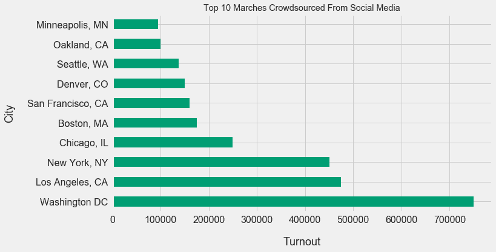
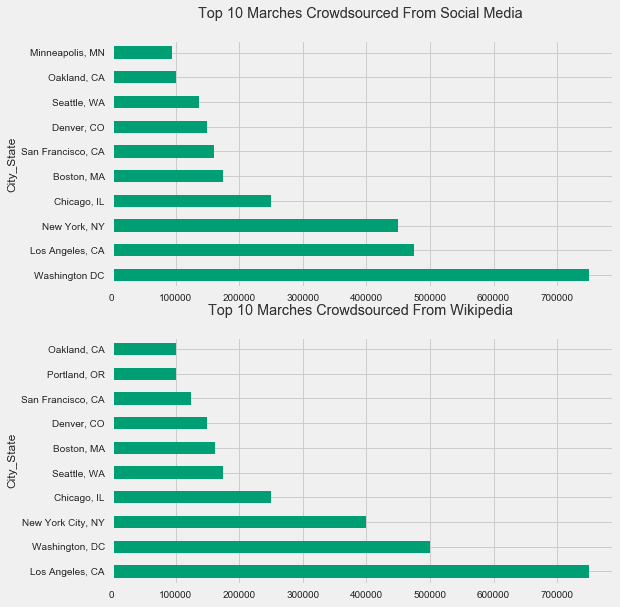
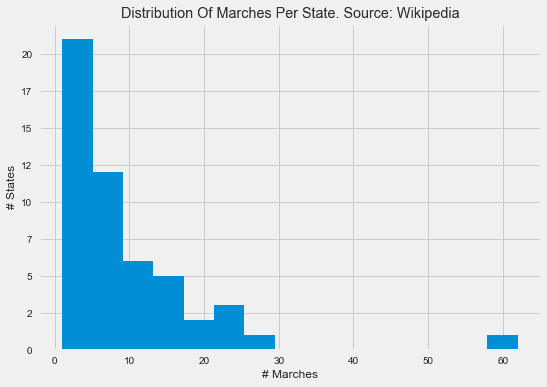
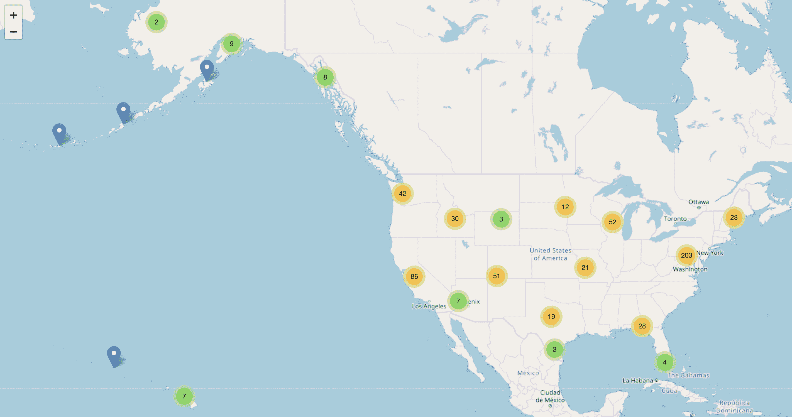
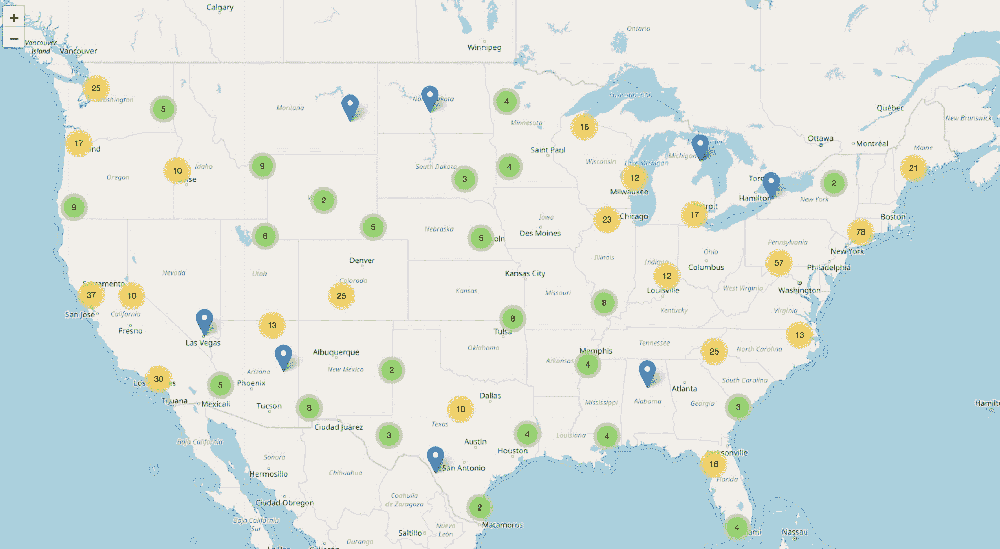

# 可视化女性游行:第二部分

> 原文：<https://www.dataquest.io/blog/visualizing-womens-marches-part-2/>

March 30, 2018This post is the second in a series on visualizing the Women’s Marches from January 2017\. In the first post, we explored the intensive data collection and data cleaning process necessary to produce clean pandas dataframes.

### 数据丰富

因为我们最终希望能够构建可视化游行的地图，所以我们需要纬度和经度坐标。如果我们预览这两个数据帧，您会注意到我们遗漏了这两个数据帧的信息:

```
sm_marches.head()
```

|  | 城市州 | 状态 | 国家 | 低的 | 平均的 | 高的 |
| Zero | 德克萨斯州阿比林 | 谢谢 | 美国 | Two hundred | Two hundred | Two hundred |
| one | 事故，医学博士 | 医学博士 | 美国 | Fifty-four | Fifty-four | Fifty-four |
| Two | Adak, AK | 阿拉斯加 | 美国 | Ten | Ten | Ten |
| three | 密歇根州阿德里安 | 大调音阶的第三音 | 美国 | One hundred and fifty | One hundred and fifty | One hundred and fifty |
| four | 亚利桑那州阿霍 | 阿塞拜疆（Azerbaijan 的缩写） | 美国 | Two hundred and fifty | Two hundred and fifty | Two hundred and fifty |

```
wiki_marches.head()
```

|  | 状态 | 城市 | 出动 |
| Zero | 得克萨斯州 | 阿比林 | Two hundred |
| one | 马里兰州 | 事故 | Fifty-four |
| Two | 阿拉斯加 | 数据，数据 | Ten |
| three | 密歇根 | 艾德里安(男子名) | One hundred and forty |
| four | 科罗拉多州 | 阿拉莫萨 | Three hundred and fifty |

另一个问题是一个数据帧使用状态代码(如

`TX)`而另一个使用完整的状态名(如`Texas`)。幸运的是，我们可以使用地理编码服务来解决缺失地理数据和状态表示的问题。[地理编码](https://en.wikipedia.org/wiki/Geocoding)是将地址转换成一对具体的经纬度坐标的过程。使用地理编码服务来改善数据集是[数据丰富](https://www.techopedia.com/definition/28037/data-enrichment)的一个例子。数据丰富在数据科学项目中非常常见，因为原始数据很少包含我们感兴趣的所有信息。虽然我们没有游行发生地点的具体地址，但地理编码服务将接受城市和州名的组合(例如，`TX`或`Texas`的州市)。有许多地理编码服务，但我们将使用[geocodeio](https://geocod.io/)，因为它是我熟悉的一种服务，并且有 2500 个免费查找层。我们可以通过上传电子表格文件或[他们的 API](https://geocod.io/docs/) 来使用 Geocodio。由于我们只有两个小的电子表格，我们将使用他们的上传工具。请注意，使用地理编码*需要您创建一个帐户。以下是一些其他地理编码服务的列表，如果你不想使用 geocodeio:[https://geo Services . tamu . edu/Services/Geocode/other geocoders/](https://geoservices.tamu.edu/Services/Geocode/OtherGeocoders/)让我们使用 [`DataFrame.to_csv()`](https://pandas.pydata.org/pandas-docs/stable/generated/pandas.DataFrame.to_csv.html) 将`sm_marches`导出为 CSV 文件:*

```
sm_marches.to_csv("sm_marches.csv", index=False)
```

上传两者

`sm_marches.csv`和`FinalWiki.csv`到 Geocodio。该服务将要求您指定哪些列代表地址、州、国家、邮政编码等(您不需要拥有所有的字段)。然后，Geocodio 将在新列中添加该服务对每行的最佳猜测，并让您将新的 CSV 文件下载回您的计算机。最后，将这些文件重命名为`FinalWiki_geocodio.csv`和`sm_csv_geocodio.csv`。让我们将这两个文件读回到 dataframes 中，并研究添加的列。

```
sm_gc = pd.read_csv("sm_csv_geocodio.csv")
wiki_gc = pd.read_csv("FinalWiki_geocodio.csv")
sm_gc.head()
```

|  | 城市州 | 状态 | 国家 | 低的 | 平均的 | 高的 | 纬度 | 经度 | 准确度分数 | 准确度类型 | 数字 | 街道 | 城市 | 国家. 1 | 县 | 活力 | 国家. 1 | 来源 |
| Zero | 德克萨斯州阿比林 | 谢谢 | 美国 | Two hundred | Two hundred | Two hundred | 32.576489 | -99.665323 | One | 地方 | 圆盘烤饼 | 圆盘烤饼 | 阿比林 | 谢谢 | 泰勒县 | Seventy-nine thousand six hundred and one | 美国 | 来自美国人口普查局的老虎/线数据集 |
| one | 事故，医学博士 | 医学博士 | 美国 | Fifty-four | Fifty-four | Fifty-four | 39.628700 | -79.319760 | One | 地方 | 圆盘烤饼 | 圆盘烤饼 | 事故 | 医学博士 | 加勒特县 | Twenty-one thousand five hundred and twenty | 美国 | 来自美国人口普查局的老虎/线数据集 |
| Two | Adak, AK | 阿拉斯加 | 美国 | Ten | Ten | Ten | 51.829438 | -176.629994 | One | 地方 | 圆盘烤饼 | 圆盘烤饼 | 数据，数据 | 阿拉斯加 | 阿留申群岛西部人口普查区 | Ninety-nine thousand five hundred and forty-six | 美国 | 来自美国人口普查局的老虎/线数据集 |
| three | 密歇根州阿德里安 | 大调音阶的第三音 | 美国 | One hundred and fifty | One hundred and fifty | One hundred and fifty | 41.889943 | -84.065892 | One | 地方 | 圆盘烤饼 | 圆盘烤饼 | 艾德里安(男子名) | 大调音阶的第三音 | Lenawee County | Forty-nine thousand two hundred and twenty-one | 美国 | 来自美国人口普查局的老虎/线数据集 |
| four | 亚利桑那州阿霍 | 阿塞拜疆（Azerbaijan 的缩写） | 美国 | Two hundred and fifty | Two hundred and fifty | Two hundred and fifty | 32.384890 | -112.890110 | One | 地方 | 圆盘烤饼 | 圆盘烤饼 | Ajo | 阿塞拜疆（Azerbaijan 的缩写） | 皮马县 | Eighty-five thousand three hundred and twenty-one | 美国 | 来自美国人口普查局的老虎/线数据集 |

```
wiki_gc.head()
```

|  | 状态 | 城市 | 出动 | 纬度 | 经度 | 准确度分数 | 准确度类型 | 数字 | 街道 | 城市. 1 | 国家. 1 | 县 | 活力 | 国家 | 来源 |
| Zero | 得克萨斯州 | 阿比林 | Two hundred | 32.576489 | -99.665323 | One | 地方 | 圆盘烤饼 | 圆盘烤饼 | 阿比林 | 谢谢 | 泰勒县 | Seventy-nine thousand six hundred and one | 美国 | 来自美国人口普查局的老虎/线数据集 |
| one | 马里兰州 | 事故 | Fifty-four | 39.628700 | -79.319760 | One | 地方 | 圆盘烤饼 | 圆盘烤饼 | 事故 | 医学博士 | 加勒特县 | Twenty-one thousand five hundred and twenty | 美国 | 来自美国人口普查局的老虎/线数据集 |
| Two | 阿拉斯加 | 数据，数据 | Ten | 51.829438 | -176.629994 | One | 地方 | 圆盘烤饼 | 圆盘烤饼 | 数据，数据 | 阿拉斯加 | 阿留申群岛西部人口普查区 | Ninety-nine thousand five hundred and forty-six | 美国 | 来自美国人口普查局的老虎/线数据集 |
| three | 密歇根 | 艾德里安(男子名) | One hundred and forty | 41.889943 | -84.065892 | One | 地方 | 圆盘烤饼 | 圆盘烤饼 | 艾德里安(男子名) | 大调音阶的第三音 | Lenawee County | Forty-nine thousand two hundred and twenty-one | 美国 | 来自美国人口普查局的老虎/线数据集 |
| four | 科罗拉多州 | 阿拉莫萨 | Three hundred and fifty | 37.479933 | -105.790967 | One | 地方 | 圆盘烤饼 | 圆盘烤饼 | 阿拉莫萨 | 指挥官（commanding officer) | 阿拉莫萨县 | Eighty-one thousand one hundred and one | 美国 | 来自美国人口普查局的老虎/线数据集 |

Geocodio 增加了几个额外的列:

*   `Latitude`
*   `Longitude`
*   `Accuracy Score`
*   `Accuracy Type`
*   `Number`
*   `Street`
*   `City`(在一个数据帧中呈现为`City.1`，因为`City`已经存在)
*   `State`(在两个数据帧中呈现为`State.1`，因为`State`已经存在)
*   `County`(在一个数据帧中呈现为`Country.1`，因为`Country`已经存在)
*   `Zip`
*   `Country`
*   `Source`

让我们来确定哪些行具有 Geocodio 的高置信度得分，哪些行 Geocodio 根本无法进行地理编码。让我们计算置信度得分小于的行数

`1`(注意列名的细微差别):

```
sm_count = len(sm_gc[sm_gc['Accuracy Score'] < 1.00][['City_State', 'City', 'State.1', 'Latitude', 'Longitude']])
wiki_count = len(wiki_gc[wiki_gc['Accuracy Score'] < 1.00][['State', 'City', 'City.1', 'State.1', 'Latitude', 'Longitude']])
print(sm_count)
print(wiki_count)
```

```
32
16
```

由于没有太多的行，我们可以手动检查 Geocodio 不确定的每一行。让我们增加熊猫在 jupyter 笔记本中显示的行数，以便更容易验证每一行。

```
pd.options.display.max_rows = 50
```

这里有一个我们可以使用的工作流程:

*   将原始城市和州的值与 geo codeo 返回的值进行比较，看它们是否匹配(或者 geo codeo 是否找到了匹配)。
    *   如果它们不匹配或完全丢失，请使用谷歌地图搜索位置，单击并按住轮廓区域的中心以放置一个点，然后复制纬度和经度坐标。创建一个字典，将行索引值添加到包含坐标:`sm_replace_dict = { 15: [30.6266, 81.4609], ... }`的列表中
    *   对于没有明确位置的游行(例如`Hospital Ward, CA`)，将索引值存储在一个单独的列表中，我们将一次性删除这些行。

这是转换的结果代码

`sm_gc`:

```
 sm_replace_dict = {
    15: [30.6266, 81.4609],
    70: [37.191807, -108.078634],
    78: [42.914664, -78.864897],
    97: [37.555616, -76.304590],
    159: [35.047669, -108.323769],
    234: [48.199181, -120.773236],
    242: [39.245103, -76.914071],
    326: [39.956147, -74.922647],
    331: [41.379763, -70.649143],
    376: [30.013898, -90.013031],
    475: [17.716221, -64.831193],
    513: [46.486260, -84.355558],
    528: [32.459338, -93.769839],
    539: [38.978815, -119.932676],
    573: [44.224584, -74.462409],
    581: [43.095693, -75.229880]}
sm_drop = [238]

for k,v in sm_replace_dict.items():
    sm_gc.at[k, 'Latitude'] = v[0]
    sm_gc.at[k, 'Longitude'] = v[1]

for i in sm_drop:
    sm_gc = sm_gc.drop(i, axis=0)
```

这是转换的代码

`wiki_gc`:

```
 for k,v in wiki_replace_dict.items():
    wiki_gc.at[k, 'Latitude'] = v[0]
    wiki_gc.at[k, 'Longitude'] = v[1]

for i in wiki_drop:
    wiki_gc = wiki_gc.drop(i, axis=0)
```

让我们只选择要用于分析和可视化的列，并将它们分配给新的数据框架:

```
 sm_keep_cols = ['City_State', 'State', 'Average', 'Latitude', 'Longitude']
wiki_keep_cols = ['City', 'State', 'Turnout', 'Latitude', 'Longitude']

sm_ds = sm_gc[sm_keep_cols]
wiki_ds = wiki_gc[wiki_keep_cols]
```

最后，让我们将描述投票人数的两列都转换成数字列。

```
 wiki_ds['Turnout'] = pd.to_numeric(wiki_ds['Turnout'])
sm_ds['Average'] = pd.to_numeric(sm_ds['Average'].str.replace(",", ""))
```

现在我们准备好进行一些可视化了！

### 数据可视化

我们已经进行了多轮数据清理，所以让我们首先了解每个数据集中代表的游行次数:

```
 print(len(sm_ds))
print(len(wiki_ds))
```

```
627
506
```

#### 可视化最受欢迎的游行

我们将从两个数据集中投票率最高的游行开始。让我们从导入 matplotlib 开始，并将样式设置为

[五三八](https://github.com/matplotlib/matplotlib/blob/master/lib/matplotlib/mpl-data/stylelib/fivethirtyeight.mplstyle)风格。虽然 fivethirtyeight matplotlib 风格提供了美学基线，但它并没有完全复制他们使用的情节。如果你有兴趣学习如何完全复制他们的风格，你应该看看[如何用 Python](https://www.dataquest.io/blog/making-538-plots/?utm_source=dataquest%20blog&utm_medium=internal%20link&utm_campaign=Womens%20March%20Part%202&utm_term=replicate%20their%20style%20completely&utm_content=intext) 生成 FiveThirtyEight 图形。

```
%matplotlib inline
import matplotlib.pyplot as plt
import matplotlib.style as style
style.use('fivethirtyeight')
```

我们将使用

[DataFrame.plot()](https://pandas.pydata.org/pandas-docs/stable/generated/pandas.DataFrame.plot.html) 方法生成横条图，将 [matplotlib Axes 对象](https://matplotlib.org/api/axes_api.html)赋给一个变量，然后使用方法修改每个图。

```
 colors = [[0,158/255,115/255]]sm_top_10_plot = sm_ds.sort_values(by='Average', ascending=False)[0:10].plot(x='City_State', y='Average', kind='bar', figsize = (10,6), fontsize=16, color=colors)
sm_top_10_plot.legend_.remove()

sm_top_10_plot.set_title("Top 10 Marches Crowdsourced From Social Media")
sm_top_10_plot.set_xlabel('City', fontsize=20)
sm_top_10_plot.set_ylabel('Turnout', fontsize=20) 
```

让我们对来自维基百科的数据集进行复制:

```
 wiki_top_10_plot = wiki_ds.sort_values(by='Turnout', ascending=False)[0:10].plot(x='City', y='Turnout', kind='barh', figsize = (10,6), fontsize=16, color=colors)
wiki_top_10_plot.legend_.remove()

wiki_top_10_plot.set_title("Top 10 Marches Crowdsourced From Wikipedia")
wiki_top_10_plot.set_ylabel('City', fontsize=18, labelpad=20)
wiki_top_10_plot.set_xlabel('Turnout', fontsize=18, labelpad=20)
```

看起来，洛杉矶、华盛顿、DC、纽约和芝加哥的投票人数(均超过 20，000 人)非常突出。为了使这些条形图更容易比较，我们将:

*   将状态名添加到`wiki_ds`(目前只包含状态码)并将状态码添加到`sm_ds`(目前只包含状态名)。
*   将`wiki_ds`数据框中的`City`和`State`列合并成一个`City_State`列。

```
state_codes = ["AL", "AK", "AZ", "AR", "CA", "CO", "CT", "DC", "DE", "FL", "GA", 
          "HI", "ID", "IL", "IN", "IA", "KS", "KY", "LA", "ME", "MD", 
          "MA", "MI", "MN", "MS", "MO", "MT", "NE", "NV", "NH", "NJ", 
          "NM", "NY", "NC", "ND", "OH", "OK", "OR", "PA", "RI", "SC", 
          "SD", "TN", "TX", "UT", "VT", "VA", "WA", "WV", "WI", "WY"]

state_names = ["Alabama","Alaska","Arizona","Arkansas","California","Colorado",
  "Connecticut","District Of Columbia", "Delaware","Florida","Georgia","Hawaii","Idaho","Illinois",
  "Indiana","Iowa","Kansas","Kentucky","Louisiana","Maine","Maryland",
  "Massachusetts","Michigan","Minnesota","Mississippi","Missouri","Montana",
  "Nebraska","Nevada","New Hampshire","New Jersey","New Mexico","New York",
  "North Carolina","North Dakota","Ohio","Oklahoma","Oregon","Pennsylvania",
  "Rhode Island","South Carolina","South Dakota","Tennessee","Texas","Utah",
  "Vermont","Virginia","Washington","West Virginia","Wisconsin","Wyoming"]

# Which state codes aren't in the list?
sm_ds[~sm_ds['State'].isin(states)] 
```

|  | 城市州 | 状态 | 平均的 | 纬度 | 经度 |
| One hundred and two | 克里斯汀的家，我们 | 我们吗 | Four hundred and fifty | 17.734211 | -64.734694 |
| One hundred and thirty-one | VI .克鲁兹湾 | 我们吗 | Two hundred | 18.331343 | -64.793750 |
| One hundred and sixty-eight | 希望，博士 | 一对 | Three hundred and twenty-five | 18.097187 | -65.470714 |
| Two hundred and nineteen | 关岛哈加特那 | 克 | Two hundred | 13.444257 | 144.786297 |
| Four hundred and seventy-five | 圣克罗伊，六世 | 我们吗 | Two hundred and fifty | 17.716221 | -64.831193 |
| Four hundred and seventy-seven | 圣约翰六世 | 我们吗 | Sixty | 18.328160 | -64.740737 |
| Five hundred | 密苏里州圣胡安 | 一对 | Three hundred | 18.465901 | -66.103568 |
| Five hundred and ninety-one | 波多黎各别克斯 | 一对 | Two hundred | 18.123347 | -65.460356 |

现在让我们弄清楚哪些州名不在 50 个州名的列表中:

```
wiki_ds[~wiki_ds['State'].isin(state_names)]
```

|  | 城市 | 状态 | 出动 | 纬度 | 经度 | 城市州 |
| Two hundred and sixty-three | 马亚圭斯 | 波多黎各 | Zero | 18.181938 | -67.133802 | 波多黎各马亚圭斯 |
| Three hundred and ninety | 圣胡安 | 波多黎各 | Zero | 18.465901 | -66.103568 | 波多黎各圣胡安 |
| Four hundred and one | 桑特尔塞 | 波多黎各 | Zero | 18.452679 | -66.078113 | 波多黎各圣乌尔茨 |
| Four hundred and thirty | 圣克罗伊 | 美属维尔京群岛 | Five hundred | 17.718837 | -64.807850 | 美属维尔京群岛圣克罗伊 |
| Four hundred and thirty-one | 圣约翰 | 美属维尔京群岛 | Two hundred | 18.337598 | -64.735584 | 美属维尔京群岛圣约翰 |
| Four hundred and thirty-eight | 圣托马斯 | 美属维尔京群岛 | Three hundred | 18.349667 | -64.930083 | 美属维尔京群岛圣托马斯 |
| Four hundred and seventy-four | 别克斯岛 | 波多黎各 | Two hundred | 18.123347 | -65.460356 | 波多黎各别克斯岛 |
| Four hundred and seventy-nine | 华盛顿哥伦比亚特区 | 华盛顿哥伦比亚特区 | Five hundred thousand | 38.886988 | -77.013516 | 华盛顿 DC，华盛顿 DC |

让我们删除描述不在美国大陆的游行的所有行(除了华盛顿特区之外的所有行)，并手动处理描述华盛顿 DC 游行的行(因为这是一个边缘情况)。

```
 sm_ds = sm_ds.drop([102, 131, 168, 219, 475, 477, 500, 591])
wiki_ds = wiki_ds.drop([263, 390, 401, 430, 431, 438, 474])

wiki_ds.at[479, "City"] = "Washington"
wiki_ds.at[479, "State"] = "District Of Columbia"
```

现在，让我们添加一个

`State_Codes`和一个用于两个数据帧的`State_Names`列。

```
 sm_ds['State_Codes'] = sm_ds['State']
sm_ds['State_Names'] = ""

for key, row in sm_ds.iterrows():
    list_index = 0
    current_code = row['State_Codes']
    for counter, name in enumerate(state_codes):
        if name == current_code:
            list_index = counter
    sm_ds.at[key, 'State_Names'] = state_names[list_index]

wiki_ds['State_Names'] = wiki_ds['State']
wiki_ds['State_Codes'] = ""

for key, row in wiki_ds.iterrows():
    list_index = 0
    current_name = row['State_Names']
    for counter, name in enumerate(state_names):
        if name == current_name:
            list_index = counter
    wiki_ds.at[key, 'State_Codes'] = state_codes[list_index] 
```

这是什么

`sm_ds`看起来像是经过了这样的转变:

|  | 城市州 | 状态 | 平均的 | 纬度 | 经度 | 州代码 | 州名 |
| Zero | 德克萨斯州阿比林 | 谢谢 | Two hundred | 32.576489 | -99.665323 | 谢谢 | 得克萨斯州 |
| one | 事故，医学博士 | 医学博士 | Fifty-four | 39.628700 | -79.319760 | 医学博士 | 马里兰州 |
| … | … | … | … | … | … | … | … |
| Six hundred and twenty-six | 亚利桑那州尤马 | 阿塞拜疆（Azerbaijan 的缩写） | Ten | 32.701461 | -114.657232 | 阿塞拜疆（Azerbaijan 的缩写） | 亚利桑那州 |
| Six hundred and twenty-seven | 西布伦，走 | 通用航空 | Thirty-five | 33.077371 | -84.321736 | 通用航空 | 格鲁吉亚 |

在…期间

`sm_ds`包含一个友好的列，用于在我们的绘图中显示城市和州代码(`City_State`),`wiki_ds`数据框架没有。我们将通过连接两列来添加它:

```
wiki_ds['City_State'] = wiki_ds ['City'] + ', ' + wiki_ds['State_Codes']
```

最后，让我们创建一个 matplotlib 子图网格，2 行 1 列，并显示两个条形图。

```
fig = plt.figure(figsize=(8,12))
ax1 = fig.add_subplot(2,1,1)
ax2 = fig.add_subplot(2,1,2)

sm_top_10_plot = sm_ds.sort_values(by='Average', ascending=False)[0:10].plot(x='City_State', y='Average', kind='barh', ax=ax1, color=colors)
wiki_ds.sort_values(by='Turnout', ascending=False)[0:10].plot(x='City_State', y='Turnout', kind='barh', ax=ax2, color=colors)

ax1.legend_.remove()
ax1.set_title("Top 10 Marches Crowdsourced From Social Media \n")

ax2.legend_.remove()
ax2.set_title("Top 10 Marches Crowdsourced From Wikipedia \n")
```



#### 可视化每个州的游行数量

现在让我们把每个州发生的游行数量形象化为柱状图。默认情况下，y 轴刻度标签使用浮点值。我们可以获取这些刻度标签，将它们转换为整数值，然后将它们设置回来。让我们从社交媒体数据集开始。

```
 sm_state_hist = sm_ds['State_Names'].value_counts().plot(kind='hist', figsize=(8,6), bins=15, title="Distribution Of Marches Per State")
sm_state_hist.set_xlabel("# Marches")
sm_state_hist.set_ylabel("# States")

y_labels = [int(item) for item in sm_state_hist.get_yticks().tolist()]
sm_state_hist.set_yticklabels(y_labels)

plt.savefig("sm_state_hist.png", bbox_inches="tight")
```

超过一半的州有大约 12 次或更少的游行。还有一个明显的异常状态，大约有 72 次游行。如果我们绘制维基百科数据集，我们观察到一个非常相似的直方图。

```
 wiki_state_hist = wiki_ds['State_Names'].value_counts().plot(kind='hist', figsize=(8,6), bins=15, title="Distribution Of Marches Per State. Source: Wikipedia")
wiki_state_hist.set_xlabel("# Marches")

wiki_state_hist.set_ylabel("# States")y_labels = [int(item) for item in wiki_state_hist.get_yticks().tolist()]
wiki_state_hist.set_yticklabels(y_labels) 
```

哪个状态是离群值？

```
print("State with the most # of marches:", sm_ds['State_Names'].value_counts().index[0])
```

```
California
```

虽然每个州的游行人数很有趣，但我们也可以深入了解每个州游行的总人数。这可能

有可能成为这些州集体力量和运动精神的更好指标。

#### 可视化每个州的总投票率

让我们利用熊猫吧

[groupby](https://pandas.pydata.org/pandas-docs/stable/generated/pandas.DataFrame.groupby.html) 和 [aggregation](https://pandas.pydata.org/pandas-docs/stable/groupby.html) 能够按州对两个数据框架中的所有游行进行分组，然后按每个州的总投票人数进行排序。

```
sm_ds.groupby('State_Names').agg(['count', 'sum'])['Average'].sort_values('count', ascending=False)[0:15]
```

|  | 数数 | 总和 |
| 州名 |  |  |
| 加利福尼亚 | Seventy-seven | Nine hundred and forty-eight thousand six hundred and sixty-one |
| 哥伦比亚特区 | one | Seven hundred and fifty thousand |
| 纽约 | Twenty-eight | Five hundred and two thousand four hundred and thirty-six |
| 伊利诺伊 | nine | Two hundred and sixty-two thousand one hundred and forty-five |
| 马萨诸塞州 | Fifteen | One hundred and eighty-three thousand five hundred and ninety-six |
| 华盛顿 | Thirty-three | One hundred and seventy-seven thousand four hundred and thirty-nine |
| 科罗拉多州 | Twenty-five | One hundred and sixty-seven thousand four hundred and seventy |
| 俄勒冈州 | Twenty-five | One hundred and eighteen thousand eight hundred and twenty |
| 明尼苏达州 | Twelve | Ninety-eight thousand four hundred and ten |
| 得克萨斯州 | Twenty | Ninety-five thousand four hundred and fifteen |
| 佛罗里达州 | Twenty-one | Ninety-three thousand four hundred and forty-one |
| 威斯康星州 | Seventeen | Ninety-one thousand and ninety-eight |
| 宾夕法尼亚州 | Twenty-four | Eighty-seven thousand and eighteen |
| 格鲁吉亚 | six | Sixty-six thousand one hundred and eighty-five |
| 北卡罗来纳州 | Sixteen | Sixty-one thousand seven hundred and seventy-eight |

哥伦比亚特区、伊利诺伊州和佐治亚州脱颖而出是因为

很少有游行会导致如此高的投票率。维基百科数据集也是如此:

```
wiki_ds.groupby('State_Names').agg(['count', 'sum'])['Turnout'].sort_values('sum', ascending=False)[0:15]
```

|  | 数数 | 总和 |
| 州名 |  |  |
| 加利福尼亚 | Sixty-two | One million one hundred and eighty-four thousand nine hundred and thirty |
| 哥伦比亚特区 | one | Five hundred thousand |
| 纽约 | Twenty-five | Four hundred and fifty-two thousand nine hundred and sixteen |
| 伊利诺伊 | nine | Two hundred and sixty thousand five hundred and ninety-five |
| 华盛顿 | Twenty-seven | Two hundred and thirteen thousand eight hundred and ninety-three |
| 马萨诸塞州 | Ten | One hundred and sixty-nine thousand five hundred and fifty-three |
| 科罗拉多州 | Sixteen | One hundred and sixty-two thousand three hundred and forty-nine |
| 俄勒冈州 | Twenty-four | One hundred and twenty-seven thousand eight hundred and fifty-six |
| 明尼苏达州 | Twelve | Ninety-eight thousand two hundred and seventy-four |
| 得克萨斯州 | Twenty | Eighty-six thousand three hundred and thirty-five |
| 宾夕法尼亚州 | Seventeen | Eighty-three thousand five hundred and forty |
| 佛罗里达州 | Twenty | Seventy-eight thousand three hundred and seventy |
| 格鲁吉亚 | six | Sixty-two thousand five hundred and thirty-five |
| 北卡罗来纳州 | Eleven | Fifty-nine thousand two hundred and seventy |
| 亚利桑那州 | six | Thirty-eight thousand four hundred and fifty |

#### 在地图上可视化

我们将通过在美国地图上可视化游行来结束这篇文章

[follow](https://python-visualization.github.io/folium/)包，它提供了一个用于生成交互式地图(以 HTML、CSS 和 JavaScript 呈现)的 Python API。不幸的是，我们的博客目前不支持嵌入式 javascript，所以我们将在这里包含截图。要在 lyum 中创建地图，我们首先需要导入相关模块，然后创建一个`folium.folium.Map`对象:

```
 from folium.plugins import MarkerCluster
from folium import plugins
from folium.plugins import HeatMap

# Map obj
map_clusters = folium.Map()
```

然后，我们从数据帧中提取纬度和经度值，将其转换为 numpy 对象，将这些对象传递到

`MarkerCluster()`构造函数，然后使用`MarkerCluster.add_to()`方法将标记集群链接到我们创建的地图对象。

```
 data = sm_ds[['Latitude', 'Longitude']].values
MarkerCluster(data).add_to(map_clusters)

map_clusters
```

这是地图放大两倍后的样子，其中只显示了游行的集群:

随着我们进一步放大，单个的游行会显示为标记，而不是群集。如果我们再放大一个项目，只关注美国大陆(不包括阿拉斯加、维京群岛和夏威夷)，我们可以观察到活动的奇妙分布。这张地图让我们直观地了解游行的范围:我们强烈建议您自己制作这些互动地图，这样您可以更有效地探索不同的游行。

[https://s3.amazonaws.com/dq-content/blog/folium_zoom.mp4](https://s3.amazonaws.com/dq-content/blog/folium_zoom.mp4)

### 后续步骤

从视觉化的角度来看，你还可以探索更多的东西。以下是后续步骤的一些想法:

*   通过道岔值缩放地图上的聚类和标记的半径(就像在原始的 Vox 可视化中一样)。
*   创建分组条形图，显示来自*和*数据集的计数。
*   创建一个融合了来自两个数据集的数据的地图。
*   将县级选举结果数据添加到地图中以增强游行。
*   在 Vox [这里](https://www.vox.com/policy-and-politics/2018/1/23/16922884/womens-march-attendance)和[这里](https://www.vox.com/2017/1/22/14350808/womens-marches-largest-demonstration-us-history-map)重新创建可视化效果。