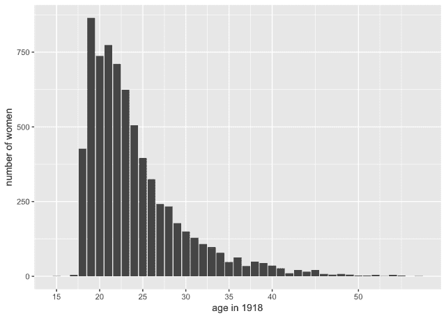
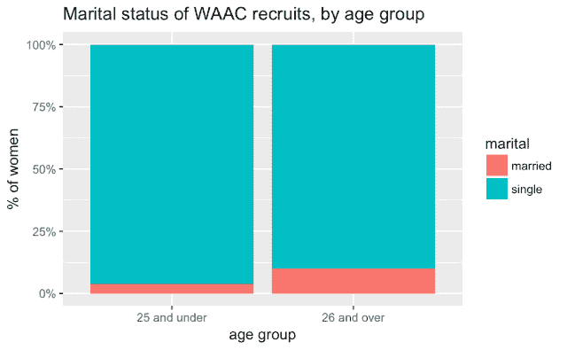
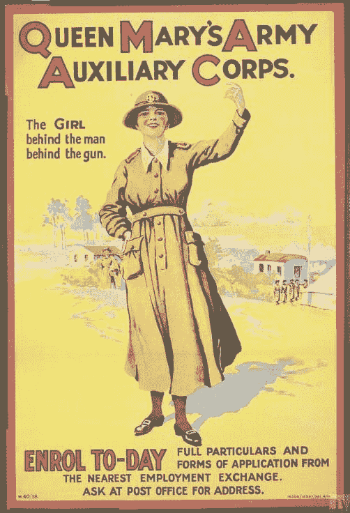
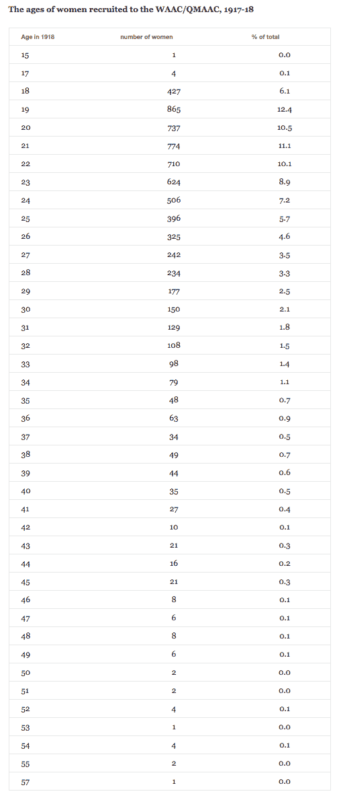

# 探索女子陆军辅助部队数据

> 原文：<https://www.dataquest.io/blog/exploring-womens-army-auxiliary-corps-data/>

March 28, 2018

今天我想去参观一下作为数据的目录。英国国家档案馆的发现目录是这项活动的一个极好的资源，因为 a)它有许多记录，在目录中有“项目”或“件”级别的文件描述，包含可以量化和可视化的非常结构化的信息(如日期、地点、职业)；b)更重要的是，它具有导出功能，允许您下载多达 10，000 条 CSV 格式的记录。(它还为那些具有一些编程技能的人提供了完整的 API，但 10，000 条记录会让你走得很远，而且你经常可以将较大的集合分成块，例如使用日期过滤器)。

您需要非常小心地使用 Discovery 高级搜索来获得正确的搜索结果集(它可以指定特定的记录、日期、目录级别等)—[这里有一些有用的提示](https://blog.nationalarchives.gov.uk/blog/catalogue-data-basics/)。然后你很可能需要使用像 OpenRefine 这样的工具将信息分离到单独的数据字段中，并清理/规范化日期等([查看本教程](https://programminghistorian.org/lessons/cleaning-data-with-openrefine))。

我在 TNA 的在线指南上闲逛，寻找一些我一无所知的关于女性的记录，而[女子陆军辅助军团 1917-20](https://www.nationalarchives.gov.uk/help-with-your-research/research-guides/womens-army-auxiliary-corps-service-records-1917-1920/) ( [WO 398](https://discovery.nationalarchives.gov.uk/details/r/C150990) 引起了我的注意:

> 【1917 年至 1920 年间加入女子陆军辅助队(WAAC)的 7，000 多名妇女的服役记录 QMAAC 于 1918 年 4 月成为 QMAAC，并于 1921 年 9 月解散

在 7000 张唱片中，这听起来像是一个很好的大小，完全在下载限制之内。看一看[目录条目](https://discovery.nationalarchives.gov.uk/details/r/D7224196)显示，除了女性的名字之外，它还有一些不错的信息(不像一个类似的更大的系列，WO399，它只有转录的名字)。给我几个小时的时间提取和清理数据，我能学到什么？

| 为...记录 | 艾伦，莎拉·安·尼·菲利普斯 |
| 出生地: | 北威尔士高街·塞夫恩·莫尔 |
| 出生日期: | 1894 年 8 月 22 日 |

首先，就可用数据而言，这实际上提供了什么？**出生日期**是一个显而易见的日期:仔细观察会发现它的格式是一致的，有完整的日期(大多数)；几乎每种情况下都至少提供一年，这可以很容易地提取到标准的出生年份字段中。**出生地**也有潜力，但是更多样，需要更多的清理，所以我还没用那个做什么；但这可能会成为一个有趣的绘图练习。或许不太明显的是，“ **nee Phillips** ”暗示着——如果你能有把握地假设女性总是给出这些信息的话！–还可以推断出一个女人是否结过婚。给定出生日期和名字，您还可以做的另一件好事是寻找婴儿命名的模式(尽管这可能真的需要更大的数据集)。

两个警告，一个主要的和一个次要的:

*   在线指南清楚地表明，这 7000 条记录只是原始收藏(57000 条记录)的一小部分，因为许多记录在二战的一次空袭中被毁。所以可能不能代表被招募的女性。
*   数据中的错误——即使是质量最好的材料，你也必须时刻注意。在这种情况下，有几个明显的出生日期转录错误。我们可以 100%确定 1822 年、1917-18 年和 1988 年的出生年份只是*错了*。但实际上更成问题的是看起来不太可能但并非完全不可能的异常值:1844 年？1903?幸运的是，它们只占极少数的记录。还有 278 个数字被记录为 18880 或 18930:我得出结论，这些实际上是年份日期，不知何故被添加了一个额外的零，并相应地进行了更正。

可视化通常对突出显示数据中的错误和问题特别有用。但是，研究人员必须决定如何处理这种异常(以及它们是否严重到足以使整个数据集不可靠而不值得使用)。

我最初希望记录日期将代表女性参军的具体日期，但结果是整个系列只有一个覆盖日期。因为它只涵盖了 4 年，这不是一个真正的问题；相反，我只是计算出了他们在 1918 年的年龄(假设战争结束后不会再有新兵招募)，并过滤掉了六个可能出生于 1860 年之前或 1903 年之后的人。

所以我今天学到的是，天哪，他们太年轻了。

作为可视化，表格可能不如图表引人注目，但它们具有在相对较小的空间内呈现大量精确信息的优点；这篇文章底部的表格显示，在 1918 年，超过 60%的女性年龄在 25 岁或以下，大约 90%在 30 岁以下。他们中很少有人年龄足够大，能够利用战争结束时妇女投票权的有限扩大。

一点背景阅读证实了这一点——根据露西·诺克斯在[英国和爱尔兰妇女战争动员](https://encyclopedia.1914-1918-online.net/article/womens_mobilization_for_war_great_britain_and_ireland)上的说法，“WAAC 的大部分新兵是年轻的工人阶级妇女”。如果我们可以合理地假设关于婚前姓氏的信息是一个完整的记录，或者接近完整的记录，那么绝大多数女性也是未婚的——总体而言接近 95%。我怀疑很少有已婚女性会自愿参加这种类型的服务(这可能会把她们带到海外并接近战斗)，因此可以预计大多数人会很年轻——平均而言，很可能比男性士兵年轻。你还可以看到，25 岁以上的女性中，已婚/曾经结过婚的比例要高得多——但与你可能在总人口中预期的比例相比，这一比例看起来仍然非常低(我想知道其中是否有相当多的人是寡妇)。

当我从诺克斯那里得知他们的年轻(毫无疑问，是阶级)导致了一些负面看法时，我并不感到惊讶:

> 然而，在公众心目中，她们有时被视为寻求刺激的人，被冒险和浪漫的欲望所吸引，招募入伍时担心女性会找到与士兵发生性关系的机会。政府对这些谣言如此担忧，以至于成立了一个调查委员会，其中包括显示 WAAC 未婚成员怀孕数量低于未婚平民的数字……

<small>*Queen Mary’s Army Auxiliary Corps (Art.IWM PST 13167): “The GIRL behind the man behind the gun” (!) © IWM*</small>

[Data on GitHub](https://github.com/sharonhoward/whm18)

*编者按:这最初是[发布在早期现代笔记](https://earlymodernnotes.wordpress.com/2018/03/12/whm18-womens-army-auxiliary-corps/?utm_source=dataquest&utm_medium=blog)上，作为我们关注女性历史月的一部分，已经被 perlesson 转载。作者[莎伦·霍华德](https://sharonhoward.org/?utm_source=dataquest&utm_medium=blog)在谢菲尔德大学担任数字历史项目的项目经理。*