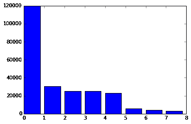
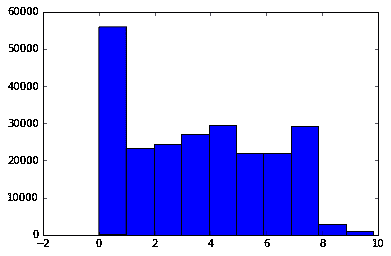
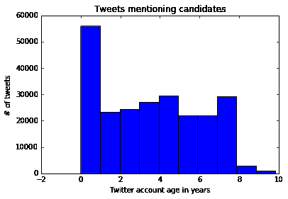
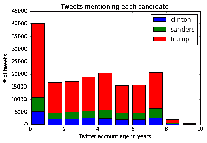
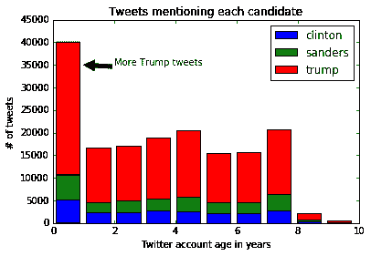
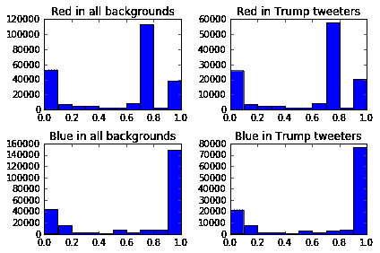
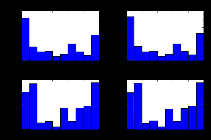
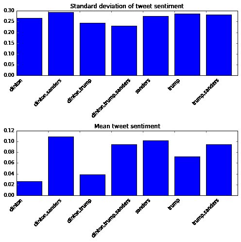
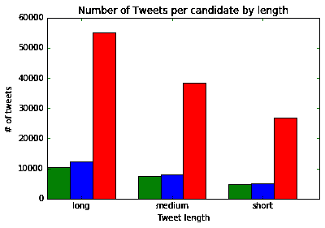

# Matplotlib 教程:策划提及特朗普、克林顿和桑德斯的推文

> 原文：<https://www.dataquest.io/blog/matplotlib-tutorial/>

May 12, 2016

## 用熊猫和 Matplotlib 分析推文

Python 有多种可视化库，包括 [seaborn](https://seaborn.pydata.org) 、 [networkx](https://github.com/networkx/networkx) 、 [vispy](https://vispy.org/index.html) 。大多数 Python 可视化库全部或部分基于 [matplotlib](https://matplotlib.org/) ，这通常使它成为制作简单绘图的首选，也是制作复杂到无法在其他库中创建的绘图的最后手段。在这个 matplotlib 教程中，我们将介绍这个库的基础知识，并演示一些中间可视化。我们将处理大约 240，000 条关于希拉里·克林顿、唐纳德·特朗普和伯尼·桑德斯的推文数据集，他们都是当前的美国总统候选人。数据来自 Twitter 流媒体 API，所有 240，000 条推文的 csv 可以在这里下载。如果你想自己刮更多的数据，可以在这里[找](https://github.com/dataquestio/twitter-scrape)刮码。

## 探索熊猫的微博

在开始绘图之前，让我们加载数据并做一些基本的探索。我们可以使用用于数据分析的 Python 库 [Pandas](https://pandas.pydata.org/) 来帮助我们。在下面的代码中，我们将:

*   导入熊猫库。
*   将`tweets.csv`读入一个熊猫[数据帧](https://pandas.pydata.org/pandas-docs/stable/generated/pandas.DataFrame.html)。
*   打印数据帧的前`5`行。

```
 import pandas as pd
tweets = pd.read_csv("tweets.csv")
tweets.head() 
```

|  | 身份证明（identification） | 标识字符串 | 用户位置 | 用户背景颜色 | 转发次数 | 用户名 | 极性 | 创造 | 长狭潮道 | 用户 _ 描述 | 用户 _ 创建的 | 用户 _ 追随者 | 协调 | 主观性 | 文本 |
| --- | --- | --- | --- | --- | --- | --- | --- | --- | --- | --- | --- | --- | --- | --- | --- |
| Zero | one | 729828033092149248 | 惠灵 WV | 022330 | Zero | Jaybo26003 | Zero | 2016-05-10T00:18:57 | 圆盘烤饼 | 圆盘烤饼 | 2011-11-17T02:45:42 | Thirty-nine | 圆盘烤饼 | Zero | 投出不同的一票！伯尼·桑德斯大学… |
| one | Two | 729828033092161537 | 圆盘烤饼 | 好吧 | Zero | 英国人 | Zero point one five | 2016-05-10T00:18:57 | 圆盘烤饼 | 18 // PSJAN | 2012 年 12 月 24 日 17 时 33 分 12 秒 | One thousand one hundred and seventy-five | 圆盘烤饼 | Zero point one | RT @HlPHOPNEWS: T.I .说如果唐纳德·特朗普赢了… |
| Two | three | 729828033566224384 | 圆盘烤饼 | 好吧 | Zero | 杰弗里斯洛里 | Zero | 2016-05-10T00:18:57 | 圆盘烤饼 | 圆盘烤饼 | 2012-10-11T14:29:59 | forty-two | 圆盘烤饼 | Zero | 如果是真的，你只能怪你自己 |
| three | four | 729828033893302272 | 全球的 | 好吧 | Zero | WhorunsGOVs | Zero | 2016-05-10T00:18:57 | 圆盘烤饼 | 了解最新的全球政治新闻 | 2014-02-16T07:34:24 | Two hundred and ninety | 圆盘烤饼 | Zero | “毁掉他们的余生”:唐纳德·特朗普 c… |
| four | five | 729828034178482177 | 美国加州 | One hundred and thirty-one thousand five hundred and sixteen | Zero | BJCG0830 | Zero | 2016-05-10T00:18:57 | 圆盘烤饼 | 拉丁同性恋援引他的第一修正案特权… | 2009 年 3 月 21 日 | Three hundred and fifty-four | 圆盘烤饼 | Zero | RT @elianayjohnson:根据来源，共和党大捐助者… |

以下是对数据中重要列的快速解释:

*   `id` —数据库中行的 id(这并不重要)。
*   `id_str` —推特上推文的 id。
*   `user_location` —推特用户在其推特简历中指定的地点。
*   `user_bg_color` —高音扬声器轮廓的背景颜色。
*   `user_name` —推特用户的推特用户名。
*   `polarity` —推文的情绪，从`-1`到`1`。`1`表示强阳性，`-1`表示强阴性。
*   `created` —推文发出的时间。
*   `user_description`—tweeter 在其简历中指定的描述。
*   `user_created` —当 tweeter 创建他们的账户时。
*   `user_follower` —高音喇叭拥有的关注者数量。
*   `text` —推文的文本。
*   `subjectivity` —推文的主观性或客观性。`0`很客观，`1`很主观。

### 生成候选人列

我们可以用这个数据集做的大多数有趣的事情包括比较一个候选人的推文和另一个候选人的推文。例如，我们可以比较关于唐纳德·川普的推特和关于伯尼·桑德斯的推特的客观程度。为了实现这一点，我们首先需要生成一个列，告诉我们每条推文中提到了哪些候选人。在下面的代码中，我们将:

*   创建一个函数，查找在一段文本中出现的候选名称。
*   在 DataFrames 上使用 [apply](https://pandas.pydata.org/pandas-docs/stable/generated/pandas.DataFrame.apply.html) 方法生成一个名为`candidate`的新列，其中包含推文提到的候选人。

```
 def get_candidate(row):
    candidates = []
    text = row["text"].lower()
    if "clinton" in text or "hillary" in text:
        candidates.append("clinton")
    if "trump" in text or "donald" in text:
        candidates.append("trump")
    if "sanders" in text or "bernie" in text:
        candidates.append("sanders")
    return ",".join(candidates)
tweets["candidate"] = tweets.apply(get_candidate,axis=1) 
```

## 制作第一个情节

现在我们已经有了初步的准备，我们准备使用 matplotlib 绘制我们的第一个图。在 matplotlib 中，绘制绘图包括:

*   创建一个[图形](https://matplotlib.org/api/figure_api.html)来绘制图形。
*   创建一个或多个[轴](https://matplotlib.org/api/axes_api.html)对象来绘制图形。
*   以图像的形式显示图形和内部的任何绘图。

由于其灵活的结构，您可以在 matplotlib 中将多个地块绘制成单个图像。每个轴对象代表一个单独的图，就像条形图或直方图。这听起来可能很复杂，但是 matplotlib 有方便的方法来为我们完成设置图形和轴对象的所有工作。

### 导入 matplotlib

为了使用 matplotlib，您需要首先使用`import matplotlib.pyplot as plt`导入库。如果你正在使用 Jupyter 笔记本，你可以使用`%matplotlib inline`设置 matplotlib 在笔记本内部工作。

```
 import matplotlib.pyplot as plt
import numpy as np 
```

我们导入`matplotlib.pyplot`是因为它包含了 matplotlib 的绘图函数。为了方便起见我们改名为`plt`，这样出图更快。

### 制作条形图

一旦我们导入了 matplotlib，我们就可以绘制一个柱状图，显示有多少条推文提到了每个候选人。为此，我们将:

*   对熊猫[系列](https://pandas.pydata.org/pandas-docs/stable/generated/pandas.Series.html)使用 [value_counts](https://pandas.pydata.org/pandas-docs/stable/generated/pandas.Series.value_counts.html) 方法来统计有多少条推文提到了每个候选人。
*   使用`plt.bar`创建条形图。我们将把从`0`到`candidate`列中唯一值的数量的数字列表作为 x 轴输入，计数作为 y 轴输入。
*   显示计数，以便我们对每个条形代表的内容有更多的了解。

```
 counts = tweets["candidate"].value_counts()
plt.bar(range(len(counts)), counts)
plt.show()
print(counts)
```

```
 trump                    119998
clinton,trump             30521
                          25429
sanders                   25351
clinton                   22746
clinton,sanders            6044
clinton,trump,sanders      4219
trump,sanders              3172
Name: candidate, dtype: int64
```


关于川普的推文比关于桑德斯或希拉里的多得多，这真令人惊讶！您可能会注意到，我们没有创建图形或任何轴对象。这是因为调用`plt.bar`将自动设置一个图形和一个单轴对象，代表条形图。调用 [plt.show](https://matplotlib.org/api/pyplot_api.html#matplotlib.pyplot.show) 方法将显示当前图形中的任何内容。在本例中，它显示了一个包含条形图的图像。matplotlib 在 [pyplot](https://matplotlib.org/api/pyplot_api.html) 模块中有一些方法，这些方法使得创建普通类型的绘图更快更方便，因为它们自动创建图形和轴对象。最广泛使用的是:

*   [柱状图](https://matplotlib.org/api/pyplot_api.html#matplotlib.pyplot.bar) —创建一个柱状图。
*   [plt.boxplot](https://matplotlib.org/api/pyplot_api.html#matplotlib.pyplot.boxplot) —绘制一个盒须图。
*   [plt.hist](https://matplotlib.org/api/pyplot_api.html#matplotlib.pyplot.hist) —制作直方图。
*   [PLT . plot](https://matplotlib.org/api/pyplot_api.html#matplotlib.pyplot.plot)-创建一个线形图。
*   [plt.scatter](https://matplotlib.org/api/pyplot_api.html#matplotlib.pyplot.scatter) —制作散点图。

调用这些方法中的任何一个都会自动设置图形和轴对象，并绘制绘图。每种方法都有不同的参数，可以传入这些参数来修改结果图。

## 自定义地块

现在，我们已经制作了基本的第一个图，我们可以继续创建一个更加定制的第二个图。我们将制作一个基本的直方图，然后修改它以添加标签和其他信息。我们可以关注的事情之一是发微博的用户账户的年龄。我们将能够发现在推特上发布关于特朗普的用户账户和在推特上发布关于克林顿的用户账户的创建时间是否有差异。一个候选人最近创建了更多的用户账户，这可能意味着有人用假账户操纵 Twitter。在下面的代码中，我们将:

*   将`created`和`user_created`列转换为熊猫日期时间类型。
*   创建一个`user_age`列，表示自帐户创建以来的天数。
*   创建用户年龄直方图。
*   显示直方图。

```
 from datetime import datetime

tweets["created"] = pd.to_datetime(tweets["created"])
tweets["user_created"] = pd.to_datetime(tweets["user_created"])

tweets["user_age"] = tweets["user_created"].apply(lambda x: (datetime.now() - x).total_seconds() / 3600 / 24 / 365)
plt.hist(tweets["user_age"])
plt.show()
```



### 添加标签

我们可以给 matplotlib 图添加标题和轴标签。实现这一点的常用方法有:

*   [PLT . title](https://matplotlib.org/api/pyplot_api.html#matplotlib.pyplot.title)-为绘图添加标题。
*   [plt.xlabel](https://matplotlib.org/api/pyplot_api.html#matplotlib.pyplot.xlabel) —添加一个 x 轴标签。
*   [plt.ylabel](https://matplotlib.org/api/pyplot_api.html#matplotlib.pyplot.ylabel) —添加一个 y 轴标签。

由于我们之前讨论的所有方法，如`bar`和`hist`，都自动创建一个图形和图形中的单个 Axes 对象，当调用该方法时，这些标签将被添加到 Axes 对象中。我们可以使用上述方法将标签添加到先前的直方图中。在下面的代码中，我们将:

*   生成与之前相同的直方图。
*   在直方图上绘制一个标题。
*   在直方图上绘制一个 x 轴标签。
*   在直方图上绘制一个 y 轴标签。
*   展示剧情。

```
 plt.hist(tweets["user_age"])
plt.title("Tweets mentioning candidates")
plt.xlabel("Twitter account age in years")
plt.ylabel("# of tweets")
plt.show() 
```



### 制作堆积直方图

当前的直方图很好地告诉了我们所有推特用户的账户年龄，但它没有按候选人进行细分，这可能更有趣。我们可以利用`hist`方法中的附加选项来创建堆叠直方图。在下面的代码中，我们将:

*   生成三个熊猫系列，每个系列只包含关于某个候选人的推文的`user_age`数据。
*   通过调用带有额外选项的`hist`方法制作一个堆积直方图。
    *   指定一个列表作为输入将绘制三组柱状图。
    *   指定`stacked=True`将堆叠三组棒线。
    *   添加`label`选项将为图例生成正确的标签。
*   调用 [plt.legend](https://matplotlib.org/api/pyplot_api.html#matplotlib.pyplot.legend) 方法在右上角绘制图例。
*   添加标题、x 轴和 y 轴标签。
*   展示剧情。

```
 cl_tweets = tweets["user_age"][tweets["candidate"] == "clinton"]
sa_tweets = tweets["user_age"][tweets["candidate"] == "sanders"]
tr_tweets = tweets["user_age"][tweets["candidate"] == "trump"]
plt.hist([
         cl_tweets,
         sa_tweets,
         tr_tweets
    ],
     stacked=True,
     label=["clinton", "sanders", "trump"])
plt.legend()
plt.title("Tweets mentioning each candidate")plt.xlabel("Twitter account age in years")
plt.ylabel("# of tweets")
plt.show() 
```



### 注释直方图

我们可以利用 matplotlibs 在绘图上绘制文本的能力来添加注释。注释指向图表的特定部分，让我们添加一个片段来描述要查看的内容。在下面的代码中，我们将制作与上面相同的直方图，但是我们将调用 [plt.annotate](https://matplotlib.org/api/pyplot_api.html#matplotlib.pyplot.annotate) 方法向绘图添加注释。

```
 plt.hist([
         cl_tweets,
         sa_tweets,
         tr_tweets
    ],
     stacked=True,
     label=["clinton", "sanders", "trump"])
plt.legend()
plt.title("Tweets mentioning each candidate")
plt.xlabel("Twitter account age in years")
plt.ylabel("# of tweets")
plt.annotate('More Trump tweets', xy=(1, 35000), xytext=(2, 35000),
           arrowprops=dict(facecolor='black'))
plt.show()
```


下面描述一下传递给`annotate`的选项是做什么的:

*   `xy` —确定箭头应该开始的`x`和`y`坐标。
*   `xytext` —确定文本应该开始的`x`和`y`坐标。
*   `arrowprops` —指定关于箭头的选项，如颜色。

正如你所看到的，关于特朗普的推文明显比关于其他候选人的多，但看起来账户年龄没有明显差异。

## 多个支线剧情

到目前为止，我们一直在使用像`plt.bar`和`plt.hist`这样的方法，它们自动创建一个图形对象和一个轴对象。然而，当我们想要更多地控制我们的地块时，我们可以显式地创建这些对象。我们想要更多控制的一种情况是当我们想要在同一个图像中并排放置多个图时。我们可以通过调用 [plt.subplots](https://matplotlib.org/api/pyplot_api.html#matplotlib.pyplot.subplots) 方法来生成一个图形和多个轴对象。我们传入两个参数，`nrows`和`ncols`，它们定义了图中 Axes 对象的布局。例如，`plt.subplots(nrows=2, ncols=2)`会生成`2x2`坐标轴对象的网格。`plt.subplots(nrows=2, ncols=1)`将生成一个轴对象的`2x1`网格，并垂直堆叠两个轴。每个轴对象支持`pyplot`中的大多数方法。例如，我们可以调用 Axes 对象上的`bar`方法来生成条形图。

### 提取颜色

我们将生成`4`图，显示用户关于特朗普的推特背景色中红色和蓝色的数量。这可能表明，如果推特上的人认为自己是共和党人，他们更有可能在个人资料中添加红色。首先，我们将生成两列，`red`和`blue`，这两列告诉我们从`0`到`1`，每种颜色在每个高音喇叭的轮廓背景中所占的比例。在下面的代码中，我们将:

*   使用`apply`方法遍历`user_bg_color`列中的每一行，并提取其中有多少红色。
*   使用`apply`方法遍历`user_bg_color`列中的每一行，并提取其中有多少蓝色。

```
 import matplotlib.colors as colors
tweets["red"] = tweets["user_bg_color"].apply(lambda x: colors.hex2color('#{0}'.format(x))[0])
tweets["blue"] = tweets["user_bg_color"].apply(lambda x: colors.hex2color('#{0}'.format(x))[2])
```

### 创造情节

一旦我们有了数据设置，我们就可以创建图。每个图将是一个直方图，显示有多少推特用户的个人背景包含一定量的蓝色或红色。在下面的代码中，我们:

*   用`subplots`方法生成一个图形和多个轴。轴将作为数组返回。
*   这些轴以 2×2 [NumPy](https://www.numpy.org/) 数组的形式返回。我们通过使用数组的[平坦](https://docs.scipy.org/doc/numpy-1.10.1/reference/generated/numpy.ndarray.flat.html)属性来提取每个单独的轴对象。这给了我们可以使用的轴对象。
*   使用 [hist](https://matplotlib.org/api/axes_api.html#matplotlib.axes.Axes.hist) 方法在第一个轴上绘制直方图。
*   使用 [set_title](https://matplotlib.org/api/axes_api.html#matplotlib.axes.Axes.set_title) 方法将第一个轴的标题设置为`Red in all backgrounds`。这执行与`plt.title`相同的功能。
*   使用 [hist](https://matplotlib.org/api/axes_api.html#matplotlib.axes.Axes.hist) 方法在第二个轴上绘制直方图。
*   使用 [set_title](https://matplotlib.org/api/axes_api.html#matplotlib.axes.Axes.set_title) 方法将第二个轴的标题设置为`Red in Trump tweeters`。
*   使用 [hist](https://matplotlib.org/api/axes_api.html#matplotlib.axes.Axes.hist) 方法在第三轴绘制直方图。
*   使用 [set_title](https://matplotlib.org/api/axes_api.html#matplotlib.axes.Axes.set_title) 方法将第三个轴的标题设置为`Blue in all backgrounds`。这执行与`plt.title`相同的功能。
*   使用 [hist](https://matplotlib.org/api/axes_api.html#matplotlib.axes.Axes.hist) 方法在第四轴绘制直方图。
*   使用 [set_title](https://matplotlib.org/api/axes_api.html#matplotlib.axes.Axes.set_title) 方法将第四个轴的标题设置为`Blue in Trump tweeters`。
*   调用 [plt.tight_layout](https://matplotlib.org/api/pyplot_api.html#matplotlib.pyplot.tight_layout) 方法来减少图形中的填充并适合所有元素。
*   展示剧情。

```
 fig, axes = plt.subplots(nrows=2, ncols=2)
ax0, ax1, ax2, ax3 = axes.flat

ax0.hist(tweets["red"])
ax0.set_title('Red in backgrounds')

ax1.hist(tweets["red"][tweets["candidate"] == "trump"].values)
ax1.set_title('Red in Trump tweeters')

ax2.hist(tweets["blue"])
ax2.set_title('Blue in backgrounds')

ax3.hist(tweets["blue"][tweets["candidate"] == "trump"].values)
ax3.set_title('Blue in Trump tweeters')
plt.tight_layout()
plt.show() 
```



### 移除常见背景颜色

Twitter 有默认的背景颜色，我们可能应该删除，这样我们就可以减少噪音，生成一个更准确的图。颜色采用十六进制格式，其中 code>#000000 为黑色，`#ffffff`为白色。以下是如何在背景色中找到最常见的颜色:

```
 tweets["user_bg_color"].value_counts()
```

```
 C0DEED    108977
    000000     31119
    F5F8FA     25597
    131516      7731
    1A1B1F      5059
    022330      4300
    0099B9      3958
```

现在，我们可以删除三种最常见的颜色，只标出具有独特背景颜色的用户。下面的代码大部分是我们之前做的，但是我们将:

*   从`user_bg_color`中移除`C0DEED`、`000000`和`F5F8FA`。
*   创建一个函数，不包含内部最后一个图表的绘图逻辑。
*   绘制与之前相同的`4`图，但不使用`user_bg_color`中最常见的颜色。

```
 tc = tweets[~tweets["user_bg_color"].isin(["C0DEED", "000000", "F5F8FA"])]

def create_plot(data):
    fig, axes = plt.subplots(nrows=2, ncols=2)
    ax0, ax1, ax2, ax3 = axes.flat

    ax0.hist(data["red"])
    ax0.set_title('Red in backgrounds')

    ax1.hist(data["red"][data["candidate"] == "trump"].values)
    ax1.set_title('Red in Trump tweets')

    ax2.hist(data["blue"])
    ax2.set_title('Blue in backgrounds')

    ax3.hist(data["blue"][data["candidate"] == "trump"].values)
    ax3.set_title('Blue in Trump tweeters')

    plt.tight_layout()
    plt.show()

create_plot(tc) 
```


正如你所看到的，发关于特朗普的推文的用户的背景颜色中蓝色和红色的分布几乎与所有推文的分布相同。

## 策划情绪

我们使用 [TextBlob](https://textblob.readthedocs.io/en/dev/) 为每条推文生成情感分数，这些分数存储在`polarity`列中。我们可以画出每个候选人的平均值，以及标准偏差。标准差将告诉我们所有推文之间的差异有多大，而平均值将告诉我们平均推文有多大。为了做到这一点，我们可以将两个轴添加到一个图形中，并在一个图形中绘制出`polarity`的平均值，在另一个图形中绘制出标准偏差。因为在这些图中有许多文本标签，我们需要增加生成图形的大小来匹配。我们可以通过`plt.subplots`方法中的`figsize`选项来实现这一点。下面的代码将:

*   根据候选人对推文进行分组，并计算每个数字列的平均值和标准偏差(包括`polarity`)。
*   创建一个尺寸为`7`英寸乘`7`英寸的图形，带有两个垂直排列的轴对象。
*   创建第一个轴对象的标准偏差条形图。
    *   使用 [set_xticklabels](https://matplotlib.org/api/axes_api.html#matplotlib.axes.Axes.set_xticklabels) 方法设置刻度标签，并使用`rotation`参数旋转标签`45`度。
    *   设置标题。
*   在第二个轴对象上创建平均值条形图。
    *   设置刻度标签。
    *   设置标题。
*   展示剧情。

```
 gr = tweets.groupby("candidate").agg([np.mean, np.std])

fig, axes = plt.subplots(nrows=2, ncols=1, figsize=(7, 7))
ax0, ax1 = axes.flat

std = gr["polarity"]["std"].iloc[1:]
mean = gr["polarity"]["mean"].iloc[1:]
ax0.bar(range(len(std)), std)
ax0.set_xticklabels(std.index, rotation=45)
ax0.set_title('Standard deviation of tweet sentiment')

ax1.bar(range(len(mean)), mean)
ax1.set_xticklabels(mean.index, rotation=45)
ax1.set_title('Mean tweet sentiment')

plt.tight_layout()
plt.show() 
```



## 生成并排条形图

我们可以用柱状图绘制候选人的推文长度。我们首先将推文分成`short`、`medium`和`long`推文。然后，我们将统计每组中有多少条提及每位候选人的推文。然后，我们将生成一个条形图，并排显示每个候选人的条形图。

### 生成推文长度

为了绘制推文长度，我们首先要对推文进行分类，然后计算每个候选人有多少推文落入每个箱子。在下面的代码中，我们将:

*   定义一个函数，如果 tweet 少于`100`个字符，则标记为`short`，如果是`100`到`135`个字符，则标记为`medium`，如果超过`135`个字符，则标记为`long`。
*   使用`apply`生成一个新列`tweet_length`。
*   算出每个候选人有多少条推文归入每个组。

```
 def tweet_lengths(text):
    if len(text) < 100:
        return "short"
    elif 100 <= len(text) <= 135:
        return "medium"
    else:
        return "long"

tweets["tweet_length"] = tweets["text"].apply(tweet_lengths)

tl = {}
for candidate in ["clinton", "sanders", "trump"]:
    tl[candidate] = tweets["tweet_length"][tweets["candidate"] == candidate].value_counts() 
```

### 测绘

现在我们有了想要绘制的数据，我们可以生成并排条形图。我们将使用`bar`方法在同一轴上绘制每个候选人的 tweet 长度。然而，我们将使用一个偏移量来将我们绘制的第二个和第三个候选项的条形向右移动。这将为我们提供三个类别区域，`short`、`medium`和`long`，每个区域中的每个候选人都有一个条形。在下面的代码中，我们:

*   创建一个图形和一个单轴对象。
*   定义每根棒线的`width`，`.5`。
*   生成一个数值序列，`x`，即`0`、`2`、`4`。每个值都是一个类别的开始，例如`short`、`medium`和`long`。我们在每个类别之间放置了一个`2`的距离，这样我们就有空间放置多个条形。
*   在 Axes 对象上绘制`clinton` tweets，并在`x`定义的位置绘制条。
*   在 Axes 对象上绘制`sanders` tweets，但是将`width`添加到`x`中以向右移动条。
*   在 Axes 对象上绘制`trump` tweets，但是将`width * 2`添加到`x`以将条移动到最右边。
*   设置轴标签和标题。
*   使用`set_xticks`将刻度标签移动到每个类别区域的中心。
*   设置刻度标签。

```
 fig, ax = plt.subplots()
width = .5
x = np.array(range(0, 6, 2))
ax.bar(x, tl["clinton"], width, color='g')
ax.bar(x + width, tl["sanders"], width, color='b')
ax.bar(x + (width * 2), tl["trump"], width, color='r')

ax.set_ylabel('# of tweets')
ax.set_title('Number of Tweets per candidate by length')
ax.set_xticks(x + (width * 1.5))
ax.set_xticklabels(('long', 'medium', 'short'))
ax.set_xlabel('Tweet length')
plt.show() 
```



## 后续步骤

接下来你可以制作几个情节:

*   分析用户描述，并查看描述长度如何因候选人而异。
*   探索一天中的时间——某个候选人的支持者在特定时间会发更多的微博吗？
*   探索用户位置，并查看哪些州关于哪些候选人的推文最多。
*   看看什么样的用户名会发更多关于什么样的候选人的微博。
    *   用户名中的数字越多，对候选人的支持就越大吗？
    *   哪位候选人拥有最多的全大写支持者？
*   收集更多的数据，看看模式是否会改变。

我们已经学习了很多关于 matplotlib 如何生成图的知识，并且浏览了很多数据集。如果你想了解更多关于 matplotlib 和数据可视化的知识，你可以查看我们的交互式[数据可视化课程](https://www.dataquest.io/course/python-for-data-science-fundamentals)。每门课的第一课都是免费的！希望这个 matplotlib 教程对你有帮助，如果你对这些数据做了什么有趣的分析[，请联系](https://twitter.com/dataquestio)——我们很想知道！