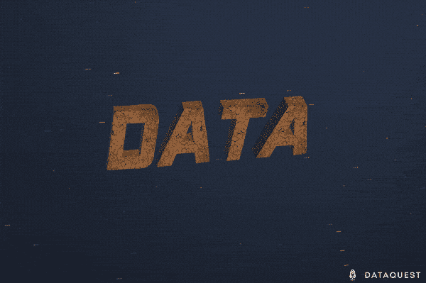

# 通过我们新的 Python 数据清理高级课程掌握数据清理

> 原文：<https://www.dataquest.io/blog/data-cleaning-python-advanced/>

June 13, 2019

数据清理。数据清理。数据管理。不管你怎么称呼它，不可否认的是，获取原始数据并将其转化为可供分析的数据集的过程是任何数据工作中最重要的任务之一。

事实上，这可能是数据科学中最重要的任务。在调查中，数据科学家报告说他们花了[大部分时间清理和准备数据](https://www.forbes.com/sites/gilpress/2016/03/23/data-preparation-most-time-consuming-least-enjoyable-data-science-task-survey-says/#415cb4876f63)。调查还显示，[“脏数据”是数据工作者在工作中面临的头号挑战。](https://www.kaggle.com/surveys/2017)

数据清理可能不是[“21 世纪最性感的工作”](https://hbr.org/2012/10/data-scientist-the-sexiest-job-of-the-21st-century)中“最性感”的部分，但它绝对是一项至关重要的技能，因为它是所有后续分析的基础。无论你的分析技能或机器学习算法有多好，如果你给它们提供的是肮脏的数据，它们都无法产生任何有价值的东西。俗话说:*垃圾进来，垃圾出去*。

即使你不从事数据科学，数据清理也是一项非常有价值的技能。例如，圭亚那的一名 Dataquest 学生的任务是处理几十个庞大而笨拙的 Excel 数据集。他说，学习用 Python 组合和清理这些数据改变了他的生活。它把曾经需要一周的任务变成了只需要几分钟的事情！

您可能已经掌握了一些 Python 数据清理技能。这是数据科学工作流程中如此重要的一部分，以至于我们的免费初级课程包含了一些数据清理。我们还提供关于[数据清理和分析](https://www.dataquest.io/course/python-datacleaning/)的更有针对性的课程。现在，为了帮助你在这一关键领域建立更多的*技能，我们推出了一门新课程: [**数据清理高级**](https://www.dataquest.io/course/python-data-cleaning-advanced) 。*

准备好开始清理您的数据，直到它变得非常干净了吗？单击下面的按钮开始。

[查看课程](https://www.dataquest.io/course/python-data-cleaning-advanced)

本课程需要[基础或高级订阅](https://www.dataquest.io/subscribe/)，并假设熟悉在[我们早期课程](https://www.dataquest.io/path/data-scientist/)中介绍的概念，包括基本的数据科学 Python 编程技能，以及一些使用 pandas 和 matplotlib 等库的经验。

## 我为什么要选这门课？

数据清理对于任何数据分析师或数据科学家来说都是一项关键技能，您可以通过多种方式学习这些技能。然而，Dataquest 提供了一个独特的学习平台，将优秀的教学与动手编程实践相结合，使我们的课程非常有效。

T2】

简而言之，Dataquest 平台。

你不必相信我们的话。测试过这门课程的学生同意。100%的测试者认为在完成课程后，他们理解了正则表达式。100%的测试人员也同意，在完成课程后，他们可以使用他们学到的概念(如列表理解、lambda 函数、使用 JSON 数据等)。)在自己的项目里。

特别是，学生们称赞本课程的解释清晰而有思想，并报告说他们学到了宝贵的专业技能。“我将能够使用正则表达式改进我的工作，”一名学生在完成本课程中以正则表达式为中心的课程后写道。另一名学生说，这些高级技能“在实际工作环境中通常很有用”。

事实上，一名学生测试员告诉我们，这门课程包含“Dataquest 上最好的课程之一！”

## 在这个数据清理高级课程中，我将学到什么？

在数据清理高级课程中，您将深入研究并亲自动手，使用各种常用技术清理真实世界的数据集，以根除错误数据、处理缺失数据、合并数据集并准备用于分析的传入数据。使用我们的交互式浏览器内编码平台，您将编写 Python 代码，将有关黑客新闻标题和纽约市交通事故的肮脏数据转化为可供分析的干净数据。

为此，您将学习正则表达式(通常称为 regex)，这是一种操作字符串的强大方法，以及如何利用 Python 中的 regex，通过 Python 的 regex 模块来清理脏文本数据。您将学习使用 json 格式的数据，这在使用 Python 的 JSON 模块处理来自 web APIs 的数据时很常见。您将学习使用 lambda 函数在函数中创建函数，以实现更快的工作流。

您还将学习使用列表理解更容易地处理类似列表的数据

一旦你掌握了这些清理和准备数据的重要技术，你将开始填补数据集中的漏洞，用各种方式处理丢失的数据。您将了解到:

*   如何使用表格和绘图查找缺失数据
*   如何使用各种统计方法估算缺失数据
*   如何使用其他来源的数据扩充不完整的数据集

在应对这些挑战的过程中，您还将获得使用您可能已经熟悉的流行 Python 数据科学库的额外实践，包括 pandas、matplotlib 和 seaborn。

本课程结束时，您将掌握从各种数据源中清理数据的技能，包括从 API 中提取的 JSON 数据。您将能够以多种不同的方式处理数据中缺失的值，这样您就不必再从数据集中删除行，从而减少其大小和值。您将掌握将源数据转换成分析所需格式的技能，使用 regex 的强大功能使混乱的文本字符串更容易处理。

谈到所有数据科学中最常用的技能，没有比现在更好的时机来开始磨练您的技能，并将您的数据清理能力升级到“高级”