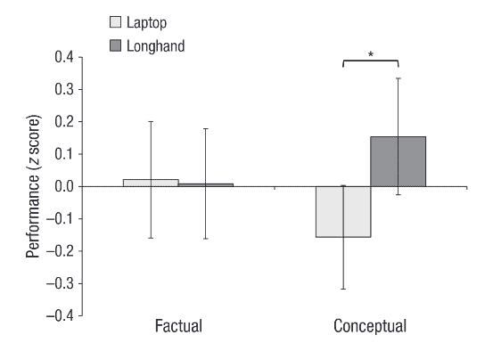

# 通过做更好的笔记来记住更多你学到的东西

> 原文：<https://www.dataquest.io/blog/learn-better-taking-notes-study/>

March 9, 2019

如果你正试图学习数据科学(或其他任何东西，就此而言)，手写笔记真的有帮助吗？

至少从 17 世纪开始，甚至可能更早，做笔记就已经成为典型学习过程的一部分。几个世纪以来，记笔记看起来几乎总是一样的:学生们在演讲厅或图书馆里，用笔和纸做笔记。

今天，学习的选择更加多样化。你可以用传统的方式记笔记，但你也可以在笔记本电脑上数字化地输入，在电话上为自己记录解释，或者将你最大的收获输入到抽认卡学习应用程序中，以供将来阅读。

许多在线学习平台提供预先写好的笔记，方便学生复习。在 [Dataquest](https://www.dataquest.io) ，我们使用可下载的“外卖”pdf 文件来完成这项工作，您可以在每节交互式编码课的末尾找到这些文件。但是自己做笔记也有一些真正的价值。那么*你应该如何*做笔记呢？让我们看看科学是怎么说的。

## 穆勒和奥本海默的研究

普林斯顿大学学者帕姆·穆勒和加州大学洛杉矶分校学者丹尼尔·奥本海默在 2014 年撰写的这项研究是第一个，也是唯一一个，你会在讨论什么最适合做笔记时找到的科学参考。但是他们的结果的意义经常被误解。

在这项研究中，穆勒和奥本海默要求学生用笔记本电脑(与互联网断开连接)或纸笔在 TED talk 视频讲座上做笔记。视频结束大约 30 分钟后，学生们接受了两项测试，一是对讲座中具体事实的回忆，二是对与讲座主题相关的更广泛的概念性问题的评估能力。

在回忆具体事实时，用笔记本电脑记笔记的学生比用手写(用笔和纸)的学生表现稍好。但是当涉及到概念理解时，用手记笔记的学生表现得更好。

图片来源:穆勒和奥本海默研究

这个结果产生了过多的标题，宣称用手记笔记天生就优于用电脑记笔记。但是这种解释存在一些问题。

首先，正如穆勒和奥本海默自己指出的，学生记笔记的方式可能不如 T2 的方式重要。注意到使用笔记本电脑的学生打出的单词比手写笔记者写的多，他们推断，因为打字比写字快，所以学生在通过笔记本电脑记笔记时可能会做更多的死记硬背逐字记录(因此不会积极参与到所提出的想法中)。在接下来的实验中，他们明确指示笔记本电脑笔记员*而不是*逐字记录，这在一定程度上提高了他们的概念分数，尽管还不足以赶上手写笔记员。

另一项后续实验允许两组学生在接受评估前研究他们的笔记。和之前的实验一样，手写笔记者的表现优于笔记本笔记者。

那么，手写笔记真的比数字笔记好吗？也许吧。但这是一项单独的研究，穆勒和奥本海默的每个实验都只测试了一小部分学生(第一次实验中有 67 人，后续实验中大约有 110 人)。尽管大量的新闻文章提出了相反的观点，但仅凭这项研究的结果就得出手写笔记比用电脑做笔记更好的结论可能是不合理的。

## 记笔记时真正重要的是什么

也许更有助于评估有效笔记策略证据的是哈佛学者 Michael C. Friedman 的工作，他对现有的研究进行了更广泛的回顾，T2 在《高等教育》的《T4》中总结了他对学生的建议。尽管大多数关于这一主题的研究都集中在正式的学术背景上，但弗里德曼的建议也很容易适用于自我导向的学习(如在线学习数据科学)。

具体来说，弗里德曼建议:

*   **避免抄录或复制/粘贴**。写笔记时用你自己的话表达事情，因为这迫使你思考如何理解和如何最好地解释一个概念。(如果你*不能*用自己的话表达出来，这是一个好迹象，表明你还没有理解它)。
*   定期回顾你的笔记，包括你写笔记的当天和之后的重复。
*   **自我测试。**在数据科学的背景下，这可能意味着在检查您的笔记以查看您是否正确记忆之前尝试编写一些代码。

弗里德曼还建议对数字笔记和手写笔记哪个更适合你进行深思熟虑的评估。这是个人决定，但以下是每种方法最有可能的优势:

|  | 数字笔记 | 手写笔记 |
| --- | --- | --- |
| 易接近 | 可以存储在云中，以便随时随地访问 | 只能在纸上获得 |
| 可兑换 | 易于编辑，或复制粘贴到其他应用程序中进行研究 | 难以编辑或转换成其他格式 |
| 事实回忆 | 大概是为了更好地记住特定的事实 | 大概是因为记不住具体的事实 |
| 概念理解 | *可能*在理解和应用概念方面更差 | *可能*更好地理解和应用概念 |

在一天结束时，似乎最重要的是，无论你如何记笔记，你都要用自己的话来表达它们**，并在你写下它们时，花时间真正参与并评估你对概念的理解，而不是简单地逐字逐句地抄录你正在学习的一切。**

 **当然，记笔记并不是一切。其他因素如[你选择的学习材料](https://www.dataquest.io/blog/video-text-learn-data-science-online/)甚至[你的手机是否在附近](https://www.dataquest.io/blog/phone-proximity-effect/)也会影响你学习数据科学的效率。

## 获取免费的数据科学资源

免费注册获取我们的每周时事通讯，包括数据科学、 **Python** 、 **R** 和 **SQL** 资源链接。此外，您还可以访问我们免费的交互式[在线课程内容](/data-science-courses)！

[SIGN UP](https://app.dataquest.io/signup)**