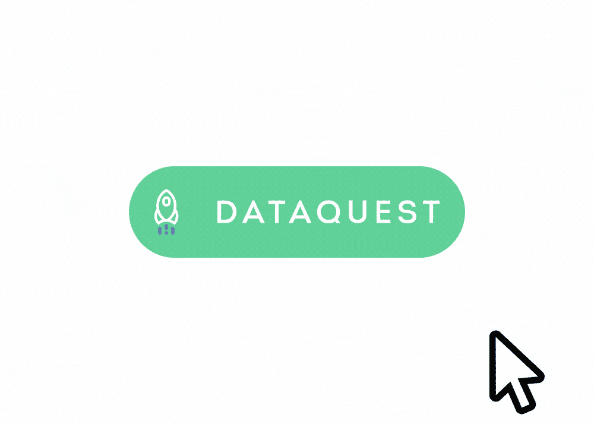

# 如何为数据科学(或其他)从零开始学习 Python

> 原文：<https://www.dataquest.io/blog/learn-python-from-scratch/>

January 9, 2019

大约有一百万个网站承诺帮助你从头开始学习 Python。但是，如果你曾经尝试过学习 Python，你可能会注意到它可以是 extr

开始很难，进步更难。你可能曾经尝试过学习编码并放弃了，认为这不是你擅长的事情。

如果这听起来像你，我们有一些好消息:你绝对可以从零开始学习 Python，没有任何编程经验。如果你以前尝试过但失败了，那可能不是你的错。

有三个主要原因导致新的 Python 程序员在取得任何重大进展之前就放弃学习。

## 原因 1:好的程序员，坏的老师

大多数“学习代码”资源都是由真心希望帮助他人学习的程序员创建的。但遗憾的是，做一个好的编码者和做一个好的老师并不一定有太多的重合。对于使用 Python 多年的有经验的程序员来说，很难把自己放回初学者的位置。

现实是，如果你第一次遇到许多编程概念，你很难理解它们。例如，考虑 Python 索引列表等数据类型的方式。如果你来自一个编程背景，把列表中的第一项算作第 0 项是完全有意义的。但是普通人是从一开始计数的，不是零！

当然，Python 使用零索引有很好的理由。但是编程充满了这样的概念。对于有经验的程序员来说，它们是有意义的，但是对于试图从头开始学习编程的人来说，它们可能显得非常不直观。

有经验的程序员通常很难记住和理解这些早期的斗争，所以在他们创建的学习材料中，他们希望你“理解就好”这对一些学生有用，但也让很多人感到沮丧和失望。

在我们真正掌握具有挑战性的新概念之前，我们大多数人都需要良好的解释、背景和实践。许多 Python 学习资源，包括那些承诺帮助您“从零开始学习 Python”的资源，提供了对那些已经被训练成像程序员一样思考的人来说完全有意义的解释，但是对我们其他人来说很难解析。这导致人们辍学。

## 原因 2:缺少动力

试图从头开始学习 Python 的人经常停下来的另一个原因是因为他们已经失去了动力。在传统教育中，这通常被认为是学生的失败。在 Dataquest，我们认为这是一次教学失败。

没有足够的动机是很难学习任何东西的。最强的激励因素之一实际上是能够使用你正在学习的技能。这是很多 Python 学习资源失败的地方。他们让你通过死记硬背的练习来学习语法，或者编写与你想要学习 Python 的*原因*毫无关系的无意义的程序。

如果你已经开始学习，很容易就掉链子，停止学习，因为你想学习 Python 来进行数据科学，但是你在学习的时候并没有真正地处理数据。

## 原因 3:“学习”但不应用

应用你所学的东西对于长期记忆来说是绝对重要的。[研究经过研究证明](https://www.dataquest.io/blog/video-text-learn-data-science-online/)。

这很重要，因为许多学生试图利用书籍或视频讲座等流行资源从头开始学习 Python。虽然这些资源通常很好，但它们不能强迫你去应用你所学的东西。即使你*真的*留出一些时间来写你自己的代码，例如，在读完教科书的一章之后，书也没有办法给你提供任何反馈，或者让你知道什么时候你做错了。

这并不是说你不应该从书本或视频中学习——两者都是无价的资源！但是如果你不小心的话，他们也会欺骗你，让你觉得你理解了一个概念，而实际上你并不理解。可能只有几天或几周后，当你去写你自己的代码时，你才意识到你并没有像你想象的那样理解事情。

在 Python 中有很多东西要学，但是你不需要知道所有的东西来做有意义的工作。

## 解决方案:如何从头开始学习 Python

如果您想最大限度地提高成功学习 Python 的机会，显然您需要采取一种方法来帮助您避免这三个陷阱。你不只是想学 Python，你还想[用正确的方式](https://www.dataquest.io/blog/learn-python-the-right-way/)学习 Python。

第**步**是弄清楚你为什么要学习 Python。其他的一切都源于此，您所采用的方法将会根据您是想学习 Python 用于数据科学还是机器人技术还是游戏开发还是其他什么而有所不同！

**第二步**是学习 Python 的基本语法。这里重要的词是*基本*。不需要什么都学，也不应该学。学习语法是必要的，但它可能会有点无聊，并且您希望最大限度地减少花在学习语法上的时间。你的目标应该是了解你开始从事对你重要的项目所需的最起码的知识。

如果你能找到适合你想学习 Python 的原因的学习资源，你可以使这一步变得容易一些。例如，如果你想为数据科学学习 Python，我们的[初级](https://www.dataquest.io/course/python-for-data-science-fundamentals)和[中级](https://www.dataquest.io/course/python-for-data-science-intermediate/) Python 课程都是免费的，将教你从头开始构建数据科学项目所需的所有语法，同时让你处理真实世界的数据，这使得学习语法的过程对有兴趣学习数据技能的人来说更有吸引力。

第三步是构建结构化项目。给[找一个可以跟随的教程](https://www.dataquest.io/python-tutorials-for-data-science/)可能是个不错的方法。对数据科学感兴趣的学生可以尝试一些[我们的指导项目](https://www.dataquest.io/data-science-projects/)，这些项目旨在鼓励实验和创造力，同时仍然提供结构和指导。

[这篇文章](https://www.dataquest.io/blog/learn-python-the-right-way/)提供了许多其他资源，用于寻找跨越各种编程学科的结构化项目想法，包括游戏开发、机器人技术等。例如，如果你想开发移动应用，[这个 Kivy 教程](https://kivy.org/doc/stable/gettingstarted/first_app.html)是一个很好的第一个项目。如果你想做游戏，看看[这些 Pygame 教程](https://www.pygame.org/wiki/tutorials)。关键是尽快开始你真正感兴趣的项目。

第四步是随着你继续发展自己的能力，建立越来越复杂的独特项目。在完成一些指导性项目后，你可能会有一些自己想尝试的想法。尽管你认为自己不具备成功所需的所有技能，也要努力去做。当你需要的时候，你会在过程中学习这些新技能。

关键是将每个项目分解成小的、可管理的部分。例如，假设您想要分析 Twitter 上的情绪。这是一个令人生畏的大项目，但是你可以把它分解成更小的任务，然后一个接一个地学习。首先，你可能需要学习如何访问和使用 Twitter 的 API。一旦你明白了这一点，继续学习如何过滤和存储你想要分析的推文。然后，您可以继续清理数据，之后您可以研究情感分析的方法。

您可以对各种项目采取类似的方法。你不需要知道所有关于如何做一个项目来开始一个项目！将项目分成几个部分，一部分一部分地学习。

你会花很多时间去搜索 Google、StackOverflow、 [Python 的官方文档](https://docs.python.org/3/)，也没问题！关于编程，一个不那么秘密的行业秘密是，即使是专业人士也会花大量的时间在谷歌上搜索问题。

第五步实际上只是继续第四步，但是会增加你所承担的每个项目的难度。如果你在一开始就知道如何实现项目的每个部分，这是一个好的迹象，表明它对你来说可能太容易了，你不会从中学到什么。

关键是让事情充满挑战，但不是不可能。如果你正试图学习用 Python 制作游戏，并且你已经制作了一个简单的游戏，比如 *Snake* ，你的下一个项目不应该是一个沉浸式开放世界 3D RPG。这太快增加了太多的难度。但是*应该*开发一个比*贪吃蛇*稍微复杂一点的游戏。

## 去哪里学 Python

显然，有很多地方可以学习基本的 Python 编码技能，我们鼓励学生寻找最适合他们的资源。如果您对学习 Python 进行数据科学感兴趣，Dataquest 有一些您在别处可能找不到的独特优势:

简而言之，Dataquest 平台。

*   **独一无二的平台，以动手学习为主** 。我们想让你尽可能快地处理代码并尝试每个新概念。你永远不会超过一两分钟而没有机会应用你所学的东西，有了我们的平台，你可以在浏览器窗口中编写和检查 Python 代码。
*   **易于搜索的、基于文本的内容**。视频可以很有趣，但是如果你必须在有机会应用你所学的任何东西之前观看 30 分钟的视频，你将浪费大量的时间来浏览视频，试图找到正确的时刻来复习你已经忘记的概念。Dataquest 基于文本的学习内容更准确地反映了作为一名数据科学家的工作现实(在这种情况下，您经常需要查阅书面文档)，并且搜索以前的课程并找到您想要的内容非常容易。
*   **真实数据和有趣项目**。如果你在没有任何意义的项目中处理无聊的、虚假的数据，很难有学习的灵感。这就是为什么我们使用真实世界的数据来回答真实世界的问题，并帮助您在申请工作时建立可以在您的数据科学投资组合中使用的项目。

如果你想为数据科学从零开始学习 Python，我们认为

[我们免费的 Python 入门课程](https://www.dataquest.io/course/python-for-data-science-fundamentals/)是理想的起点。

如果你因为其他原因想要学习 Python，你会想要寻找特定于你的目标的学习资源。

如果你找不到，一般的“学习 Python”资源也可以——只要记得尽快开始构建项目和从事激发你的事情。最终，这将使你坚持下去，并确保你真的成为新的程序员，他们可以真正声称你是从零开始学习 Python 的。

## 获取免费的数据科学资源

免费注册获取我们的每周时事通讯，包括数据科学、 **Python** 、 **R** 和 **SQL** 资源链接。此外，您还可以访问我们免费的交互式[在线课程内容](/data-science-courses)！

[SIGN UP](https://app.dataquest.io/signup)