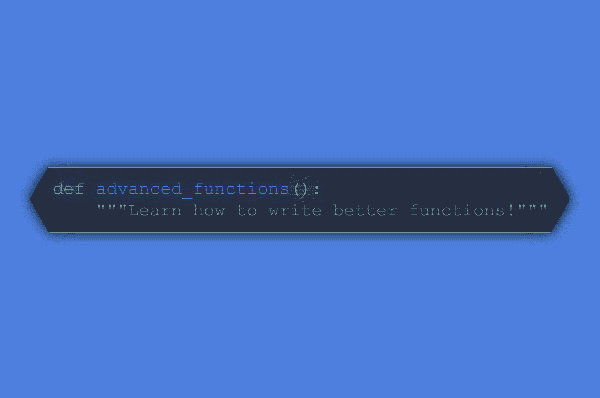

# 利用我们新的高级函数 Python 课程编写更好的代码

> 原文：<https://www.dataquest.io/blog/how-to-write-better-code-python-course/>

September 26, 2019

当谈到学习数据科学时，写更好的代码并不总是首先想到的——我们通常更关心的是让代码工作，并确保分析是正确的。

但是，作为一个有效的数据科学团队的一部分，您必须能够编写可读、可维护、可测试和可调试的代码，而不仅仅是功能性的代码。

这就是为什么我们很高兴地宣布，我们刚刚在 Python 数据科学家路径中推出了**一门新课程**，名为*函数:高级*。

这是一门深入的 [Python 函数课程](https://www.dataquest.io/course/python-advanced-functions)，旨在向您展示如何使用[函数编程](https://www.dataquest.io/blog/introduction-functional-programming-python/)编写更好的代码。如果您正在从事数据工作，或者渴望从事数据工作，本课程涵盖了使您的代码更易于阅读、维护、测试和调试的关键技能。

点击下面的按钮，开始学习。

[开始高级功能课程](https://app.dataquest.io/course/python-advanced-functions)

本课程需要[高级订阅](https://www.dataquest.io/subscribe/)(限时半价)。

## 为什么要学习写更好的代码？

编写好的、干净的代码不仅仅对于软件工程师来说很重要！

是的，如果你是唯一一个曾经看过你的代码的人，那么它是如何写的可能并不太重要。但是在专业数据科学工作的背景下，很少会出现这种情况。

通常，您将作为团队的一员工作，团队中的其他数据科学家、分析师和工程师可能会阅读和审查您的代码。并且您可能正在构建可重复的过程和/或数据产品，这些过程和/或数据产品需要维护数月或数年。

成为数据科学团队*中富有成效的成员*意味着能够编写团队成员容易阅读的代码，以及任何人都可以维护和调试的代码。

这让你的同事生活更轻松，但也让你的生活更轻松——如果其他人可以轻松地使用你的代码，这意味着你可以休假，而不会被一些紧急问题打扰。这意味着你可以转移到另一个你感兴趣的项目，让别人接手你的分析，而不必浪费时间向接替你的人解释你的代码。这意味着，如果你决定在未来的某个时候接受一份不同的工作，你可以让你目前的公司处于一个很好的位置，以你的工作为基础，而不是让他们陷入困境。

通常，编写更好的代码意味着专注于函数式编程，因为纯函数是无状态的——它们只需要给定的输入来产生输出。这使得它们相对容易阅读。当您查看一个纯函数时，您可以确切地看到输入了什么，对该输入执行了什么，以及返回了什么。这使得您的代码更容易阅读、理解和调试。

不确定您是否掌握了在数据科学编程环境中使用函数的最佳实践？这就是 Python 中的高级函数课程的用武之地。

## 这门课程包括什么？

*函数:高级*从在团队环境中编写函数的最佳实践开始。您将了解文档字符串以及如何包含它们。我们将介绍编写优秀代码的一些基本原则:做一件事，不要重复，你将学会为函数设置默认参数。

然后，我们将深入 Python 中函数式编程的世界，以涵盖上下文管理器:为运行代码建立上下文、运行代码、然后移除该上下文的函数。您将学习何时使用它们，何时不使用它们，并且您将学习使用装饰器编写自己的程序。

课程的最后两节课都是关于 Python decorators 的，你可以用它来包装其他函数并修改它们的行为。当你对装饰者有了直觉，并开始掌握嵌套函数、作用域和闭包等概念时，你会学到基础知识。

之后，您将更深入地研究 decorator，学习识别公共模式并编写可以接受多个参数的 decorator。您还能够确保您的修饰函数不会丢失任何元数据。

通过这一切，您将在我们的交互式浏览器内编码环境中工作，并且您将通过编写和运行实际代码的每一步来应用您所学的知识。当你学完这门课程时，你会真正体会到如何写出更好、更简洁的代码。

简而言之，Dataquest 平台。

准备好开始了吗？[查看课程](https://www.dataquest.io/course/python-advanced-functions)或浏览[我们的完整数据科学家路径](https://www.dataquest.io/path/data-scientist/)，看看你接下来想学什么！

## 获取免费的数据科学资源

免费注册获取我们的每周时事通讯，包括数据科学、 **Python** 、 **R** 和 **SQL** 资源链接。此外，您还可以访问我们免费的交互式[在线课程内容](/data-science-courses)！

[SIGN UP](https://app.dataquest.io/signup)