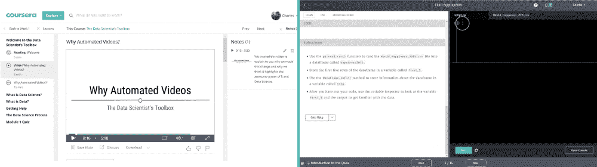

# 在线学习数据科学，视频好还是文字好？

> 原文：<https://www.dataquest.io/blog/video-text-learn-data-science-online/>

February 22, 2019

当谈到在线学习数据科学时，学生有各种各样的选择，但每个学生都必须做出的一个最基本的选择是，他们更喜欢通过阅读文本还是通过观看视频来学习。

大多数[mooc](https://en.wikipedia.org/wiki/Massive_open_online_course)，因为它们是基于传统的大学讲座形式，通过视频讲座展示他们的信息。即使在不隶属于大学的教育平台上，视频授课也是一种常见的方式。例如，Udemy 的顶级数据科学课程包括总共 41 小时的视频讲座*。*

 *其他流行的在线数据科学和编码平台的教学方式不同，使用最少的视频，专注于基于文本的教学。例如，在 Dataquest，我们不使用*任何*视频，而是通过你在下面看到的并排文本和交互式编码界面来展示我们所有的课程。

显然，观看视频和阅读文本是有区别的，但是这些方法中哪一种更适合学习数据科学呢？

## 视频与文本

2018 年，作为麻省理工学院综合学习计划(MITili)的一部分，进行了一项关于这一主题的[最近有趣的实验](https://mitili.mit.edu/news/compared-reading-how-much-does-video-improve-learning-outcomes)。研究人员要求学生报名参加学习课程，然后将他们分成小组，一组通过视频观看课程，另一组阅读经过编辑的视频文本，其中包括一些解释性图表。

会议结束后的第二天早上，两组都参加了同样的评估来测试理解和记忆，并且两组都接受了关于他们更喜欢的学习方法的调查。

研究人员假设学生们更喜欢看视频而不是阅读，而且看视频的人在课后评估中也会得分更高。但是他们发现恰恰相反。相比视频，更多的学生更喜欢阅读(30%对 20%，另外 50%喜欢其他形式的学习，如现场讲座和实践学习)。在课后评估中，通过阅读来阅读材料的学生比看视频的学生表现稍好一些，尽管这项研究的人数很少，这种差异在统计上并不显著。

这是一个在许多更大更科学的研究中得到证实的结果。通过视频学习和通过阅读学习之间的区别，就其本身而言，似乎对学生理解或保留材料的程度没有统计学影响。

那么，这是否意味着通过阅读或观看来学习数据科学并不重要？不。当我们具体谈论数据科学时，媒体格式本身并不是基于视频和基于文本的数据科学学习选项之间的唯一区别。

## *其他*数据科学学习平台的巨大差异

在下图中，看看 Coursera 的约翰霍普金斯大学数据科学课程的用户界面与 Dataquest 的用户界面的对比。显然，这两个平台之间有一个超越视频的巨大差异:**交互性**。在约翰霍普金斯大学的课堂上(左)，学生们可能会选择在右边空白处记笔记，但他们不会在任何地方写任何代码。在 Dataquest 屏幕(右)中，学生可以在左侧阅读，但在进入下一部分之前，他们还需要应用他们在屏幕右侧的编码框中所学的内容。

这种表述上的差异是可以理解的。大多数学生在观看视频时会努力编写代码，这将导致令人沮丧的用户体验，需要多次暂停和倒带。此外，Coursera 和其他普通教育平台并不支持现场编码或答案检查，实现这些功能将是困难和昂贵的。这样做的最终结果是，他们倾向于以视频形式呈现所有信息，在视频之后进行一个小测验，并希望学生在自己的时间里应用他们所学的知识。

Dataquest 和其他基于文本的平台通常采取相反的方法。我们要求学生动手操作，并在学习后直接应用他们所学的知识。由于在编程中总是有正确的答案(要么代码正确运行，要么不正确)，这种动手实践的方法还允许学生获得关于他们理解和应用概念的程度的即时反馈。

这很重要，因为当谈到动手和被动学习时，科学非常清楚:动手学习更好。

## 衡量实践学习的价值

这是我们早就知道的事情。例如，在 20 世纪 80 年代，[一项大规模的元研究](https://eric.ed.gov/?id=ED216870)观察了 57 项不同的学习研究，涵盖了总共 1000 多个教室和 13000 名学生，并得出结论，实践学习者的表现**比通过更传统的、基于讲座的方法学习的学生平均好 20%**。

这些结果在最近的研究中也得到了相当一致的证实。一项 2014 年的元研究查看了 225 项先前的研究，发现在 STEM 课程中，通过讲座被动学习的学生失败的可能性是 t 2 的 1.5 倍。

当然，从基于视频的平台学习并不排除应用你的知识。你可以随时观看视频，然后在笔记本电脑上打开一个编码 IDE，开始应用你所学到的东西，每当你遇到困难时，就回头参考视频中的相关位置。但是这也有一些缺点:

*   你不太可能真的去做，因为这不是强制性的，需要额外的步骤。
*   如果你的代码*运行*但是产生了一个不正确的答案，你可能没有意识到你已经出错了，因为没有答案检查。
*   当你陷入困境时，你必须在视频中寻找答案，这可能会令人沮丧和困难。
*   你必须自己解决遇到的任何技术问题。

这些都不是不可逾越的障碍，但当您选择数据科学平台进行学习时，它们肯定是值得考虑的。如果你能够快速方便地应用你所学的东西，你的进步将会更有效率，你也不会试图跳过应用你所学的东西，因为这是一个额外的麻烦。

## 适合您的平台

你学习数据科学的效率取决于你的个人方法，而不是你选择的平台。没有一个平台能够为每个人提供学习数据科学的正确方法。

我们确实认为 [Dataquest](https://www.dataquest.io/) 对大多数人来说是最好的数据科学学习平台，因为我们的内容呈现得非常清楚，而且我们可以非常快速地让您用真实世界的数据集亲自动手编写代码。但是无论你最终在哪里学习，确保你有机会*经常应用你所学的东西*。从这方面的科学来看，很明显，如果你花更少的时间听，花更多的时间*做*，你就更有可能成功实现你的学习目标。

您可以在 Dataquest 上免费学习数据科学编程的基础知识，无需信用卡！

[今天就开始学习吧！](https://www.dataquest.io/)*