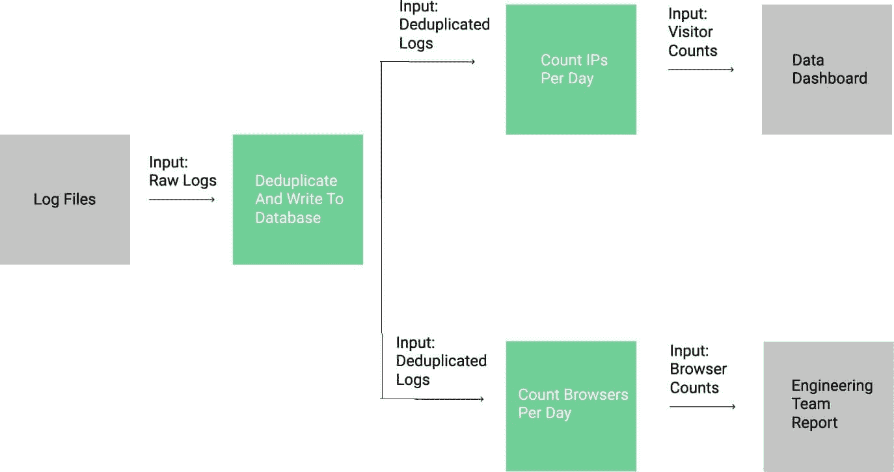

# 教程:用 Python 构建分析数据管道

> 原文：<https://www.dataquest.io/blog/data-pipelines-tutorial/>

November 4, 2019

如果您曾经想在线学习 Python 处理流数据或快速变化的数据，那么您可能熟悉数据管道的概念。数据管道允许您通过一系列步骤将数据从一种表示形式转换为另一种表示形式。数据管道是数据工程的关键部分，我们在新的[数据工程师路径](https://www.dataquest.io/path/data-engineer)中教授。在本教程中，我们将使用 Python 和 SQL 构建一个数据管道。

数据管道的一个常见用例是计算网站访问者的信息。如果你熟悉[谷歌分析](https://analytics.google.com)，你就会知道查看访客实时和历史信息的价值。在这篇博文中，我们将使用 web 服务器日志中的数据来回答关于访问者的问题。

如果你不熟悉的话，每次你访问一个网页，比如 [Dataquest 博客](https://www.dataquest.io/blog)，你的浏览器都会收到来自网络服务器的数据。为了托管这个博客，我们使用了一个名为 [Nginx](https://www.nginx.com/) 的高性能网络服务器。下面是你输入一个网址并看到结果的过程:


从 web 浏览器向服务器发送请求的过程。

首先，客户机向 web 服务器发送一个请求，请求某个页面。然后，web 服务器从文件系统加载页面，并将其返回给客户机(web 服务器也可以动态生成页面，但我们现在不担心这种情况)。在处理请求时，web 服务器在文件系统的日志文件中写入一行，其中包含一些关于客户机和请求的元数据。该日志使某人能够在以后看到谁在什么时间访问了网站上的哪些页面，并执行其他分析。

以下是这篇博客的 Nginx 日志中的几行文字:

```
 X.X.X.X - - [09/Mar/2017:01:15:59 +0000] "GET /blog/assets/css/jupyter.css HTTP/1.1" 200 30294 "https://www.dataquest.io/blog/" "Mozilla/5.0 (X11; Linux x86_64) AppleWebKit/537.36 (KHTML, like Gecko) Ubuntu Chromium/53.0.2785.143 Chrome/53.0.2785.143 Safari/537.36 PingdomPageSpeed/1.0 (pingbot/2.0; +https://www.pingdom.com/)"
X.X.X.X - - [09/Mar/2017:01:15:59 +0000] "GET /blog/assets/js/jquery-1.11.1.min.js HTTP/1.1" 200 95786 "https://www.dataquest.io/blog/" "Mozilla/5.0 (X11; Linux x86_64) AppleWebKit/537.36 (KHTML, like Gecko) Ubuntu Chromium/53.0.2785.143 Chrome/53.0.2785.143 Safari/537.36 PingdomPageSpeed/1.0 (pingbot/2.0; +https://www.pingdom.com/)
"X.X.X.X - - [09/Mar/2017:01:15:59 +0000] "GET /blog/assets/js/markdeep.min.js HTTP/1.1" 200 58713 "https://www.dataquest.io/blog/" "Mozilla/5.0 (X11; Linux x86_64) AppleWebKit/537.36 (KHTML, like Gecko) Ubuntu Chromium/53.0.2785.143 Chrome/53.0.2785.143 Safari/537.36 PingdomPageSpeed/1.0 (pingbot/2.0; +https://www.pingdom.com/)"
X.X.X.X - - [09/Mar/2017:01:15:59 +0000] "GET /blog/assets/js/index.js HTTP/1.1" 200 3075 "https://www.dataquest.io/blog/" "Mozilla/5.0 (X11; Linux x86_64) AppleWebKit/537.36 (KHTML, like Gecko) Ubuntu Chromium/53.0.2785.143 Chrome/53.0.2785.143 Safari/537.36 PingdomPageSpeed/1.0 (pingbot/2.0; +https://www.pingdom.com/)"
X.X.X.X - - [09/Mar/2017:01:16:00 +0000] "GET /blog/atom.xml HTTP/1.1" 301 194 "-" "UniversalFeedParser/5.2.1 +https://code.google.com/p/feedparser/"
X.X.X.X - - [09/Mar/2017:01:16:01 +0000] "GET /blog/feed.xml HTTP/1.1" 200 48285 "-" "UniversalFeedParser/5.2.1 +https://code.google.com/p/feedparser/" 
```

每个请求都是一行，当请求发送到服务器时，这些行按时间顺序附加。每一行的格式都是 Nginx `combined`格式，内部看起来是这样的:

```
$remote_addr - $remote_user [$time_local] "$request" $status $body_bytes_sent "$http_referer" "$http_user_agent"
```

请注意，日志格式使用类似于`$remote_addr`的变量，这些变量稍后会被替换为特定请求的正确值。以下是日志格式中每个变量的描述:

*   `$remote_addr` —向服务器发出请求的客户端的 ip 地址。对于日志中的第一行，这是`X.X.X.X`(为了保密，我们删除了 ips)。
*   `$remote_user` —如果客户端使用基本认证进行认证，这是用户名。第一个日志行为空。
*   `$time_local` —发出请求的当地时间。`09/Mar/2017:01:15:59 +0000`在第一线。
*   `$request` —请求的[类型](https://www.w3.org/Protocols/rfc2616/rfc2616-sec9.html)，以及它被发送到的 URL。`GET /blog/assets/css/jupyter.css HTTP/1.1`在第一线。
*   `$status` —来自服务器的响应[状态码](https://www.w3.org/Protocols/rfc2616/rfc2616-sec10.html)。`200`在第一线。
*   `$body_bytes_sent` —响应正文中服务器发送给客户端的字节数。`30294`在第一线。
*   `$http_referrer` —发送当前请求前客户端所在的页面。`https://www.dataquest.io/blog/`在第一线。
*   `$http_user_agent` —客户端的浏览器和系统信息。`Mozilla/5.0 (X11; Linux x86_64) AppleWebKit/537.36 (KHTML, like Gecko) Ubuntu Chromium/53.0.2785.143 Chrome/53.0.2785.143 Safari/537.36 PingdomPageSpeed/1.0 (pingbot/2.0; +https://www.pingdom.com/)`在第一线。

随着对日志文件的请求越来越多，web 服务器会不断地在日志文件中添加行。有时，web 服务器会[轮换](https://en.wikipedia.org/wiki/Log_rotation)过大的日志文件，并存档旧数据。

你可以想象，公司从了解哪些访问者在他们的网站上，以及他们在做什么中获得了很多价值。例如，意识到使用[谷歌 Chrome](https://www.google.com/chrome/) 浏览器的用户很少访问某个页面可能表明该页面在该浏览器中存在渲染问题。

另一个例子是了解每个国家每天有多少用户访问你的网站。它可以帮助你找出哪些国家是你营销努力的重点。在最简单的层面上，仅仅知道你每天有多少访问者就可以帮助你了解你的营销工作是否正常。

为了计算这些指标，我们需要解析日志文件并进行分析。为了做到这一点，我们需要构建一个数据管道。

## 思考数据管道

下面是一个简单的数据管道示例，它计算每天有多少访问者访问了网站:


从原始日志到每天的访问者数量。

正如你在上面看到的，我们从原始日志数据转到一个仪表板，在那里我们可以看到每天的访问者数量。请注意，这个管道是连续运行的——当新条目添加到服务器日志中时，它会获取并处理它们。关于我们如何构建渠道，您可能已经注意到了一些事情:

*   每个管道组件都与其他组件分离，接收定义的输入，并返回定义的输出。
    *   虽然我们没有在这里展示它，但是这些输出可以被缓存或持久化以供进一步分析。
*   我们将原始日志数据存储到数据库中。这确保了如果我们想要运行不同的分析，我们可以访问所有的原始数据。
*   我们删除重复的记录。在分析过程中很容易引入重复数据，因此在通过管道传递数据之前进行重复数据删除至关重要。
*   每个管道组件都向另一个组件提供数据。我们希望每个组件尽可能小，以便我们可以单独放大管道组件，或者将输出用于不同类型的分析。

现在我们已经看到了这个管道的高级外观，让我们用 Python 来实现它。

## 处理和存储网络服务器日志

为了创建我们的数据管道，我们需要访问 web 服务器日志数据。我们创建了一个脚本，它将不断生成假的(但有些真实的)日志数据。下面是如何关注这篇文章的:

*   克隆[这个回购](https://github.com/dataquestio/analytics_pipeline)。
*   按照[自述文件](https://github.com/dataquestio/analytics_pipeline/blob/master/README.md)安装 Python 需求。
*   运行`python log_generator.py`。

运行脚本后，您应该会看到新条目被写入到同一个文件夹中的`log_a.txt`。在`100`行被写到`log_a.txt`后，脚本会旋转到`log_b.txt`。它会每隔`100`行就在文件间来回切换。

一旦我们启动了脚本，我们只需要编写一些代码来接收(或读入)日志。该脚本需要:

*   打开日志文件并逐行读取。
*   将每一行解析成字段。
*   将每一行和解析后的字段写入数据库。
*   确保没有将重复的行写入数据库。

如果你想继续的话，代码在[这个 repo](https://github.com/dataquestio/analytics_pipeline) 的 [store_logs.py](https://github.com/dataquestio/analytics_pipeline/blob/master/store_logs.py) 文件中。

为了实现我们的第一个目标，我们可以打开文件，并不断尝试从其中读取行。

以下代码将:

*   以阅读模式打开两个日志文件。
*   永远循环。
    *   找出两个文件中当前被读取的字符在哪里(使用`tell`方法)。
    *   尝试从两个文件中读取一行(使用`readline`方法)。
    *   如果两个文件都没有写入一行，请休眠一会儿，然后再试一次。
        *   睡觉前把阅读点设回原来的位置(调用`readline`前)，这样就不会漏掉什么(用`seek`的方法)。
    *   如果其中一个文件写了一行，就抓取那一行。回想一下，一次只能写入一个文件，所以我们无法从两个文件中获取行。

```
 f_a = open(LOG_FILE_A, 'r')
f_b = open(LOG_FILE_B, 'r')
while True:
    where_a = f_a.tell()
    line_a = f_a.readline()
    where_b = f_b.tell()
    line_b = f_b.readline()
    if not line_a and not line_b:
        time.sleep(1)
        f_a.seek(where_a)
        f_b.seek(where_b)
        continue
    else:
        if line_a:
            line = line_a
        else:
            line = line_b 
```

一旦我们读入了日志文件，我们需要做一些非常基本的解析，将它分成几个字段。我们不想在这里做任何太花哨的事情——我们可以把它留到以后的步骤中。您通常希望管道中的第一步(保存原始数据的那一步)尽可能地轻量级，这样失败的几率就低了。如果这一步在任何一点上失败了，您将会丢失一些原始数据，并且无法恢复！

为了保持解析简单，我们将只对空格(`)字符进行拆分，然后进行一些重组:`

 `

将日志文件解析为结构化字段。

在下面的代码中，我们:

*   取一个单独的日志行，在空格字符(`)上分割。`
`*   从分割表示中提取所有字段。
    *   请注意，有些字段在这里看起来并不“完美”——例如，时间仍然用括号括起来。*   初始化一个存储数据库记录创建时间的`created`变量。这将使未来的管道步骤能够查询数据。`

 ````
 split_line = line.split(" ")
remote_addr = split_line[0]
time_local = split_line[3] + " " + split_line[4]
request_type = split_line[5]
request_path = split_line[6]
status = split_line[8]
body_bytes_sent = split_line[9]
http_referer = split_line[10]
http_user_agent = " ".join(split_line[11:])
created = datetime.now().strftime("%Y-%m-%dT%H:%M:%S") 
```

我们还需要决定 SQLite 数据库表的模式，并运行所需的代码来创建它。因为我们希望这个组件简单，所以简单的模式是最好的。我们将使用以下查询来创建表:

```
 CREATE TABLE IF NOT EXISTS logs (
    raw_log TEXT NOT NULL UNIQUE,
    remote_addr TEXT,
    time_local TEXT,
    request_type TEXT,
    request_path TEXT,
    status INTEGER,
    body_bytes_sent INTEGER,
    http_referer TEXT,
    http_user_agent TEXT,
    created DATETIME DEFAULT CURRENT_TIMESTAMP
    ) 
```

请注意我们如何确保每个`raw_log`都是唯一的，因此我们避免了重复记录。另外，请注意我们是如何将所有经过解析的字段和原始日志一起插入数据库的。有一种观点认为我们不应该插入解析过的字段，因为我们可以很容易地再次计算它们。然而，将它们添加到字段中会使将来的查询更容易(例如，我们可以只选择`time_local`列)，并且可以节省以后的计算工作量。

保留原始日志对我们有帮助，以防我们需要一些没有提取的信息，或者如果每一行中的字段顺序在以后变得重要。由于这些原因，存储原始数据总是一个好主意。

最后，我们需要将解析后的记录插入到一个 [SQLite](https://docs.python.org/3/library/sqlite3.html) 数据库的`logs`表中。选择一个数据库来存储这类数据非常关键。在这种情况下，我们选择 SQLite，因为它简单，并且将所有数据存储在一个文件中。如果你更关心性能，你最好使用像 [Postgres](https://www.postgresql.org/) 这样的数据库。

在下面的代码中，我们:

*   连接到 SQLite 数据库。
*   实例化一个游标来执行查询。
*   将我们将插入到表中的所有值放在一起(`parsed`是我们之前解析的值的列表)
*   将值插入数据库。
*   提交事务，以便它写入数据库。
*   关闭与数据库的连接。

```
 conn = sqlite3.connect(DB_NAME)
cur = conn.cursor()
args = [line] + parsed
cur.execute('INSERT INTO logs VALUES (?,?,?,?,?,?,?,?,?)', args)
conn.commit()
conn.close() 
```

我们刚刚完成了管道的第一步！现在，我们已经存储了经过重复数据消除的数据，我们可以继续计算访问者数量了。

## 用数据管道统计访客数量

我们可以使用一些不同的机制在管道步骤之间共享数据:

*   文件
*   数据库
*   行列

在每种情况下，我们都需要一种方法将数据从当前步骤转移到下一个步骤。如果我们将下一步(按天计算 IP 数)指向数据库，它将能够通过基于时间的查询来提取添加的事件。虽然我们可以通过使用队列将数据传递到下一步来获得更高的性能，但性能目前并不重要。

我们将创建另一个文件， [count_visitors.py](https://github.com/dataquestio/analytics_pipeline/blob/master/count_visitors.py) ，并添加一些代码，从数据库中提取数据，并按天进行一些计数。

我们首先要从数据库中查询数据。在下面的代码中，我们:

*   连接到数据库。
*   查询在某个时间戳之后添加的任何行。
*   获取所有行。

```
 def get_lines(time_obj):
    conn = sqlite3.connect(DB_NAME)
    cur = conn.cursor()
    cur.execute("SELECT remote_addr,time_local FROM logs WHERE created > ?", [time_obj])
    resp = cur.fetchall()
    return resp 
```

然后，我们需要一种方法从我们查询的每一行中提取 ip 和时间。以下代码将:

*   初始化两个空列表。
*   从查询响应中提取时间和 ip，并将它们添加到列表中。

```
 def get_time_and_ip(lines):
    ips = []
    times = []
    for line in lines:
        ips.append(line[0])
        times.append(parse_time(line[1]))
    return ips, times 
```

您可能会注意到，在上面的代码中，我们将字符串中的时间解析为一个 [datetime](https://docs.python.org/3/library/datetime.html) 对象。用于解析的代码如下:

```
 def parse_time(time_str):
    time_obj = datetime.strptime(time_str, '[%d/%b/%Y:%H:%M:%S %z]')
    return time_obj
```

一旦我们有了这些片段，我们只需要一种方法从数据库中提取新的行，并将它们添加到每天正在进行的访问者计数中。以下代码将:

*   基于给定的开始时间从数据库中获取要查询的行(我们获取在给定时间之后创建的任何行)。
*   从行中提取 ips 和`datetime`对象。
*   如果我们有任何行，将开始时间指定为我们得到一行的最后时间。这可以防止我们多次查询同一行。
*   创建一个关键字`day`，用于计算唯一 IP。
*   将每个 ip 添加到一个[集合](https://docs.python.org/3/library/stdtypes.html?highlight=set#set)中，该集合将只包含每天的唯一 IP。

```
 lines = get_lines(start_time)
ips, times = get_time_and_ip(lines)
if len(times) > 0:
    start_time = times[-1]
for ip, time_obj in zip(ips, times):
    day = time_obj.strftime("%d-%m-%Y")
    if day not in unique_ips:
        unique_ips[day] = set()
    unique_ips[day].add(ip) 
```

这段代码将确保`unique_ips`每天都有一个密钥，值将是包含当天访问该站点的所有唯一 IP 的集合。

按天整理 IP 后，我们只需要做一些清点。在下面的代码中，我们:

*   将每天的访客数量分配给`counts`。
*   从`counts`中提取元组列表。
*   将列表排序，使日期按顺序排列。
*   打印出每天的访客数量。

```
 for k, v in unique_ips.items():
    counts[k] = len(v)
count_list = counts.items()
count_list = sorted(count_list, key=lambda x: x[0])
for item in count_list:
    print("{}: {}".format(*item)) 
```

然后我们可以从上面获取代码片段，这样它们每`5`秒运行一次:

```
 unique_ips = {}
counts = {}
start_time = datetime(year=2017, month=3, day=9)
while True:
    lines = get_lines(start_time)
    ips, times = get_time_and_ip(lines)
    if len(times) > 0:
        start_time = times[-1]
    for ip, time_obj in zip(ips, times):
        day = time_obj.strftime("%d-%m-%Y")
        if day not in unique_ips:
            unique_ips[day] = set()
        unique_ips[day].add(ip)
    for k, v in unique_ips.items():
        counts[k] = len(v)
    count_list = counts.items()
    count_list = sorted(count_list, key=lambda x: x[0])
    for item in count_list:
        print("{}: {}".format(*item))
    time.sleep(5)
```

## 将管道拉在一起

我们现在已经浏览了生成日志的脚本，以及分析日志的两个管道步骤。为了使整个管道运行:

*   如果你还没有从 Github 克隆 analytics _ pipeline repo。
*   按照 README.md 文件进行设置。
*   执行`log_generator.py`。
*   执行`store_logs.py`。
*   执行`count_visitors.py`。

运行`count_visitors.py`之后，您应该会看到每`5`秒钟打印出来的当天的访问者数量。如果您让脚本运行多天，您将开始看到多天的访问者计数。

恭喜你！您已经设置并运行了一个数据管道。现在让我们创建另一个从数据库中提取数据的管道步骤。

## 向数据管道添加另一个步骤

将管道分成独立的部分的主要好处之一是，很容易将一个步骤的输出用于另一个目的。与其计算访问者，不如让我们试着算出有多少访问我们网站的人使用每种浏览器。这将使我们的管道看起来像这样:



我们现在有一个管道步骤驱动两个下游步骤。

如您所见，一个步骤转换的数据可以是两个不同步骤的输入数据。如果您想继续这个管道步骤，您应该查看您克隆的 repo 中的`count_browsers.py`文件。

为了统计浏览者的数量，我们的代码与统计访问者数量的代码基本相同。主要区别在于我们解析用户代理来检索浏览器的名称。在下面的代码中，您会注意到我们查询的是`http_user_agent`列而不是`remote_addr`，我们解析用户代理来找出访问者使用的浏览器:

```
 def get_lines(time_obj):
    conn = sqlite3.connect(DB_NAME)
    cur = conn.cursor()
    cur.execute("SELECT time_local,http_user_agent FROM logs WHERE created > ?", [time_obj])
    resp = cur.fetchall()
    return resp
def get_time_and_ip(lines):
    browsers = []
    times = []
    for line in lines:
        times.append(parse_time(line[0]))
        browsers.append(parse_user_agent(line[1]))
    return browsers, times
def parse_user_agent(user_agent):
    browsers = ["Firefox", "Chrome", "Opera", "Safari", "MSIE"]
    for browser in browsers:
        if browser in user_agent:
            return browser
    return "Other"
```

然后我们修改我们的循环来统计访问该站点的浏览器:

```
 browsers, times = get_time_and_ip(lines)
if len(times) > 0:
    start_time = times[-1]
for browser, time_obj in zip(browsers, times):
    if browser not in browser_counts:
        browser_counts[browser] = 0
    browser_counts[browser] += 1 
```

一旦我们做了这些改变，我们就可以运行`python count_browsers.py`来计算有多少浏览器访问了我们的网站。

我们现在已经创建了两个基本的数据管道，并演示了数据管道的一些关键原则:

*   使得每一步都相当小。
*   使用定义的接口在管道之间传递数据。
*   存储所有的原始数据用于以后的分析。

## 扩展数据管道

学完本数据管道教程后，您应该理解如何用 Python 创建一个基本的数据管道。但是现在不要停下来！请随意扩展我们实现的管道。以下是一些想法:

*   你能做一个能处理更多数据的管道吗？如果连续生成日志消息会怎样？
*   你能定位 IP 地址来找出访问者的位置吗？
*   你能找出哪些页面最常被点击吗？

如果您可以访问真实的 web 服务器日志数据，您可能还想对这些数据尝试一些脚本，看看是否可以计算出任何有趣的指标。

想要通过交互式、深入的数据工程课程将您的技能提升到一个新的水平吗？试试我们的[数据工程师路径](https://www.dataquest.io/path/data-engineer)，它帮助你从头开始学习数据工程。``  ``### 成为一名数据工程师！

现在就学习成为一名数据工程师所需的技能。注册一个免费帐户，访问我们的交互式 Python 数据工程课程内容。

[Sign up now!](https://app.dataquest.io/signup)

*(免费)*


*[https://www.youtube.com/embed/ddM21fz1Tt0?rel=0](https://www.youtube.com/embed/ddM21fz1Tt0?rel=0)*``