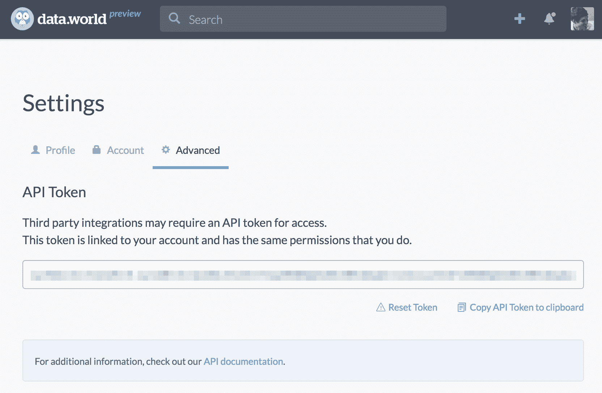
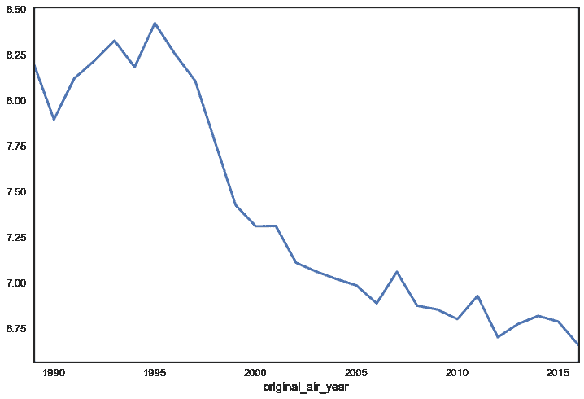
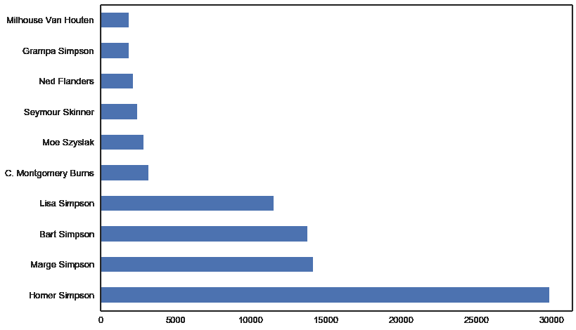
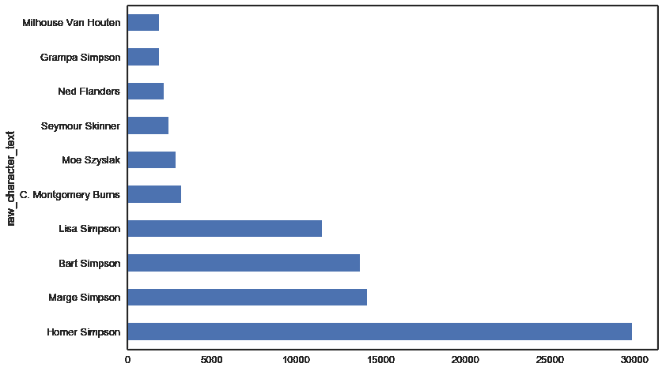
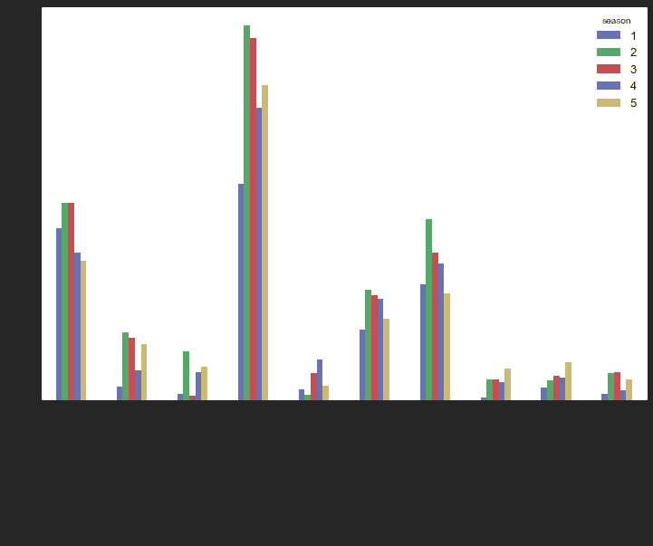

# 使用 data.world Python 库加速您的数据采集

> 原文：<https://www.dataquest.io/blog/datadotworld-python-tutorial/>

March 22, 2017

处理数据时，工作流程的一个关键部分是查找和导入数据集。能够快速定位数据、理解数据并将其与其他来源相结合可能很困难。

一个有助于此的工具是 [data.world](https://www.data.world) ，在这里你可以搜索、复制、分析和下载数据集。此外，您可以将您的数据上传到 data.world，并使用它与他人协作。

在本教程中，我们将向您展示如何使用 data.world 的 python 库轻松处理 Python 脚本或 Jupyter 笔记本中的数据。您需要创建一个免费的 data.world 帐户来查看数据集并进行后续操作。

data.world python 库允许您将存储在 data.world 数据集中的数据直接引入您的工作流，而无需首先在本地下载数据并将其转换为您需要的格式。

因为 data.world 中的数据集是以用户最初上传时的格式存储的，所以您经常会发现很棒的数据集以一种不太理想的格式存在，比如 Excel 工作簿的多个工作表，在这种情况下，将它们导入 Python 可能是一件痛苦的事情。data.world Python 库消除了这种麻烦，允许您以自己喜欢的形式轻松处理数据。

## 安装 data.world 库

您需要做的第一件事是安装库，这可以通过 pip 完成:

```
pip install git+git://github.com/datadotworld/data.world-py.git
```

这将安装库及其所有依赖包。这个库的一个便利之处是它的命令行实用程序，它允许您轻松地将 API 令牌存储在本地。这避免了必须把它放在你的脚本或笔记本中，并且在你分享你的作品时必须担心共享你的令牌。

首先，进入 data.world 中的[设置>高级](https://data.world/settings/advanced)并获取您的 API 令牌:



如果您在 virtualenv 或 Conda env 中安装了 python 库，您将需要激活该环境。然后只需运行`dw configure`，它会提示您输入令牌:

```
 ~ (datadotworld) $ dw configure
API token (obtained at: https://data.world/settings/advanced): _ 
```

当您输入令牌时，将在您的主目录中创建一个`.dw/`目录，您的令牌将存储在那里。

## 我们的数据集

在本教程中，我们将使用电视节目《辛普森一家》的一组数据信息。托德·施奈德为他的文章[《辛普森一家》收集了数据](https://toddwschneider.com/posts/the-simpsons-by-the-data/)，为此他在 GitHub 上提供了刮刀[。Kaggle 用户 William Cukierski 使用 scraper 上传数据集，该数据集随后在 data . world](https://github.com/toddwschneider/flim-springfield)上重新托管。

如果您查看 data.world 上的[数据集页面，您可以看到数据集中有四个 csv 文件:](https://data.world/data-society/the-simpsons-by-the-data)

*   《辛普森一家》中出现的每个角色。
*   《辛普森一家》的每一集。
*   《辛普森一家》中出现的每个地方。
*   《辛普森一家》每个剧本的每一句台词。

我们将使用 Python 3 和 Jupyter Notebook 处理这些数据。

## 使用 data.world 的 Python 库来研究数据

首先，让我们导入`datadotworld`库:

```
import datadotworld as dw
```

我们将使用`load_dataset()`函数来查看数据。当我们第一次使用`load_dataset()`时，它:

*   从 data.world 下载数据集并缓存在我们的`~/.dw/`目录中
*   返回一个代表数据集的`LocalDataset`对象

本地缓存数据集是一个非常好的特性——它允许更快的后续加载，允许您离线处理数据，确保您每次运行代码时源数据都是相同的，并且将来将支持数据集版本控制。在第一次为给定的数据集调用`load_data_set()`之后，它将从缓存的版本中加载数据集。如果您希望从远程版本强制重新加载并覆盖更改，您可以将`True`传递给可选的`force_update`参数。

`load_dataset()`有一个必需的参数`dataset_key`，您可以从 data.world 上数据集的 URL 中提取这个参数。例如，我们的 simpsons 数据集有一个 URL `https://data.world/data-society/the-simpsons-by-the-data`，它的 ID 为`data-society/the-simpsons-by-the-data`。

```
lds = dw.load_dataset('data-society/the-simpsons-by-the-data')
```

### 了解我们的数据

为了更仔细地查看我们的`LocalDataset`对象，我们可以使用`LocalDataset.describe()`方法，它返回一个 JSON 对象。

```
 # We use pprint as it makes our output easier to read
pp.pprint(lds.describe()) 
```

```
 {
   'homepage': 'https://data.world/data-society/the-simpsons-by-the-data',
    'name': 'data-society_the-simpsons-by-the-data',
    'resources': [   {   'format': 'csv',
                         'name': 'simpsons_characters',
                         'path': 'data/simpsons_characters.csv'},
                     {   'format': 'csv',
                         'name': 'simpsons_episodes',
                         'path': 'data/simpsons_episodes.csv'},
                     {   'format': 'csv',
                         'name': 'simpsons_locations',
                         'path': 'data/simpsons_locations.csv'},
                     {   'format': 'csv',
                         'name': 'simpsons_script_lines',
                         'path': 'data/simpsons_script_lines.csv'}]}
```

我们的 JSON 对象在顶层有三个键/值对:`homepage`、`name`和`resources`。`resources`是一个包含 data.world 数据集中每个文件信息的列表:它的名称、格式和路径。在上面的例子中，我们可以看到这个数据集中的所有四个资源都是 CSV 文件。

除了`LocalDataset.describe()`函数，我们的`LocalDataset`对象还有三个关键属性可以用来访问数据本身:`LocalDataset.dataframes`、`LocalDataset.tables`和`LocalDataset.raw_data`。

这些属性的工作方式相同，但返回的数据格式不同。

```
 for i in [lds.dataframes, lds.tables, lds.raw_data]:
    print(i,'n') # pprint does not work on lazy-loaded dicts
```

```
 {'simpsons_characters': LazyLoadedValue(<pandas.DataFrame>), 'simpsons_episodes': LazyLoadedValue(<pandas.DataFrame>), 'simpsons_locations': LazyLoadedValue(<pandas.DataFrame>), 'simpsons_script_lines': LazyLoadedValue(<pandas.DataFrame>)} 

{'simpsons_characters': LazyLoadedValue(<list of rows>), 'simpsons_episodes': LazyLoadedValue(<list of rows>), 'simpsons_locations': LazyLoadedValue(<list of rows>), 'simpsons_script_lines': LazyLoadedValue(<list of rows>)} 

{'simpsons_characters': LazyLoadedValue(<bytes>), 'simpsons_episodes': LazyLoadedValue(<bytes>), 'simpsons_locations': LazyLoadedValue(<bytes>), 'simpsons_script_lines': LazyLoadedValue(<bytes>)} 
```

`LocalDataset.dataframes`返回熊猫 DataFrame 对象的字典，其中 as `LocalDataset.tables`和`LocalDataset.raw_data`分别返回 Python 列表和字节格式的字典中的数据。如果我们不想使用 pandas，列表会很有用，如果我们有像图像或数据库文件这样的二进制数据，bytes 会很有用。

由于 pandas 库的强大功能，让我们使用`LocalDataset.dataframes`来探索和享受我们的数据吧！

```
 simpsons_eps = lds.dataframes['simpsons_episodes']
print(simpsons_eps.info())
simpsons_eps.head() 
```

```
 <class 'pandas.core.frame.dataframe'="">
RangeIndex: 600 entries, 0 to 599
Data columns (total 13 columns):
id                        600 non-null int64
title                     600 non-null object
original_air_date         600 non-null object
production_code           600 non-null object
season                    600 non-null int64
number_in_season          600 non-null int64
number_in_series          600 non-null int64
us_viewers_in_millions    594 non-null float64
views                     596 non-null float64
imdb_rating               597 non-null float64
imdb_votes                597 non-null float64
image_url                 600 non-null object
video_url                 600 non-null object
dtypes: float64(4), int64(4), object(5)
memory usage: 61.0+ KB
None 
```

|  | 身份证明（identification） | 标题 | 原始航空日期 | 生产代码 | 季节 | 当季数量 | 系列中的数字 | 美国观众(百万) | 视图 | imdb_rating | imdb _ 投票 | 图像 _url | video_url |
| --- | --- | --- | --- | --- | --- | --- | --- | --- | --- | --- | --- | --- | --- |
| Zero | Ten | 荷马之夜 | 1990-03-25 | 7G10 | one | Ten | Ten | Thirty point three | Fifty thousand eight hundred and sixteen | Seven point four | One thousand five hundred and eleven | https://static-media.fxx.com/img/FX_Networks_-_… |  |
| one | Twelve | 克鲁斯蒂被抓了 | 1990-04-29 | 7G12 | one | Twelve | Twelve | Thirty point four | Sixty-two thousand five hundred and sixty-one | Eight point three | One thousand seven hundred and sixteen | https://static-media.fxx.com/img/FX_Networks_-_… |  |
| Two | Fourteen | 巴特得了个“F” | 1990-10-11 | 7F03 | Two | one | Fourteen | Thirty-three point six | Fifty-nine thousand five hundred and seventy-five | Eight point two | One thousand six hundred and thirty-eight | https://static-media.fxx.com/img/FX_Networks_-_… |  |
| three | Seventeen | 每个车库有两辆车，晚上有三只眼睛… | 1990-11-01 | 7F01 | Two | four | Seventeen | Twenty-six point one | Sixty-four thousand nine hundred and fifty-nine | Eight point one | One thousand four hundred and fifty-seven | https://static-media.fxx.com/img/FX_Networks_-_… |  |
| four | Nineteen | 死亡放置社会 | 1990-11-15 | 7F08 | Two | six | Nineteen | Twenty-five point four | Fifty thousand six hundred and ninety-one | Eight | One thousand three hundred and sixty-six | https://static-media.fxx.com/img/FX_Networks_-_… |  |

我们可以使用`original_air_date`栏来查看剧集随时间的变化趋势。首先，让我们从该列中提取年份，然后使用数据透视表来直观显示 IMDB 评级随时间变化的趋势:

```
 simpsons_eps['original_air_date'] = pd.to_datetime(simpsons_eps['original_air_date'])
simpsons_eps['original_air_year'] = simpsons_eps['original_air_date'].dt.year

simpsons_eps.pivot_table(index='original_air_year',values='imdb_rating').plot()
plt.show()
```


我们在这里可以看到，根据 IMDB 评分者的数据，《辛普森一家》剧集的质量在前 6 年很高，此后一直处于稳步下滑的状态。

## 使用 SQL/SparQL 查询访问数据

使用 data.world python 库访问数据的第二种方式是使用`.query()`函数，该函数允许您访问 data.world 的查询工具。

`query()`函数返回一个`QueryResults`对象，它有三个属性，类似于`LocalDataset`对象的属性:`QueryResults.dataframe`、`QueryResults.table`和`QueryResults.raw_data`。

查询工具使用 [dwSQL](https://docs.data.world/tutorials/dwsql/) ，data.world 自己风格的 SQL，它接受大多数标准的 SQL 函数和查询类型。如果将可选的`querytype='sparql'`参数传递给函数，它也将接受 [SPARQL](https://docs.data.world/tutorials/sparql/) 查询。

查询工具允许您将多个数据集中的数据连接在一起，并检索较大数据的子集，以便您可以将处理较大数据的负担从本地系统转移出去。

让我们来看一个例子。包含《辛普森一家》剧集中的 158，000 行。让我们使用 [iPython magic command `%timeit`](https://ipython.org/ipython-doc/3/interactive/magics.html#magic-timeit) 对两种不同的绘图方式进行计时，简单分析一下哪些角色拥有最多的脚本行:

1.  在处理 pandas 中的数据之前，将数据从一个新的`LocalDataset`对象读入 pandas。
2.  使用`QueryResults.query()`获取 data.world 的查询工具处理数据，然后将结果返回给我们。

```
 def pandas_lines_by_characters():
    simpsons_script = lds.dataframes['simpsons_script_lines']
    simpsons_script = simpsons_script[simpsons_script['raw_character_text'] != '']
    top_10 = simpsons_script['raw_character_text'].value_counts().head(10)
    top_10.plot.barh()
    plt.show() 
```

```
1 loop, best of 1: 33.6 s per loop 
```



```
 def query_lines_by_characters():
    lds = dw.load_dataset('data-society/the-simpsons-by-the-data',force_update=True)
    q ='''
    select
        raw_character_text,
        count(*) as num_lines
    from simpsons_script_lines
    where raw_character_text != ''
    group by raw_character_text
    order by num_lines desc;
    '''
    qr = dw.query('data-society/the-simpsons-by-the-data',q)
    top_10 = qr.dataframe.set_index('raw_character_text').head(10)
    top_10['num_lines'].plot.barh()
    plt.show() 
```

```
 1 loop, best of 1: 2.38 s per loop 
```



使用`.query()`将我们的运行时间从 36 秒减少到 2 秒——减少了 94%!

我们的查询还可以用于连接单个数据集中多个表的数据，甚至是多个数据集中的数据。让我们修改我们的角色查询来比较前 5 季中我们的主要角色的角色线:

```
 q =
'''
select
    ssl.raw_character_text,
    se.season, count(*)
    as num_lines
from simpsons_script_lines ssl
inner join simpsons_episodes se
    on se.id = ssl.episode_id
where ssl.raw_character_text != ''
    and se.season < 6
group by
    ssl.raw_character_text,
    se.season
order by num_lines desc;
'''
qr = dw.query('data-society/the-simpsons-by-the-data',q)
df = qr.dataframe
char_counts = df.pivot_table(index='raw_character_text',
                              values='num_lines',aggfunc=sum)
top_10_chars = char_counts.sort_values(ascending=False).iloc[:10].index
top_10 = df[df['raw_character_text'].isin(top_10_chars)]
pivot = top_10.pivot_table(index='raw_character_text',
                           columns='season',values='num_lines')
pivot.plot.bar()
plt.show() 
```



## 使用 data.world API

除了`load_dataset()`和`query()`之外，data.world 库还提供了一个完整的 data.world API 包装器，让您可以访问许多强大的函数，这些函数允许您读取、创建和修改 data.world 上的数据集。

为了演示这一点，让我们将每一集《辛普森一家》开头的[黑板插科打诨](https://simpsons.wikia.com/wiki/Chalkboard_gag)添加到`simpsons_episodes`文件中。请注意，您需要成为数据集的贡献者或所有者，才能使用 API 进行更改。

我们将从从网上下载一个黑板游戏列表开始，清理它们以准备加入到主桌上。

```
 # create a list of dataframes from the tables listed on simpsons.wikia.co,
chalkboard_dfs = pd.read_html('https://simpsons.wikia.com/wiki/List_of_chalkboard_gags',match='Gag')
# remove the simpsons movie from the list
chalkboard_dfs = [i for i in chalkboard_dfs if i.shape[0] != 2]
# inspect the format of our dataframes
chalkboard_dfs[0].head() 
```

|  | Zero | one | Two | three | four |
| --- | --- | --- | --- | --- | --- |
| Zero | # | 广播日期 | 屏幕上显示程序运行的图片 | 窒息 | 剧集标题 |
| one | one | 一九八九年十二月十七日 | 圆盘烤饼 | 没有插科打诨 | 辛普森一家在火上烤 |
| Two | Two | 1990 年 1 月 14 日 | 圆盘烤饼 | 我不会浪费粉笔 | 天才巴特 |
| three | three | 1990 年 1 月 21 日 | 圆盘烤饼 | 我不会在大厅里玩滑板 | 荷马的奥德赛 |
| four | four | 1990 年 1 月 28 日 | 圆盘烤饼 | 我不会在课堂上打嗝 | 没有比家更丢脸的了 |

```
 # the first row contains the column names, let's create a function to fix this
def cb_cleanup(df):
    df.columns = df.iloc[0]
    df = df.iloc[1:]
    return df
# and then apply the function to the whole list
chalkboard_dfs = [cb_cleanup(i) for i in chalkboard_dfs]
# join the list of dataframes into one big dataframe
chalkboards = pd.concat(chalkboard_dfs,ignore_index=True)
# remove bad row without an id
chalkboards = chalkboards[pd.notnull(chalkboards['#'])]
print(chalkboards.shape)
chalkboards.head() 
```

```
 (605,5) 
```

|  | # | 广播日期 | 屏幕上显示程序运行的图片 | 窒息 | 剧集标题 |
| --- | --- | --- | --- | --- | --- |
| Zero | one | 一九八九年十二月十七日 | 圆盘烤饼 | 没有插科打诨 | 辛普森一家在火上烤 |
| one | Two | 1990 年 1 月 14 日 | 圆盘烤饼 | 我不会浪费粉笔 | 天才巴特 |
| Two | three | 1990 年 1 月 21 日 | 圆盘烤饼 | 我不会在大厅里玩滑板 | 荷马的奥德赛 |
| three | four | 1990 年 1 月 28 日 | 圆盘烤饼 | 我不会在课堂上打嗝 | 没有比家更丢脸的了 |
| four | five | 1990 年 2 月 4 日 | 圆盘烤饼 | 没有插科打诨——由于时间原因，开幕式缩短了 | 巴特将军 |

```
 # remove extra columns and normalize column names
chalkboards = chalkboards[['#','Gag']]
chalkboards.columns = ['id','chalkboard_gag']
# convert id column to int
chalkboards['id'] = chalkboards['id'].astype(int)
chalkboards.head() 
```

|  | 身份证明（identification） | 黑板 _gag |
| --- | --- | --- |
| Zero | one | 没有插科打诨 |
| one | Two | 我不会浪费粉笔 |
| Two | three | 我不会在大厅里玩滑板 |
| three | four | 我不会在课堂上打嗝 |
| four | five | 没有插科打诨——由于时间原因，开幕式缩短了 |

请注意，我们将带有剧集 id 的列命名为与它在原始表中的名称相同，这将使我们能够轻松地将数据连接在一起。

让我们将黑板引用加入到原始表格中，并将其导出为 CSV 格式。

```
 lds = dw.load_dataset('data-society/the-simpsons-by-the-data')
simpsons_episodes = lds.dataframes['simpsons_episodes']
simpsons_episodes = simpsons_episodes.merge(chalkboards,how='left',on='id')
simpsons_episodes.head() 
```

|  | 身份证明（identification） | 标题 | 原始航空日期 | 生产代码 | 季节 | 当季数量 | 系列中的数字 | 美国观众(百万) | 视图 | imdb_rating | imdb _ 投票 | 图像 _url | video_url | 黑板 _gag |
| --- | --- | --- | --- | --- | --- | --- | --- | --- | --- | --- | --- | --- | --- | --- |
| Zero | Ten | 荷马之夜 | 1990-03-25 | 7G10 | one | Ten | Ten | Thirty point three | Fifty thousand eight hundred and sixteen | Seven point four | One thousand five hundred and eleven | https://static-media.fxx.com/img/FX_Networks_-_… |  | 我不会叫我的老师“热蛋糕” |
| one | Twelve | 克鲁斯蒂被抓了 | 1990-04-29 | 7G12 | one | Twelve | Twelve | Thirty point four | Sixty-two thousand five hundred and sixty-one | Eight point three | One thousand seven hundred and sixteen | https://static-media.fxx.com/img/FX_Networks_-_… |  | 他们在嘲笑我，而不是和我一起 |
| Two | Fourteen | 巴特得了个“F” | 1990-10-11 | 7F03 | Two | one | Fourteen | Thirty-three point six | Fifty-nine thousand five hundred and seventy-five | Eight point two | One thousand six hundred and thirty-eight | https://static-media.fxx.com/img/FX_Networks_-_… |  | 我不会鼓励别人飞。(并且在 th… |
| three | Seventeen | 每个车库有两辆车，晚上有三只眼睛… | 1990-11-01 | 7F01 | Two | four | Seventeen | Twenty-six point one | Sixty-four thousand nine hundred and fifty-nine | Eight point one | One thousand four hundred and fifty-seven | https://static-media.fxx.com/img/FX_Networks_-_… |  | 我不会复印我的屁股。是土豆，不是锅… |
| four | Nineteen | 死亡放置社会 | 1990-11-15 | 7F08 | Two | six | Nineteen | Twenty-five point four | Fifty thousand six hundred and ninety-one | Eight | One thousand three hundred and sixty-six | https://static-media.fxx.com/img/FX_Networks_-_… |  | 我不是一个 32 岁的女人(在那个时候… |

我们几乎准备好上传我们的修改。以下代码:

*   将修改后的数据帧保存到 CSV 文件中
*   启动 data.world API 客户端对象
*   上传我们修改过的 CSV 文件，覆盖原始文件。

```
 simpsons_episodes.to_csv('simpsons_episodes.csv',index=False)
client = dw.api_client()
client.upload_files('data-society/the-simpsons-by-the-data',files='simpsons_episodes.csv') 
```

目前，data.world python 库中的 API 包装器限于 8 个方法，[列在库](https://github.com/datadotworld/data.world-py/)的 README.md 中。你可以通过库的[代码中的文档字符串了解更多关于它们如何工作的信息，也可以看看主](https://github.com/datadotworld/data.world-py/blob/master/datadotworld/client/api.py) [API 文档](https://docs.data.world/documentation/api/)。

* * *

您可以使用 data.world Python 库的三种方式— `load_dataset()`、`query()`和`api_client()` —为您提供了一个强大的工具集来简化数据处理。

我很想知道你是如何使用 data.world Python 库的— [让我知道](https://twitter.com/dataquestio)！

感谢 data.world 给我高级权限访问他们的 Python 库来写这篇文章。如果您对如何改进 data.world 库有任何建议，您可以通过[项目 GitHub 资源库](https://github.com/datadotworld/data.world-py)T3】提交问题和请求