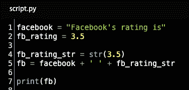
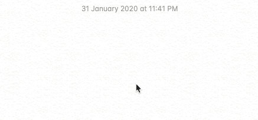
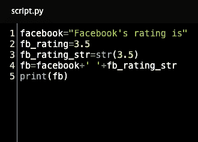
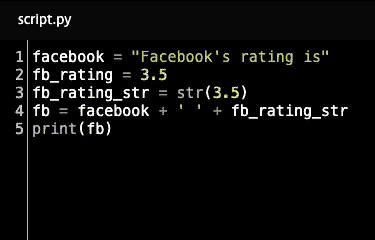
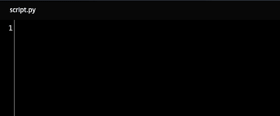
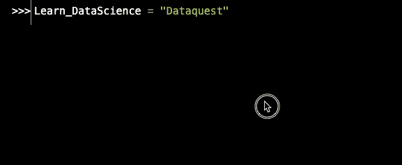

# Python 初学者:为什么 Python 看起来是这样的？

> 原文：<https://www.dataquest.io/blog/python-for-beginners-why-python-code-look/>

February 4, 2020

Python 入门课程通常从编程基础开始，比如如何打印一串文本或者如何执行数学运算。但是他们并不经常解释为什么代码看起来是这个样子。

例如，考虑下面的代码片段。如果你是一个完全的初学者，你可能会感到有点困惑和害怕。为什么代码的某些部分用不同的颜色？为什么有些线之间有间断而其他的没有？为什么有些字符周围有空格，而其他字符周围没有？

让我们深入研究并回答其中的一些问题，这样当您开始编写第一行 Python 代码时，您会对所看到的内容有一个更好的了解！

## 为什么代码在不同的地方有不同的颜色？

你在大多数编码平台和程序上看到的不同颜色只是为了帮助我们区分代码的不同部分。它们实际上对代码的运行没有任何影响

在下面的 gif 图中，你可以看到带有颜色的代码被粘贴到一个没有突出显示颜色的记事本中。这两个代码片段将做完全相同的事情，并且计算机读取它们是相同的。这些颜色只是为了让我们人类的代码更易读。

随着您对编程了解的越来越多，您会发现颜色很有帮助，因为它们突出了代码的不同元素。例如，上面代码片段中的黄色突出显示数值(即数字)。

(注意:这些颜色不是通用的。根据您编写代码的位置，您可能会看到不同的代码元素有不同的颜色选择，或者根本没有颜色。本文中的例子都展示了 Dataquest 上的文本是如何着色的。

## 为什么有些字符(像+和=)周围有空格？

就像颜色一样，这些空间是给我们人类的，让代码更容易阅读。计算机会简单地忽略它们，所以不管你有没有空格，你的代码都会运行。

然而，添加空格会使代码看起来更容易。尽管代码正常运行并不需要*，但你通常会看到 Python 是用这些空格编写的。*

 *

(这个约定有一些例外，但是如果你只是一个 Python 初学者，你现在不必担心它们！)

## 为什么有些行只是空白的？

就像颜色和空格一样，这些空行只是为了让代码更易读。

在下面的 gif 中，无论是否有空行，程序都将以完全相同的方式执行。然而，这些空白行让我们人类一眼就能发现代码的特定部分。

因此，再次强调，虽然空行不是绝对必要的，但是将代码中使用空行做不同事情的部分分开是一个很好的做法。这将使你(或其他人)以后更容易扫描和阅读你的代码。

## 为什么代码的不同部分被打在不同的行上？

代码中的每一行都代表一条编程语句。您可以将每条语句想象成指令列表中的一条指令。

例如，考虑如何喝水的说明:

1.  拿一个杯子
2.  把它装满水
3.  喝点水

这里有一系列的步骤。为了喝水，我们需要按照正确的顺序一次喝一杯。

同样的概念也适用于编程。为了让计算机做我们想让它做的事情，我们需要一次给它一条指令(编程语句)，按照逻辑顺序。

现在，考虑以下一组指令:

1.  拿一个玻璃杯，装满水，把水喝了

虽然它没有被非常清楚地呈现出来，但是一个人可以阅读它，并且指出它实际上是三个连续的步骤。然而，电脑并没有那么聪明。他们需要按顺序一步一步来。

这就是换行符的作用。当我们将代码分成新的一行时，计算机理解每一行都是一个独特的步骤，它将按顺序执行它们。

1.  拿一个杯子
2.  把它装满水
3.  喝点水

比如下面的 gif，我们先告诉 Python，变量 string 的值是‘Hello’。然后，在下一行，我们告诉 Python 打印该变量。我们必须用换行符分隔这两个步骤，否则 Python 会试图同时执行它们，从而导致错误。

## Python 中大写重要吗？

是的。Python 是一种“区分大小写”的语言，这意味着大小写很重要。

例如，脸书、Facebook 和 facebook 与 Python 的区别就像脸书和谷歌的区别一样。因为大写的不同，Python 会把脸书、Facebook、facebook 读成三个完全不同的变量。

在下面的 gif 中，你可以看到，如果我们创建一个名为 Learn_DataScience 的变量，然后试图查看变量 learn_datascience，我们会得到一个错误。

那是因为大写的缘故——Learn_DataScience 和 Learn _ data science 被 Python 读成了不同的变量。

## 现在您已经准备好编写自己的代码了！

希望在这一点上，您对 Python 代码的外观有了更好的理解。现在，是时候开始编写自己的代码了！

点击下面的按钮注册一个免费的 Dataquest 帐户。我们的 Python 基础课程将教你从头开始编写 Python，即使你以前没有任何经验！

其他作者:Sahil Sunny 和 Nityesh Agarwal

>导入 dataquest 作为 dq

开始免费学习我们的[Python for Data Science:Fundamentals 课程](/course/python-for-data-science-fundamentals/)。

[SIGN UP](https://app.dataquest.io/signup)*