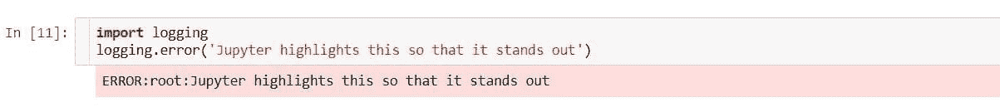
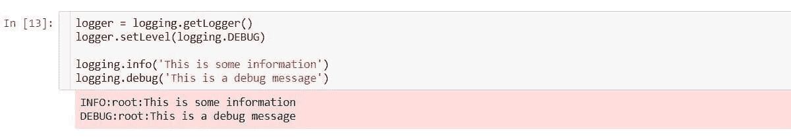
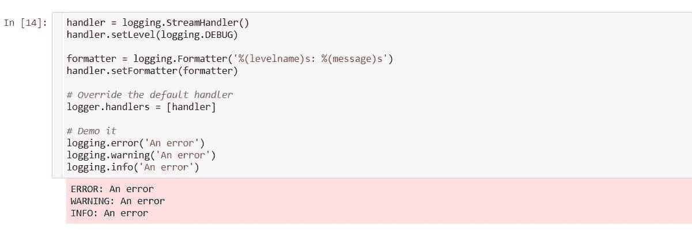
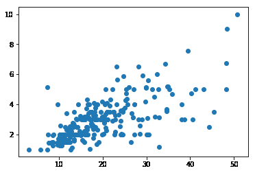
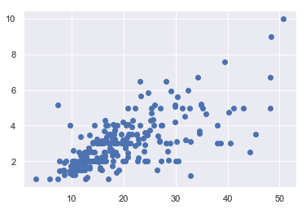
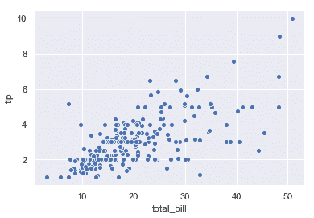
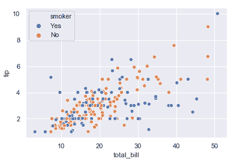
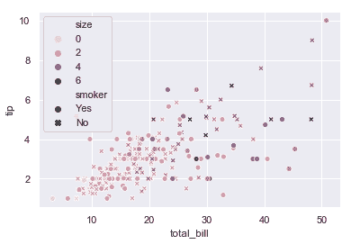
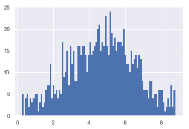
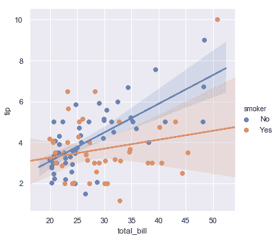

# 教程:高级 Jupyter 笔记本

> 原文：<https://www.dataquest.io/blog/advanced-jupyter-notebooks-tutorial/>

January 2, 2019

Jupyter 项目生命周期是现代数据科学和分析的核心。无论您是快速制作创意原型、演示您的工作，还是制作完整的报告，笔记本电脑都可以提供超越 ide 或传统桌面应用程序的高效优势。

继 [Jupyter 笔记本初学者:教程](https://www.dataquest.io/blog/jupyter-notebook-tutorial/)之后，这个指南将是一个 Jupyter 笔记本教程，带你踏上从真正的香草到彻头彻尾的危险的旅程。没错！Jupyter 的无序执行的古怪世界有着令人不安的力量，当涉及到在笔记本中运行笔记本时，事情会变得很复杂。

这个 Jupyter 笔记本教程旨在理顺一些混乱的来源，传播激发你的兴趣和激发你的想象力的想法。已经有很多关于整洁的提示和技巧的伟大列表，所以在这里我们将更彻底地看看 Jupyter 的产品。

这将涉及:

*   使用 shell 命令的基础知识和一些方便的魔术进行热身，包括调试、计时和执行多种语言。
*   探索日志记录、宏、运行外部代码和 Jupyter 扩展等主题。
*   了解如何使用 Seaborn 增强图表，使用主题和 CSS 美化笔记本，以及定制笔记本输出。
*   最后深入探讨脚本执行、自动化报告管道和使用数据库等主题。

如果你是 JupyterLab 的粉丝，你会很高兴听到 99%的内容仍然适用，唯一的区别是一些 Jupyter 笔记本扩展与 JuputerLab 不兼容。幸运的是，[令人敬畏的](https://github.com/mauhai/awesome-jupyterlab) [替代品](https://github.com/topics/jupyterlab-extension)已经出现在 GitHub 上。

现在我们准备好成为朱庇特巫师了！

## Shell 命令

每个用户至少都会不时地受益于从他们的笔记本中直接与操作系统交互的能力。代码单元中以感叹号开头的任何一行都将作为 shell 命令执行。这在处理数据集或其他文件以及管理 Python 包时非常有用。举个简单的例子:

```
<code="language-python">!echo Hello World!!
pip freeze | grep pandas
</code="language-python">
```

```
<code="language-python">
Hello World!
pandas==0.23.4
</code="language-python">
```

还可以在 shell 命令中使用 Python 变量，方法是在前面加上一个与 bash 风格变量名一致的符号`$`。

```
<code="language-python">
message = 'This is nifty'
!echo $message
</code="language-python">
```

```
<code="language-python">
This is nifty
</code="language-python">
```

请注意，`!`命令执行所在的 shell 在执行完成后会被丢弃，因此像`cd`这样的命令将不起作用。然而，IPython magics 提供了一个解决方案。

## 基本魔术

Magics 是内置于 IPython 内核中的便捷命令，它使执行特定任务变得更加容易。尽管它们经常类似于 unix 命令，但在本质上，它们都是用 Python 实现的[。存在的魔法比在这里介绍的要多得多，但是有必要强调各种各样的例子。在进入更有趣的案例之前，我们将从一些基础知识开始。](https://github.com/ipython/ipython/tree/master/IPython/core/magics)

有两种魔法:线魔法和细胞魔法。它们分别作用于单个细胞株，也可以分布于多个细胞株或整个细胞。要查看可用的魔术，您可以执行以下操作:

```
<code="language-python">%lsmagic</code="language-python">
```

```
<code="language-python">Available line magics:

Available cell magics:%%! %%HTML %%SVG %%bash %%capture %%cmd %%debug %%file %%html %%javascript %%js %%latex %%markdown %%perl %%prun %%pypy %%python %%python2 %%python3 %%ruby %%script %%sh %%svg %%sx %%system %%time %%timeit %%writefile
Automagic is ON, % prefix IS NOT needed for line magics.</code="language-python">
```

如你所见，有很多！大多数都在[官方文件](https://ipython.readthedocs.io/en/stable/interactive/magics.html)中列出，该文件旨在作为参考，但在某些地方可能有些晦涩。线条魔术以百分比字符`%`开始，单元格魔术以两个字符`%%`开始。

值得注意的是，`!`实际上只是 shell 命令的一种奇特的魔法语法，正如您可能已经注意到的，IPython 提供了魔法来代替那些改变 shell 状态并因此被`!`丢失的 shell 命令。例子有`%cd`、`%alias`、`%env`。

让我们再看一些例子。

### 自动保存

首先，`%autosave`魔术让你改变你的笔记本多久自动保存到它的检查点文件。

```
<code="language-python">%autosave 60</code="language-python">
```

```
<code="language-python">Autosaving every 60 seconds</code="language-python">
```

就这么简单！

### 显示 Matplotlib 图

对于数据科学家来说，最常见的线条魔法之一当然是`%matplotlib`，它当然是和最流行的 Python 绘图库 [Matplotlib](https://matplotlib.org/) 一起使用。

```
<code="language-python">%matplotlib inline</code="language-python">
```

提供`inline`参数指示 IPython 在单元格输出中内联显示 Matplotlib 绘图图像，使您能够在笔记本中包含图表。在导入 Matplotlib 之前，一定要包含这个魔术，因为如果不包含它，它可能无法工作；许多人在笔记本的开头，在第一个代码单元中导入它。

现在，让我们开始看看一些更复杂的特性。

## 排除故障

更有经验的读者可能会担心没有调试器的 Jupyter 笔记本的最终功效。但是不要害怕！IPython 内核有自己的 Python 调试器接口[、pdb](https://docs.python.org/3/library/pdb.html) ，以及几个在笔记本上使用它进行调试的选项。执行`%pdb` line magic 将打开/关闭笔记本中所有单元格的 pdb on error 自动触发。

```
<code="language-python">

raise NotImplementedError()
</code="language-python">
```

```
<code="language-python">
Automatic pdb calling has been turned ON
--------------------------------------------------------------------
NotImplementedError Traceback (most recent call last)
<ipython-input-31-022320062e1f> in <module>()
1 get_ipython().run_line_magic('pdb', '')
----> 2 raise NotImplementedError()
NotImplementedError:
> <ipython-input-31-022320062e1f>(2)<module>()
1 get_ipython().run_line_magic('pdb', '')
----> 2 raise NotImplementedError()
</code="language-python">
```

这暴露了一种交互模式，在这种模式下，您可以使用 [pdb 命令](https://docs.python.org/3/library/pdb.html#debugger-commands)。

另一个方便的调试魔术是`%debug`，您可以在出现异常后执行它，以便在失败时返回调用堆栈。

顺便说一句，还要注意上面的回溯是如何演示魔术如何被直接翻译成 Python 命令的，其中`%pdb`变成了`get_ipython().run_line_magic('pdb', '')`。改为执行这个等同于执行`%pdb`。

## 定时执行

有时在研究中，为竞争方法提供运行时比较是很重要的。IPython 提供了两个时序魔法`%time`和`%timeit`，每个都有行和单元模式。前者只是对单个语句或单元格的执行进行计时，这取决于它是用于行模式还是单元模式。

```
<code="language-python">
n = 1000000

</code="language-python">
```

```
<code="language-python">
Wall time: 32.9 ms
499999500000
</code="language-python">
```

在单元模式下:

```
<code="language-python">

total = 0
for i in range(n):
total += i
</code="language-python">
```

```
<code="language-python">
Wall time: 95.8 ms
</code="language-python">
```

`%timeit`与`%time`的显著区别在于它多次运行指定的代码并计算平均值。您可以使用`-n`选项指定运行次数，但是如果没有通过，将根据计算时间选择一个合适的值。

```
<code="language-python">%timeit sum(range(n))</code="language-python">
```

```
<code="language-python">34.9 ms ± 276 µs per loop (mean ± std. dev. of 7 runs, 10 loops each)</code="language-python">
```

## 执行不同的语言

在上面`%lsmagic`的输出中，你可能已经注意到了许多以各种编程、脚本或标记语言命名的单元格魔术，包括 HTML、JavaScript、 [Ruby](https://www.ruby-lang.org/en/) 和 [LaTeX](https://www.latex-project.org/) 。使用这些将使用指定的语言执行单元格。其他语言也有扩展，比如 r。

例如，要在笔记本中呈现 HTML:

```
<code="language-python">%%HTML
This is <em>really</em> neat!</code="language-python">
```

这*真的*利落！

同样， [LaTeX](https://www.latex-project.org/) 是一种显示数学表达式的标记语言，可以直接使用:

```
<code="language-python">%%latex
Some important equations:$E = mc^2$
$e^{i pi} = -1$
</code="language-python">
```

一些重要的方程式:
\(e = mc^2\)
\(e^{i \ pi } =-1 \)

## 配置日志记录

您知道 Jupyter 有一种内置的方法可以在单元格输出上突出显示自定义错误信息吗？这对于确保任何可能使用您的笔记本的人都很难忽略诸如无效输入或参数化之类的错误和警告非常方便。一个简单的、可定制的方法是通过标准的 Python `logging`模块。

(注意:对于这一部分，我们将使用一些屏幕截图，以便我们可以看到这些错误在真实笔记本中的样子。)



日志输出与`print`语句或标准单元输出分开显示，出现在所有这些之上。


这实际上是可行的，因为 Jupyter 笔记本同时监听[标准输出流](https://en.wikipedia.org/wiki/Standard_streams)、`stdout`和`stderr`，但处理方式不同；`print`语句和单元格输出路由到`stdout`，默认情况下`logging`已被配置为流过`stderr`。

这意味着我们可以配置`logging`在`stderr`上显示其他类型的消息。



我们可以像这样定制这些消息的格式:



请注意，每次运行通过`logger.addHandler(handler)`添加新流处理程序的单元时，每次记录的每个消息都会有一行额外的输出。我们可以将所有的日志记录配置放在靠近笔记本顶部的单元格中，或者像我们在这里所做的那样，强行替换日志记录器上所有现有的处理程序。在这种情况下，我们必须删除默认的处理程序。

将[记录到一个外部文件](https://stackoverflow.com/a/28195348/604687)也很容易，如果你从命令行执行你的笔记本，这可能会派上用场，后面会讨论。只是用一个`FileHandler`代替一个`StreamHandler`:

```
<code="language-python">handler = logging.FileHandler(filename='important_log.log', mode='a')</code="language-python">
```

最后要注意的是，这里描述的日志不要与使用`%config`魔法通过`%config Application.log_level="INFO"`改变应用程序的日志级别相混淆，因为这决定了 Jupyter 在运行时向终端输出什么。

## 扩展ˌ扩张

由于它是一个开源的 webapp，已经为 Jupyter 笔记本开发了大量的扩展，并且有一个很长的[官方列表](https://github.com/ipython/ipython/wiki/Extensions-Index)。事实上，在下面的*使用数据库*一节中，我们使用了 [ipython-sql](https://github.com/catherinedevlin/ipython-sql) 扩展。另一个特别值得注意的是来自 Jupyter-contrib 的[扩展包，它包含了用于拼写检查、代码折叠等等的独立扩展。](https://github.com/ipython-contrib/jupyter_contrib_nbextensions)

您可以从命令行安装和设置它，如下所示:

```
<code="language-python">
pip install jupyter_contrib_nbextensions
jupyter contrib nbextension install --user
jupyter nbextension enable spellchecker/main
jupyter nbextension enable codefolding/main
</code="language-python">
```

这将在 Python 中安装`jupyter_contrib_nbextensions`包，在 Jupyter 中安装，然后启用拼写检查和代码折叠扩展。不要忘记在安装时实时刷新任何笔记本以加载更改。

请注意，Jupyter-contrib 只能在普通的 Jupyter 笔记本上运行，但是 GitHub 上现在发布了 JupyterLab 的新的[扩展。](https://github.com/topics/jupyterlab-extension)

## 使用 Seaborn 增强图表

Jupyter 笔记本用户进行的最常见的练习之一是制作情节。但是 Python 最流行的图表库 Matplotlib 并不以吸引人的结果而闻名，尽管它是可定制的。Seaborn 立即美化 Matplotlib 图，甚至添加一些与数据科学相关的附加功能，使您的报告更漂亮，您的工作更容易。它包含在默认的 [Anaconda](https://www.anaconda.com/what-is-anaconda/) 安装中，也可以通过`pip install seaborn`轻松安装。

让我们来看一个例子。首先，我们将导入我们的库并加载一些数据。

```
<code="language-python">
import matplotlib.pyplot as plt
import seaborn as sns
data = sns.load_dataset("tips")
</code="language-python">
```

Seaborn 提供了一些内置的[样本数据集](https://github.com/mwaskom/seaborn-data)，用于文档、测试和学习目的，我们将在这里使用它们。这个“tips”数据集是一个 pandas `DataFrame`,列出了酒吧或餐馆的一些账单信息。我们可以看到账单总额、小费、付款人的性别以及其他一些属性。

```
<code="language-python">data.head()</code="language-python">
```

|  | 合计 _ 账单 | 小费 | 性 | 吸烟者 | 天 | 时间 | 大小 |
| --- | --- | --- | --- | --- | --- | --- | --- |
| Zero | Sixteen point nine nine | One point zero one | 女性的 | 不 | 太阳 | 主餐 | Two |
| one | Ten point three four | One point six six | 男性的 | 不 | 太阳 | 主餐 | three |
| Two | Twenty-one point zero one | Three point five | 男性的 | 不 | 太阳 | 主餐 | three |
| three | Twenty-three point six eight | Three point three one | 男性的 | 不 | 太阳 | 主餐 | Two |
| four | Twenty-four point five nine | Three point six one | 女性的 | 不 | 太阳 | 主餐 | four |

我们可以很容易地在 Matplotlib 中绘制出`total_bill` vs `tip`。

```
<code="language-python">plt.scatter(data.total_bill, data.tip);</code="language-python">
```



在 Seaborn 绘图也一样简单！只需设置一个样式，你的 Matplotlib 图就会自动转换。

```
<code="language-python">sns.set(style="darkgrid")plt.scatter(data.total_bill, data.tip);</code="language-python">
```



这是多么大的改进啊，而且只需要一个导入和一行额外的代码！在这里，我们使用了深色网格样式，但是 Seaborn 总共有五种内置样式供您使用:深色网格、白色网格、深色、白色和刻度。

但是，我们并没有止步于样式化:由于 Seaborn 与 pandas 数据结构紧密集成，它自己的散点图功能释放了额外的特性。

```
<code="language-python">sns.scatterplot(x="total_bill", y="tip", data=data);</code="language-python">
```



现在，我们为每个数据点获得了默认的轴标签和改进的默认标记。Seaborn 还可以根据数据中的类别自动分组，为您的绘图添加另一个维度。让我们根据买单的群体是否吸烟来改变标记的颜色。

```
<code="language-python">sns.scatterplot(x="total_bill", y="tip", hue="smoker", data=data);</code="language-python">
```



这真是太棒了！事实上，我们可以做得更深入，但是这里的细节太多了。作为品尝者，让我们根据买单的人数来区分吸烟者和非吸烟者。

```
<code="language-python">sns.scatterplot(x="total_bill", y="tip", hue="size", style="smoker", data=data);</code="language-python">
```



希望能弄清楚为什么 Seaborn 将自己描述为“绘制吸引人的统计图形的高级界面”。

事实上，这已经足够高级了，例如，为绘制数据的[提供带有最佳拟合线](https://seaborn.pydata.org/tutorial/regression.html)(通过线性回归确定)的一行程序，而 Matplotlib 依赖于您自己[准备数据](https://stackoverflow.com/a/6148315/604687)。但是如果你需要的是更吸引人的情节，它是非常可定制的；例如，如果你对默认主题不满意，你可以从一整套标准的[调色板](https://seaborn.pydata.org/tutorial/color_palettes.html)中选择，或者定义自己的主题。

Seaborn 允许你用更多的方式来可视化你的数据结构和其中的统计关系，查看[他们的例子](https://seaborn.pydata.org/examples/index.html)。

## 宏指令

像许多用户一样，您可能会发现自己一遍又一遍地编写相同的任务。也许当你开始一个新的笔记本时，你总是需要导入一堆包，一些你发现你自己为每个数据集计算的统计数据，或者一些你已经制作了无数次的标准图表？

Jupyter 允许您将代码片段保存为可执行宏，以便在所有笔记本上使用。尽管执行未知代码对其他试图阅读或使用您的笔记本的人来说不一定有用，但在您进行原型制作、调查或只是玩玩的时候，它绝对是一种方便的生产力提升。

宏只是代码，所以它们可以包含在执行前必须定义的变量。让我们定义一个来使用。

```
<code="language-python">name = 'Tim'</code="language-python">
```

现在，要定义一个宏，我们首先需要一些代码来使用。

```
<code="language-python">print('Hello, %s!' % name)</code="language-python">
```

```
<code="language-python">Hello, Tim!</code="language-python">
```

我们使用`%macro`和`%store`魔法来设置一个可以在所有笔记本上重复使用的宏。宏名通常以双下划线开头，以区别于其他变量，如下所示:

```
<code="language-python">%macro -q __hello_world 23
\%store __hello_world</code="language-python">
```

```
<code="language-python">Stored '__hello_world' (Macro)</code="language-python">
```

这个`%macro`魔术需要一个名字和一个单元格号(单元格左边方括号中的数字；在这种情况下，23 如在`In [23]`)，我们还通过了`-q`，使它不那么冗长。`%store`实际上允许我们保存任何变量以便在其他会话中使用；这里，我们传递我们创建的宏的名称，这样我们可以在内核关闭后或在其他笔记本中再次使用它。不带任何参数运行，`%store`列出你保存的项目。

要从存储中加载宏，我们只需运行:

```
<code="language-python">%store -r __hello_world</code="language-python">
```

为了执行它，我们只需要运行一个只包含宏名的单元格。

```
<code="language-python">__hello_world</code="language-python">
```

```
<code="language-python">Hello, Tim!</code="language-python">
```

让我们修改我们在宏中使用的变量。

```
<code="language-python">name = 'Ben'</code="language-python">
```

当我们现在运行宏时，我们修改后的值被选中。

```
<code="language-python">__hello_world</code="language-python">
```

```
<code="language-python">Hello, Ben!</code="language-python">
```

这是因为宏只是在单元格的范围内执行保存的代码；如果`name`未定义，我们会得到一个错误。

但是宏并不是笔记本间共享代码的唯一方式。

## 执行外部代码

并非所有代码都属于 Jupyter 笔记本。事实上，尽管完全有可能在 Jupyter 笔记本上编写统计模型，甚至是完整的多部分项目，但是这些代码会变得混乱，难以维护，并且其他人无法使用。Jupyter 的灵活性无法替代编写结构良好的 [Python 模块](https://docs.python.org/3/tutorial/modules.html)，这些模块可以轻松地导入到您的笔记本中。

总的来说，当您的快速笔记本项目开始变得更加严肃，并且您发现自己正在编写可重用的或者可以逻辑分组到 Python 脚本或模块中的代码时，您应该这样做！除了可以在 Python 中直接导入自己的模块，Jupyter 还允许您使用`%load`和`%run`外部脚本来支持组织更好、规模更大的项目和可重用性。

为每个项目一遍又一遍地导入相同的包是`%load`魔术的完美候选，它将外部脚本加载到执行它的单元中。

但是已经说得够多了，让我们来看一个例子！如果我们创建一个包含以下代码的文件`imports.py`:

```
<code="language-python">

import pandas as pd
import numpy as np
import matplotlib.pyplot as plt</code="language-python">
```

我们可以简单地通过编写一个单行代码单元格来加载它，就像这样:

```
<code="language-python">%load imports.py</code="language-python">
```

执行此操作将用加载的文件替换单元格内容。

```
<code="language-python">
# %load imports.py

import pandas as pd
import numpy as np
import matplotlib.pyplot as plt
</code="language-python">
```

现在我们可以再次运行单元来导入我们所有的模块，我们已经准备好了。

`%run`魔术是相似的，除了它将执行代码和显示任何输出，包括 Matplotlib 图。您甚至可以这样执行整个笔记本，但是请记住，并不是所有代码都真正属于笔记本。让我们来看看这个魔术的例子；考虑一个包含以下简短脚本的文件。

```
<code="language-python">
import numpy as np
import matplotlib.pyplot as plt
import seaborn as sns
sns.set(style="darkgrid")
if __name__ == '__main__':
h = plt.hist(np.random.triangular(0, 5, 9, 1000), bins=100, linewidth=0)
plt.show()</code="language-python">
```

当通过`%run`执行时，我们得到以下结果。

```
<code="language-python">%run triangle_hist.py</code="language-python">
```



```
<code="language-python"><matplotlib.figure.Figure at 0x2ace50fe860></code="language-python">
```

如果您希望[将参数传递给脚本](https://stackoverflow.com/a/14411126/604687)，只需在文件名`%run my_file.py 0 "Hello, World!"`后或使用变量`%run $filename {arg0} {arg1}`显式列出它们。此外，使用`-p`选项通过 [Python 分析器](https://stackoverflow.com/a/582337/604687)运行代码。

## 脚本执行

虽然 Jupyter 笔记本电脑最重要的功能来自于它们的交互流程，但它也可以在非交互模式下运行。从脚本或命令行执行笔记本提供了一种生成自动化报告或类似文档的强大方法。

Jupyter 提供了一个命令行工具，它可以以最简单的形式用于文件转换和执行。您可能已经知道，笔记本可以转换成多种格式，可以从 UI 的“文件>下载为”下获得，包括 HTML、PDF、Python 脚本，甚至 LaTeX。该功能通过一个名为 [`nbconvert`](https://nbconvert.readthedocs.io/en/latest/usage.html) 的 API 暴露在命令行上。也有可能在 Python 脚本中执行笔记本，但这已经[很好地记录了](https://nbconvert.readthedocs.io/en/latest/execute_api.html#executing-notebooks-using-the-python-api-interface)，下面的例子应该同样适用。

与`%run`类似，需要强调的是，虽然独立执行笔记本的能力使得完全在 Jupyter 笔记本中编写所有的项目成为可能，但这并不能替代将代码分解成适当的标准 Python 模块和脚本。

### 在命令行上

稍后将会清楚`nbconvert`如何让开发者创建他们自己的自动化报告管道，但是首先让我们看一些简单的例子。基本语法是:

```
<code="language-python">jupyter nbconvert --to <format> notebook.ipynb</code="language-python">
```

例如，要创建 PDF，只需编写:

```
<code="language-python">jupyter nbconvert --to pdf notebook.ipynb</code="language-python">
```

这将获取当前保存的静态内容`notebook.ipynb`并创建一个名为`notebook.pdf`的新文件。这里需要注意的是，要转换成 PDF [需要安装 pandoc(Anaconda 自带)和 LaTeX(没有)。安装说明](https://nbconvert.readthedocs.io/en/latest/install.html#installing-nbconvert)[取决于您的操作系统](https://stackoverflow.com/a/52913424/604687)。

默认情况下，`nbconvert`不执行你的笔记本代码单元格。但是如果你也愿意，你可以指定 [`--execute`](https://nbconvert.readthedocs.io/en/latest/execute_api.html#executing-notebooks-from-the-command-line) 标志。

```
<code="language-python">jupyter nbconvert --to pdf --execute notebook.ipynb</code="language-python">
```

一个常见的障碍是，运行笔记本时遇到的任何错误都会暂停执行。幸运的是，您可以加入`--allow-errors`标志来指示`nbconvert`将错误消息输出到单元格输出中。

```
<code="language-python">jupyter nbconvert --to pdf --execute --allow-errors notebook.ipynb</code="language-python">
```

### 环境变量参数化

脚本执行对于不总是产生相同输出的笔记本电脑特别有用，例如，如果您正在处理随时间变化的数据，无论是从磁盘上的文件还是通过 API 下载的数据。例如，生成的文档可以很容易地通过电子邮件发送给一批订户，或者上传到亚马逊 S3 网站供用户下载。

在这种情况下，您很可能希望将笔记本参数化，以便用不同的初始值运行它们。实现这一点的最简单的方法是使用环境变量，这是在执行笔记本之前定义的。

假设我们想要为不同的日期生成几个报告；在我们笔记本的第一个单元格中，我们可以从一个环境变量中提取这些信息，我们将其命名为`REPORT_DATE`。`%env` line magic 使得将环境变量的值赋给 Python 变量变得很容易。

```
<code="language-python">report_date = %env REPORT_DATE</code="language-python">
```

然后，要运行笔记本(在 UNIX 系统上),我们可以这样做:

```
<code="language-python">REPORT_DATE=2018-01-01 jupyter nbconvert --to html --execute report.ipynb</code="language-python">
```

因为所有的环境变量都是字符串，所以我们必须解析它们以获得我们想要的数据类型。例如:

```
<code="language-python">
A_STRING="Hello, Tim!"
AN_INT=42
A_FLOAT=3.14
A_DATE=2017-12-31 jupyter nbconvert --to html --execute example.ipynb</code="language-python">
```

我们简单地解析如下:

```
<code="language-python">
import datetime as dt
the_str = %env A_STRING
int_str = %env AN_INT
my_int = int(int_str)
float_str = %env A_FLOAT
my_float = float(float_str)
date_str = %env A_DATE
my_date = dt.datetime.strptime(date_str, '%Y-%m-%d')
</code="language-python">
```

解析日期肯定不如其他常见的数据类型直观，但像往常一样，Python 中有几个选项。

#### 在 Windows 上

如果你想设置你的环境变量并在 Windows 上用一行代码运行你的笔记本，那就没那么简单了:

```
<code="language-python">cmd /C "set A_STRING=Hello, Tim!&& set AN_INT=42 && set A_FLOAT=3.14 && set A_DATE=2017-12-31&& jupyter nbconvert --to html --execute example.ipynb"</code="language-python">
```

敏锐的读者会注意到上面定义了`A_STRING`和`A_DATE`后少了一个空格。这是因为尾随空格对 Windows `set`命令很重要，所以虽然 Python 可以通过首先去除空格来成功解析整数和浮点数，但我们必须更加小心我们的字符串。

### Papermill 参数化

使用环境变量对于简单的用例来说是很好的，但是对于任何更复杂的情况，有一些库可以让你把参数传递给你的笔记本并执行它们。GitHub 上超过 1000 颗星，大概最受欢迎的是 [Papermill](https://github.com/nteract/papermill) ，可以装`pip install papermill`。

Papermill 将一个新的单元注入到您的笔记本中，该单元实例化您传入的参数，为您解析数字输入。这意味着您可以直接使用变量，而不需要任何额外的设置(尽管日期仍然需要被解析)。或者，您可以在笔记本中创建一个单元格，[通过单击“查看>单元格工具栏>标签”并向您选择的单元格添加“参数”标签来定义您的默认](https://github.com/nteract/papermill#parameterizing-a-notebook)参数值。

我们之前生成 HTML 文档的例子现在变成了:

```
<code="language-python">papermill example.ipynb example-parameterised.ipynb -p my_string "Hello, Tim!" -p my_int 3 -p my_float 3.1416 -p a_date 2017-12-31
jupyter nbconvert example-parameterised.ipynb --to html --output example.html</code="language-python">
```

我们用`-p`选项指定每个参数，并使用一个中间笔记本，以便不改变原始的。完全有可能覆盖原来的`example.ipynb`文件，但是记住 Papermill 会注入一个参数单元格。

现在，我们的笔记本电脑设置简单多了:

```
<code="language-python">
# my_string, my_int, and my_float are already defined!
import datetime as dt
my_date = dt.datetime.strptime(a_date, '%Y-%m-%d')
</code="language-python">
```

到目前为止，我们短暂的一瞥只揭示了造纸厂的冰山一角。该库还可以跨笔记本执行和收集指标，总结笔记本的集合，并提供一个 API 来存储数据和 Matplotlib 图，以便在其他脚本或笔记本中访问。这些都在 [GitHub 自述](https://github.com/nteract/papermill#usage)中有很好的记载，这里就不需要再赘述了。

现在应该清楚的是，使用这种技术，可以编写 shell 或 Python 脚本，这些脚本可以批量生成多个文档，并通过像 [crontab](https://en.wikipedia.org/wiki/Cron) 这样的工具进行调度，从而自动按计划运行。强大的东西！

## 造型笔记本

如果您正在寻找笔记本的特定外观，您可以创建一个外部 CSS 文件并用 Python 加载它。

```
<code="language-python">
from IPython.display import HTML
HTML('<style>{}</style>'.format(open('custom.css').read()))</code="language-python">
```

这是因为 IPython 的 [HTML](https://ipython.readthedocs.io/en/stable/api/generated/IPython.display.html#IPython.display.HTML) 对象作为原始 HTML 直接插入到单元格输出 div 中。实际上，这相当于编写一个 HTML 单元格:

```
<code="language-python">

<style>.css-example { color: darkcyan; }</style></code="language-python">
```

为了证明这一点，让我们使用另一个 HTML 单元格。

```
<code="language-python">%%html
<span class='css-example'>This text has a nice colour</span></code="language-python">
```

这段文字的颜色很好看

使用 HTML 单元格一两行就可以了，但是像我们第一次看到的那样，加载外部文件通常会更干净。

如果你更愿意[一次性定制你所有的笔记本](https://stackoverflow.com/a/34742362/604687)，你可以直接将 CSS 写入 Jupyter config 目录下的`~/.jupyter/custom/custom.css`文件中，尽管这只有在你自己的电脑上运行或转换笔记本时才有效。

事实上，所有上述技术也适用于转换成 HTML 的笔记本，但是不能用于转换成 pdf 的笔记本。

要探索你的样式选项，请记住 Jupyter 只是一个 web 应用程序，你可以使用浏览器的开发工具在它运行时检查它，或者研究一些导出的 HTML 输出。你会很快发现它结构良好:所有的单元格都用`cell`类指定，文本和代码单元格同样分别用`text_cell`和`code_cell`区分，输入和输出用`input`和`output`表示，等等。

GitHub 上还发布了[各种](https://github.com/nsonnad/base16-ipython-notebook)不同的 Jupyter 笔记本流行预设计主题。最受欢迎的是 [jupyterthemes](https://github.com/dunovank/jupyter-themes) ，可以通过`pip install jupyterthemes`获得，设置“monokai”主题就像运行`jt -t monokai`一样简单。如果你正在寻找 JupyterLab 的主题，GitHub 上也会弹出一个不断增长的选项列表。

## 隐藏单元格

虽然隐藏笔记本中有助于其他人理解的部分是不好的做法，但你的一些单元格对读者来说可能并不重要。例如，您可能希望隐藏一个向笔记本添加 CSS 样式的单元格，或者，如果您希望隐藏默认的和注入的 Papermill 参数，您可以修改您的`nbconvert`调用，如下所示:

```
<code="language-python">jupyter nbconvert example-parameterised.ipynb --to html --output example.html --TagRemovePreprocessor.remove_cell_tags="{'parameters', 'injected-parameters'}"</code="language-python">
```

事实上，这种方法可以有选择地应用于笔记本中的任何标记单元格，使得 [`TagRemovePreprocessor`配置](https://nbconvert.readthedocs.io/en/latest/config_options.html)非常强大。顺便说一句，还有很多其他的方法来隐藏你笔记本里的电池。

## 使用数据库

数据库是数据科学家的面包和黄油，所以平滑你的数据库和笔记本之间的接口将是一个真正的福音。Catherine Devlin 的 [IPython SQL magic](https://github.com/catherinedevlin/ipython-sql) 扩展让你可以用最少的样板文件将 SQL 查询直接写入代码单元，也可以将结果直接读入 pandas 数据帧。首先，继续:

```
<code="language-python">pip install ipython-sql</code="language-python">
```

安装好软件包后，我们通过在代码单元中执行以下魔术来开始:

```
<code="language-python">%load_ext sql</code="language-python">
```

这将加载我们刚刚安装到笔记本中的`ipython-sql`扩展。让我们连接到一个数据库！

```
<code="language-python">%sql sqlite://</code="language-python">
```

```
<code="language-python">'Connected: @None'</code="language-python">
```

这里，为了方便起见，我们只是连接到一个临时的内存数据库，但是您可能希望指定适合您的数据库的细节。连接字符串遵循 [SQLAlchemy 标准](https://docs.sqlalchemy.org/en/latest/core/engines.html#database-urls):

```
<code="language-python">dialect+driver://username:[email protected]:port/database</code="language-python">
```

你的可能看起来更像`postgresql://scott:[[email protected]](/cdn-cgi/l/email-protection)/mydatabase`，其中驱动是`postgresql`，用户名是`scott`，密码是`tiger`，主机是`localhost`，数据库名是`mydatabase`。

注意，如果将连接字符串留空，扩展将尝试使用`DATABASE_URL`环境变量；在上面的*脚本执行*部分阅读更多关于如何定制的信息。

接下来，让我们从之前使用的 Seaborn 的 tips 数据集快速填充我们的数据库。

```
 tips = sns.load_dataset("tips")
\%sql PERSIST tips 
```

```
<code="language-python">
* sqlite://
'Persisted tips'</code="language-python">
```

我们现在可以在数据库上执行查询。注意，我们可以对多行 SQL 使用多行单元格魔术`%%`。

```
<code="language-python">

SELECT * FROM tips
LIMIT 3</code="language-python">
```

```
<code="language-python">
* sqlite://
Done.
</code="language-python">
```

| 指数 | 合计 _ 账单 | 小费 | 性 | 吸烟者 | 天 | 时间 | 大小 |
| Zero | Sixteen point nine nine | One point zero one | 女性的 | 不 | 太阳 | 主餐 | Two |
| one | Ten point three four | One point six six | 男性的 | 不 | 太阳 | 主餐 | three |
| Two | Twenty-one point zero one | Three point five | 男性的 | 不 | 太阳 | 主餐 | three |

您可以通过在查询前加上冒号，使用局部范围的变量来参数化查询。

```
<code="language-python">
meal_time = 'Dinner'

</code="language-python">
```

```
<code="language-python">
* sqlite://
Done.
</code="language-python">
```

| 指数 | 合计 _ 账单 | 小费 | 性 | 吸烟者 | 天 | 时间 | 大小 |
| Zero | Sixteen point nine nine | One point zero one | 女性的 | 不 | 太阳 | 主餐 | Two |
| one | Ten point three four | One point six six | 男性的 | 不 | 太阳 | 主餐 | three |
| Two | Twenty-one point zero one | Three point five | 男性的 | 不 | 太阳 | 主餐 | three |

我们的查询的复杂性不受扩展的限制，因此我们可以轻松地编写更具表达力的查询，比如查找账单总额大于平均值的所有结果。

```
<code="language-python">
result = %sql SELECT * FROM tips WHERE total_bill > (SELECT AVG(total_bill) FROM tips)
larger_bills = result.DataFrame()
larger_bills.head(3)
</code="language-python">
```

```
<code="language-python">
* sqlite://
Done.
</code="language-python">
```

|  | 指数 | 合计 _ 账单 | 小费 | 性 | 吸烟者 | 天 | 时间 | 大小 |
| --- | --- | --- | --- | --- | --- | --- | --- | --- |
| Zero | Two | Twenty-one point zero one | Three point five | 男性的 | 不 | 太阳 | 主餐 | three |
| one | three | Twenty-three point six eight | Three point three one | 男性的 | 不 | 太阳 | 主餐 | Two |
| Two | four | Twenty-four point five nine | Three point six one | 女性的 | 不 | 太阳 | 主餐 | four |

如您所见，转换成熊猫`DataFrame`也很容易，这使得从我们的查询中绘制结果变得轻而易举。让我们来看看 95%的置信区间。

```
<code="language-python">
sns.lmplot(x="total_bill", y="tip", hue="smoker", data=larger_bills);
</code="language-python">
```



`ipython-sql`扩展还集成了 Matplotlib，让您可以在查询结果上直接调用`.plot()`、`.pie()`和`.bar()`，并可以通过`.csv(filename='my-file.csv')`将结果直接转储到 CSV 文件中。阅读更多关于 [GitHub 自述文件](https://github.com/catherinedevlin/ipython-sql)。

## 包扎

从《Jupyter 笔记本初学者教程》开始到现在，我们已经讨论了广泛的主题，并为成为 Jupyter 大师奠定了基础。这些文章旨在展示 Jupyter 笔记本广泛的使用案例以及如何有效地使用它们。希望您已经为自己的项目获得了一些见解！

我们还可以用 Jupyter 笔记本做很多其他的事情，比如[创建交互控件](https://ipywidgets.readthedocs.io/en/stable/examples/Using%20Interact.html)和图表，或者[开发自己的扩展](https://jupyter-notebook.readthedocs.io/en/stable/extending/)，但是让我们把这些留到以后再说。编码快乐！

## 获取免费的数据科学资源

免费注册获取我们的每周时事通讯，包括数据科学、 **Python** 、 **R** 和 **SQL** 资源链接。此外，您还可以访问我们免费的交互式[在线课程内容](/data-science-courses)！

[SIGN UP](https://app.dataquest.io/signup)