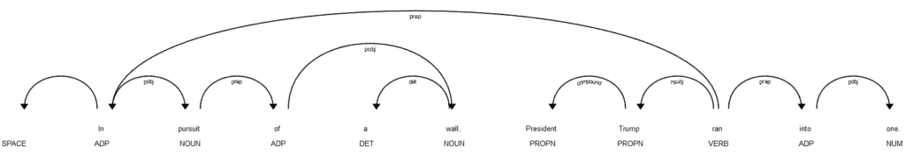
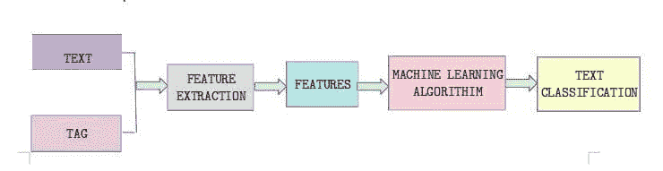
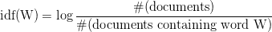

# 教程:使用 spaCy 在 Python 中进行文本分类

> 原文：<https://www.dataquest.io/blog/tutorial-text-classification-in-python-using-spacy/>

April 16, 2019

文本是极其丰富的信息来源。每*分钟*，人们向[发送数以亿计的新邮件和短信](https://www.forbes.com/sites/bernardmarr/2018/05/21/how-much-data-do-we-create-every-day-the-mind-blowing-stats-everyone-should-read/#5a9a25a460ba)。有一个名副其实的文本数据山等待挖掘的洞察力。但是，想要从所有这些文本数据中收集意义的数据科学家面临着一个挑战:因为文本数据以非结构化的形式存在，所以很难分析和处理。

在本教程中，我们将看看如何使用有用的 Python 包`spaCy` ( [文档](https://spacy.io/))将所有非结构化文本数据转换成对分析和自然语言处理更有用的东西。

一旦我们做到了这一点，我们将能够从文本数据中获得有意义的模式和主题。这在各种数据科学应用中非常有用:垃圾邮件过滤、支持票、社交媒体分析、上下文广告、查看客户反馈等等。

具体来说，我们将对自然语言处理(NLP)进行高级研究。然后，我们将使用`spaCy`完成一些清理和分析文本数据的重要基本操作。然后我们将深入到文本分类，具体是逻辑回归分类，使用一些真实世界的数据(亚马逊的 Alexa 智能家居音箱的文本评论)。

## 什么是自然语言处理？

自然语言处理(NLP)是机器学习的一个分支，它处理、分析，有时生成人类语音(“自然语言”)。

毫无疑问，在确定一串文本的含义方面，人类仍然比机器好得多。但是在数据科学中，我们经常会遇到数据集太大，人类无法在合理的时间内进行分析。我们还可能遇到没有人可以分析和响应一段文本输入的情况。在这些情况下，我们可以使用自然语言处理技术来帮助机器理解文本的含义(如果有必要，做出相应的响应)。

例如，自然语言处理被广泛用于情感分析，因为分析师经常试图从大量文本数据中确定整体情感，这对人类来说是耗时的。它也用于广告匹配——确定文本主体的主题，并自动分配相关的广告。它被用于聊天机器人、语音助手和其他应用程序，在这些应用程序中，机器需要理解并快速响应以自然人类语言形式出现的输入。

## 用`spaCy`分析和处理文本

`spaCy`是一个针对 Python 的开源自然语言处理库。它是专门为生产使用而设计的，它可以帮助我们构建高效处理大量文本的应用程序。首先，让我们看看`spaCy`可以处理的一些基本分析任务。

#### 安装`spaCy`

在继续下一步之前，我们需要安装`spaCy`和它的英语模型。我们可以使用以下命令行命令来实现这一点:

`pip install spacy`

`python -m spacy download en`

我们也可以在 Juypter 笔记本中使用`spaCy`。不过，它不是 Jupyter 默认包含的预安装库之一，所以我们需要从笔记本上运行这些命令，将`spaCy`安装到正确的 Anaconda 目录中。请注意，我们在每个命令前面使用了`!`,以让 Jupyter 笔记本知道它应该作为命令行命令来阅读。

`!pip install spacy`

`!python -m spacy download en`

#### 对文本进行标记

标记化是将文本分成称为标记的片段，并忽略标点符号(，)等字符的过程。“’”和空格。`spaCy`的记号赋予器接受 unicode 文本形式的输入，并输出一系列记号对象。

让我们看一个简单的例子。假设我们有下面的文本，我们想把它标记出来:

> 学习数据科学的时候，不要气馁。
> 
> 挑战和挫折不是失败，它们只是旅程的一部分。

有几种不同的方法可以解决这个问题。第一种叫做**单词标记化**，意思是把文本分解成单个的单词。对于许多语言处理应用程序来说，这是一个关键步骤，因为它们通常需要以单个单词的形式输入，而不是较长的文本字符串。

在下面的代码中，我们将导入`spaCy`及其英语语言模型，并告诉它我们将使用该模型进行自然语言处理。然后我们将我们的文本字符串分配给`text`。使用`nlp(text)`，我们将处理`spaCy`中的文本，并将结果赋给一个名为`my_doc`的变量。

此时，我们的文本已经被标记化了，但是`spaCy`将标记化的文本存储为一个文档，我们希望以列表的形式查看它，所以我们将创建一个`for`循环来遍历我们的文档，将它在我们的文本字符串中找到的每个单词标记添加到一个名为`token_list`的列表中，这样我们可以更好地了解单词是如何被标记化的。

```
# Word tokenization
from spacy.lang.en import English

# Load English tokenizer, tagger, parser, NER and word vectors
nlp = English()

text = """When learning data science, you shouldn't get discouraged!
Challenges and setbacks aren't failures, they're just part of the journey. You've got this!"""

#  "nlp" Object is used to create documents with linguistic annotations.
my_doc = nlp(text)

# Create list of word tokens
token_list = []
for token in my_doc:
    token_list.append(token.text)
print(token_list) 
```

```
['When', 'learning', 'data', 'science', ',', 'you', 'should', "n't", 'get', 'discouraged', '!', '\n', 'Challenges', 'and', 'setbacks', 'are', "n't", 'failures', ',', 'they', "'re", 'just', 'part', 'of', 'the', 'journey', '.', 'You', "'ve", 'got', 'this', '!'] 
```

正如我们所见，`spaCy`生成了一个列表，其中包含了作为单独项目的每个令牌。请注意，它已经认识到像*这样的缩写不应该是*实际上代表两个不同的单词，因此它将它们分解成两个不同的标记。

首先，我们需要加载语言词典，在一个简单的例子中，我们使用 english()类加载英语词典并创建 nlp nlp 对象。“nlp”对象用于创建带有语言注释和各种 nlp 属性的文档。创建文档后，我们正在创建令牌列表。

如果我们愿意，我们也可以把文章分成句子而不是单词。这叫做**句子标记化**。在执行句子标记化时，标记化器会查找位于句子之间的特定字符，如句点、感叹号和换行符。对于句子标记化，我们将使用预处理管道，因为使用`spaCy`的句子预处理包括一个标记器、一个标记器、一个解析器和一个实体识别器，我们需要访问它们来正确识别什么是句子，什么不是。

在下面的代码中，`spaCy`标记文本并创建一个 Doc 对象。这个 Doc 对象使用我们的预处理管道的组件标记器、解析器和实体识别器将文本分解成组件。从这个管道中，我们可以提取任何组件，但是这里我们将使用`sentencizer`组件来访问句子标记。

```
# sentence tokenization

# Load English tokenizer, tagger, parser, NER and word vectors
nlp = English()

# Create the pipeline 'sentencizer' component
sbd = nlp.create_pipe('sentencizer')   

# Add the component to the pipeline
nlp.add_pipe(sbd)

text = """When learning data science, you shouldn't get discouraged!
Challenges and setbacks aren't failures, they're just part of the journey. You've got this!"""

#  "nlp" Object is used to create documents with linguistic annotations.
doc = nlp(text)

# create list of sentence tokens
sents_list = []
for sent in doc.sents:
    sents_list.append(sent.text)
print(sents_list) 
```

```
["When learning data science, you shouldn't get discouraged!", "\nChallenges and setbacks aren't failures, they're just part of the journey.", "You've got this!"] 
```

同样，`spaCy`已经正确地将文本解析成我们想要的格式，这次输出了在源文本中找到的句子列表。

## 清除文本数据:删除停用字词

我们处理的大多数文本数据都会包含很多对我们实际上没用的单词。这些词被称为**停用词**，在人类的言语中很有用，但对数据分析没有太大贡献。删除停用词有助于我们消除文本数据中的噪音和干扰，还可以加快分析时间(因为需要处理的单词更少)。

让我们看看默认情况下包含的停用词`spaCy`。我们将导入`spaCy`并将它的英语语言模型中的停用词赋给一个名为`spacy_stopwords`的变量，这样我们就可以看一看了。

```
#Stop words
#importing stop words from English language.
import spacy
spacy_stopwords = spacy.lang.en.stop_words.STOP_WORDS

#Printing the total number of stop words:
print('Number of stop words: %d' % len(spacy_stopwords))

#Printing first ten stop words:
print('First ten stop words: %s' % list(spacy_stopwords)[:20]) 
```

```
Number of stop words: 312
First ten stop words: ['was', 'various', 'fifty', "'s", 'used', 'once', 'because', 'himself', 'can', 'name', 'many', 'seems', 'others', 'something', 'anyhow', 'nowhere', 'serious', 'forty', 'he', 'now'] 
```

我们可以看到，`spaCy`的默认停用词列表总共包括 312 个条目，每个条目都是一个单词。我们也可以看到为什么这些词对数据分析没有用。然而，像*这样的过渡词，例如*，对于理解一个句子的基本意思并不是必要的。另外，像*某人*这样的词太模糊了，对自然语言处理任务没有多大用处。

如果我们愿意，我们也可以创建自己的[自定义停用词列表](https://spacy.io/usage/adding-languages/#stop-words)。但是对于我们在本教程中的目的来说，`spaCy`提供的默认列表就可以了。

#### 从数据中删除停用词

现在我们已经有了停用词列表，让我们用它从上一节中处理的文本字符串中删除停用词。我们的文本已经存储在变量`text`中，所以我们不需要再次定义它。

相反，我们将创建一个名为`filtered_sent`的空列表，然后遍历我们的`doc`变量，查看源文本中的每个标记化单词。`spaCy`包括一堆[有用的令牌属性](https://spacy.io/usage/rule-based-matching/#adding-patterns-attributes)，我们将使用其中一个名为`is_stop`的属性来识别*不在停用词表*中的单词，然后将它们添加到我们的`filtered_sent`列表中。

```
from spacy.lang.en.stop_words import STOP_WORDS

#Implementation of stop words:
filtered_sent=[]

#  "nlp" Object is used to create documents with linguistic annotations.
doc = nlp(text)

# filtering stop words
for word in doc:
    if word.is_stop==False:
        filtered_sent.append(word)
print("Filtered Sentence:",filtered_sent) 
```

```
Filtered Sentence: [learning, data, science, ,, discouraged, !,
, Challenges, setbacks, failures, ,, journey, ., got, !] 
```

不难看出为什么停用词会有帮助。删除它们将我们的原文浓缩为几个词，让我们很好地了解句子在讨论什么:学习数据科学，以及在这个过程中阻止挑战和挫折。

## 词汇规范化

词典规范化是文本数据清理过程中的另一个步骤。总的来说，归一化将高维特征转换成适合任何机器学习模型的低维特征。出于我们的目的，我们只看一下**词汇化**，这是一种处理单词的方法，它将单词简化为它们的根。

#### 词汇化

词汇化是一种处理这样一个事实的方式，即像*连接*、*连接*、*连接*、*连接*等等。并不完全相同，都有相同的本质意义:*连接*。拼写上的差异在口语中有语法功能，但对于机器处理来说，这些差异可能会令人困惑，所以我们需要一种方法来将单词 *connect* 的*形式的所有单词都变成单词 *connect* 本身。*

一种方法叫做**词干**。词干包括简单地删除容易识别的前缀和后缀，以产生一个词的最简单版本。例如，*连接*将去掉 *-ion* 后缀，并正确地简化为*连接*。这种简单的词干处理通常是所需要的，但是词汇化(lemmatization)——实际上是查看字典中描述的单词及其词根(称为*lemma*)——更精确(只要单词存在于字典中)。

由于`spaCy`包含了一种将单词分解成其*词条*的内置方式，我们可以简单地使用它来进行词条化。在下面这个非常简单的例子中，我们将使用`.lemma_`来产生我们正在分析的每个单词的词条。

```
# Implementing lemmatization
lem = nlp("run runs running runner")
# finding lemma for each word
for word in lem:
    print(word.text,word.lemma_) 
```

```
run run
runs run
running run
runner runner 
```

## 词性标注

一个单词的**词性**定义了它在句子中的功能。例如，一个名词表示一个物体。形容词描述一个物体。动词描述动作。在句子的上下文中识别和标注每个单词的词性称为词性标注，或称词性标注。

让我们用`spaCy`来尝试一些词性标注吧！我们需要导入它的`en_core_web_sm`模型，因为它包含进行分析所需的字典和语法信息。然后我们需要做的就是用`.load()`加载这个模型，并遍历我们新的`docs`变量，使用`.pos_`识别每个单词的词性。

(注意`u"All is well that ends well."`中的 *u* 表示该字符串是 Unicode 字符串。)

```
# POS tagging

# importing the model en_core_web_sm of English for vocabluary, syntax & entities
import en_core_web_sm

# load en_core_web_sm of English for vocabluary, syntax & entities
nlp = en_core_web_sm.load()

#  "nlp" Objectis used to create documents with linguistic annotations.
docs = nlp(u"All is well that ends well.")

for word in docs:
    print(word.text,word.pos_) 
```

```
All DET
is VERB
well ADV
that DET
ends VERB
well ADV
. PUNCT 
```

万岁！已经正确识别了这个句子中每个单词的词性。能够识别词性在各种 NLP 相关的上下文中是有用的，因为它有助于更准确地理解输入句子和更准确地构造输出响应。

## 实体检测

**实体检测**，也称为实体识别，是一种更高级的语言处理形式，可以识别输入文本字符串中的重要元素，如地点、人员、组织和语言。这对于从文本中快速提取信息非常有帮助，因为你可以快速挑选出重要的主题或识别文本的关键部分。

让我们使用华盛顿邮报最近的文章[中的几段来尝试一些实体检测。我们将使用`.label`为文本中检测到的每个实体获取一个标签，然后我们将使用`spaCy`的`displaCy`可视化工具以更直观的格式查看这些实体。](https://www.washingtonpost.com/health/2019/04/09/new-york-orders-measles-vaccinations-brooklyn-amid-outbreak-mayor-says/)

```
#for visualization of Entity detection importing displacy from spacy:

from spacy import displacy

nytimes= nlp(u"""New York City on Tuesday declared a public health emergency and ordered mandatory measles vaccinations amid an outbreak, becoming the latest national flash point over refusals to inoculate against dangerous diseases.

At least 285 people have contracted measles in the city since September, mostly in Brooklyn’s Williamsburg neighborhood. The order covers four Zip codes there, Mayor Bill de Blasio (D) said Tuesday.

The mandate orders all unvaccinated people in the area, including a concentration of Orthodox Jews, to receive inoculations, including for children as young as 6 months old. Anyone who resists could be fined up to $1,000.""")

entities=[(i, i.label_, i.label) for i in nytimes.ents]
entities 
```

```
[(New York City, 'GPE', 384),
 (Tuesday, 'DATE', 391),
 (At least 285, 'CARDINAL', 397),
 (September, 'DATE', 391),
 (Brooklyn, 'GPE', 384),
 (Williamsburg, 'GPE', 384),
 (four, 'CARDINAL', 397),
 (Bill de Blasio, 'PERSON', 380),
 (Tuesday, 'DATE', 391),
 (Orthodox Jews, 'NORP', 381),
 (6 months old, 'DATE', 391),
 (up to $1,000, 'MONEY', 394)] 
```

使用这种技术，我们可以识别文本中的各种实体。`spaCy`文档为[提供了支持的实体类型](https://spacy.io/api/annotation#named-entities)的完整列表，从上面的简短示例中我们可以看到，它能够识别各种不同的实体类型，包括特定位置(`GPE`)、日期相关的单词(`DATE`)、重要数字(`CARDINAL`)、特定个人(`PERSON`)等。

使用`displaCy`,我们还可以可视化我们的输入文本，用颜色突出显示每个被识别的实体并贴上标签。我们将使用`style = "ent"`告诉`displaCy`我们想要在这里可视化实体。

```
displacy.render(nytimes, style = "ent",jupyter = True) 
```

New York City GPE on Tuesday DATE declared a public health emergency and ordered mandatory measles vaccinations amid an outbreak, becoming the latest national flash point over refusals to inoculate against dangerous diseases. At least 285 CARDINAL people have contracted measles in the city since September DATE , mostly in Brooklyn GPE ’s Williamsburg GPE neighborhood. The order covers four CARDINAL Zip codes there, Mayor Bill de Blasio PERSON (D) said Tuesday DATE .The mandate orders all unvaccinated people in the area, including a concentration of Orthodox Jews NORP , to receive inoculations, including for children as young as 6 months old DATE . Anyone who resists could be fined up to $1,000 MONEY .

## 依存句法分析

**依存解析**是一种语言处理技术，它允许我们通过分析句子的结构来确定各个单词之间的关系，从而更好地确定句子的意思。

例如，考虑句子“比尔扔球”我们有两个名词(比尔和球)和一个动词(投掷)。但是不能单个看这几个字，不然最后可能会以为球在扔比尔！为了正确理解句子，我们需要看词序和句子结构，而不仅仅是单词及其词性。

这样做相当复杂，但谢天谢地`spaCy`会替我们处理这项工作！下面，我们再给`spaCy`一个从新闻标题中拉出来的短句。然后我们将使用另一个名为`noun_chunks`的`spaCy`，它将输入分解为名词和描述它们的单词，并遍历我们的源文本中的每个块，识别单词、其词根、其依存标识以及它属于哪个块。

```
docp = nlp (" In pursuit of a wall, President Trump ran into one.")

for chunk in docp.noun_chunks:
   print(chunk.text, chunk.root.text, chunk.root.dep_,
          chunk.root.head.text) 
```

```
pursuit pursuit pobj In
a wall wall pobj of
President Trump Trump nsubj ran 
```

这个输出可能有点难以理解，但是因为我们已经导入了`displaCy`可视化工具，我们可以用它来查看使用`style = "dep"`的依赖关系图，这样更容易理解:

```
displacy.render(docp, style="dep", jupyter= True) 
```

<figure id="attachment_14927" aria-labelledby="figcaption_attachment_14927" class="wp-caption aligncenter">[](https://www.dataquest.io/wp-content/uploads/2019/04/text-expressions-python-chart-1.png)

<figcaption id="figcaption_attachment_14927" class="wp-caption-text">Click to expand</figcaption>

</figure>

当然，我们也可以查看`spaCy`的[文档中关于依存解析](https://spacy.io/api/annotation#dependency-parsing)的内容，以便更好地理解根据每个句子的解释，可能会应用到我们文本中的不同标签。

## 词向量表示法

当我们单独看单词时，机器很难理解人类能够立即理解的联系。例如，*引擎*和*汽车*看起来似乎有明显的联系(汽车使用引擎运行)，但这种联系对计算机来说并不明显。

令人欣慰的是，我们有一种方法可以表达更多的这类联系。一个**单词向量**是一个单词的数字表示，它表示该单词与其他单词的关系。

每个单词都被解释为一个唯一的长数组。你可以把这些数字想象成类似 GPS 坐标的东西。GPS 坐标由两个数字组成(纬度和经度)，如果我们看到两组在数字上彼此接近的 GPS 坐标(如 43，-70 和 44，-70)，我们就会知道这两个位置相对接近。单词向量的工作方式类似，尽管每个单词有两个以上的坐标，所以人类很难看到它们。

使用`spaCy`的`en_core_web_sm`模型，让我们看看一个单词的向量的长度，以及使用`.vector`和`.shape`的向量是什么样子。

```
import en_core_web_sm
nlp = en_core_web_sm.load()
mango = nlp(u'mango')
print(mango.vector.shape)
print(mango.vector) 
```

```
(96,)
[ 1.0466383  -1.5323697  -0.72177905 -2.4700649  -0.2715162   1.1589639
  1.7113379  -0.31615403 -2.0978343   1.837553    1.4681302   2.728043
 -2.3457408  -5.17184    -4.6110015  -0.21236466 -0.3029521   4.220028
 -0.6813917   2.4016762  -1.9546705  -0.85086954  1.2456163   1.5107994
  0.4684736   3.1612053   0.15542296  2.0598564   3.780035    4.6110964
  0.6375268  -1.078107   -0.96647096 -1.3939928  -0.56914186  0.51434743
  2.3150034  -0.93199825 -2.7970662  -0.8540115  -3.4250052   4.2857723
  2.5058174  -2.2150877   0.7860181   3.496335   -0.62606215 -2.0213525
 -4.47421     1.6821622  -6.0789204   0.22800982 -0.36950028 -4.5340714
 -1.7978683  -2.080299    4.125556    3.1852438  -3.286446    1.0892276
  1.017115    1.2736416  -0.10613725  3.5102775   1.1902348   0.05483437
 -0.06298041  0.8280688   0.05514218  0.94817173 -0.49377063  1.1512338
 -0.81374085 -1.6104267   1.8233354  -2.278403   -2.1321895   0.3029334
 -1.4510616  -1.0584296  -3.5698352  -0.13046083 -0.2668339   1.7826645
  0.4639858  -0.8389523  -0.02689964  2.316218    5.8155413  -0.45935947
  4.368636    1.6603007  -3.1823301  -1.4959551  -0.5229269   1.3637555 ] 
```

人类不可能看到那个数组并识别出它的意思是“mango”，但这种表示单词的方式对机器来说很好，因为它允许我们使用数组中的坐标来表示单词的意思及其与其他类似单词的“接近度”。

## 文本分类

既然我们已经看了一些`spaCy`可以做的很酷的事情，让我们看看这些自然语言处理技术的一个更大的真实世界的应用:**文本分类**。很多时候，我们可能会发现自己有一组文本数据，我们希望根据一些参数(例如，可能是每个片段的主题)进行分类，文本分类将帮助我们做到这一点。

下图展示了我们在对文本进行分类时想要做的事情。首先，我们从源文本(以及它附带的任何标签或元数据)中提取我们想要的特征，然后我们将清理后的数据输入机器学习算法，该算法为我们进行分类。



#### 导入库

我们将从导入这个任务所需的库开始。我们已经导入了`spaCy`，但是我们还需要`pandas`和`scikit-learn`来帮助我们的分析。

```
import pandas as pd
from sklearn.feature_extraction.text import CountVectorizer,TfidfVectorizer
from sklearn.base import TransformerMixin
from sklearn.pipeline import Pipeline 
```

#### 加载数据

上面，我们已经看了一些用`spaCy`进行文本分析的简单例子，但是现在我们将使用`scikit-learn`进行一些逻辑回归分类。为了更加真实，我们将使用真实世界的数据集— [这组亚马逊 Alexa 产品评论](https://www.kaggle.com/sid321axn/amazon-alexa-reviews)。

这个数据集以制表符分隔文件的形式出现。tsv)。它有五列:`rating`、`date`、`variation`、`verified_reviews`、`feedback`。

`rating`表示每个用户给 Alexa 的评分(满分 5 分)。`date`表示评审日期，`variation`描述用户评审的模型。`verified_reviews`包含每条评论的文字，`feedback`包含一个情绪标签，1 表示正面情绪(用户喜欢)，0 表示负面情绪(用户不喜欢)。

该数据集包含消费者对亚马逊 Alexa 产品的评论，如 Echos、Echo Dots、Alexa Firesticks 等。我们要做的是开发一个分类模型，它查看评论文本并预测评论是正面还是负面。由于这个数据集已经在`feedback`列中包含了评论是正面还是负面，我们可以使用这些答案来训练和测试我们的模型。我们的目标是生成一个准确的模型，然后我们可以用它来处理*新的*用户评论，并快速确定它们是正面的还是负面的。

让我们首先将数据读入一个`pandas`数据帧，然后使用 pandas 的内置函数来帮助我们更仔细地查看我们的数据。

```
# Loading TSV file
df_amazon = pd.read_csv ("datasets/amazon_alexa.tsv", sep="\t") 
```

```
# Top 5 records
df_amazon.head() 
```

|  | 等级 | 日期 | 变化 | 已验证 _ 评论 | 反馈 |
| --- | --- | --- | --- | --- | --- |
| Zero | five | 2018 年 7 月 31 日 | 木炭织物 | 爱我的回声！ | one |
| one | five | 2018 年 7 月 31 日 | 木炭织物 | 爱死了。 | one |
| Two | four | 2018 年 7 月 31 日 | 胡桃木饰面 | 有时候在玩游戏的时候，你可以回答… | one |
| three | five | 2018 年 7 月 31 日 | 木炭织物 | 我从这件事情中获得了很多乐趣。我的 4 … | one |
| four | five | 2018 年 7 月 31 日 | 木炭织物 | 音乐 | one |

```
# shape of dataframe
df_amazon.shape 
```

```
(3150, 5) 
```

```
# View data information
df_amazon.info() 
```

```
<class 'pandas.core.frame.DataFrame'>
RangeIndex: 3150 entries, 0 to 3149
Data columns (total 5 columns):
rating              3150 non-null int64
date                3150 non-null object
variation           3150 non-null object
verified_reviews    3150 non-null object
feedback            3150 non-null int64
dtypes: int64(2), object(3)
memory usage: 123.1+ KB 
```

```
# Feedback Value count
df_amazon.feedback.value_counts() 
```

```
1    2893
0     257
Name: feedback, dtype: int64 
```

#### 用`spaCy`标记数据

现在我们知道了我们在做什么，让我们使用`spaCy`创建一个定制的记号赋予器函数。我们将使用这个功能从每个评论中自动删除我们不需要的信息，比如停用词和标点符号。

我们将首先从`spaCy`导入我们需要的英文模型，以及 Python 的`string`模块，它包含了我们可以在`string.punctuation`中使用的所有标点符号的有用列表。我们将创建包含我们想要删除的标点符号和停用词的变量，以及一个通过`spaCy`的英语模块运行输入的解析器。

然后，我们将创建一个`spacy_tokenizer()`函数，它接受一个句子作为输入，并将该句子处理成记号，执行词汇化、小写和删除停用词。这类似于我们在本教程前面的例子中所做的，但是现在我们把它们放在一个函数中，用于预处理我们正在分析的每个用户评论。

```
import string
from spacy.lang.en.stop_words import STOP_WORDS
from spacy.lang.en import English

# Create our list of punctuation marks
punctuations = string.punctuation

# Create our list of stopwords
nlp = spacy.load('en')
stop_words = spacy.lang.en.stop_words.STOP_WORDS

# Load English tokenizer, tagger, parser, NER and word vectors
parser = English()

# Creating our tokenizer function
def spacy_tokenizer(sentence):
    # Creating our token object, which is used to create documents with linguistic annotations.
    mytokens = parser(sentence)

    # Lemmatizing each token and converting each token into lowercase
    mytokens = [ word.lemma_.lower().strip() if word.lemma_ != "-PRON-" else word.lower_ for word in mytokens ]

    # Removing stop words
    mytokens = [ word for word in mytokens if word not in stop_words and word not in punctuations ]

    # return preprocessed list of tokens
    return mytokens 
```

#### 定义自定义转换器

为了进一步清理我们的文本数据，我们还想创建一个自定义的转换器来删除起始和结束空格，并将文本转换成小写。这里，我们将创建一个自定义的`predictors`类，它继承了 TransformerMixin 类。该类覆盖 transform、fit 和 get_parrams 方法。我们还将创建一个`clean_text()`函数，删除空格并将文本转换成小写。

```
# Custom transformer using spaCy
class predictors(TransformerMixin):
    def transform(self, X, **transform_params):
        # Cleaning Text
        return [clean_text(text) for text in X]

    def fit(self, X, y=None, **fit_params):
        return self

    def get_params(self, deep=True):
        return {}

# Basic function to clean the text
def clean_text(text):     
    # Removing spaces and converting text into lowercase
    return text.strip().lower() 
```

#### 矢量化特征工程(TF-IDF)

当我们对文本进行分类时，我们最终会得到与各自标签相匹配的文本片段。但是我们不能简单地在我们的机器学习模型中使用文本字符串；我们需要一种方法将我们的文本转换成可以用数字表示的东西，就像标签一样(1 代表积极，0 代表消极)。将文本分为正面和负面标签称为情感分析。所以我们需要一种用数字表示文本的方法。

我们可以使用的一个工具叫做**单词包**。BoW 将文本转换成给定文档中单词出现的矩阵。它关注给定的单词是否出现在文档中，并生成一个矩阵，我们可能会看到它被称为 BoW 矩阵或文档术语矩阵。

我们可以通过使用`scikit-learn`的[计数矢量器](https://scikit-learn.org/stable/modules/generated/sklearn.feature_extraction.text.CountVectorizer.html)为我们的文本数据生成一个弓形矩阵。在下面的代码中，我们告诉`CountVectorizer`使用我们构建的自定义`spacy_tokenizer`函数作为它的标记器，并定义我们想要的 ngram 范围。

n 元语法是给定文本中相邻单词的组合，其中 *n* 是记号中包含的单词数。比如在句子“2022 年足球世界杯谁会赢？” *unigrams* 是一系列单词，比如“谁”、“威尔”、“赢”等等。*二元模型*将是两个连续单词的序列，例如“谁将会”、“将会赢”等等。因此，我们将在下面的代码中使用的`ngram_range`参数设置了我们的 ngrams 的下限和上限(我们将使用 unigrams)。然后我们将把 ngrams 分配给`bow_vector`。

```
bow_vector = CountVectorizer(tokenizer = spacy_tokenizer, ngram_range=(1,1)) 
```

我们还想看看我们的术语的 **TF-IDF(术语频率-逆文档频率)**。这听起来很复杂，但这只是通过将每个单词的频率与文档频率进行比较来标准化我们的单词包(BoW)的一种方式。换句话说，这是一种表示特定术语在给定文档的上下文中有多重要的方式，基于该术语出现的次数以及该术语在其他文档中出现的次数。TF-IDF 越高，该术语对该文档越重要。

我们可以用下面的数学公式来表示:



当然，我们不必手动计算！我们可以使用`scikit-learn`的 TfidfVectorizer 自动生成 TF-IDF。同样，我们将告诉它使用我们用`spaCy`构建的自定义标记器，然后我们将结果赋给变量`tfidf_vector`。

```
tfidf_vector = TfidfVectorizer(tokenizer = spacy_tokenizer) 
```

#### 将数据分为训练集和测试集

我们试图建立一个分类模型，但我们需要一种方法来了解它实际上是如何执行的。将数据集分为训练集和测试集是一种行之有效的方法。我们将使用一半的数据集作为我们的训练集，其中将包括正确的答案。然后，我们将使用数据集*的另一半来测试我们的模型，而不需要*给出答案，看看它的表现有多准确。

为了方便起见，`scikit-learn`为我们提供了一个内置函数:`train_test_split()`。我们只需要告诉它我们希望它分割的特性集(`X`)、我们希望它测试的标签(`ylabels`)以及我们希望用于测试集的大小(以十进制形式表示为百分比)。

```
from sklearn.model_selection import train_test_split

X = df_amazon['verified_reviews'] # the features we want to analyze
ylabels = df_amazon['feedback'] # the labels, or answers, we want to test against

X_train, X_test, y_train, y_test = train_test_split(X, ylabels, test_size=0.3) 
```

#### 创建管线并生成模型

现在我们都设置好了，是时候实际构建我们的模型了！我们将从导入`LogisticRegression`模块并创建一个 LogisticRegression 分类器对象开始。

然后，我们将创建一个包含三个组件的管道:一个清理器、一个矢量器和一个分类器。清理器使用我们的`predictors`类对象来清理和预处理文本。矢量器使用 countvector 对象为我们的文本创建单词包矩阵。分类器是执行逻辑回归以分类情感的对象。

一旦这个管道建立起来，我们将使用`fit()`来安装管道组件。

```
# Logistic Regression Classifier
from sklearn.linear_model import LogisticRegression
classifier = LogisticRegression()

# Create pipeline using Bag of Words
pipe = Pipeline([("cleaner", predictors()),
                 ('vectorizer', bow_vector),
                 ('classifier', classifier)])

# model generation
pipe.fit(X_train,y_train) 
```

```
Pipeline(memory=None,
     steps=[('cleaner', <__main__.predictors object at 0x00000254DA6F8940>), ('vectorizer', CountVectorizer(analyzer='word', binary=False, decode_error='strict',
        dtype=<class 'numpy.int64'>, encoding='utf-8', input='content',
        lowercase=True, max_df=1.0, max_features=None, min_df=1,
      ...ty='l2', random_state=None, solver='liblinear', tol=0.0001,
          verbose=0, warm_start=False))]) 
```

#### 评估模型

让我们来看看我们的模型实际表现如何！我们可以使用来自`scikit-learn`的`metrics`模块来完成这项工作。既然我们已经训练了我们的模型，我们将通过管道输入我们的测试数据，以得出预测。然后，我们将使用`metrics`模块的各种功能来查看我们的模型的准确度、精确度和召回率。

*   [准确性](https://scikit-learn.org/stable/modules/generated/sklearn.metrics.accuracy_score.html#sklearn.metrics.accuracy_score)是指我们的模型做出的完全正确的总预测的百分比。
*   [Precision](https://scikit-learn.org/stable/modules/generated/sklearn.metrics.precision_score.html#sklearn.metrics.precision_score) 描述了我们预测中真阳性与真阳性加假阳性的比率。
*   [Recall](https://scikit-learn.org/stable/modules/generated/sklearn.metrics.recall_score.html#sklearn.metrics.recall_score) 描述了我们预测中的真阳性与真阳性加假阴性的比率。

上面的文档链接提供了每个术语的更多细节和更精确的定义，但底线是所有三个指标都是从 0 到 1 测量的，其中 1 表示预测完全正确。因此，我们的模型的分数越接近 1 越好。

```
from sklearn import metrics
# Predicting with a test dataset
predicted = pipe.predict(X_test)

# Model Accuracy
print("Logistic Regression Accuracy:",metrics.accuracy_score(y_test, predicted))
print("Logistic Regression Precision:",metrics.precision_score(y_test, predicted))
print("Logistic Regression Recall:",metrics.recall_score(y_test, predicted)) 
```

```
Logistic Regression Accuracy: 0.9417989417989417
Logistic Regression Precision: 0.9528508771929824
Logistic Regression Recall: 0.9863791146424518 
```

换句话说，总的来说，我们的模型在 94.1%的时候正确识别了评论的情感。当它预测一个评论是正面的时候，那个评论实际上 95%的时候都是正面的。当被给予正面评价时，我们的模型在 98.6%的情况下将其识别为正面的

## 资源和后续步骤

在本教程的过程中，我们已经从使用`spaCy`执行一些非常简单的文本分析操作，到使用`scikit-learn`构建我们自己的机器学习模型。当然，这仅仅是开始，还有很多东西`spaCy`和`scikit-learn`可以提供给 Python 数据科学家。

以下是一些有用资源的链接:

*   [Dataquest 关于 Python 中线性回归的机器学习课程](https://www.dataquest.io/course/linear-regression-for-machine-learning/)；许多其他机器学习课程也可以在[我们的数据科学家之路](https://www.dataquest.io/path/data-scientist/)中找到。

## 用正确的方法学习 Python。

从第一天开始，就在你的浏览器窗口中通过编写 Python 代码来学习 Python。这是学习 Python 的最佳方式——亲自看看我们 60 多门免费课程中的一门。


[尝试数据任务](https://app.dataquest.io/signup)