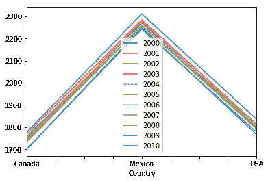
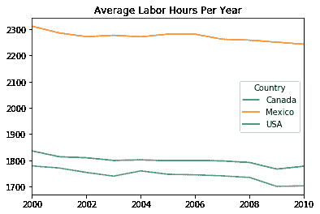
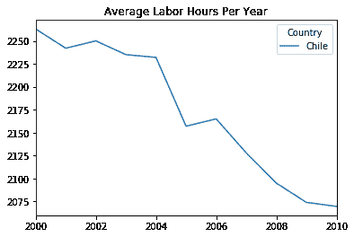
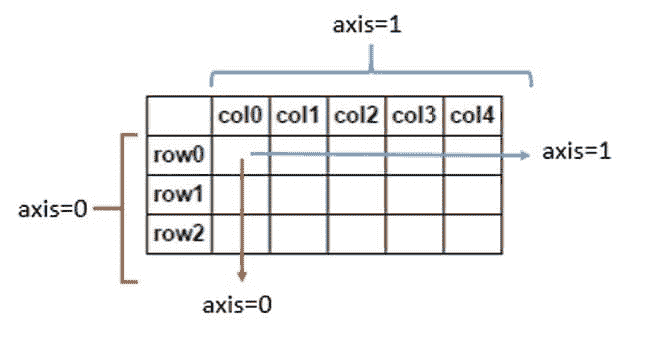
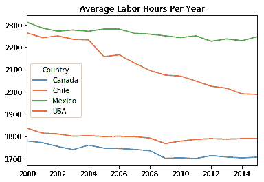
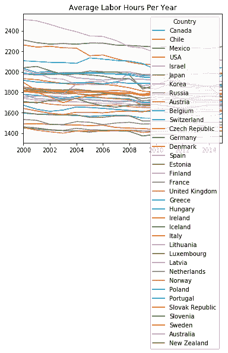
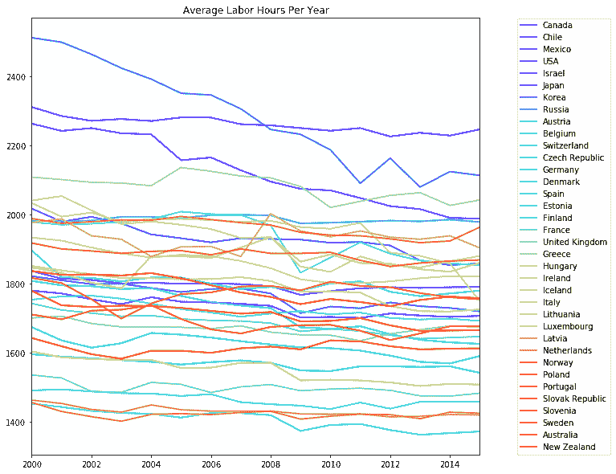

# 教程:用 Pandas 和 Python 连接(组合数据表)

> 原文：<https://www.dataquest.io/blog/pandas-concatenation-tutorial/>

December 13, 2017

您很难找到不需要连接(将多个数据源组合在一起)的数据科学项目。很多时候，数据分析需要向表中追加新行，拉入额外的列，或者在更复杂的情况下，在一个公共键上合并不同的表。所有这些技巧都可以放在你的口袋里，这样不同的数据源就不会妨碍你的分析了！

在这个连接教程中，我们将介绍几种使用 pandas 合并数据的方法。它面向初级到中级水平，需要熊猫数据框架的基础知识。之前对 SQL 和关系数据库的一些了解也会派上用场，但不是必需的。我们将通过四种不同的技术(连接、追加、合并和连接)来分析几个国家的年平均劳动时间。我们还将在每一步之后创建一个图，以便直观地了解每种数据组合技术产生的不同结果。作为奖励，你将带着对全球劳动力趋势的深刻见解离开本教程，还有一组漂亮的图表可以添加到你的投资组合中！

我们将在经济合作与发展组织(经合组织)发挥宏观经济分析师的作用。我们试图回答的问题简单而有趣:哪些国家的公民工作时间最长，这些趋势如何随着时间的推移而变化？不幸的是，经合组织一直在分别收集不同大洲和不同时期的数据。我们的工作是首先将所有数据集中到一个地方，这样我们就可以进行必要的分析。

## 访问数据集

[在此下载教程数据文件](https://dq-blog-files.s3.amazonaws.com/PandasConcatTutorial.zip)

我们将使用来自[经合组织就业和劳动力市场统计数据库](https://dx.doi.org/10.1787/data-00303-en)的数据，该数据库提供了自 1950 年以来大多数发达国家的年均劳动时间数据。在整个教程中，我将交替使用数据帧和表格。我们将在 Python 3 中使用一个 Jupyter 笔记本(欢迎您使用任何 IDE(集成开发环境),但是本教程在 Jupyter 中是最容易理解的)。一旦启动，让我们导入`pandas`和`matplotlib`库，然后使用`%matplotlb inline`以便 Jupyter 知道在笔记本单元格内显示图形。如果我提到的任何工具听起来不熟悉，我建议看看 [Dataquest 的入门指南](https://www.dataquest.io/blog/python-data-science/)。

```
 import pandas as pd
import matplotlib.pyplot as plt 
```

接下来，我们将使用`pd.read_csv()`函数打开前两个数据文件。我们将通过传递参数`index_col=0`来指定第一列应该用作行索引。最后，我们将展示我们的初始表的样子。

```
 north_america = pd.read_csv('./north_america_2000_2010.csv', index_col=0)
south_america = pd.read_csv('./south_america_2000_2010.csv', index_col=0) 
```

```
 north_america 
```

|  | Two thousand | Two thousand and one | Two thousand and two | Two thousand and three | Two thousand and four | Two thousand and five | Two thousand and six | Two thousand and seven | Two thousand and eight | Two thousand and nine | Two thousand and ten |
| --- | --- | --- | --- | --- | --- | --- | --- | --- | --- | --- | --- |
| 国家 |  |  |  |  |  |  |  |  |  |  |  |
| --- | --- | --- | --- | --- | --- | --- | --- | --- | --- | --- | --- |
| 加拿大 | One thousand seven hundred and seventy-nine | One thousand seven hundred and seventy-one | One thousand seven hundred and fifty-four | One thousand seven hundred and forty | One thousand seven hundred and sixty | One thousand seven hundred and forty-seven | One thousand seven hundred and forty-five | One thousand seven hundred and forty-one | One thousand seven hundred and thirty-five | One thousand seven hundred and one | One thousand seven hundred and three |
| 墨西哥 | Two thousand three hundred and eleven point two | Two thousand two hundred and eighty-five point two | Two thousand two hundred and seventy-one point two | Two thousand two hundred and seventy-six point five | Two thousand two hundred and seventy point six | Two thousand two hundred and eighty-one | Two thousand two hundred and eighty point six | Two thousand two hundred and sixty-one point four | Two thousand two hundred and fifty-eight | Two thousand two hundred and fifty point two | Two thousand two hundred and forty-two point four |
| 美利坚合众国 | One thousand eight hundred and thirty-six | One thousand eight hundred and fourteen | One thousand eight hundred and ten | One thousand eight hundred | One thousand eight hundred and two | One thousand seven hundred and ninety-nine | One thousand eight hundred | One thousand seven hundred and ninety-eight | One thousand seven hundred and ninety-two | One thousand seven hundred and sixty-seven | One thousand seven hundred and seventy-eight |

|  | Two thousand | Two thousand and one | Two thousand and two | Two thousand and three | Two thousand and four | Two thousand and five | Two thousand and six | Two thousand and seven | Two thousand and eight | Two thousand and nine | Two thousand and ten |
| --- | --- | --- | --- | --- | --- | --- | --- | --- | --- | --- | --- |
| 国家 |  |  |  |  |  |  |  |  |  |  |  |
| --- | --- | --- | --- | --- | --- | --- | --- | --- | --- | --- | --- |
| 辣椒 | Two thousand two hundred and sixty-three | Two thousand two hundred and forty-two | Two thousand two hundred and fifty | Two thousand two hundred and thirty-five | Two thousand two hundred and thirty-two | Two thousand one hundred and fifty-seven | Two thousand one hundred and sixty-five | Two thousand one hundred and twenty-eight | Two thousand and ninety-five | Two thousand and seventy-four | Two thousand and sixty-nine point six |

经过一些观察，我们发现行是国家，列是年份，单元格值是每个雇员的平均年工作时间。尽管数据框架如此辉煌，但它们仍然很难一眼看懂，所以我们将使用 matplotlib 的 [`DataFrame.plot()`方法](https://pandas.pydata.org/pandas-docs/stable/generated/pandas.DataFrame.plot.html)来绘制我们每年的劳动力趋势线图。

```
north_america.plot()
```

```
<matplotlib.axes._subplots.AxesSubplot at 0x2fc51a80f0>
```



哇，这不是我们想要的！默认情况下，`DataFrame.plot()`方法将行视为 x 轴标签，将单元格值视为 y 轴标签，将列视为线条。这里的快速解决方案是使用`DataFrame.transpose()`方法在我们的数据框架上旋转轴。为了使我们的可视化完整，我们将使用 plot 方法中的`title='string'`参数添加一个标题。我们可以将这些方法链接在一起，然后使用`plt.show()`来整齐地显示我们的线图，而不在绘图上方显示 matplotlib 文本行。

```
north_america.transpose().plot(title='Average Labor Hours Per Year')
plt.show()
```



```
south_america.transpose().plot(title='Average Labor Hours Per Year')
plt.show()
```



## 串联美洲数据

看起来我们在`north_america`数据框架中有三个国家，在`south_america`数据框架中有一个国家。因为这是两个独立的地块，所以很难比较南美和北美的平均劳动时间。如果我们能把所有的国家都放在同一个数据框架中，这种比较就容易多了。

对于需要添加相同长度的行或列的简单操作， [`pd.concat()`函数](https://pandas.pydata.org/pandas-docs/stable/generated/pandas.concat.html)是完美的。我们所要做的就是传入一个 DataFrame 对象的**列表**,按照我们希望它们连接的顺序。

```
 result = pd.concat([list of DataFrames], axis=0, join='outer', ignore_index=False)
```

*   轴:我们将沿着行(0)还是列(1)连接
*   join:可设置为内、外、左或右。在本教程的后面会有更详细的解释
*   ignore_index:是否应该保留的原始行标签

在我们的例子中，我们可以保留所有默认参数，只传入我们的`north_america`和`south_america`数据帧。

```
americas = pd.concat([north_america, south_america])
americas
```

|  | Two thousand | Two thousand and one | Two thousand and two | Two thousand and three | Two thousand and four | Two thousand and five | Two thousand and six | Two thousand and seven | Two thousand and eight | Two thousand and nine | Two thousand and ten |
| --- | --- | --- | --- | --- | --- | --- | --- | --- | --- | --- | --- |
| 国家 |  |  |  |  |  |  |  |  |  |  |  |
| --- | --- | --- | --- | --- | --- | --- | --- | --- | --- | --- | --- |
| 加拿大 | One thousand seven hundred and seventy-nine | One thousand seven hundred and seventy-one | One thousand seven hundred and fifty-four | One thousand seven hundred and forty | One thousand seven hundred and sixty | One thousand seven hundred and forty-seven | One thousand seven hundred and forty-five | One thousand seven hundred and forty-one | One thousand seven hundred and thirty-five | One thousand seven hundred and one | One thousand seven hundred and three |
| 墨西哥 | Two thousand three hundred and eleven point two | Two thousand two hundred and eighty-five point two | Two thousand two hundred and seventy-one point two | Two thousand two hundred and seventy-six point five | Two thousand two hundred and seventy point six | Two thousand two hundred and eighty-one | Two thousand two hundred and eighty point six | Two thousand two hundred and sixty-one point four | Two thousand two hundred and fifty-eight | Two thousand two hundred and fifty point two | Two thousand two hundred and forty-two point four |
| 美利坚合众国 | One thousand eight hundred and thirty-six | One thousand eight hundred and fourteen | One thousand eight hundred and ten | One thousand eight hundred | One thousand eight hundred and two | One thousand seven hundred and ninety-nine | One thousand eight hundred | One thousand seven hundred and ninety-eight | One thousand seven hundred and ninety-two | One thousand seven hundred and sixty-seven | One thousand seven hundred and seventy-eight |
| 辣椒 | Two thousand two hundred and sixty-three | Two thousand two hundred and forty-two | Two thousand two hundred and fifty | Two thousand two hundred and thirty-five | Two thousand two hundred and thirty-two | Two thousand one hundred and fifty-seven | Two thousand one hundred and sixty-five | Two thousand one hundred and twenty-eight | Two thousand and ninety-five | Two thousand and seventy-four | Two thousand and sixty-nine point six |

这看起来是一个好的开始，但是我们希望我们的数据越新越好。从 2011 年到 2015 年，数据收集团队在要求提供这四个国家的数据后，每年都会向我们发送单独的 CSV 文件，如下所示:
`[americas_2011.csv , americas_2012.csv, americas_2014.csv, americas_2015.csv]`

让我们使用循环的**和 [`string.format()`方法](https://docs.python.org/3.4/library/functions.html#format)加载新数据，使这个过程稍微自动化一些。我们将把前面的`americas`数据帧放到一个名为`americas_dfs`的列表中，并将这些新的数据帧添加到这个列表中。最后，我们将使用列表索引显示`americas_2011`数据帧。**

```
 americas_dfs = [americas]
for year in range(2011, 2016):
    filename = "./americas_{}.csv".format(year)
    df = pd.read_csv(filename, index_col=0)
americas_dfs.append(df)
americas_dfs[1]
```

|  | Two thousand and eleven |
| --- | --- |
| 国家 |  |
| --- | --- |
| 加拿大 | One thousand seven hundred |
| 辣椒 | Two thousand and forty-seven point four |
| 墨西哥 | Two thousand two hundred and fifty point two |
| 美利坚合众国 | One thousand seven hundred and eighty-six |

您可能会注意到，我们刚刚打印的`americas_2011`数据帧中的行与`americas`数据帧的顺序不同(pandas 自动按字母顺序排列它们)。幸运的是，`pd.concat()`函数连接的是索引标签上的数据(在我们的例子中是国家)，而不是序列，所以这在拼接时不会造成问题。如果我们想按照当前的顺序连接这些行，我们可以传递参数`ignore_index=True`。这将导致索引被分配一个整数序列。同样重要的是要记住，我们必须按照我们希望它们连接的顺序来创建数据帧列表，否则我们的年份将会打乱时间顺序。

我们不能像上次一样使用`pd.concat()`函数，因为现在我们添加的是列而不是行。这就是**轴**发挥作用的地方。默认情况下，该参数被设置为`axis=0`，这意味着我们在连接行。这一次，我们需要传入`axis=1`来表明我们想要连接列。请记住，这只有在所有表格都具有相同高度(行数)的情况下才有效。


来源:[堆栈溢出](https://stackoverflow.com/questions/25773245/ambiguity-in-pandas-dataframe-numpy-array-axis-definition)

沿着轴 1 连接时要记住的一个警告是，行索引的标题“Country”将被删除。这是因为 pandas 不确定这个标题是否适用于已经添加的新行标签。我们可以通过分配`DataFrame.index.names`属性轻松解决这个问题。之后，让我们做另一个图，看看我们在哪里。

```
americas = pd.concat(americas_dfs, axis=1)
americas.index.names = ['Country']
americas
```

|  | Two thousand | Two thousand and one | Two thousand and two | Two thousand and three | Two thousand and four | Two thousand and five | Two thousand and six | Two thousand and seven | Two thousand and eight | Two thousand and nine | Two thousand and ten | Two thousand and eleven | Two thousand and twelve | Two thousand and thirteen | Two thousand and fourteen | Two thousand and fifteen |
| --- | --- | --- | --- | --- | --- | --- | --- | --- | --- | --- | --- | --- | --- | --- | --- | --- |
| 国家 |  |  |  |  |  |  |  |  |  |  |  |  |  |  |  |  |
| --- | --- | --- | --- | --- | --- | --- | --- | --- | --- | --- | --- | --- | --- | --- | --- | --- |
| 加拿大 | One thousand seven hundred and seventy-nine | One thousand seven hundred and seventy-one | One thousand seven hundred and fifty-four | One thousand seven hundred and forty | One thousand seven hundred and sixty | One thousand seven hundred and forty-seven | One thousand seven hundred and forty-five | One thousand seven hundred and forty-one | One thousand seven hundred and thirty-five | One thousand seven hundred and one | One thousand seven hundred and three | One thousand seven hundred | One thousand seven hundred and thirteen | One thousand seven hundred and seven | One thousand seven hundred and three | One thousand seven hundred and six |
| 辣椒 | Two thousand two hundred and sixty-three | Two thousand two hundred and forty-two | Two thousand two hundred and fifty | Two thousand two hundred and thirty-five | Two thousand two hundred and thirty-two | Two thousand one hundred and fifty-seven | Two thousand one hundred and sixty-five | Two thousand one hundred and twenty-eight | Two thousand and ninety-five | Two thousand and seventy-four | Two thousand and sixty-nine point six | Two thousand and forty-seven point four | Two thousand and twenty-four | Two thousand and fifteen point three | One thousand nine hundred and ninety point one | One thousand nine hundred and eighty-seven point five |
| 墨西哥 | Two thousand three hundred and eleven point two | Two thousand two hundred and eighty-five point two | Two thousand two hundred and seventy-one point two | Two thousand two hundred and seventy-six point five | Two thousand two hundred and seventy point six | Two thousand two hundred and eighty-one | Two thousand two hundred and eighty point six | Two thousand two hundred and sixty-one point four | Two thousand two hundred and fifty-eight | Two thousand two hundred and fifty point two | Two thousand two hundred and forty-two point four | Two thousand two hundred and fifty point two | Two thousand two hundred and twenty-five point eight | Two thousand two hundred and thirty-six point six | Two thousand two hundred and twenty-eight point four | Two thousand two hundred and forty-six point four |
| 美利坚合众国 | One thousand eight hundred and thirty-six | One thousand eight hundred and fourteen | One thousand eight hundred and ten | One thousand eight hundred | One thousand eight hundred and two | One thousand seven hundred and ninety-nine | One thousand eight hundred | One thousand seven hundred and ninety-eight | One thousand seven hundred and ninety-two | One thousand seven hundred and sixty-seven | One thousand seven hundred and seventy-eight | One thousand seven hundred and eighty-six | One thousand seven hundred and eighty-nine | One thousand seven hundred and eighty-seven | One thousand seven hundred and eighty-nine | One thousand seven hundred and ninety |

```
americas.transpose().plot(title='Average Labor Hours Per Year')
plt.show()
```



## 追加来自其他大陆的数据

现在我们已经对美洲有了全面的了解，我们想看看与世界其他地方相比如何。数据收集团队提供了 2000 年至 2015 年亚洲、欧洲和南太平洋的 CSV 文件。让我们把这些文件放进去预览一下。由于`europe`是一个高得多的表，我们将利用`DataFrame.head()`方法通过只显示前 5 行来节省空间。

```
asia = pd.read_csv('./asia_2000_2015.csv', index_col=0)
asia
```

|  | Two thousand | Two thousand and one | Two thousand and two | Two thousand and three | Two thousand and four | Two thousand and five | Two thousand and six | Two thousand and seven | Two thousand and eight | Two thousand and nine | Two thousand and ten | Two thousand and eleven | Two thousand and twelve | Two thousand and thirteen | Two thousand and fourteen | Two thousand and fifteen |
| --- | --- | --- | --- | --- | --- | --- | --- | --- | --- | --- | --- | --- | --- | --- | --- | --- |
| 国家 |  |  |  |  |  |  |  |  |  |  |  |  |  |  |  |  |
| --- | --- | --- | --- | --- | --- | --- | --- | --- | --- | --- | --- | --- | --- | --- | --- | --- |
| 以色列 | Two thousand and seventeen | One thousand nine hundred and seventy-nine | One thousand nine hundred and ninety-three | One thousand nine hundred and seventy-four | One thousand nine hundred and forty-two | One thousand nine hundred and thirty-one | One thousand nine hundred and nineteen | One thousand nine hundred and thirty-one | One thousand nine hundred and twenty-nine | One thousand nine hundred and twenty-seven | One thousand nine hundred and eighteen | One thousand nine hundred and twenty | One thousand nine hundred and ten | One thousand eight hundred and sixty-seven | One thousand eight hundred and fifty-three | One thousand eight hundred and fifty-eight |
| 日本 | One thousand eight hundred and twenty-one | One thousand eight hundred and nine | One thousand seven hundred and ninety-eight | One thousand seven hundred and ninety-nine | One thousand seven hundred and eighty-seven | One thousand seven hundred and seventy-five | One thousand seven hundred and eighty-four | One thousand seven hundred and eighty-five | One thousand seven hundred and seventy-one | One thousand seven hundred and fourteen | One thousand seven hundred and thirty-three | One thousand seven hundred and twenty-eight | One thousand seven hundred and forty-five | One thousand seven hundred and thirty-four | One thousand seven hundred and twenty-nine | One thousand seven hundred and nineteen |
| 朝鲜；韩国 | Two thousand five hundred and twelve | Two thousand four hundred and ninety-nine | Two thousand four hundred and sixty-four | Two thousand four hundred and twenty-four | Two thousand three hundred and ninety-two | Two thousand three hundred and fifty-one | Two thousand three hundred and forty-six | Two thousand three hundred and six | Two thousand two hundred and forty-six | Two thousand two hundred and thirty-two | Two thousand one hundred and eighty-seven | Two thousand and ninety | Two thousand one hundred and sixty-three | Two thousand and seventy-nine | Two thousand one hundred and twenty-four | Two thousand one hundred and thirteen |
| 俄罗斯 | One thousand nine hundred and eighty-two | One thousand nine hundred and eighty | One thousand nine hundred and eighty-two | One thousand nine hundred and ninety-three | One thousand nine hundred and ninety-three | One thousand nine hundred and eighty-nine | One thousand nine hundred and ninety-eight | One thousand nine hundred and ninety-nine | One thousand nine hundred and ninety-seven | One thousand nine hundred and seventy-four | One thousand nine hundred and seventy-six | One thousand nine hundred and seventy-nine | One thousand nine hundred and eighty-two | One thousand nine hundred and eighty | One thousand nine hundred and eighty-five | One thousand nine hundred and seventy-eight |

```
europe = pd.read_csv('./europe_2000_2015.csv', index_col=0)
europe.head()
```

|  | Two thousand | Two thousand and one | Two thousand and two | Two thousand and three | Two thousand and four | Two thousand and five | Two thousand and six | Two thousand and seven | Two thousand and eight | Two thousand and nine | Two thousand and ten | Two thousand and eleven | Two thousand and twelve | Two thousand and thirteen | Two thousand and fourteen | Two thousand and fifteen |
| --- | --- | --- | --- | --- | --- | --- | --- | --- | --- | --- | --- | --- | --- | --- | --- | --- |
| 国家 |  |  |  |  |  |  |  |  |  |  |  |  |  |  |  |  |
| --- | --- | --- | --- | --- | --- | --- | --- | --- | --- | --- | --- | --- | --- | --- | --- | --- |
| 奥地利 | One thousand eight hundred and seven point four | One thousand seven hundred and ninety-four point six | One thousand seven hundred and ninety-two point two | One thousand seven hundred and eighty-three point eight | One thousand seven hundred and eighty-six point eight | One thousand seven hundred and sixty-four | One thousand seven hundred and forty-six point two | One thousand seven hundred and thirty-six | One thousand seven hundred and twenty-eight point five | One thousand six hundred and seventy-three | One thousand six hundred and sixty-eight point six | One thousand six hundred and seventy-five point nine | One thousand six hundred and fifty-two point nine | One thousand six hundred and thirty-six point seven | One thousand six hundred and twenty-nine point four | One thousand six hundred and twenty-four point nine |
| 比利时 | One thousand five hundred and ninety-five | One thousand five hundred and eighty-eight | One thousand five hundred and eighty-three | One thousand five hundred and seventy-eight | One thousand five hundred and seventy-three | One thousand five hundred and sixty-five | One thousand five hundred and seventy-two | One thousand five hundred and seventy-seven | One thousand five hundred and seventy | One thousand five hundred and forty-eight | One thousand five hundred and forty-six | One thousand five hundred and sixty | One thousand five hundred and sixty | One thousand five hundred and fifty-eight | One thousand five hundred and sixty | One thousand five hundred and forty-one |
| 瑞士 | One thousand six hundred and seventy-three point six | One thousand six hundred and thirty-five | One thousand six hundred and fourteen | One thousand six hundred and twenty-six point eight | One thousand six hundred and fifty-six point five | One thousand six hundred and fifty-one point seven | One thousand six hundred and forty-three point two | One thousand six hundred and thirty-two point seven | One thousand six hundred and twenty-three point one | One thousand six hundred and fourteen point nine | One thousand six hundred and twelve point four | One thousand six hundred and five point four | One thousand five hundred and ninety point nine | One thousand five hundred and seventy-two point nine | One thousand five hundred and sixty-eight point three | One thousand five hundred and eighty-nine point seven |
| 捷克共和国 | One thousand eight hundred and ninety-six | One thousand eight hundred and eighteen | One thousand eight hundred and sixteen | One thousand eight hundred and six | One thousand eight hundred and seventeen | One thousand eight hundred and seventeen | One thousand seven hundred and ninety-nine | One thousand seven hundred and eighty-four | One thousand seven hundred and ninety | One thousand seven hundred and seventy-nine | One thousand eight hundred | One thousand eight hundred and six | One thousand seven hundred and seventy-six | One thousand seven hundred and sixty-three | One thousand seven hundred and seventy-one | One thousand seven hundred and seventy-nine |
| 德国 | One thousand four hundred and fifty-two | One thousand four hundred and forty-one point nine | One thousand four hundred and thirty point nine | One thousand four hundred and twenty-four point eight | One thousand four hundred and twenty-two point two | One thousand four hundred and eleven point three | One thousand four hundred and twenty-four point seven | One thousand four hundred and twenty-four point four | One thousand four hundred and eighteen point four | One thousand three hundred and seventy-two point seven | One thousand three hundred and eighty-nine point nine | One thousand three hundred and ninety-two point eight | One thousand three hundred and seventy-five point three | One thousand three hundred and sixty-one point seven | One thousand three hundred and sixty-six point four | One thousand three hundred and seventy-one |

```
south_pacific = pd.read_csv('./south_pacific_2000_2015.csv', index_col=0)
south_pacific
```

|  | Two thousand | Two thousand and one | Two thousand and two | Two thousand and three | Two thousand and four | Two thousand and five | Two thousand and six | Two thousand and seven | Two thousand and eight | Two thousand and nine | Two thousand and ten | Two thousand and eleven | Two thousand and twelve | Two thousand and thirteen | Two thousand and fourteen | Two thousand and fifteen |
| --- | --- | --- | --- | --- | --- | --- | --- | --- | --- | --- | --- | --- | --- | --- | --- | --- |
| 国家 |  |  |  |  |  |  |  |  |  |  |  |  |  |  |  |  |
| --- | --- | --- | --- | --- | --- | --- | --- | --- | --- | --- | --- | --- | --- | --- | --- | --- |
| 澳大利亚 | One thousand seven hundred and seventy-eight point seven | One thousand seven hundred and thirty-six point seven | One thousand seven hundred and thirty-one point seven | One thousand seven hundred and thirty-five point eight | One thousand seven hundred and thirty-four point five | One thousand seven hundred and twenty-nine point two | One thousand seven hundred and twenty point five | One thousand seven hundred and twelve point five | One thousand seven hundred and seventeen point two | One thousand six hundred and ninety | One thousand six hundred and ninety-one point five | One thousand six hundred and ninety-nine point five | One thousand six hundred and seventy-eight point six | One thousand six hundred and sixty-two point seven | One thousand six hundred and sixty-three point six | One thousand six hundred and sixty-five |
| 新西兰 | One thousand eight hundred and thirty-six | One thousand eight hundred and twenty-five | One thousand eight hundred and twenty-six | One thousand eight hundred and twenty-three | One thousand eight hundred and thirty | One thousand eight hundred and fifteen | One thousand seven hundred and ninety-five | One thousand seven hundred and seventy-four | One thousand seven hundred and sixty-one | One thousand seven hundred and forty | One thousand seven hundred and fifty-five | One thousand seven hundred and forty-six | One thousand seven hundred and thirty-four | One thousand seven hundred and fifty-two | One thousand seven hundred and sixty-two | One thousand seven hundred and fifty-seven |

当您只想添加新行时，Pandas 有一个快捷方式，称为 [`DataFrame.append()`方法](https://pandas.pydata.org/pandas-docs/stable/generated/pandas.DataFrame.append.html)。语法略有不同——因为它是一个 DataFrame 方法，我们将使用点符号在我们的`americas`对象上调用它，然后将新对象作为参数传入。

```
 result = DataFrame.append([DataFrame or list of DataFrames])
```

看起来这些新的数据框架把所有 16 年都作为它们的列。如果我们试图追加的数据中缺少任何列，它们将导致那些单元格中有`NaN`值的行落在缺少的年份列下。让我们运行 append 方法，并通过打印`DataFrame.index`来验证所有国家都已被成功追加。然后，我们可以绘制一个线图，看看新追加的数据是什么样子。

```
world = americas.append([asia, europe, south_pacific])
world.index
```

```
Index(['Canada', 'Chile', 'Mexico', 'USA', 'Israel', 'Japan', 'Korea', 'Russia', 'Austria', 'Belgium', 'Switzerland', 'Czech Republic', 'Germany', 'Denmark', 'Spain', 'Estonia', 'Finland', 'France', 'United Kingdom', 'Greece', 'Hungary', 'Ireland', 'Iceland', 'Italy', 'Lithuania', 'Luxembourg', 'Latvia', 'Netherlands', 'Norway', 'Poland', 'Portugal', 'Slovak Republic', 'Slovenia', 'Sweden', 'Australia', 'New Zealand'], dtype='object', name='Country')
```

```
world.transpose().plot(title='Average Labor Hours Per Year')
plt.show()
```



## 自定义可视化

包含 36 个国家的新数据框架很棒，但是天哪，它打乱了我们的计划！在继续之前，看看你是否能发现我们视觉化的三个错误。

首先，我们希望将我们的图放大很多，这样我们就能以更高的保真度看到所有这些新的数据点。如果我们传递`figsize=(10,10)`参数，这是一个非常简单的修复方法，元组指定了绘图图形的维度。你可能还注意到有 36 条线代表我们所有不同的国家，但是颜色是重复的。这是因为默认的色彩映射表只包含 10 种不同的颜色，但是我们需要更多的颜色。我查看了 [matplotlib colormaps 文档](https://matplotlib.org/users/colormaps.html)，并决定使用彩虹贴图，这可以作为`colormap='rainbow'`传入。因为我们把图形变大了，我也想要更粗的线条，所以我设置了`linewidth=2`。

最后，我们将处理重叠到我们的阴谋传说。这可以通过`plt.legend()`功能完成。我们将传入`loc='right'`来表示我们希望图例框位于绘图的右侧。你可以测试一下，它并没有和图的边界完全一致。我们可以用`bbox_to_anchor=(1.3,0.5)`论点做一些微调；我们传入的元组是图例框相对于绘图的位置坐标。我摆弄了一下这些值，直到我找到一个匹配的，但是如果你喜欢不同的审美，请随意修改这四个参数中的任何一个。

```
world.transpose().plot(figsize=(10,10), colormap='rainbow', linewidth=2, title='Average Labor Hours Per Year')
plt.legend(loc='right', bbox_to_anchor=(1.3, 0.5))
plt.show()
```



## 连接入门

对于那些在 SQL 等关系数据库中有连接经验的人来说，这里有一些好消息:pandas 提供了高性能内存合并和连接选项。当我们需要组合非常大的数据帧时，连接是快速执行这些操作的强大方法。

需要记住几件重要的事情:一次只能在两个数据帧上进行连接，分别表示为左表和右表。**键**是两个数据框将要连接的公共列。使用在整个列中具有唯一值的键是一个很好的做法，这样可以避免无意中出现重复的行值。

根据哪些行必须保留它们的数据，有四种处理连接的基本方法(内连接、左连接、右连接和外连接)。下面的文氏图将帮助您直观地理解这些连接；请将蓝色区域视为最终表中将保留的键列部分。

一个**内部连接**是最简单的连接，它只保留两个表共享一个键值的行。


一个 **left join** 保存主(左)表中出现的所有行，右表只连接与左表共享键值的行。`NaN`没有匹配键值的单元格将被填入值。


一个**右连接**和一个左连接是相同的概念，但是保留了右表中出现的所有行。得到的数据帧将在左侧具有任何潜在的`NaN`值。


最后，**全外连接**保留两个表中出现的所有行，并且`NaN`值可以出现在结果数据帧的任何一侧。


## 合并历史劳动力数据

很高兴能够看到自 2000 年以来劳动时间是如何变化的，但是为了看到真正的趋势，我们希望能够看到尽可能多的历史数据。数据收集小组好心地发送了 1950 年到 2000 年的数据，让我们把它载入来看看。

```
historical = pd.read_csv('./historical.csv', index_col=0)
historical.head()
```

|  | One thousand nine hundred and fifty | One thousand nine hundred and fifty-one | One thousand nine hundred and fifty-two | One thousand nine hundred and fifty-three | One thousand nine hundred and fifty-four | One thousand nine hundred and fifty-five | One thousand nine hundred and fifty-six | One thousand nine hundred and fifty-seven | One thousand nine hundred and fifty-eight | One thousand nine hundred and fifty-nine | … | One thousand nine hundred and ninety | One thousand nine hundred and ninety-one | One thousand nine hundred and ninety-two | One thousand nine hundred and ninety-three | One thousand nine hundred and ninety-four | One thousand nine hundred and ninety-five | One thousand nine hundred and ninety-six | One thousand nine hundred and ninety-seven | One thousand nine hundred and ninety-eight | One thousand nine hundred and ninety-nine |
| --- | --- | --- | --- | --- | --- | --- | --- | --- | --- | --- | --- | --- | --- | --- | --- | --- | --- | --- | --- | --- | --- |
| 国家 |  |  |  |  |  |  |  |  |  |  |  |  |  |  |  |  |  |  |  |  |  |
| --- | --- | --- | --- | --- | --- | --- | --- | --- | --- | --- | --- | --- | --- | --- | --- | --- | --- | --- | --- | --- | --- |
| 澳大利亚 | 圆盘烤饼 | 圆盘烤饼 | 圆盘烤饼 | 圆盘烤饼 | 圆盘烤饼 | 圆盘烤饼 | 圆盘烤饼 | 圆盘烤饼 | 圆盘烤饼 | 圆盘烤饼 | … | One thousand seven hundred and seventy-nine point five | One thousand seven hundred and seventy-four point nine | One thousand seven hundred and seventy-three point seven | One thousand seven hundred and eighty-six point five | One thousand seven hundred and ninety-seven point six | One thousand seven hundred and ninety-three point four | One thousand seven hundred and eighty-two point seven | One thousand seven hundred and eighty-three point six | One thousand seven hundred and sixty-eight point four | One thousand seven hundred and seventy-eight point eight |
| 奥地利 | 圆盘烤饼 | 圆盘烤饼 | 圆盘烤饼 | 圆盘烤饼 | 圆盘烤饼 | 圆盘烤饼 | 圆盘烤饼 | 圆盘烤饼 | 圆盘烤饼 | 圆盘烤饼 | … | 圆盘烤饼 | 圆盘烤饼 | 圆盘烤饼 | 圆盘烤饼 | 圆盘烤饼 | One thousand six hundred and nineteen point two | One thousand six hundred and thirty-seven point one five | One thousand six hundred and forty-eight point five | One thousand six hundred and forty-one point six five | One thousand six hundred and fifty-four |
| 比利时 | 圆盘烤饼 | 圆盘烤饼 | 圆盘烤饼 | 圆盘烤饼 | 圆盘烤饼 | 圆盘烤饼 | 圆盘烤饼 | 圆盘烤饼 | 圆盘烤饼 | 圆盘烤饼 | … | One thousand six hundred and sixty-two point nine | One thousand six hundred and twenty-five point seven nine | One thousand six hundred and two point seven two | One thousand five hundred and fifty-eight point five nine | One thousand five hundred and fifty-eight point five nine | One thousand five hundred and fifteen point eight three five | One thousand five hundred point two nine five | One thousand five hundred and ten point three one five | One thousand five hundred and thirteen point three three | One thousand five hundred and fourteen point five |
| 加拿大 | 圆盘烤饼 | 圆盘烤饼 | 圆盘烤饼 | 圆盘烤饼 | 圆盘烤饼 | 圆盘烤饼 | 圆盘烤饼 | 圆盘烤饼 | 圆盘烤饼 | 圆盘烤饼 | … | One thousand seven hundred and eighty-nine point five | One thousand seven hundred and sixty-seven point five | One thousand seven hundred and sixty-six | One thousand seven hundred and sixty-four point five | One thousand seven hundred and seventy-three | One thousand seven hundred and seventy-one point five | One thousand seven hundred and eighty-six point five | One thousand seven hundred and eighty-two point five | One thousand seven hundred and seventy-eight point five | One thousand seven hundred and seventy-eight point five |
| 瑞士 | 圆盘烤饼 | 圆盘烤饼 | 圆盘烤饼 | 圆盘烤饼 | 圆盘烤饼 | 圆盘烤饼 | 圆盘烤饼 | 圆盘烤饼 | 圆盘烤饼 | 圆盘烤饼 | … | 圆盘烤饼 | One thousand six hundred and seventy-three point one | One thousand six hundred and eighty-four point eight | One thousand six hundred and eighty-five point eight | One thousand seven hundred and six point two | One thousand six hundred and eighty-five point five | One thousand six hundred and fifty-eight point nine | One thousand six hundred and forty-eight point six | One thousand six hundred and fifty-six point six | One thousand six hundred and seventy-eight point four |

5 行× 50 列

你会注意到有很多`NaN`值，尤其是在早些年。这仅仅意味着没有收集这些国家前几年的数据。在这些单元格中输入 0 会产生误导，因为这意味着那一年没有人花时间工作！相反，`NaN`表示空值，意思是“不是数字”。空值不会影响我们的数据帧合并，因为我们将使用行标签(索引)作为我们的键。

合并时，记住每个表中的哪些行将被保留是很重要的。我不确定我的表的完整尺寸是多少，所以我们可以只查看我们感兴趣的事实，而不是显示全部内容。让我们打印`DataFrame.shape()`属性来查看包含两个表的(总行数，总列数)的元组。

```
 print("World rows & columns: ", world.shape)
print("Historical rows & columns: ", historical.shape)
```

```
World rows & columns: (36, 16)Historical rows & columns: (39, 50)
```

请注意，历史表有 39 行，尽管我们只分析了世界表中的 36 个国家。通过适当的数据帧合并，可以自动删除额外的三行。我们将把`world`作为主表，并希望它位于结果数据框的右侧，而 historical 位于左侧，因此年份(列)按时间顺序排列。这两个表中的列都是不同的，这意味着我们必须找到一个键来连接。在这种情况下，键将是行索引(国家)。

我们将使用 [`pd.merge()`函数](https://pandas.pydata.org/pandas-docs/stable/generated/pandas.DataFrame.merge.html)进行右连接，并使用索引作为键进行连接。

```
result = pd.merge(left DataFrame, right DataFrame, left_index=False, right_index=False, how='inner')
```

使用此函数时，前两个参数将始终分别是左侧和右侧数据帧。然后，我们希望设置`left_index=True`和`right_index=True`来指定索引将是我们的键值，这样我们就可以保留国家作为行标签(否则 pandas 会将行索引更改为整数序列。)最后，我们传入`how='right'`来指示一个右连接。

正确的连接将确保我们只保留正确表中的 36 行，而丢弃历史表中额外的 3 行。让我们打印生成的数据帧的形状，并显示头部，以确保一切结果正确。

```
world_historical = pd.merge(historical, world, left_index=True, right_index=True, how='right')
print(world_historical.shape)
world_historical.head()
```

```
(36, 66)
```

|  | One thousand nine hundred and fifty | One thousand nine hundred and fifty-one | One thousand nine hundred and fifty-two | One thousand nine hundred and fifty-three | One thousand nine hundred and fifty-four | One thousand nine hundred and fifty-five | One thousand nine hundred and fifty-six | One thousand nine hundred and fifty-seven | One thousand nine hundred and fifty-eight | One thousand nine hundred and fifty-nine | … | Two thousand and six | Two thousand and seven | Two thousand and eight | Two thousand and nine | Two thousand and ten | Two thousand and eleven | Two thousand and twelve | Two thousand and thirteen | Two thousand and fourteen | Two thousand and fifteen |
| --- | --- | --- | --- | --- | --- | --- | --- | --- | --- | --- | --- | --- | --- | --- | --- | --- | --- | --- | --- | --- | --- |
| 国家 |  |  |  |  |  |  |  |  |  |  |  |  |  |  |  |  |  |  |  |  |  |
| --- | --- | --- | --- | --- | --- | --- | --- | --- | --- | --- | --- | --- | --- | --- | --- | --- | --- | --- | --- | --- | --- |
| 加拿大 | 圆盘烤饼 | 圆盘烤饼 | 圆盘烤饼 | 圆盘烤饼 | 圆盘烤饼 | 圆盘烤饼 | 圆盘烤饼 | 圆盘烤饼 | 圆盘烤饼 | 圆盘烤饼 | … | One thousand seven hundred and forty-five | One thousand seven hundred and forty-one | One thousand seven hundred and thirty-five | One thousand seven hundred and one | One thousand seven hundred and three | One thousand seven hundred | One thousand seven hundred and thirteen | One thousand seven hundred and seven | One thousand seven hundred and three | One thousand seven hundred and six |
| 辣椒 | 圆盘烤饼 | 圆盘烤饼 | 圆盘烤饼 | 圆盘烤饼 | 圆盘烤饼 | 圆盘烤饼 | 圆盘烤饼 | 圆盘烤饼 | 圆盘烤饼 | 圆盘烤饼 | … | Two thousand one hundred and sixty-five | Two thousand one hundred and twenty-eight | Two thousand and ninety-five | Two thousand and seventy-four | Two thousand and sixty-nine point six | Two thousand and forty-seven point four | Two thousand and twenty-four | Two thousand and fifteen point three | One thousand nine hundred and ninety point one | One thousand nine hundred and eighty-seven point five |
| 墨西哥 | 圆盘烤饼 | 圆盘烤饼 | 圆盘烤饼 | 圆盘烤饼 | 圆盘烤饼 | 圆盘烤饼 | 圆盘烤饼 | 圆盘烤饼 | 圆盘烤饼 | 圆盘烤饼 | … | Two thousand two hundred and eighty point six | Two thousand two hundred and sixty-one point four | Two thousand two hundred and fifty-eight | Two thousand two hundred and fifty point two | Two thousand two hundred and forty-two point four | Two thousand two hundred and fifty point two | Two thousand two hundred and twenty-five point eight | Two thousand two hundred and thirty-six point six | Two thousand two hundred and twenty-eight point four | Two thousand two hundred and forty-six point four |
| 美利坚合众国 | One thousand nine hundred and sixty | One thousand nine hundred and seventy-five point five | One thousand nine hundred and seventy-eight | One thousand nine hundred and eighty | One thousand nine hundred and seventy point five | One thousand nine hundred and ninety-two point five | One thousand nine hundred and ninety | One thousand nine hundred and sixty-two | One thousand nine hundred and thirty-six point five | One thousand nine hundred and forty-seven | … | One thousand eight hundred | One thousand seven hundred and ninety-eight | One thousand seven hundred and ninety-two | One thousand seven hundred and sixty-seven | One thousand seven hundred and seventy-eight | One thousand seven hundred and eighty-six | One thousand seven hundred and eighty-nine | One thousand seven hundred and eighty-seven | One thousand seven hundred and eighty-nine | One thousand seven hundred and ninety |
| 以色列 | 圆盘烤饼 | 圆盘烤饼 | 圆盘烤饼 | 圆盘烤饼 | 圆盘烤饼 | 圆盘烤饼 | 圆盘烤饼 | 圆盘烤饼 | 圆盘烤饼 | 圆盘烤饼 | … | One thousand nine hundred and nineteen | One thousand nine hundred and thirty-one | One thousand nine hundred and twenty-nine | One thousand nine hundred and twenty-seven | One thousand nine hundred and eighteen | One thousand nine hundred and twenty | One thousand nine hundred and ten | One thousand eight hundred and sixty-seven | One thousand eight hundred and fifty-three | One thousand eight hundred and fifty-eight |

5 行× 66 列

## 更快捷的加入方式

既然我们已经艰难地完成了，并且从概念上理解了表合并，那么让我们尝试一种更优雅的技术。熊猫有一个干净的方法来加入索引，这是完美的为我们的情况。

```
result = DataFrame.join([other DataFrame], how='inner', on=None)
```

[`DataFrame.join()`方法](https://pandas.pydata.org/pandas-docs/stable/generated/pandas.DataFrame.join.html)让我们在左侧的**表中使用点符号，然后传入右侧的表和`how`作为参数。这样就不需要像在前面的函数中那样指定右和左索引参数。如果是`on=None`，连接键将是行索引。让我们通过观察 DataFrame 头来观察空值是如何影响我们的分析的。**

```
world_historical = historical.join(world, how='right')world_historical.head()
```

|  | One thousand nine hundred and fifty | One thousand nine hundred and fifty-one | One thousand nine hundred and fifty-two | One thousand nine hundred and fifty-three | One thousand nine hundred and fifty-four | One thousand nine hundred and fifty-five | One thousand nine hundred and fifty-six | One thousand nine hundred and fifty-seven | One thousand nine hundred and fifty-eight | One thousand nine hundred and fifty-nine | … | Two thousand and six | Two thousand and seven | Two thousand and eight | Two thousand and nine | Two thousand and ten | Two thousand and eleven | Two thousand and twelve | Two thousand and thirteen | Two thousand and fourteen | Two thousand and fifteen |
| --- | --- | --- | --- | --- | --- | --- | --- | --- | --- | --- | --- | --- | --- | --- | --- | --- | --- | --- | --- | --- | --- |
| 国家 |  |  |  |  |  |  |  |  |  |  |  |  |  |  |  |  |  |  |  |  |  |
| --- | --- | --- | --- | --- | --- | --- | --- | --- | --- | --- | --- | --- | --- | --- | --- | --- | --- | --- | --- | --- | --- |
| 加拿大 | 圆盘烤饼 | 圆盘烤饼 | 圆盘烤饼 | 圆盘烤饼 | 圆盘烤饼 | 圆盘烤饼 | 圆盘烤饼 | 圆盘烤饼 | 圆盘烤饼 | 圆盘烤饼 | … | One thousand seven hundred and forty-five | One thousand seven hundred and forty-one | One thousand seven hundred and thirty-five | One thousand seven hundred and one | One thousand seven hundred and three | One thousand seven hundred | One thousand seven hundred and thirteen | One thousand seven hundred and seven | One thousand seven hundred and three | One thousand seven hundred and six |
| 辣椒 | 圆盘烤饼 | 圆盘烤饼 | 圆盘烤饼 | 圆盘烤饼 | 圆盘烤饼 | 圆盘烤饼 | 圆盘烤饼 | 圆盘烤饼 | 圆盘烤饼 | 圆盘烤饼 | … | Two thousand one hundred and sixty-five | Two thousand one hundred and twenty-eight | Two thousand and ninety-five | Two thousand and seventy-four | Two thousand and sixty-nine point six | Two thousand and forty-seven point four | Two thousand and twenty-four | Two thousand and fifteen point three | One thousand nine hundred and ninety point one | One thousand nine hundred and eighty-seven point five |
| 墨西哥 | 圆盘烤饼 | 圆盘烤饼 | 圆盘烤饼 | 圆盘烤饼 | 圆盘烤饼 | 圆盘烤饼 | 圆盘烤饼 | 圆盘烤饼 | 圆盘烤饼 | 圆盘烤饼 | … | Two thousand two hundred and eighty point six | Two thousand two hundred and sixty-one point four | Two thousand two hundred and fifty-eight | Two thousand two hundred and fifty point two | Two thousand two hundred and forty-two point four | Two thousand two hundred and fifty point two | Two thousand two hundred and twenty-five point eight | Two thousand two hundred and thirty-six point six | Two thousand two hundred and twenty-eight point four | Two thousand two hundred and forty-six point four |
| 美利坚合众国 | One thousand nine hundred and sixty | One thousand nine hundred and seventy-five point five | One thousand nine hundred and seventy-eight | One thousand nine hundred and eighty | One thousand nine hundred and seventy point five | One thousand nine hundred and ninety-two point five | One thousand nine hundred and ninety | One thousand nine hundred and sixty-two | One thousand nine hundred and thirty-six point five | One thousand nine hundred and forty-seven | … | One thousand eight hundred | One thousand seven hundred and ninety-eight | One thousand seven hundred and ninety-two | One thousand seven hundred and sixty-seven | One thousand seven hundred and seventy-eight | One thousand seven hundred and eighty-six | One thousand seven hundred and eighty-nine | One thousand seven hundred and eighty-seven | One thousand seven hundred and eighty-nine | One thousand seven hundred and ninety |
| 以色列 | 圆盘烤饼 | 圆盘烤饼 | 圆盘烤饼 | 圆盘烤饼 | 圆盘烤饼 | 圆盘烤饼 | 圆盘烤饼 | 圆盘烤饼 | 圆盘烤饼 | 圆盘烤饼 | … | One thousand nine hundred and nineteen | One thousand nine hundred and thirty-one | One thousand nine hundred and twenty-nine | One thousand nine hundred and twenty-seven | One thousand nine hundred and eighteen | One thousand nine hundred and twenty | One thousand nine hundred and ten | One thousand eight hundred and sixty-seven | One thousand eight hundred and fifty-three | One thousand eight hundred and fifty-eight |

5 行× 66 列

看起来很多行在数据帧的左侧有空值，正如我们对右连接的预期。在绘制最终的线形图之前，最好按照字母顺序对行进行排序，以便读者更容易阅读图例。这可以用 [`DataFrame.sort_index()`方法](https://pandas.pydata.org/pandas-docs/stable/generated/pandas.DataFrame.sort_index.html)来执行。我们可以传入参数`inplace=True`来避免重新分配我们的`world_historical`变量。然后简单地重用我们最近可视化的 matplotlib 代码来显示我们最终排序的数据帧。

```
world_historical.sort_index(inplace=True)
world_historical.transpose().plot(figsize=(15,10), colormap='rainbow', linewidth=2, title='Average Labor Hours Per Year')
plt.legend(loc='right', bbox_to_anchor=(1.15, 0.5))
plt.show()
```


## 将所有这些放在一起(双关语)

哇，我们的可视化看起来相当令人印象深刻，因为我们已经有了跨越半个多世纪的劳动力趋势的丰富多彩的视图。在 80 年代做一名韩国工人肯定会很累！

总结一下:

*   `pd.concat()`功能:最多功能，可用于沿任一轴组合多个数据帧。
*   方法:向数据框架中添加行的快速方法，但不适用于添加列。
*   `pd.merge()`函数:当我们有一个包含公共值的列(键)时，很适合将两个数据帧连接在一起。
*   方法:一种连接两个数据帧的快速方法，但只适用于索引标签而非列。

为了更深入地了解我们所使用的技术，请看一下 [pandas 合并、加入和连接指南](https://pandas.pydata.org/pandas-docs/stable/merging.html)。

### 准备好继续学习了吗？

永远不要想接下来我该学什么？又来了！

在我们的 [Python for Data Science 路径](/path/data-scientist/)中，您将了解到:

*   使用 **matplotlib** 和 **pandas** 进行数据清理、分析和可视化
*   假设检验、概率和**统计**
*   机器学习、**深度学习**和决策树
*   ...还有更多！

立即开始学习我们的 **60+免费任务**:

[Try Dataquest (it's free!)](https://app.dataquest.io/signup)

*todorov . petar . p 的熊猫照片(自己的作品)
【CC BY-SA 4.0(【https://creativecommons.org/licenses/by-sa/4.0】)】
via Wikimedia Commons*