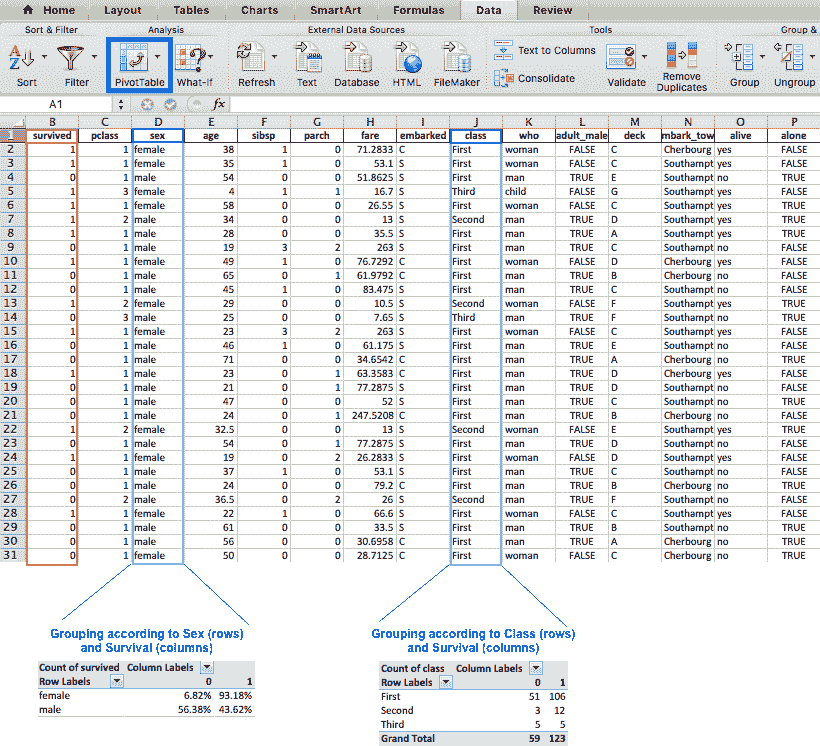
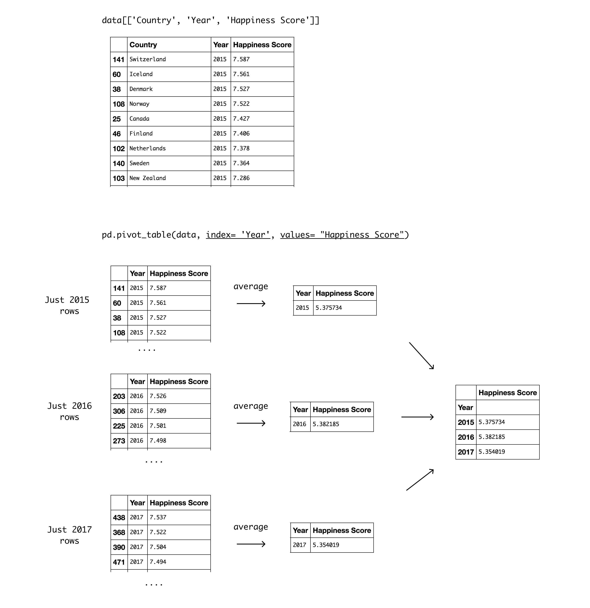

# 使用 Python 数据透视表探索幸福数据

> 原文：<https://www.dataquest.io/blog/pandas-pivot-table/>

September 25, 2017

面对一个新的数据集时，最大的挑战之一是知道从哪里开始，关注什么。能够快速汇总数百行和列可以节省您大量的时间和挫折。您可以使用一个简单的工具来实现这一点，即[数据透视表](https://en.wikipedia.org/wiki/Pivot_table)，它可以帮助您以查询的速度对数据进行切片、过滤和分组，并以视觉上吸引人的方式呈现信息。

### 数据透视表，有什么用？

您可能已经熟悉了 Excel 中数据透视表的概念，它们是在 1994 年由商标名 PivotTable 引入的。该工具使用户能够自动对存储在一个表中的数据进行排序、计数、合计或平均。在下图中，我们使用了数据透视表功能来快速汇总庞大的数据集。下面较大的表格显示了数据集的前 30 行，较小的表格是我们创建的数据透视表。



左边的数据透视表根据`Sex`和`Survived`列对数据进行分组。因此，该表显示了不同存活状态中每个性别的百分比(`0`:未存活，`1`:存活)。这让我们很快发现女性比男性有更好的生存机会。右边的表格也使用了`Survived`列，但是这次数据是按`Class`分组的。

### 介绍我们的数据集:世界幸福报告

我们在上面的例子中使用了 Excel，但是这篇文章将展示 pandas 内置函数 [pivot_table](https://pandas.pydata.org/pandas-docs/stable/generated/pandas.pivot_table.html) 的优点。我们将使用[世界幸福报告](https://worldhappiness.report/)，这是一份关于全球幸福状况的调查。该报告根据幸福水平对 150 多个国家进行了排名，自 2012 年以来几乎每年发布一次。我们将使用 2015 年、2016 年和 2017 年收集的数据，如果你想跟进，可以从[下载](https://s3.amazonaws.com/dq-content/blog/pivot_table/data.csv)。我们运行的是 python 3.6 和 pandas 0.19。

我们可能想回答的一些有趣的问题是:

*   世界上最幸福和最不幸福的国家和地区有哪些？
*   幸福感受地域影响吗？
*   在过去的三年里，幸福指数有显著变化吗？

让我们导入我们的数据，快速浏览一下:

```
import pandas as pd
import numpy as np
# reading the data
data = pd.read_csv('data.csv', index_col=0)
# sort the df by ascending years and descending happiness scores
data.sort_values(['Year', "Happiness Score"], ascending=[True, False], inplace=True)
#diplay first 10 rows
data.head(10)
```

|  | 国家 | 地区 | 幸福等级 | 幸福分数 | 经济(人均国内生产总值) | 家庭的 | 健康(预期寿命) | 自由 | 信任(政府腐败) | 慷慨 | 反面乌托邦残余 | 年 |
| --- | --- | --- | --- | --- | --- | --- | --- | --- | --- | --- | --- | --- |
| One hundred and forty-one | 瑞士 | 西欧 | One | Seven point five eight seven | 1.39651 | 1.34951 | 0.94143 | 0.66557 | 0.41978 | 0.29678 | 2.51738 | Two thousand and fifteen |
| Sixty | 冰岛 | 西欧 | Two | Seven point five six one | 1.30232 | 1.40223 | 0.94784 | 0.62877 | 0.14145 | 0.43630 | 2.70201 | Two thousand and fifteen |
| Thirty-eight | 丹麦 | 西欧 | Three | Seven point five two seven | 1.32548 | 1.36058 | 0.87464 | 0.64938 | 0.48357 | 0.34139 | 2.49204 | Two thousand and fifteen |
| One hundred and eight | 挪威 | 西欧 | Four | Seven point five two two | 1.45900 | 1.33095 | 0.88521 | 0.66973 | 0.36503 | 0.34699 | 2.46531 | Two thousand and fifteen |
| Twenty-five | 加拿大 | 北美洲 | Five | Seven point four two seven | 1.32629 | 1.32261 | 0.90563 | 0.63297 | 0.32957 | 0.45811 | 2.45176 | Two thousand and fifteen |
| Forty-six | 芬兰 | 西欧 | Six | Seven point four zero six | 1.29025 | 1.31826 | 0.88911 | 0.64169 | 0.41372 | 0.23351 | 2.61955 | Two thousand and fifteen |
| One hundred and two | 荷兰 | 西欧 | Seven | Seven point three seven eight | 1.32944 | 1.28017 | 0.89284 | 0.61576 | 0.31814 | 0.47610 | 2.46570 | Two thousand and fifteen |
| One hundred and forty | 瑞典 | 西欧 | Eight | Seven point three six four | 1.33171 | 1.28907 | 0.91087 | 0.65980 | 0.43844 | 0.36262 | 2.37119 | Two thousand and fifteen |
| One hundred and three | 新西兰 | 澳大利亚和新西兰 | Nine | Seven point two eight six | 1.25018 | 1.31967 | 0.90837 | 0.63938 | 0.42922 | 0.47501 | 2.26425 | Two thousand and fifteen |
| six | 澳大利亚 | 澳大利亚和新西兰 | Ten | Seven point two eight four | 1.33358 | 1.30923 | 0.93156 | 0.65124 | 0.35637 | 0.43562 | 2.26646 | Two thousand and fifteen |

每个国家的`Happiness Score`是通过将表中的其他七个变量相加计算出来的。这些变量中的每一个都显示了一个从 0 到 10 的人口加权平均分数，该分数随着时间的推移被跟踪并与其他国家进行比较。

这些变量是:

*   `Economy`:实际人均国内生产总值
*   `Family`:社会支持
*   `Health`:健康的预期寿命
*   做出人生选择的自由
*   `Trust`:对腐败的看法
*   慷慨的感觉
*   将每个国家与一个假设的国家进行比较，该假设的国家代表每个关键变量的最低国家平均值，并与剩余误差一起用作回归基准

每个国家的`Happiness Score`决定了它的`Happiness Rank`——这是它在特定年份在其他国家中的相对位置。例如，第一行表明瑞士以 7.587 的幸福指数被评为 2015 年最幸福的国家。瑞士排在冰岛之前，得分为 7.561。2015 年丹麦排名第三，以此类推。有趣的是，西欧在 2015 年的前八名中占据了七席。

我们将集中在最后的`Happiness Score`来演示数据透视表的技术方面。

```
 # getting an overview of our data
print("Our data has {0} rows and {1} columns".format(data.shape[0], data.shape[1]))
# checking for missing values
print("Are there missing values? {}".format(data.isnull().any().any()))
data.describe() 
```

```
Our data has 495 rows and 12 columns
Are there missing values? True
```

|  | 幸福等级 | 幸福分数 | 经济(人均国内生产总值) | 家庭的 | 健康(预期寿命) | 自由 | 信任(政府腐败) | 慷慨 | 反面乌托邦残余 | 年 |
| --- | --- | --- | --- | --- | --- | --- | --- | --- | --- | --- |
| 数数 | 470.000000 | 470.000000 | 470.000000 | 470.000000 | 470.000000 | 470.000000 | 470.000000 | 470.000000 | 470.000000 | 495.000000 |
| 意思是 | 78.829787 | 5.370728 | 0.927830 | 0.990347 | 0.579968 | 0.402828 | 0.134790 | 0.242241 | 2.092717 | 2016.000000 |
| 标准 | 45.281408 | 1.136998 | 0.415584 | 0.318707 | 0.240161 | 0.150356 | 0.111313 | 0.131543 | 0.565772 | 0.817323 |
| 部 | 1.000000 | 2.693000 | 0.000000 | 0.000000 | 0.000000 | 0.000000 | 0.000000 | 0.000000 | 0.328580 | 2015.000000 |
| 25% | 40.000000 | 4.509000 | 0.605292 | 0.793000 | 0.402301 | 0.297615 | 0.059777 | 0.152831 | 1.737975 | 2015.000000 |
| 50% | 79.000000 | 5.282500 | 0.995439 | 1.025665 | 0.630053 | 0.418347 | 0.099502 | 0.223140 | 2.094640 | 2016.000000 |
| 75% | 118.000000 | 6.233750 | 1.252443 | 1.228745 | 0.768298 | 0.516850 | 0.173161 | 0.315824 | 2.455575 | 2017.000000 |
| 最大 | 158.000000 | 7.587000 | 1.870766 | 1.610574 | 1.025250 | 0.669730 | 0.551910 | 0.838075 | 3.837720 | 2017.000000 |

[describe()](https://pandas.pydata.org/pandas-docs/version/0.17.1/generated/pandas.DataFrame.describe.html) 方法显示`Happiness Rank`的范围从 1 到 158，这意味着某一年接受调查的国家最多为 158 个。值得注意的是，`Happiness Rank`最初是属于`int`类型的。事实上，它在这里显示为一个浮点数意味着我们在这一列中有`NaN`个值(我们也可以通过`count`行来确定这一点，在我们的数据集中只有 470 行，而不是 495 行)。

`Year`列没有任何缺失值。首先，因为它在数据集中显示为`int`，而且`Year`的计数达到 495，这是我们数据集中的行数。通过将`Year`的`count`值与其他列进行比较，似乎我们可以预计每列中有 25 个缺失值(495 在`Year`中，而其他列中有 470)。

### 通过`Year`和`Region`对数据进行分类

关于 pandas `pivot_table`的有趣之处在于，你只需要一行代码就可以从另一个角度来看待你的数据。大多数`pivot_table`参数使用默认值，所以您必须添加的唯一强制参数是`data`和`index`。虽然这不是强制性的，但在下一个例子中，我们也将使用`value`参数。

*   `data`是不言自明的——它是你想要使用的数据框架
*   是用来对数据进行分组的列、分组器、数组(或前面的列表)。它将显示在索引列中(如果传递的是列表，则显示在多个列中)
*   `values`(可选)是要聚合的列。如果不指定此项，则该函数将聚合所有数值列。

让我们先看看输出，然后解释这个表是如何产生的:

```
pd.pivot_table(data, index= 'Year', values= "Happiness Score")
```

|  | 幸福分数 |
| --- | --- |
| 年 |  |
| --- | --- |
| Two thousand and fifteen | 5.375734 |
| Two thousand and sixteen | 5.382185 |
| Two thousand and seventeen | 5.354019 |

通过将`Year`作为`index`参数传递，我们选择按照`Year`对数据进行分组。输出是一个数据透视表，将`Year`的三个不同值显示为`index`，将`Happiness Score`显示为`values`。值得注意的是，聚合默认值是 mean(或 average ),因此显示在`Happiness Score`列中的值是所有国家的年平均值。该表显示，所有国家的平均水平在 2016 年最高，目前是过去三年中的最低水平。

下面是如何创建该数据透视表的详细示意图:



接下来，让我们将`Region`列用作`index`:

```
pd.pivot_table(data, index = 'Region', values="Happiness Score")
```

|  | 幸福分数 |
| --- | --- |
| 地区 |  |
| --- | --- |
| 澳大利亚和新西兰 | 7.302500 |
| 中欧和东欧 | 5.371184 |
| 东亚 | 5.632333 |
| 拉丁美洲和加勒比 | 6.069074 |
| 中东和北非 | 5.387879 |
| 北美洲 | 7.227167 |
| 东南亚 | 5.364077 |
| 南亚 | 4.590857 |
| 撒哈拉以南非洲 | 4.150957 |
| 西欧 | 6.693000 |

在上面的数据透视表的`Happiness Score`栏中显示的数字是平均值，和以前一样——但这次是每个地区所有记录年份(2015、2016、2017)的平均值。这种显示更容易看到`Australia and New Zealand`的平均得分最高，而`North America`紧随其后。有趣的是，尽管我们从阅读数据中得到的初步印象是`Western Europe`在大多数排名中名列前茅，但在计算过去三年的平均值时，`Western Europe`实际上排名第三。排名最低的地区是`Sub-Saharan Africa`，紧随其后的是`Southern Asia`。

### 创建多索引数据透视表

您可能已经使用了`groupby()`来实现数据透视表的一些功能(我们之前已经演示了如何使用 [groupby()](https://www.dataquest.io/blog/pandas-tutorial-python-2/) 来分析您的数据)。然而，`pivot_table()`内置函数提供了简单的参数名和默认值，可以帮助简化复杂的过程，比如多重索引。

为了按多个列对数据进行分组，我们所要做的就是传入一个列名列表。让我们按照`Region`和`Year`对数据进行分类。

```
pd.pivot_table(data, index = ['Region', 'Year'], values="Happiness Score")
```

|  |  | 幸福分数 |
| --- | --- | --- |
| 地区 | 年 |  |
| --- | --- | --- |
| 澳大利亚和新西兰 | Two thousand and fifteen | 7.285000 |
| Two thousand and sixteen | 7.323500 |
| Two thousand and seventeen | 7.299000 |
| 中欧和东欧 | Two thousand and fifteen | 5.332931 |
| Two thousand and sixteen | 5.370690 |
| Two thousand and seventeen | 5.409931 |
| 东亚 | Two thousand and fifteen | 5.626167 |
| Two thousand and sixteen | 5.624167 |
| Two thousand and seventeen | 5.646667 |
| 拉丁美洲和加勒比 | Two thousand and fifteen | 6.144682 |
| Two thousand and sixteen | 6.101750 |
| Two thousand and seventeen | 5.957818 |
| 中东和北非 | Two thousand and fifteen | 5.406900 |
| Two thousand and sixteen | 5.386053 |
| Two thousand and seventeen | 5.369684 |
| 北美洲 | Two thousand and fifteen | 7.273000 |
| Two thousand and sixteen | 7.254000 |
| Two thousand and seventeen | 7.154500 |
| 东南亚 | Two thousand and fifteen | 5.317444 |
| Two thousand and sixteen | 5.338889 |
| Two thousand and seventeen | 5.444875 |
| 南亚 | Two thousand and fifteen | 4.580857 |
| Two thousand and sixteen | 4.563286 |
| Two thousand and seventeen | 4.628429 |
| 撒哈拉以南非洲 | Two thousand and fifteen | 4.202800 |
| Two thousand and sixteen | 4.136421 |
| Two thousand and seventeen | 4.111949 |
| 西欧 | Two thousand and fifteen | 6.689619 |
| Two thousand and sixteen | 6.685667 |
| Two thousand and seventeen | 6.703714 |

这些例子还揭示了 pivot table 的名称来源:它允许您旋转或透视汇总表，这种旋转为我们提供了不同的数据视角。这种观点可以很好地帮助你快速获得有价值的见解。

这是查看数据的一种方式，但是我们可以使用`columns`参数来获得更好的显示:

*   是用来对数据进行分组的前一列、分组器、数组或列表。使用它将水平分布不同的值。

使用`Year`作为`Columns`参数将显示`year`的不同值，并且会有更好的显示效果，如下所示:

```
pd.pivot_table(data, index= 'Region', columns='Year', values="Happiness Score")
```

| 年 | Two thousand and fifteen | Two thousand and sixteen | Two thousand and seventeen |
| --- | --- | --- | --- |
| 地区 |  |  |  |
| --- | --- | --- | --- |
| 澳大利亚和新西兰 | 7.285000 | 7.323500 | 7.299000 |
| 中欧和东欧 | 5.332931 | 5.370690 | 5.409931 |
| 东亚 | 5.626167 | 5.624167 | 5.646667 |
| 拉丁美洲和加勒比 | 6.144682 | 6.101750 | 5.957818 |
| 中东和北非 | 5.406900 | 5.386053 | 5.369684 |
| 北美洲 | 7.273000 | 7.254000 | 7.154500 |
| 东南亚 | 5.317444 | 5.338889 | 5.444875 |
| 南亚 | 4.580857 | 4.563286 | 4.628429 |
| 撒哈拉以南非洲 | 4.202800 | 4.136421 | 4.111949 |
| 西欧 | 6.689619 | 6.685667 | 6.703714 |

### 使用`plot()`可视化数据透视表

如果您想查看我们之前创建的数据透视表的可视化表示，您需要做的就是在`pivot_table`函数调用的末尾添加`plot()`(您还需要导入相关的绘图库)。

```
 import matplotlib.pyplot as plt
import seaborn as sns
# use Seaborn styles
sns.set()
pd.pivot_table(data, index= 'Region', columns= 'Year', values= "Happiness Score").plot(kind= 'bar')
plt.ylabel("Happiness Rank") 
```

```
<matplotlib.text.Text at 0x11b885630>
```


视觉表示有助于揭示差异是微小的。话虽如此，这也表明美国这两个地区的幸福指数都在持续下降。

### 使用`aggfunc`操作数据

到目前为止，我们一直使用平均值来了解数据，但还有其他重要的值需要考虑。使用`aggfunc`参数进行实验的时间:

*   `aggfunc`(可选)接受您希望在群组中使用的功能或功能列表(默认:`numpy.mean`)。如果传递了一个函数列表，结果透视表将具有分层列，其顶层是函数名。

让我们添加每个区域的中值、最小值、最大值和标准偏差。这可以帮助我们评估平均值的准确性，以及它是否真正代表真实的情况。

```
pd.pivot_table(data, index= 'Region', values= "Happiness Score", aggfunc= [np.mean, np.median, min, max, np.std])
```

|  | 意思是 | 中位数 | 部 | 最大 | 标准 |
| --- | --- | --- | --- | --- | --- |
|  | 幸福分数 | 幸福分数 | 幸福分数 | 幸福分数 | 幸福分数 |
| --- | --- | --- | --- | --- | --- |
| 地区 |  |  |  |  |  |
| --- | --- | --- | --- | --- | --- |
| 澳大利亚和新西兰 | 7.302500 | 7.2995 | Seven point two eight four | Seven point three three four | 0.020936 |
| 中欧和东欧 | 5.371184 | 5.4010 | Four point zero nine six | Six point six zero nine | 0.578274 |
| 东亚 | 5.632333 | 5.6545 | Four point eight seven four | Six point four two two | 0.502100 |
| 拉丁美洲和加勒比 | 6.069074 | 6.1265 | Three point six zero three | Seven point two two six | 0.728157 |
| 中东和北非 | 5.387879 | 5.3175 | Three point zero zero six | Seven point two seven eight | 1.031656 |
| 北美洲 | 7.227167 | 7.2175 | Six point nine nine three | Seven point four two seven | 0.179331 |
| 东南亚 | 5.364077 | 5.2965 | Three point eight one nine | Six point seven nine eight | 0.882637 |
| 南亚 | 4.590857 | 4.6080 | Three point three six | Five point two six nine | 0.535978 |
| 撒哈拉以南非洲 | 4.150957 | 4.1390 | Two point six nine three | Five point six four eight | 0.584945 |
| 西欧 | 6.693000 | 6.9070 | Four point eight five seven | Seven point five eight seven | 0.777886 |

看起来一些地区有极端值，这可能比我们希望的更影响我们的平均值。例如，`Middle East and Northern Africa`区域有一个很高的标准偏差，所以我们可能要删除极值。让我们看看我们为每个区域计算了多少个值。这可能会影响我们看到的图像。例如，`Australia and new Zealand`标准差很低，三年都是排名最幸福的，但我们也可以假设他们只占两个国家。

### 应用自定义函数移除异常值

`pivot_table`允许您将自己的自定义聚合函数作为参数传递。您可以使用 lambda 函数，也可以创建一个函数。让我们计算一下给定年份每个地区的平均国家数量。我们可以使用 lambda 函数轻松做到这一点，如下所示:

```
pd.pivot_table(data, index = 'Region', values="Happiness Score", aggfunc= [np.mean, min, max, np.std, lambda x: x.count()/3])
```

|  | 意思是 | 部 | 最大 | 标准 | `<lambda>` |
| --- | --- | --- | --- | --- | --- |
|  | 幸福分数 | 幸福分数 | 幸福分数 | 幸福分数 | 幸福分数 |
| --- | --- | --- | --- | --- | --- |
| 地区 |  |  |  |  |  |
| --- | --- | --- | --- | --- | --- |
| 澳大利亚和新西兰 | 7.302500 | Seven point two eight four | Seven point three three four | 0.020936 | 2.000000 |
| 中欧和东欧 | 5.371184 | Four point zero nine six | Six point six zero nine | 0.578274 | 29.000000 |
| 东亚 | 5.632333 | Four point eight seven four | Six point four two two | 0.502100 | 6.000000 |
| 拉丁美洲和加勒比 | 6.069074 | Three point six zero three | Seven point two two six | 0.728157 | 22.666667 |
| 中东和北非 | 5.387879 | Three point zero zero six | Seven point two seven eight | 1.031656 | 19.333333 |
| 北美洲 | 7.227167 | Six point nine nine three | Seven point four two seven | 0.179331 | 2.000000 |
| 东南亚 | 5.364077 | Three point eight one nine | Six point seven nine eight | 0.882637 | 8.666667 |
| 南亚 | 4.590857 | Three point three six | Five point two six nine | 0.535978 | 7.000000 |
| 撒哈拉以南非洲 | 4.150957 | Two point six nine three | Five point six four eight | 0.584945 | 39.000000 |
| 西欧 | 6.693000 | Four point eight five seven | Seven point five eight seven | 0.777886 | 21.000000 |

标准偏差最低的两个排名最高的区域仅占两个国家。而`Sub-Saharan Africa`最低的`Happiness score`，却占了 43 个国家。一个有趣的下一步是从计算中去除极端值，看看排名是否有显著变化。让我们创建一个只计算 0.25 和 0.75 分位数之间的值的函数。我们将使用这个函数来计算每个地区的平均值，并检查排名是否保持不变。

```
 def remove_outliers(values):
    mid_quantiles = values.quantile([.25, .75])
return np.mean(mid_quantiles)
pd.pivot_table(data, index = 'Region', values="Happiness Score", aggfunc= [np.mean, remove_outliers, lambda x: x.count()/3]) 
```

|  | 意思是 | 移除离群值 | <lambda></lambda> |
| --- | --- | --- | --- |
|  | 幸福分数 | 幸福分数 | 幸福分数 |
| --- | --- | --- | --- |
| 地区 |  |  |  |
| --- | --- | --- | --- |
| 澳大利亚和新西兰 | 7.302500 | 7.299125 | 2.000000 |
| 中欧和东欧 | 5.371184 | 5.449250 | 29.000000 |
| 东亚 | 5.632333 | 5.610125 | 6.000000 |
| 拉丁美洲和加勒比 | 6.069074 | 6.192750 | 22.666667 |
| 中东和北非 | 5.387879 | 5.508500 | 19.333333 |
| 北美洲 | 7.227167 | 7.244875 | 2.000000 |
| 东南亚 | 5.364077 | 5.470125 | 8.666667 |
| 南亚 | 4.590857 | 4.707500 | 7.000000 |
| 撒哈拉以南非洲 | 4.150957 | 4.128000 | 39.000000 |
| 西欧 | 6.693000 | 6.846500 | 21.000000 |

剔除异常值主要影响国家数量较多的地区，这是有道理的。我们可以看到`Western Europe`(每年调查的 21 个国家的平均值)排名提高了。不幸的是，`Sub-Saharan Africa`(每年调查的 39 个国家的平均值)在剔除异常值后排名更低。

### 使用字符串操作进行分类

到目前为止，我们已经根据原始表中的类别对数据进行了分组。然而，我们可以在类别中搜索字符串来创建我们自己的组。例如，按大洲查看结果会很有趣。我们可以通过查找包含`Asia`、`Europe`等的区域名称来做到这一点。为此，我们可以首先将数据透视表分配给一个变量，然后添加过滤器:

```
 table = pd.pivot_table(data, index = 'Region', values="Happiness Score", aggfunc= [np.mean, remove_outliers])
table[table.index.str.contains('Asia')]
```

|  | 意思是 | 移除离群值 |
| --- | --- | --- |
|  | 幸福分数 | 幸福分数 |
| --- | --- | --- |
| 地区 |  |  |
| --- | --- | --- |
| 东亚 | 5.632333 | 5.610125 |
| 东南亚 | 5.364077 | 5.470125 |
| 南亚 | 4.590857 | 4.707500 |

让我们看看`Europe`的结果:

```
table[table.index.str.contains('Europe')]
```

|  | 意思是 | 移除离群值 |
| --- | --- | --- |
|  | 幸福分数 | 幸福分数 |
| --- | --- | --- |
| 地区 |  |  |
| --- | --- | --- |
| 中欧和东欧 | 5.371184 | 5.44925 |
| 西欧 | 6.693000 | 6.84650 |

差异显示，两个欧洲地区的幸福得分差异较大。在大多数情况下，剔除异常值会使得分更高，但在东亚并非如此。

如果您想从多个列中提取特定的值，那么最好使用`df.query`,因为前面的方法不适用于处理多索引。例如，我们可以选择查看非洲地区的特定年份和特定地区。

```
 table = pd.pivot_table(data, index = ['Region', 'Year'], values='Happiness Score',aggfunc= [np.mean, remove_outliers])
table.query('Year == [2015, 2017] and Region == ["Sub-Saharan Africa", "Middle East and Northern Africa"]')
```

|  |  | 意思是 | 移除离群值 |
| --- | --- | --- | --- |
|  |  | 幸福分数 | 幸福分数 |
| --- | --- | --- | --- |
| 地区 | 年 |  |  |
| --- | --- | --- | --- |
| 中东和北非 | Two thousand and fifteen | 5.406900 | 5.515875 |
| Two thousand and seventeen | 5.369684 | 5.425500 |
| 撒哈拉以南非洲 | Two thousand and fifteen | 4.202800 | 4.168375 |
| Two thousand and seventeen | 4.111949 | 4.118000 |

在本例中，差异很小，但一个有趣的练习是比较前几年的信息，因为该调查自 2012 年以来就有报告。

### 处理缺失数据

到目前为止，我们已经介绍了`pivot_table`最强大的参数，所以如果您在自己的项目中尝试使用这种方法，您已经可以从中获得很多。话虽如此，快速浏览一下剩余的参数(这些参数都是可选的，都有默认值)还是很有用的。首先要说的是缺失值。

*   `dropna`是 boolean 类型，用于表示不希望包含所有条目都是`NaN`的列(默认值:True)
*   `fill_value`是标量类型，用于选择一个值来替换缺失的值(默认:无)。

我们没有所有条目都是`NaN`的列，但是值得一提的是，如果我们有了`pivot_table`，根据`dropna`的定义，默认情况下`pivot_table`会删除它们。

我们已经让`pivot_table`根据默认设置对待我们的`NaN`。`fill_value`的默认值是`None`，这意味着我们没有替换数据集中缺失的值。为了演示这一点，我们需要生成一个带有`NaN`值的数据透视表。我们可以将每个地区的`Happiness Score`分成三个分位数，并检查有多少国家属于这三个分位数中的每一个(希望至少有一个分位数有缺失值)。

为此，我们将使用 [`qcut()`](https://pandas.pydata.org/pandas-docs/stable/generated/pandas.qcut.html) ，这是一个内置的 pandas 函数，允许您将数据分割成任意数量的分位数。例如，指定`pd.qcut(data["Happiness Score"], 4)`将产生四个分位数:

*   0-25%
*   25%-50%
*   50%-75%
*   75%-100%

```
 # splitting the happiness score into 3 quantiles
score = pd.qcut(data["Happiness Score"], 4)
pd.pivot_table(data, index= ['Region', score], values= "Happiness Score", aggfunc= 'count').head(9)
```

|  |  | 幸福分数 |
| --- | --- | --- |
| 地区 | 幸福分数 |  |
| --- | --- | --- |
| 澳大利亚和新西兰 | (2.692, 4.509] | 圆盘烤饼 |
| (4.509, 5.283] | 圆盘烤饼 |
| (5.283, 6.234] | 圆盘烤饼 |
| (6.234, 7.587] | Six |
| 中欧和东欧 | (2.692, 4.509] | Ten |
| (4.509, 5.283] | Twenty-eight |
| (5.283, 6.234] | Forty-six |
| (6.234, 7.587] | Three |
| 东亚 | (2.692, 4.509] | 圆盘烤饼 |

特定分位数中没有国家的地区显示`NaN`。这并不理想，因为等于 NaN 的计数不会给我们任何有用的信息。为了减少显示`0`的混乱，让我们使用`fill_value`将`NaN`替换为零:

```
 # splitting the happiness score into 3 quantiles
score = pd.qcut(data["Happiness Score"], 3)
pd.pivot_table(data, index= ['Region', score], values= "Happiness Score", aggfunc= 'count', fill_value= 0)
```

|  |  | 幸福分数 |
| --- | --- | --- |
| 地区 | 幸福分数 |  |
| --- | --- | --- |
| 澳大利亚和新西兰 | (2.692, 4.79] | Zero |
| (4.79, 5.895] | Zero |
| (5.895, 7.587] | six |
| 中欧和东欧 | (2.692, 4.79] | Fifteen |
| (4.79, 5.895] | Fifty-eight |
| (5.895, 7.587] | Fourteen |
| 东亚 | (2.692, 4.79] | Zero |
| (4.79, 5.895] | Eleven |
| (5.895, 7.587] | seven |
| 拉丁美洲和加勒比 | (2.692, 4.79] | four |
| (4.79, 5.895] | Nineteen |
| (5.895, 7.587] | Forty-five |
| 中东和北非 | (2.692, 4.79] | Eighteen |
| (4.79, 5.895] | Twenty |
| (5.895, 7.587] | Twenty |
| 北美洲 | (2.692, 4.79] | Zero |
| (4.79, 5.895] | Zero |
| (5.895, 7.587] | six |
| 东南亚 | (2.692, 4.79] | six |
| (4.79, 5.895] | Twelve |
| (5.895, 7.587] | eight |
| 南亚 | (2.692, 4.79] | Thirteen |
| (4.79, 5.895] | eight |
| (5.895, 7.587] | Zero |
| 撒哈拉以南非洲 | (2.692, 4.79] | One hundred and one |
| (4.79, 5.895] | Sixteen |
| (5.895, 7.587] | Zero |
| 西欧 | (2.692, 4.79] | Zero |
| (4.79, 5.895] | Twelve |
| (5.895, 7.587] | Fifty-one |

### 添加总行数/列数

最后两个参数都是可选的，对改善显示非常有用:

*   `margins`为布尔类型，允许您添加一个`all`行/列，例如小计/总计(默认为假)
*   `margins_name`这是一个字符串类型，当 margins 为真(默认为‘All’)时，它接受包含总计的行/列的名称

让我们用这些将总数加到最后一个表中。

```
 # splitting the happiness score into 3 quantiles
score = pd.qcut(data['Happiness Score'], 3)
# creating a pivot table and only displaying the first 9 values
pd.pivot_table(data, index= ['Region', score], values= "Happiness Score", aggfunc= 'count', fill_value= 0, margins = True, margins_name= 'Total count') 
```

|  |  | 幸福分数 |
| --- | --- | --- |
| 地区 | 幸福分数 |  |
| --- | --- | --- |
| 澳大利亚和新西兰 | (2.692, 4.79] | Zero |
| (4.79, 5.895] | Zero |
| (5.895, 7.587] | Six |
| 中欧和东欧 | (2.692, 4.79] | Fifteen |
| (4.79, 5.895] | Fifty-eight |
| (5.895, 7.587] | Fourteen |
| 东亚 | (2.692, 4.79] | Zero |
| (4.79, 5.895] | Eleven |
| (5.895, 7.587] | Seven |
| 拉丁美洲和加勒比 | (2.692, 4.79] | Four |
| (4.79, 5.895] | Nineteen |
| (5.895, 7.587] | Forty-five |
| 中东和北非 | (2.692, 4.79] | Eighteen |
| (4.79, 5.895] | Twenty |
| (5.895, 7.587] | Twenty |
| 北美洲 | (2.692, 4.79] | Zero |
| (4.79, 5.895] | Zero |
| (5.895, 7.587] | Six |
| 东南亚 | (2.692, 4.79] | Six |
| (4.79, 5.895] | Twelve |
| (5.895, 7.587] | Eight |
| 南亚 | (2.692, 4.79] | Thirteen |
| (4.79, 5.895] | Eight |
| (5.895, 7.587] | Zero |
| 撒哈拉以南非洲 | (2.692, 4.79] | One hundred and one |
| (4.79, 5.895] | Sixteen |
| (5.895, 7.587] | Zero |
| 西欧 | (2.692, 4.79] | Zero |
| (4.79, 5.895] | Twelve |
| (5.895, 7.587] | Fifty-one |
| 总菌数 |  | Four hundred and seventy |

### 让我们总结一下

如果您正在寻找一种从不同角度检查数据的方法，那么`pivot_table`就是答案。它很容易使用，对数值和分类值都有用，并且可以在一行代码中得到结果。

如果你喜欢挖掘这些数据，并有兴趣进一步调查，那么我们建议增加前几年的调查结果，和/或增加国家信息栏，如:贫困、恐怖、失业等。请随意[分享您的笔记本](https://twitter.com/dataquestio)，享受您的学习！

## 这个教程有帮助吗？

选择你的道路，不断学习有价值的数据技能。

[Python Tutorials](/python-tutorials-for-data-science/)

在我们的免费教程中练习 Python 编程技能。

[Data science courses](/data-science-courses/)

通过我们的交互式浏览器数据科学课程，投入到 Python、R、SQL 等语言的学习中。