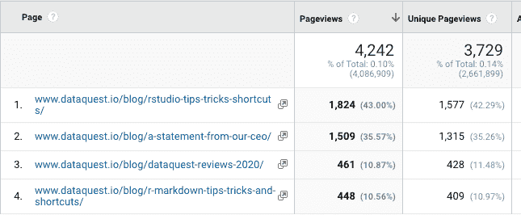
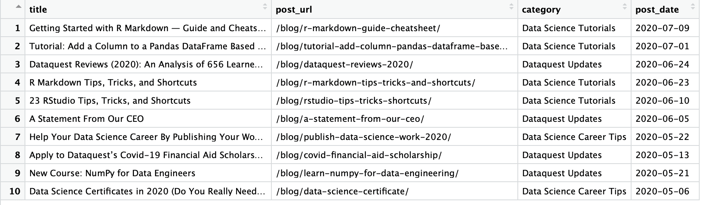
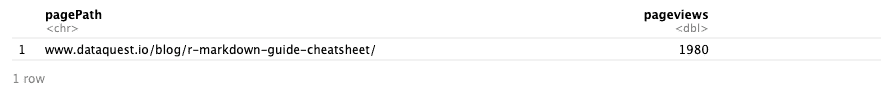
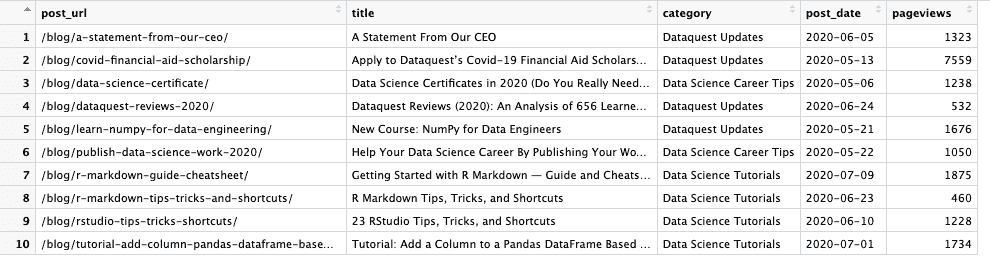
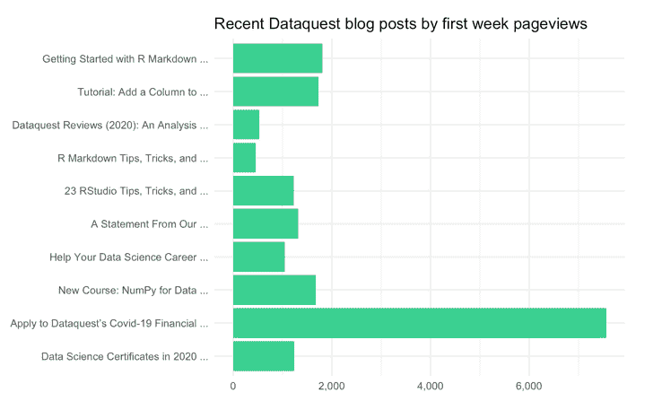

# 教程:使用 googleAnalyticsR 更好地分析博客文章

> 原文：<https://www.dataquest.io/blog/tutorial-blog-post-analysis-with-r-googleanalyticsr/>

July 21, 2020

我之前在一家博客公司担任营销数据分析师，我最重要的任务之一就是跟踪博客帖子的表现。

从表面上看，这是一个相当简单的目标。有了 Google Analytics，你可以快速获得任何日期范围内你的博客文章所需的任何指标。

但是当涉及到比较博客文章的性能时，事情就有点棘手了。

例如，假设我们想要比较六月份在 Dataquest 博客上发布的博文的性能(使用六月份作为我们的日期范围)。



但是等等……有两篇浏览量超过 1000 的博文是本月初发表的，还有两篇浏览量不足 500 的博文是月底发表的。这种比较很不公平！

我对这个问题的第一个解决方案是单独查看每篇文章，这样我就可以对每篇文章在第一天、第一周、第一个月等等的表现进行比较。

然而，这需要大量的手动复制和粘贴工作，如果我想一次比较多个帖子、日期范围或指标，这是非常乏味的。

但是后来，我学会了 R，意识到有一个更好的方法。

在这篇文章中，我们将介绍它是如何完成的，这样你就可以更好地分析我的博文了！

## 我们需要什么

要完成本教程，您需要 R 语法和 tidyverse 的基础知识，以及访问 Google Analytics 帐户的权限。

还不熟悉 R 的基础？我们可以帮你！我们的交互式在线课程从零开始教你 R，不需要以前的编程经验。[报名从今天开始](https://app.dataquest.io/signup?course=intro-to-r-rewrite)！

> install.packages("Dataquest ")

从我们的[R 课程简介](/course/intro-to-r/)开始学习 R——不需要信用卡！

[SIGN UP](https://app.dataquest.io/signup)

您还需要安装`dyplr`、`lubridate`和`stringr`包——提醒一下，您可以使用`install.packages()`命令来完成。

最后，你需要一个你想要分析的博客文章的 CSV 文件。以下是我的数据集中的内容:

`post_url`:博文的页面路径
`post_date`:博文发表的日期(格式为年月日)
`category`:博文发表的博客类别(可选)
`title`:博文的标题(可选)

根据您的内容管理系统，可能有一种方法可以自动收集这些数据——但这超出了本教程的范围！

对于本教程，我们将使用手动收集的过去十篇 Dataquest 博客文章的数据集。

## 设置 googleAnalyticsR 包

为了从 Google Analytics API 访问数据，我们将使用 Mark Edmonson 的优秀的[googlenalyticsr](https://code.markedmondson.me/googleAnalyticsR/)包。

如文档中所述，googleAnalyticsR 包有两种“模式”。我们将在这里使用的第一种模式是“试用”模式，它使用一个共享的 Google 项目来授权您的 Google Analytics 帐户。

如果你想让这份报告成为你的博客或客户的常用工具，请确保创建你自己的 Google 项目，这将有助于将共享项目的流量保持在最低水平。要了解如何设置，请阅读[包设置文档](https://code.markedmondson.me/googleAnalyticsR/articles/setup.html)。

不过现在，我们将坚持“尝试”模式。

首先，我们将使用以下代码安装软件包:

`install.packages('googleAnalyticsR', dependencies = TRUE)`

这将安装软件包以及所需的依赖项。

接下来，我们将加载该库，并使用`ga_auth()`函数通过 Google Analytics 帐户对其进行授权。

```
library(googleAnalyticsR)
ga_auth()
```

当您第一次运行这段代码时，它会打开一个浏览器窗口，提示您登录到您的 Google 帐户。然后，它会给你一个代码粘贴到你的 R 控制台。之后，它将保存一个授权令牌，这样您只需这样做一次！

一旦你完成了 Google Analytics 授权，我们就可以设置剩下的库并加载我们的博客文章了。我们还将使用`dplyr::mutate()`将 post_date 更改为一个日期类！

```
library(dplyr)
library(lubridate)
library(stringr)
library(readr)

blog_posts <- read.csv("articles.csv") %>%
  mutate(
    post_date = as.Date(post_date, "%m/%d/%y") # changes the post_date column to a Date
  )
```

以下是博客文章数据框的外观:



最后，要从您的 Google Analytics 帐户获取数据，您需要您想要访问的 Google Analytics 视图的 ID。`ga_account_list()`将返回您的可用帐户列表。

```
accounts <- ga_account_list()

# select the view ID by view and property name, and store it for ease of use
view_id <- accounts$viewId[which(accounts$viewName == "All Web Site Data" & accounts$webPropertyName == "Dataquest")]
# be sure to change this out with your own view and/or property name!
```

现在，我们准备好做我们的第一个谷歌分析 API 请求了！

## 使用 googleAnalyticsR 访问博客文章数据

在本教程中，我们的目标是收集每个帖子活跃的第一周的数据，并将其编译成数据帧进行分析。为此，我们将创建一个运行 for 循环的函数，并为我们的`blog_posts` dataframe 中的每个 post 请求该数据。

所以，让我们看看如何使用`googleAnalyticsR`向 Google Analytics API 发送请求。

```
google_analytics(view_id,
                  date_range = c(as.Date("2020-06-01"), as.Date("2020-06-30")),
                  metrics = c("pageviews"),
                  dimensions = c("pagePath")
)
```

这个请求有几个组成部分。首先，输入`view_id`，它已经存储在我们的`ga_accounts()`数据帧中。

接下来，指定日期范围，需要以日期列表的形式传入。

然后，我们输入指标(如页面浏览量、登录页面会话或页面停留时间)和维度(如页面路径、渠道或设备)。我们可以使用 Google Analytics UI 中可用的任何维度或指标——这里有一个[有用的参考](https://ga-dev-tools.appspot.com/dimensions-metrics-explorer/),用于查找任何 UI 指标或维度的 API 名称。

因此，上面的请求将按页面路径返回六月份所有页面浏览量的数据框架(默认情况下，[googlenalyticsr 将只返回前 1000 个结果)。](https://code.markedmondson.me/googleAnalyticsR/articles/v4.html#number-of-results-1)

但是，在我们的例子中，我们只想检索特定页面的浏览量，因此我们需要使用维度过滤器在 pagePath 维度上进行过滤，如下所示:

```
page_filter <- dim_filter(dimension = "pagePath",
                          operator = "REGEXP",
                          expressions = "^dataquestmarketingsite.kinsta.cloud/blog/r-markdown-guide-cheatsheet/$")
```

为了在我们的请求中使用这个过滤器，googleAnalyticsR 希望我们创建一个 filter 子句——如果您想使用多维过滤器，这就是如何组合过滤器。但是在我们的例子中，我们只需要一个:

```
page_filter_clause <- filter_clause_ga4(list(page_filter))
```

现在，让我们试着用这个过滤器发送一个响应:

```
google_analytics(view_id,
              date_range = c(as.Date("2020-07-01"), Sys.Date()),
              metrics = c("pageviews"),
              dimensions = c("pagePath"),
              dim_filters = page_filter_clause)
```



结果是 R Markdown 帖子的页面浏览量的数据框架！

## 创建 for 循环

既然我们可以收集数据并按维度进行过滤，我们就可以构建函数来运行 for 循环了！该功能的步骤如下:

*   设置数据框来保存结果
*   根据数据框中的行数开始循环
*   访问每篇文章的文章 URL 和文章日期
*   基于文章 URL 创建页面过滤器
*   向 Google Analytics 发送一个请求，将 post_date 作为开始日期，将一周后的日期作为结束日期
*   将帖子 URL 和浏览量数据添加到最终数据框中

我还添加了一个`print()`命令来让我们知道循环进行了多远(因为这可能需要一段时间),并添加了一个`Sys.Sleep()`命令来防止我们达到 Google Analytics API 速率限制。

这是所有东西放在一起的样子！

```
get_pageviews <- function(posts) {

  # set up dataframe to be returned, using the same variable names as our original dataframe
  final <- tibble(pageviews = numeric(),
                      post_url = character())

  # begin the loop for each row in the posts dataframe
  for (i in seq(1:nrow(posts))) {

    # select the post URL and post date for this loop — also using the same variable names as our original dataframe
    post_url <- posts$post_url[i]
    post_date <- posts$post_date[i]

    # set up the page filter and page filter clause with the current post URL
    page_filter <- dim_filter(dimension = "pagePath",
                              operator = "REGEXP",
                              expressions = post_url)

    page_filter_clause <- filter_clause_ga4(list(page_filter))

    # send the request, and set the date range to the week following the date the post was shared
    page_data <- google_analytics(view_id,
                                    date_range = c(post_date, post_date %m+% weeks(1)),
                                    metrics = c("pageviews"),
                                    dim_filters = page_filter_clause)

    # add the post url to the returned dataframe
    page_data$post_url <- post_url

    # add the returned data to the data frame we created outside the loop
    final <- rbind(final, page_data)

    # print loop status
    print(paste("Completed row", nrow(final), "of", nrow(posts)))

    # wait two seconds
    Sys.sleep(2)

  }

  return(final)

}
```

我们可以用 R 中的“functional”来加速这个过程，比如`purrr::map()`。`map()`函数接受一个函数作为输入，返回一个向量作为输出。如果你想加深你的知识，请查看 Dataquest 的关于地图功能的[互动在线课程！](https://app.dataquest.io/signup?lesson=515)

不过，对于本教程，我们将使用 For 循环，因为它不太抽象。

现在，我们将在我们的`blog_posts`数据帧上运行循环，并将结果合并到我们的`blog_posts`数据中。

```
recent_posts_first_week <- get_pageviews(blog_posts)
recent_posts_first_week <- merge(blog_posts, recent_posts_first_week)

recent_posts_first_week
```



就是这样！现在，我们可以开始做好事了——分析和可视化数据。

## 博文数据，可视化！

为了进行演示，这里有一个 ggplot 条形图，显示了我们最近的 10 篇博文在发布后的第一周内的浏览量:

```
library(ggplot2)
library(scales)

recent_posts_first_week %>%
  arrange(
    post_date
  ) %>%
  mutate(
    pretty_title = str_c(str_extract(title, "^(\\S+\\s+\\n?){1,5}"), "..."),
    pretty_title = factor(pretty_title, levels = pretty_title[order(post_date)])
  ) %>%
  ggplot(aes(pretty_title, pageviews)) +
  geom_bar(stat = "identity", fill = "#39cf90") +
  coord_flip() +
  theme_minimal() +
  theme(axis.title = element_blank()) +
  labs(title = "Recent Dataquest blog posts by first week pageviews") +
  scale_y_continuous(labels = comma)
```



现在我们可以看到，能够在“平等的基础上”比较博客帖子是多么有用！

关于 googleAnalyticsR 包的更多信息以及你可以用它做什么，请查看[它非常有用的资源页面](https://code.markedmondson.me/googleAnalyticsR/index.html)。

### 准备好提升你的 R 技能了吗？

我们 R path 的[数据分析师涵盖了你找到工作所需的所有技能，包括:](/path/data-analyst-r/)

*   使用 **ggplot2** 进行数据可视化
*   使用 **tidyverse** 软件包的高级数据清理技能
*   R 用户的重要 SQL 技能
*   **统计**和概率的基础知识
*   ...还有**多得多的**

没有要安装的东西，**没有先决条件**，也没有时间表。

[Start learning for free!](https://app.dataquest.io/signup)