# 23 RStudio 提示、技巧和快捷方式

> 原文：<https://www.dataquest.io/blog/rstudio-tips-tricks-shortcuts/>

June 10, 2020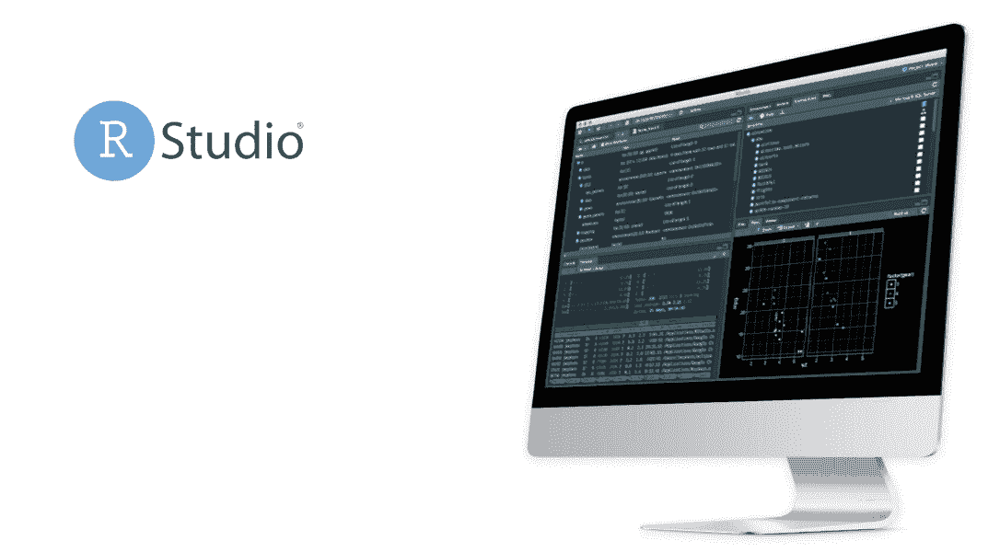

RStudio 是一个用于 R 编程的开源工具。如果您对 R 编程感兴趣，那么有必要了解一下 RStudio 的功能。它是一个灵活的工具，帮助您创建可读的分析，并将您的代码、图像、注释和绘图放在一个地方。

在这篇博文中，我们将介绍 RStudio 免费版的一些最佳特性: [RStudio 桌面](https://rstudio.com/products/rstudio/download/)。我们收集了一些顶级 RStudio 提示、技巧和快捷方式，帮助您快速成为 RStudio 高级用户！

> install.packages("Dataquest ")

从我们的[R 课程简介](/course/intro-to-r/)开始学习 R——不需要信用卡！

[SIGN UP](https://app.dataquest.io/signup)

## 1.在窗口窗格之间快速导航

RStudio 窗口窗格可让您随时访问有关项目的重要信息。知道如何在窗格之间切换而不用触摸鼠标来移动光标将节省时间并改进您的工作流程。使用这些快捷键可以在窗格之间即时移动:

*   `Control/Ctrl + 1`:源代码编辑器(您的脚本)
*   `Control/Ctrl + 2`:控制台
*   `Control/Ctrl + 3`:救命
*   `Control/Ctrl + 4`:历史
*   `Control/Ctrl + 5`:文件
*   `Control/Ctrl + 6`:剧情
*   `Control/Ctrl + 7`:包装
*   `Control/Ctrl + 8`:环境
*   `Control/Ctrl + 9`:查看器

如果你喜欢一次只查看一个窗格，添加`Shift`到上面的任何命令来最大化窗格。例如，输入`Control/Ctrl + Shift + 1`以最大化您正在处理的 R 脚本、笔记本或 R Markdown 文件。

(旁注:我们在快捷键中显示的`+`表示“和”，所以不需要实际键入`+`键。)

但是如果您想返回到标准的四窗格视图呢？没问题！输入`Control/Ctrl + Shift + 0`:

## 2.快捷键

知道 RStudio 键盘快捷键会在编程时节省很多时间。RStudio 提供了几十种有用的快捷方式，您可以通过顶部的菜单进入:`Tools > Keyboard Shortcuts Help`。

访问 RStudio 键盘快捷键的另一种方式是使用快捷键！要访问快捷方式，在 Mac 上键入`Option + Shift + K`，或者在 Linux 和 Windows 上键入`Alt + Shift + K`。

以下是我们最喜欢的 RStudio 快捷方式:

*   在 Mac 上插入带有`Option + -`的 Alt + -。
*   在 Mac 上插入带有`Command + Shift + M`的管道操作符`%>%`，或者在 Linux 和 Windows 上插入`Ctrl + Shift + M`。
*   在 Mac 上用`Command + Enter`运行当前代码行，在 Linux 和 Windows 上用`Control + Enter`运行当前代码行。
*   在 Mac 上用`Command + A + Enter`运行所有代码行，在 Linux 和 Windows 上用`Control + A + Enter`运行所有代码行。
*   重启当前的 R 会话，在 Mac 上用`Command + Shift + F10`重新开始，在 Linux 和 Windows 上用`Control + Shift + F10`重新开始。
*   在 Mac 上用`Command + Shift + C`注释或取消注释行，在 Linux 和 Windows 上用`Control + Shift + C`注释或取消注释行。
*   试图记住您之前提交的命令？在 Mac 上使用`Command + [up arrow]`或在 Linux 和 Windows 上使用`Control + [up arrow]`从控制台搜索命令历史。

还有许多更有用的快捷方式，但是通过掌握上面的快捷方式，您将成为 RStudio 高级用户！

RStudio 快捷方式的另一个很好的资源是官方的 RStudio 备忘单，可从这里获得。

## 3.通过代码完成节省时间

在您开始输入之后，会弹出一个建议窗口，其中包含匹配的函数、对象和代码片段的名称。您可以使用向上或向下箭头在列表中切换，并点击`return/Enter`进行选择。

或者，你可以利用一个非常酷的功能，叫做**模糊匹配，**，它允许你通过输入你要匹配的项目的唯一字母来缩小你的搜索选项。只要您输入的内容与字符串的顺序匹配，就不需要输入所有的字母。

让我们看看这些代码完成方法是如何工作的。首先，我们将通过键入函数名的一部分来选择`installed.packages()`函数，然后使用箭头进行选择。接下来，我们将使用模糊匹配仅输入`instd`来进一步缩小选择范围:

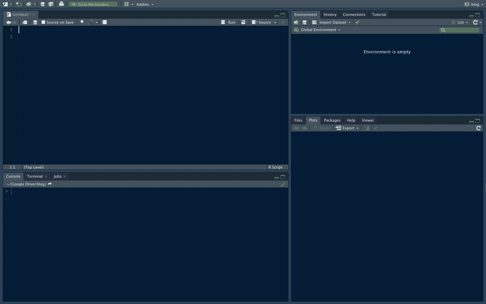

## 4.快速查找文件和功能

在 RStudio 中，不需要在文件夹结构中摸索查找文件，也不需要挖掘功能！输入快捷键`control/ctrl + .`打开`Go to File/Function`窗口，然后使用模糊匹配技能缩小选择范围:

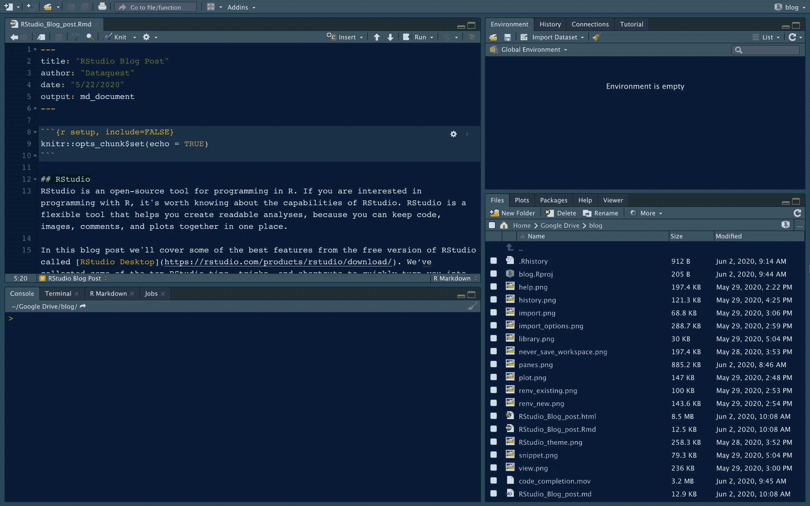

## 5.自定义外观

RStudio 提供了丰富的选项来根据您的喜好定制外观。在`RStudio`选项卡下，导航至`Preferences > Appearance`以探索许多可用选项。RStudio 的一个很好的特性是你可以快速点击`Editor theme`窗口来预览每个主题。

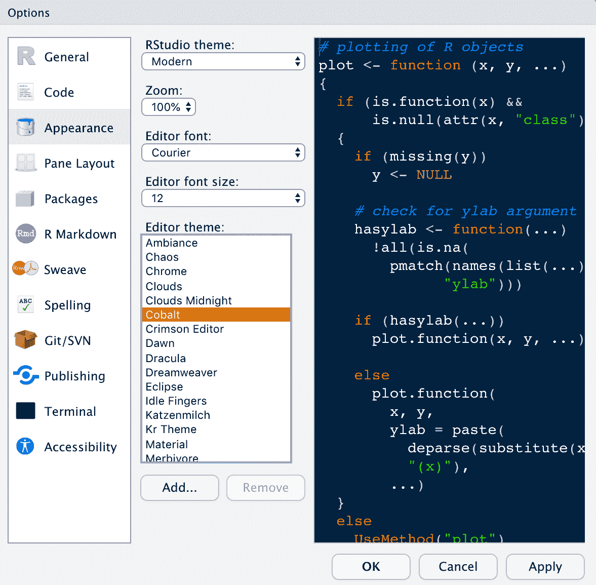

## 6.文档的简单链接

在右下窗口的`Help`选项卡下，您会找到 R 函数和 R 包的在线文档的链接。例如，如果我们使用搜索栏搜索关于`install.packages()`函数的信息，将返回官方文档:

我们也可以通过在`?`(例如`?install.packages`)前添加一个包或函数并在控制台中运行命令来访问`Help`选项卡中的文档。无论使用哪种方法，RStudio 都会在您键入时自动填充匹配的函数名！

## 7.预览并保存您的地块

RStudio 会话期间生成的图显示在右下窗口的`Plots`选项卡下。在此窗口中，您可以通过放大和缩小来检查您的绘图。如果要保存绘图，可以将绘图保存为 PDF 或图像文件。

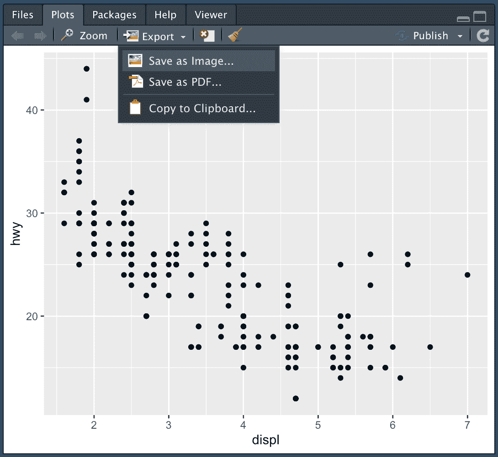

## 8.导入和预览数据集

RStudio 使导入和预览数据集变得简单，无需编码！在右上方窗口的`Environment`选项卡下，有一个使您能够导入数据集的功能。此功能支持多种格式:

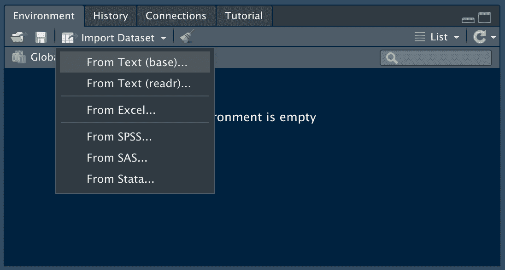

您甚至可以在加载数据集之前预览它:

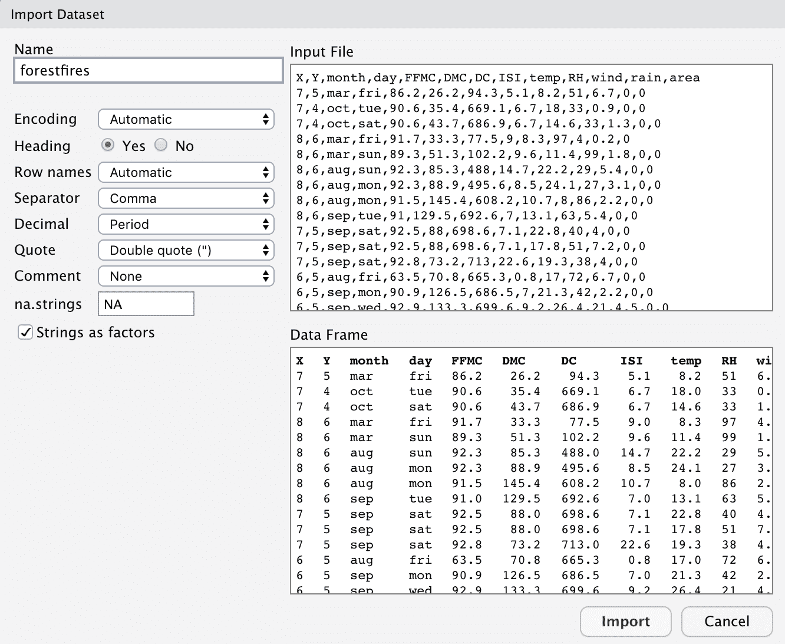

数据集加载到 RStudio 后，您可以使用`View()`命令或通过单击数据集的名称来查看它:

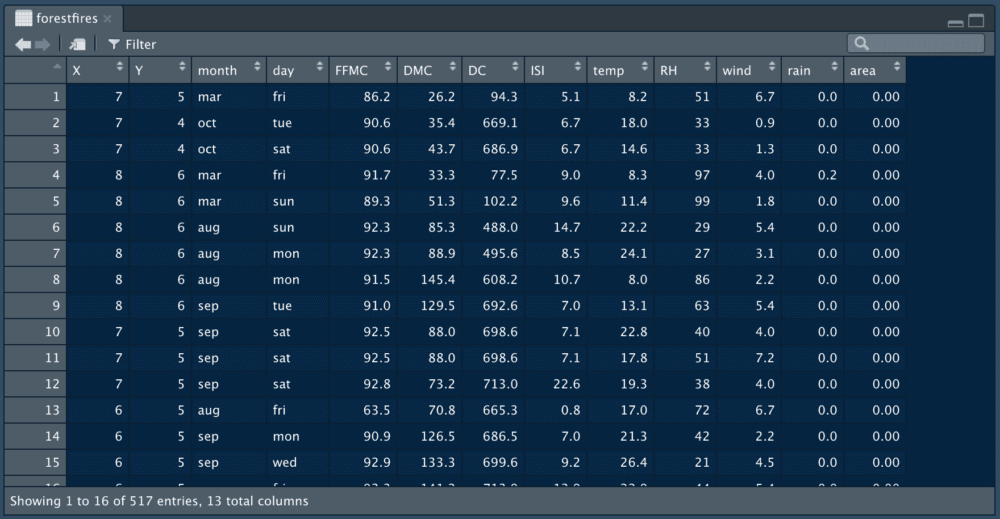

## 9.一键查看命令历史记录

之前，我们从控制台学习了命令历史的快捷方式。RStudio 还允许您通过点击`History`选项卡，在右上角窗口中查看整个命令历史:

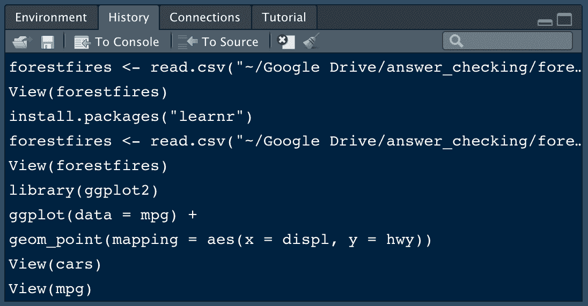

## 10.保存您的“真实”工作。其余删除。

实践良好的内务管理，以避免未来不可预见的挑战。如果您创建了一个值得保存的 R 对象，请在 R 脚本文件中捕获生成该对象的 R 代码。保存 R 脚本，但是不要保存创建对象的环境或工作空间。

要防止 RStudio 保存您的工作空间，请打开`Preferences > General`并取消选择启动时将`.RData`恢复到工作空间的选项。确保指定您永远不想保存您的工作区，如下所示:

现在，每次打开 RStudio 时，您都将从一个空会话开始。从您之前的会话中生成的任何代码都不会被记住。R 脚本和数据集可以用来从头开始重新创建环境。

## 11.用项目组织您的工作

RStudio 提供了一个强大的功能，让您保持条理；项目。当您进行多项分析时，保持条理是非常重要的。RStudio 的项目允许您将所有重要的工作放在一个地方，包括代码脚本、绘图、图表、结果和数据集。

通过导航到 RStudio 中的`File`选项卡并选择`New Project...`来创建一个新项目。您可以选择在新目录或现有目录中创建新项目。如果你正在开发一个 R 包，或者一个闪亮的 Web 应用程序，RStudio 提供了专门的项目类型。

当您需要与同事分享您的工作时，RStudio 项目非常有用。您可以发送您的项目文件(以`.Rproj`结尾)以及所有支持文件，这将使您的同事更容易重新创建工作环境并重现结果。

但是如果您想要无缝协作，您可能需要将包管理引入到您的工作流中。幸运的是，RStudio 提供了一个有用的包管理工具`[renv](https://rstudio.github.io/renv/)`，它现在与 RStudio 项目兼容。接下来我们将讲述`renv`。

## 12.使用 renv 管理软件包版本

我们喜欢 Dataquest 的 R，但是管理软件包版本可能是一个挑战！幸运的是，由于 RStudio 的[`renv`(“可再生环境”)包](https://rstudio.github.io/renv/)，R 包管理比以往任何时候都更容易。现在，RStudio 包含了对`renv`的内置支持。

我们不会在这篇博客中详细讨论如何将`renv`用于 RStudio 项目，因为 RStudio 在我们提供的链接和[简介](https://rstudio.github.io/renv/articles/renv.html)中为您提供了您需要的信息。但是将`renv`与 RStudio 一起使用可以使 R 包管理更加容易，所以我们想让您知道！

这个`renv`包取代了以前由 RStudio 维护的[包`Packrat`包](https://rstudio.github.io/packrat/)。

要在 RStudio 项目中使用`renv`包，请升级到 RStudio 的最新版本，然后安装带有`library("renv")`的`renv`包。在那里，您可以选择对所有新项目使用`renv`:

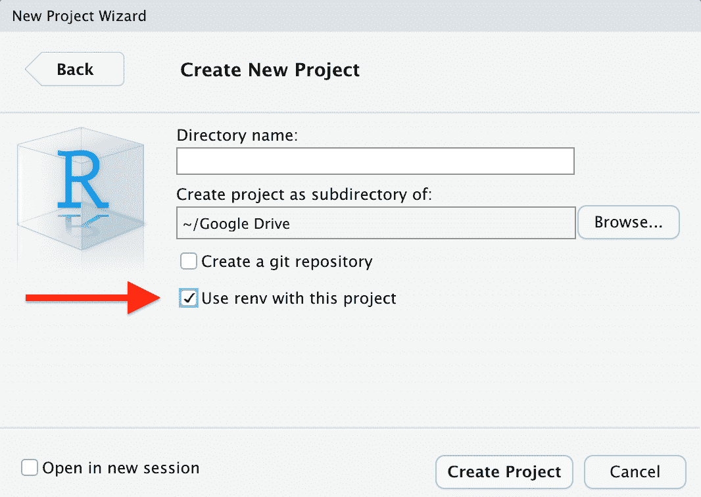

如果您想将`renv`用于现有项目，导航至`Tools > Project Options > Environments`并勾选复选框以启用`renv`:

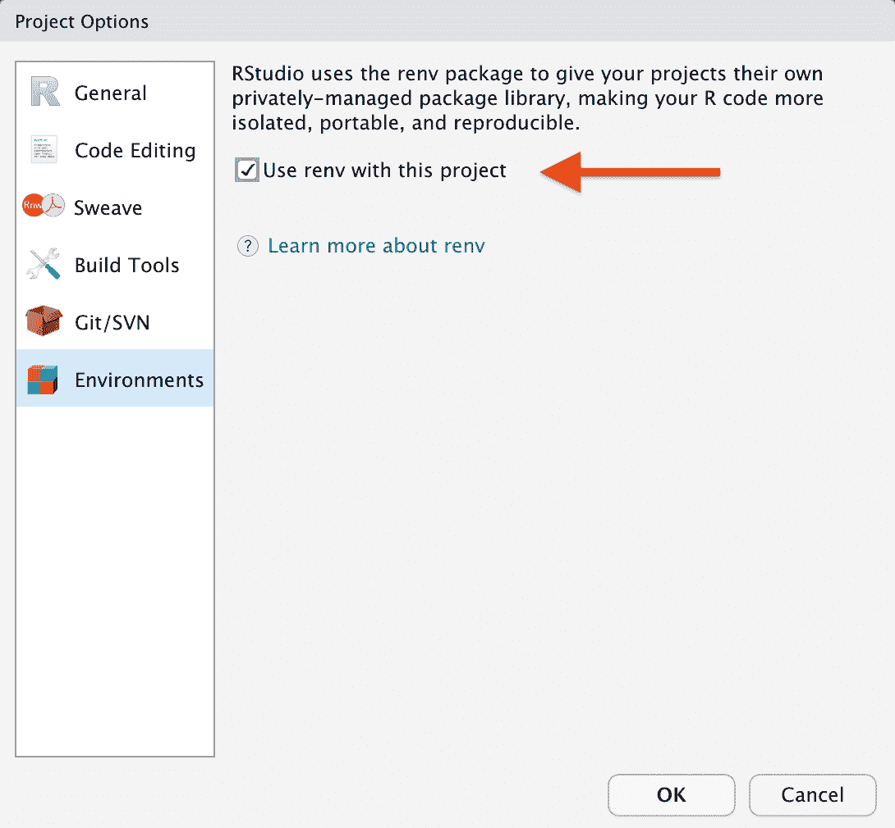

## 13.在 RStudio 中使用 GitHub 管理版本控制

除了在 RStudio 中管理包之外，您还可以使用 GitHub 和 RStudio 来维护项目和 R 脚本的版本控制。查看来自 GitHub 的[这篇文章和来自 RStudio](https://resources.github.com/whitepapers/github-and-rstudio/) 的[这篇文章，了解将 Git 集成到 RStudio 工作流中所需的所有信息。](https://support.rstudio.com/hc/en-us/articles/200532077?version=1.3.959&mode=desktop)

## 14.代码片段

RStudio 提供了一个非常有用的特性，可以插入常见的代码块，称为代码片段。我们最喜欢的一个是`lib`片段，它可以在调用`library()`函数加载 R 包时节省您的输入时间:

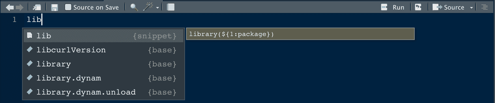

在您点击 return 键选择代码片段后，将加载`library()`函数，并且定位光标，这样您就可以立即开始输入您想要加载的包的名称:

我们的另一个最爱是有趣的代码片段，它提供了一个编写自定义函数的基本模板。您甚至可以添加自己的片段！要了解更多信息，请查看本文中来自 RStudio 的代码片段。

## 15.深入研究函数的源代码

如果您想研究某个函数的源代码，将光标移到感兴趣的函数上，然后输入`F2`(在 Mac 上，您可能需要输入`fn + F2`)。这个特性甚至适用于从您使用的任何 R 包中加载的函数。

## 16.功能提取

如果你已经写了一段代码，想把它变成一个函数，高亮显示这段代码，在 Mac 上输入`control + option X`，在 Linux/Windows 上输入`Ctrl + Alt + X`。将出现一个弹出窗口，要求您选择一个函数名。

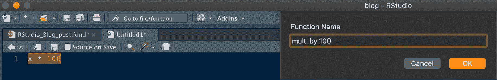

选择函数名后，将代码转换成函数所需的输入和代码结构将自动添加。

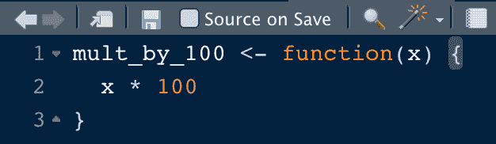

如果您有一个想要提取的变量，突出显示该变量并在 Mac 上输入`control + option V`，在 Linux/Windows 上输入`Ctrl + Alt + V`。

## 17.在范围内重命名

在某些情况下，您可能需要更改函数名或函数中使用的变量名。但是使用“查找和替换”来做这件事是很伤脑筋的！幸运的是，RStudio 使得在作用域内重命名成为可能。这意味着您的更改将仅限于感兴趣的变量或函数。这将防止您意外替换代码脚本中其他地方的同名变量。要使用此功能，请选择您想要更改的函数或变量，并在 Mac 上输入`control + shift + option + M`，或在 Linux/Windows 上输入`Ctrl + Shift + Alt + M`。

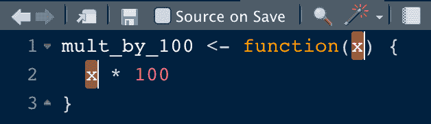

## 18.多光标支持

RStudio 支持多个游标。在 Mac 上按住`option`，或者在 Windows/Linux 上按住`Alt`，只需点击并拖动鼠标。

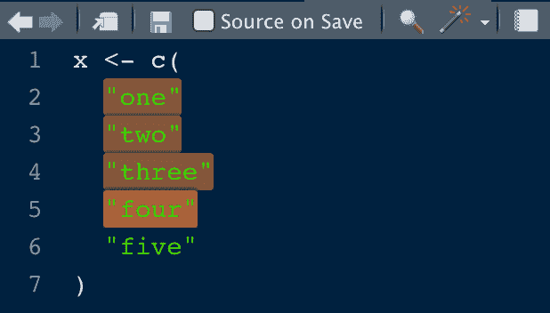

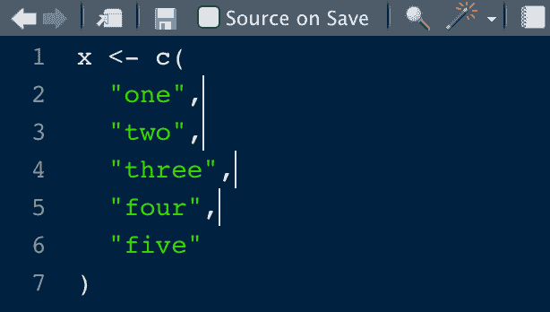

## 19.将 Python 与 RStudio 和 reticulate 结合使用

RStudio 支持 python 中的编码。在 RStudio 中启动和运行 python 的过程包括以下几个一般步骤:

*   安装 Python 的基础版本
*   安装`pip`和`virtualenv`
*   在工作室项目中创建一个 python 环境
*   激活您的 Python 环境
*   在您的环境中安装所需的 Python 包
*   安装并配置 R `reticulate`包以使用 Python

[本文](https://support.rstudio.com/hc/en-us/articles/360023654474-Installing-and-Configuring-Python-with-RStudio)提供了上述步骤所需的代码。我们试用了一下，只用了几分钟就能在 RStudio 中运行 python:

要了解全部细节，请查看这个 [RStudio 教程](https://docs.rstudio.com/tutorials/user/using-python-with-rstudio-and-reticulate/)。

## 20.使用 DBI 包查询 SQL

在 RStudio 中运行 SQL 查询有很多种方式。这里有三个最流行的方法，从 r。

首先，您将生成一个内存中的 SQL 数据库，以便在所有 SQL 查询示例中使用。您将为著名的“mtcars”数据集生成一个 SQL 数据库。代码如下:

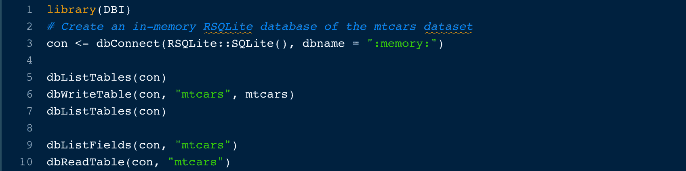现在编写一个 SQL 查询，从数据库中选择所有四缸发动机的汽车。该命令返回一个数据帧，您将把它保存为`dbi_query`:

数据帧看起来像这样:

## 21.在 R Markdown 中或使用 R 记事本查询 SQL

通过创建一个`{sql}`代码块，你可以在 R Notebook 或 R Markdown 中达到同样的效果。使用第一个示例中的连接和数据库，运行以下代码:

指定`output.var = "mt_cars_df"`将查询结果保存到数据帧。该数据帧是一个标准的 R 数据帧，与您在上一示例中生成的数据帧相同。您可以在 R 代码块中使用此数据帧来执行分析或生成 ggplot，例如:

## 22.用 dbplyr 查询 SQL

最后，您将使用`dbplyr`包来编写转换成 SQL 的标准`dplyr`命令！同样，使用第一个示例中的连接和数据库，您可以编写一个标准的`filter()`调用来查询四缸汽车，这将返回一个列表对象:

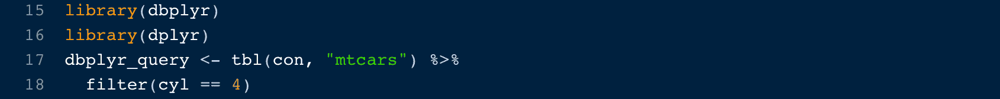

如果您想查看这个命令被转换成的 SQL 代码，您可以使用来自`dbplyr`的`show_query()`函数:

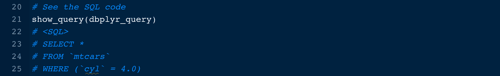当您对查询结果满意时，您可以使用`dbplyr`中的`collect()`函数将结果保存为数据帧:

你有它！三种不同的查询 SQL 数据库的方法得到相似的结果。两个例子之间唯一的区别是,`dbplyr`方法返回一个 tibble，而前两个方法返回一个标准的 R 数据帧。

要了解更多关于使用 RStudio 查询 SQL 数据库的信息，请查看本文。

## 23.把它带到云端！

RStudio 现在提供一个基于云的 RStudio 桌面版本，名为，你猜对了… [RStudio Cloud](https://rstudio.cloud/) 。RStudio Cloud 让你不用安装软件就可以在 RStudio 中编码，你只需要一个网页浏览器。

RStudio Cloud 中的工作被组织到类似于桌面版本的项目中，但是 RStudio Cloud 使您能够指定您希望用于每个项目的 R 版本。

RStudio Cloud 还可以轻松安全地与同事共享项目，并确保每次访问项目时工作环境完全可再现。

可以看到，RStudio 云的布局与 RStudio 桌面非常相似:

## 奖励:备忘单

RStudio 发布了[许多与 R 合作的备忘单](https://rstudio.com/resources/cheatsheets/)，包括一份关于使用 RStudio 的详细备忘单！通过选择`Help > Cheatsheets`，可以从 RStudio 中访问选择备忘单。

## 额外资源

RStudio 发表了许多关于使用 RStudio 的深入的操作方法文章。找到他们[在这里](https://support.rstudio.com/hc/en-us/sections/200107586-Using-the-RStudio-IDE)。

> install.packages("Dataquest ")

从我们的[R 课程简介](/course/intro-to-r/)开始学习 R——不需要信用卡！

[SIGN UP](https://app.dataquest.io/signup)