# r 降价提示、技巧和快捷方式

> 原文：<https://www.dataquest.io/blog/r-markdown-tips-tricks-and-shortcuts/>

June 23, 2020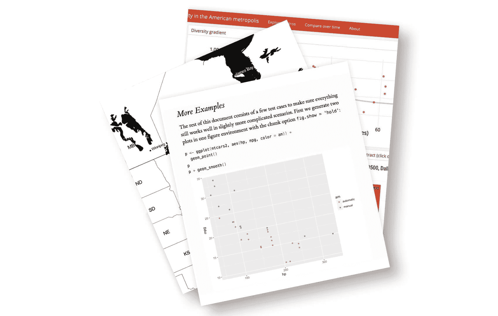

使用 R Markdown 将您的数据分析转化为漂亮的文档。

R Markdown 是一个开源工具，用于在 r 中生成可重复的报告。它可以帮助您将所有代码、结果和文字保存在一个地方，并以一种吸引人和易于理解的方式进行格式化。

它也是向他人展示您的数据工作的一个有价值的工具。使用 R Markdown，您可以选择将您的作品导出为多种格式，包括 PDF、Microsoft Word、幻灯片或 html 文档，以便在网站上使用。

R Markdown 是一个强大的工具，因为它可以用于数据分析和数据科学，与他人合作，并将结果传达给决策者。

在这篇博文中，我们将看看在 RStudio 中使用 R Markdown 的一些技巧、窍门和快捷方式。(如果您想了解 RStudio 的更多信息，请查看[这篇 Dataquest 博客文章](https://www.dataquest.io/blog/rstudio-tips-tricks-shortcuts/)中的 RStudio 提示和技巧！)

我们喜欢使用 R Markdown 来编写 R 代码和创作内容。事实上，我们在 R Markdown 写了这篇博文！让我们来看看一些原因吧！

> install.packages("Dataquest ")

从我们的[R 课程简介](/course/intro-to-r/)开始学习 R——不需要信用卡！

[SIGN UP](https://app.dataquest.io/signup)

## 1.快捷键

知道 R Markdown 键盘快捷键会在创建报告时节省大量时间。

以下是一些基本的 R Markdown 快捷键:

*   在 Mac 上插入带有`Command + Option + I`的新代码卡盘，或者在 Linux 和 Windows 上插入带有`Ctrl + Alt + I`的新代码卡盘。
*   在 Mac 上使用`Command + Shift + K`，或者在 Linux 和 Windows 上使用`Ctrl + Shift + K`，以 YAML 头文件中指定的格式输出文档。“k”是“针织”的缩写！

接下来，我们将介绍运行代码块的快捷方式。但是在这样做之前，重启您的 R 会话并从一个干净的环境开始通常是一个好主意。在 Mac 上使用`Command + Shift + F10`或在 Linux 和 Windows 上使用`Ctrl + Shift + F10`来完成此操作。

*   在 Mac 上使用`Command + Option + P`运行当前区块之上的所有区块；`Ctrl + Alt + P`在 Linux 和 Windows 上。
*   在 Mac 上使用`Command + Option + C`或`Command + Shift + Enter`运行当前块；Linux 和 Windows 上的`Ctrl + Alt + C`或`Ctrl + Shift + Enter`。
*   在 Mac 上用`Command + Option + N`运行下一个程序块；`Ctrl + Alt + N`在 Linux 和 Windows 上。
*   在 Mac 上运行带有`Command + Option + R`或`Command + A + Enter`的所有块；Linux 和 Windows 上的`Ctrl + Alt + R`或`Ctrl + A + Enter`。

## 2.快速预览您的文档

R Markdown 为编译文档提供了许多格式选项。但是将你的作品转换成 PDF 或演示文稿比编译成 HTML 要花更长的时间。因此，在创作时将文档输出到 HTML 通常是有用的，因为这样可以快速迭代。

当您打开一个新的 R Markdown 文件时，默认的输出格式是 HTML —当您编译您的报告时，您可以很容易地在 web 浏览器中查看它。这个默认设置可以节省你的时间！当你接近一个完成的产品时，你改变输出到你选择的格式，然后做最后的润色。

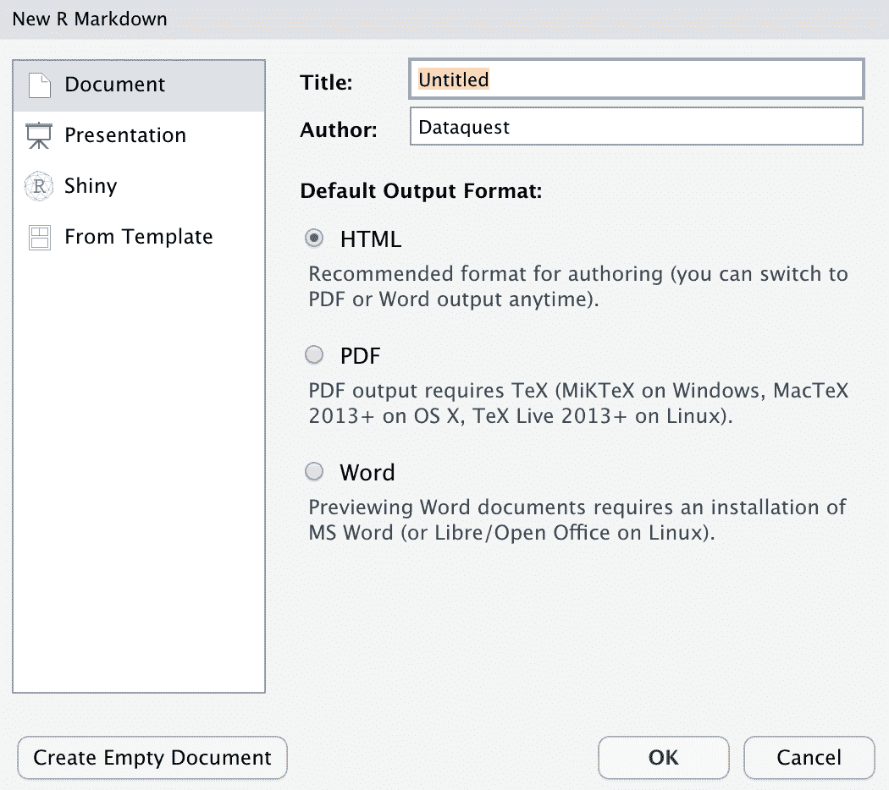

## 3.了解您的代码块选项

R Markdown 的一个伟大之处在于，您有许多选项来控制如何评估和呈现每个代码块。这使您可以从头开始构建演示文稿和报告，包括代码、图表、表格和图像，同时只向目标受众展示必要的信息。例如，您可以包含一个结果图，而不显示用于生成它的代码。

掌握这些代码块选项对于成为熟练的 R Markdown 用户至关重要:

*   `echo = FALSE`:隐藏代码，但运行代码并产生所有输出、绘图、警告和消息。
*   显示代码，但不评估它。
*   fig.show = "hide ":隐藏绘图。
*   `include = FALSE`:运行代码，但禁止所有输出。这对设置代码很有帮助。当您打开一个新的 R Markdown 文档时，您可以在第一个代码块中看到这样的例子！
*   `message = FALSE`:防止包加载时打印消息。这也抑制了函数生成的消息。
*   `results = "hide"`:隐藏打印输出。
*   `warning = FALSE`:防止软件包和功能显示警告。

## 4.使用内联代码

用内联代码直接将 R 代码嵌入到 R Markdown 文档中。当您想要在书面摘要中包含有关数据的信息时，这很有用。

使用带`r`的内联代码，并在反勾号内添加要评估的代码。例如，我们在写这篇博文时使用了内联代码来自动对每一部分进行编号，这样我们就不必自己手动添加了。那么我们是怎么做到的呢？我们首先在`setup`代码块中创建了一个名为`tip_number`的变量，并将值设置为零，如下所示:

```
`tip_number <- 0`
```

然后，我们向每个部分添加以下内联代码，以在每次迭代中增加一个数字:

```
`r paste0(tip_number <- tip_number + 1, ". ")`
```

嘿，等一下！我们如何在不弄乱下面章节编号的情况下，将最后一行代码包含在这篇用 R Markdown 编写的博客文章中？带代码块选项！上面的代码示例是用选项`eval = FALSE`写在代码块中的，以防止代码运行。像这样:

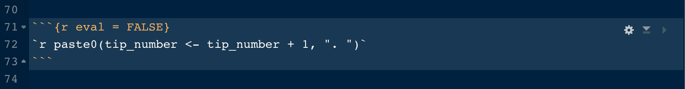

正如你所看到的，R Markdown 是一个强大的工具，因为它给了你很多对文档输出的控制！

## 5.使用 TinyTex

通过 R Markdown，您可以使用 LaTeX 文档准备系统输出高质量的报告。当报告包含科学或数学符号和符号时，LaTeX 特别有用。例如，我们在 Dataquest 使用 LaTeX 来创作使用数学符号的统计数据内容。

但是像 TeX Live、MiKTeX 和 MacTeX 这样的 LaTeX 发行版需要大约 5g 的硬盘空间！相比之下， [TinyTex](https://yihui.org/tinytex/) 安装后仅使用大约 150 兆字节。

用`install.packages('tinytex')`或`tinytex::install_tinytex()`安装 TinyTex。用`tinytex::uninstall_tinytex()`卸载 TinyTex。

安装 TinyTex 后，如果您已经将 PDF 指定为输出格式，那么您不需要做任何其他事情就可以输出 PDF 文档！

要将 LaTeX 文档编译成 PDF，调用这些`tinytex`函数之一:`pdflatex()`、`xelatex()`和`lualatex()`。要使用的函数取决于您想要使用的 LaTeX 引擎。

TinyTex 开发者和 R Markdown 超级巨星谢一辉说，这是普通 R 用户需要了解的关于 TinyTex 的所有信息。为什么？因为上面提到的 LaTeX 功能会自动检测并安装任何需要的缺失 LaTeX 包！

## 6.用 R 脚本生成 R Markdown 文档

您知道可以从 R 脚本生成 R Markdown 文档吗？为此，用`#'`捕捉评论。您甚至可以用`#+`指定代码块选项。这里有一个例子:

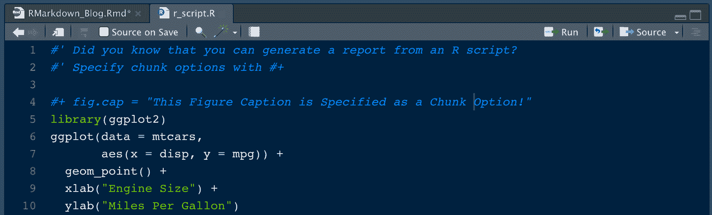

该 R 脚本以文件名“r_script”保存。r”。为了将该文档呈现为 R Markdown 文档，我们从`knitr`中指定了`spin()`函数，如下所示:

`knitr::spin("r_script.R", knit = FALSE, format = "Rmd")`

这会生成一个 R Markdown 文档，如下所示:

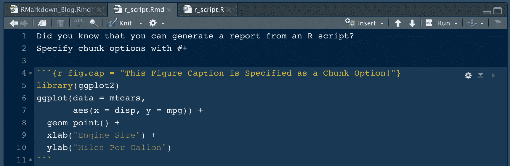

当您编织这个文档时，会返回这个 HTML 输出:

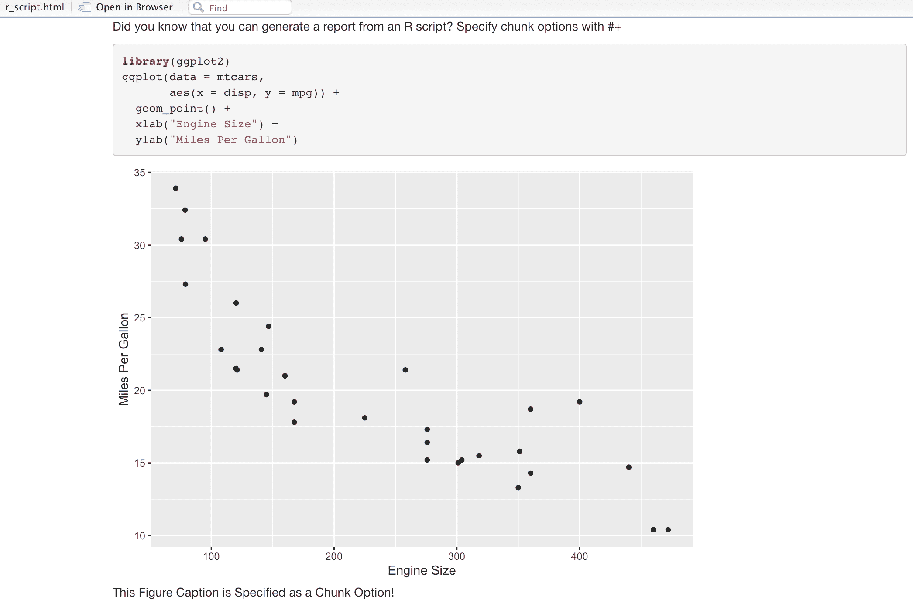

## 7.用 R Markdown 文档生成 R 脚本

您可能想知道是否有办法将 R Markdown 文档转换成 R 脚本？有！`knitr`包也为此提供了一个名为`purl()`的函数。下面是将我们的 R Markdown 文档转换回 R 脚本的命令:

`knitr::purl("r_script.Rmd", documentation = 2)`

请注意，您必须在`#'`注释中指定`documentation = 2`来返回完整的文档。如果你的文档是纯代码，指定`documentation = 0`。

> install.packages("Dataquest ")

从我们的[R 课程简介](/course/intro-to-r/)开始学习 R——不需要信用卡！

[SIGN UP](https://app.dataquest.io/signup)

## 8.在 R Markdown 中添加分行符

在输出中添加换行符有多难？不是的。但是弄清楚这一点可能有点棘手！

要在 R Markdown 中换行并让它出现在你的输出中，使用**两个尾随空格**，然后点击`return`。让我们看一个例子。

这里，我们没有在第一组(顶部)的两个句子之间指定两个尾随空格。但是我们在第二组(底部)的两个句子之间指定了两个尾随空格。

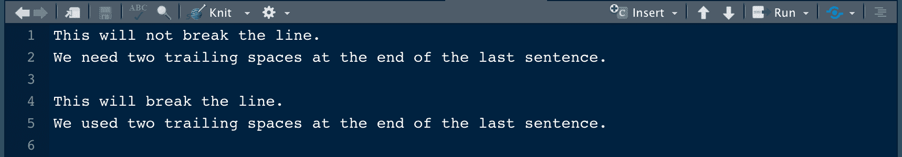

我们编出文件后的结果？看看吧！

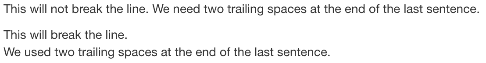

## 9.在 R Markdown 中添加空行

因为我们刚刚讨论了换行符，所以让我们也讨论一下如何在文档中添加空行。当您想要添加空白以减少文档中的混乱时，这很有用。

要在输出中显示一行或多行空行，请指定`<br>`。让我们看一个例子。

这里，我们没有在第一(顶部)组的两个句子之间指定两个`<br>`命令。但是我们在第二组(底部)的两个句子之间指定了两个`<br>`命令。

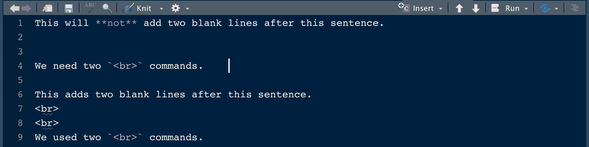

结果是这样的！

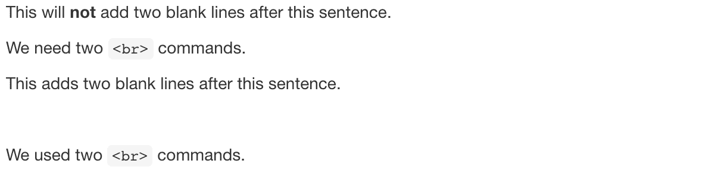

## 10.在 R Markdown 中查询 SQL

您可以通过创建一个`{sql}`代码块来查询 R Markdown 中的 SQL。

首先，您将生成一个内存中的 SQL 数据库，供本例使用。您将为著名的“mtcars”数据集生成一个 SQL 数据库。代码如下:

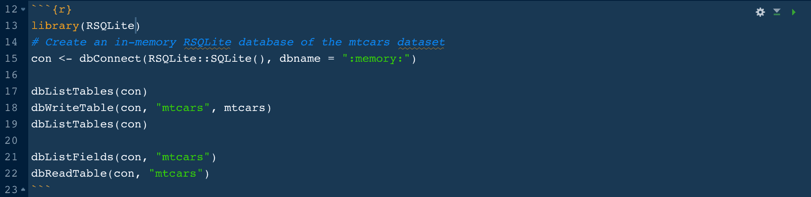

在新的代码块中，编写一个 SQL 查询，从数据库中选择所有四缸发动机的汽车。请务必将该块的类型更改为`{sql}`。该命令返回一个数据帧，您将把它保存为`mt_cars_df`:

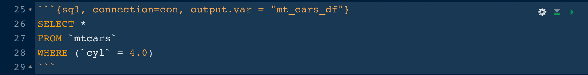

指定`output.var = "mt_cars_df"`将查询结果保存到数据帧。数据帧看起来像这样:

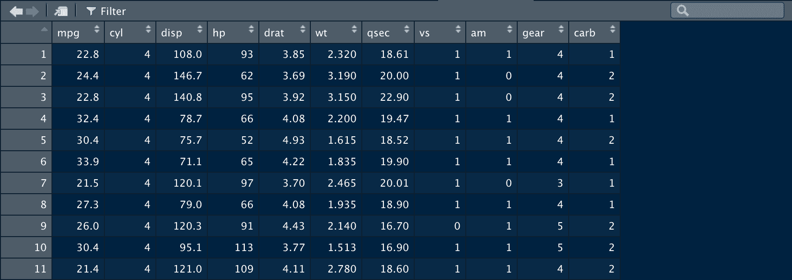

您可以在 R 代码块中使用此数据帧来执行分析或生成 ggplot，例如:

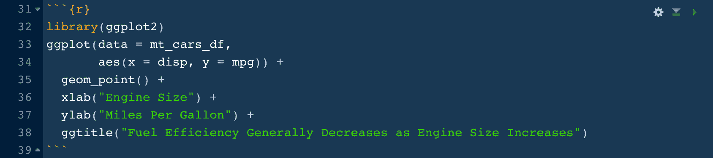

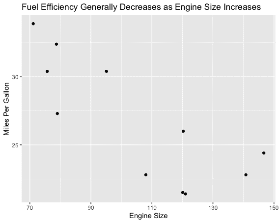

## 11.使用块名

命名代码块对于包含许多代码块的长文档非常有用。以 R 代码组块为例，这样命名组块:`{r my_boring_chunk_name}`。

使用命名的代码块，您可以在 R Markdown 窗口窗格底部的代码块导航器中导航。这也可以使绘图易于按名称识别，以便在文档的其他部分使用。

我们已经在上面的 SQL 示例中添加了块名。以下是我们在导航器中看到的内容:

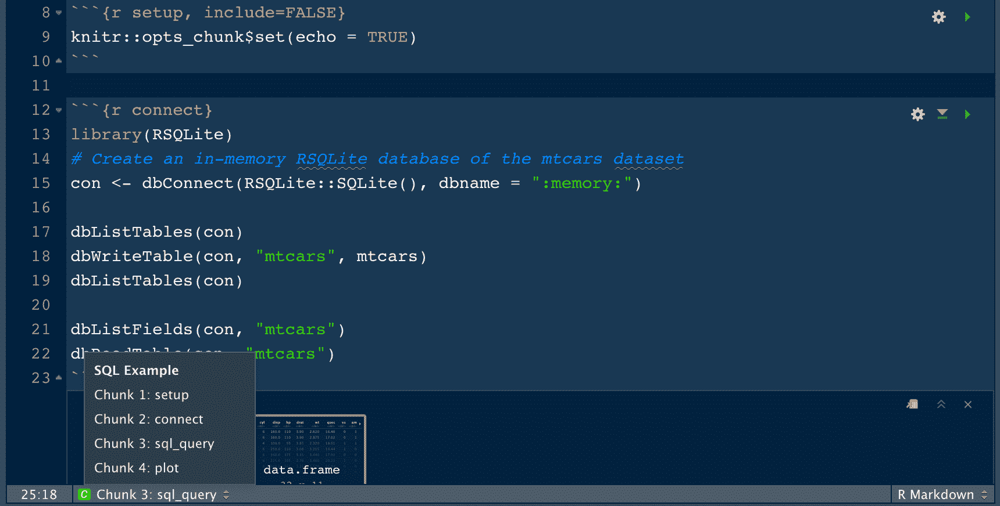

## 12.把它带到云端！

RStudio 现在提供一个基于云的 RStudio 桌面版本，名为 [RStudio Cloud](https://rstudio.cloud/) 。RStudio Cloud 让你不用安装软件就可以在 R Markdown 中创作，你只需要一个网页浏览器。

RStudio Cloud 中的工作被组织到类似于桌面版本的项目中，但是 RStudio Cloud 使您能够指定您希望用于每个项目的 R 版本。

RStudio Cloud 还可以轻松安全地与同事共享项目，并确保每次访问项目时工作环境完全可再现。这对于在 R Markdown 中编写可重复的报告非常有用！

如您所见，RStudio Cloud 的布局非常类似于在 RStudio Desktop 中创作 R Markdown 文档:

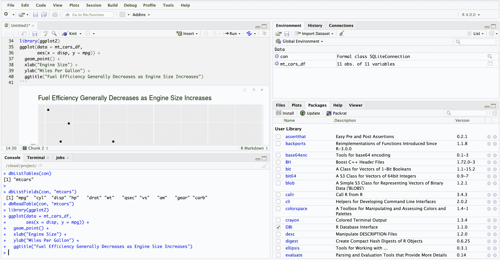

## 奖金:R 降价备忘单

RStudio 发布了[许多与 R 合作的备忘单](https://rstudio.com/resources/cheatsheets/)，包括一份关于使用 R Markdown 的详细备忘单！通过选择`Help > Cheatsheets > R Markdown Cheat Sheet`，可以从 RStudio 中访问 R Markdown cheatsheet。

## 额外资源

RStudio 已经发表了几篇关于使用 R Markdown 的深入的 how to 文章。找到他们[在这里](https://support.rstudio.com/hc/en-us/sections/200149716-R-Markdown)。

R Markdown 食谱是一本全面的免费在线书籍，几乎囊括了你需要知道的关于 R Markdown 的一切。

### 准备好提升你的 R 技能了吗？

我们 R path 的[数据分析师涵盖了你找到工作所需的所有技能，包括:](/path/data-analyst-r/)

*   使用 **ggplot2** 进行数据可视化
*   使用 **tidyverse** 软件包的高级数据清理技能
*   R 用户的重要 SQL 技能
*   **统计**和概率的基础知识
*   ...还有**多得多的**

没有要安装的东西，**没有先决条件**，也没有时间表。

[Start learning for free!](https://app.dataquest.io/signup)