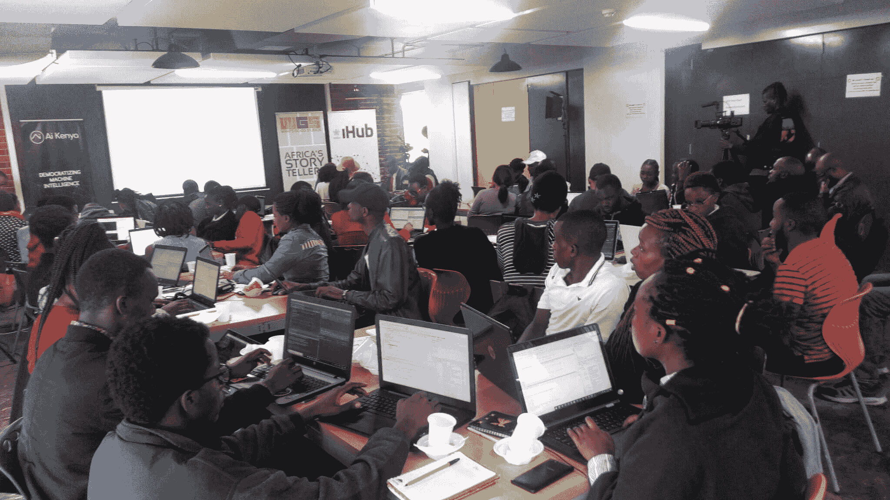

# 向非洲 R 的 Shelmith Kariuki 学习 R 的技巧

> 原文：<https://www.dataquest.io/blog/top-tips-for-learning-r-from-africa-rs-shelmith-kariuki/>

August 20, 2020

如果你刚刚开始学习 R 编程，并且正在寻找技巧，那么你可以从 Shelmith Kariuki 那里学到很多东西。

Shel 在数据科学领域拥有多年的专业经验，并拥有多年向他人教授统计和数据技能的经验。她是一名数据分析师，RStudio 认证的 Tidyverse 讲师，也是一名社区领导者 NairobiR 的共同组织者，也是总部位于非洲的 R 用户组联盟 [Africa R](https://africa-r.org/) 的核心团队成员。

换句话说，她非常了解 R 的教与学。她最近从自己的日程安排中抽出一些时间与 Dataquest 谈论了她自己的 R 学习之旅以及她对当今 R 学习者的建议。

## 对 R 编程感兴趣

在获得精算学学士学位和应用统计学硕士学位的过程中，Shel 很早就接触了 R 语言编程的基础知识。在她攻读硕士学位期间，当她成为统计学的助教/讲师时，基数 R 成了她教授学生的课程的一部分。

但她说，这对她来说没有多大意义，直到一名学生来到她的办公室，问学习 R 将如何帮助他们的生活。

“作为一名讲师，你要勇敢面对，说，‘是的，这将对你的人生有所帮助，’”她说。“但实际上当我回到房间时，我想了很多。下一步是什么？我们会在哪里应用这些东西？”

所以她做了我们大多数人有问题时都会做的事情:“我谷歌了一下。我拿起手机，在谷歌上搜索‘我们如何用 R 来解决肯尼亚的问题？’我不知道该去谷歌搜索什么。所以我谷歌了一下，发现了很多东西。"

她发现其他的硕士生在他们的论文中使用 R 语言，她还在 Data Science Central 上发现了一些关于 R 编程的博客，这些博客让她看到了一个全新的世界。她发现了 RStudio，上了 Twitter，发现了那里的#rstats 社区。她很喜欢。

“在这一点上，过了一段时间后，我觉得学术界不适合我，”她说。“我真的想做一些不同的事情。”

完成硕士学位后，她仍在做讲师，但她开始寻找数据科学方面的工作。与此同时，她开始构建项目来自学更多关于 r 的知识，“我会登录互联网，获取一些数据，然后浏览一些资料。我会谷歌:我如何在 R 中创建一个表？我如何在 R 中创建一个图形？我如何改变颜色？诸如此类的事情。”

最终，她看到了一份数据分析工作的广告，申请了，然后就忘了这件事。她说，她对自己的机会并不乐观，因为她的背景是学术界，而不是数据科学。但令她惊讶的是，他们喜欢她的应用程序，并给她发送了一个数据任务来完成。

“我告诉你，我从一开始就在谷歌上搜索，”她笑着说。“我想我几乎谷歌了所有的东西……我甚至记得谷歌了 mutate 是什么。”

Google 是学习数据科学的好工具，但前提是你要正确使用它！

## 提示 1:不要盲目搜索——学习你搜索的内容

编程的行业秘密并不秘密，那就是每个人都使用谷歌。但谢尔的秘密是，她不只是在谷歌上寻找答案。“我不会盲目地搜索，”她说。“我试着去理解。”因此，当她完成工作申请的数据任务时，她在谷歌搜索，但她也在学习她搜索的内容。

她做得很好，所以她得到了第二个任务。“我当时想，‘哇，要是这些人知道我作弊就好了！’”她说因为对我来说，[谷歌搜索]是作弊。”但她坚持了下来，提交了第二份任务，并接到了亲自面试的电话。

这就是她的方法得到回报的地方。在采访中，她被要求解释她的一些代码。“记住，我不会盲目地搜索，”她说，“所以当我走进面试时，我知道我所有的代码都做了什么。”她解释得很好，这也是她获得第一份数据科学工作的原因。

“那时我开始意识到谷歌搜索并没有错，”谢尔说。“谷歌没关系，再优秀的人也谷歌。”关键是要像谢尔那样用谷歌搜索:不要只是找到答案然后复制粘贴；在你继续前进之前，努力去*理解*答案。

“我见过盲目搜索的人，”她说，“但当需要处理那个人的代码时，你会问，‘这个函数是做什么的？’他们会说，‘我其实不知道。我谷歌了一下。"

“特别是当我做自己的分析时，”她说，“我应该能够解释分析中的每一段代码。因为，第一，这是我们学习的方式，第二，你的代码可能会到达不同的人。当他们回来时，即使是两年后，问你某个功能，你应该能解释清楚，因为你拥有那件作品。”

## 技巧 2:了解 R 实际上是如何被使用的

Shel 说，帮助她学习 R 编程的另一件事是，当她开始在线参与 R 社区时，她看到了其他人在用 R 做什么，以及它在现实世界中是如何使用的。

“你需要知道 R 在这个领域是如何被使用的，”她说。“这是第一件事。你不能在不知道人们在这个领域到底在做什么的情况下盲目地去学习一门课程。”

了解人们是如何使用 R 的也将帮助你决定你自己的学习道路应该是怎样的。

“一旦你看到人们在做什么，你就会知道是什么让你心动。你想干嘛?你想成为数据分析师吗？你想成为一名机器学习工程师吗？对我来说，这是第一件事。”

## 技巧 3:参与全球 R 社区…

谢尔说，“关注业内人士”很重要，“因为这是我了解#rstats 的方式，也是我了解 Hadley(Wickham)的时候。他会发布令人惊叹的东西，我会在谷歌上搜索他和其他发布有趣东西的人。”

“我发现看他们的作品令人鼓舞，”她说。“只是跟踪他们，看看人们是如何进化的。开发人员在开发什么包，等等。”

“我的目标很高。我想成为一名 R 大师。”观察 R 大师们在做什么帮助 Shel 弄清楚她需要学习什么，以及什么样的 R 项目在现实世界中有用。

“让你尊敬的人给你指路真的真的很重要，”她说。

*非洲 R 用户十六进制贴纸(图片来自@AfricaRUsers twitter)*

## 技巧 4:…但是不要忘记在当地参与

“另一件非常重要的事情是见面，”谢尔说。“我真的，真的，真的感谢上帝的相遇，因为我在一次相遇中知道了什么是机器学习。”

“我从我的老师那里知道什么是回归，但我第一次听到机器学习时，我就想，‘哦，我的上帝，什么是机器学习？’然后我去参加了一个聚会，人们向我解释。我当时想，‘啊，所以我知道一点机器学习！’我从聚会中学到了很多。"

“我过去参加的第一次会议是内罗毕妇女在机器学习方面的会议。她说:“它们过去常常在周六上午举行，学习新东西总是令人惊叹。”。当时，她正处于数据分析师工作的第一年，她很快发现她在会面中学到的新东西可以应用到日常工作中。

“会面也是一种社交方式。她说:“你开始了解人们在做什么，这总能开阔你的思路。“尤其是如果你所有的同事都在同一个领域，有时认识其他人并看看他们在做什么是很好的。你可以从他们身上学到东西，这有助于建立你的投资组合。”

## 技巧 5:建立“宠物项目”

谢尔说，说到投资组合，构建项目来填补一个项目是至关重要的。她说这是新学员经常跳过的重要一步。

“例如，某人将在 Dataquest 注册[一门课程，并获得证明他们成功完成课程的证书。太好了。但是接下来呢？我怎么知道你是熟练的？我怎么知道你真的理解了这门课程？最终并不总是证书的问题。”](https://www.dataquest.io/path/data-analyst-r/)

“我总是建议新手，尤其是拥有像 GitHub 这样的公众形象真的很有帮助，因为这是你出售作品的唯一方式，”她说。“当你学了 100 门课程，却仍然失业，这是非常令人沮丧的。但是你为什么会失业呢？是课程没有帮到你吗？不完全是。可能是你不知道如何营销你的技能。”

(顺便说一下，这是我们 Dataquest 非常赞同的建议。我们已经写过[数据科学证书](https://www.dataquest.io/blog/data-science-certificate/)以及为什么证书本身可能不会帮助你找到工作。我们的课程以[指导的项目](https://www.dataquest.io/data-science-projects/)结束，以帮助学习者建立他们的文件夹，我们也鼓励学生在[我们的社区](https://community.dataquest.io/)的帮助下建立和分享个人项目。)

“任何时候我有一个短期培训，”Shel 说，“我告诉人们，‘创建一个 GitHub 个人资料和我在这个会议上要教的任何东西，做一些任务，并公开发布它们。’你永远不知道谁会看到它。有时这是向潜在雇主推销你技能的一种方式。"

谢尔说，事实上，公开项目可能是能否找到工作的关键。如果雇主有需要快速分析的数据，看到你的证书并不足以说服他们雇佣你做他们的分析。但是如果他们能在你的投资组合中看到你已经做过的类似项目，他们知道他们可以依靠你来做这项工作。

谢尔说，雇主“希望看到一些东西，让他们说，‘嗯，这正是我想让你为我做的，或者这正是我们想要的’”

## 秘诀 6:不要害怕从小处着手

“我给人们的一个建议是:我们并不完美，也不是超人，”谢尔说。“我们不是什么都知道。一周或一个月后你就不会好了。不能急。最好的学习方式是体验。”

“你不可能在一个月内一下子学会数据分析、数据科学、机器学习、人工智能。我想没有人这样做过。对我来说，为了得到我的第一份工作，我只需要知道如何在 R 中创建一个表和一个图。从那里，随着时间的推移，我学到了越来越多的东西:如何优化我的代码，如何在 R 中构建仪表板，如何做这做那。”

“我们总是必须一步一步来，”Shel 说，这在数据科学中尤其具有挑战性，因为炒作周期会让你觉得需要立即学习最新的热门技术。

“你不用什么都学。学一些能帮你找到第一份工作的东西。也就是说，如果你还没有工作的话。如果是这样，那就学习一些能帮助你提高技能的东西，因为归根结底，我们的目标是提高技能。”

这种从小做起的方法也适用于就业。虽然你的梦想可能是一份全职工作，但把你的作品集放到网上有时能让你得到一份短期工作。

“如果你能完成一项任务，并将其发布到网上，然后获得一份为期五六天的小合同，足以支付你未来两个月的租金，谁会讨厌这样呢？”谢尔说。

这也是拥有一个在线项目组合至关重要的另一个原因:“如果你的作品不在网上，别人将如何联系你？”

*满座，2019 年在 NairobiR meetup 学习。(图片来自@AfricaRUsers Twitter)*

## 技巧 7:教导他人

“你训练别人越多，你就越能消化你学到的所有信息，”谢尔说。

虽然 Shel 本人是 RStudio 认证的培训师，在不同的数据科学活动中为他人提供教育，但你不需要那种机会来通过教学开始学习。“只要找五个人并训练他们，”谢尔说。“在潮水上训练他们。如果你训练两次、三次，你就再也不需要回到书本或网络课程中去记住什么是 tidyverse，或者哪个功能用于什么任务。”

“训练可以和朋友一起进行，”她说。"坚持说你想向你的一个朋友解释一些事情."

“我过去也是这样，甚至在工作中也是这样，问‘我能向你解释一下这段代码是做什么的吗？’"

“你解释得越多，你就越意识到要么你知道，要么你不知道。当你解释时，你会想，‘顺便问一下，为什么会这样？’这意味着在某个地方有差距，你需要学习更多。"

换句话说，教学有助于强化你所知道的，突出你所不知道的。解释你的代码——即使是对那些可能没有要求解释的人——可以帮助你更好地学习它。

此外，培训他人是有益的。“当你教别人你知道的东西时，你是在给他们知识。你给了他们能力，让他们能够利用自己的技能找到工作。然后他们去教其他人，你的一次培训将导致五个人被雇用。”

“没有什么比这更令人惊讶了，”她说。“它实际上祝福你的心。”

## 秘诀 8:抓住机会(并给予机会)

正如谢尔所说的，把自己放在那里并“投出你的一球”，可以获得令人印象深刻的回报。这是她在帮助建立 Africa R 用户组时所看到的。在 R 社区，当你伸出手寻求帮助时，人们会有所回应。

例如，来自 RStudio 的许多人通过演讲和培训来帮助 Africa R。“这是巨大的，”谢尔说。

另一方面，虽然她说全球 R 社区一直非常支持非洲不断增长的 R 社区，但她希望看到更多的全球就业机会。“我知道有些国家对工作许可证有严格的限制，”她说，“但也有其他国家没有。拥有更加多样化的工作场所会让一些 Africa R 成员受益。我希望看到更多向所有人开放的机会。”

(尽管她很快补充道，这个问题与 R 社区的关系更小，而与整个世界的关系更大。她说，全球 R 社区“给了我们(非洲 R 用户)如此多的支持。我不认为我们可以说什么，他们没有帮助我们。”)

## 外卖食品

从 Shel 学习和教授 R 的经验中，我们可以学到很多东西，但这里有一个对新学习者来说最重要的事情的快速回顾:

*   不要盲目地搜索——想搜索多少就搜索多少，但要学习和理解你找到的答案，不要只是盲目地将它们复制粘贴到你的代码中，然后继续前进。
*   看看其他人在用 R 做什么——这将帮助你理解 R 在现实世界中是如何使用的，并帮助你找出你最热衷于用它做什么。
*   参与全球 R 社区，但要在当地结识同事——你应该跟踪全球领导者在 R 方面做了什么，但你也应该向周围的人学习并与他们建立联系。
*   建立项目——你需要展示你正在学习的技能，并公开分享。你永远不知道这会给你带来什么样的工作机会！
*   从小事做起——罗马不是一天建成的。不要被一个热门新技术的宣传，或者试图学习所有东西的诱惑分散注意力。
*   教导他人，解释你的代码——这有助于你学习，也有助于他人。双赢。
*   通过寻求帮助来抓住机会，当你可以的时候帮助别人——当你寻求帮助时，最坏的情况可能是有人说不。尝试一下，当别人和你一起尝试时，一旦你有了一些经验，就去帮助他们。

如果你想更多地了解谢尔和她的经历，你可以查看她的个人网站和[关注她的推特](https://twitter.com/Shel_Kariuki)。你也可以通过[他们的网站](https://africa-r.org/#home)或 [Twitter](https://twitter.com/AfricaRUsers) 联系她帮助运营的 Africa R users 组织。

### 准备好提升你的 R 技能了吗？

我们 R path 的[数据分析师涵盖了你找到工作所需的所有技能，包括:](/path/data-analyst-r/)

*   使用 **ggplot2** 进行数据可视化
*   使用 **tidyverse** 软件包的高级数据清理技能
*   R 用户的重要 SQL 技能
*   **统计**和概率的基础知识
*   ...还有**多得多的**

没有要安装的东西，**没有先决条件**，也没有时间表。

[Start learning for free!](https://app.dataquest.io/signup)