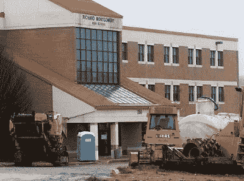
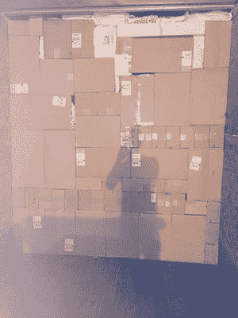
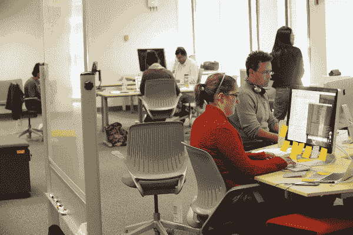

# 我勉强从大学毕业，这没什么

> 原文：<https://www.dataquest.io/blog/i-barely-graduated-college/>

November 11, 2016

我高中成绩不太好。我的平均绩点大约是 2.5 分(满分 4 分)。我在一些我感兴趣的科目上表现很好，比如数学、计算机科学和历史，但是其他的都很差。

一堂课要求我做的作业越少，我的成绩就越好。在大多数课堂上，我都是看着挂钟慢慢地指向我们可以离开的时间。

我对学校没有热情，我也不是那种看起来总是能够适应家庭作业、社交生活、体育和 10 个俱乐部的被驱使的高中生。

由于我自己的不感兴趣，系统把我一笔勾销了。在申请暑期实习时，一位老师为我写了一封反推荐信，警告他们不要选择我。我的父母对我上哪所大学有很高的期望——哈佛、麻省理工或巴斯特。

说这不现实是一种低估。我的指导顾问告诉我，上大学是一件难事。

我的高中被拆了。

我申请了大约 15 所大学，并进入了其中的两所——马里兰大学，我的州立学校和加州大学欧文分校。我最终作为 2008 届的一员去了马里兰。

我来自一个非常看重学习成绩的印度裔美国家庭，所以这是多年来的耻辱。我会告诉人们“我被列入了麻省理工学院的候选名单”，或者“因为学费低，我实际上选择了马里兰”。现在回想起来，这是一种愚蠢的态度，但我当时年轻，我非常看重外表。

在马里兰，我不确定我想主修什么。我父母希望我成为一名医生。我对它不太感兴趣，但我还是上了一些医学预科课程。我选择了通学作为专业(不知道自己想学什么专业的人的专业)，并开始满足我的基本要求。

大学真的是无组织的，我陷入了一种模式，我根本不去上课，也不做作业。大多数课程都很无聊，我根本无法在课堂上学习。当我去上课的时候，我又一次盯着一个钟或我的手表，直到该离开的时候。我发现学习只是我不擅长的事情。

我喜欢一些课程，比如微生物学，我们在培养皿中培养细菌，还有历史和数学课。在我不再去听课之后，我才发现我喜欢多变量微积分——前三分之一的时间我每天都去上课，但考试不及格。考试前，我转而呆在家里看书，并开始得到 A。

至少 UMD 有一个非常漂亮的校园！

我在大学里从来没有真正找到自己的激情，大学也没有提供帮助我找到激情的工具。这意味着我在普通研究中漂泊了一年，然后当我的成绩显然不会让我进入任何医学院时，我将我的专业转向了美国历史。

当你习惯性地认为糟糕的成绩反映了你糟糕的性格时，真的很容易认为你有问题。如果没有一个真正的内部和外部支持结构，这将不可避免地导致萧条和恶性循环。

大学几年后，我决定我需要追求自己的人生目标。其中一部分是支付大学和我自己的生活费用。

没有多少工作适合绩点低的大学生，但体力劳动总是招人。我去了 UPS 当装卸工。我的起薪大约是每小时 8 美元。当人们问我做什么时，我会告诉他们，“我把箱子扔进卡车里”。箱子很快从传送带上下来，我们把它们从传送带上拿下来，扫描它们，然后把它们堆在半挂车里，这些半挂车会被送到其他 UPS“中心”。

这是一面“墙”，以及您如何在 UPS 装载卡车。这是一个很好的-大多数看起来很糟糕。

我最终被提升为“兼职主管”，这意味着我负责管理一个装货区，并管理大约 10 个人。我一周工作 30 个小时左右，其余时间都精疲力尽。我开始不像往常那样去上课了。从好的方面来说，UPS 用他们的报销计划支付了我一半的学费，我有足够的钱支付我的生活费用，甚至还能存一点。

我想既然我的平均绩点接近 2.0，我就应该在大学毕业后继续在 UPS 工作。接下来的两年也是如此。我很喜欢我的一些历史课，特别是我的顶点课程，在那里我学习了二战后日本的重建。2008 年毕业时，我的平均绩点是 2.1。有几次，我差点被留校察看，但通过提前逃课、转到更容易的课程或者更加努力，我成功地摆脱了它。

毕业后，我的选择相当黯淡。ups 的高层希望我留下来，但他们认为我有一个态度问题，我需要先解决这个问题，然后他们才愿意提拔我(UPS 的大多数政策都是落后和空洞的，导致我所监管的人受到伤害，所以我非常沮丧)。

体力劳动的悲剧在于，你的收入潜力在 20 多岁时达到顶峰。我在 UPS 工作了 10 多年的同事都有背部和膝盖问题。我受过几次伤，我的膝盖也不是很好，所以留在 UPS 可能是个糟糕的选择。我在那里学到了很多东西——关于努力工作、激励和管理他人——但这并不是一份长期的工作。

多亏了一个朋友，我最终在百事可乐找到了一份运营经理的工作。大约在我开始在百事可乐工作的时候，我也一时兴起申请了美国外交部。没有多少工作会接受大学平均成绩低和没有“硬”技能的人，但进入外交部门需要通过考试，所以看起来很适合。另外，我对它感兴趣是因为我研究了日本的重建。

我最终进入了外交部门，尽管我最终发现这也不是一个好的长期选择。我开始学习编码是在我在外交部门工作的末期(如果你感兴趣，你可以在这里阅读更多关于这段经历的内容)。

我被派往圭亚那乔治敦从事外交工作。

编程是我的激情所在，但我只是在经历了多年的换工作和怀疑是否能找到有趣的事情后才真正发现了它。

回想起来，有迹象表明。我在中学的时候每天都坐公交车上学，学习给我的 TI-83 计算器编程，然后做一个简单的游戏，让一个怪物在屏幕上追逐你。我在做暑期实习的时候做了脚本来自动化某些任务。我曾经玩过一个网游，黑了一些简单的脚本帮我管理东西。但是我没有意识到脚本可以比一种使“真正的工作”更快更简单的方法更有价值。

我父亲也转行做编程，但他在大型咨询公司工作，做的工作他和我都不觉得特别有趣。我认为这才是“真正的编程”，我所做的所有有趣的脚本都是次要的。即使当我离开外交部，回到美国，继续学习编码，我也没有一个清晰的最终目标。我只是知道我在做一件让我深深感兴趣的事情，所以我一直在做。

我想预测股市，但不知道如何预测。我花时间阅读 C#和 Ruby，并与股票价格引擎进行交互。我最终制定了一个可怕的“算法”，其中包含硬编码的规则(如果股票上周上涨，今天就卖出)。我记得当我发现我可以编写网络代码让一些机器成为“工作人员”并控制一台机器时的兴奋。

我试图预测股票市场。

我写的算法从来没有任何价值，但我对股票价格预测的兴趣让我选择了机器学习，这让我找到了 [Kaggle](https://www.kaggle.com/) 。Kaggle 是一个机器学习的竞赛平台。你可以制作算法，与世界上其他人制作的算法竞争。这是一个很好的替代认证方法——你可以说“我没有麻省理工的学位，但是我在一次 Kaggle 竞赛中打败了几个博士”。

当时卡格尔对我来说是个完美的地方。我每天都在学习、编写算法和比赛。我最终在一次股票交易比赛中获得了 100 名左右的第五名，然后我在债券交易和自动化论文评分方面赢得了一些比赛。我仍然记得我在第一次比赛中表现出色时的感觉，当我情绪低落时回想起来——那种我确实擅长某事的得意洋洋。

卡格尔的伟大之处在于，我突然在这个领域获得了一些认可。我能够利用我制作的自动论文评分算法，帮助我在 edX 找到一份机器学习工程师的工作，这是哈佛/麻省理工学院/伯克利合作的在线学习项目。

我工作的 edX 办公室。

在 edX 的时候，我能够观察到他们如何试图使用技术来提供传统教育系统的替代方案。虽然他们做了很多正确的事情，但我不禁认为有些事情可以用不同的方式来做。

我对改善教育系统产生了浓厚的兴趣，这促使我在 2015 年开始建立 [Dataquest](https://www.dataquest.io/) 。在 Dataquest，我们帮助任何人在浏览器中学习数据科学。我们的学习经验基于我在自己的旅程中学到的许多经验，以及我们对成功的数据科学家如何学习的观察。

在线教育让竞争变得公平——你可以廉价而有效地学到在学校或训练营需要花费数万元才能学到的技能。不幸的是，大多数在线教育没有解决动机的问题。我很幸运，因为我发现了一个问题——预测股市——这个问题深深地激励着我，推动着我前进。许多人没有这么幸运。

我们经常认为激发学生的学习动机是学生的责任，教授课程内容也是学生的责任。如果你没有从一门课程中学到东西，那是你的错，不是课程的错。不幸的是，正是这种心态导致了我对大学的失望。大学的态度是，学习是你的责任，如果你不学，那就是你的错。没有把重点放在让学习变得有趣或向你展示你正在做的事情的实际应用上。

有效的在线教育既能提供信息，又能激励人。如果你有足够的动力，你可以学习并取得任何成就。在 Dataquest，我们通过关注以下几个关键要素，致力于建立一种激励性和参与性的学习体验:

*   有趣的课程。你将通过预测航空事故来学习机器学习，通过寻找 NBA 最好的球员来学习统计学。
*   具有挑战性的项目。项目是有意义的，并且帮助你综合和应用你所学的东西。
*   探索的自由。您可以自由探索课程中的数据，以及课程之外的不同主题和项目。
*   社区互动。向同龄人学习是非常强大和激励人心的。

开始 18 个月后，我们已经帮助数千人改善了他们的职业生涯。你可以在这里阅读他们的一些故事。我们认为应该根据你拥有的技能来评判你，而不是你上过的大学，我们真的很高兴能在改变这个体系方面发挥一点作用。

我们的 Dataquest 浏览器界面。

我开始做我从未想象过的事情，这都是因为我没有让系统决定我应该做什么。发现或追求你感兴趣的东西永远不会太晚。你可以随时改变自己的道路。

如果你和我一样，需要找人聊天，请随时联系，或者给我发电子邮件。我知道这有多难，我也知道和有不同观点的人交谈有多有价值。

如果您对学习数据科学感兴趣，您可以从今天开始免费学习 Dataquest。

## 获取免费的数据科学资源

免费注册获取我们的每周时事通讯，包括数据科学、 **Python** 、 **R** 和 **SQL** 资源链接。此外，您还可以访问我们免费的交互式[在线课程内容](/data-science-courses)！

[SIGN UP](https://app.dataquest.io/signup)