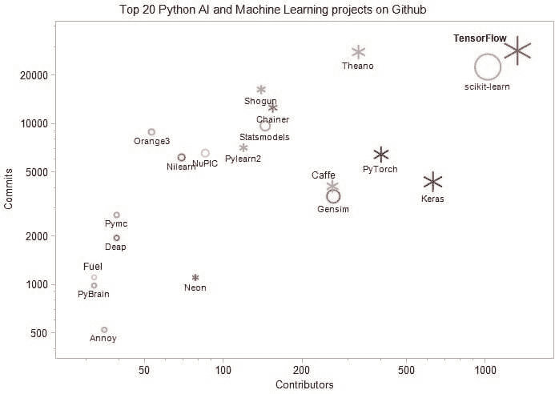

# 20 大 Python AI 和机器学习开源项目

> 原文：<https://www.dataquest.io/blog/top-20-python-ai-and-machine-learning-open-source-projects/>

July 23, 2018

进入机器学习和人工智能领域不是一件容易的事情，但却是数据科学项目的关键部分。许多有抱负的专业人士和爱好者发现很难建立一个合适的进入该领域的途径，因为今天有大量的资源可用。这个领域在不断发展，我们必须跟上这一快速发展的步伐。为了应对这种势不可挡的发展和创新速度，保持更新和了解 ML 进展的一个好方法是通过为许多高级专业人员日常使用的开源项目和工具做出贡献来参与社区。

在这里，我们更新了信息，并检查了自我们上一篇文章[20 大 Python 机器学习开源项目](https://www.kdnuggets.com/2016/11/top-20-python-machine-learning-open-source-updated.html)(2016 年 11 月)以来的趋势。

Tensorflow 以三位数的贡献者增长率跃居第一。Scikit-learn 跌至第二位，但仍拥有大量的贡献者。

与 2016 年相比，贡献者数量增长最快的项目是

1.  TensorFlow 增长了 169%,从 493 人增加到 1324 人
2.  Deap 增长了 86%,从 21 人增加到 39 人
3.  Chainer 的贡献者从 84 人增加到 154 人，增加了 83%
4.  Gensim 增长了 81%,从 145 人增加到 262 人
5.  Neon，增长了 66%,从 47 人增加到 78 人
6.  Nilearn 增长了 50%,从 46 人增加到 69 人

2018 年还新增了:

1.  Keras，629 个贡献者
2.  PyTorch，399 个贡献者

图 Github 上排名前 20 的 Python AI 和机器学习项目。

大小与贡献者的数量成正比，颜色代表贡献者数量的变化——红色较高，蓝色较低。雪花形状用于深度学习项目，圆形用于其他项目。

我们看到像 TensorFlow、Theano 和 Caffe 这样的深度学习项目是最受欢迎的。

下面的列表根据 Github 上贡献者的数量以降序给出了项目。贡献者数量的变化是相对于 [2016 KDnuggets 关于前 20 名 Python 机器学习开源项目的帖子](https://www.kdnuggets.com/2016/11/top-20-python-machine-learning-open-source-updated.html)。

我们希望您喜欢浏览这些文档页面，开始合作并学习使用 Python 进行机器学习的方法。

1.  TensorFlow 最初是由谷歌机器智能研究组织谷歌大脑团队的研究人员和工程师开发的。该系统旨在促进机器学习的研究，并使其快速而容易地从研究原型过渡到生产系统。投稿人数:1324(上升 168%)，提交人数:28476，明星人数:92359。Github 网址: [Tensorflow](https://github.com/tensorflow/tensorflow)
2.  [Scikit-learn](https://scikit-learn.org/) 是用于数据挖掘和数据分析的简单高效的工具，每个人都可以访问，并可在各种上下文中重用，构建于 NumPy、SciPy 和 matplotlib 之上，开源，商业可用–BSD 许可证。投稿人数:1019(上升 39%)，提交人数:22575，Github 网址: [Scikit-learn](https://github.com/scikit-learn/scikit-learn)
3.  [Keras](https://keras.io/) ，高级神经网络 API，用 Python 编写，能够运行在 TensorFlow、CNTK 或 Theano 之上。投稿人数:629(新)，提交人数:4371，Github 网址: [Keras](https://github.com/keras-team/keras)
4.  [PyTorch](https://pytorch.org/) ，强 GPU 加速的 Python 中的张量和动态神经网络。投稿人数:399(新)，提交人数:6458，Github 网址: [pytorch](https://github.com/pytorch/pytorch)
5.  [Theano](https://github.com/pymc-devs/theano-pymc) 允许您高效地定义、优化和评估涉及多维数组的数学表达式。投稿人数:327(上升 24%)，提交人数:27931，Github 网址:[theno](https://github.com/Theano/Theano)
6.  Gensim 是一个免费的 Python 库，具有可扩展的统计语义、分析纯文本文档的语义结构、检索语义相似的文档等特性。贡献者:262 (81%以上)，提交:3549，Github 网址: [Gensim](https://github.com/RaRe-Technologies/gensim)
7.  Caffe 是一个深度学习框架，考虑到了表达、速度和模块化。它是由伯克利视觉和学习中心()和社区贡献者开发的。投稿人数:260(上升 21%)，提交人数:4099，Github 网址:[咖啡馆](https://github.com/BVLC/caffe)
8.  [Chainer](https://chainer.org/) 是一个基于 Python 的独立开源框架，用于深度学习模型。Chainer 提供了一种灵活、直观和高性能的方法来实现全方位的深度学习模型，包括最先进的模型，如递归神经网络和变分自动编码器。贡献者:154 (84%以上)，提交:12613，Github 网址:[链接者](https://github.com/chainer/chainer)
9.  [Statsmodels](https://www.statsmodels.org/stable/index.html) 是一个 Python 模块，允许用户探索数据、估计统计模型和执行统计测试。描述性统计、统计测试、绘图函数和结果统计的广泛列表可用于不同类型的数据和每个估计量。贡献者:144(上升了 33%)，提交:9729，Github 网址: [Statsmodels](https://github.com/statsmodels/statsmodels/)
10.  [幕府将军](https://shogun-toolbox.org/)是一个机器学习工具箱，提供了广泛的统一高效的机器学习(ML)方法。工具箱无缝地允许轻松组合多种数据表示、算法类和通用工具。投稿人数:139(上升 32%)，提交人数:16362，Github 网址:[幕府](https://github.com/shogun-toolbox/shogun)
11.  [Pylearn2](https://github.com/lisa-lab/pylearn2) 是一个机器学习库。它的大部分功能都建立在 Theano 之上。这意味着你可以使用数学表达式编写 Pylearn2 插件(新模型、算法等)，Theano 将为你优化和稳定这些表达式，并将它们编译到你选择的后端(CPU 或 GPU)。贡献者:119(上升 3.5%)，提交:7119，Github 网址:[派拉恩 2](https://github.com/lisa-lab/pylearn2)
12.  NuPIC 是一个开源项目，基于一种叫做分级时间记忆(HTM)的大脑皮层理论。HTM 理论的一部分已经被实现，测试，并在应用中使用，而 HTM 理论的其他部分仍在发展中。投稿人数:85(上升 12%)，提交人数:6588，Github 网址: [NuPIC](https://github.com/numenta/nupic)
13.  [Neon](https://github.com/NervanaSystems/neon) 是 [Nervana 的](https://ai.intel.com/)基于 Python 的深度学习库。它提供了易用性，同时提供了最高的性能。注意:英特尔不再支持 Neon，但是你仍然可以通过 Github 上的内容使用它。投稿人数:78(上升 66%)，提交人数:1112，Github 网址:[霓虹](https://github.com/NervanaSystems/neon)
14.  [Nilearn](https://nilearn.github.io/) 是一个 Python 模块，用于快速简单地对神经影像数据进行统计学习。它利用 [scikit-learn](https://scikit-learn.org/stable/) Python 工具箱进行多变量统计，并应用于预测建模、分类、解码或连通性分析。投稿人数:69(上升 50%)，提交人数:6198，Github 网址: [Nilearn](https://github.com/nilearn/nilearn)
15.  [Orange3](https://orange.biolab.si/) 是面向新手和专家的开源机器学习和数据可视化。带有大型工具箱的交互式数据分析工作流。贡献者:53 人(上升了 33%)，提交数:8915，Github 网址: [Orange3](https://github.com/biolab/orange3)
16.  [Pymc](https://pymc-devs.github.io/pymc/README.html) 是一个 python 模块，实现了贝叶斯统计模型和拟合算法，包括马尔可夫链蒙特卡罗。它的灵活性和可扩展性使它适用于大量的问题。贡献者:39(上升 5.4%)，提交:2721，Github 网址: [Pymc](https://github.com/pymc-devs/pymc)
17.  Deap 是一个新颖的进化计算框架，用于快速原型和想法测试。它试图使算法清晰，数据结构透明。它与多处理和 SCOOP 等并行化机制完美地协调工作。贡献者:39 人(86%以上)，提交时间:1960 年，Github 网址: [Deap](https://github.com/deap/deap)
18.  [aroy](https://pypi.org/project/annoy/)([近似最近邻](https://en.wikipedia.org/wiki/Nearest_neighbor_search#Approximate_nearest_neighbor)哦耶)是一个 C++库，用 Python 绑定来搜索空间中靠近给定查询点的点。它还创建基于文件的大型只读数据结构，这些数据结构被映射到内存中，以便许多进程可以共享相同的数据。贡献者:35(上升 46%)，提交:527，Github 网址:[惹怒](https://github.com/spotify/annoy)
19.  [PyBrain](https://pybrain.org/) 是 Python 的模块化机器学习库。它的目标是为机器学习任务提供灵活、易用但仍然强大的算法，并提供各种预定义的环境来测试和比较您的算法。贡献者:32(上升了 3%)，提交:992，Github 网址: [PyBrain](https://github.com/pybrain/pybrain)
20.  [Fuel](https://fuel.readthedocs.io/en/latest/) 是一个数据管道框架，为你的机器学习模型提供它们需要的数据。计划由[区块](https://github.com/mila-udem/blocks)和[派尔恩 2](https://github.com/lisa-lab/pylearn2) 神经网络库共同使用。投稿人数:32(上升 10%)，提交人数:1116，Github 网址:[燃料](https://github.com/mila-udem/fuel)

贡献者和提交数记录于 2018 年 2 月。

*编者按:这是最初发布在 KDNuggets 上的[，已经被 perlesson 转载。作者 Ilan Reinstein 是一名物理学家和数据科学家。](https://www.kdnuggets.com/2018/02/top-20-python-ai-machine-learning-open-source-projects.html?utm_source=dataquest&utm_medium=blog)*

### 准备好继续学习了吗？

永远不要想接下来我该学什么？又来了！

在我们的 [Python for Data Science 路径](/path/data-scientist/)中，您将了解到:

*   使用 **matplotlib** 和 **pandas** 进行数据清理、分析和可视化
*   假设检验、概率和**统计**
*   机器学习、**深度学习**和决策树
*   ...还有更多！

立即开始学习我们的 **60+免费任务**:

[Try Dataquest (it's free!)](https://app.dataquest.io/signup)