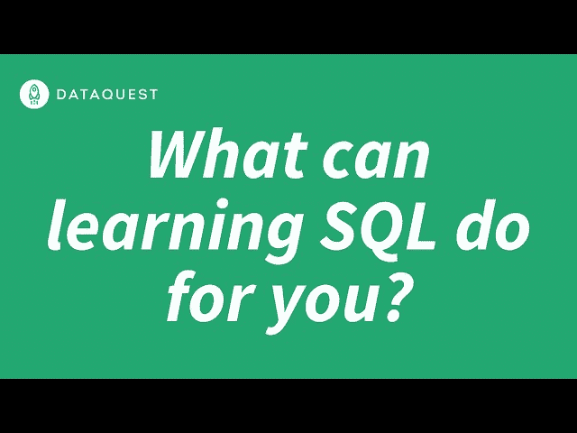

# 学习 SQL 的最佳方法(根据经验丰富的开发人员)

> 原文：<https://www.dataquest.io/blog/best-way-to-learn-sql/>

February 17, 2021

*学习 SQL 最好的方法是什么？*

有了所有可用的资源，以“正确的方式”学习 SQL 可能会很困难。找到学习 SQL 的最佳方法是很棘手的，因为每个人学习的东西都不一样。但是，在培训了成千上万的学生之后——看看哪些有效，哪些无效——我们想出了一些任何人都可以遵循的简单步骤。以下是学习 SQL 的最佳方法:

## 第一步:确定你为什么要学习 SQL

在你开始学习 SQL 课程之前，重要的是要确定你对“我为什么要学习 SQL”这个问题有一个好的答案

这是因为尽管 SQL 并不太难学，但没有一次学习之旅是完全一帆风顺的。你可能会面临挫折和困惑的时刻。如果你没有一个学习 SQL 的好理由，那么在那些时候你很容易就放弃了。

这个问题没有唯一的答案，但这里有一些人们想学习 SQL 的最常见的原因:

*   你感觉被 Excel 卡住了，厌倦了 VLOOKUP
*   您希望能够根据需要轻松访问您公司的数据
*   您希望能够快速处理更大的数据集
*   你想找一份数据分析师、数据科学家或数据工程师的工作(你知道 SQL 是这些工作最重要的技能)
*   您希望创建透明、可重复的数据流程来减少重复性任务

当然，这些只是几个广泛的原因。你需要找一个理由来说服你。它可能是非常具体的事情，比如您想要回答的关于客户的特定问题，或者您想要构建的特定仪表板。

(可以用 SQL 搭建仪表盘吗？算是吧。我们待会再谈！)

## 第二步:学习基本语法

这通常不是人们学习编程语言(或者在这种情况下，查询语言)最喜欢的部分。但这是无法避免的。如果不能看到这样的东西并知道发生了什么，你就不可能达到 SQL *的功能级别:*

```
SELECT c.name capital_city, f.name country
FROM facts f
INNER JOIN (
        SELECT * FROM cities
                WHERE capital = 1
                ) c ON c.facts_id = f.id
LIMIT 10;
```

谢天谢地，学习这个可能比你想象的要容易。虽然乍一看这可能看起来复杂和混乱，但 SQL 的语法实际上非常简单。您实际上经常使用的 SQL 命令列表(上面代码中的 SELECT 之类的全大写单词)很短。

成功完成这一步的关键是尽快完成它。留出几个小时，一次性完成 [Dataquest 的第一个 SQL 课程](https://www.dataquest.io/path/sql-skills)。或者选择另一种学习资源，留出足够的时间来完成基础知识。

这里最重要的是你不要把这个拖出来。你想尽快达到能够用 SQL 实际*做*事情的程度，因为能够深入研究实际问题并找到答案是一个强大的动力。这才是真正能让你保持动力和学习的东西，所以我们想让你尽快达到这一点。

## 步骤 3:开始指导项目的工作

一旦掌握了基础知识，就该开始使用 SQL 深入实际项目了。

如果您在 Dataquest 与我们一起学习，这将是课程的一部分，其中包含交互式指导项目，挑战您使用新的 SQL 技能来查询和分析真实数据库以获得答案。

如果您没有使用 Dataquest 学习，我们建议您退而求其次:指导项目和教程。

您需要找到一些能给您一些结构和指导的东西，因为在这个阶段，尝试从头构建一个完整的 SQL 项目的过程可能会令人沮丧。你想要一些你可以自己尝试去做的事情，但这也提供了一些指导，当你迷路或不确定下一步该做什么时，你可以参考。

例如，[这里有一个关于 SQL](https://www.dataquest.io/blog/sql-joins-tutorial/) 中连接的教程。这将是一个很好的实践，但是尝试自己完成它，只在编写完自己的查询后检查代码片段以确保正确。

请记住，这里的目标是以越来越大的独立性从事指导项目。如果你只是简单地复制粘贴教程中的代码，你不会学到很多东西，所以在检查答案之前，请确保你已经尽了最大努力。

## 步骤 4:熟悉有用的 SQL 资源

一旦你完成了一些有指导的项目，是时候自己走出去了。好消息是:你可以准确地处理你想要的数据，准确地回答你想要的问题。多么激励人心啊！

坏消息是:没有你可以检查的答案！因此，在开始第一个项目之前，标记一些有用的 SQL 资源是很有帮助的。请记住，在谷歌上搜索答案并不可耻——即使是最有经验的 SQL 开发人员和用户也经常这样做！

### 有用的 SQL 资源:

*   [学习 SQL 第二版(PDF)](https://www.r-5.org/files/books/computers/languages/sql/mysql/Alan_Beaulieu-Learning_SQL-EN.pdf) —这本关于 SQL 基础知识的 O'Reilly 书籍，PDF 格式，免费提供，很好的参考。
*   [StackOverflow SQL 问题](https://stackoverflow.com/questions/tagged/sql) —您可能会遇到的任何 SQL 问题都已经在这里得到了解答。但是，如果它还没有创建一个帐户，并要求它为自己！
*   如果 SQL 是您第一次涉足编程领域，您可能还没有一个帐户。如果是这样的话，设置一个并开始学习如何使用它！Github 非常适合与全世界(以及潜在雇主)分享您自己的 SQL 项目，它也是查看其他人代码的一个非常棒的资源。
*   [/r/SQL](https://www.reddit.com/r/SQL/) — Reddit 有一个庞大、活跃的 SQL 社区，并且(大部分)乐于回答问题。
*   [data quest 社区](https://community.dataquest.io) —我们的社区积极友好，随时准备帮助您解决所有的 SQL 问题。最重要的是，它对所有人开放——你不必成为 Dataquest 的订户就可以在那里获得帮助。

## 步骤 5:构建您自己的 SQL 项目

既然您已经知道了一些在遇到困难时可以寻求帮助的好地方，那么是时候开始着手您自己的 SQL 项目了。

这就是你在第一步中想出的答案真正开始起作用的地方。知道你为什么想学习 SQL 可能会帮助你回答这个问题:我应该做什么项目？

简短的回答？做你关心的项目。如果您学习 SQL 是因为厌倦了 Excel 拖慢您的工作速度，那么您的第一个项目可能应该是弄清楚如何使用 SQL 更有效地完成这些工作任务。

如果你学习 SQL 是因为你想要一份特定的工作，你应该做一些 SQL 项目，这些项目应该尽可能地接近你得到这份工作后实际要做的事情。例如，如果你的激情是处理数据，以帮助减少碳排放和提高能源效率，那么你可能会想从事与该目标相关的项目。

我们应该注意:如果你不在一家公司工作，或者如果你不想在你的项目中使用公司数据，这一步可能会有点挑战性。根据您的目标，找到一个所有人都可以免费使用的、包含您想要使用的数据类型的 SQL 数据库可能会很困难。

但是不要害怕！虽然需要一点额外的努力，但是*可以*将你找到的任何 CSV 格式(或类似格式)的可下载数据转换成 SQL 数据库格式，比如[一个 SQLite 表](https://pypi.org/project/csvs-to-sqlite/)。甚至有[网站可以让转换过程变得相当容易](https://konbert.com/convert/csv/to/sqlite)。

无论您想要处理什么数据，只要稍加挖掘，您应该能够找到一种使用 SQL 处理它的方法。

并且不要忘记:当你完成你的 SQL 项目时，在你的 Github 上分享它们。当你学到新的东西时，回去更新它们！

## 第六步:做更高级的项目

最后一步本质上是第五步的延续，你可以重复这个步骤，只要你愿意。在这里继续学习的关键是你必须迎接挑战。

一旦您学会了如何构建最初激励您的 SQL 项目(也许您已经编写了一个查询来替换您的旧 Excel 工作流),沿着这些相同的路线继续做项目会很有诱惑力。

一遍又一遍地做同样的事情对记忆有好处，但是会阻碍你的成长。最好确保每个新项目中，你都在学习或尝试至少一件新事物——一些你还不知道怎么做的事情。

这可能意味着你正在进行一个全新的项目，也可能意味着重新审视一个老项目，赋予它新的复杂性。

这也可能意味着接受你以前从未想过的挑战，例如:

*   您能否将您的 SQL 技能与类似于 [Mode](https://mode.com/) 的工具整合起来，以制作一个仪表板？
*   你能教别人如何使用 SQL 查询你公司的数据库吗？

此时，您将掌握使用 SQL 做您想做的或多或少任何事情的技能——不是因为您知道如何做所有事情，而是因为您的项目构建过程教会了您如何找到您不知道的任何事情的答案。

### 用正确的方法学习 SQL！

*   编写真正的查询
*   使用真实数据
*   就在你的浏览器里！

当你可以 ***边做边学*** 的时候，为什么要被动的看视频讲座？

[Sign up & start learning!](https://app.dataquest.io/signup)

*[https://www.youtube.com/embed/JFlukJudHrk?feature=oembed](https://www.youtube.com/embed/JFlukJudHrk?feature=oembed)*

 *## 关于 SQL 的常见问题:

### SQL 难学吗？

这是一个非常私人的问题——对一个人来说非常容易的事情对另一个人来说可能非常困难，反之亦然。然而，大多数人发现 SQL 非常容易学习，尤其是与 Python 或 r 等全功能编程语言相比。

这是因为与“完整的”编程语言不同，SQL 是一种查询语言。它是专门为与关系数据库管理系统(如微软 SQL Server、Oracle、SQLite、MySQL 等)交互而构建的。由于这个原因，没有那么多要学的东西，一些在更全面的编程语言中必然存在的更复杂的概念在 SQL 中不是一个因素。

也就是说，大多数人发现 SQL 相对容易学习的事实并不意味着你会，或者如果你发现它具有挑战性，你应该感到羞耻！特别是如果这是你第一次涉足编程领域，你应该准备好迎接挑战。

(不过不用担心。不管你的背景是什么，你都可以*完全*学习 SQL。[我们的社区](https://community.dataquest.io)随时为您提供帮助！)

### SQL 和 Python:学哪个好？

这个问题的答案真的取决于你的目标。它们是非常不同的东西。

SQL 是一种查询语言。它实际上只对与数据库交互、过滤和轻微分析数据有用。它为在这些环境中处理数据提供了强大的功能，但它不能做像 Python 这样的完整编程语言所能做的所有事情。

Python 是一种编程语言。这使得学习起来有点复杂，但也意味着它可以做得更多。你可以用 Python 分析数据，但也可以用它来建立机器学习模型。或者制作电子游戏。或者给机器人编程。或者设计艺术。

如果你经常处理数据——如果你每天都在打开电子表格，并且你知道 VLOOKUP 是什么——学习这两种语言很有可能会让你受益匪浅。

在 Dataquest，我们教授 Python 和 SQL，作为我们[数据分析师](https://www.dataquest.io/path/data-analyst/)和[数据科学家](https://www.dataquest.io/path/data-scientist/)职业道路的一部分。这两种技能都是全职数据工作所需要的(虽然 R 可以代替 Python，但是学习 SQL 是没有商量余地的)。

### 可以自学 SQL 吗？

是的。我们已经看到成千上万的学生正是这样做的，他们利用自己的时间，按照自己的进度学习我们的 interactive SQL 课程。

即使您没有使用 Dataquest，也完全有可能自学 SQL。然而，拥有一个你可以求助的支持性社区肯定会让事情变得更容易！

### 你能多快学会 SQL？

简短的回答是:相当快。

更长的答案是，你可以很快学会基本知识——足以发挥作用。即使是兼职学习(例如，在全职工作后的晚上从事 SQL 工作)，许多以前从未编写过代码的学习者也可以实现他们的目标，并能够在短短几个月内完成独立的 SQL 项目。

如果你有一些编程经验和/或你愿意每天多花一点时间学习，你可以学习足够的 SQL 来完成你的目标，甚至比这更快！

但是尽管如此，学习 SQL 就像学习任何语言一样——从来没有真正的终点。即使是每天都在工作中使用 SQL 的专业人士也仍然不时地学习新的东西。学习任何编程语言都应该被视为一个终生的旅程，而不是在几个月内开始和结束的事情。

### 用正确的方法学习 SQL！

*   编写真正的查询
*   使用真实数据
*   就在你的浏览器里！

当你可以 ***边做边学*** 的时候，为什么要被动的看视频讲座？

[Sign up & start learning!](https://app.dataquest.io/signup)*