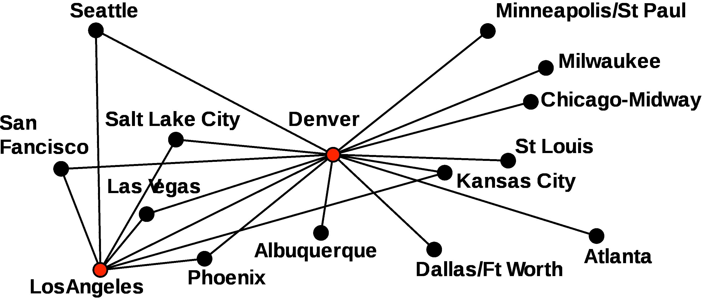
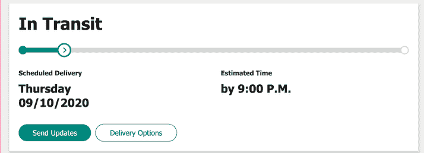
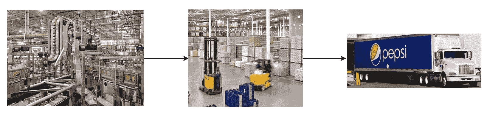
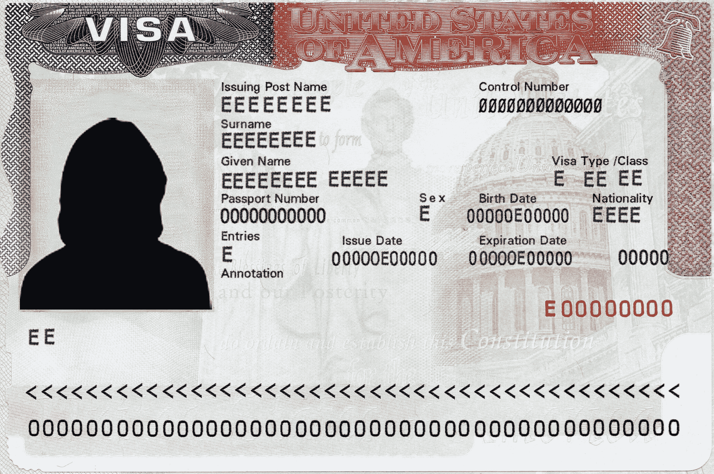

# 你需要数据技能来保证你的职业生涯不会过时

> 原文：<https://www.dataquest.io/blog/data-skills-to-future-proof-your-career/>

April 5, 2021

无论你在哪个行业，你都需要数据技能来为你的职业生涯做好准备。

你可能会想: *Vik 是一家教授数据科学的公司的首席执行官，他当然会这么说！*但请继续关注我的文章，我将带您了解数据是如何成为我所有工作的关键。

在我开始 Dataquest 之前，我做过很多不同的工作。我曾是 UPS 的装卸工，百事可乐的物流主管，美国外交官，数据科学顾问，edX 的机器学习工程师。

*(如果这听起来像一个奇怪的职业道路，你可以在这里阅读更多我的故事:[我勉强大学毕业，没关系](https://www.dataquest.io/blog/i-barely-graduated-college/)。)*

回过头来看，**我的每一项工作都有一个数据部分**。为了出类拔萃，无论我是把箱子装到卡车上，还是创建论文评分算法，我都需要能够使用数据。

随着时间的推移，**这些角色变得越来越以数据为中心**。今天走进这些工作岗位的人会比我有更多的机会将数据融入到他们的角色中。

## 在 UPS 使用数据

您可能会惊讶地发现，UPS 的装载员需要一些数据技能。为了解释原因，我需要讨论一下 UPS 是如何工作的。

你可能熟悉标志性的棕色 UPS 送货卡车。这些卡车在一条路线上装载包裹，然后回到一个集散地卸货。

在那里，包裹被分类并装入拖拉机拖车，运往目的地。

但是从芝加哥到旧金山的包裹不会直接送到那里。它在到达目的地之前要经过中间枢纽。

我的工作是在一个中心把包裹装进拖车里。为了将正确的包裹装上正确的卡车，我会在装货时扫描包裹。这使得 UPS 能够跟踪我的工作效率。它还使 UPS 能够通过其枢纽跟踪包裹。

我使用扫描数据来跟踪我和团队中的其他人每晚装载了多少包裹。我根据这些数据优化了我的团队成员工作的卡车。我还利用这些数据来决定何时要求更多的雇员。

数据还使 UPS 能够优化他们的路线，为他们的枢纽配备人员，并预测未来的需求(尤其是季节性需求)。

例如:你可能听说过著名的 UPS[没有让它的送货卡车左转](https://www.ups.com/us/en/services/knowledge-center/article.page?kid=aa3710c2)。这是由于优化路线的算法。UPS 还通过使用数据预测需求，在每年的旺季雇佣员工。

随着 UPS 向自动化枢纽转移，数据技能对员工来说越来越重要。现在可以准确地跟踪在任何给定时间有多少包裹流经一个枢纽，以及它们的去向。

即使一个枢纽的效率有一点点的提高，也能让 UPS 获利数百万美元。随着时间的推移，数据技能实际上对 UPS 越来越重要，并且是他们战略的核心部分。

## 在百事可乐使用数据

在百事可乐，我在一家生产汽水的工厂工作。这项工作需要使用的数据比我在 UPS 使用的还要多。

汽水制成后，我们要么把它储存在我们的仓库里，要么把它运到其他仓库。在仓库里，我们会将苏打装上卡车或拖拉机拖车，运送给顾客(超市、便利店等)。

我们不想生产太多或太少的任何种类的汽水，所以我们必须预测顾客的需求。我们还必须知道我们的仓库里有多少苏打水，这样我们就不会有太多的库存。

我的工作是计算出我们仓库里有多少苏打水，然后把它输入到我们的生产计划中。

令人惊讶的是，我们计算仓库里有多少苏打水的方法是每天数几次。我们知道我们生产了多少苏打，流出了多少，但当我加入时，没有办法结合这些数据做出更好的估计。我通过组合这些信号改进了我们的估计。

这种类型的数据工作对百事来说越来越重要。喝太多或太少任何一种汽水都会花费数百万，而数据可以提高利润。**百事在**投入巨资 [**数据培训**全公司](https://www.pepsico.com/news/story/3-ways-to-build-the-workforce-of-tomorrow)也不足为奇。

## 作为外交官使用数据

我在国务院担任美国外交官的工作是我与数据打交道最少的地方。但是数据仍然是我工作的一部分。

我面试了移民和非移民签证的申请者。鉴于有多少人通过了面试资格预审，我知道我和其他外交官每天要面试多少人。

我们还跟踪了每个人每天面试多少人，以及我们的签证批准率。批准率很重要，因为你不想拒绝合格的申请人，或者批准不合格的申请人。这帮助我们优化了工作方式，尽管我们承认没有尽可能多地使用数据。

根据我的经验，政府是数据使用最不复杂的部门。但是这种情况正在改变。国务院正在任命一名 T2 首席数据官。数千名外交官正在接受如何有效使用数据的培训。

这样做的原因是，数据可以帮助外交官更有效——它可以帮助他们批准签证的合适人选。我甚至可以想象未来，签证审批是一个自动化的过程，没有人在循环中。

数据也有助于对单个国家的经济和政治进行更细致入微的报道。这方面的一个例子是国务院已经公布的人道主义数据。

数据技能在国务院刚刚开始变得重要，但在不久的将来，它们将成为外交的重要组成部分。

## 你需要数据技能

我自己的职业经历表明，无论你是在航运业、制造业还是政府部门，数据都很重要。而这只是冰山一角。

**数据正在改变几乎每个行业的角色**，包括[医疗](https://www.mmm-online.com/home/channel/merck-diversifies-its-big-data-agenda/)、[金融](https://digital.hbs.edu/platform-rctom/submission/developing-machine-learning-and-proprietary-data-sets-at-goldman-sachs/)和[旅游](https://www.traveldatadaily.com/talking-data-hilton-vp-crm/)。像 UPS 和百事可乐这样的公司正在利用数据作为竞争优势。未来几年，这些公司将需要越来越多具备数据技能的人。

开放数据角色比拥有合适技能的人多得多。因此，企业需要在内部培养数据技能，而不是通过招聘。在精通数据的公司中获得成功和晋升的人将是能够理解和有效使用数据的人。

**现在是学习数据技能的最佳时机。**我在国务院结束工作后就完成了转变，数据技能将我的职业生涯带到了我从未想象过的地方。如果你准备好迈出下一步， [Dataquest](https://www.dataquest.io) 是一个很好的起点。