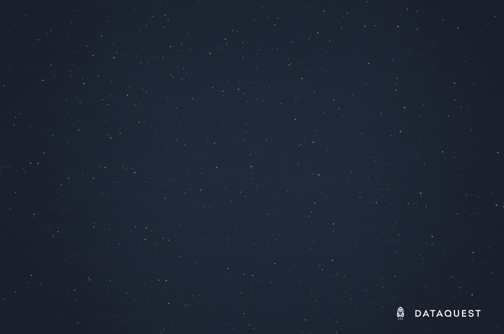

# 新课程:R 中的统计基础和 R 中的概率基础

> 原文：<https://www.dataquest.io/blog/learn-statistics-in-r/>

August 27, 2019

我们在 R path 的不断扩大的[数据分析师今天有两门新课程，它们都是关于帮助你使用 R 学习统计学。](https://www.dataquest.io/path/data-analyst-r/)

[*R*](https://www.dataquest.io/course/statistics-fundamentals-r/)中的统计基础知识和[*R*](https://www.dataquest.io/course/probability-fundamentals-r)中的概率基础知识是全新的互动课程，它们将建立在您在之前课程中开发的 R 编程技能的基础上，同时教授您统计和概率中的关键概念。

学习这种数学对于有效的数据科学工作至关重要，因为能够用代码执行某些东西并不等同于理解它是如何工作的。为了做出正确的决策，并确保您的分析测量的是您希望它测量的东西，您需要牢固地掌握统计数据，以及在您的代码“引擎盖”下您的数据发生了什么。

但是不要担心——仅仅因为它是数学并不意味着它一定是痛苦的！像所有 Dataquest 课程一样，这些新课程是交互式的，当您分析真实世界的数据集以解决现实的数据科学问题时，它们将通过 R 编程教您统计学和概率。

[statistics in r course](https://www.dataquest.io/course/statistics-fundamentals-r)[probability in R course](https://www.dataquest.io/course/probability-fundamentals-r)

## 在 R 中我将从统计学基础中学到什么？

在 R 的*统计学基础课程中，你将学会提出更好的问题，并就如何分析数据做出更明智的决定。您将学习使用统计方法来发现隐藏的模式，并且您将学习如何通过 R 编程来实现一切，以便它适合您现有的数据科学工作流。*

具体来说，您将从学习抽样开始，并进一步了解如何执行分层抽样和整群抽样。然后你将学习统计学中的变量，并了解用于测量变量的不同尺度。

接下来是频率分布、绝对和相对频率、分组频率分布和百分位数。您将了解这些概念，并练习使用它们来识别数据中的模式，进行跨类别的比较，并使大量数据集更易于管理。您还将学习使用各种可视化工具，如分组条形图、阶跃直方图、内核密度图等，来比较频率分布并更好地理解数据中的模式。

在整个课程中，您将分析来自 WNBA 的真实世界体育数据。然后，一旦你完成了所有的主要概念，你将面临的挑战是把所有新的 R 统计技能放在一起，建立一个分析 Fandango 上电影评级的指导性项目。

完成本课程后，您将对使用各种方法进行数据采样感到舒适。您将对数据结构有更好的理解，并且能够轻松地创建、可视化和比较频率分布表。

## R 中的概率基础我会学到什么？

在 R 的*概率基础课程中，你将通过分析彩票数据时钻研概率来加深你的统计技能。*

在整个课程中，你将使用你的 R 编程技能和你所学的统计学知识来估计经验和理论概率。你将学习概率的基本规则，然后解决日益复杂的概率问题。

您还将了解概率的独立性，对于某些类型的数据科学建模来说，这是一个需要理解的重要概念。

最后，你将面临一项挑战，即测试你所有的新技能和 R 编程，设计一个移动应用程序的功能，通过向人们提供各种不同情况下中奖概率的准确信息，帮助他们戒掉赌博瘾。

课程结束时，你将能够计算随机实验的概率，并使用组合和排列公式来计算潜在结果的数量。您还将能够设置基本的模拟，并使用这些来计算概率。

## 为什么要用 Dataquest 学习？

有很多地方可以学习统计和概率，但是使用 Dataquest 学习有一些特殊的优势。

首先，我们进行交互式教学，要求你运用你的 R 编码技能应用新概念，并在每个屏幕上检查你的工作。这意味着你将获得关于你是否真正理解你所学内容的即时反馈，同时你也将在建立你的统计学专业知识的同时强化你的 R 技能。

简而言之，Dataquest 平台。

我们还使用真实世界的数据，并通过要求您解决现实的数据科学问题来进行教学。对于许多学生来说，这使得在 Dataquest 上学习比解决抽象的样本问题或阅读教科书中的公式更有趣、更有吸引力。你对你正在做的事情越感兴趣，你就越有可能坚持下去。这就是为什么我们努力让我们的课程变得有趣并与您的数据分析目标相关。

如果你已经是 Dataquest 的订阅者，现在就开始在 R 中建立统计专业知识吧！如果你还不是订户，[查看我们的计划](https://www.dataquest.io/subscribe/)，看看你错过了什么。

## 获取免费的数据科学资源

免费注册获取我们的每周时事通讯，包括数据科学、 **Python** 、 **R** 和 **SQL** 资源链接。此外，您还可以访问我们免费的交互式[在线课程内容](/data-science-courses)！

[SIGN UP](https://app.dataquest.io/signup)