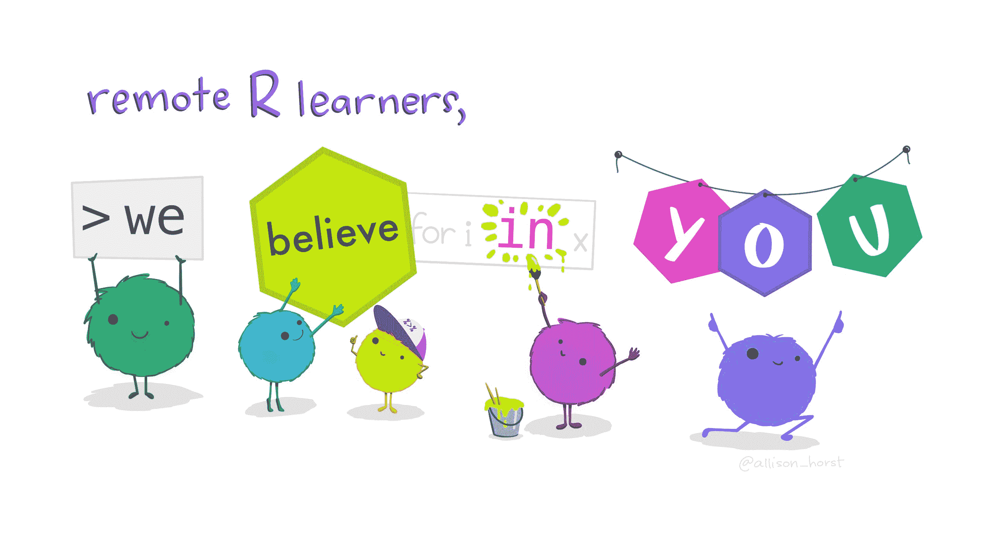

# 用艺术让学习编码更友好——艾莉森·霍斯特博士访谈录

> 原文：<https://www.dataquest.io/blog/making-learning-to-code-friendlier-with-art-allison-horst-interview/>

September 16, 2020

*模糊怪物的鼓励能帮助你学习编码吗？(来源: *[艾利森霍斯特的 Github](https://github.com/allisonhorst/stats-illustrations) *)***

当你想到数据科学和编程时，你可能不会想到艺术。你可能不会把代码中的函数描绘成可爱的、模糊的怪物，或者把你的数据描绘成彩色的宝石。但艾莉森·霍斯特医生知道。

如果你以前考虑过学习 R，很有可能你熟悉 Allison 的工作。她是加州大学圣巴巴拉分校布伦环境科学与管理学院的数据科学、统计学和科学传播助理教授，但她也是 RStudio 的常驻艺术家，在那里她制作了如下插图:

*说明 dplyr::mutate*

*展示扫帚包装。*

*展示数据科学社区！*

(顺便说一下，这些图片来自 [Allison 的 Github](https://github.com/allisonhorst/stats-illustrations) ，在那里它们和更多图片可以在 CC4.0 许可下获得)。

如果看着那些可爱的绒毛球让你的脸上有片刻的微笑，那么，这就是重点。Allison 的 R art 有一个非常具体的目的，它有力地反映了 R 社区的一些特殊之处。

## 将艺术带入数据科学

艾莉森的学术背景是工程和环境科学——她攻读的博士学位是关于纳米粒子如何与细菌相互作用的。

“从我很小的时候起，我就一直在做艺术品，”她说，“作为一名普莱恩空中风景画家，我有美术方面的背景。我只是喜欢能够走到大自然中，画出我所看到的东西。”

“当我开始教学时，我注意到当我在许多其他领域如生态学和海洋科学中寻找时，他们会有这些他们在野外工作的美丽照片和他们正在工作的有机体的非常酷的插图。”

霍斯特博士

“与此同时，当我教授数据科学时，我会尝试制作代表数据科学和统计学的引人入胜的幻灯片，但我对自己的发现并不感到兴奋。”

“在某一点上，我意识到我正在试图教一个班级，我正在从 dplyr 引入 mutate 函数，”她说。"在我身后的屏幕上是这个包的 R 文档的截图."

“我想:这是一个严重的不匹配！我站在这里说，“这太酷了！“Mutate 太棒了，看看你能做的这些很酷的事情！”然后在我身后的屏幕上就是这些密集的文本，上面有他们不理解的论点。"

她就是这样开始做 R 插画的。“我想，‘第一次向学生介绍一项功能时，肯定会有更好的视觉入口。’"

“我真的希望学生们对某个功能的第一印象是友好和丰富多彩的。他们以后会用它做很多困难的事情。但我想，如果他们的第一印象和互动真的很吸引人，那不是很酷吗？"

虽然使用模糊 R 字符学习数据科学的长期影响尚未得到评估，但 Allison 说她肯定注意到了差异。“当我(现在)介绍某样东西时，我会在背景上放一张幻灯片(上面有那些人物)，然后一教室的学生都在微笑，”她说。

“那对我来说，是最好的事情。人们可能是第一次被介绍一些关于编码的东西，他们对此很开心。”

多年以后，这仍然是驱使她把 R 函数变成可爱的、模糊的生物的原因。“所有这一切都是为了实现一个目标，即努力让 R 和数据科学在总体上变得更加平易近人，更受欢迎，并吸引不同的学习者。”

## 加入#rstats 社区和 RStudio

起初，虽然，艾莉森的插图是严格为她的课堂上的学生。“我多年来一直拒绝加入 Twitter，”艾莉森说，“直到我为 [Openscapes](https://openscapes.org) 做艺术工作，我亲爱的朋友和令人敬畏的海洋数据科学家[Julia Lowndes](https://jules32.github.io/)博士最终说服我【在那里分享一些艺术作品】”

“我想我分享的第一个可能是 dplyr 牧马人。社区的反应如此积极，如此支持，这让我想做更多的艺术作品。”

“我从社区中获益良多，不仅从艺术技能和数据科学技能方面学到了东西，还鼓励我做出创造性贡献。我开始创作更多的作品，仍然专注于为我的研究生创作艺术品，但似乎有更广泛的观众欣赏这些插图。”

2018 年，当艾莉森在[国家生态分析中心&综合](https://www.nceas.ucsb.edu/)担任常驻艺术家时，RStudio 联系了她，为 2019 年 RStudio 大会上的“一丘之貉”会议提供一些工作。那次合作变成了更多的合作，并最终成为 RStudio 的驻场艺术家。

“我和 Hadley(Wickham)谈过我想做什么，主要是继续以降低学习障碍和欢迎更多 R 用户的方式贡献艺术作品，”她说。

“从那时起，我就一直在为教育和宣传做艺术作品，只是因为我认为这对人们来说很有趣[……]从去年秋天开始，我一直很高兴成为 RStudio 的常驻艺术家，并且非常兴奋能与他们合作。”

## R 社区和包容性的重要性

如果你搜索大多数数据科学公司的工作列表，你不太可能找到一个“驻场艺术家”的职位。那么 RStudio 为什么不一样呢？

“RStudio 如此投入，证明了他们重视友善，欢迎并支持不同的学习者，”Allison 说。“我认为，支持有助于实现这一目标的艺术品是他们这样做的众多方式之一，是让社区变得更加包容的广泛努力的一部分。”

包容性是整个 R 社区显而易见的价值观。你只需浏览 Twitter 上的#rstats 标签就能明白这一点。艾莉森说，部分原因是良好的领导力:“我认为看到那些价值观从最高层的人那里可见并被表达出来是非常令人惊讶的。”

“R 社区的领导者(RStudio 和其他团体的领导者)对这些价值和优先事项的了解，鼓励其他人知道这些是这个社区重视的事情。”

这些价值观在 R 社区中根深蒂固。这一点从有影响力的、包容性的和注重多样性的组织的存在中显而易见，如 [RLadies](https://rladies.org/) 、 [R-Forwards](https://forwards.github.io/) 、 [Minority R Users](https://twitter.com/miR_community) 、 [Africa R Users](https://twitter.com/AfricaRUsers) 、 [LatinR](https://twitter.com/LatinR_Conf) 等等。

“我认为 R 社区感到如此包容的另一个最大原因是因为 RLadies，”Allison 说。“我真的很高兴看到其他倡议开始启动，如 [Minority R Users](https://twitter.com/miR_community) ，这是由 [Dorris Scott](https://twitter.com/Dorris_Scott) 和 [Danielle Smalls-Perkins](https://twitter.com/smallperks) 启动的。并使社区更加多样化和包容。”

*(我们最近采访了 Shelmith Kariuki，他是 Africa R 用户的领导者之一— [点击此处阅读采访。](https://www.dataquest.io/blog/top-tips-for-learning-r-from-africa-rs-shelmith-kariuki/) )*

*Hadley Wickham 讲座“函数式编程的乐趣(数据科学)”系列插图之一*

## 给 R 初学者的建议

凭借多年的 R 教学经验，Allison 也有一些关于 R 初学者如何帮助自己实现目标的想法。

她的第一条建议并不令人惊讶:“尽早加入社区。这是支持和鼓励以及分享新工具的重要来源。”

“这看起来很可怕，”她说，“因为你会说，‘这些人我一个都不认识！’我认为新用户会对 R 社区的支持程度感到惊讶，特别是在 Twitter 上，但也在会议和 R-Ladies 上。"

“对于各个层次的用户和学习者来说都是如此。每个人都很兴奋你想学习 R 并加入这个社区。我希望几年前我就能说服自己，这有多么重要，有多么激励人心。”

第二，她说，是利用 R 社区提供的惊人的免费资源。“这个社区也真的致力于开放大量学习材料，”她说。“这包括视频课程和 [bookdown](https://bookdown.org/yihui/bookdown/) 中的书籍、数据科学在线学习社区的[R](https://www.rfordatasci.com/)，以及教程和博客帖子。”

“我认为自从我使用 R 以来，我从博客帖子中学到了比任何其他学习方式都多的新技能，”她说，“所以拥抱那些人们一直在 R 社区中自由创建和分享的非传统和惊人的资源和教程。”

(Dataquest 提供了[免费的交互式 R 课程](https://www.dataquest.io/path/data-analyst-r/)以及[不断增加的免费 R 教程库](https://www.dataquest.io/r-tutorials-for-data-science/)，在这篇文章的最后还有一个其他有用 R 资源的列表。)

另一个建议？“不要觉得每次都要做一个大项目才能学到东西，”艾莉森说。“每周尝试一项新功能。参与[整理星期二](https://twitter.com/hashtag/tidytuesday)。经常做一些无关紧要的事情。我认为这是开始感到舒适的最好方式。”

她说，这是她在自己的教室里采用的方法。“我试图以这种方式推动我的任务，朝着高频率、低风险、高多样性、小任务的方向发展，以培养更多技能，创造重复的舒适感。”

“我认为，重复对学习者来说真的很有价值。”

Allison 还鼓励新的学习者尝试一些东西，并在网上分享他们的工作，即使他们已经尝试的东西不起作用。“我喜欢看到人们发布不完美的东西，”她说。“这不是比赛。不一定要完美。关键是你尝试了一些东西，你做了一些练习，然后你与人分享。这就是整洁星期二的精神。”

她还为希望转行从事数据科学的人提供了一些建议:接受你已经拥有的学科领域知识，并将其与你的数据技能相结合。“这种组合真的很强大，”她说。当你有领域专业知识时，你可以说，“我不仅有领域专业知识，而且最重要的是，我有回答这个领域问题所需的技能。"

“有这样一个人真的很强大，他可以进来说，‘我可以做所有这些数据分析，但我也足够了解如何负责任地做这件事，并与不同的利益相关者沟通。’"

## 更多 R 和数据科学艺术:

*   阿米莉亚·麦克纳马拉制作酷酷的 R/tidyverse 布料，包括 [R 面具](https://twitter.com/AmeliaMN/status/1285256644830433280)
*   [生成艺术](https://www.data-imaginist.com/art)由[托马斯·林·彼得森](https://twitter.com/thomasp85)用 R 和 tidyverse 包装创作
*   [生成艺术](https://art.djnavarro.net/)由[丹妮尔·纳瓦罗制作](https://twitter.com/djnavarro)
*   茶杯，长颈鹿，&统计数据德西里·德莱昂和哈塞·瓦勒姆

### 准备好提升你的 R 技能了吗？

我们 R path 的[数据分析师涵盖了你找到工作所需的所有技能，包括:](/path/data-analyst-r/)

*   使用 **ggplot2** 进行数据可视化
*   使用 **tidyverse** 软件包的高级数据清理技能
*   R 用户的重要 SQL 技能
*   **统计**和概率的基础知识
*   ...还有**多得多的**

没有要安装的东西，**没有先决条件**，也没有时间表。

[Start learning for free!](https://app.dataquest.io/signup)