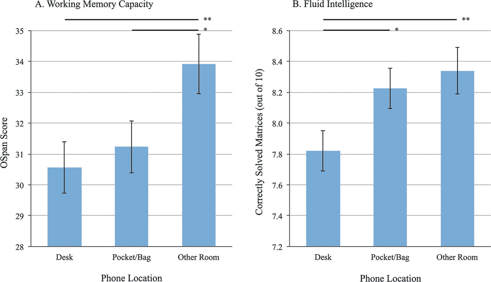

# 手机邻近效应:你的手机可能会破坏你的学习

> 原文：<https://www.dataquest.io/blog/phone-proximity-effect/>

February 7, 2019

想知道你能做些什么来使你的学习时间更有效？科学表明，一个答案是让你和你的手机保持一定的距离。即使你确信你的手机没有让你分心，你也可能成为“手机邻近效应”的受害者。

什么是**手机邻近效应**？简而言之，这是一个想法，当你的手机离你很近时——当它触手可及时——你的认知表现会受到负面影响，即使你实际上并没有使用它。令人惊讶？也许吧，但最近一些非常有趣的科学证实了这一点:

例如，【2017 年，德克萨斯大学的一些学者对近 800 名智能手机用户进行了研究。研究人员有兴趣了解智能手机的存在对认知表现的影响，因此他们将受试者分为三组:

*   **【desk】**组把他们的手机带到测试区，正面朝下放在桌子上。
*   **“口袋/包”**组将手机带入测试区，但放在口袋或包里。
*   **【其他房间】**组在进入测试区之前，将手机放在另一个房间。

这三组人都被要求将手机调成静音，并关掉震动，这样在测试过程中就不会有电话、短信或通知干扰他们。

一旦进入测试室，受试者就要完成几项旨在测量认知表现的测试。然后，他们回答了一份问卷，询问他们在测试中思考手机的频率，以及他们是否认为手机的位置会影响他们的表现。

## 智能手机带来的“人才流失”

*每项认知测试的“书桌”、“口袋”和“其他房间”组的结果。*

结果相当惊人。“书桌”组在两项认知测试中表现最差，“口袋/包”组位居第二。在两次测试中，“另一个房间”组表现最好。认知测试的结果强烈表明，我们的手机离我们越近，我们的表现就越差，即使它是静音的。

考虑到学生们可能一直在偷偷查看通知，研究人员进行了一项类似的实验，并要求一些学生完全关闭手机。但事实证明，这并不重要——认知能力表现最差的是“书桌”学生，最好的是“另一个房间”的学生，即使他们的手机是关着的。

也许更重要的是问卷调查的结果:绝大多数受试者认为他们的手机没有影响他们的表现，并报告说他们在测试期间没有考虑过他们的手机。

这项研究的意义相当重大:**手机在身边会让我们表现更差，但我们没有意识到这有影响。**

该研究的作者之一，Adrian Ward，[解释说](https://news.utexas.edu/2017/06/26/the-mere-presence-of-your-smartphone-reduces-brain-power/)问题是即使不去想某件事也需要努力:“你的意识不会去想你的智能手机，但这个过程——要求你不去想某件事的过程——会耗尽你有限的认知资源。这是人才流失。”

换句话说，当你的手机触手可及时，你大脑的某个部分必须工作，以防止你被它分散注意力。当它在一个不同的房间，不容易接近时，这种影响明显减弱。

当然，这只是一项单独的研究，但是 **[一项更早的研究](https://www.researchgate.net/publication/277903201_The_Mere_Presence_of_a_Cell_Phone_May_be_Distracting_Implications_for_Attention_and_Task_Performance)提出了完全相同的事情**。在那项研究中，缅因大学的研究人员要求受试者完成旨在测量认知功能和注意力的任务，每项任务根据难度水平进一步细分。研究人员随后假装在测试时不小心将手机或笔记本落在了受试者的桌子上。

正如你所料，桌上有手机的学生表现明显比有笔记本的学生差。在接下来的实验中，研究人员证实，无论手机是谁的，这种效应都存在:被要求在考试时把自己的手机放在桌子上的学生比没有放的学生表现更差。这是手机邻近效应在起作用。

智能手机对学习和认知表现的负面影响也在最近的其他一些研究中得到了证明。

例如，[2018 年发表在*计算机和人类行为*上的一项研究](https://www.sciencedirect.com/science/article/pii/S0747563218301912)发现，被手机分散注意力的学生对简短讲座的记忆更少(在随后的测试中表现更差)。一项[类似的研究](https://www.tandfonline.com/doi/abs/10.1080/03634523.2013.767917?journalCode=rced20)发现，在课堂上使用手机的学生笔记更差，在后续评估中表现更差。另一项研究发现，禁止使用手机的学校在禁止后考试分数更高。日本的一项研究甚至发现，手机的物理位置可能会影响你工作时最关注的电脑屏幕部分。

## 你能做什么？

首先，永远值得记住的是，实验结果可能有偏差或完全错误，你应该做对你最有利的事情。在这种情况下，有相当多的研究表明类似的结论，但你在学习时如何对手机的存在做出反应不一定遵循这些研究人员在他们的研究中发现的结果模式。

也就是说，如果你想提高自己的表现，这些结果为你的数据科学学习课程(或你正在从事的任何类型的研究)提供了一些非常明显的建议:

首先:**把手机放在不同的房间**。正如得克萨斯州的一项研究表明的那样，即使手机静音或关机，即使你确信它不是*而是*在影响你，手机放在身边也会伤害你的认知能力。当你留出时间学习时，最好把手机放在另一个房间。

第二:**关掉铃声(如果可以)**。虽然德克萨斯的研究表明，即使在手机静音的情况下，手机邻近的负面认知影响也会持续存在，但其他研究表明，与手机的直接互动也会影响表现——如果你在另一个房间听到手机的嗡嗡声或铃声，这种情况仍然可能发生。

显然不是每个人都能做到这一点；如果你有家人需要你在紧急情况下提供帮助，那么学习期间认知能力的提高可能不值得失去联系。但是如果你能关掉手机，把它放在另一个房间里，你就能让你的大脑尽最大努力忘记你可能错过的通知，并专注于手头的任务。

还值得记住的是，这项研究仅适用于当你试图做其他事情时被手机分散注意力的情况(比如在你的数据科学研究中完成[最新的 Dataquest 课程](https://app.dataquest.io/login))。如果你正在用手机做一些*的事情，比如阅读[这些免费的数据科学电子书](https://www.dataquest.io/blog/data-science-books/)，你可能不会因为切换到在电脑上阅读并收起手机而获得任何性能提升。*

## 获取免费的数据科学资源

免费注册获取我们的每周时事通讯，包括数据科学、 **Python** 、 **R** 和 **SQL** 资源链接。此外，您还可以访问我们免费的交互式[在线课程内容](/data-science-courses)！

[SIGN UP](https://app.dataquest.io/signup)