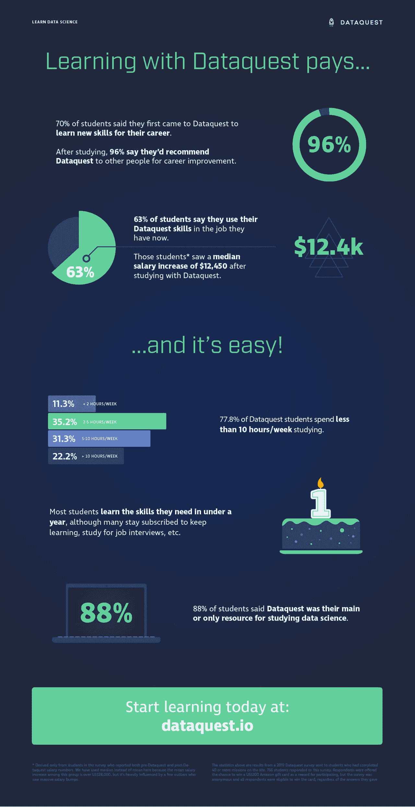

# 增加技能和薪水:学生如何复习 Dataquest

> 原文：<https://www.dataquest.io/blog/dataquest-reviews-survey-2019/>

April 11, 2019

我们最近调查了长期 Dataquest 学生 *(n = 766)* ，以获得对我们平台的评论，并了解他们是否获得了他们想要的职业成果。请查看下面的信息图，以直观的形式了解我们在调查中的发现，或者向下滚动以了解更多详细信息。

T4】

## 学生称 Dataquest 改善职业生涯

学生告诉我们，改善他们的职业生涯是学习数据科学的一大动力。70%的受访者表示，他们带着一些职业发展的希望来到 Dataquest，48%的人对职业感兴趣，32%的人希望学习有助于当前工作的技能。

看起来，绝大多数学生离开时都觉得他们得到了他们想要的。高达 96%的学生表示，他们会将 data quest 推荐给希望改善职业机会的人。62.5%的学生表示，他们在目前的工作中运用了在 Dataquest 中学到的技能。

我们的数据还表明，这些技能是有回报的。在这 62.5%的学生(目前正在工作中使用 Dataquest 技能)中，受访者在将他们开始 Dataquest 之前的工资与他们目前的工资进行比较时，发现工资中位数增加了 12，450 美元。

(注意:这个数字*不包括全日制学生，因为他们 0 美元的薪水会使结果失真。还要注意，我们在这里使用的是中位数而不是平均值，因为超过 28，000 美元的平均工资增幅更高，这主要是由于一些离群值看到了巨大的工资增长。)*

## 学习数据科学很容易！

嗯，也许不*容易*—学习数据科学绝对是一项艰苦的工作！但是用 Dataquest 学习并不一定要破坏你的时间表:77.8%的学生说他们每周花在学习上的时间少于 10 小时。这仍然很难——只有 11%的学生每周只学习两个小时或更少——但即使是全日制学生和员工，每周也能抽出 5-10 个小时。

大多数学生表示，他们在短短 2-6 个月内就达到了最初的学习目标，尽管许多人仍然订阅了该平台，以便他们可以不断增加新技能，为面试而学习，并继续使用该平台进行练习。

学生能够进步如此之快的部分原因可能是他们不必去别处寻求帮助或补充学习资源。88%的学生表示，Dataquest 是他们用来学习数据科学的主要或唯一平台。

## Dataquest 评论已经出来了

Dataquest 能帮你找工作吗？绝对的。你需要致力于这个项目并投入时间，但它确实有效。Dataquest 可以帮助你，就像它[帮助许多其他学生](https://www.dataquest.io/blog/topics/student-stories/)改善他们的职业生涯并朝着数据科学梦想努力一样。

你不必相信我们的话。在在线课程评论网站上查看我们的学生评论，如 [Switchup](https://www.switchup.org/bootcamps/dataquest#tablist-tab-review) 或[课程报告](https://www.coursereport.com/schools/dataquest#/reviews)或 [G2 人群](https://www.g2.com/products/dataquest/reviews)或任何其他学生评论 Dataquest 的地方，你会发现许多快乐的学习者。

[报名参加我们的免费课程](https://www.dataquest.io/)并查看[我们的免费数据科学职业指南](https://www.dataquest.io/blog/data-science-career-guide/)，立即开始您自己的数据科学之旅！

## 获取免费的数据科学资源

免费注册获取我们的每周时事通讯，包括数据科学、 **Python** 、 **R** 和 **SQL** 资源链接。此外，您还可以访问我们免费的交互式[在线课程内容](/data-science-courses)！

[SIGN UP](https://app.dataquest.io/signup)