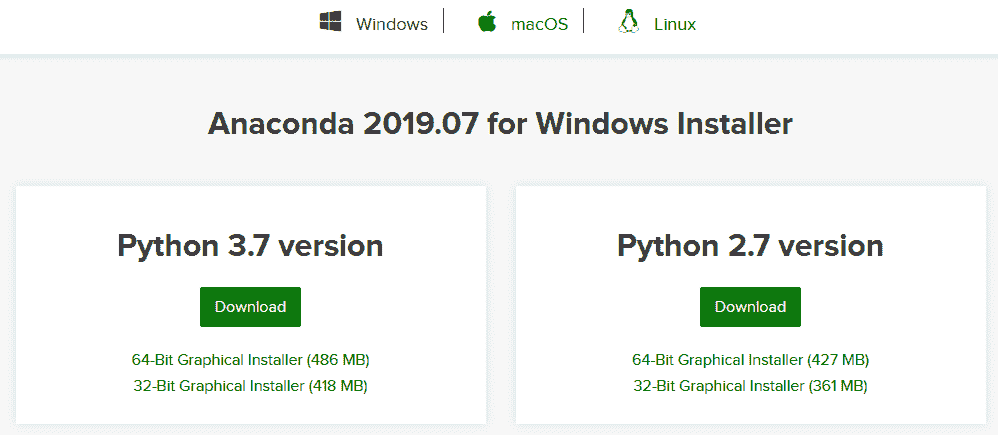
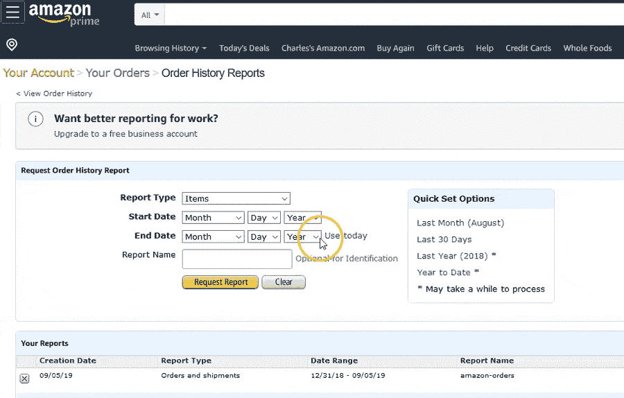
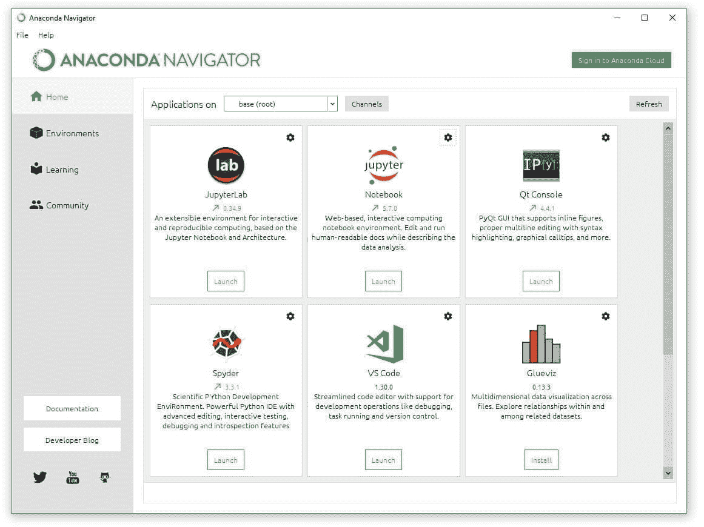
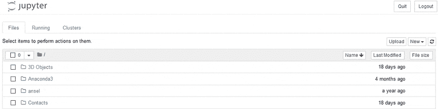
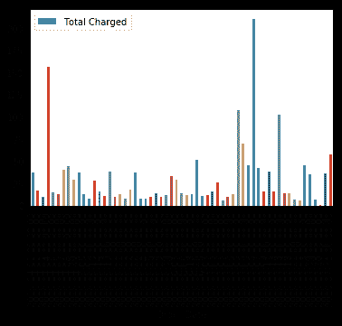
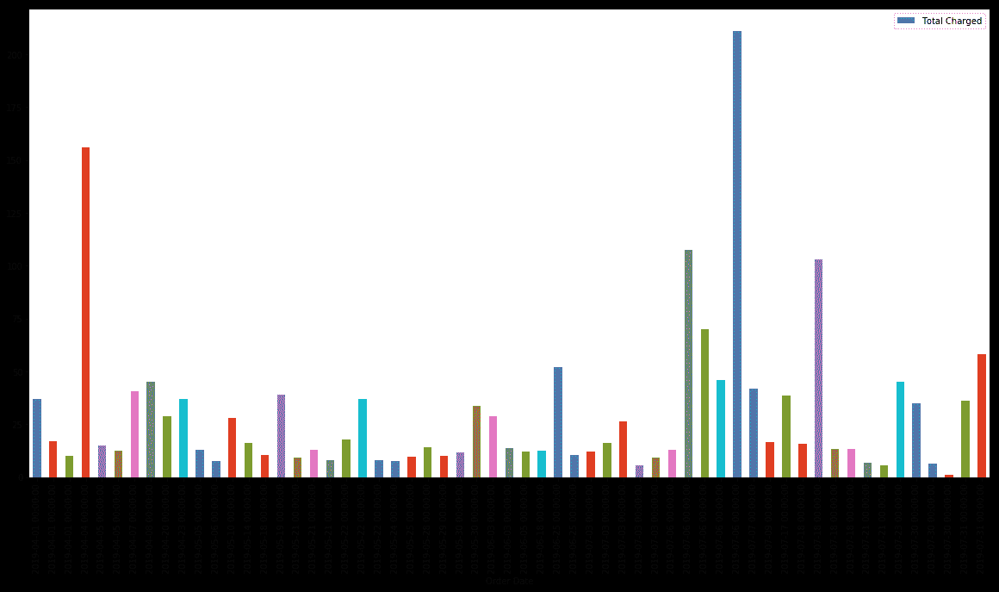
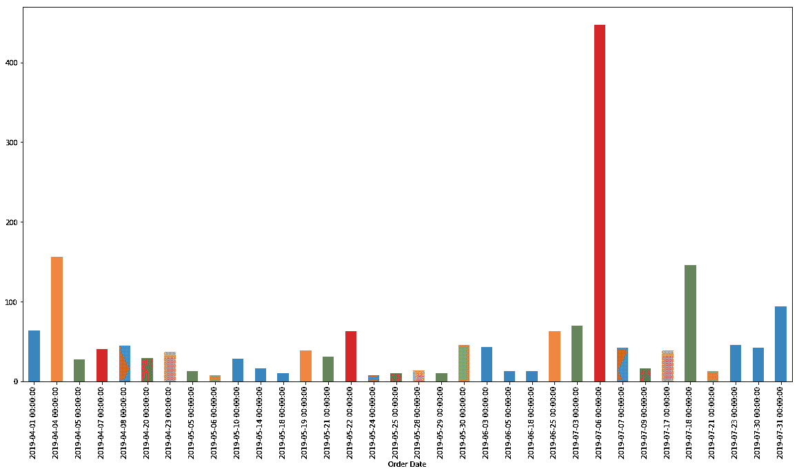
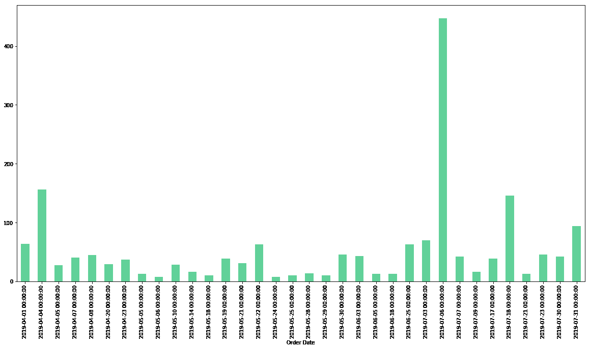

# 你在亚马逊上花了多少钱？分析亚马逊数据

> 原文：<https://www.dataquest.io/blog/how-much-spent-amazon-data-analysis/>

September 10, 2019

我在亚马逊上花了多少钱？这个问题会让这家电子商务巨头的长期客户感兴趣，也可能让他们感到害怕。但是如果你想要答案，它*是*可用。你可以发现你在亚马逊上花了多少钱，甚至更多。

让我们来看看。

我们将使用一点 Python 编程来分析我们的亚马逊数据。但是如果你以前从来没有编码过任何东西，不要担心！我们会一起走过这一切。到本文结束时，您已经编写了不到三十行代码，并且已经完成了一些很酷的事情，比如:

*   算出你在亚马逊上总共花了多少钱。
*   找到您最贵和最便宜的订单，以及您的平均和中值订单总数。
*   计算出你付了多少税，以及你在亚马逊上的有效销售税率。
*   将你每天的消费习惯可视化在一个条形图中。
*   定制条形图的一些元素，如大小和颜色。

如果你曾经想过学习一点代码，或者如果你曾经想知道你在亚马逊上花了多少钱，那就和我们一起来吧！你会对你能做的事情感到惊讶(尽管你可能会对你花了多少钱感到震惊)。

## 为分析做准备

#### 1.下载和安装工具

为了进行这种分析，我们将进行一点 Python 编程。但是不要慌！即使你一生中从未写过一行代码，你也可以这样做！我们将一步一步地完成这个过程。

第一步是在您的计算机上安装一个名为 Anaconda 的工具。这将允许我们使用一种叫做 Jupyter 笔记本的东西来编程。Jupyter Notebooks 是做这种数据分析项目的一个很好的工具，一旦你掌握了它，你可能会发现自己经常使用它。

如果你想深入了解，我们有一个关于 Jupyter 笔记本的深入教程,但是今天我们要做的事情非常简单，我们将在这一页上一一介绍。

首先，我们需要前往 Anaconda 网站的[页面，稍微向下滚动，然后选择我们的操作系统——Windows、Mac 或 Linux。一旦我们选择了您正在使用的正确操作系统，我们将点击 **Python 3.7 版本**下的绿色“下载”按钮来下载 Anaconda。](https://www.anaconda.com/distribution/)



下载完成后，我们可以像安装任何其他应用程序或程序一样安装它:只需双击下载的文件，就会弹出一个安装向导来指导我们完成安装过程。

对于我们这里的目的，默认安装设置就可以了。不过，我们需要记下安装它的文件夹。虽然我们可以在 Jupyter 笔记本电脑的任何地方保存和访问文件，但今天我们将数据集和 Jupyter 笔记本文件保存在同一个文件夹中，以便于访问。

一旦 Anaconda 安装完毕，我们就可以进行下一步了:

#### 下载亚马逊订单历史数据

亚马逊允许你下载大量的订单报告，尽管可用的数据只能追溯到 2006 年。不过，如果你是亚马逊的普通用户，十多年的数据很可能包含一些有趣的见解！

要获取数据，[登录后点击此链接](https://www.amazon.com/gp/b2b/reports?ref_=ya_d_l_order_reports&)会直接将我们带到订单报告下载页面。但是如果这不起作用，我们也可以直接导航到那个页面:去 Amazon.com，点击右上角的**账户和列表**按钮。在下一页上，找到订购和购物首选项部分，然后单击标题下的“下载订单报告”链接。

如果你想完成本教程，但不想使用你自己的数据，你可以[下载我们在本教程中使用的相同的匿名数据集](https://www.dataquest.io/wp-content/uploads/2019/09/amazon-orders.csv)。


Amazon 提供四种不同的报告类型。现在，我们将下载一个**订单和发货**报告，因此从下拉菜单中选择该选项。然后，我们可以为想要查看的数据选择开始日期和结束日期。要查看亚马逊的所有存储数据*，我们需要将开始日期设置为 2006 年 1 月 1 日。然后，我们可以点击结束日期旁边的小“使用今天”按钮来自动填写今天的日期。*

(如果我们不想查看所有订单历史记录，页面右侧还有“快速设置选项”,可以用来快速输入我们可能想要查看的常见时间段，如去年或最近一个月。但是如果我们想知道我们在亚马逊上总共花了多少钱，那么我们需要下载从 2006 年到今天的所有东西。)

我们还可以选择为报告添加一个名称—这不是必需的，保留为空也没关系，但是如果您计划下载大量不同的报告，并希望能够轻松区分它们，那么这样做可能是值得的。



一旦一切准备就绪，点击“请求报告”,亚马逊将开始为您构建报告。你要求的数据越多，你下的订单越多，这个过程就需要越长的时间！但是在一两分钟内，我们应该会弹出一个下载. csv 文件的消息。这是报告，请点击“保存”下载。

(如果您没有看到弹出提示，您也可以通过单击“您的报告”表的“操作”部分中的“下载”来下载，该表位于同一页面上“请求订单历史记录报告”表单的正下方。)

#### 重命名和移动亚马逊订单数据

我们几乎已经准备好开始编程和分析了。但是首先，让我们通过重命名和移动我们刚刚下载的文件来使事情变得简单一些。默认情况下，这可能会被称为类似于`01_Jan_2006_to_10_Sept_2019.csv`的东西，但让我们将其重命名为更简单的东西:`amazon-orders.csv`。

接下来，我们将把`amazon-orders.csv`文件移动到我们安装 Anaconda 的同一个文件夹中，这样我们就可以很容易地从 Jupyter 笔记本中访问它。如果您在安装过程中没有更改默认文件夹，在 Windows 上这将是`C:/Users/YourUsername/`。

#### Open a Jupyter Notebook

现在我们终于开始有趣的部分了！打开 Anaconda Navigator 应用。你可以通过在电脑上搜索“Anaconda Navigator”来找到它。在 Windows 上，你也可以在开始菜单中找到它，在 Mac 上，它应该在你的应用程序文件夹中。打开后，您会看到一个类似这样的屏幕:



点击 Jupyter 笔记本下的“启动”按钮。这将在您的浏览器中打开一个新的屏幕。在该屏幕的右上角，单击“新建”，然后在下拉菜单中的“笔记本”下，单击“Python 3”。



瞧啊。你已经打开了一个空白的 Jupyter 笔记本，我们准备开始我们的分析！

## 我在亚马逊上花了多少钱？

Jupyter 笔记本允许我们在单元格中编写和运行小代码片段。在屏幕上，在菜单和按钮的下方，你会看到一个小方块，上面写着`In [ ]:`，并有一个闪烁的光标。这是第一个单元格，我们可以在这里写代码。

对于这个分析，我们将使用 Python，这是一种非常通用的编程语言，在数据分析中很流行。我们还将使用名为 pandas 和 matplotlib 的 Python 包。您可以将包想象成某种类似浏览器插件的东西——它们是帮助扩展常规 Python 功能的工具。Pandas 和 matplotlib 已经安装了 Anaconda，所以我们不需要自己下载或安装。

#### 将数据输入熊猫体内

我们的第一步将是编写代码来打开并查看我们的 Amazon 数据，这样我们就可以看到我们正在处理什么。在我们的大部分分析中，我们将使用 pandas，所以我们的第一步将是导入 pandas 包，并给它一个昵称`pd`，这样我们就可以在代码中更容易地引用它。

接下来，我们将创建一个名为`df`的新变量，DataFrame 的缩写，然后告诉 pandas 将我们的 Amazon 数据存储在该变量中。数据帧基本上只是一个表格的熊猫名称。我们在这里真正做的是以表格格式存储我们的数据。

为此，我们需要告诉 pandas 将`.csv.`文件作为数据帧读取。为此，我们将使用`pd.read_csv('file_name.csv')`。让我们一点一点地分解它:

*   告诉 Python 使用熊猫来完成这个操作
*   告诉熊猫读取一个 csv 文件，并将其存储为数据帧
*   括号内的`'file_name.csv'`部分告诉 pandas 读取一个具有该文件名的 csv 文件，该文件位于安装 Anaconda 的同一个文件夹中。

(如果我们想从不同的文件夹中获得一个 CSV 文件，我们必须输入完整的文件路径，比如`C:/Users/Username/file_name.csv`。因为我们将`amazon-orders.csv`文件存储在安装 Anaconda 的同一个文件夹中，所以我们只需要在这里包含文件名。)

最后，我们将使用一个名为`.head()`的 pandas 函数来查看我们的数据的前五行，这将让我们了解我们正在处理什么，以及亚马逊的订单历史包括哪些类型的数据。为此，我们使用语法`DataFrame.head()`，因此由于我们的数据帧存储在变量`df`中，我们将使用`df.head()`。

我们将在本教程中大量使用`.head()`——这是一个很好的快速方法来复查我们的代码是否已经做出了我们*认为*已经做出的更改，至少当我们做出的更改从视觉上看表格时是明显的。

这是它看起来的样子。让我们将这个代码输入到我们的第一个 Jupyter 笔记本单元格中，然后点击“运行”按钮，或者使用键盘上的 Shift+Enter(Mac 上的 Cmd + Enter)来运行所选的单元格。

```
 import pandas as pd

df = pd.read_csv('amazon-orders.csv')
df.head() 
```

|  | 订单日期 | 订单 ID | 支付工具类型 | 网站(全球资讯网的主机站) | 采购订单编号 | 订购客户电子邮件 | 装运日期 | 送货地址名称 | 送货地址街道 1 | 送货地址街道 2 | … | 订单状态 | 承运人名称和跟踪号码 | 小计 | 运送费 | 促销前纳税 | 晋升总数 | 已征税 | 收费总额 | 买家姓名 | 组名 |
| --- | --- | --- | --- | --- | --- | --- | --- | --- | --- | --- | --- | --- | --- | --- | --- | --- | --- | --- | --- | --- | --- |
| Zero | 04/01/19 | 112-0000000-0000001 | 签证-0001 | Amazon.com | 圆盘烤饼 | [【电子邮件保护】](/cdn-cgi/l/email-protection) | 04/01/19 | 你的名字 | 1 你的街道 | 圆盘烤饼 | … | 装船 | 美国邮政总局(0001) | $35.00 | $0.00 | $1.93 | $0.00 | $1.93 | $36.93 | 你的名字 | 圆盘烤饼 |
| one | 04/01/19 | 112-0000000-0000002 | 签证-0001 | Amazon.com | 圆盘烤饼 | [【电子邮件保护】](/cdn-cgi/l/email-protection) | 04/01/19 | 你的名字 | 1 你的街道 | 圆盘烤饼 | … | 装船 | 美国邮政总局(0001) | $16.99 | $0.00 | $0.00 | $0.00 | $0.00 | $16.99 | 你的名字 | 圆盘烤饼 |
| Two | 04/01/19 | 112-0000000-0000003 | 签证-0001 | Amazon.com | 圆盘烤饼 | [【电子邮件保护】](/cdn-cgi/l/email-protection) | 04/01/19 | 你的名字 | 1 你的街道 | 圆盘烤饼 | … | 装船 | 美国邮政总局(0001) | $9.99 | $0.00 | $0.00 | $0.00 | $0.00 | $9.99 | 你的名字 | 圆盘烤饼 |
| three | 04/04/19 | 112-0000000-0000004 | 签证-0001 | Amazon.com | 圆盘烤饼 | [【电子邮件保护】](/cdn-cgi/l/email-protection) | 04/05/19 | 你的名字 | 1 你的街道 | 圆盘烤饼 | … | 装船 | 不间断电源(0002) | $147.98 | $0.00 | $8.14 | $0.00 | $8.14 | $156.12 | 你的名字 | 圆盘烤饼 |
| four | 04/05/19 | 112-0000000-0000005 | 签证-0001 | Amazon.com | 圆盘烤饼 | [【电子邮件保护】](/cdn-cgi/l/email-protection) | 04/07/19 | 你的名字 | 1 你的街道 | 圆盘烤饼 | … | 装船 | 美国邮政总局(0001) | $14.99 | $0.00 | $0.00 | $0.00 | $0.00 | $14.99 | 你的名字 | 圆盘烤饼 |

爽！只用了三行代码，我们就导入了所有的数据，现在我们能够以方便的表格格式预览这些数据。

如果我们想得到数据集的完整尺寸，我们可以使用`df.shape`。这给了我们数据框架的尺寸。

```
 df.shape 
```

```
(59, 23) 
```

现在我们知道我们的数据帧有 59 行 23 列。(在本教程中，我们使用了一个非常小的数据集；你的数据框架可能会大很多！)

看着上面的表格，你首先注意到的可能是它是假数据。我们在本教程中使用的数据集是我自己的一些亚马逊购买历史的编辑版本。为了保护我的隐私，我已经更改了姓名、地址、卡号和购买价格，但这些数据的格式与你将从亚马逊下载的真实数据完全相同，我们对这些匿名数据使用的代码也将适用于你的真实数据——无论你有多少数据。

默认情况下，Amazon 数据附带的列名非常具有描述性，很明显，这个数据集中有一些有趣的东西值得关注。我们的第一个目标是算出我们总共花了多少钱，并计算出每份订单的平均价格。这意味着`Total Charged`栏中的数据对我们来说肯定很重要。

看着上面的内容，我们可能还会注意到一些列有值`NaN`。这是一个空值；`NaN`是熊猫代表数据的*缺席*的方式。当我们进行分析时，我们必须意识到数据集中这些缺失的值。

#### 清理数据

清理数据是大多数数据分析项目的重要部分，在我们进行分析并找出我们在 Amazon 上花费的总金额之前，我们需要在这里做一点数据清理。

让我们从处理那些`NaN`值开始。我们需要用我们的数据做一些数学运算，但是`1 + NaN`是一个很难解决的数学问题。`NaN`毕竟不是一个数字！因为`NaN`代表没有信息，所以让我们使用 pandas 方便的`df.fillna()`函数来填充所有的`NaN`值。这允许我们自动地用其他值替换每一个`NaN`值。在这种情况下，让我们用数字零替换`NaN`。

不过，我们需要小心一点。我们不只是想暂时取代那些价值观！我们希望替换它们，然后将数据帧的*版本*存储为我们的新数据帧。我们将使用`df = df.fillna(0)`来替换这些值，并重新定义我们的`df`变量以指向新的数据帧。

然后，我们将再次使用`.head()`函数来确保我们的更改生效。

```
 df = df.fillna(0)
df.head() 
```

|  | 订单日期 | 订单 ID | 支付工具类型 | 网站(全球资讯网的主机站) | 采购订单编号 | 订购客户电子邮件 | 装运日期 | 送货地址名称 | 送货地址街道 1 | 送货地址街道 2 | … | 订单状态 | 承运人名称和跟踪号码 | 小计 | 运送费 | 促销前纳税 | 晋升总数 | 已征税 | 收费总额 | 买家姓名 | 组名 |
| --- | --- | --- | --- | --- | --- | --- | --- | --- | --- | --- | --- | --- | --- | --- | --- | --- | --- | --- | --- | --- | --- |
| Zero | 04/01/19 | 112-0000000-0000001 | 签证-0001 | Amazon.com | Zero | [【电子邮件保护】](/cdn-cgi/l/email-protection) | 04/01/19 | 你的名字 | 1 你的街道 | Zero | … | 装船 | 美国邮政总局(0001) | $35.00 | $0.00 | $1.93 | $0.00 | $1.93 | $36.93 | 你的名字 | Zero |
| one | 04/01/19 | 112-0000000-0000002 | 签证-0001 | Amazon.com | Zero | [【电子邮件保护】](/cdn-cgi/l/email-protection) | 04/01/19 | 你的名字 | 1 你的街道 | Zero | … | 装船 | 美国邮政总局(0001) | $16.99 | $0.00 | $0.00 | $0.00 | $0.00 | $16.99 | 你的名字 | Zero |
| Two | 04/01/19 | 112-0000000-0000003 | 签证-0001 | Amazon.com | Zero | [【电子邮件保护】](/cdn-cgi/l/email-protection) | 04/01/19 | 你的名字 | 1 你的街道 | Zero | … | 装船 | 美国邮政总局(0001) | $9.99 | $0.00 | $0.00 | $0.00 | $0.00 | $9.99 | 你的名字 | Zero |
| three | 04/04/19 | 112-0000000-0000004 | 签证-0001 | Amazon.com | Zero | [【电子邮件保护】](/cdn-cgi/l/email-protection) | 04/05/19 | 你的名字 | 1 你的街道 | Zero | … | 装船 | 不间断电源(0002) | $147.98 | $0.00 | $8.14 | $0.00 | $8.14 | $156.12 | 你的名字 | Zero |
| four | 04/05/19 | 112-0000000-0000005 | 签证-0001 | Amazon.com | Zero | [【电子邮件保护】](/cdn-cgi/l/email-protection) | 04/07/19 | 你的名字 | 1 您所在的街道 | Zero | … | 装船 | 美国邮政总局(0001) | $14.99 | $0.00 | $0.00 | $0.00 | $0.00 | $14.99 | 你的名字 | Zero |

太好了！正如我们所看到的，我们的空值已经被替换为零，这将使计算变得更容易。

不过，我们仍然有一个小小的数据清理问题。这个数据集中的价格被存储为**字符串**，这意味着计算机将它们视为一系列字符，而不是可以相加的数字。它们还包括字符`$`，它不是一个数字。

在我们可以用这些值执行计算之前，我们需要删除那些美元符号，然后我们需要将字符串值转换成**floats**——一种 Python 可以轻松执行计算的数字数据类型。幸运的是，这些操作只需要几行代码。

具体来说，有两个熊猫函数我们可以使用。首先，`Series.str.replace()`允许我们在数据帧的任何列(在 pandas 中称为一个系列)中用另一个字符或一组字符替换一个字符或一组字符。对于我们的目的来说，这是很有帮助的，因为我们可以使用语法`df["Total Charged"].str.replace('$','')`来告诉 Python 用第二个集合中的内容(什么都没有)替换第一个集合中的内容(在“总费用”列中)。

换句话说，我们告诉熊猫在那一列中用空字符替换字符`$`。那样的话，剩下的就只有数字了。一旦我们在列中有了数字，我们就可以使用函数`.astype(float)`将列中的每个条目转换成 **float** 类型，这样我们就可以进行计算了。

同样，我们不想临时进行这些更改，我们想修改我们的数据帧，然后将我们的`df`变量指向数据帧的新版本。然而，由于这一次我们只修改数据的一列，我们将使用`df["Total Charged"]`来指定我们只希望在那一列中进行这些更改。

现在，让我们把它们放在一起，然后再次使用`head()`来检查我们在下一行的工作。

```
 df["Total Charged"] = df["Total Charged"].str.replace('$','').astype(float)
df.head() 
```

|  | 订单日期 | 订单 ID | 支付工具类型 | 网站(全球资讯网的主机站) | 采购订单编号 | 订购客户电子邮件 | 装运日期 | 送货地址名称 | 送货地址街道 1 | 送货地址街道 2 | … | 订单状态 | 承运人名称和跟踪号码 | 小计 | 运送费 | 促销前纳税 | 晋升总数 | 已征税 | 收费总额 | 买家姓名 | 组名 |
| --- | --- | --- | --- | --- | --- | --- | --- | --- | --- | --- | --- | --- | --- | --- | --- | --- | --- | --- | --- | --- | --- |
| Zero | 04/01/19 | 112-0000000-0000001 | 签证-0001 | Amazon.com | Zero | [【电子邮件保护】](/cdn-cgi/l/email-protection) | 04/01/19 | 你的名字 | 1 你的街道 | Zero | … | 装船 | 美国邮政总局(0001) | $35.00 | $0.00 | $1.93 | $0.00 | $1.93 | Thirty-six point nine three | 你的名字 | Zero |
| one | 04/01/19 | 112-0000000-0000002 | 签证-0001 | Amazon.com | Zero | [【电子邮件保护】](/cdn-cgi/l/email-protection) | 04/01/19 | 你的名字 | 1 你的街道 | Zero | … | 装船 | 美国邮政总局(0001) | $16.99 | $0.00 | $0.00 | $0.00 | $0.00 | Sixteen point nine nine | 你的名字 | Zero |
| Two | 04/01/19 | 112-0000000-0000003 | 签证-0001 | Amazon.com | Zero | [【电子邮件保护】](/cdn-cgi/l/email-protection) | 04/01/19 | 你的名字 | 1 你的街道 | Zero | … | 装船 | 美国邮政总局(0001) | $9.99 | $0.00 | $0.00 | $0.00 | $0.00 | Nine point nine nine | 你的名字 | Zero |
| three | 04/04/19 | 112-0000000-0000004 | 签证-0001 | Amazon.com | Zero | [【电子邮件保护】](/cdn-cgi/l/email-protection) | 04/05/19 | 你的名字 | 1 你的街道 | Zero | … | 装船 | 不间断电源(0002) | $147.98 | $0.00 | $8.14 | $0.00 | $8.14 | One hundred and fifty-six point one two | 你的名字 | Zero |
| four | 04/05/19 | 112-0000000-0000005 | 签证-0001 | Amazon.com | Zero | [【电子邮件保护】](/cdn-cgi/l/email-protection) | 04/07/19 | 你的名字 | 1 你的街道 | Zero | … | 装船 | 美国邮政总局(0001) | $14.99 | $0.00 | $0.00 | $0.00 | $0.00 | Fourteen point nine nine | 你的名字 | Zero |

在这个表格中向右滚动，你可以看到我们已经做到了:美元符号都消失了。现在是有趣的部分，或者可能是可怕的部分:找出这些年来我们在亚马逊上实际花了多少钱！

#### 计算花在亚马逊上的钱的总数

Pandas 包括一些我们可以在本专栏中使用的基本数学函数。让我们从`.sum()`开始，它将给出该列中每个数字的总数——换句话说，我们在亚马逊上花费的总数。

```
 df["Total Charged"].sum() 
```

```
1777.7300000000002 
```

找到了:1777.73 美元。这是我在亚马逊上花的钱，至少在这个有限的和编辑过的数据集范围内。

我不想分享我在分析亚马逊 13 年的订单历史时发现的真实总数，但它……更大。你的总分让你吃惊吗？

#### 计算其他东西:在亚马逊上的平均花费，最大购买量，等等。

找到总数并不是我们唯一能做的事情，因为我们已经清理了那一列数据！熊猫让我们能够非常快速地进行一些其他的计算。例如，平均购买价格是多少？我们可以使用`.mean()`来找出:

```
 df["Total Charged"].mean() 
```

```
30.131016949152542 
```

显然，我每笔订单的平均支出约为 30 美元。

因为查看平均值有时会隐藏异常值，所以查看中间值也很好。我们可以使用`.median()`来做到这一点。

```
 df["Total Charged"].median() 
```

```
15.95 
```

真有意思！我的平均花费比我的平均花费低很多。看起来我做了一些昂贵的订单。让我们通过使用`max()`来看看价格最高的订单是什么:

```
 df["Total Charged"].max() 
```

```
210.99 
```

好吧，我最贵的订单是 211 美元。我的最低价订单怎么办？我们可以使用`.min()`来找到那个:

```
 df["Total Charged"].min() 
```

```
1.04 
```

我在亚马逊上到底买了什么才花了 1 美元？我不记得了！(我可以在另一份亚马逊报告中找到这个问题，即 **Items** 报告，但这有点复杂，因此是另一个话题。)

## 我支付了多少营业税？

这是对我为每份订单支付的*总*价格的许多有趣的分析，但是如果我想查看不同的列呢？例如，如果我想知道我已经支付了多少销售税，该怎么办？

该数据存储在`Tax Charged`列中。这个列还没有被清理，所以它和我们开始时的`Total Charged`列有同样的问题。

但是编程的美妙之处在于:我们已经编写了可以修复 T4 的代码。我们需要做的就是从上面复制粘贴我们的列清理代码，并用`"Tax Charged"`替换`"Total Charged"`，告诉 Python 对`"Tax Charged"`列执行相同的操作。

```
 df["Tax Charged"] = df["Tax Charged"].str.replace('$','').astype(float)
df.head() 
```

|  | 订单日期 | 订单 ID | 支付工具类型 | 网站(全球资讯网的主机站) | 采购订单编号 | 订购客户电子邮件 | 装运日期 | 送货地址名称 | 送货地址街道 1 | 送货地址街道 2 | … | 订单状态 | 承运人名称和跟踪号码 | 小计 | 运送费 | 促销前纳税 | 晋升总数 | 已征税 | 收费总额 | 买家姓名 | 组名 |
| --- | --- | --- | --- | --- | --- | --- | --- | --- | --- | --- | --- | --- | --- | --- | --- | --- | --- | --- | --- | --- | --- |
| Zero | 04/01/19 | 112-0000000-0000001 | 签证-0001 | Amazon.com | Zero | [【电子邮件保护】](/cdn-cgi/l/email-protection) | 04/01/19 | 你的名字 | 1 你的街道 | Zero | … | 装船 | 美国邮政总局(0001) | $35.00 | $0.00 | $1.93 | $0.00 | One point nine three | Thirty-six point nine three | 你的名字 | Zero |
| one | 04/01/19 | 112-0000000-0000002 | 签证-0001 | Amazon.com | Zero | [【电子邮件保护】](/cdn-cgi/l/email-protection) | 04/01/19 | 你的名字 | 1 你的街道 | Zero | … | 装船 | 美国邮政总局(0001) | $16.99 | $0.00 | $0.00 | $0.00 | Zero | Sixteen point nine nine | 你的名字 | Zero |
| Two | 04/01/19 | 112-0000000-0000003 | 签证-0001 | Amazon.com | Zero | [【电子邮件保护】](/cdn-cgi/l/email-protection) | 04/01/19 | 你的名字 | 1 你的街道 | Zero | … | 装船 | 美国邮政总局(0001) | $9.99 | $0.00 | $0.00 | $0.00 | Zero | Nine point nine nine | 你的名字 | Zero |
| three | 04/04/19 | 112-0000000-0000004 | 签证-0001 | Amazon.com | Zero | [【电子邮件保护】](/cdn-cgi/l/email-protection) | 04/05/19 | 你的名字 | 1 你的街道 | Zero | … | 装船 | 不间断电源(0002) | $147.98 | $0.00 | $8.14 | $0.00 | Eight point one four | One hundred and fifty-six point one two | 你的名字 | Zero |
| four | 04/05/19 | 112-0000000-0000005 | 签证-0001 | Amazon.com | Zero | [【电子邮件保护】](/cdn-cgi/l/email-protection) | 04/07/19 | 你的名字 | 1 你的街道 | Zero | … | 装船 | 美国邮政总局(0001) | $14.99 | $0.00 | $0.00 | $0.00 | Zero | Fourteen point nine nine | 你的名字 | Zero |

很快，色谱柱就可以进行我们想要的任何分析了。例如，根据这个数据集，我们缴纳的税款总额是多少？我们将再次使用`.sum()`来找出:

```
 df["Tax Charged"].sum() 
```

```
52.60999999999999 
```

显然，我在亚马逊上花掉的钱中有 52.61 美元用于缴税。不同商品的税率不同——我们可以在上面的数据框架预览中看到，有些商品根本不征税。但是如果我们想的话，我们可以通过简单地将我们的`"Total Charged"`总和除以我们的`"Tax Charged"`总和来计算出总税率，就像这样:

```
 df["Tax Charged"].sum() / df["Total Charged"].sum() 
```

```
0.02959392033660904 
```

在此期间，我支付的总体有效销售税率约为 2.9%。

到目前为止，我们在这里做的分析非常酷，我们已经了解了一些关于我们亚马逊消费习惯的事情。如果你以前从未编写过任何代码，并且想学习更多这类东西，我建议你就此打住，报名参加我们的[Python for Data Science Fundamentals 课程](https://www.dataquest.io/course/python-for-data-science-fundamentals/)。这是免费的，它会给你一个很好的基础，所以很快，你就会对自己承担这样的项目，甚至更复杂的项目感到舒适。

如果你现在想要更多的挑战，我们可以用这个数据集做更多的事情。让我们通过对这些日期栏进行分析，来了解我们的消费习惯是如何随着时间的推移而改变的。

## 随着时间的推移分析亚马逊支出

在 Python 中处理日期之前，我们需要将它们转换成`datetime`数据类型，这样计算机就可以将它们识别为日期。幸运的是，对于熊猫来说，这很简单！我们可以使用`.pd.to_datetime()`并在括号中指定我们想要修改的列，告诉 pandas 将该列作为日期读取。

和以前一样，我们希望确保将这一更改存储在我们的`df`数据帧中，因此我们将指定我们正在修改`df['Order Date']`列，然后将它分配给我们的`df`变量中的“订单日期”列，以便旧的`"Order Date"`列被我们更改后的版本所替换。

我们真的只需要看到一行就可以确定我们的日期已经更改，所以让我们为我们的老朋友`df.head()`提供一个自定义**参数**。我们可以自定义它显示的行数。如果我们将数字`1`放在括号内，它将显示数据集的一行。

```
 df['Order Date'] = pd.to_datetime(df['Order Date'])
df.head() 
```

|  | 订单日期 | 订单 ID | 支付工具类型 | 网站(全球资讯网的主机站) | 采购订单编号 | 订购客户电子邮件 | 装运日期 | 送货地址名称 | 送货地址街道 1 | 送货地址街道 2 | … | 订单状态 | 承运人名称和跟踪号码 | 小计 | 运送费 | 促销前纳税 | 晋升总数 | 已征税 | 收费总额 | 买家姓名 | 组名 |
| --- | --- | --- | --- | --- | --- | --- | --- | --- | --- | --- | --- | --- | --- | --- | --- | --- | --- | --- | --- | --- | --- |
| Zero | 2019-04-01 | 112-0000000-0000001 | 签证-0001 | Amazon.com | Zero | [【电子邮件保护】](/cdn-cgi/l/email-protection) | 04/01/19 | 你的名字 | 1 你的街道 | Zero | … | 装船 | 美国邮政总局(0001) | $35.00 | $0.00 | $1.93 | $0.00 | One point nine three | Thirty-six point nine three | 你的名字 | Zero |
| one | 2019-04-01 | 112-0000000-0000002 | 签证-0001 | Amazon.com | Zero | [【电子邮件保护】](/cdn-cgi/l/email-protection) | 04/01/19 | 你的名字 | 1 你的街道 | Zero | … | 装船 | 美国邮政总局(0001) | $16.99 | $0.00 | $0.00 | $0.00 | Zero | Sixteen point nine nine | 你的名字 | Zero |
| Two | 2019-04-01 | 112-0000000-0000003 | 签证-0001 | Amazon.com | Zero | [【电子邮件保护】](/cdn-cgi/l/email-protection) | 04/01/19 | 你的名字 | 1 你的街道 | Zero | … | 装船 | 美国邮政总局(0001) | $9.99 | $0.00 | $0.00 | $0.00 | Zero | Nine point nine nine | 你的名字 | Zero |
| three | 2019-04-04 | 112-0000000-0000004 | 签证-0001 | Amazon.com | Zero | [【电子邮件保护】](/cdn-cgi/l/email-protection) | 04/05/19 | 你的名字 | 1 你的街道 | Zero | … | 装船 | 不间断电源(0002) | $147.98 | $0.00 | $8.14 | $0.00 | Eight point one four | One hundred and fifty-six point one two | 你的名字 | Zero |
| four | 2019-04-05 | 112-0000000-0000005 | 签证-0001 | Amazon.com | Zero | [【电子邮件保护】](/cdn-cgi/l/email-protection) | 04/07/19 | 你的名字 | 1 你的街道 | Zero | … | 装船 | 美国邮政总局(0001) | $14.99 | $0.00 | $0.00 | $0.00 | Zero | Fourteen point nine nine | 你的名字 | Zero |

从这一行中，我们可以看到日期格式从`2019/04/01`变成了`2019-04-01`。这是一个好的迹象，表明我们对`datetime`的改变已经奏效，我们可以进行下一步的分析了。

一件有趣的事情是，在这个数据集中，每天花了多少钱。这是一个最容易直观看到的分析，也许是以条形图的形式。幸运的是，pandas 和 matplotlib 包使我们能够在 Jupyter 笔记本中构建和查看各种图表类型！

我们将从一个小的 Jupyter 笔记本魔术开始，它将允许我们在我们的 noteboot 中显示图表。(注意:当您运行这个代码单元格时，没有什么明显的变化，但是它将使 matplotlib 能够在您的笔记本中显示图表。)

太好了！我们可以使用`df.plot.bar()`以非常简单的方式制作一个基本的条形图。我们可以将所需的 X 轴和 Y 轴列作为参数传递给该函数，并且我们还可以添加其他参数来执行旋转 X 轴标签之类的操作。但是看看当我们按原样绘制数据框架时会发生什么:

```
 df.plot.bar(x='Order Date', y='Total Charged', rot=90) 
```

```
<matplotlib.axes._subplots.AxesSubplot at 0x1c30f9c4e10> 
```



这个图表有点小，很难看出我们是否真的得到了我们想要的。让我们把它变大，这样我们可以更容易地读取数据。

我们可以通过在绘图代码中添加一个名为`figsize`的参数来做到这一点。这允许我们通过宽度和高度来定义图形的大小(fig 是 figure 的简称)。它使用的单位不是特别直观，但是对于大多数图表来说，`(20, 10)`是一个很好的默认值，如果需要，我们可以进一步调整。

我们所需要做的就是将`figsize=(20,10)`添加到我们代码中已经有的参数中。请注意，每个单独的参数都用逗号分隔。

```
 df.plot.bar(x='Order Date', y='Total Charged', rot=90, figsize=(20,10)) 
```

```
<matplotlib.axes._subplots.AxesSubplot at 0x1c3129870b8> 
```



那更好读！但是如果我们仔细观察上面的图表，我们可以发现一个问题:当在同一天下了多个订单时，每个订单在条形图中都有一个单独的条。例如，看看图表上的前三个柱线——这三个柱线都是 4 月 1 日的，代表当天下了三个单独的订单。

这并不是我们真正想要想象的。我们想知道每*天*花了多少钱。每个条形应该代表一天，而不是一个订单，所以如果当天有一个以上的订单，这些订单的总费用应该加在一起。

我们可以使用另一个内置的熊猫函数:`df.groupby()`。

这里的语法有点复杂，但是我们可以把我们想要做的分成两部分:1 .我们希望按`'Order Date'`对数据进行分组，这样，所有共享相同日期的订单都被计算在一行中(即，我们希望 4 月 1 日占一行，而不是三行)。2.我们希望获得每个日期在`'Total Charged'`列中支付的价格的总和，并将其作为相关日期行中`'Total Charged'`的值(即，我们希望 4 月 1 日行中`'Total Charged'`的值是当天三个订单的总和)。

因为我们是按订单日期分组的，所以我们将从`df.groupby('Order Date')`开始。下一步我们需要做的是对该组中的`'Total Charged'`列求和，并将 make 设置为新的`'Total Charged'`列，因此我们将在第一部分之后添加`.sum()["Total Charged"]`。

我们想把熊猫系列的结果赋给一个新的变量。姑且称之为`daily_orders`。

以下是它的整体外观:

```
 daily_orders = df.groupby('Order Date').sum()["Total Charged"]
daily_orders.head() 
```

```
Order Date
2019-04-01  63.91
2019-04-04  156.12
2019-04-05  27.64
2019-04-07  40.63
2019-04-08  44.99
Name: Total Charged, dtype: float64 
```

正如我们所见，`.head()`的结果在这里看起来有点不同。这是因为这是一个系列，而不是一个数据框架。它看起来有两列，但实际上只有一列:`'Order Date'`列条目实际上是我们求和的索引标签。

准确理解这是如何工作的对于本教程来说并不重要，但是如果你向上滚动到你之前的一个`df.head()`打印输出，你可能会注意到在表格的最左边是降序的数字:0，1，2，3，4…这些数字是索引标签。

令人欣慰的是，pandas 能够很好地用日期作为索引标签来绘制一系列数据，所以我们不必对我们的数据做任何其他事情。如果我们检查前面数据框中的数字，我们可以看到这里的总数是正确的。2019 年 4 月 1 日有三个单独的订单，“36.93 美元”、“16.99 美元”和“9.99 美元”。这三者之和为\$63.91，这是`daily_orders`中 4 月 1 日的值。完美！

是时候把它做成条形图了。我们可以用`Series.plot.bar()`做到这一点，因为我们的系列只有一列和一组索引标签，我们甚至不需要定义 x 和 y 轴。熊猫会自动这么做。

```
 daily_orders.plot.bar(figsize=(20,10)) 
```

```
<matplotlib.axes._subplots.AxesSubplot at 0x1c3110bbf60> 
```



现在我们已经得到了我们想要的图表，但是我们还可以做另一个快速的改进。

这张图表中的不同颜色有点误导。每个条形实际上代表了同样东西的价值(亚马逊当天向我们收取的订单总额)。但是因为每一条都是不同的颜色，一些人在看这个图表时可能会认为这些颜色有一定的含义，每一条代表不同的东西。

我们可以用另一个类似`figsize`的论点来改变这一点。这个叫`color`。例如，将参数`color="blue"`添加到我们的绘图代码中会使图表中的每一条都变成蓝色。

该参数可以接受基本颜色，如“蓝色”，但也可以接受其他格式的颜色信息，包括您可能在 web 上看到过的十六进制代码。让我们用更有趣的颜色代替蓝色:Dataquest green！我们绿色的十六进制代码是`#61D199`，所以我们将使用`color='#61D199'`。

让我们把它放到我们的代码中，看看它看起来怎么样！

```
 daily_orders.plot.bar(figsize=(20, 10), color='#61D199') 
```

```
<matplotlib.axes._subplots.AxesSubplot at 0x1c311dcd5c0> 
```



厉害！这张图表向我们展示了我们之前的分析没有展示的东西:尽管最大的单笔订单刚刚超过 200 美元，但在 7 月的某一天，几笔订单的总额远远超过了 400 美元。

很明显，在这张图表上，我们还有很多可以改进的地方。我们可以删除底部的时间代码，添加一个 Y 标签和一个图表标题，插入没有订单的日期，以便更一致地显示订单的时间，等等。

但我们在这里的目标不是创建一个完美的图表。那就是使用一些快速编程从大量数据中挖掘出一些洞察力。而且我们学到了很多！我们了解到:

1.  这期间我在亚马逊上花了多少钱。
2.  我的最高、最低和平均订单总数是多少。
3.  我付了多少税，以及我支付的有效销售税率。
4.  我的支出如何随时间波动
5.  哪一天我花的钱最多

我们只用了不到 30 行代码就完成了所有这些！

## 如何进一步推进这个项目

想更深入吗？根据您的兴趣，以下是您可以尝试进一步扩展该项目的一些方法:

*   查看添加到情节代码中的其他参数，以进一步美化图形。
*   将`'Tax Charged'`添加到每一天。
*   按月或年，而不是按天来划分你的开销。
*   在亚马逊上下载你的[商品订单报告，并对你购买最多或花费最多的商品类别进行分析。(这将需要修改一些现有的代码，因为 Items 报告有更多的列)。](https://www.amazon.com/gp/b2b/reports?ref_=ya_d_l_order_reports&)
*   想办法把每一天(甚至是没有订单的日子)都放入你的数据集中，这样你就可以更容易地想象你一段时间的花费。
*   你还在哪些网站上购物？看看他们是否允许你访问你的数据。

如果你发现自己喜欢本教程，或者如果你认为这些技能对你的生活或职业有价值，你可能总是想考虑在我们的[数据科学途径](https://www.dataquest.io/path/data-scientist/)中学习数据技能。前两门课程完全免费，将涵盖 Python 编程的所有基础知识。

[**注册一个免费账户**](https://app.dataquest.io/signup) ，你还会每周收到一封电子邮件，里面有学习数据技能和推进职业发展的酷资源。

## 这个教程有帮助吗？

选择你的道路，不断学习有价值的数据技能。

[Python Tutorials](/python-tutorials-for-data-science/)

在我们的免费教程中练习 Python 编程技能。

[Data science courses](/data-science-courses/)

通过我们的交互式浏览器数据科学课程，投入到 Python、R、SQL 等语言的学习中。

## 我不能用 Excel 做这个吗？

当然，我们在本教程中所做的很多事情也可以用 Excel 或 Google Sheets 这样的产品来完成。有时，使用电子表格程序是最快最容易的选择。然而，有几个重要的原因可以解释为什么对于像这样的项目来说，能够做一点编程通常比 Excel 要好。

#### 1.编码更强大

你可能知道如何做一些我们在本教程中做过的事情，比如在 Excel 中求一列的和。但是使用代码就可以完成更复杂的分析。

在 spreadhseet 软件中，类似于条件化(*if*this happen，then do that)的事情是可能的，但它很快变得复杂混乱，而在代码中却相对简单。更高级的分析类型，如许多类型的机器学习，在电子表格软件中是完全不可能的。

#### 2.编码对大数据可能更好

在本教程中，我们使用了一个非常小的数据集，这种数据集很容易作为电子表格使用。但是你真正的亚马逊订单历史，或者你的 Fitbit 数据，或者你公司的销售记录，或者你想要处理的任何其他数据都可能会更大。一辆*比一辆*大很多。

在电子表格软件中，大数据集可能变得难以处理，甚至导致速度变慢和崩溃。毕竟，该软件必须可视化地表示每一个数据点，并跟踪你正在做的所有其他事情。

另一方面，代码一次执行一个操作，并且只显示您特别可视化请求的输出。这使得它能够以更快的速度和更高的稳定性处理大型数据集。

#### 3.编码可以更好地处理多个文件

想象一下，每个月您都必须在 Excel 中获取大量不同的报告，并将它们合并成一个报告进行分析。这是一个 Dataquest 的学生遇到的真正问题，他将每个月试图将几十个不同的 Excel 表格合并成一份分析报告的过程描述为一场痛苦的噩梦。

使用代码来组合和清理多个数据集既简单又快速。通过编程，您可以编写一些代码来自动访问和组合所有文件，而不是打开几十个窗口并将数据一个接一个地复制粘贴到一个主表中。例如，上面提到的 Dataquest 学生将 Excel 中过去需要一周的数据合成和分析任务变成了 Python 中只需几分钟的任务。

只要他还在做那份工作，他在编写代码上的时间投资就会有回报，因为…

#### 4.编码更具可重复性

一旦您编写了从特定数据源导入、清理和分析数据的代码，它将适用于以相同格式输入的任何数据。

例如，如果您想每月对您的 Amazon 数据执行本教程中的分析，您需要做的就是每月下载当月的数据，在第一个代码片段中更改`read_csv()`正在读取的文件名，然后运行所有的代码单元格，我们刚刚对该数据集进行的所有分析都会自动在您的新数据集上执行。

#### 5.编码更加透明

虽然您可以在电子表格软件中进行复杂的计算，但这些计算通常隐藏在单元格中。如果你得到的是别人的 Excel 文件，这个文件正在做一些复杂的分析，你可能要花很长时间才能弄清楚到底发生了什么。在电子表格中，你可以看到所有的*数据*，但是对其执行的*操作和计算*是你通常必须逐个单元格搜索的东西。

代码恰恰相反:大部分数据本身是不可见的，但是对其执行的所有操作和计算都是显而易见的，它们的执行顺序也是如此。当然，你确实需要[学习基本的语法](https://www.dataquest.io/course/python-for-data-science-fundamentals/)来阅读代码，但是一旦你记下了，就很容易一目了然地看到分析中到底发生了什么。

这也使得捕捉错误变得更加容易，比如在某个地方使用了`+`而不是`-`，在这种情况下，隐藏在大型电子表格的单个单元格中的错误可能很长时间都不会被注意到。

#### 6.使用代码访问数据更容易

您想要分析的数据并不总是以电子表格的形式出现。许多应用程序和服务只能让你通过 API 访问数据，你需要编码技能才能访问。

或者，您可能希望通过从网站抓取数据来收集自己的数据集，同样，这是您无法使用电子表格软件完成的事情(并且将数据点一个一个地复制粘贴到 Excel 中是非常累人的)。

#### 7.编码更有趣

也许你以前从未想过自己是一名程序员，但是如果你读完了本教程，你已经比大多数人编写和运行了更多的代码。感觉很好，不是吗？

编写代码有时肯定会令人沮丧。但是当你让一切都按计划运行时，这是一种真正令人满意的感觉。通过自动化重复的分析项目，你可以为自己节省的时间是惊人的。

如果你想了解更多，我们的其他 [Python 教程](https://www.dataquest.io/python-tutorials-for-data-science/)是一个很好的资源，我们的交互式[数据科学课程](https://www.dataquest.io/path/data-scientist/)可以带你在各种数据和编程技能领域从零到工作就绪。

## 获取免费的数据科学资源

免费注册获取我们的每周时事通讯，包括数据科学、 **Python** 、 **R** 和 **SQL** 资源链接。此外，您还可以访问我们免费的交互式[在线课程内容](/data-science-courses)！

[SIGN UP](https://app.dataquest.io/signup)