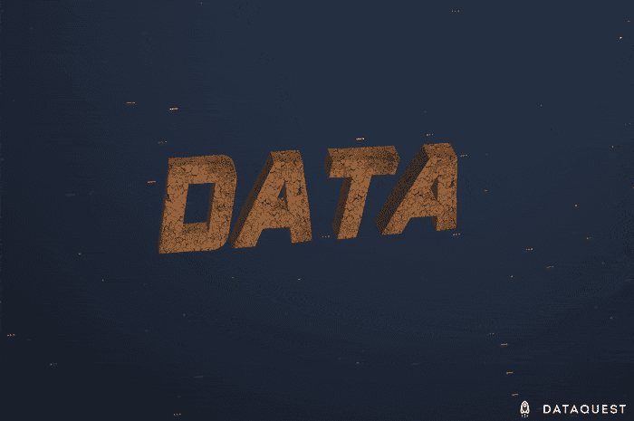

# 新课程:用 Python 和熊猫学习数据清理

> 原文：<https://www.dataquest.io/blog/learn-data-cleaning-python-pandas/>

February 19, 2019

数据清理可能不是你对数据科学感兴趣的原因，但如果你想成为一名数据科学家，没有什么技能比这更重要了。工作数据科学家花费至少 60%的时间清理数据，而脏数据通常被认为是数据科学家在工作中面临的最大障碍。

这就是为什么我们刚刚在 Python 数据分析师和数据科学家的道路上增加了一门全新的课程，名为 [*数据清理和分析*](https://www.dataquest.io/course/python-datacleaning) 。如果你[是 Dataquest 高级用户](https://www.dataquest.io/subscribe/)，你可以现在就开始学习。

## 为什么要学习数据清理？

数据科学家最终可能会从事各种行业的各种工作，但几乎所有数据科学工作都至少有一个共同点:数据清理。毕竟，现实世界是混乱的，这意味着现实世界的数据集也往往是混乱的。不完整的输入、不一致的格式、输入错误——这些都是你在几乎每个数据集中都会遇到的事情。

即使你正在处理完美的数据，数据清理技能仍然是必要的。您几乎总是希望对数据及其格式进行更改，以方便您的分析，这意味着对杂乱的数据做同样的事情:删除不相关的条目、重新格式化列等。

如果你渴望从事任何类型的机器学习，学习数据清理就显得尤为重要。正如《哈佛商业评论》*所说:*

 *> 糟糕的数据质量是机器学习广泛、有益使用的头号敌人。[……]机器学习的质量要求很高，坏数据可能会出现两次，第一次是用于训练预测模型的历史数据，第二次是该模型用于未来决策的新数据。

简单地说，没有数据清理就没有数据科学。

## 这门课程包括什么？

在*数据清理和分析*中，你将使用流行的 pandas 数据分析库学习 Python 中的关键数据清理技术(如果你想学习 R 中的数据清理，我们[有一个单独的 R 数据清理课程](https://www.dataquest.io/course/r-data-cleaning/))。在整个课程中，您将使用《世界幸福报告》中的真实数据，清理和分析一个大型数据集，该数据集包括世界各国的各种指标，如 GDP 和平均预期寿命。

在*数据清理*的前三课中，您将学习使用 pandas 有效地聚合、组合和转换数据，以便为分析做好准备。然后，您将深入探讨稍微复杂一些的主题，比如如何在 pandas 中处理字符串，如何使用正则表达式，以及如何处理缺失和重复的数据。

完成教学课程后，您将面临一项挑战，即通过一个新的指导项目来测试您所有的新数据清理技能，在您清理和分析来自两个澳大利亚政府部门的员工离职调查的真实数据集时，该项目还会教您一些新的熊猫技能和数据演示技能。

当然，所有的材料都是以 Dataquest 的分屏显示方式呈现的，这样您就可以马上动手编写代码了。

## 拿起你的拖把

数据清理听起来可能没有机器学习那么性感，但数据科学经常被忽视的现实是**你的分析只能和你的数据**一样好。如果你的数据一团糟，你的分析也会一团糟。

谢天谢地，有了 Python 和`pandas`的力量，你不必让这种情况发生，所以现在就拿起你的拖把，投入我们新的 [*数据清理和分析*](https://www.dataquest.io/course/python-datacleaning) 课程吧！

[数据清理和分析过程](https://www.dataquest.io/course/python-datacleaning)*