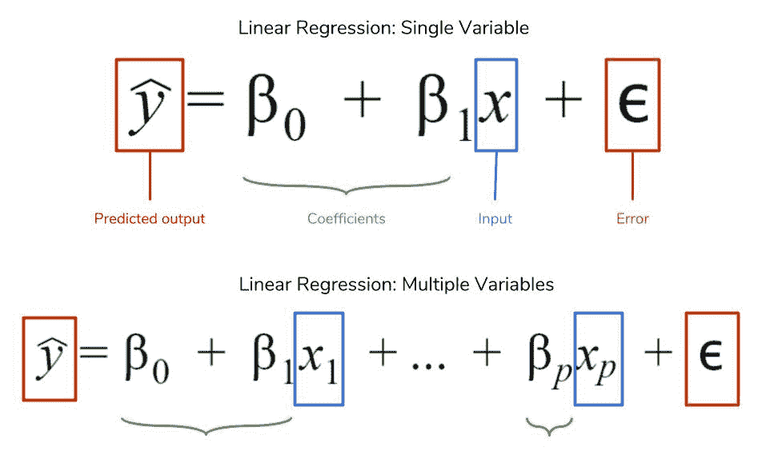
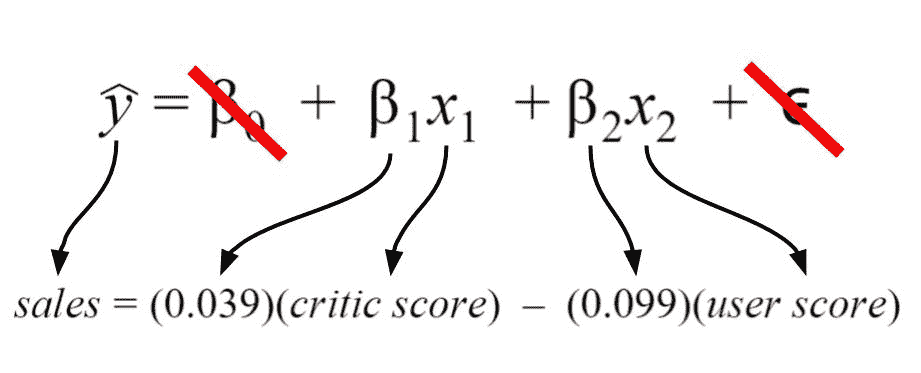
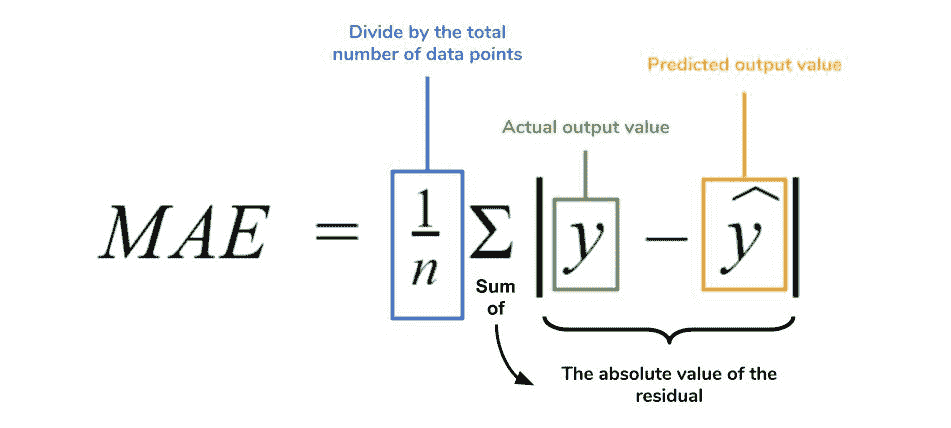
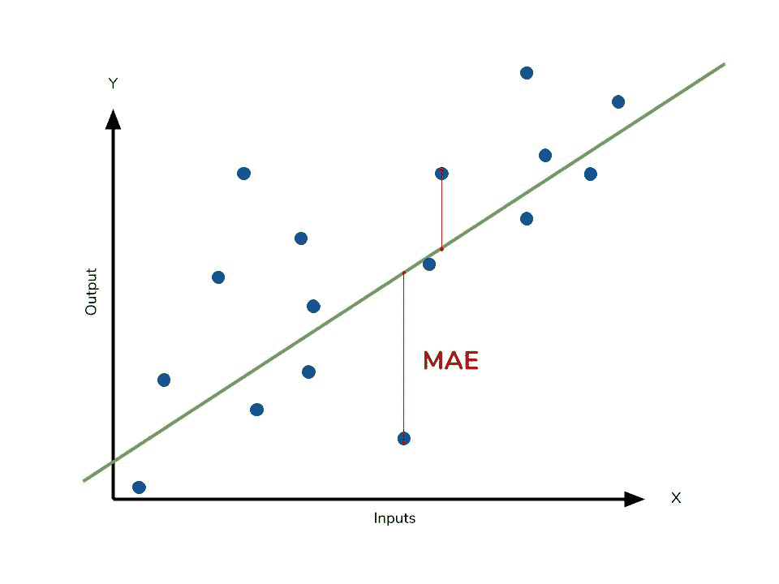
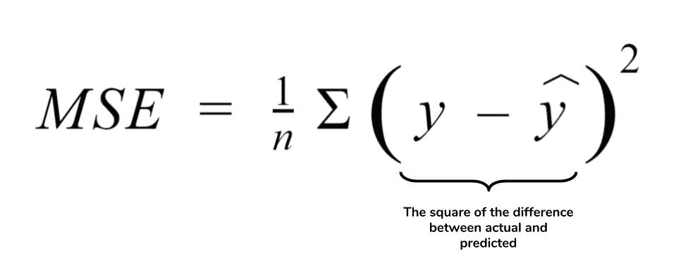
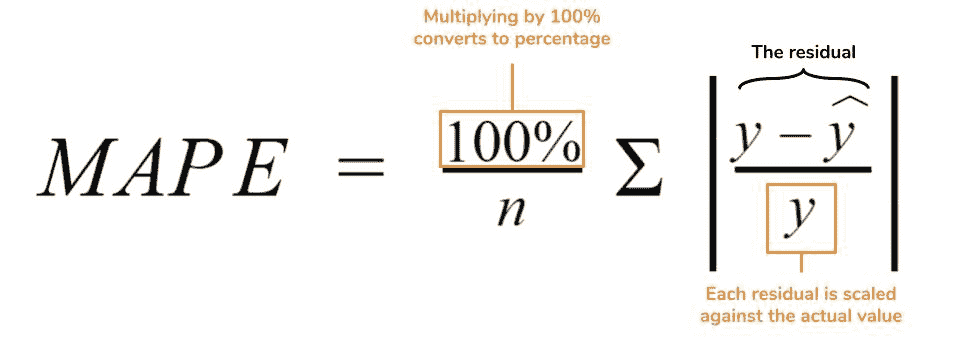
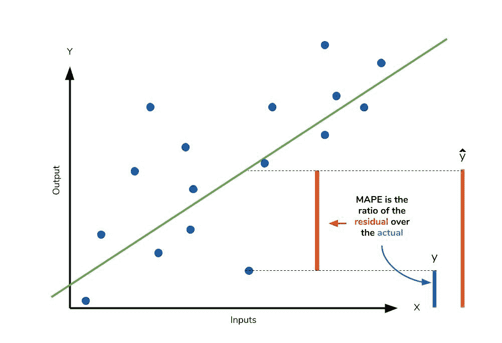
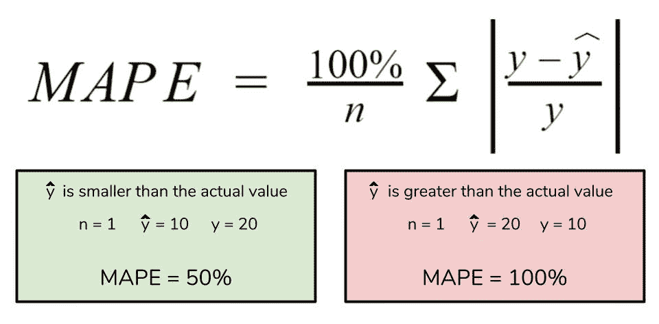
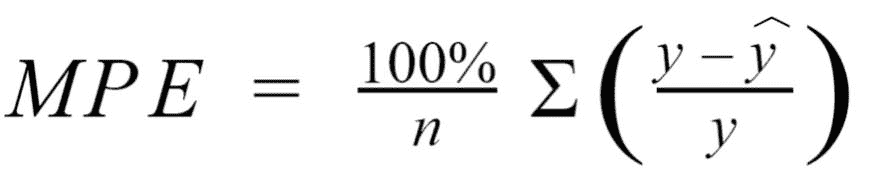
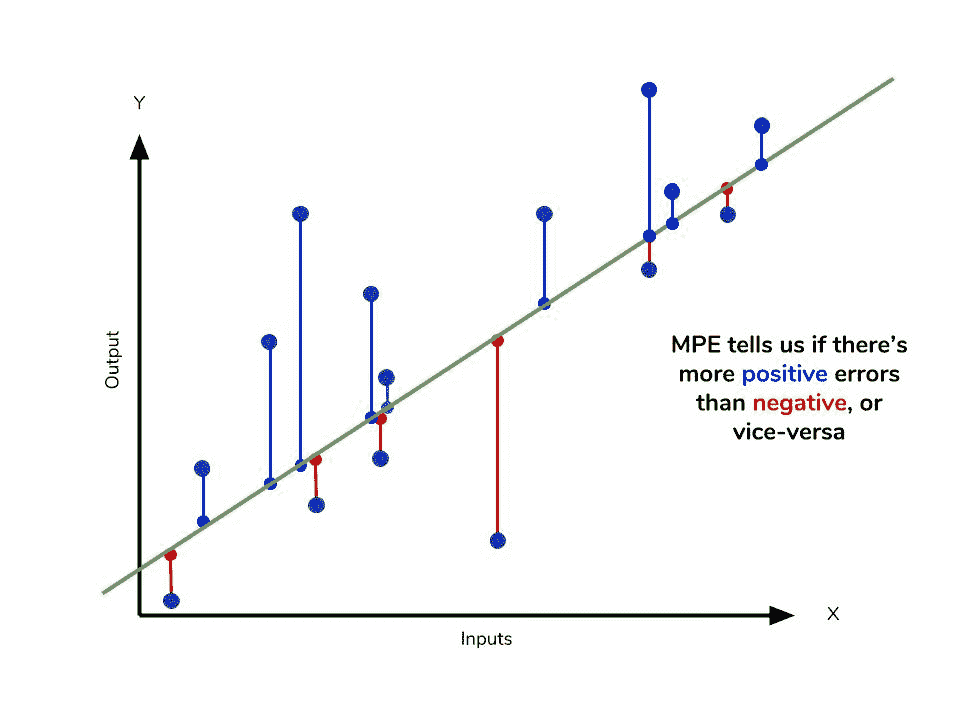

# 教程:理解 Python 中的回归误差度量

> 原文：<https://www.dataquest.io/blog/understanding-regression-error-metrics/>

September 26, 2018

人类大脑的构造是为了识别我们周围世界的模式。例如，我们观察到，如果我们每天练习编程，我们的相关技能就会提高。但是我们如何准确地向他人描述这种关系呢？我们如何描述这种关系有多强？幸运的是，我们可以用被称为**回归**的正式数学估计来描述现象之间的关系，比如实践和技能。

回归是数据科学家工具箱中最常用的工具之一。当你[学习 Python](https://www.dataquest.io/blog/learn-python-the-right-way/) 或 R 时，你会获得用单行代码创建回归的能力，而不必处理底层的数学理论。但是这种轻松会导致我们忘记评估我们的回归，以确保它们足够充分地代表我们的数据。我们可以将数据插回到回归方程中，看看预测的输出是否与数据中看到的相应观察值相匹配。

回归模型的*质量*是其预测与实际值的匹配程度，但是我们实际上如何评估质量呢？幸运的是，聪明的统计学家已经开发了**误差度量**来判断模型的质量，并使我们能够将回归与其他具有不同参数的回归进行比较。这些指标是对我们数据质量的简短而有用的总结。本文将深入探讨四个常见的回归指标，并讨论它们的用例。回归有很多种类型，但是本文将专门关注与**线性回归**相关的度量。

线性回归是研究和商业中最常用的模型，也是最容易理解的，所以开始发展你对如何评估它们的直觉是有意义的。我们将在这里讨论的许多度量背后的直觉扩展到其他类型的模型和它们各自的度量。如果你想快速复习一下线性回归，你可以参考[这篇精彩的博客文章](https://www.dataquest.io/blog/statistical-learning-for-predictive-modeling-r/)或者[线性回归维基页面](https://en.wikipedia.org/wiki/Linear_regression)。

## 线性回归入门

在回归的上下文中，*模型*是指用于描述两个变量之间关系的数学方程。一般来说，这些模型处理我们的数据**输出**中感兴趣的值的*预测*和*估计*。模型将查看我们认为会影响输出的被称为**输入**的数据的其他方面，并使用它们来生成估计输出。

这些输入和输出有许多您可能以前听过的名字。输入也可以称为自变量或预测值，而输出也称为响应或因变量。简单地说，模型就是输出是输入的某个*函数*的函数。线性回归的**线性**部分指的是这样一个事实，一个线性回归模型以如下形式进行数学描述:如果这看起来太数学化，那么线性思维是特别直观的。如果你听说过“熟能生巧”，那么你知道更多的练习意味着更好的技能；实践和完美之间有某种线性关系。线性回归的**回归**部分并不是指某种程度上回到更差的状态。回归在这里简单地指估计我们的输入和输出之间的关系的行为。特别是，回归处理与离散状态(想一想:类别)相对的**连续值**(想一想:数字)的建模。

综上所述，线性回归创建了一个假设输入和输出之间存在线性关系的模型。输入越高，输出也越高(或者更低，如果关系是负的话)。调整这种关系有多强的*和这种关系的*方向*的是我们的**系数**。第一个没有输入的系数被称为**截距**，当所有输入都为 0 时，它调整模型预测的内容。我们将不深究*如何计算*这些系数，但知道存在一种方法来计算**最优**系数，给定我们想要用来预测输出的输入。*

给定系数，如果我们插入输入值，线性回归将给我们一个输出值的估计值。正如我们将看到的，这些输出不会总是完美的。除非我们的数据是一条完美的直线，否则我们的模型不会精确地触及所有的数据点。其中一个原因是ϵ(名为“ε”)项。这个术语代表来自我们控制之外的来源的误差，导致数据稍微偏离它们的*真实*位置。我们的误差度量将能够判断预测值和实际值之间的差异，但是我们无法知道误差在多大程度上造成了差异。虽然我们不能完全消除ε，但在线性模型中保留一个术语是有用的。

## 将模型预测与现实进行比较

由于给定任何输入或一组输入，我们的模型都会产生一个输出，因此我们可以对照我们试图预测的实际值来检查这些估计的输出。我们将实际值和模型估计值之间的差异称为**残差**。我们可以计算数据集中每个点的残差，这些残差中的每一个都将在评估中有用。这些残差将在判断模型的有用性方面发挥重要作用。

如果我们的残差集合很小，这意味着产生它们的模型在预测我们感兴趣的输出方面做得很好。相反，如果这些残差通常很大，这意味着模型是一个很差的估计量。从技术上来说，我们可以检查所有的残差来判断模型的准确性，但不出所料，如果我们有数千或数百万个数据点，这是不可行的。因此，统计学家开发了汇总测量，将我们收集的残差压缩成一个代表我们模型预测能力的*单个*值。有许多这样的汇总统计数据，每一个都有自己的优点和缺陷。对于每一个，我们将讨论每个统计数据代表什么，它们的直觉和典型用例。我们将涵盖:

*   绝对平均误差
*   均方误差
*   平均绝对百分比误差
*   平均百分比误差

*注意*:即使你在这里看到了单词 error，它也不是指上面的 epsilon 项！这些指标中描述的误差指的是**残差**！

## 扎根于真实数据

在讨论这些误差指标时，很容易被用来描述它们的各种缩略语和方程式所困扰。为了让我们自己脚踏实地，我们将使用我用 Kaggle 的[视频游戏销售数据集创建的模型。我创建的模型的细节如下所示。我的回归模型有两个输入(评论家得分和用户得分)，所以它是一个**多变量**线性回归。模型接受了我的数据，发现 0.039 和-0.099 是输入的最佳系数。](https://www.kaggle.com/rush4ratio/video-game-sales-with-ratings/data)

在我的模型中，我选择截距为零，因为我想假设分数为零时销售额为零。因此，截距项被划掉了。最后，误差项被划掉，因为我们不知道它在实际中的真实值。我展示它是因为它更详细地描述了线性回归方程中编码的信息。

## 模型背后的基本原理

假设我是一个游戏开发者，刚刚创作了一个新游戏，我想知道我会赚多少钱。我不想等待，所以我开发了一个模型，根据专家评论家对游戏的判断和一般玩家的判断(我的输入)，预测全球总销量(我的输出)。如果评论家和玩家都热爱这款游戏，那么我应该赚更多的钱…对吗？当我真的得到评论家和用户对我游戏的评论时，我可以预测我会赚多少钱。目前，我不知道我的模型是否准确，所以我需要计算我的误差指标，以检查我是否应该包括更多的输入，或者我的模型是否有任何好处！

## 绝对平均误差

**平均绝对误差** (MAE)是最容易理解的回归误差指标。我们将计算每个数据点的残差，只取每个数据点的绝对值，这样正负残差就不会相互抵消。然后我们取所有这些残差的平均值。实际上，MAE 描述了残差的*典型*大小。如果你对平均数不熟悉，你可以回头参考[这篇关于描述统计学的文章](https://www.dataquest.io/blog/basic-statistics-with-python-descriptive-statistics)。形式方程如下:下图是对 MAE 的图形化描述。绿线代表我们模型的预测，蓝点代表我们的数据。

MAE 也是最直观的指标，因为我们只是查看数据和模型预测之间的绝对差异。因为我们使用残差的绝对值，MAE 并不表示模型的**表现不佳**或**表现过度**(无论模型是否低于或超过实际数据)。每个残差对误差总量的贡献是成比例的，这意味着较大的误差对总误差的贡献是线性的。就像我们上面说过的，一个小的 MAE 表明模型在预测方面很棒，而一个大的 MAE 表明你的模型在某些方面可能有问题。MAE 为 0 意味着你的模型是输出的**完美**预测器(但这几乎不会发生)。

虽然 MAE 很容易解释，但使用残差的绝对值通常不如**平方**这个差值更可取。根据您希望您的模型如何处理数据中的**异常值**或极值，您可能希望更多地关注这些异常值或淡化它们。离群值的问题在您使用的误差度量中起着重要的作用。

## 根据我们的模型计算 MAE

在 Python 中计算 MAE 相对简单。在下面的代码中，`sales`包含所有销售数字的列表，`X`包含大小为 2 的元组列表。每个元组包含与同一索引中的销售相对应的评论家分数和用户分数。`lm`包含一个来自 scikit-learn 的`LinearRegression`对象，我用它来创建模型本身。这个对象也包含系数。`predict`方法接受输入，并基于这些输入给出实际预测。

```
# Perform the intial fitting to get the LinearRegression object
from sklearn import linear_model
lm = linear_model.LinearRegression()
lm.fit(X, sales)

mae_sum = 0
for sale, x in zip(sales, X):
    prediction = lm.predict(x)
    mae_sum += abs(sale - prediction)
mae = mae_sum / len(sales)

print(mae)
>>> [ 0.7602603 ]
```

我们模型的 MAE 是 0.760，考虑到我们数据的销售范围从 0.01 到大约 83(以百万计)，这是相当小的。

## 均方误差

**均方误差** (MSE)就像 MAE 一样，但是*在将它们全部相加之前对差进行平方*，而不是使用绝对值。我们可以在下面的等式中看到这种差异。

## 平方项的结果

因为我们在求差值的平方，所以 MSE 几乎总是比 MAE 大。由于这个原因，我们不能直接比较平均寿命和平均寿命。我们只能将我们的模型的误差指标与竞争模型的误差指标进行比较。MSE 方程中平方项的影响在我们的数据中存在异常值时最为明显。虽然 MAE 中的每个残差对总误差成比例地贡献**，但误差以 MSE 的形式二次增长**。这最终意味着我们数据中的异常值将导致 MSE 中比 MAE 中更高的总误差。同样，如果我们的模型做出的预测与相应的实际值相差很大，它将受到更多的惩罚。这就是说，实际和预测之间的巨大差异在 MSE 中比在 MAE 中受到更多的惩罚。下图形象地展示了 MSE 中的单个残差可能的样子。离群值将产生这些指数级的更大差异，我们的工作就是判断我们应该如何接近它们。****

 ****## 离群值问题

对于试图创建模型的数据科学家来说，数据中的异常值是一个持续的讨论来源。我们是在模型创建中包含离群值，还是忽略它们？这个问题的答案取决于研究领域、手头的数据集以及一开始就出现错误的后果。例如，我知道一些视频游戏获得了超级明星的地位，因此有着不成比例的高收入。因此，忽视这些离群游戏是愚蠢的，因为它们代表了数据集中的真实现象。我想使用 MSE 来确保我的模型更多地考虑这些异常值。

如果我想淡化它们的重要性，我会使用 MAE，因为异常残差对总误差的贡献不会像 MSE 那样大。最终，在 MSE 和 MAE 之间的选择是特定于应用程序的，取决于您希望如何处理大的错误。两者都仍然是可行的误差度量，但将描述模型预测误差的不同细微差别。

## 关于 MSE 和近亲的一个注记

你可能遇到的另一个误差指标是**均方根误差** (RMSE)。顾名思义，就是 MSE 的平方根。因为 MSE 是平方的，所以它的单位与原始输出的单位不匹配。研究人员经常使用 RMSE 将误差度量转换回类似的单位，使解释更容易。由于均方误差和 RMSE 都是残差的平方，它们同样会受到异常值的影响。RMSE 类似于标准差(MSE 对方差),是对残差展开程度的一种度量。MAE 和 MSE 的范围都可以从 0 到正无穷大，所以随着这两个度量变得更高，解释模型的表现就变得更难了。我们可以总结我们的残差集合的另一种方法是使用百分比，以便每个预测都与它应该估计的值成比例。

## 根据我们的模型计算 MSE

像 MAE 一样，我们将计算模型的 MSE。谢天谢地，计算就像 MAE 一样简单。

```
mse_sum = 0
for sale, x in zip(sales, X):
    prediction = lm.predict(x)
    mse_sum += (sale - prediction)**2
mse = mse_sum / len(sales)

print(mse)
>>> [ 3.53926581 ]
```

对于 MSE，由于异常值的影响，我们预计它会比 MAE 大得多。我们发现情况是这样的:MSE 比 MAE 高一个数量级。相应的 RMSE 约为 1.88，表明我们的模型与实际销售额相差约 180 万美元

## 平均绝对百分比误差

**平均绝对百分比误差** (MAPE)是 MAE 的百分比当量。这个等式看起来就像 MAE 的等式，但是做了一些调整，将所有内容转换为百分比。正如 MAE 是模型产生的平均误差大小一样，MAPE 是模型的预测与相应输出的平均偏差程度。像梅一样，MAPE 也有一个清晰的解释，因为人们更容易将百分比概念化。由于绝对值的使用，MAPE 和 MAE 对异常值的影响都是稳健的。

然而，尽管 MAPE 有很多优点，但我们在使用它时比 MAE 更受限制。MAPE 的许多弱点实际上源于使用除法运算。现在，我们必须用实际值来缩放一切，对于值为 0 的数据点，MAPE 是未定义的。同样，如果实际值本身非常小，MAPE 可能会变得出乎意料地大。最后，MAPE 偏向于系统性地小于实际值的预测。也就是说，与高出相同数量的预测相比，当预测低于实际时，MAPE 将会更低。下面的快速计算证明了这一点。

我们有一个类似于 MAPE 的度量标准，即平均百分比误差。虽然 MAPE 中的绝对值消除了任何负值，但平均百分比误差将正负误差纳入其计算中。

## 根据我们的模型计算 MAPE

```
mape_sum = 0
for sale, x in zip(sales, X):
    prediction = lm.predict(x)
    mape_sum += (abs((sale - prediction))/sale)
mape = mape_sum/len(sales)

print(mape)
>>> [ 5.68377867 ]
```

我们肯定知道没有零销售额的数据点，所以我们使用 MAPE 是安全的。记住，我们必须用百分点来解释它。MAPE 表示，我们模型的预测值平均与实际值相差 5.6%。

## 平均百分比误差

平均百分比误差(MPE)方程与 MAPE 方程完全一样。唯一不同的是它缺少绝对值运算。



尽管 MPE 缺少绝对值运算，但实际上正是由于缺少绝对值运算，MPE 才变得有用。由于正负误差会相互抵消，我们无法对模型预测的总体表现做出任何陈述。然而，如果有更多的负或正误差，这种偏差将在 MPE 中出现。与梅和 MAPE 不同，MPE 对我们很有用，因为它让我们可以看到我们的模型是否系统地**低估了**(更大的负误差)或**高估了**(正误差)。

如果你要使用相对误差度量标准如 MAPE 或 MPE，而不是绝对误差度量标准如 MAE 或 MSE，你最有可能使用 MAPE。MAPE 具有易于解释的优势，但您必须警惕会对计算产生不利影响的数据(即零)。你不能像 MAPE 那样使用 MPE，但是它可以告诉你你的模型所产生的系统误差。

## 根据我们的模型计算 MPE

```
mpe_sum = 0
for sale, x in zip(sales, X):
    prediction = lm.predict(x)
    mpe_sum += ((sale - prediction)/sale)
mpe = mpe_sum/len(sales)

print(mpe)
>>> [-4.77081497]
```

所有其他误差指标都向我们表明，一般来说，该模型在根据评论家和用户评分预测销售方面做得不错。然而，MPE 向我们表明，它实际上系统地低估了销售额。了解我们模型的这一方面对我们很有帮助，因为它允许我们回顾数据并重申哪些输入可以改进我们的指标。总的来说，我会说我预测销售的假设是一个好的开始。误差度量揭示了否则会不清楚或看不到的趋势。

## 结论

我们已经用四个汇总统计数据覆盖了很多领域，但是正确地记住它们可能会令人困惑。下表将给出缩略语及其基本特征的快速总结。

| 首字母缩略词 | 全名 | 残留操作？ | 对异常值稳健？ |
| --- | --- | --- | --- |
| 平均绝对误差 | 绝对平均误差 | 绝对值 | 是 |
| 均方误差(mean square error) | 均方误差 | 平方 | 不 |
| 均方根误差 | 均方根误差 | 平方 | 不 |
| multidimensional assessment of philosophy of education 教育哲学的多维评价 | 平均绝对百分比误差 | 绝对值 | 是 |
| MasterofPhysicalEducation 体育硕士 | 平均百分比误差 | 不适用的 | 是 |

所有上述措施直接处理我们的模型产生的残差。对于它们中的每一个，我们使用度量的大小来决定模型是否表现良好。小的误差度量值表明良好的预测能力，而大的值则相反。也就是说，在选择要呈现的指标时，考虑数据集的性质很重要。异常值可能会改变您的度量选择，这取决于您是否愿意赋予它们在总误差中更大的重要性。一些字段可能更容易出现异常值，而另一些字段可能不太容易出现异常值。

然而，在任何领域，清楚地知道*哪些*指标对你有用总是很重要的。我们已经介绍了一些最常用的误差指标，但是还有其他一些指标也很有用。我们讨论的指标使用残差的平均值，但是中值残差也有用处。当您学习其他类型的数据模型时，请记住我们在度量标准背后开发的直觉，并根据需要应用它们。

## 更多资源

如果你想更深入地探索线性回归，Dataquest 提供了一个关于它的使用和应用的极好的课程！我们在本文中使用了`scikit-learn`来应用错误度量，因此您可以阅读文档来更好地了解如何使用它们！

*   [Dataquest 的线性回归课程](https://www.dataquest.io/course/linear-regression-for-machine-learning)
*   [sci kit-学习和回归误差指标](https://scikit-learn.org/stable/modules/model_evaluation.html#regression-metrics)
*   [Scikit-learn 关于线性回归对象的文档](https://scikit-learn.org/stable/modules/generated/sklearn.linear_model.LinearRegression.html)
*   [线性回归对象的使用示例](https://scikit-learn.org/stable/auto_examples/linear_model/plot_ols.html#sphx-glr-auto-examples-linear-model-plot-ols-py)

## 用正确的方法学习 Python。

从第一天开始，就在你的浏览器窗口中通过编写 Python 代码来学习 Python。这是学习 Python 的最佳方式——亲自看看我们 60 多门免费课程中的一门。


[尝试 Dataquest](https://app.dataquest.io/signup)****