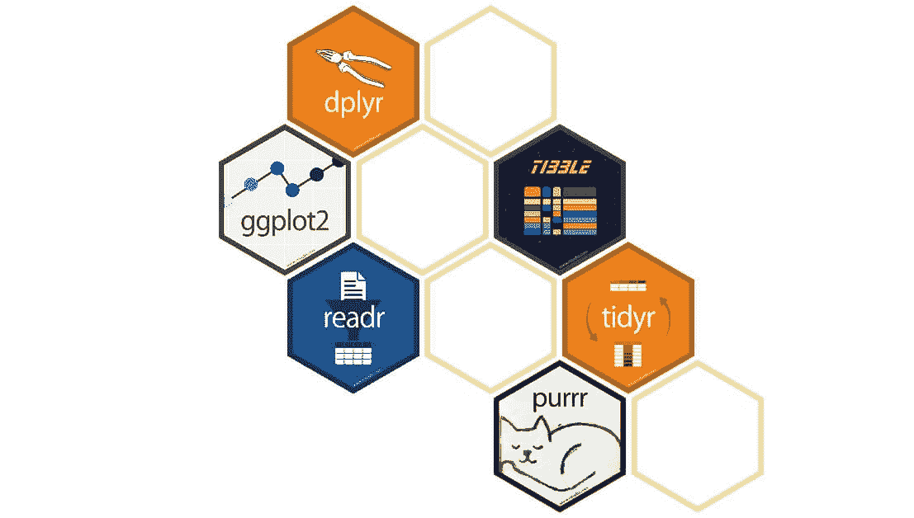
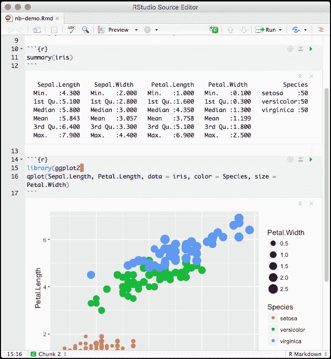
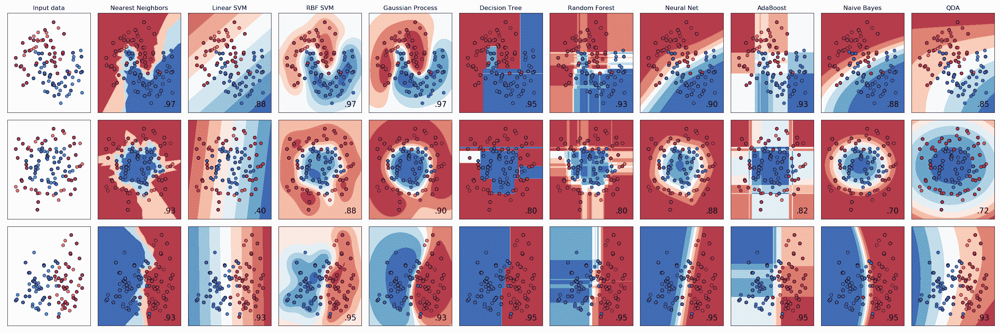
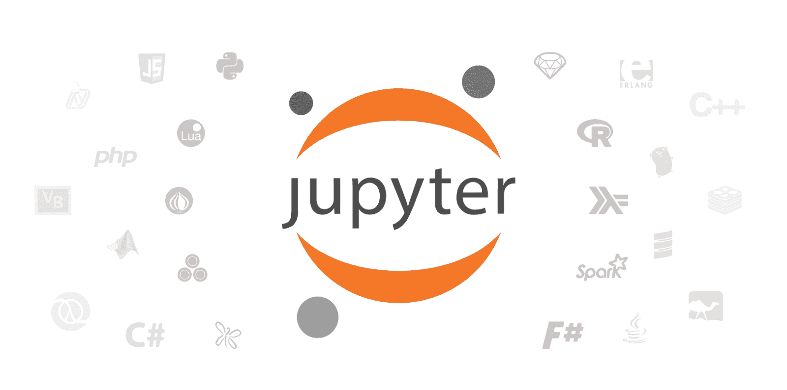

# 数据科学的 17 个最佳免费工具

> 原文：<https://www.dataquest.io/blog/best-free-tools-data-science/>

November 8, 2019

在数据科学行业工作的最大好处之一就是它充满了免费工具。总的来说，数据科学社区是相当开放和开放的，专业数据分析师和数据科学家每天使用的许多工具都是完全免费的。

但是，如果你刚刚开始，那么可供你使用的资源数量可能会多得令人不知所措。因此，我们没有把你埋在开源好东西的列表中，而是挑选了一些我们绝对喜欢的:使用 Python、R 和 SQL 的数据科学的最佳免费工具。

## 语言

很容易忘记，因为它们无处不在，但编程语言确实是数据科学工作的最佳免费工具。简单地学习这些语言中的一种，你就能获得巨大的分析能力。我们在这里列出的三种语言——数据科学中最常用的三种语言——都是完全免费使用的。

对于 post 人员来说，语言是他们在选择数据科学工具时做出的最大选择。三种最好的语言是:

*   稀有
*   计算机编程语言
*   结构化查询语言

您会发现数百篇文章试图区分 Python 和 R 哪个更适合数据科学。我们已经写了自己的文章[比较 Python 和 R](https://www.dataquest.io/blog/python-vs-r/) 在更客观的基础上——每种语言如何处理常见的数据科学任务。

事实上，它们都是很好的选择，各有各的优势，我们将在下面概述。如果你刚刚开始，最好选择其中任何一个并开始学习，而不是浪费时间试图找出哪个是最好的。

另一方面，SQL 是 Python 和 r 的补充。它可能不是你学习的第一门语言，但是你*将*需要学习它。

#### 1.稀有

R 编程语言最初创建于 90 年代中期。r 是整个学术界选择的统计语言，以易学著称，尤其是对那些以前从未使用过编程语言的人来说。

R 语言的一个主要好处是它主要是为统计计算而设计的，所以数据科学家需要的许多关键特性都是内置的。

r 还有一个强大的软件包生态系统，允许扩展功能。有几个 R 包被许多人认为是处理数据的必备工具。我们将在后面的“R 包”部分概述这些内容。

#### 2.计算机编程语言

和 R 一样，Python 也是在 90 年代创建的。但与 R 不同，Python 是一种通用编程语言。它通常用于 web 开发，是最流行的整体编程语言之一。

在 2000 年代中后期，使用 Python 进行数据科学工作开始变得流行起来，因为出现了专门的库(类似于 R 包),为处理数据提供了更好的功能。在过去的十年中，Python 作为数据科学语言的使用有了巨大的增长，从某些指标来看，它现在是数据科学最流行的语言。

Python 的主要优势之一是，因为它是一种通用语言，所以更容易执行与数据工作相关的一般任务。类似地，如果你学习 Python，后来发现软件开发比数据科学更适合你，你所学的很多东西都是可以转移的。

#### 3.结构化查询语言

SQL 是 Python 和 R 的补充语言——如果有人想进入数据科学领域，它通常会是他们学习的第二种语言。SQL 是一种用于与存储在数据库中的数据进行交互的语言。

因为世界上大部分数据都存储在数据库中， [SQL 是一种非常有价值的学习语言](https://www.dataquest.io/blog/why-sql-is-the-most-important-language-to-learn/)。数据科学家通常使用 SQL 来检索数据，然后使用 Python 或 r 来清理和分析这些数据。

许多公司还将 SQL 作为“一流”的分析语言，使用允许直接从 SQL 查询结果构建可视化和报告的工具。

R 包

R 有一个欣欣向荣的软件包生态系统，为核心 R 语言增加了功能。这些包由 [CRAN](https://cran.r-project.org/) 分发，可以使用 R 语法下载(与使用单独包管理器的 Python 相反)。我们下面列出的包是 r 中一些最常用和最流行的数据科学包。

#### 4.Tidyverse

从技术上来说， [tidyverse](https://www.tidyverse.org/) 是 R 包的集合，但我们在这里将它一起包含进来，因为它是 R 中数据科学最常用的一组包，集合中的关键包包括用于数据操作的 dplr、用于导入数据的 readr、用于数据可视化的 ggplot2 等等。

tidyverse 包有一个自以为是的设计哲学，围绕着“整齐的数据”——具有一致形式的数据，使得分析(特别是使用 tidyverse 包)更容易。

tidyverse 的流行程度已经达到了这样的程度，对许多人来说,“在 R 中工作”的想法实际上意味着在 R 中与 tidyverse 一起工作。

#### 5.ggplot2

ggplot2 包允许你在 r 中创建数据可视化。尽管 ggplot2 是 tidyverse 集合的一部分，但它存在于集合之前，并且重要到足以提及它是自己的。

ggplot2 很受欢迎，因为它允许您使用易于理解的语法快速创建专业外观的可视化效果。

R 包括内置的绘图功能，但是 ggplot 包通常被认为是更好的和更容易使用的，并且是数据可视化的头号 R 包。

#### 6.r 降价

R Markdown 包有助于使用 R. R Markdown 文档创建报告，R Markdown 文档是包含与 Markdown 文本交错的代码片段的文本文件。

R Markdown 文档通常在笔记本界面中编辑，该界面允许并排创建代码和文本。笔记本界面允许代码被执行，并且代码的输出与文本一起被看到。

行动中的 R Markdown 笔记本

R Markdown 文档可以呈现为多种多样的格式，包括 HTML、PDF、Microsoft Word、书籍等等！

#### 7.发光的

这个[闪亮的包](https://shiny.rstudio.com/)允许你使用 r 构建交互式的 web 应用程序。你可以构建一些功能，允许人们以网页的形式与你的数据、分析和可视化进行交互。

Shiny 特别强大，因为它消除了创建应用程序时对 web 开发技能和知识的需求，并允许您专注于您的数据。

#### 8.最低贷款利率(minimum lending rate)

[mlr 包](https://mlr.mlr-org.com/)提供了一组标准的语法和功能，允许您在 R 中使用机器学习算法。虽然 R 具有内置的机器学习功能，但使用起来很麻烦。Mlr 提供了一个更简单的界面，因此您可以专注于训练您的模型。

mlr 包含分类、回归和聚类分析方法以及无数其他相关功能。

## Python 库

和 R 一样，Python 也有蓬勃发展的包生态系统，虽然 Python 包通常被称为库。

与 R 不同，Python 的主要目的不是作为一种数据科学语言，所以使用像 pandas 这样的以数据为中心的库或多或少是在 Python 中处理数据所必须的。

可以使用 [pip](https://pypi.org/project/pip/) 从[PyPI](https://pypi.org/)(Python 包索引)下载 Python 包，这是 Python 自带的一个工具，但在 Python 编码环境之外。

(pip 的补充选择是 conda 包管理器，我们将在后面讨论它。)

#### 9.熊猫

[pandas 库](https://pandas.pydata.org/)是为清理、操作、转换和可视化 Python 中的数据而构建的。虽然它是一个单独的包，但它在 R 中最接近的模拟是 tidyverse 集合。

除了提供很多便利之外，pandas 在处理数据方面通常比纯 Python 更快。和 R 一样，pandas 也利用了矢量化的优势，加快了代码的执行速度。

#### 10.NumPy

NumPy 是一个为科学计算提供功能的基本 Python 库。NumPy 提供了构建 pandas 的一些核心逻辑。通常，大多数数据科学家将与 pandas 一起工作，但是了解 NumPy 很重要，因为它允许您在需要时访问一些核心功能。

#### 11\. Matplotlib

Matplotlib 库是一个强大的 Python 绘图库。数据科学家经常使用库中的 Pyplot 模块，它提供了绘制数据的标准接口。

pandas 中包含的绘图功能在幕后调用 matplotlib，因此理解 Matplotlib 有助于定制 pandas 中的绘图。

#### 12\. Scikit-Learn

[Scikit-learn](https://scikit-learn.org/stable/) 是 Python 最流行的机器学习库。该库提供了一组基于 NumPy 和 Matplotlib 构建的工具，用于准备和训练机器学习模型。

用 scikit-learn 库创建的图

可用的模型类型包括分类、回归、聚类和降维。

#### 13\. Tensorflow

[Tensorflow](https://www.tensorflow.org/) 是一个 Python 库，最初由 Google 开发，提供了与神经网络和深度学习合作的接口和框架。

Tensorflow 非常适合深度学习擅长的任务，如计算机视觉、自然语言处理、音频/视频识别等。

## 软件

到目前为止，我们已经了解了数据科学的最佳语言以及其中两种语言的最佳包。(作为一种查询语言，SQL 有点不同，不使用相同意义上的“包”)。

接下来，我们将了解一些对数据科学工作有用的软件工具。这些都不是开源的，但是任何人都可以免费使用，如果你经常处理数据，它们可以节省大量时间。

#### 14.谷歌工作表

如果这不是一个免费工具的列表，那么毫无疑问微软 Excel 将会在这个列表的顶端。无处不在的电子表格软件使得以可视化的方式处理数据变得快速和容易，并且被全世界数百万人使用。

谷歌的 Excel 克隆版拥有 Excel 的核心功能，任何拥有谷歌账户的人都可以免费使用。

#### 15.RStudio 桌面

RStudio 桌面是最流行的 R 工作环境，它包括代码编辑器、R 控制台、笔记本、绘图工具、调试工具等等。

此外，Rstudio(开发 Rstudio 桌面的公司)是现代 R 开发的核心，雇佣了 tidyverse、shiny 和其他重要 R 包的开发人员。

#### 16.Jupyter 笔记型电脑

Jupyter Notebook 是使用 Python 进行数据科学研究的最流行的环境。与 R Markdown 类似，Jupyter 笔记本允许您将代码、文本和绘图合并到一个文档中，这使得数据工作变得容易。

像 RMarkdown 一样，Jupyter 笔记本可以导出为多种格式，包括 HTML、PDF 等。

Dataquest 的 guided Python [数据科学项目](https://www.dataquest.io/data-science-projects/)几乎所有的任务学生都在 Jupyter 笔记本上构建项目，因为这是工作数据分析师和科学家在现实世界工作中通常做的事情。

#### 17.蟒蛇

Anaconda 是 Python 的一个发行版，专门用于帮助您安装科学的 Python 工具。在 Anaconda 之前，唯一的选择就是自己安装 Python，然后一个一个的安装类似 NumPy，pandas，Matplotlib 这样的包。这并不总是一个简单的过程，对于新的学习者来说也很困难。

Anaconda 在一个简单的安装中包含了数据科学所需的所有主要包，这节省了时间并允许您快速入门。它还内置了 Jupyter 笔记本电脑，可以从启动窗口轻松启动新的数据科学项目。这是开始使用 Python 进行数据科学的推荐方法。

Anaconda 还包括 conda 包管理器，它可以作为 pip 的替代来安装 Python 包(尽管如果您愿意，也可以使用 pip)。

## 免费学习数据科学

上面，我们列出了一些最好的数据科学免费工具。但是当然，这些工具中的大多数只有在你学会了有效使用它们所需的技能后才是真正有用的。

谢天谢地，也有很多学习数据科学的免费资源！我们重点介绍了一些关于数据科学的[最佳免费书籍](https://www.dataquest.io/blog/data-science-books/)，我们还发布了许多免费的 [Python 教程](https://www.dataquest.io/python-tutorials-for-data-science/)和 [R 教程](https://www.dataquest.io/r-tutorials-for-data-science/)，让学习变得更加容易。

不过，最好的学习方法是实际编写代码。我们的交互式浏览器课程将帮助您快速编写真正的代码并使用真正的数据。我们每条学习路线的前两门完整课程都是免费的，这些课程花费了我们数小时的学习时间，涵盖了所有的基础知识等。

我们不用视频，不用选择题，也不用填空题。相反，我们要求你从一开始就在实际的功能代码中应用你所学的一切。我们会自动检查您的答案，以确保您回答正确。

## 获取免费的数据科学资源

免费注册获取我们的每周时事通讯，包括数据科学、 **Python** 、 **R** 和 **SQL** 资源链接。此外，您还可以访问我们免费的交互式[在线课程内容](/data-science-courses)！

[SIGN UP](https://app.dataquest.io/signup)