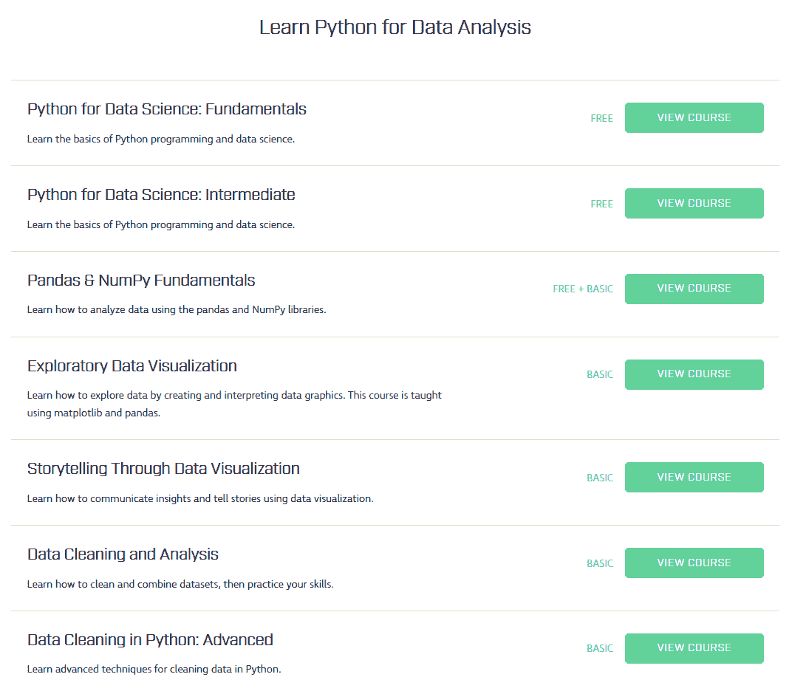

# Dataquest 的理念:构建完美的数据科学学习工具

> 原文：<https://www.dataquest.io/blog/the-perfect-data-science-learning-tool/>

August 6, 2019When I launched Dataquest several ago, one of the first things I did was write a [blog post about why](https://www.dataquest.io/blog/learning-data-science/). Here, I’d like to dig a bit deeper into Dataquest’s philosophy.

在我创办 Dataquest 的时候，如果你想成为一名数据科学家，你会在 EdX 或 Coursera 等网站上遇到许多课程，找工作并不容易。我看到许多有前途的学生放弃学习数据科学，因为他们陷入了反复学习相同课程的循环中。

我试图用 Dataquest 解决学习数据科学的两个主要障碍:从理论到应用的挑战，以及知道下一步该学什么的挑战。

我坚信每个人都应该有机会做自己感兴趣的工作，Dataquest 是一种将这种信念付诸行动的方式，可以帮助其他人在一个困难的领域获得立足点。

多年来，我们一直努力让在一个地方学习数据科学职位所需的所有技能变得简单。从基本的 Python 和 R 到 SQL 再到机器学习，Dataquest 教你正确的技能，并帮助你建立一个项目组合。

当我们建立这个网站时，我们学到了很多如何最有效地帮助学生的经验。我们一直在逐步扩大我们最初设想的范围。在这篇文章中，我想概述一下我们现在关注的是什么，以及我们的前进方向。在这个过程中，我希望说明为什么 Dataquest 是您学习数据科学的好地方。

## Dataquest 的哲学，基于多年的观察

人们常说，学习本身就是一种奖励。像前面提到的 edX 和 Coursera 这样的大规模开放在线课程(MOOC)网站就是基于这种智慧而创建的。

相反，我们发现我们的学生学习数据科学是因为他们喜欢它*和*因为他们想要更好的工作。这一观察促使我们变得更加专注于职业。学生们最希望的是一条通往数据科学职业生涯的更好的道路，我们认为这是我们能够努力的最高杠杆。

在我们帮助人们为新职业做好准备的同时，我们提出了四项重要观察:

*   专注对于保留知识至关重要，尤其是当你时间有限的时候。
*   动机是你能否找到工作的最重要的决定因素。
*   很容易陷入“困境”和沮丧——及时的帮助是关键。
*   没有太多好的职业建议和面试准备帮助。

让我们更深入地研究这些观察，看看它们是如何影响我们的思维的。

#### 焦点

当您学习数据科学时，很容易迷失在工具的海洋中。有人告诉你，你必须学习 R、Python、Spark 和 Tensorflow。如果你不这样做，你就不是一个“真正的”数据科学家。这令人不快，但更重要的是，这实际上不是真的。

相反，我们发现最终找到工作的学生更关注概念而不是工具。如果你从零开始学习如何实现一个随机森林，并且知道训练它所涉及的权衡，那么你是使用 Python、Scala 还是 R 来做预测都没关系。

概念在工具之间泛化；如果你很好地学习了一个概念，你可以使用任何工具来实现它。如果你能在 R 中拟合一个决策树模型，你会有一些工作前景，但是如果你深刻理解这个模型及其工作原理，你会有一个数量级的提升。

一次专注于几个概念，在继续学习之前掌握它们是保留知识的关键。我们一直非常专注于 Dataquest，因此知识会深入人心。我们的互动平台不断挑战学生，让他们在进入下一步之前通过编写自己的代码来应用他们所学的知识，这样他们就可以一步一步地学习，并在他们没有理解某些内容时从我们的答案检查系统中获得即时反馈。

我们有一个线性课程，带你从没有编程知识一直到高级机器学习。因为我们开发了整个课程，所以我们能够按照逻辑顺序教学，并确保你永远不会迷路。我们一贯的风格和对概念的关注意味着你可以一次专注于学习一个概念。

例如，下面是我们的[数据分析师在 Python 路径](https://www.dataquest.io/path/data-analyst/)中的前几个步骤。每门课程都建立在前一门课程所学技能的基础上。

#### 动机

学校里经常教导说，教师的工作是教学，而你的工作是激励学生。但是如果你没有动机，即使是一个非常了解材料的老师也不会有效。

我们发现动机是找到工作的学生和找不到工作的学生之间最大的区别。仅仅“打勾”领证是不够的。你必须建立项目来展示你的技能并建立一个投资组合。建立一个好的需要真正的兴趣和动力。

为了有动力建立有效的项目，你必须真正喜欢与数据打交道。正如我在一篇关于如何学习数据科学的博客文章中所写的，学习数据科学的先决条件是找到让你感兴趣和激励你的问题。

在 Dataquest，我们的理念是**激励**是*我们*的工作，我们围绕这一点来定位网站。

我们设计了我们的课程，将几十个有趣的数据集交织在一起，包括中情局干预和 NBA 球员统计数据。当你准备好了，我们包括几十个有趣的项目，探索如何赢得危险和股票价格预测等主题。通过专注于吸引和激励您，我们帮助您在获得数据科学工作的旅程中走得更远。

例如，这里有一个指导项目的屏幕，您使用 SQL 来分析电影评论网站上评分的一些差异:

#### 被“卡住”

当涉及到更多开放式项目的工作时(这是所有有抱负的数据分析师和数据科学家都需要做的事情)，我们发现学生需要帮助来“摆脱困境”。

被卡住的范围从不知道如何安装软件包到难以概念化数据的结构。学生们通常不需要大的帮助——只是朝着正确方向的一个小小的推动或者信心的提升都是非常宝贵的。

我们已经意识到，当你陷入困境时，这些小挫折累积起来，会降低你的动力，使你更有可能达不到你的目标。我们设计了一些系统，确保您可以从导师或同行那里获得帮助，以避免这种挫折，包括我们的[数据科学学生社区](https://community.dataquest.io/)。

#### 职业建议

我们注意到，我们的许多学生都有职业问题，从想知道他们应该学习什么技能才能最受雇主欢迎，到面试中可能会问什么问题，到他们的投资组合应该是什么样子。

为了帮助回答这些问题，我们采访了数十位数据科学家、招聘人员和招聘经理，并制作了一份[数据科学职业指南](https://www.dataquest.io/blog/data-science-career-guide/)。对于高级订户，我们还提供职业咨询，在更直接、更私人的层面上帮助解决职业问题。当然，学生们也可以在[学生社区](https://community.dataquest.io/)向同龄人和导师寻求职业建议。

## 完美的数据科学学习工具

基于上述观察，Dataquest 的理念是，理想的数据科学学习工具应包括以下要素:

1.  为您提供学习数据科学的路线图。
2.  允许您通过在浏览器中编码来练习技能。
3.  以应用的方式教授高级概念。
4.  帮助您建立项目组合。
5.  通过导师和社区帮助为您提供支持。
6.  指导你的职业选择，并帮助你找到潜在的雇主。

我们认为我们正在处理所有这六个元素，尽管我们肯定还有很多可以改进的地方。我们一直在努力改进 Dataquest，所以让我们来看看这六个方面，我们提供了什么，我们正在努力改进什么。

#### 1.数据科学路线图

数据科学路线图可以让您保持专注和按部就班，而不必考虑下一步该走哪条路。我们目前提供四种学习途径，旨在让学生从零经验到做好工作准备，成为数据分析师(Python 或 R)、数据科学家(Python)和数据工程师(Python)。

但是我们能做的还有很多。在不久的将来，我们计划重新推出我们的数据工程课程，使其对初学者更加友好，我们也在不断努力扩展我们的 R 课程，最终目标是培养一名 R 路径的数据科学家。

#### 2.浏览器内编码

当你是一个初学者时，安装像熊猫这样的软件包或像 Spark 这样的工具要花很长时间，这是令人惊讶的。Dataquest 让您可以在浏览器中体验一下，编写真正的代码，而无需在本地进行任何设置。我们有自动化的答案检查，这使得在我们的网站上工作比在你的本地机器上工作更有利于学习。

不过，最终每个人都需要适应在本地工作，因此我们也帮助您在自己的计算机上设置一切，以便在自己的计算机上工作。

在过去的一年中，我们推出了一些令人兴奋的变化，如具有更好的浏览器内界面的大修命令行课程，以及使我们基于浏览器的系统更加可靠和快速的代码运行改进。我们一直在努力改进和优化我们的平台，因此在可预见的未来，我们将继续努力改进我们的交互式浏览器内编码。

#### 3.应用概念

我们的课程通过让您使用有趣的数据集解决实际问题，向您传授决策树等数据科学概念。例如，您可能会处理有关航空事故或全球教育成就的数据。使用我们的浏览器内编码系统，您将一点一点地学习，在操作真实数据集的代码中应用每个概念。

一旦你学会了这些技能，你将能够在更大的指导项目中应用它们，这些项目仍然提供一些结构，同时挑战你综合你所学的新技能。

这种先学习后应用的循环有助于你快速发展和巩固你的技能。我们认为，我们的概念学习和应用的快速循环穿插着更大的指导项目是教授数据科学的最有效方式，我们的学生也同意这一点。

(查看我们的[学生故事](https://www.dataquest.io/blog/topics/student-stories/)，看看有多少学生提到他们已经尝试了多种平台，但 Dataquest 是“迫使他们思考”并应用他们所学知识的平台)。

不过，总有改进的空间，我们会根据学生数据不断迭代和调整我们的课程。例如，如果我们发现学生在某个特定的屏幕上卡住了，我们可以也确实会做出调整。这是我们将继续做的事情，在未来的岁月里，我们将做得更多。

#### 4.项目

我们帮助你建立一个项目组合。这不仅有助于你实践和学习概念，也有助于你获得工作面试！

招聘经理在决定面试谁时，越来越多地考虑投资组合。就连面试也越来越倾向于将项目作为一种评估手段——你可能会得到一个带回家的或亲自参与的项目作为面试的一部分。

我们知道 Dataquest 的引导式项目可以帮助人们找到工作— [这里有一个这样的例子](https://www.dataquest.io/blog/double-salary-dataquest-student/)。但是，我们希望提供更多的项目和更广泛的数据集，让学生在学习我们的课程时有更多的选择。

#### 5.一路支持

现在，你可以在我们的学生社区从其他学习 Dataquest 的学生那里获得帮助，我们的数据科学家也经常在那里发帖。这种帮助对于保持你的注意力和积极性是至关重要的。今年，我们将努力扩大该社区，并引入工具，使其在遇到困难时更有效地快速找到您需要的帮助。

#### 6.职业帮助

在过去的一年里，我们发布了一份超过 30，000 字的[数据科学职业指南](https://www.dataquest.io/blog/data-science-career-guide/)，这是基于对专家的几十次采访。它涵盖了工作申请过程的每个阶段。

我们还为 Dataquest Premium 用户提供[职业咨询](https://www.dataquest.io/blog/data-science-career-coaching/),以便他们可以获得更多个人职业问题的帮助。

在未来的一年里，我们计划引入更多的职业帮助，例如与职业专家举行社区网络研讨会，他们可以提供建议和回答问题。

## Dataquest 的理念:展望未来

正如您所读到的，您可以期待 Dataquest 的许多改进。但是进步不会一蹴而就，它会定期发生，因为我们会不断调整 Dataquest 体验。

我们在不断迭代和改进平台体验，我们也在不断编写和发布新的课程来扩展我们的课程。如果您选择订阅，您将看到[我们的课程目录](https://www.dataquest.io/data-science-courses-directory/)随着您的学习而扩展，因此总会有新的东西添加到您的技能组合中。

祝你学习数据科学好运，希望我已经说服你试用 [Dataquest](https://www.dataquest.io) ！如有任何问题，请[联系](/cdn-cgi/l/email-protection#dbb3beb7b7b49bbfbaafbaaaaebea8aff5b2b4)。

## 获取免费的数据科学资源

免费注册获取我们的每周时事通讯，包括数据科学、 **Python** 、 **R** 和 **SQL** 资源链接。此外，您还可以访问我们免费的交互式[在线课程内容](/data-science-courses)！

[SIGN UP](https://app.dataquest.io/signup)