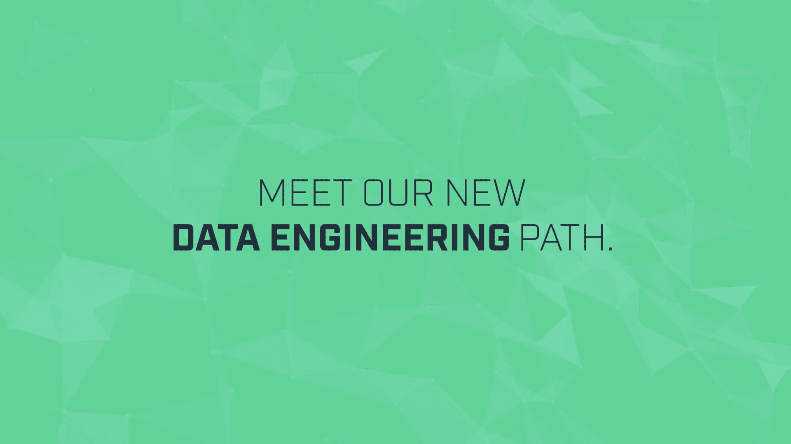
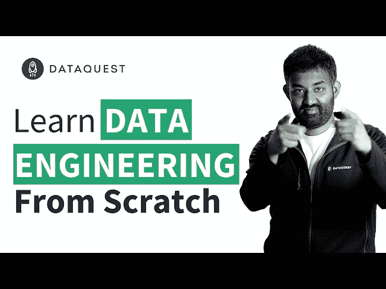

# 用我们的新方法从完全初学者变成数据工程师

> 原文：<https://www.dataquest.io/blog/total-beginner-become-data-engineer/>

October 16, 2019

我们得到了一些非常令人兴奋的消息:我们刚刚启动了对我们的 [**数据工程学习路径**](https://www.dataquest.io/path/data-engineer/) 的全面改造！

这条修改过的路线被设计成更像我们的其他路线。即使你没有**以前的编码经验**，你也可以开始，它会带你从完全的初学者到有经验的从业者，拥有**成为数据工程师**所需的所有核心技能。

如果你以前检查过路径，你会注意到我们已经改变了很多。我们增加了一些新课程。我们已经创建了现有课程的定制数据工程版本，并将其添加到该路径中。为了更有效的学习和更准确的答案检查，我们已经优化了所有课程的*。*

简而言之:DE 路径现在已经准备好带你从零开始一路到达你的目标。

哦，我们有没有提到你可以免费试用很多课程内容？

*[https://www.youtube.com/embed/DU1PirFI21A?feature=oembed](https://www.youtube.com/embed/DU1PirFI21A?feature=oembed)*

 *## 数据工程之路有什么新内容？

新路径从三门 Python 课程开始，旨在让你从没有编程背景到精通 Python 基础。这些课程基于我们非常受欢迎的 Python 数据科学课程，但我们对它们进行了调整，以更准确地关注数据工程师需要的技能。

从那里，路径挖掘 SQL 技能，有两个 SQL 课程旨在让你开始和运行。虽然它不像其他技术技能那样“性感”，但 SQL 是任何数据角色的关键技能，对于经常与 SQL 数据库交互的数据工程师来说尤其重要。

有了这些基础知识，这条路就通向更高级的、特定于数据工程的技能。有几门关于 Postgres 的课程，还有一门关于优化大数据代码性能的课程。还有优化熊猫、递归和树、算法和数据结构、构建数据管道等课程。

有关具体内容的更多细节，请查看[路径页面和课程列表](https://www.dataquest.io/path/data-engineer/)。正如我们去年推出的改进后的 R 路径一样，**我们也将随着时间的推移，用新的课程**扩展这条路径，使之更加详尽。

此外，该路径中的 ***一切*都经过了优化**和返工，以改善学生体验。我们增加了新的内容，但我们也极大地改进了旧的内容，以使 DE 路径达到我们其他学习路径的标准。

## 成为一名数据工程师

数据科学家可能是“21 世纪最性感的工作”，但工程师是高效数据科学团队的关键成员。根据 2019 年 10 月来自[实际上](https://www.indeed.com/salaries/Data-Engineer-Salaries)的数据，尽管这个角色背后的炒作较少，但数据工程师的平均工资实际上比数据科学家高。

准备好迈出成为数据工程师的第一步了吗？今天就来看看我们新推出的 DE path 吧！

### 成为一名数据工程师！

现在就学习成为一名数据工程师所需的技能。注册一个免费帐户，访问我们的交互式 Python 数据工程课程内容。

[Sign up now!](https://app.dataquest.io/signup)

*(免费)*

*[https://www.youtube.com/embed/ddM21fz1Tt0?rel=0](https://www.youtube.com/embed/ddM21fz1Tt0?rel=0)**