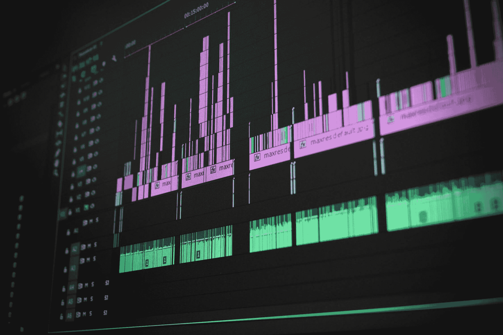

# 最好的学习习惯:给你的教中学增压

> 原文：<https://www.dataquest.io/blog/best-study-habit/>

November 14, 2019

无论你是在[学习数据科学](https://www.dataquest.io)还是学习其他东西，都很难记住你所学的一切。

此外，当你学习像编程这样复杂的东西时，很难评估自己。能够在代码中应用一个概念并不一定意味着你理解它。这些知识缺口可能很难发现。

令人欣慰的是，大量科学研究表明，任何人都可以采用的最佳学习习惯之一非常简单:教学。

## 科学是怎么说的？

几十年来，教育研究人员已经明白，教授一门学科可以帮助学生更彻底地掌握这门学科。

例如【1982 年的一项元研究观察了 65 项关于同伴辅导项目的不同研究，发现“导师们对辅导项目所涵盖的主题有了更好的理解，并形成了更积极的态度。”

换句话说:教授他们所学的东西不仅帮助学生更好地理解材料，还让他们更喜欢它！

在 2001 年对同伴辅导科学文献的回顾中，美国教育部也发现了同样的事情:当学生们互相教学时，*双方都受益。同辈导师通常会看到理解*和*自尊两方面的收获。*

最近更多的研究证实了这些效应，并扩展了我们对如何应用它们的理解。[例如，2016 年的一项研究](https://psycnet.apa.org/record/2016-15112-009)发现，在视频上解释一个概念比重新学习更能促进学生的学习，但书面解释却不能。

研究人员刚刚开始理解为什么通过教学学习如此有效。教学迫使你回忆你学过的材料的事实是[当然是一个因素](https://profile.nus.edu.sg/fass/psylimwh/koh,%20lee,%20&%20lim%20(2018).pdf)。事实上，你被迫用自己的语言表达事情，感同身受，并以其他人可以理解的方式呈现，这可能也有帮助。

但是值得庆幸的是，作为学生，我们不需要知道为什么这种方法行得通。几十年的研究已经证实了它的有效性，所以为了提高我们的学习效率，我们真正应该关心的是*如何*。

## 如何通过教学强化你的学习

我们可以用很多方法来教授一些东西。但由于 Dataquest 的学生正在学习数据科学技能，我们将重点关注在该领域可能最有效的方法。

**现实生活中的教学。**如果你有朋友或家人真的想学习数据科学，这是一个很好的选择。大多数关于教学的研究都集中在面对面的辅导上，所以你可以放心，这种方法有几十年非常坚实的科学支持。

然而，在现实世界中很难找到其他数据科学学生来授课。匹配适当的技能水平和协调时间表可能是一个真正的挑战，尤其是长期的挑战。

**塑料鸭嘴兽学习/橡胶鸭子调试。**这种方法包括“教导”一个无生命的物体(比如玩具鸭嘴兽或橡皮鸭)，并假装它是一个同伴。当然，你不会从你的塑料朋友那里得到任何互动。但是这种模拟教学仍然可以帮助你更好地理解你正在学习的东西。

同样的原理也用于编程中的一种常见技术，称为橡皮鸭调试。假装向一只橡皮鸭解释你的代码在做什么，在这个过程中，你会经常发现错误和问题。

见见你的新学生。

**用视频教学。**在这个互联网时代，没有必要在你所在的地区寻找数据科学专业的学生。相反，您可以创建视频，向网络上成千上万的数据科学学生传授您所学的知识！

这是我们推荐大多数人采用的方法，它有一些主要优点:

*   这是有效的:如前所述，研究已经证实，通过视频教学似乎创造了类似于现实生活中的辅导效果。
*   它是互动的:来自在线观众的问题和评论可以帮助你发现你正在犯的错误，并突出你的理解可能没有你想象的那么完整的领域。获得你的视频帮助了某人的反馈也可以帮助你建立继续学习的动力和信心。
*   它很方便:与现实生活中的辅导不同，你不必担心协调时间表、交通或技能水平。有了现代的屏幕录制软件，整合一堂课变得非常快。
*   这是免费的:如果你有一台内置麦克风的电脑(或一部可以录制音频的智能手机，并且愿意做一点编辑)。

在下一节中，我们将通过介绍一些基本方法和强调一些免费工具，让视频教学变得更加简单。

视频编辑软件(别担心，你的视频课程可以比你在这里看到的要简单得多)。

## 如何通过视频或直播进行教学

虽然您当然可以创建更精细的视频产品，但为了增强您的学习，简单的屏幕录制可能就可以了。毕竟，我们在这里的目标是利用一个最好的学习习惯来提高我们自己的学习，而不是赢得奥斯卡奖！

所以不一定要复杂。例如，在我们的互动[数据科学课程](https://www.dataquest.io/path/data-scientist/)中，您可以在完成任务的过程中录制您的屏幕，解释您正在做什么以及为什么要做。

当然，要真正做到这一点，您仍然需要设置一些东西:

#### 录像

你需要一些方法来记录你的屏幕，这样你就可以向人们展示你在做什么。

如果您需要免费的解决方案，[Open Broadcaster Software(OBS)](https://obsproject.com/)是一款免费的开源屏幕录制和流媒体程序，适用于 Windows、Mac 和 Linux。

它主要是为流媒体而设计的，所以当你第一次尝试时，要想知道如何用你想要的设置将你的屏幕录制成视频文件，有时可能需要一些摆弄。但是一旦你弄明白了，它应该可以完美地工作，而且不需要任何花费！

Screencast-o-matic 还为 Mac、Windows 和 Chromebook 提供了一个免费的屏幕录制器，设置起来更容易一些，尽管它不适用于直播，而且有些选项只对付费用户可用。

#### 声音的

你还需要一些方法来记录你工作时所说的话。如果您的电脑有内置麦克风，或者您有一个插入式电脑麦克风，这可能就像打开麦克风并确保屏幕录制器中的音频输入设置正确一样简单。

如果你的电脑上没有麦克风，你仍然可以录制你的屏幕，并使用智能手机录音机来捕捉你说话时的音频，但你必须在完成后将音频和视频文件放入一些视频编辑软件中进行同步。

#### 可选:视频编辑软件

如果你确实需要同步音频和视频，或者如果你想添加其他华丽的东西，呈现一个更精致的课程，你将需要某种视频编辑软件。

你的电脑可能带有一些基本的编辑软件来完成这个任务。如果你想更上一层楼， [DaVinci Resolve](https://www.blackmagicdesign.com/products/davinciresolve/) 是一个专业级编辑程序，在 Windows、Mac 和 Linux 上完全免费。

#### 一个平台

最后，你需要一个地方来发布你的视频。理想情况下，其他人可以找到它，并留下问题和评论，这样你就可以通过教学获得互动的好处。

当然，Youtube 是一个很好的选择，像脸书和推特这样支持视频的社交媒体平台也是。如果你在寻找实时互动，你可以在这些平台中的一个或像 [Twitch](https://twitch.tv) 这样的特定流媒体平台上进行直播。

当你的视频准备分享时，很容易成为冒名顶替综合症的受害者。但是请记住:这里的目标是帮助你自己学得更好。科学表明，简单地制作和发布视频，你已经获得了教学的大部分好处。

(发布部分*很重要，因为如果你知道你正在制作一个没有人会看到的视频，那么你可能不会以同样的标准来要求自己，或者以同样的方式呈现事情，如果视频是公开的话。)*

因此，如果你想提高你的数据科学研究，当你学完一些东西后，开始教它吧！在 Dataquest 上，一个好的节奏可能是在你完成每个任务时制作一个小视频“教训”,解释你学到的概念以及你如何应用它们。指导性项目也可以制作出很棒的教学视频。

出去分享吧！除了是最好的学习习惯之一，如果你做得好，用视频教学也可以是建立你的“个人品牌”的好方法。

如果你根据你在 Dataquest 的研究制作了一个视频，请务必[在社区](https://community.dataquest.io/)和 Twitter 上[与我们分享！](https://twitter.com/dataquestio)