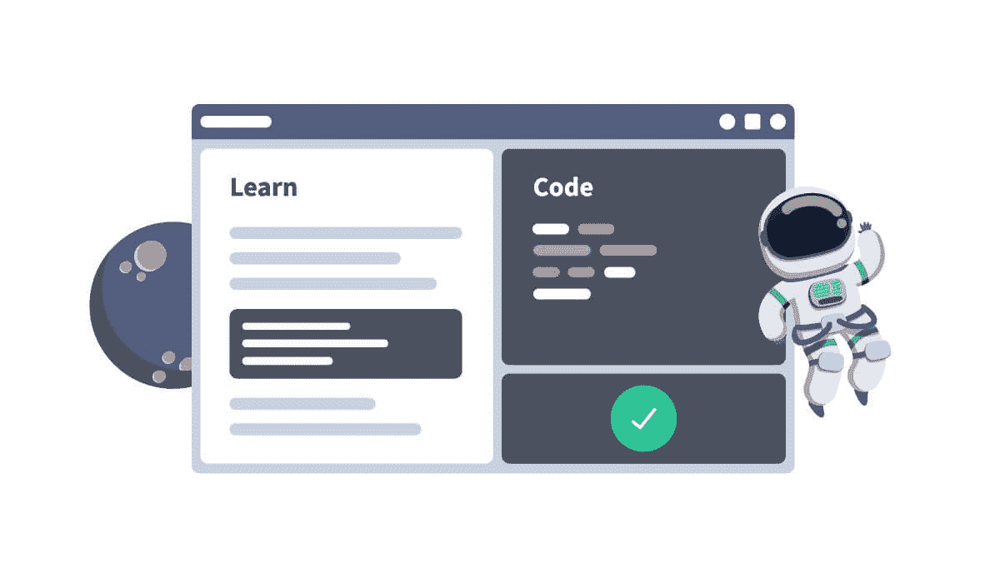
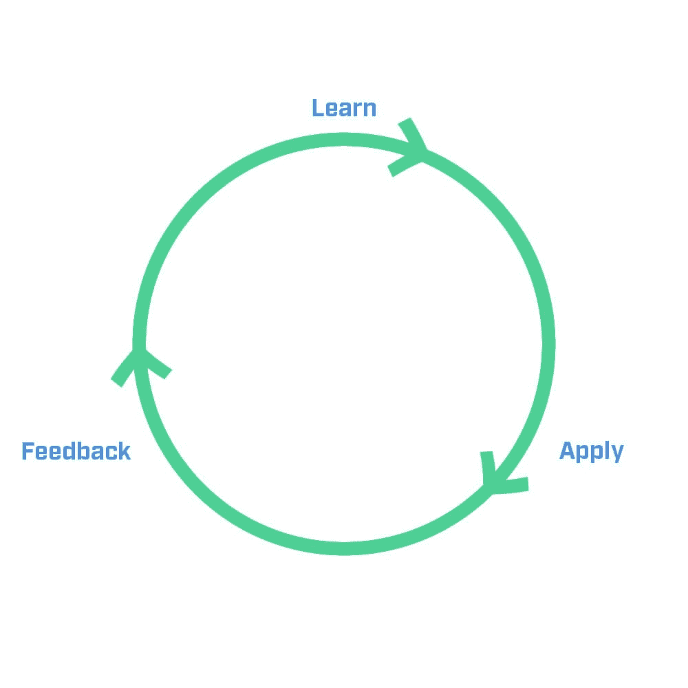

# Dataquest 的活动课程:我们如何教授数据科学

> 原文：<https://www.dataquest.io/blog/dataquest-active-curriculum-how-we-teach-data-science/>

January 3, 2020

有很多方法可以学习数据科学，包括在线和离线。但在 Dataquest，我们采取了一种独特的方法，这种方法基于我们自己的经验和来自成千上万学生完成数百万个屏幕的多年数据。

在这篇文章中，我们将解释什么是我们的活动课程，以及*为什么*我们以这种方式教学。

我们正在实施的活动课程。

## 什么是活动课程？

简而言之，我们的活动课程有三点不同于其他类型的数据科学教育:

*   精心策划的内容
*   实践学习循环
*   数据驱动的优化

我们将更详细地研究这三件事，解释我们为什么要这样做，以及为什么我们认为这种方法反映了教授数据科学技能的最有效方式。

## 精心策划的内容

我们的活动课程与其他课程的区别之一是，它是由内部专家从头开始精心规划的。

**基于真实世界数据工作的内容。**

我们的内容团队由前教师和前数据专业人员(包括一些博士)组成。但是，当决定创建什么样的课程内容时，我们首先要深入更广泛的社区。

我们分析了来自世界各地的数百份招聘信息，这样我们就可以教授最受欢迎的内容。我们还与工作数据科学家和该领域的其他专家进行了交谈，以获得有关学生在专业环境中处理数据真正需要的技能的更多信息。

这种对教授现实世界技能的关注也融入了课程本身。随着您学习新的编程和统计概念，您将面临解决现实数据分析和数据科学问题的挑战，这些问题与您在工作场所遇到的问题类似。

T2】

在线学习的一个主要挫折是课程之间的差距，这迫使你去别处寻找知识。

**无间断的课程顺序。**

因为我们的课程几乎都是由内部作者编写的，所以在编写时，我们还会考虑如何将每门课程纳入我们现有的课程目录。

尽管你可以自由选择任何顺序的课程，但是我们的每一条学习路径都是一系列精心设计的课程，允许你作为一个没有编写代码经验的绝对初学者开始。

当你完成每一门课程后，你将能够直接进入下一门课程，而不必浪费时间去寻找先决条件或搜索来填补你的知识空白。因为我们控制和计划课程的每一个方面，我们没有任何这些差距。

这种仔细的课程排序还允许我们使用后面的课程来帮助您复习和练习您在前面的课程中获得的技能。这使我们能够利用[间距效应](https://en.wikipedia.org/wiki/Spacing_effect)，帮助确保您在我们的学习过程中记住所学内容。

## 实践学习循环

我们的活动课程的最强原则之一是，为了有效地学习，你需要经常应用你所学的东西。这不仅仅是一个理论，有相当多的科学来支持它。例如，2014 年的一项元研究发现，STEM 课程中不经常应用所学知识的学生失败的可能性是 T2 的 1.5 倍。

**学习>应用>反馈循环。**

我们的互动平台旨在让您尽快掌握所学内容。在每个屏幕上，你会读到一个新概念，然后*立即*接受挑战，通过编写代码来应用它，然后由我们的答案检查器检查。以典型的节奏学习，学生不太可能在我们的平台上呆上哪怕五分钟而不写代码。

T2】

当学生将 Dataquest 与其他类似的学习平台进行比较时，我们经常听到的一件事是 Dataquest“实际上让你思考”(这里是最近告诉我们这一点的人们的两个 [例子](https://www.dataquest.io/blog/data-science-job-offers-dataquest-review/))。那是故意的。每一步，我们都想挑战你在专业环境中必须做的事情:编写真正的代码来解决问题。

我们认为，拥有一个真正快速的反馈循环——你学到一点东西，你很快编写代码来应用它，答案检查器会告诉你你是否做对了——会使学习更有吸引力、更有效。这也使得按照你自己的进度学习和在繁忙的时间表中安排学习更加实际。

但我们也知道，现实世界的数据科学工作不会以微小的块发生。这就是为什么我们的每门课程都以一个指导项目结束。这些项目模拟现实的数据科学工作。他们要求你综合并应用到那时为止你所学的一切，同时在你需要的时候提供一些指导，以确保你不会感到沮丧。它们还能帮助你建立一个数据科学项目组合，当你申请下一份工作时，你可以从中受益。

为什么没有视频？

缺少视频是我们的活动课程与大多数其他课程的最大区别之一。我们或许可以写一本书，说明为什么我们不通过视频来教授数据科学，但这里有一些最大的原因:

*   任何学生都会发现他们的注意力水平在整个学习过程中发生了变化。我们的大脑无法长时间保持完全一致的注意力和理解水平，这是很自然的。如果你是通过阅读来学习的，这些小差异并不重要。你会自然而然地调整阅读速度来适应这些变化。但是视频以统一的速度播放，这意味着对于许多学生来说，会有视频感觉太慢的时候，也有视频感觉太快的时候。这会导致无聊和/或错过内容。
*   没有人第一次就能把所有事情都做对。与简单的 Ctrl + F 相比，当你不得不回去回顾一些东西时，搜索视频可能会令人沮丧且耗时。
*   观察人们编码可能很棘手。很容易看到别人做某件事，觉得自己理解了，但后来当你试图自己应用时，才发现自己并没有想象中掌握得那么好。
*   对于非母语人士(即使有字幕)和有网络带宽限制或网速慢的学生来说，视频可能很难播放。
*   视频，除非它们非常短，否则会减缓学习>应用反馈循环。

此外，虽然这些不是视频本身的问题，但许多视频学习平台缺乏代码运行能力，因此用多项选择和填空测验来测试学生。我们不认为这是一种有效的教学方式——如果你不是真的在*写代码*，你就不是真的在学以致用。

T2】

学习写代码最好的方法是写代码，而不是看别人写代码。

**真实数据，真实问题，真实代码。**

因为我们的重点是教授就业技能，所以我们所有的课程都使用真实世界的数据集，并要求您通过编写真实的代码来解决现实的数据科学问题。这可能是老生常谈，但我们相信一句古老的教练格言:[像练习一样打球](https://signalvnoise.com/posts/3504-you-play-like-you-practice)。

换句话说，如果你的目标是用真实的数据集来解决真实的数据科学问题，你的学习和实践应该是用真实的数据集来解决真实的数据科学问题。这就是为什么即使是以前从未编写过代码的 Dataquest 学生，在开始他们的第一门课程后几分钟内也会使用真实世界的数据集。

## 专家数据驱动的优化

另一件让我们的活动课程与众不同的事情是，它不是静态的。我们总是在我们的道路上增加新的课程，但我们也在跟踪大量数据，并不断征求反馈，以便我们可以不断改进我们已经拥有的内容。

**利用数据更有效地教学。**

我们的平台收集了大量关于我们每个课程、任务和屏幕表现的数据。这使得我们的内部课程作者能够快速发现他们的某门课程出现的问题。

例如，如果在特定屏幕上运行的代码异常多，这可能表明该屏幕对于它在课程中的位置来说太靠前了，需要修改或移动。

课程作者经常挖掘这些数据来优化课程，可能包括改变练习、调整解释和改变内容。最终的结果是课程高度优化，并不断改进。

**学生反馈。**

在 Dataquest，我们热爱数据——这并不奇怪——但我们也会定期征求学生对我们课程的定性反馈。学生的反馈可以帮助我们发现数据中可能不明显的需要改进的地方，它也是帮助我们的课程作者为学生的成功优化他们的课程的另一个有价值的工具。

**内部专家。**

这种持续的优化是可能的，因为我们几乎所有的课程都是由 Dataquest 的全职员工在内部编写的。

这样可以保证每个课程都有人负责。如果出现问题，课程作者可以立即解决。如果某门课程有改进的方法，课程作者会把它作为他们定期评估课程表现的一部分。

这也意味着我们可以确保我们所有的课程作者都紧跟教育研究和数据科学行业的最新发展。我们定期就新的教学研究进行团队讨论，我们还跟踪行业趋势，以便当新技能、库、包、工作流和流程在数据科学领域变得流行时，我们可以将其应用到我们的课程中。

定期发布新课程。

当然，除了优化我们现有的课程，我们还在不断开发新的课程，为我们现有的课程增加更多的价值，并创造新的课程。例如，在 2019 年，我们推出了十几门新课程和两条完全改进的路径(我们在 R 的[数据分析师和](https://www.dataquest.io/path/data-analyst-r/)[数据工程](https://www.dataquest.io/path/data-engineer/)路径)。

我们不打算很快减速！

## TL；速度三角形定位法(dead reckoning)

简而言之，Dataquest 的课程有三个特点:

*   我们精心策划的内容
*   我们的快速实践学习循环
*   数据驱动优化，让好课程变得伟大