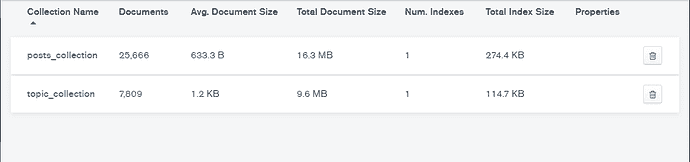

# 我是如何在三个步骤中收集到超过 25，000 个论坛帖子的

> 原文：<https://www.dataquest.io/blog/how-i-scraped-over-25000-forum-posts-in-3-steps/>

August 18, 2021

## 动机

Dataquest 社区正在发展。在过去的几个月里，我一直在关注活跃用户、新话题和讨论领域的增长。在过去的六个月中，该平台为开发各种标签做出了巨大贡献，以促进相关信息的过滤和搜索。

但是让我们尝试直接从我们的帖子和消息中创建一个标签列表。也许他们会比 Dataquest 团队提供给我们的更好，也许不会。但我认为这肯定会很有趣

我计划在这项研究的过程中写几篇文章。这是他们中的第一个。它关注的是我们最终应该得到什么，我们可以使用什么数据，以及从哪里获得这些数据背后的推理。以及数据收集本身。

## 计划

我们需要做的是:

1.  数据
2.  建模方法
3.  啤酒(那我们真的还需要别的吗？)
4.  利润


但是让我们更详细地检查一下我们复杂的计划。

### 1.数据

基于什么数据我们可以建立我们的标签？

1.  主题标题
2.  主题的文本
3.  主题中帖子的文本
4.  项目 1-3 的组合

主题标题-这应该给我们最干净的结果。因为，随着社区的发展，人们开始创造更干净的标题。理解这是我们首先看到的，所以我们有越多的标题来识别问题，我们就越有可能解决问题。

主题的文本——这给读者提供了更多的信息，但也增加了噪音。英语与俄语不同，它的结构更严格，句法修改更少。尽管如此，我们许多人的母语不是英语，有个人的写作风格，使用罕见的词汇。但主要问题是，文本通常包含代码。这可能是有用的(例如，我们可以根据我们看到“import lib”短语的频率为库创建一个标签)——这也可能是绝对无用的:想想变量、基本函数、库等等。

主题中的文章——有时候主题中的文章比主题本身更有用。他们给出了一个问题的解决方案或另一种观点(也许你对这篇文章的另一种观点是“他到底在说什么？”或者“哇，我怎么也看不够！”).但是许多帖子是无用的，因为它们可能是鼓励的话语。它们可能是离题很远的推理或澄清。这些对我们人类来说很重要，但对标签来说有必要吗？

所以，我计划用三种数据做我所有的实验。

1.  仅标题
2.  标题+主题文本
3.  标题+主题文本，主题中的帖子。

在第 3 阶段，我们将主题数据合并到一个文档中，但是我们将帖子视为独立的文档。

#### 但是我们从哪里得到数据呢？

我想如果我接触了 Dataquest 团队，我就可以从他们那里得到一部分数据库来做我的研究。但是真正的英雄总是反其道而行之，所以作为一名网络抓取专家(你们中的许多人都知道我是一个不需要硒来完成这项任务的人)，我将为 Dataquest 编写一个爬虫。显然是时候展示我的技能了！

### 2.建模方法

我们有数据。那我们怎么把标签弄出来呢？我相信这是一个叫做主题建模的自然语言处理问题。但是这是一个特例，我们需要将讨论类型减少到它们的关键词。这很好，但是我们应该使用哪种主题建模方法呢？LSA，LDA，深度学习？

我们试试我能找到的一切(你可以在这里阅读)，然后比较最后的结果，怎么样？或者你也可以参加这项研究，它会走上一条与我现在想象的完全不同的道路。嗯，我想尝试一切，听起来很棒，听起来很有野心。

### 3.利润

我们应该得到什么样的结果？有趣是好的，但你不能用它来买啤酒。所以我们要去找有形的东西。

我们将使用一个更简单的例子来处理建模主题的不同方法。我们将会看到哪种方法更有效。如果我们发现我们可以用它来制作一个好的工具，我们将会用一个应用程序和一个部署来结束这个系列。

那么，我们想要多少个标签呢？假设是 100 个，但是他们必须很棒！或者不是。让我们开始吧。

## 收集数据

### 扫描策略

在对这个网站做了一些研究之后，https://community.dataquest.io/提出了以下计划。

为了收集数据，我们实际上需要三个步骤:

1.  从头到尾滚动浏览[https://community.dataquest.io/latest](https://community.dataquest.io/latest)，直到我们收集到这些主题的链接。
2.  转到每个主题获取文章的正文。
3.  在每个主题中，滚动浏览所有帖子以收集每个帖子，因为我们有像[https://community . data quest . io/t/welcome-to-our-community/236/](https://community.dataquest.io/t/welcome-to-our-community/236/)这样的怪物，有超过 900 个帖子。

也许有人已经在想，如果不使用 selenium，我将如何呈现 js——或者我可能已经决定，在这种情况下，Selenium 有意义吗？

没有(惊喜，惊喜！).这个任务不需要使用硒。

这就是我们如何获得数据:

1.  浏览我们使用的主题目录-[https://community.dataquest.io/latest.json?ascending=false&no _ definitions = true&page = 0](https://community.dataquest.io/latest.json?ascending=false&no_definitions=true&page=0)如您所见，将页面参数更改为“翻页”就足够了。我们将通过检查当前页面上是否有 more_topics_url 参数来实现。如果没有这样的参数，那么我们已经到达最后一页。
2.  比那要复杂一点。我们有一个模板 python f " https://community . data quest . io/t/{ post _ id }/posts . JSON 的链接？{ posts _ ids } & include _ suggested = true ",它返回主题正文和其中的帖子。在最后一步中，我们能够获得主题 post_id 的 id。但是我们在哪里可以获得包含消息 id 的 posts _ ids 列表呢？要做到这一点，我们必须直接进入主题的 HTML 页面，并获取链接到它的所有帖子的 id。

你不惊讶它们只是存储在主题的页面体中吗？哦，是的，话语是一个非常冗余的系统，它传输的数据比必要的多得多。但这是 21 世纪的现实。开发者的时间比你的资源更有价值。一旦我们有了这些数据，我们就可以自由地访问任何消息。

这里有一个例子:[https://community.dataquest.io/t/236/posts.json?post _ ids[]= 34390&post _ ids[]= 34400&post _ ids[]= 34447&post _ ids[]= 34533&post _ ids[]= 34639&post _ ids[]= 34668&post _ ids[]= 34746&post _ ids[]= 34794&post _ ids[]= 34850&post _ ids[]= 34850](https://community.dataquest.io/t/236/posts.json?post_ids%5B%5D=34390&post_ids%5B%5D=34400&post_ids%5B%5D=34447&post_ids%5B%5D=34533&post_ids%5B%5D=34639&post_ids%5B%5D=34668&post_ids%5B%5D=34746&post_ids%5B%5D=34794&post_ids%5B%5D=34850&post_ids%5B%5D=34910&post_ids%5B%5D=34920&post_ids%5B%5D=34932&post_ids%5B%5D=34964&post_ids%5B%5D=34965&post_ids%5B%5D=35083&post_ids%5B%5D=35214&post_ids%5B%5D=35215&post_ids%5B%5D=35306&post_ids%5B%5D=35309&post_ids%5B%5D=35348&include_suggested=true)

### 技术选择

那么我们该怎么做呢？

单线程听起来和硒一样可悲。

多线程？我很擅长这个，然后我们要么需要提前知道我们要处理的所有链接，要么使用队列和同步。老实说，这种方法没有什么困难。如果你的网络不好，你需要大约 5 分钟来计算出总共有 261 页列出了所有的线程。

鉴于此，您可以将 261 页分成多个线程，获得所有必要的链接，然后将这 7800 多篇文章分成多个线程。之后，您可以收集所有消息，或者在队列中传递数据。

但是你也可以阅读 100，500 篇关于它的文章。那就用 asyncio 吧。用于输入和输出操作的异步 Python 是最近几年的趋势。即使我们不是在构建一个 web 应用程序，它对我们来说也是有用的。

底线是我们的 web 请求库将会是 aiohttp。还有其他用于 web 请求的库，但我认为你必须很好地控制你的 web 流，aiohttp 有一个非常完善的代码库，所以这对我们有好处。此外，我们需要记住，Python 中几乎所有的 web 请求库都试图支持请求中的 API 结构。

我打算用 MongoDB 来存储数据。首先，因为它在社区中被不应有的忽视了。其次，说实话，存储数据比用 SQL 数据库更省时。

好吧，我们终于找到密码了。

用于处理数据库的简单类:

```
class MongoManage:
   client = client

   def __init__(self):
       connect =self.client[MONGODB_SETTINGS.get('db', 'dataquest')]
       self.topic_collection = connect.topic_collection
       self.posts_collection = connect.posts_collection

   async def get_data(self, collection, filter_query, filter_fields):
       current_filter_fields = {"_id": 0}
       current_filter_fields |= filter_fields
       cursor = collection.find(filter_query, current_filter_fields)
       return (doc async for doc in cursor)

   async def write_data(self, collection, data):
       if isinstance(data, list):
           collection.insert_many(data)
       else:
           collection.insert_one(data)

   async def get_topics(self, *args):
       return await self.get_data(self.topic_collection, *args)

   async def write_topics(self, *args):
       await self.write_data(self.topic_collection, *args)

   async def get_posts(self, *args):
       return await self.get_data(self.posts_collection, *args)

   async def write_posts(self, *args):
       await self.write_data(self.posts_collection, *args)

   async def close(self):
       self.client.close()
```

因为我只有 2 个数据集合，所以我想出了一个简单的方法和函数来处理这些集合。事实上，在您将在下面看到的所有代码中，我只需要调用 get 和 write 函数。如果我发现我比其他人更频繁地进行某些查询，我也可以将它们包含在这个类中。我觉得这样就够方便了。

您会注意到这里使用了 async / await。

因为我将创建一个异步方法来收集数据，所以我不希望我的代码在处理数据库时被阻塞。是的，你在使用 asyncio 时的主要问题是你必须了解哪些操作会阻塞你的代码。除此之外，您还需要找到异步库和驱动程序。对于 MongoDB，这是马达。

### 编码

**关于网页抓取中的异步，你不想知道什么**


如果您正在解析来自 asyncio 的数据，您应该遵循的最重要的规则是请求控制。

Asyncio 实际上会产生处理您的请求的套接字。这意味着，如果您对一个站点创建 500 个请求，而没有对请求函数使用 await，那么您将打开 500 个套接字来访问一个站点。您将创建 500 个请求。你听说过 DDoS 攻击吗？恭喜你，你已经开始了那个方向的旅程。

示例:

```
for _ in range(500):
   asyncio.create_task(asyncio_requests()) # There is no await, you have just created 500 requests for the site
```

你也可以这样做

```
for _ in range(500):
   await asyncio.create_task(asyncio_requests()) # There is await here you make 1 request. And you wait for it to finish
```

你刚刚使你的代码同步。那为什么还要使用 asyncio 呢？

这当然是一个玩笑，但也是一个 100%的工作方法。您可以用这种方式解析来自多个站点的数据，同时对一个特定的站点创建不超过一个请求。这一切都发生在一个线程中。魔法。

在 asyncio 中，很容易创建一种生成级联查询的情况。

一页主题有 30 个主题。我们总共收到 31 个请求:30 个主题+下一页的主题。该网站可能没有时间来回应所有的请求，你将最终创建另一个 31。因此，您将在服务器站点上产生不断增长的负载。

我们需要记住，所有的资源都是有限的。一个站点可能处理不超过 100 个并行请求，另一个站点可以处理 1000 个。但是您应该明白，您创建的负载会干扰其他用户，或者使服务器扩展，而这需要成本。这就是为什么有些人把防刮擦保护到位。除了使用代理之外，我不会提及这些保护的任何其他解决方法。

所以，我已经概述了这个问题。在 Dataquest 的情况下，您会收到一个通知，提示您创建了太多的请求。

在 asyncio 中如何解决这个问题？使用旗语。

我创建了一个类，它不允许创建超过特定限制的并发查询，并且还将数据缓存到磁盘。

```
class Downloader:
   cache_path = CACHE_PATH
   attemps = 20

   def __init__(self):
       self.locker = asyncio.Semaphore(REQUESTS_LIMIT) # Creates a semaphore object
       if not self.cache_path.exists():
           self.cache_path.mkdir(parents=True)

   async def start(self):
       self.session = ClientSession(headers=HEADERS)

   async def stop(self):
       await self.session.close()

   async def request(self, method, url, *args, **kwargs):
       async with self.locker: # Here we use a semaphore. Not allowing to create queries greater than REQUESTS_LIMIT
           for _ in range(self.attemps):
               async with self.session.request(method, url, *args, **kwargs) as resp:
                   if resp.status == 200:
                       return await resp.read()
                   else:
                       await asyncio.sleep(2)

   async def get(self, *args, **kwargs):
       return await self.cache("GET", *args, **kwargs)

   async def post(self, *args, **kwargs):
       return await self.cache("POST", *args, **kwargs)

   async def cache(self, method, url, *args, **kwargs):
       url_hash = md5(url.encode()).hexdigest()
       file_name = f"{url_hash}.cache"
       file_path = Path(self.cache_path, file_name)
       if file_path.exists():
           async with aopen(file_path, 'rb') as f:
               response_data = await f.read()
           logger.info(f"Url {url} read from {file_name} cache")
       else:
           response_data = await self.request(method, url, *args, **kwargs)
           if not response_data or b"Too Many Requests" in response_data:
               raise Exception("Not Data")
           async with aopen(file_path, 'wb') as f:
               await f.write(response_data)
           logger.info(f"Url {url} cached in {file_name} cache")
       return response_data
```

#### 缓存——由 Web 解析器提供

为什么要把数据缓存到磁盘上呢？

假设你访问了一个页面并得到了结果。然后您注意到您忘记在结果中包含一个或多个字段。然后，您需要重新启动脚本。这需要时间，给网站造成负担。

如果你缓存数据，而不是在网站上重新运行你的脚本，你只是从你的磁盘读取数据。这意味着数据可以随时访问，您可以更改数据库中的结果字段并快速更新数据，所有这些都不会给网站带来额外的负担。

当然，如果您需要定期更新数据，您必须为缓存创建一个生命周期机制。例如，如果数据必须每天更新，那么您必须删除前一天的所有缓存文件。

#### 优化和发布

在我的脚本中，我限制并发查询不超过 3 个。考虑到我仍然需要将数据保存到数据库中，即使没有代理，它也能提供相当高的性能。

每个解析器函数要么将结果保存在数据库中，要么将数据传递给下一个函数。我不必担心额外的数据同步，并且我获得了很高的有竞争力的执行值，这产生了很低的内存和 CPU 负载。

```
async def category_loading(self, page):
  logger.info(f"Loading category page {page}")
  url = CATEGORY_URL.format(page=page)
  response_content = await self.downloader.get(url)
  json_data = json.loads(response_content)
  topics, more_topic = self.category_parser(json_data)
  if more_topic:
      next_page = int(page) + 1
      asyncio.create_task(self.category_loading(next_page)) # I call the same function with the new parameter
  for topic in topics:
      asyncio.create_task(self.topic_loader(topic)) # I create tasks for parsing all the found topics. That's up to 30 new requests
```

很有意思值得注意的一点是 stop 方法。

```
async def stop(self):
  while len(asyncio.all_tasks()) > 1: # The script will close when one task remains. The current function
      logger.warning(f"Current tasks pool {len(asyncio.all_tasks())}")
      await asyncio.sleep(10)
  logger.warning(f"Current tasks pool {len(asyncio.all_tasks())}")
  await self.downloader.stop()
```

因为我在任何地方都使用 create_task，所以我不会等待任务完成。如果我不检查事件循环中的任务是否完成，我的脚本几乎会立即结束。而这并不是我想要达到的行为。

当只剩下一个任务时，脚本就完成了，因为该任务是实际的完成任务。如果我让我的脚本在 0 终止，那么我的脚本将永远不会停止

结果，开始扫描的功能具有非常简单的外观:

```
async def start_scan():
  try:
      mongo = MongoManage()
      crowler = Crowler(db_manager=mongo)
      await crowler.start(start_page=0)
      await crowler.stop()
  except Exception as e:
      logger.exception(e)
  finally:
      await mongo.close()
```

## 结果

所以我们有 7809 个主题和 25666 个帖子。这样，我们就创建了一个高性能的 web 解析器。这个语句很简单，但是你必须遵循所有 3 个步骤来创建扫描仪。

1.  扫描策略
2.  技术选择
3.  奥丁

千万不要从第三点开始。你会让自己和网站所有者的日子不好过。

你可以在 GitHub 库上阅读完整版本的代码—[https://github.com/Mantisus/dataquests_tag_modelling](https://github.com/Mantisus/dataquests_tag_modelling)

