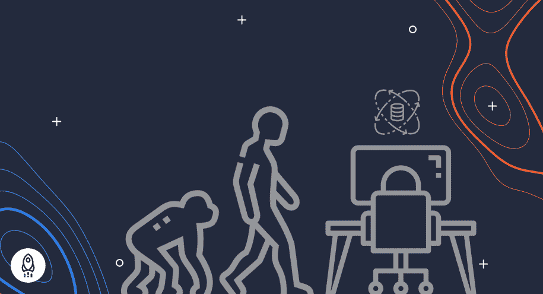
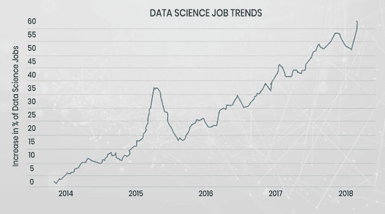

# 数据科学的演变:增长与创新

> 原文：<https://www.dataquest.io/blog/evolution-of-data-science-growth-innovation/>

October 21, 2021

术语“数据科学”以及实践本身已经发展了多年。近年来，由于世界范围内数据收集、技术和大规模数据生产方面的创新，它的受欢迎程度有了相当大的提高。那些处理数据的人不得不依赖昂贵的程序和大型机的日子已经一去不复返了。像 Python 这样的编程语言以及收集、分析和解释数据的过程的激增为数据科学成为今天的热门领域铺平了道路。

数据科学始于统计学。数据科学发展的一部分是包含了机器学习、人工智能和物联网等概念。随着新信息的涌入和企业寻求增加利润和做出更好决策的新途径，数据科学开始扩展到其他领域，包括医学、工程等。

在本文中，我们将分享数据科学发展的简明摘要-从其作为统计学家梦想的卑微开端到其作为每个可以想象的行业认可的独特科学的当前状态。

在本文中，我们将分享数据科学发展的简明摘要-从其作为统计学家梦想的卑微开端到其作为每个可以想象的行业认可的独特科学的当前状态。

## 起源、预测、开端

我们可以说，数据科学诞生于应用统计学与计算机科学相结合的想法。由此产生的研究领域将利用现代计算的非凡能力。科学家们意识到，他们不仅可以收集数据和解决统计问题，还可以使用这些数据来解决现实世界的问题，并做出可靠的基于事实的预测。

**1962:** 美国数学家约翰·w·图基(John W. Tukey)首次阐述了数据科学梦想。在他现在著名的文章《数据分析的未来》中，他预见到在第一台个人电脑出现前近二十年一个新领域的必然出现。虽然图基走在了时代的前面，但他并不是唯一一个早期欣赏后来被称为“数据科学”的人。另一位早期人物是丹麦计算机工程师彼得·诺尔，他的著作《计算机方法简明概览》提供了数据科学的最早定义之一:

一旦建立了数据，处理数据的科学，而数据与其所代表的关系则委托给其他领域和科学

**1977:** 随着国际统计计算协会(IASC)的成立，Tukey 和 Naur 等“前”数据科学家的理论和预测变得更加具体，该协会的使命是“将传统统计方法、现代计算机技术和领域专家的知识联系起来，以便将数据转化为信息和知识。”

**20 世纪 80 年代和 90 年代:**随着第一次数据库知识发现(KDD)研讨会的出现和国际船级社联合会(IFCS)的成立，数据科学开始迈出更大的步伐。这两个学会是第一批专注于教育和培训数据科学理论和方法专业人员的学会(尽管该术语尚未被正式采用)。

正是在这一点上，数据科学开始获得希望将大数据和应用统计货币化的领先专业人士的更多关注。

**1994:** 《商业周刊》发表了一篇关于“ [数据库营销新现象的报道。](https://www.bloomberg.com/news/articles/1994-09-04/database-marketing) “它描述了企业收集和利用大量数据来更多地了解他们的客户、竞争或广告技巧的过程。当时唯一的问题是，这些公司被大量信息淹没，超出了它们的管理能力。海量数据引发了人们对为数据管理建立特定角色的第一波兴趣。企业似乎开始需要一种新的员工来让数据为自己服务。

**20 世纪 90 年代和 21 世纪初:**我们可以清楚地看到，数据科学已经作为一个公认的专门领域出现。一些数据科学学术期刊开始发行，Jeff Wu 和 William S. Cleveland 等数据科学支持者继续帮助开发和阐述数据科学的必要性和潜力。

2000 年代:通过提供几乎普及的互联网连接、通信和(当然)数据收集，技术取得了巨大的飞跃。

**2005:** 大数据进场。随着谷歌和脸书等科技巨头发现大量数据，能够处理这些数据的新技术变得必要。Hadoop 迎接了挑战，随后 Spark 和 Cassandra 首次亮相。

**2014:** 由于数据的重要性日益增加，以及组织对发现模式和做出更好的业务决策的兴趣，世界各地对数据科学家的需求开始大幅增长。

来源:https://www . zarantech . com/blog/why-data-science-jobs-is-in-big-demand/

**2015:** 机器学习、深度学习、人工智能(AI)正式进入数据科学领域。这些技术在过去十年中推动了创新——从个性化购物和娱乐到自动驾驶汽车，以及所有将这些人工智能的现实应用有效带入我们日常生活的见解。

**2018:** 该领域的新法规可能是数据科学发展的最大方面之一。

2020 年代:我们看到人工智能、机器学习领域的更多突破，以及对大数据领域合格专业人员不断增长的需求

## 数据科学的未来

看到我们的世界目前有多少是由数据和数据科学驱动的，我们可以合理地问，我们将何去何从？数据科学的未来会怎样？虽然很难确切知道未来的标志性突破是什么，但所有迹象似乎都表明机器学习的至关重要性。数据科学家正在寻找使用机器学习产生更智能和自主的人工智能的方法。

换句话说，数据科学家正在不知疲倦地致力于深度学习的发展，以使计算机更加智能。这些发展可以带来先进的机器人技术和强大的人工智能。专家预测，在一个前所未有的互联世界中，人工智能将能够理解人类、自动驾驶汽车和自动化公共交通，并与之无缝互动。数据科学将使这个新世界成为可能。

也许，从更令人兴奋的一面来看，我们可能会在不久的将来看到一个大范围自动化劳动的时代。预计这将彻底改变医疗保健、金融、运输和国防工业。

## 你怎样才能参与进来？

我们仍处于数据科学革命的早期阶段，这是加入的最佳时机。数据科学是一个令人兴奋和不断发展的职业，只会越来越强大，越来越有必要。随之而来的是对合格人才的大量需求。

对数据科学家的高需求和缺乏有才华的专业人士为有志学习者创造了独特的机会。不同行业和组织越来越多地采用数据科学应用将继续推动需求进一步增长。有了 Dataquest，您可以通过参加我们的 [数据科学职业道路](https://www.dataquest.io/path/data-scientist/) 来实现您的职业目标，这将使您在不到一年的时间内从初学者到工作就绪。